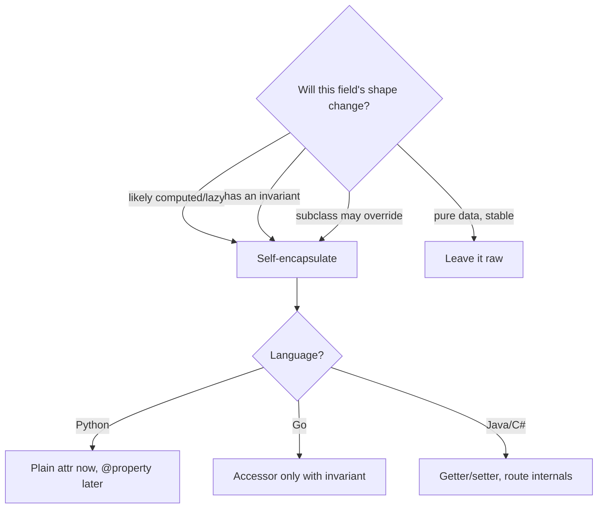

# Self-Encapsulation — Middle Level

> **Category:** [Object & State Patterns](../README.md) — route internal field access through accessors so representation, validation, and laziness can change behind a single method.

> **Prerequisite:** [Junior](junior.md)
> **Focus:** **Why** and **When**

---

## Table of Contents

1. [Introduction](#introduction)
2. [When to Self-Encapsulate](#when-to-self-encapsulate)
3. [When NOT to](#when-not-to)
4. [Real-World Cases](#real-world-cases)
5. [Production-Grade Code](#production-grade-code)
6. [Trade-offs](#trade-offs)
7. [Alternatives](#alternatives)
8. [The "Self-Encapsulate Field" Refactoring](#the-self-encapsulate-field-refactoring)
9. [Edge Cases](#edge-cases)
10. [Tricky Points](#tricky-points)
11. [Best Practices](#best-practices)
12. [Summary](#summary)
13. [Diagrams](#diagrams)

---

## Introduction

> Focus: **Why** and **When**

Self-encapsulation pays off precisely when a field's *representation is unstable* — when there's a real chance it will become computed, lazy, validated, or overridable. The middle-level skill is recognizing that threshold, because applying it everywhere produces getter/setter noise, and applying it nowhere produces a painful rewrite the day the field changes.

The decision is a bet on change:

- **A field that will never change shape** (a coordinate in a value object): raw access is fine.
- **A field that *might* become derived** (an order total, a cached price): self-encapsulate now, change the accessor later.
- **A field with an invariant** (`0 ≤ percent ≤ 100`): self-encapsulate so the setter is the only door in.
- **A field a subclass may override**: self-encapsulate so the override actually takes effect.

This file is about reading those signals and knowing the cheaper alternatives.

---

## When to Self-Encapsulate

Self-encapsulate a field when **any** of:

1. **It is likely to become computed** — a total, a count, a formatted view of other state.
2. **It will be lazily initialized or cached** — see [Lazy Initialization](../02-lazy-initialization/junior.md).
3. **It carries an invariant** that a setter should guard.
4. **A subclass may need to override it** — the accessor is the override point.
5. **It crosses a stability boundary** — a framework base class whose template methods call `getX()` so subclasses can substitute.

### Strong-fit examples

- Domain objects with derived values (`Invoice.getTotal()`).
- ORM-backed entities where a "field" may be a lazy DB load.
- Base classes in a framework where subclasses tune behavior.
- Config objects that validate on set.

---

## When NOT to

| Symptom | Better choice |
|---|---|
| A pure data carrier (DTO / value object) | Public fields or a [record](../../../object-oriented-programming/) |
| Python attribute with no validation today | Plain attribute, add `@property` later |
| Go struct with no invariant | Exported field, add a method when needed |
| You added a getter that just `return field;` and never grows | Delete it; it's noise |
| A field truly private to one method | Local variable, not a field |

The cost is real: an accessor per field, plus the cognitive load of "is this getter doing something?" Spend it where representation is genuinely in flux.

---

## Real-World Cases

### 1. Derived total in a domain object

```java
class Invoice {
    private final List<LineItem> items;
    // No 'total' field — it's always derived, accessed via getTotal().
    BigDecimal getTotal() {
        return items.stream().map(LineItem::amount)
                    .reduce(BigDecimal.ZERO, BigDecimal::add);
    }
    boolean isLarge() { return getTotal().compareTo(THRESHOLD) > 0; }
}
```

`isLarge()` never knows whether `total` is stored or computed. That is the Uniform Access Principle in action.

### 2. Lazy resource

```java
class Report {
    private Connection conn;            // not opened yet
    private Connection getConnection() {
        if (conn == null) conn = pool.acquire();   // lazy, behind the accessor
        return conn;
    }
    void render() { getConnection().query("..."); }   // doesn't care it's lazy
}
```

`render()` was written before laziness existed; it never changed.

### 3. Validating setter

```java
class Thermostat {
    private double targetC;
    void setTargetC(double c) {
        if (c < -40 || c > 40) throw new IllegalArgumentException("out of range");
        this.targetC = c;
    }
    void boost() { setTargetC(getTargetC() + 2); }   // boost can't break the invariant
}
```

`boost()` cannot create an illegal state because it writes through the setter.

### 4. Subclass override

```java
class Account {
    private double rate = 0.02;
    double getRate() { return rate; }
    double interest(double balance) { return balance * getRate(); }   // uses accessor
}
class PremiumAccount extends Account {
    @Override double getRate() { return 0.05; }   // interest() now uses 5%
}
```

Because `interest()` calls `getRate()`, the subclass changes behavior with one override.

---

## Production-Grade Code

### Java — invariant guarded by a self-encapsulated setter

```java
public final class Percentage {
    private int value;

    public Percentage(int value) {
        setValue(value);                 // construct through the setter
    }

    public int getValue() { return value; }

    public void setValue(int v) {
        if (v < 0 || v > 100)
            throw new IllegalArgumentException("0..100, got " + v);
        this.value = v;
    }

    // Every internal mutation goes through setValue → invariant always holds.
    public void increaseBy(int delta) { setValue(getValue() + delta); }
    public void halve()               { setValue(getValue() / 2); }
}
```

### Python — start plain, upgrade to `@property`

```python
class Percentage:
    def __init__(self, value: int) -> None:
        self.value = value          # plain attribute, runs the setter below

    @property
    def value(self) -> int:
        return self._value

    @value.setter
    def value(self, v: int) -> None:
        if not 0 <= v <= 100:
            raise ValueError(f"0..100, got {v}")
        self._value = v

    def increase_by(self, delta: int) -> None:
        self.value += delta          # goes through the property setter
```

> **Pythonic note:** the `__init__` assignment `self.value = value` already routes through the property setter — construction validation comes for free. You only introduced `@property` when the invariant appeared; nothing else changed.

### Go — accessor only where the invariant lives

```go
package billing

import "errors"

type Percentage struct {
    value int
}

func NewPercentage(v int) (*Percentage, error) {
    p := &Percentage{}
    if err := p.SetValue(v); err != nil { // construct through the setter
        return nil, err
    }
    return p, nil
}

func (p *Percentage) Value() int { return p.value }

func (p *Percentage) SetValue(v int) error {
    if v < 0 || v > 100 {
        return errors.New("0..100")
    }
    p.value = v
    return nil
}

func (p *Percentage) IncreaseBy(delta int) error {
    return p.SetValue(p.Value() + delta) // invariant preserved
}
```

> **Go note:** there's no `total` getter on a struct that has no invariant. Here the accessor exists *because* the type enforces a range — that is when Go code earns an accessor.

---

## Trade-offs

| Dimension | Self-encapsulated | Raw field access |
|---|---|---|
| Change representation later | One method | Every call site |
| Enforce invariant | One setter | Scattered checks |
| Subclass override | Yes | No |
| Boilerplate | Higher | Lower |
| Reads "what you see is the field" | No (could be computed) | Yes |
| Risk of surprising side effects | Higher | None |

---

## Alternatives

### Immutable value objects

If a field never changes after construction and has no derived behavior, an immutable record sidesteps the question — there are no internal writes to route, and reads are trivially safe.

```java
public record Point(double x, double y) {}     // nothing to self-encapsulate
```

### Python `@property` on demand

The strongest argument for *not* self-encapsulating eagerly: in Python the upgrade path is free, so you defer it until a real need appears. This is the idiomatic default.

### Tell-Don't-Ask

Sometimes the right move is not a getter at all but a behavior method. Instead of `getRate()` leaking out, expose `interest(balance)`. Self-encapsulation governs *internal* access; Tell-Don't-Ask governs *what you expose*.

---

## The "Self-Encapsulate Field" Refactoring

Fowler's mechanics, step by step:

1. **Create a getter and setter** for the field (private if it stays internal).
2. **Find every internal reference** to the raw field.
3. **Replace each read** with the getter, **each write** with the setter — one at a time, testing between changes.
4. **Make the field private** (if it wasn't), so the compiler proves no raw access remains.
5. **Now change the accessor** — make it compute, lazy-init, or validate.

```java
// Step 0 — raw
private double total;
double withTax() { return total * 1.2; }

// Steps 1–3 — introduce + route
private double total;
double getTotal() { return total; }
void setTotal(double t) { this.total = t; }
double withTax() { return getTotal() * 1.2; }

// Step 5 — change behind the accessor, callers untouched
double getTotal() { return items.stream()...sum(); }   // now computed
```

---

## Edge Cases

### 1. Constructor calling an overridable setter

In Java/C#, if a constructor calls `setX()` and a subclass overrides `setX()`, the override runs **before the subclass is initialized** — a classic bug. Either make construction-time setters `final`/`private`, or set the raw field directly in the constructor.

### 2. Getter with hidden cost

A lazy getter mutates state on read. Calling it twice is fine, but it's no longer a "pure read." Document it; don't let `getConnection()` look as cheap as `getName()`.

### 3. Equality and hashing

If `equals`/`hashCode` read the raw field but everything else reads a computed accessor, they can disagree. Keep them consistent — both through the accessor, or both on the canonical field.

---

## Tricky Points

- **Self-encapsulation is about *internal* access, not visibility.** A `private` getter still counts; the field can stay hidden from the world.
- **It is the prerequisite for lazy-init and memoization.** Without it, slipping caching behind a field means editing every caller. With it, you edit one method. See [Memoization](../03-memoization-and-caching/junior.md).
- **Eager getters/setters are a Java-ism.** In Python and Go, the same goal is reached on demand; copying the Java habit produces noise.

---

## Best Practices

1. **Bet on change.** Self-encapsulate fields whose representation is likely to evolve.
2. **Don't pre-emptively wrap stable data.** DTOs and value objects stay raw.
3. **Construct through the setter** to enforce invariants from birth — but beware overridable setters in constructors.
4. **Keep getters side-effect-light**; flag the ones that aren't.
5. **In Python, default to plain attributes** and `@property` on need.
6. **In Go, add an accessor only when it carries an invariant or contract.**

---

## Summary

- Self-encapsulate when a field is likely to become computed, lazy, validated, or overridden.
- The accessor is a one-method seam; raw access scatters the change.
- "Self-Encapsulate Field" is a named, mechanical refactoring.
- Don't over-apply: value objects, Python attributes, and Go structs without invariants stay raw.

---

## Diagrams

### Decision



[← Junior](junior.md) · [Object & State](../README.md) · **Next:** [Senior](senior.md)
