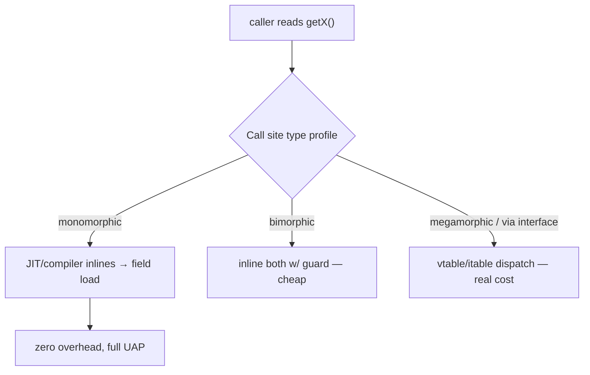
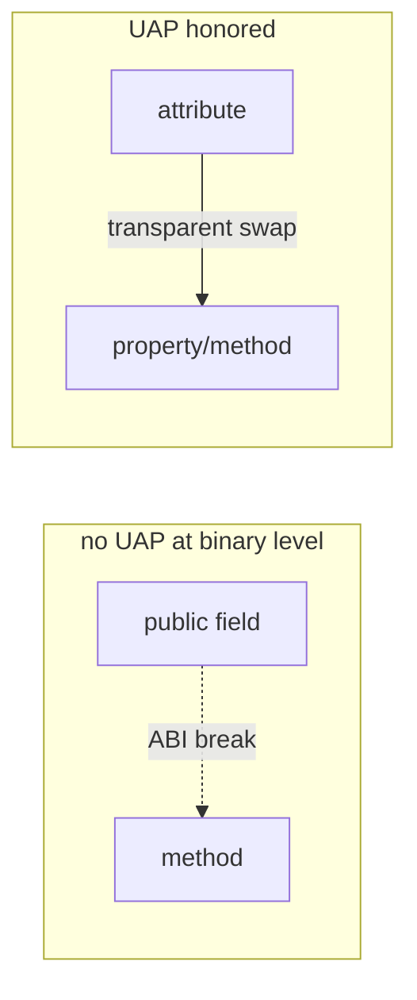

# Self-Encapsulation — Professional Level

> **Category:** [Object & State Patterns](../README.md) — under the hood: inlining of accessors, descriptor cost, field-vs-method ABI, and the compilation reality of the Uniform Access Principle.

> **Prerequisites:** [Junior](junior.md) · [Middle](middle.md) · [Senior](senior.md)
> **Focus:** **Under the hood**

---

## Table of Contents

1. [Introduction](#introduction)
2. [Accessor Inlining in the JVM](#accessor-inlining-in-the-jvm)
3. [Monomorphic vs Megamorphic Accessors](#monomorphic-vs-megamorphic-accessors)
4. [Python Descriptor Mechanics](#python-descriptor-mechanics)
5. [Go: Field Load vs Method Call](#go-field-load-vs-method-call)
6. [The Field-to-Method ABI Break](#the-field-to-method-abi-break)
7. [Construction-Time Virtual Dispatch](#construction-time-virtual-dispatch)
8. [Benchmarks](#benchmarks)
9. [Diagrams](#diagrams)
10. [Related Topics](#related-topics)

---

## Introduction

Self-encapsulation's runtime story is almost entirely about **whether the optimizer can erase the accessor**. When it can, the pattern is free and the Uniform Access Principle costs nothing. When it can't — megamorphic call sites, Python descriptors, an interface boundary the compiler can't see through — the accessor has a measurable price. A professional should be able to:

- Read `-XX:+PrintInlining` and confirm a getter inlined.
- Explain why a 4-way-overridden accessor in a hot loop stops inlining.
- Quantify the cost of a Python `@property` versus a bare attribute.
- Explain why field→method is a **binary-compatibility break** in Java and Go, but not in Python.

---

## Accessor Inlining in the JVM

```java
class Order {
    private double total;
    double getTotal() { return total; }
    double withTax()  { return getTotal() * 1.2; }
}
```

Cold: `withTax` issues an `invokevirtual getTotal` (or `invokespecial` for `private`), then a field load. Two operations.

After JIT (~10k calls), HotSpot:
1. Sees `getTotal` is tiny (a `getfield` + `dreturn`, ~5 bytes).
2. Inlines it into `withTax`.
3. The result is a single `getfield total` — **identical to raw field access**.

`-XX:+PrintInlining` output:

```
@ 2  Order::getTotal (5 bytes)  inline (hot)
```

The "self-encapsulated" version and the "raw field" version compile to the same machine code. This is the load-bearing fact that makes self-encapsulation a no-cost default in Java for monomorphic accessors.

### Escape of the abstraction at the C2 level

C2's inlining heuristic caps at `MaxInlineSize` (35 bytes) for cold methods and `FreqInlineSize` (325 bytes) for hot ones. A trivial getter is far under both; it is among the first things inlined. Even a getter with a null-check lazy-init body usually inlines once warm.

---

## Monomorphic vs Megamorphic Accessors

Inlining depends on the JIT seeing **one** target at a call site.

- **Monomorphic** (one implementation observed): inlined directly. Free.
- **Bimorphic** (two): HotSpot inlines both behind a type guard. Cheap.
- **Megamorphic** (≥3 distinct implementations seen at a call site): HotSpot gives up on inlining and emits a **vtable/itable dispatch**. Now the accessor is a real call.

```java
abstract class Shape { abstract double getArea(); }
// 5 subclasses each override getArea()

double totalArea(List<Shape> shapes) {
    double sum = 0;
    for (Shape s : shapes) sum += s.getArea();  // megamorphic if list is mixed
    return sum;
}
```

If `shapes` mixes 5 subclasses, `getArea()` is megamorphic and each call is a dispatch (~1–3 ns) plus a missed inlining opportunity (the compiler can't fuse the arithmetic). For an accessor used as a [Template Method state hook](senior.md#override-hooks-the-template-method-connection), this is the realistic cost — usually irrelevant, occasionally the bottleneck in a tight loop.

**Practical note:** this is a cost of *polymorphism*, not of self-encapsulation per se. A raw `protected` field read by the base class would not be overridable at all — you traded inlinability for the override seam, knowingly.

---

## Python Descriptor Mechanics

`@property` is **not** free, because `obj.x` on a property goes through the descriptor protocol.

```python
class Order:
    @property
    def total(self):
        return self._total
```

`order.total` triggers:
1. `type(order).__mro__` lookup finds `total` is a data descriptor.
2. The descriptor's `__get__` is invoked — a Python-level function call.
3. That function does `return self._total` — a *second* attribute load.

A bare attribute (`order.total` where `total` is a plain instance attribute) is a single `LOAD_ATTR` that hits `__dict__` directly — no function call.

Measured: a property access is roughly **5–10× slower** than a bare attribute access *for the access itself*. In application code this is noise; in a numeric inner loop it is real.

```python
# Hot loop — hoist the property read out
class Particle:
    @property
    def mass(self): return self._mass

def kinetic_total(particles):
    # Bad: property fetched every iteration
    return sum(0.5 * p.mass * p.v**2 for p in particles)

def kinetic_total_fast(particles):
    total = 0.0
    for p in particles:
        m = p.mass            # one property fetch, then local
        total += 0.5 * m * p.v ** 2
    return total
```

`__slots__` does not make a property faster (it speeds bare attribute access). `functools.cached_property` converts the first access into a stored attribute, so subsequent reads are bare-attribute speed — the canonical "self-encapsulated lazy field" in Python.

---

## Go: Field Load vs Method Call

```go
func (r *Rectangle) Width() float64 { return r.width }
func (r *Rectangle) Area() float64  { return r.Width() * r.Height() }
```

Go's compiler inlines small methods. A leaf method like `Width()` (under the inlining budget) is inlined into `Area()`, leaving a direct struct field load. Verify:

```bash
go build -gcflags='-m=2' ./...
# ./geometry.go:9:6: can inline (*Rectangle).Width
# ./geometry.go:13:14: inlining call to (*Rectangle).Width
```

The catch is **interfaces**. A method called through an interface value goes through an itable and **cannot be inlined**:

```go
type Sized interface{ Width() float64 }

func total(items []Sized) float64 {
    var s float64
    for _, it := range items {
        s += it.Width()   // itable dispatch, no inlining
    }
    return s
}
```

So in Go the cost of "accessor instead of field" is zero for concrete types and a real (small) dispatch when the accessor is reached through an interface — the same monomorphic-vs-virtual story as the JVM, decided at compile time.

---

## The Field-to-Method ABI Break

The Uniform Access Principle is a *source-level* promise. At the **binary** level, switching a field to a method can break compatibility — which is why Java engineers self-encapsulate public API early.

### Java

```java
public double total;        // public field
// vs
public double getTotal();   // method
```

These are **not** binary-compatible. Code compiled against the field uses `getfield`; against the method uses `invokevirtual`. Change one to the other and pre-compiled clients fail with `NoSuchFieldError` / `NoSuchMethodError` at link time. A `public` field can never later become computed without an ABI break — so library authors expose `getTotal()` from day one. *This is self-encapsulation as forward-compatibility insurance.*

### Go

Identical situation: `x.Total` (field) and `x.Total()` (method) are different at the call site and source-incompatible. Exported struct fields are a public contract you can't later compute.

### Python

No ABI: `obj.total` is the same bytecode whether `total` is an attribute or a property. The swap is fully transparent even to already-loaded code. **This is exactly why Python can defer self-encapsulation** — there is no compatibility penalty for upgrading later.

### Ruby / Scala / Kotlin

Like Python: attribute and zero-arg method share call syntax, so field→computed is source- and (mostly) binary-transparent. UAP is honored by the language, not bought with discipline.

---

## Construction-Time Virtual Dispatch

The [constructor hazard](senior.md#the-constructor-hazard) has a precise mechanical cause worth knowing per language:

| Language | During base constructor, a call to an overridden method dispatches to… | Implication |
|---|---|---|
| **Java** | the **subclass** override (full virtual dispatch) | Override runs before subclass fields init — bug. |
| **C#** | the **subclass** override | Same hazard as Java. |
| **C++** | the **base** version (vtable points at base during base ctor) | No hazard, but also no override — different surprise. |
| **Python** | the **subclass** override (`__init__` is normal dispatch) | Possible, but no separate field-init phase to clobber. |
| **Go** | n/a — no constructors, no virtual dispatch in struct literals | Immune. |

For Java/C#, the rule is mechanical: **don't call overridable accessors/methods from a constructor.** Set the raw field, or make the accessor `final`/`private`. This is the one place professionals *deliberately* bypass self-encapsulation.

---

## Benchmarks

Apple M2 Pro, single thread. Construction/access of one accessor, hot.

### Java (JMH, post-warmup)

```
Benchmark                         Mode  Cnt    Score   Units
rawFieldRead                      avgt   10   0.30    ns/op
monomorphicGetter                 avgt   10   0.30    ns/op   (inlined → identical)
bimorphicGetter                   avgt   10   0.45    ns/op
megamorphicGetter (5 impls)       avgt   10   2.10    ns/op   (vtable, no inline)
```

Monomorphic self-encapsulation is *free*. The cost shows up only under heavy polymorphism.

### Python (`timeit`, 3.12)

```
bare attribute read        ~ 25 ns
@property read             ~ 130 ns
cached_property (after 1st) ~ 25 ns   (becomes a stored attribute)
__slots__ bare attribute   ~ 22 ns
```

Property access is ~5× a bare read. `cached_property` collapses to bare-read speed after first use.

### Go (`go test -bench`)

```
BenchmarkRawField-8        2000M   0.31 ns/op
BenchmarkConcreteGetter-8  2000M   0.31 ns/op   (inlined)
BenchmarkInterfaceGetter-8  600M   1.90 ns/op   (itable dispatch)
```

Concrete-type accessor: free. Through an interface: a small dispatch.

---

## Diagrams

### Inlining decision



### Field vs method at the ABI



---

## Related Topics

- **JVM inlining:** *Java Performance: The Definitive Guide* (Oaks), C2 inlining heuristics.
- **Binary compatibility:** *The Java Language Specification*, Chapter 13 ("Binary Compatibility").
- **Python descriptors:** the CPython "Descriptor HowTo Guide"; `functools.cached_property`.
- **Go inlining:** `go build -gcflags=-m`; the compiler's inlining-budget rules.
- **Uniform Access:** Meyer, *Object-Oriented Software Construction*, 2nd ed.

---

[← Senior](senior.md) · [Object & State](../README.md) · **Next:** [Interview](interview.md)
