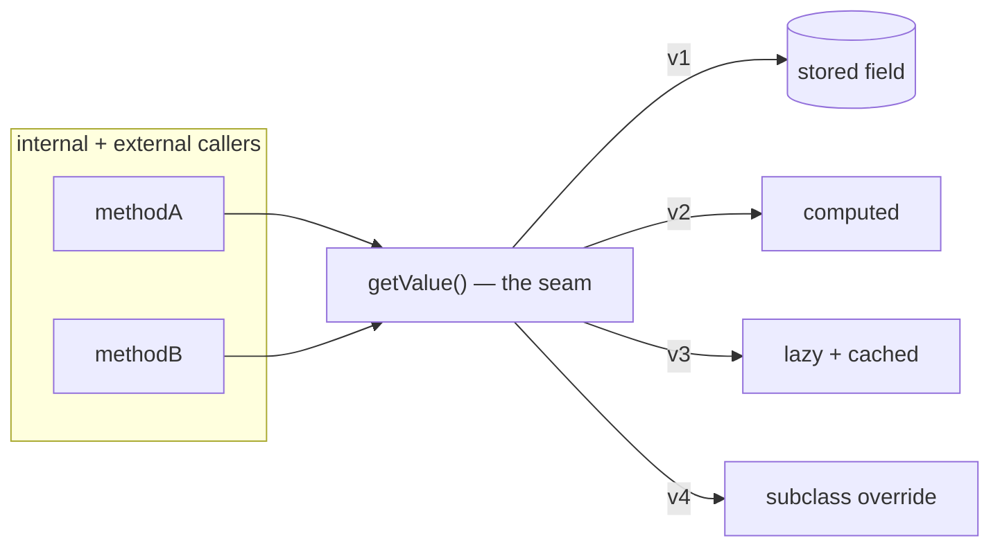
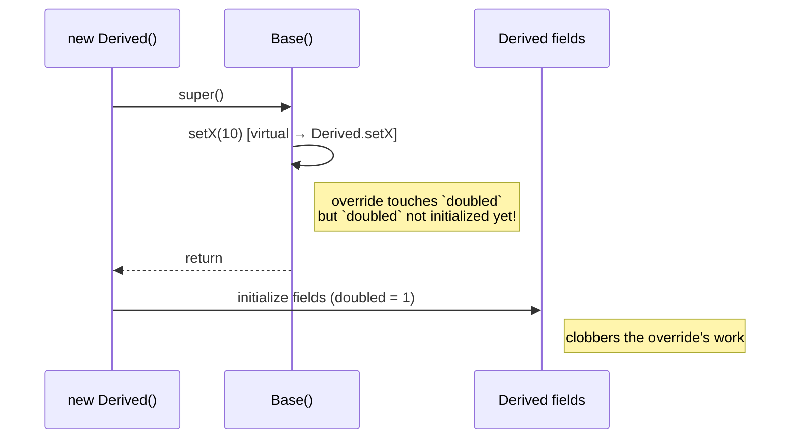

# Self-Encapsulation — Senior Level

> **Category:** [Object & State Patterns](../README.md) — the accessor as an architectural seam: the Uniform Access Principle, override hooks, and the enabler for lazy state.

> **Prerequisites:** [Junior](junior.md) · [Middle](middle.md)
> **Focus:** **Architecture** and **optimization**

---

## Table of Contents

1. [Introduction](#introduction)
2. [The Uniform Access Principle](#the-uniform-access-principle)
3. [The Accessor as a Seam](#the-accessor-as-a-seam)
4. [Override Hooks & the Template Method Connection](#override-hooks-the-template-method-connection)
5. [The Constructor Hazard](#the-constructor-hazard)
6. [Enabling Lazy State & Memoization](#enabling-lazy-state-memoization)
7. [Concurrency](#concurrency)
8. [Performance](#performance)
9. [Language Architecture](#language-architecture)
10. [Liabilities](#liabilities)
11. [Diagrams](#diagrams)
12. [Related Topics](#related-topics)

---

## Introduction

> Focus: **architecture** and **optimization**

At the senior level, self-encapsulation stops being a tidiness habit and becomes a **design lever**. The accessor is a seam in the architectural sense — a point where you can alter behavior without editing callers — and the decision of *which* fields to route through accessors is a decision about *which axes of change you are buying optionality on*.

Senior questions:
- Should this type honor the **Uniform Access Principle** — can callers stay ignorant of stored vs computed?
- Is the accessor an **override hook** for subclasses, or a private internal seam?
- Does routing construction through setters introduce the **overridable-constructor hazard**?
- Is this the seam through which **lazy initialization** or **memoization** will later be threaded — and what does that do to thread-safety and purity?

---

## The Uniform Access Principle

Bertrand Meyer's principle: *"All services offered by a module should be available through a uniform notation, which does not betray whether they are implemented through storage or through computation."*

Self-encapsulation is how you *keep the option open*. A caller writes `order.getTotal()`; whether `total` is a field or a fold over line items is the object's private business.

```java
// Stored
double getTotal() { return total; }

// Computed — same signature, callers unaffected
double getTotal() { return items.stream().mapToDouble(LineItem::amount).sum(); }

// Cached computation — still the same signature
double getTotal() {
    if (cachedTotal == null) cachedTotal = recompute();
    return cachedTotal;
}
```

Languages differ in how *uniform* the notation actually is:

| Language | Storage and computation look the same to the caller? |
|---|---|
| **Python** (`@property`) | **Yes** — `obj.total` is identical whether attribute or property. Full UAP. |
| **Ruby** (`attr_reader` / method) | **Yes** — both are method calls with no parentheses. Full UAP. |
| **Scala** (`val` / `def`) | **Yes** — uniform access by design; `x.total` hides the difference. |
| **Java/C#** | **Partial** — `getTotal()` is a method either way, but a public *field* (`order.total`) is syntactically distinct, so you must commit to the method form up front. |
| **Go** | **No** — a field is `x.total`, a method is `x.Total()`. Switching breaks callers; UAP is not available. |

The practical upshot: in Python/Ruby/Scala you can defer self-encapsulation safely; in Java you should choose the accessor form early for any field that might become computed; in Go you must decide field-vs-method at the API contract.

---

## The Accessor as a Seam

A **seam** (Michael Feathers, *Working Effectively with Legacy Code*) is a place where you can change behavior without editing in that place. Self-encapsulation manufactures seams on demand.

```java
abstract class PricingPolicy {
    private double base;
    protected double getBase() { return base; }     // the seam
    abstract double quote();
}

class StandardPolicy extends PricingPolicy {
    double quote() { return getBase(); }
}
class SurgePolicy extends PricingPolicy {
    @Override protected double getBase() {            // override the seam
        return super.getBase() * surgeMultiplier();
    }
    double quote() { return getBase(); }
}
```

Because `quote()` reads `getBase()`, the `SurgePolicy` reshapes the "field" with one override. Had `quote()` read the raw `base`, the seam would not exist and surge pricing would require editing every subclass.

This is the same mechanism that makes a class **testable**: a test double can override `getClock()` or `getNow()` to inject a fixed time — but only if the class reads time through the accessor, never the raw field or a static.

---

## Override Hooks & the Template Method Connection

Self-encapsulation is the field-level dual of the **Template Method** pattern. Template Method exposes *behavior* hooks (`abstract step()`); self-encapsulation exposes *state* hooks (`getX()`).

```java
abstract class Cache<K, V> {
    // State hook: subclasses decide capacity by overriding the accessor.
    protected int getCapacity() { return 1024; }

    void put(K k, V v) {
        if (size() >= getCapacity()) evict();   // uses the hook
        store(k, v);
    }
}

class SmallCache<K, V> extends Cache<K, V> {
    @Override protected int getCapacity() { return 16; }
}
```

The base class's algorithm calls `getCapacity()` — a self-encapsulated "field" that happens to be overridable. This is strictly more flexible than a `protected final int capacity` set in the constructor, because the subclass can compute capacity dynamically (e.g., from available memory).

**Design caution:** every overridable accessor is part of your inheritance contract. Document what an override is allowed to do. An accessor that other internal methods assume is cheap and pure becomes a footgun if a subclass makes it expensive or stateful.

---

## The Constructor Hazard

The sharpest senior trap in self-encapsulation: **calling an overridable accessor from a constructor**.

```java
class Base {
    private int x;
    Base() { setX(10); }                  // calls overridable setter
    void setX(int v) { this.x = v; }
    int getX() { return x; }
}

class Derived extends Base {
    private int doubled;
    Derived() { super(); this.doubled = 1; }
    @Override void setX(int v) {
        super.setX(v);
        this.doubled = v * 2;             // runs during super() — BEFORE 'doubled' init
    }
}
new Derived();   // setX runs while Derived is half-built; then `doubled=1` clobbers it
```

In Java and C#, the overridden `setX` executes during `super()`, *before* `Derived`'s field initializers and constructor body. The override sees an uninitialized subclass.

**Resolutions:**
- Set the **raw field** directly in the constructor, not via the setter (deliberately bypass self-encapsulation here).
- Make construction-time setters **`final`** or **`private`** so they can't be overridden.
- Prefer **immutable construction** (all-args constructor, no setters).

Python and Go are largely immune: Python has no separate "field initializer phase" hazard of this kind in `__init__`, and Go has no constructors or virtual dispatch during construction. The hazard is specific to languages with virtual dispatch + phased construction (Java, C#, C++).

---

## Enabling Lazy State & Memoization

This is the payoff the whole pattern exists for. Because internal code already calls `getValue()`, you can slip deferred or cached computation behind it with **zero caller changes**.

```java
class Document {
    private List<Token> tokens;            // null until first access
    List<Token> getTokens() {
        if (tokens == null) tokens = parse(rawText);   // lazy, behind the seam
        return tokens;
    }
    int wordCount()  { return getTokens().size(); }    // written before laziness existed
    Stats analyze()  { return new Stats(getTokens()); }
}
```

`wordCount()` and `analyze()` were authored against a stored field. Self-encapsulation let `getTokens()` become lazy without touching them. Generalize the same move to many keyed values and you have [memoization](../03-memoization-and-caching/junior.md); to whole reusable objects and you have an [object pool](../04-object-pool/junior.md).

**The cost of the upgrade:** the moment a getter mutates state, it is no longer safe to call concurrently — see below.

---

## Concurrency

A self-encapsulated getter that *only reads* is trivially thread-safe. The danger appears when you exploit the seam for laziness or caching, because the getter now **writes**.

```java
// Race: two threads may both see tokens == null and both parse.
List<Token> getTokens() {
    if (tokens == null) tokens = parse(rawText);
    return tokens;
}
```

Mitigations (in increasing strength):

```java
// Synchronized accessor — correct, contended
synchronized List<Token> getTokens() {
    if (tokens == null) tokens = parse(rawText);
    return tokens;
}

// Double-checked locking with a volatile field — correct, low-contention
private volatile List<Token> tokens;
List<Token> getTokens() {
    List<Token> t = tokens;
    if (t == null) {
        synchronized (this) {
            t = tokens;
            if (t == null) tokens = t = parse(rawText);
        }
    }
    return t;
}
```

In Go, guard with `sync.Once`:

```go
func (d *Document) Tokens() []Token {
    d.once.Do(func() { d.tokens = parse(d.rawText) })
    return d.tokens
}
```

In Python, the GIL makes a simple lazy property *mostly* safe for a single interpreter, but the check-then-set is still not atomic across threads — guard with a `threading.Lock` if a double-parse is unacceptable.

**Key insight:** self-encapsulation does not make a field thread-safe; it gives you *one place* to add the synchronization, instead of many.

---

## Performance

### The getter is essentially free

A trivial getter (`return field;`) is inlined by every serious runtime:

- **Java HotSpot** inlines small accessors after warmup; the call vanishes into a field load.
- **Go** inlines simple methods at compile time.
- **C#/.NET** JIT inlines property accessors.

So the "extra method call" cost of self-encapsulation is, in practice, **zero** for hot code once the optimizer runs. The exception is **megamorphic** call sites — an accessor overridden by many subclasses, called polymorphically — where the runtime can't inline a single target. That is rare and only matters in genuinely hot loops.

### Python is the outlier

A Python `@property` is a real attribute-descriptor call and is *not* free: it is meaningfully slower than a bare attribute load (roughly an order of magnitude for the access itself, though usually irrelevant against surrounding work). In a hot numeric loop, repeatedly reading `self.value` through a property is a measurable cost — cache it in a local. See [Optimize](optimize.md).

### Don't conflate the seam with the cost behind it

A getter that lazily computes is not "slow because of self-encapsulation" — it's slow because computation is happening. Self-encapsulation only chose *where* that cost lives.

---

## Language Architecture

| Language | Idiomatic self-encapsulation |
|---|---|
| **Java/C#** | Getters/setters; `protected` accessors as override hooks; rely on it heavily because no UAP for fields. |
| **Python** | Plain attributes by default; `@property` upgrade when needed. Eager getters are an anti-idiom. |
| **Go** | Accessors only with an invariant or interface contract; no `Get` prefix; no UAP. |
| **Ruby** | `attr_accessor` generates accessors; overriding the generated method is the seam. Full UAP. |
| **Scala/Kotlin** | `val`/`def` (Scala) and properties with custom getters (Kotlin) give UAP; field-to-computed is transparent. |
| **C++** | Accessors common; constructor hazard exists (virtual dispatch during construction is *suppressed* in C++, unlike Java — a subtle difference). |

A senior reviewer flags two opposite smells: **Java getter cargo-cult in Python/Go** (noise), and **raw field access in a Java class with overridable behavior** (a missing seam).

---

## Liabilities

### Symptom 1: Accessor that lies about cost

`getReport()` triggers a database round-trip but reads like a field. Callers loop over it. Name it `loadReport()` or `computeReport()` to signal the cost.

### Symptom 2: Inconsistent routing

Half the class reads `getX()`, half reads `x`. The seam is half-built and the next maintainer trusts it falsely. Either fully route or don't pretend.

### Symptom 3: Overridable accessor with undocumented contract

A subclass overrides `getCapacity()` to return a value that changes per call; the base class assumed it was stable and cached a derived value from it. The override breaks the base. Document overridable accessor contracts as rigorously as abstract methods.

### Symptom 4: Self-encapsulation masking an Anemic Domain Model

Wrapping every field in get/set and putting all behavior elsewhere is not encapsulation — it's an [Anemic Domain Model](../../anti-patterns/02-design/01-oo-misuse/junior.md) with extra steps. Self-encapsulation is internal plumbing, not a substitute for real behavior on the object.

---

## Diagrams

### The seam over time



### Constructor hazard



---

## Related Topics

- **Next:** [Self-Encapsulation — Professional](professional.md)
- **Practice:** [Interview](interview.md), [Tasks](tasks.md), [Find-Bug](find-bug.md), [Optimize](optimize.md)
- **Enables:** [Lazy Initialization](../02-lazy-initialization/junior.md), [Memoization & Caching](../03-memoization-and-caching/junior.md), [Object Pool](../04-object-pool/junior.md).
- **Principle:** Uniform Access (Meyer); [Information Hiding](../../clean-code/22-abstraction-and-information-hiding/README.md).
- **Anti-patterns:** [Anemic Domain Model / Object Orgy](../../anti-patterns/02-design/01-oo-misuse/junior.md).

---

[← Middle](middle.md) · [Object & State](../README.md) · **Next:** [Professional](professional.md)
