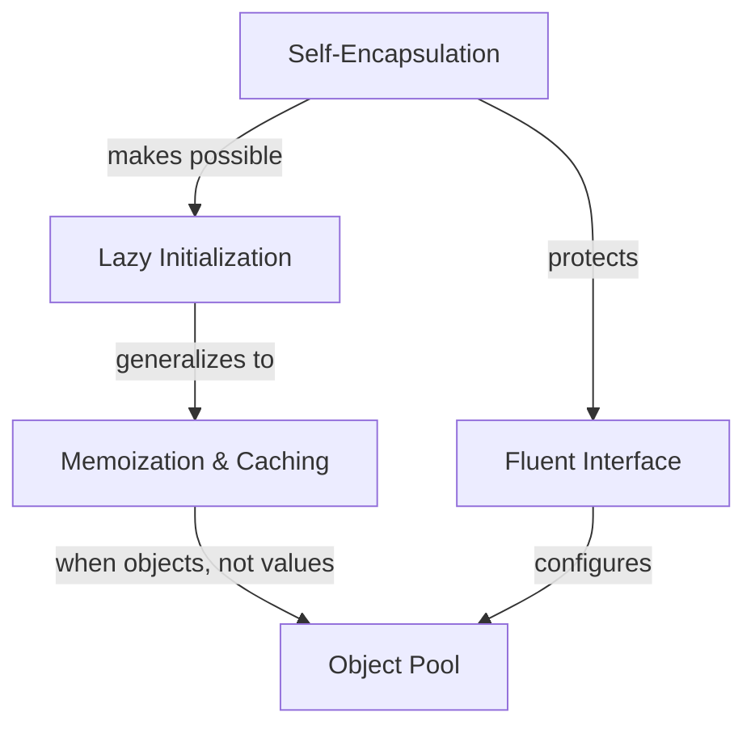

# Object & State Patterns

> *"The hardest questions about an object are not what it does, but when it comes into existence, who is allowed to see its insides, and whether you can afford to make another one."*

---

## What This Category Covers

These five patterns govern an object's **construction, the timing of its state, and its reuse** — the lifecycle decisions that don't show up in a class diagram but dominate readability and performance.

Two themes run through them:

- **Readable, safe construction** — building an object should read like a sentence ([Fluent Interface](01-fluent-interface/junior.md)) and should not couple callers to its internal representation ([Self-Encapsulation](05-self-encapsulation/junior.md)).
- **Paying for state only when it's worth it** — deferring work until it's needed ([Lazy Initialization](02-lazy-initialization/junior.md)), keeping answers you've already computed ([Memoization](03-memoization-and-caching/junior.md)), and recycling objects too expensive to keep recreating ([Object Pool](04-object-pool/junior.md)).

---

## The Five Patterns

| Pattern | Problem it solves | The move |
|---|---|---|
| [Fluent Interface](01-fluent-interface/junior.md) | Verbose, order-obscure construction and configuration | Each method returns the receiver, enabling a readable chain that reads like a DSL |
| [Lazy Initialization](02-lazy-initialization/junior.md) | Paying construction cost for something that may never be used | Create the value on first access and cache it |
| [Memoization & Caching](03-memoization-and-caching/junior.md) | Recomputing the same pure result repeatedly | Store results keyed by inputs; return the stored answer on a hit |
| [Object Pool](04-object-pool/junior.md) | High allocation/teardown cost on a hot path | Borrow from and return to a bounded pool of reusable instances |
| [Self-Encapsulation](05-self-encapsulation/junior.md) | Internal code hard-wired to raw fields, blocking change | Always read/write fields through accessors, even inside the class |

---

## How They Connect

- **Self-encapsulation is the enabler.** Because internal code goes through an accessor, you can later slip lazy-init or memoization logic *behind* that accessor without touching a single caller. Without self-encapsulation, both patterns mean a painful rewrite.
- **Lazy initialization → memoization → object pool** is a progression of the same idea — *don't pay twice* — applied to one value, to many keyed values, and to whole objects.
- **Fluent interface** is the readable face of configuration that the other four often need (pool sizing, cache policy, lazy triggers).

---

## When NOT to Use Them

- **Lazy initialization** and **memoization** trade memory and complexity for time; on a cold or cheap path they add bugs (thread-safety, stale cache) for no benefit.
- **Object pools** are a *last-resort* optimization — modern allocators and garbage collectors make most pools slower and buggier than just allocating. Reach for them only with a profiler in hand (see [optimize.md](04-object-pool/optimize.md)).
- **Fluent interfaces** complicate debugging and stack traces; a plain constructor or [Builder](../../design-patterns/01-creational/03-builder/junior.md) is often clearer.

---

## Related Topics

- **[Builder Pattern](../../design-patterns/01-creational/03-builder/junior.md)** — the GoF pattern most often *implemented* as a fluent interface.
- **[Caching Strategies](../../../../Backend/backend/README.md)** & **[Immutability](../../clean-code/14-immutability/)** — the wider context for memoization and safe shared state.
- **[Object Pool Anti-Patterns](../../anti-patterns/06-performance/README.md)** — how pooling goes wrong.
- **[Encapsulation](../../clean-code/22-abstraction-and-information-hiding/README.md)** — the principle behind self-encapsulation.
