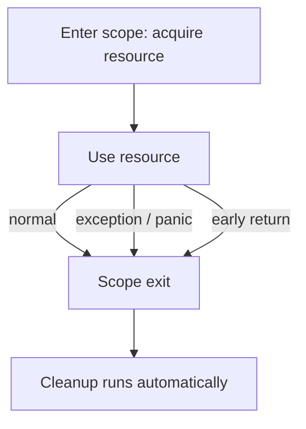
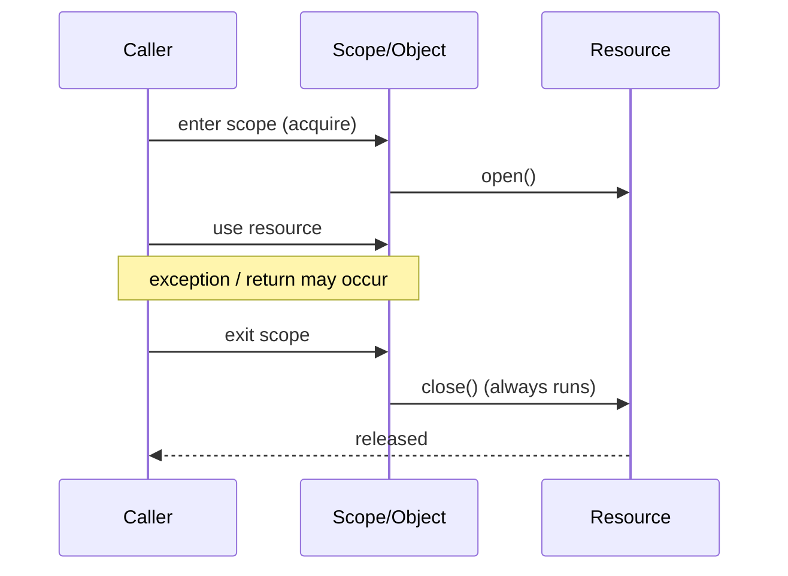

# RAII & Dispose — Junior Level

> **Category:** [Resource & Type-Safety Patterns](../README.md) — bind a resource's lifetime to a scope or object so cleanup happens automatically, even on errors.

---

## Table of Contents

1. [Introduction](#introduction)
2. [Prerequisites](#prerequisites)
3. [Glossary](#glossary)
4. [Core Concepts](#core-concepts)
5. [Real-World Analogies](#real-world-analogies)
6. [Mental Models](#mental-models)
7. [Pros & Cons](#pros-cons)
8. [Use Cases](#use-cases)
9. [Code Examples](#code-examples)
10. [Coding Patterns](#coding-patterns)
11. [Clean Code](#clean-code)
12. [Best Practices](#best-practices)
13. [Edge Cases & Pitfalls](#edge-cases-pitfalls)
14. [Common Mistakes](#common-mistakes)
15. [Tricky Points](#tricky-points)
16. [Test Yourself](#test-yourself)
17. [Cheat Sheet](#cheat-sheet)
18. [Summary](#summary)
19. [Further Reading](#further-reading)
20. [Related Topics](#related-topics)
21. [Diagrams](#diagrams)

---

## Introduction

> Focus: **What is it?** and **How to use it?**

A program borrows things from the operating system it must hand back: file handles, sockets, database connections, locks, memory. Every one of these is a **resource** — finite, and leaked if you forget to release it.

**RAII** — *Resource Acquisition Is Initialization* — is the pattern that makes "release it" automatic. The idea, in one sentence: **tie the resource's lifetime to a scope or object so the language releases it for you when that scope ends — even if an error is thrown.**

### Why this matters

The manual way looks fine until something goes wrong:

```python
f = open("data.txt")
data = process(f.read())   # if process() raises, the next line never runs
f.close()                  # LEAKED on exception
```

The `close()` is *sequentially coupled* to the `open()` — correctness depends on you remembering to call it, on every path, including the error paths you didn't think about. RAII removes the choice:

```python
with open("data.txt") as f:     # acquisition
    data = process(f.read())    # use
# file is closed here — automatically, even if process() raised
```

The `with` block guarantees the file is closed when the block exits, normally or by exception. You can't forget, because there is nothing to remember.

---

## Prerequisites

- **Required:** Functions, scope, and how exceptions / `panic` interrupt normal flow.
- **Required:** What a "resource" is — file, socket, lock, connection.
- **Helpful:** [Fail Fast](../../01-control-flow/02-fail-fast/junior.md) — RAII is fail-fast applied to cleanup.
- **Helpful:** [Guard Clauses](../../01-control-flow/01-guard-clauses-and-early-return/junior.md) — RAII frees you to `return` early without leaking.

---

## Glossary

| Term | Definition |
|------|-----------|
| **Resource** | Anything that must be released: file handle, socket, lock, connection, memory. |
| **RAII** | *Resource Acquisition Is Initialization* — acquiring a resource binds it to an object/scope whose end releases it. |
| **Deterministic cleanup** | Release happens at a known, exact point (scope exit), not "eventually". |
| **Dispose** | The explicit "release me now" method: `close()`, `Dispose()`, `__exit__`. |
| **Scope** | The region of code (a block, a function) the resource's life is tied to. |
| **Finalizer / destructor** | Code that runs when an object is destroyed. Deterministic in C++; **not** reliable in GC languages. |
| **Sequential coupling** | The anti-pattern where you must call methods in a fixed order (open→use→close); RAII dissolves it. |

---

## Core Concepts

### 1. Acquisition is initialization

You acquire the resource *by creating an object* (or entering a scope). Holding the object means holding the resource; the two are inseparable.

### 2. Release is automatic at scope exit

When the object dies or the scope ends, the language runs the cleanup. You write the release logic **once**, in one place, and it fires on every exit path.

### 3. It survives errors and early returns

This is the whole point. An exception, a `panic`, a `return` in the middle — none of them can skip the cleanup, because the cleanup is attached to the scope, not to a line you might jump over.

### 4. Each language has its own keyword

Same idea, different syntax:

| Language | Mechanism |
|---|---|
| C++ | Destructor (`~T()`) runs at scope exit — the original RAII |
| Go | `defer` schedules cleanup for function return |
| Python | `with` + a context manager (`__enter__` / `__exit__`) |
| Java | try-with-resources + `AutoCloseable` |
| C# | `using` + `IDisposable` |

---

## Real-World Analogies

| Concept | Analogy |
|---|---|
| **RAII** | A hotel keycard: checking in (acquire) gives you the room; checking out (scope exit) automatically deactivates it. You don't manually disable the card. |
| **Deterministic release** | A spring-loaded door — let go and it closes *now*, not whenever someone gets around to it. |
| **Finalizer (unreliable)** | "We'll clean the room eventually when housekeeping has time" — maybe today, maybe never. |
| **Leak on error** | Leaving a tap running because the phone rang before you turned it off. |
| **`defer`/`with`** | A "remember to lock up when you leave" sticky note that *the building itself* enforces. |

---

## Mental Models

**The intuition:** *"Whoever opens it owns closing it — and the scope closes it for you."*

```
   acquire ──┐
             │  (use the resource: read, write, query...)
             │  ...an exception or early return may happen here...
   release ──┘  ← runs no matter how the scope exits
```

Compare the two worlds:

```
Manual (sequential coupling):       RAII (lifetime-bound):
  open()                              with open() as f:
  ...use...   ← if this throws,         ...use...
  close()       close() is skipped    # closed automatically
```

The release moves from "a statement you must reach" to "a guarantee the scope enforces."

---

## Pros & Cons

| Pros | Cons |
|------|------|
| Cleanup is automatic — impossible to forget | Requires a deterministic scope (weaker in pure-GC corners) |
| Survives exceptions, panics, early returns | Resource must outlive the scope? Then RAII fights you |
| One release site instead of many | Easy to misuse (`defer` in a loop, double-close) |
| Dissolves sequential coupling | Cleanup order can surprise (LIFO) |
| Reads top-to-bottom; no `finally` noise | Finalizer fallback in GC languages is subtle |

### When to use:
- Any file, socket, connection, lock, or transaction with a clear scope.
- Wherever an error path could skip a `close()`.

### When NOT to use:
- The resource genuinely outlives the function (e.g., a connection pool handed off elsewhere) — then ownership transfers, not RAII at this scope.

---

## Use Cases

- **Files** — open for reading/writing, close on exit.
- **Locks / mutexes** — acquire at block entry, release at exit (lock guards).
- **Database connections & transactions** — commit/rollback + close.
- **Network sockets** — open, use, close deterministically.
- **Temp files & directories** — create, use, delete.
- **Timers / spans** — start a trace span, end it on scope exit.

---

## Code Examples

### Python — `with` / context manager

```python
# Built-in: open() is already a context manager
with open("data.txt") as f:
    process(f.read())
# f.close() called automatically on exit (normal OR exception)

# Multiple resources in one with-block, closed in reverse order:
with open("in.txt") as src, open("out.txt", "w") as dst:
    dst.write(src.read())
# dst closed first, then src (LIFO)
```

Define your own context manager with `__enter__` / `__exit__`:

```python
class Connection:
    def __enter__(self):
        self.handle = db_connect()
        return self.handle
    def __exit__(self, exc_type, exc, tb):
        self.handle.close()          # runs even if the body raised
        return False                 # False = don't suppress the exception

with Connection() as conn:
    conn.query("SELECT 1")
```

### Go — `defer`

```go
func readConfig(path string) ([]byte, error) {
    f, err := os.Open(path)
    if err != nil {
        return nil, err
    }
    defer f.Close()              // scheduled NOW, runs at function return

    return io.ReadAll(f)         // even if this errors, f.Close() still runs
}
```

`defer` registers the cleanup the instant the resource is acquired, and runs it when the **function** returns — on any path.

### Java — try-with-resources

```java
// BufferedReader implements AutoCloseable
try (BufferedReader r = new BufferedReader(new FileReader("data.txt"))) {
    return r.readLine();
}   // r.close() called automatically, even if readLine() throws
```

Any object implementing `AutoCloseable` can go in the `try (...)` header; Java closes it for you.

### C++ — the original RAII (destructors)

```cpp
{
    std::ifstream file("data.txt");   // acquire: constructor opens
    process(file);
}   // scope ends → ~ifstream() runs → file closed. Deterministic.
```

In C++ the destructor runs **exactly** at the closing brace — the canonical, deterministic RAII the other languages imitate.

---

## Coding Patterns

### Pattern 1: Scope-bound lock guard

```python
import threading
lock = threading.Lock()

with lock:                # acquire
    critical_section()    # if this raises, lock is STILL released
# lock.release() automatic
```

```cpp
std::lock_guard<std::mutex> guard(mtx);   // locks
critical_section();                       // unlocked at scope exit, even on throw
```

The lock can never be left held — a classic deadlock source, removed by RAII.

### Pattern 2: Transaction that commits or rolls back

```python
class Transaction:
    def __enter__(self):
        self.tx = db.begin()
        return self.tx
    def __exit__(self, exc_type, exc, tb):
        if exc_type is None:
            self.tx.commit()
        else:
            self.tx.rollback()   # error path: clean up correctly

with Transaction() as tx:
    tx.execute("UPDATE accounts SET balance = balance - 100 WHERE id = 1")
    tx.execute("UPDATE accounts SET balance = balance + 100 WHERE id = 2")
```



---

## Clean Code

### Acquire and release belong together

| ❌ Bad | ✅ Good |
|---|---|
| `open()` at top, `close()` 80 lines later | `with` / `defer` next to the `open` |
| `close()` only on the success path | release tied to the scope, fires always |
| `try { } finally { close(); }` everywhere | `try (...) { }` / `with` — language closes it |

### Name the cleanup clearly

The release method should say what it does: `close()`, `Dispose()`, `release()` — not `cleanup2()` or `done()`.

---

## Best Practices

1. **Use the language's RAII keyword** — `with`, `defer`, try-with-resources, `using`. Don't hand-roll `try/finally` when a built-in exists.
2. **Acquire as late as possible, release at scope exit.** Don't open a file pages before you read it.
3. **Put `defer f.Close()` immediately after a successful open** (Go), so it can't be skipped.
4. **Make `close()` idempotent** — calling it twice should be safe.
5. **One resource, one owner.** Whoever acquires it is responsible for the scope that releases it.

---

## Edge Cases & Pitfalls

- **`defer` inside a loop (Go):** deferred calls run at *function* end, not loop-iteration end. A loop opening 10,000 files defers 10,000 closes — all held open until the function returns. Close inside the loop (often via a helper function) instead.
- **Double close:** closing an already-closed resource may throw or corrupt state. Guard or make it idempotent.
- **Use-after-close:** holding a reference and using it after the scope closed → error or garbage.
- **Exception while closing:** `close()` itself can fail. In a multi-resource scope, the others must still close.

---

## Common Mistakes

1. **Calling `close()` manually on the success path only** — the error path leaks.
2. **`defer` in a loop** — resources pile up until the function ends.
3. **Relying on `__del__` / `finalize()` for cleanup** — these run at garbage-collection time, which may be much later or never (covered in [middle](middle.md)).
4. **Returning the open resource out of the scope** that closes it — it's already closed when the caller uses it.
5. **Forgetting that opening can fail** — don't `defer Close()` on a `nil`/failed handle.

---

## Tricky Points

- **Cleanup is LIFO.** Last acquired is first released. `defer A; defer B` runs `B` then `A`. This matters when resource B depends on A.
- **`with` can suppress exceptions.** A Python `__exit__` returning `True` swallows the exception — almost always a bug.
- **RAII ≠ garbage collection.** GC reclaims *memory* eventually; RAII releases *resources* deterministically. A leaked file handle is not a memory leak the GC will fix.

---

## Test Yourself

1. What does RAII stand for, and what is the core idea?
2. Why is `f.close()` on the last line of a function unsafe?
3. Name the RAII mechanism in Go, Python, Java, and C++.
4. What's the bug with `defer` inside a loop?
5. Why can't you rely on a finalizer (`__del__`) to close a file?

<details><summary>Answers</summary>

1. *Resource Acquisition Is Initialization.* Tie a resource's lifetime to a scope/object so release is automatic and deterministic, even on errors.
2. If anything between `open` and `close` throws or returns early, `close()` is skipped — the handle leaks.
3. Go: `defer`. Python: `with` / context manager. Java: try-with-resources (`AutoCloseable`). C++: destructor.
4. `defer` runs at function return, not per iteration — all the resources stay open until the function ends.
5. Finalizers run at GC time, which is non-deterministic and may never happen before the program exhausts handles.

</details>

---

## Cheat Sheet

```python
# Python
with open("f") as f: ...          # auto-close
```

```go
// Go
f, _ := os.Open("f"); defer f.Close()
```

```java
// Java
try (var r = new FileReader("f")) { ... }
```

```cpp
// C++
{ std::ifstream f("f"); /* ~ifstream at brace */ }
```

---

## Summary

- RAII binds a **resource's lifetime to a scope/object** so cleanup is automatic and **deterministic**.
- It survives exceptions, panics, and early returns — the release can't be skipped.
- Each language has its keyword: `defer`, `with`, try-with-resources, `using`, C++ destructors.
- It dissolves the **sequential coupling** of open→use→close.
- Don't trust finalizers for cleanup; do use the scope mechanism.

---

## Further Reading

- [Python `contextlib` documentation](https://docs.python.org/3/library/contextlib.html)
- [Go blog: Defer, Panic, and Recover](https://go.dev/blog/defer-panic-and-recover)
- *Effective Java* (Joshua Bloch), Item 9 — "Prefer try-with-resources to try-finally"
- [cppreference: RAII](https://en.cppreference.com/w/cpp/language/raii)

---

## Related Topics

- **Next:** [RAII & Dispose — Middle](middle.md)
- **Closely related:** [Fail Fast](../../01-control-flow/02-fail-fast/junior.md), [Guard Clauses](../../01-control-flow/01-guard-clauses-and-early-return/junior.md).
- **Anti-pattern it cures:** [Sequential Coupling](../../../anti-patterns/02-design/README.md).
- **Companion:** [Type-Safe Enums](../02-type-safe-enums/junior.md), [Sentinel & Special Values](../03-sentinel-and-special-values/junior.md).

---

## Diagrams



[Resource & Type-Safety](../README.md) · [Coding Patterns](../../README.md) · [Roadmap](../../../../README.md) · **Next:** [Middle](middle.md)
