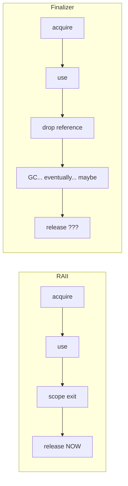
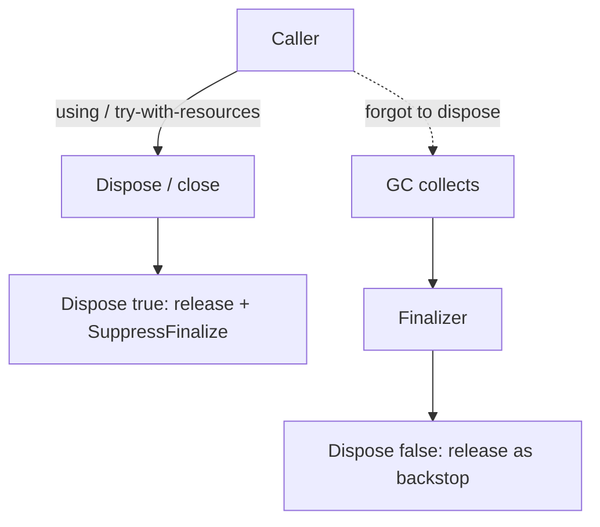

# RAII & Dispose — Middle Level

> **Category:** [Resource & Type-Safety Patterns](../README.md) — bind a resource's lifetime to a scope so cleanup is deterministic, never left to the garbage collector.

> **Prerequisite:** [Junior](junior.md)
> **Focus:** **Why** and **When**

---

## Table of Contents

1. [Introduction](#introduction)
2. [Deterministic Cleanup vs Finalizers](#deterministic-cleanup-vs-finalizers)
3. [When to Use RAII](#when-to-use-raii)
4. [When NOT to Use RAII](#when-not-to-use-raii)
5. [Real-World Cases](#real-world-cases)
6. [Production-Grade Code](#production-grade-code)
7. [The Dispose Pattern](#the-dispose-pattern)
8. [Trade-offs](#trade-offs)
9. [Refactoring Toward RAII](#refactoring-toward-raii)
10. [Edge Cases](#edge-cases)
11. [Tricky Points](#tricky-points)
12. [Best Practices](#best-practices)
13. [Summary](#summary)
14. [Diagrams](#diagrams)

---

## Introduction

> Focus: **Why** and **When**

At the junior level RAII is "use `with` / `defer`." The middle-level skill is understanding **why deterministic cleanup beats the alternatives**, and **where each language's mechanism breaks down**.

The central tension: garbage-collected languages reclaim *memory* automatically but make *resource* release a manual decision. A `File` object's memory will be freed by the GC — but the OS file handle it wraps must be closed by *you*, deterministically, or you exhaust the process's handle table while the GC is none the wiser. RAII is how you get C++-style determinism inside a GC language.

---

## Deterministic Cleanup vs Finalizers

A **finalizer** (`finalize()` in Java, `__del__` in Python, `~Object()` in C#) is code the runtime *may* run when it collects an object. It looks like RAII but is the opposite of it:

| | RAII (`with`/`defer`/`using`) | Finalizer (`__del__`/`finalize`) |
|---|---|---|
| **When it runs** | Exactly at scope exit | At GC time — *if ever* |
| **Determinism** | Guaranteed | None |
| **Ordering** | LIFO, predictable | Arbitrary |
| **On crash/exit** | Runs (mostly) | May be skipped entirely |
| **Use for** | Releasing resources | Last-ditch *safety net* only |

Why finalizers fail as cleanup:

```python
class Wrapper:
    def __init__(self): self.f = open("data.txt")
    def __del__(self):  self.f.close()   # ❌ "cleanup" that may never run

w = Wrapper()
# If w lives in a reference cycle, __del__ may be delayed indefinitely.
# Under a crash or os._exit(), it never runs. File handle leaks.
```

The correct stance, captured by the category intro: *don't rely on a human (or a GC) remembering to do the right thing — make the right thing automatic.* `finalize()` was deprecated in Java 9 precisely because it gives a false sense of safety. The legitimate role of a finalizer is a **backstop**: if a caller forgot to `close()`, the finalizer can log a warning and release — but it must never be the *primary* mechanism.

---

## When to Use RAII

Use RAII when **any** of:

1. The resource has a **clear scope** — it's needed for one function or block.
2. **Error paths could skip cleanup** — i.e., almost always.
3. Cleanup **must be timely** — a held lock blocks others; an open transaction holds row locks.
4. The resource is **scarce** — file descriptors, connections, sockets are bounded.

### Strong-fit examples

- File and socket I/O.
- Lock acquisition (mutex guards).
- DB connections, transactions, prepared statements.
- Trace spans, timers, metrics scopes.
- Temp files and directories.

---

## When NOT to Use RAII

| Symptom | Better choice |
|---|---|
| Resource must outlive the creating scope | Transfer ownership (return it; caller takes the scope) |
| Long-lived, shared resource (a pool) | Manage with the pool's own lifecycle, not block scope |
| Cleanup needs to happen on a *different* thread/time | Explicit lifecycle + scheduler, not scope exit |
| Pure value with no external resource | No cleanup needed; RAII is irrelevant |

The key non-use case is **ownership transfer**: if a function opens a connection and *returns it* for the caller to use, the function's scope must **not** close it. RAII applies at whatever scope actually *owns* the resource's lifetime.

---

## Real-World Cases

### 1. Connection that must close on every path

```go
func fetchUser(db *sql.DB, id int) (*User, error) {
    rows, err := db.Query("SELECT name FROM users WHERE id = ?", id)
    if err != nil {
        return nil, err
    }
    defer rows.Close()           // closed whether we return early or not

    if !rows.Next() {
        return nil, ErrNotFound  // rows.Close() STILL runs
    }
    var u User
    if err := rows.Scan(&u.Name); err != nil {
        return nil, err          // and here too
    }
    return &u, nil
}
```

Three return paths, one `defer`. Without it, two of the three leak the result set.

### 2. Lock that must release on panic

```python
import threading
lock = threading.RLock()

def transfer(a, b, amount):
    with lock:                          # acquire
        if a.balance < amount:
            raise InsufficientFunds()   # lock released anyway — no deadlock
        a.balance -= amount
        b.balance += amount
```

If `transfer` raised while holding a hand-managed lock, every future caller would block forever. `with` makes that impossible.

### 3. Java try-with-resources closing in order

```java
try (Connection conn = pool.getConnection();
     PreparedStatement ps = conn.prepareStatement(SQL);
     ResultSet rs = ps.executeQuery()) {
    while (rs.next()) consume(rs);
}   // rs.close(), then ps.close(), then conn.close() — reverse order, all run
```

Three resources, declared in dependency order, closed LIFO so each closes before the one it depends on.

---

## Production-Grade Code

### Python — `contextlib` for resources without a class

```python
from contextlib import contextmanager

@contextmanager
def acquired(resource_factory):
    res = resource_factory()        # setup (like __enter__)
    try:
        yield res                   # hand it to the with-body
    finally:
        res.close()                 # teardown — runs on normal exit AND exception

with acquired(open_socket) as sock:
    sock.send(b"ping")
```

`@contextmanager` turns a generator into a context manager: everything before `yield` is `__enter__`, everything in `finally` is `__exit__`. The `try/finally` is what makes it exception-safe.

### Java — `AutoCloseable` resource wrapper

```java
public final class Lease implements AutoCloseable {
    private final Connection conn;
    private boolean closed = false;

    public Lease(Pool pool) { this.conn = pool.acquire(); }

    public Connection connection() {
        if (closed) throw new IllegalStateException("lease already closed");
        return conn;
    }

    @Override public void close() {
        if (closed) return;          // idempotent: double-close is safe
        closed = true;
        pool.release(conn);
    }
}

// Usage
try (Lease lease = new Lease(pool)) {
    lease.connection().execute(...);
}   // close() returns the connection to the pool, always
```

### Go — `defer` with named-return error capture

```go
func writeReport(path string, data []byte) (err error) {
    f, err := os.Create(path)
    if err != nil {
        return err
    }
    defer func() {
        if cerr := f.Close(); cerr != nil && err == nil {
            err = cerr               // surface a Close() error if the body had none
        }
    }()

    _, err = f.Write(data)
    return err
}
```

For *writable* files, `Close()` can fail (a flush error) — silently `defer f.Close()` would drop that error. The named return lets the deferred closure report it.

---

## The Dispose Pattern

In .NET (and conceptually anywhere with finalizers), the canonical "Dispose pattern" combines deterministic cleanup with a finalizer safety net:

```csharp
public sealed class FileResource : IDisposable
{
    private FileStream stream;
    private bool disposed = false;

    public FileResource(string path) => stream = File.OpenRead(path);

    public void Dispose()
    {
        Dispose(true);
        GC.SuppressFinalize(this);   // we cleaned up; skip the finalizer
    }

    private void Dispose(bool disposing)
    {
        if (disposed) return;        // idempotent
        if (disposing)
            stream?.Dispose();       // release managed resources
        // release unmanaged resources here
        disposed = true;
    }

    ~FileResource() => Dispose(false);  // safety net if Dispose() was never called
}

// Usage
using (var res = new FileResource("data.txt")) { /* ... */ }
```

The pieces:
- **`Dispose(bool)`** — one method does the work; `disposing` distinguishes the deterministic path from the finalizer path.
- **`GC.SuppressFinalize`** — once disposed deterministically, tell the GC to skip the (expensive) finalizer.
- **The finalizer** (`~FileResource`) — *only* a backstop for callers who forgot `using`.
- **`disposed` flag** — makes the whole thing idempotent.

Java's equivalent is `AutoCloseable.close()` plus, if truly necessary, a `Cleaner` (Java 9+) as the safety net — never `finalize()`.

---

## Trade-offs

| Dimension | RAII (`with`/`defer`/`using`) | Manual `try/finally` | Finalizer only |
|---|---|---|---|
| Determinism | High | High | None |
| Forget-proof | Yes | No (must write finally) | N/A |
| Boilerplate | Low | High | Low |
| Ownership transfer | Awkward | Flexible | N/A |
| Timely release | Yes | Yes | No |

---

## Refactoring Toward RAII

Given leaky manual cleanup:

```python
f = open("data.txt")
data = f.read()
result = parse(data)     # if parse() raises, f leaks
f.close()
return result
```

**Step 1 — wrap in `with`:**

```python
with open("data.txt") as f:
    data = f.read()
return parse(data)       # f closed before parse runs — even better, smaller hold
```

**Step 2 — for custom resources, add a context manager / `AutoCloseable`:**

```python
class Resource:
    def __enter__(self): self.h = acquire(); return self.h
    def __exit__(self, *exc): self.h.release(); return False
```

**Step 3 — delete every hand-written `try/finally close()`** that the language mechanism now covers.

---

## Edge Cases

### 1. `defer` in a loop (Go)

```go
for _, path := range paths {
    f, _ := os.Open(path)
    defer f.Close()          // ❌ all closes deferred to FUNCTION end
    process(f)
}
// thousands of files held open simultaneously
```

Fix: extract a function so each iteration has its own scope:

```go
for _, path := range paths {
    func() {
        f, _ := os.Open(path)
        defer f.Close()      // runs at the END OF THIS ITERATION
        process(f)
    }()
}
```

### 2. Acquisition fails

```go
f, err := os.Open(path)
if err != nil {
    return err               // do NOT defer f.Close() — f is nil
}
defer f.Close()              // defer only AFTER a successful open
```

### 3. Exception during close in a multi-resource scope

Java try-with-resources guarantees *all* resources close even if one's `close()` throws; the later exception is attached as a **suppressed exception** to the primary one. Hand-rolled `finally` chains usually drop the secondary failures.

---

## Tricky Points

- **GC reclaiming the object ≠ closing the resource.** Letting a file object go out of scope frees its *memory* eventually but does **not** reliably close the *handle*. Only `close()`/`with`/`defer` does.
- **Suppressing exceptions in `__exit__`.** Returning a truthy value from Python's `__exit__` swallows the body's exception. Almost always wrong; return `False`/`None`.
- **`defer` evaluates arguments immediately.** `defer fmt.Println(x)` captures `x`'s value *now*, but the *call* runs at return. Subtle for logging the final state.
- **Idempotent close.** Pools, wrappers, and safety-net finalizers all assume `close()` can be called twice harmlessly. Guard with a `closed` flag.

---

## Best Practices

1. **Prefer the language mechanism** over `try/finally`: `with`, `defer`, try-with-resources, `using`.
2. **Never use finalizers as primary cleanup.** Backstop only — and prefer `Cleaner`/explicit disposal over `finalize`/`__del__`.
3. **Make `close()`/`Dispose()` idempotent.**
4. **`defer Close()` right after a successful acquire**, never before checking the error.
5. **For writable resources, check the close/flush error** — it can mean data loss.
6. **Hold the resource for the shortest scope** that still does the work.

---

## Summary

- RAII gives **deterministic** cleanup; finalizers (`__del__`/`finalize`) do **not** — use them only as a backstop.
- The Dispose pattern = `Dispose(bool)` + idempotent flag + `SuppressFinalize` + finalizer safety net.
- The killer non-use case is **ownership transfer** — RAII belongs at the scope that truly owns the lifetime.
- Classic traps: `defer` in a loop, deferring before checking the open error, dropping a `Close()` error on writes.

---

## Diagrams

### RAII vs Finalizer timeline



### Dispose pattern paths



[← Junior](junior.md) · [Resource & Type-Safety](../README.md) · [Roadmap](../../../../README.md) · **Next:** [Senior](senior.md)
