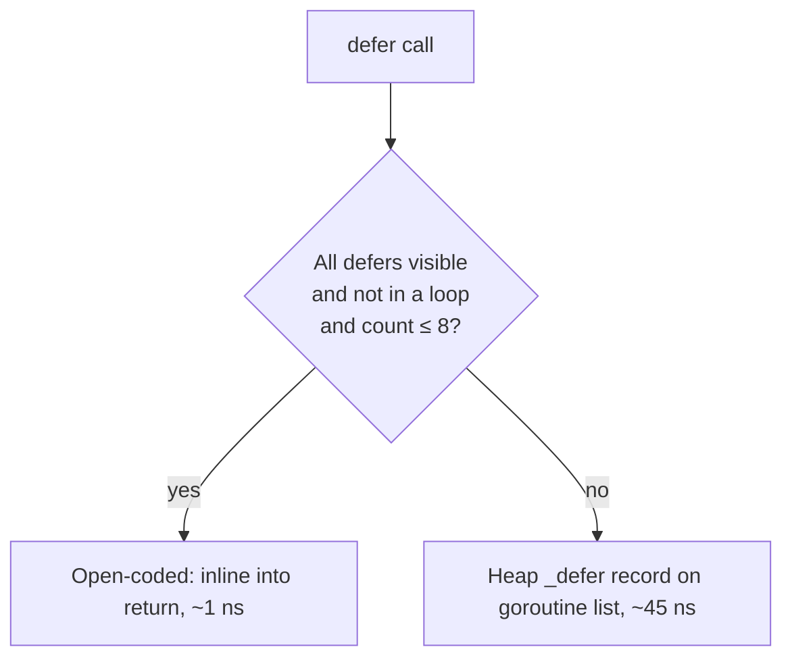
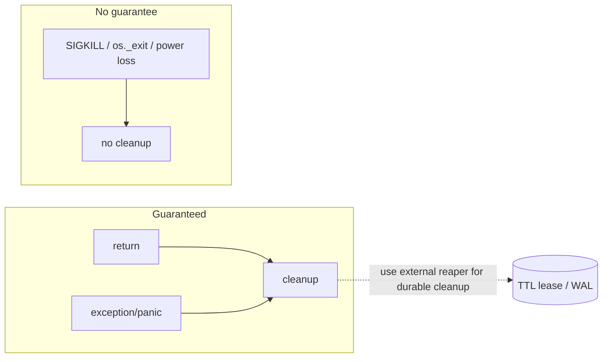

# RAII & Dispose — Professional Level

> **Category:** [Resource & Type-Safety Patterns](../README.md) — how deterministic cleanup is actually implemented by the runtime, and where its guarantees end.

> **Prerequisites:** [Junior](junior.md) · [Middle](middle.md) · [Senior](senior.md)
> **Focus:** **Under the hood**

---

## Table of Contents

1. [Introduction](#introduction)
2. [How `defer` Is Implemented in Go](#how-defer-is-implemented-in-go)
3. [try-with-resources Desugaring (Java)](#try-with-resources-desugaring-java)
4. [The `with` Protocol & Bytecode (Python)](#the-with-protocol-bytecode-python)
5. [C++ Stack Unwinding](#c-stack-unwinding)
6. [Where Determinism Ends](#where-determinism-ends)
7. [GC, Reachability & Cleaners](#gc-reachability-cleaners)
8. [Costs & Benchmarks](#costs-benchmarks)
9. [Diagrams](#diagrams)
10. [Related Topics](#related-topics)

---

## Introduction

RAII's guarantee — "cleanup runs at scope exit, on every path" — is delivered by very different machinery in each runtime. A professional can answer: what does `defer` cost; how does try-with-resources desugar; why does the `with` block run `__exit__` even on a `return`; when does the compiler stack-allocate a `defer`; and precisely where the runtime *cannot* promise cleanup (e.g., `os._exit`, `kill -9`, a panicking destructor).

---

## How `defer` Is Implemented in Go

A `defer` registers a deferred function call to run when the surrounding function returns. The implementation has evolved for performance:

### Heap-allocated defers (the old, slow path)

Pre-1.13, each `defer` allocated a `_defer` record on a per-goroutine linked list (~50 ns). At return, the runtime walked the list LIFO and invoked each.

### Open-coded defers (Go 1.14+)

When the compiler can see all defers in a function (no `defer` inside a loop, ≤ 8 of them), it **inlines** them directly into the return path using a bitmask of which defers are "armed":

```go
func f() {
    f, _ := os.Open(path)
    defer f.Close()        // open-coded: compiled into the return epilogue
    ...
}
```

The `defer f.Close()` becomes roughly a flag set + a direct call emitted before each `return` — cost drops to **~1 ns**, near a normal call. A `defer` in a loop or behind a condition the compiler can't bound falls back to the heap path.

```bash
go build -gcflags='-d=defer' main.go   # shows defer lowering decisions
```

This is why "`defer` in a loop" is both a *correctness* bug (deferred to function end) and a *performance* bug (forces the slow heap path).

---

## try-with-resources Desugaring (Java)

`try (R r = ...) { body }` is pure syntactic sugar. `javac` expands it (roughly) to:

```java
R r = acquire();
Throwable primary = null;
try {
    body;
} catch (Throwable t) {
    primary = t;
    throw t;
} finally {
    if (r != null) {
        if (primary != null) {
            try { r.close(); }
            catch (Throwable suppressed) { primary.addSuppressed(suppressed); }
        } else {
            r.close();
        }
    }
}
```

Observations a professional should be able to derive from this:
- **Suppressed exceptions** exist because the `finally` must close even while propagating the body's `primary`; a `close()` failure can't be allowed to mask it, so it's attached via `addSuppressed`.
- Multiple resources desugar to **nested** try-with-resources, which is why they close LIFO.
- The whole thing is a `finally` — no runtime magic, so the cost is exactly a method call to `close()`.

---

## The `with` Protocol & Bytecode (Python)

`with cm as x:` compiles to bytecode that calls `cm.__enter__()` and guarantees `cm.__exit__(exc_type, exc, tb)` runs. In CPython 3.11+:

```python
with open("f") as f:
    body(f)
```

```
LOAD ... open(...)
BEFORE_WITH          # calls __enter__, pushes __exit__ for later
...body...
LOAD_CONST None x3
CALL  __exit__       # normal-exit path
# on exception: the frame's exception table routes to a cleanup block
WITH_EXCEPT_START    # calls __exit__(exc_type, exc, tb)
```

Two facts fall out of this:
- `__exit__` receives the exception triple, which is how a context manager can *react* (rollback) or *suppress* (return truthy) — suppression is a real, bytecode-level capability, hence the warning never to do it accidentally.
- `with` uses the **zero-cost exception table** (3.11+) rather than setup/teardown opcodes, so the no-exception path costs almost nothing beyond the two method calls.

`contextlib.contextmanager` wraps a generator: `__enter__` runs up to `yield`, `__exit__` resumes it (throwing in the exception case so your `finally`/`except` fires).

---

## C++ Stack Unwinding

C++ RAII is the most deterministic and the most demanding. When a scope exits — by reaching `}`, by `return`, or by a thrown exception **unwinding the stack** — the compiler emits destructor calls for every fully-constructed automatic object, in reverse construction order.

```cpp
void f() {
    Lock a(m1);     // ctor
    Buffer b(1024); // ctor
    risky();        // throws → unwind begins
}                   // ~Buffer() then ~Lock() called during unwinding
```

Critical constraints:
- **Destructors must not throw during unwinding.** A second exception in flight calls `std::terminate`. Mark them `noexcept` (implicit since C++11) and never let cleanup throw.
- The compiler maintains **unwind tables** (e.g., `.eh_frame` on Itanium ABI) mapping each PC to the destructors that must run. Zero cost on the happy path; the cost is paid only when an exception is actually thrown.
- This is why C++ RAII has **zero runtime overhead** absent exceptions — there is no scheduler, no list; the destructor calls are emitted inline at compile time.

---

## Where Determinism Ends

RAII's "always runs" has hard boundaries every professional must know:

| Event | `defer`/`with`/`using`/dtor run? |
|---|---|
| Normal return / exception / panic-recover | **Yes** |
| `os.Exit()` (Go), `System.exit()` mid-stack* (Java), `os._exit()` (Python), `std::abort()` | **No** — process dies immediately |
| `SIGKILL` (`kill -9`), power loss, OOM-killer | **No** — nothing runs |
| Stack overflow during unwinding | Undefined / terminate |
| Goroutine/thread leaked (never returns) | **No** — its defers never fire |
| Finalizer path, process exits before GC | **No** |

\* Java shutdown hooks run on `System.exit()` but try/finally frames above it do not.

The consequence for design: **anything that must survive a crash cannot rely on RAII.** Durable cleanup (releasing a distributed lock, deleting a remote temp object) needs an *external* mechanism — a lease TTL, a reaper, a write-ahead log — because the local scope guarantee evaporates if the process is killed.

---

## GC, Reachability & Cleaners

A finalizer/Cleaner runs only when the object becomes **unreachable** *and* the GC decides to collect it. Two professional-grade gotchas:

### 1. Accidental reachability defeats the Cleaner

```java
CLEANER.register(this, cleanupAction);   // if cleanupAction captures `this`,
                                         // `this` is reachable forever → never cleaned
```

The cleanup action must hold the raw resource (a `long handle`, a `Closeable`) but **not** the wrapper object — otherwise it pins the object alive and the safety net never fires. This is why senior-level Cleaner code uses a **static** state class.

### 2. Resurrection & ordering

`__del__` (Python) and `finalize` (Java) can resurrect an object (store `self` somewhere). The runtime then can't promise the finalizer runs again, and finalization order among mutually-referencing objects is unspecified. Modern runtimes (Cleaner, `weakref.finalize`) deliberately remove these footguns.

```python
import weakref
class Resource:
    def __init__(self):
        self._h = acquire()
        # weakref.finalize: callback must NOT reference self
        self._fin = weakref.finalize(self, _release, self._h)
    def close(self):
        self._fin()            # deterministic; idempotent; cancels the backstop
```

`weakref.finalize` is Python's modern equivalent of Java's `Cleaner` — a backstop that doesn't capture `self` and is callable deterministically.

---

## Costs & Benchmarks

Apple M2 Pro, single thread; indicative numbers.

### Go — `defer` cost

```
BenchmarkDirectCall-8           1000M   0.5 ns/op
BenchmarkOpenCodedDefer-8        900M   1.1 ns/op     (Go 1.14+, simple function)
BenchmarkLoopDefer-8              30M  ~45.0 ns/op     (heap path; also a leak bug)
```

Open-coded defer is essentially free; the heap path (loops, conditional defers) is ~40× costlier.

### Java — try-with-resources

```
DirectCloseFinally     thrpt   10   ~equal
TryWithResources       thrpt   10   ~equal     (desugars to the same finally)
```

No measurable difference — it *is* a `finally`. The only added cost is `addSuppressed` bookkeeping, paid only on the exception path.

### Python — `with` vs manual

```
manual try/finally        ~120 ns/op
with (built-in CM)        ~130 ns/op   (3.11+ zero-cost exception table)
contextlib.contextmanager ~300 ns/op   (generator setup/teardown overhead)
```

`@contextmanager` is convenient but ~2–3× the cost of a hand-written `__enter__/__exit__` class — relevant only on hot paths.

### Cleaner / finalizer

```
explicit close()                ~tens of ns
Cleaner-triggered cleanup        deferred to GC; unbounded latency
finalize() (deprecated)          adds a GC phase; objects survive ≥2 GC cycles
```

Finalization makes objects survive **extra GC cycles** (the collector must run the finalizer, then collect on a later cycle) — a real throughput cost, another reason to call `SuppressFinalize`/`close()` deterministically.

---

## Diagrams

### `defer` lowering decision (Go)



### Determinism boundary



---

## Related Topics

- **Go runtime:** Go source `src/runtime/panic.go` (deferproc / open-coded defer), and the Go 1.14 defer optimization notes.
- **Java:** *JLS* §14.20.3 (try-with-resources), `java.lang.ref.Cleaner` docs.
- **Python:** CPython `ceval.c` `BEFORE_WITH`/`WITH_EXCEPT_START`, PEP 343 (the `with` statement).
- **C++:** Itanium C++ ABI exception handling; *Exceptional C++* (Sutter) on exception safety.

---

[← Senior](senior.md) · [Resource & Type-Safety](../README.md) · [Roadmap](../../../../README.md) · **Next:** [Interview](interview.md)
