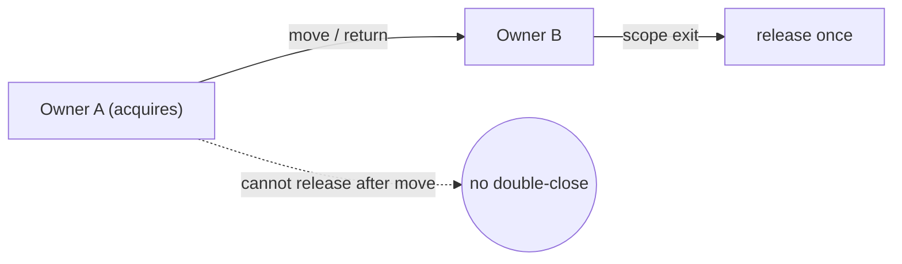
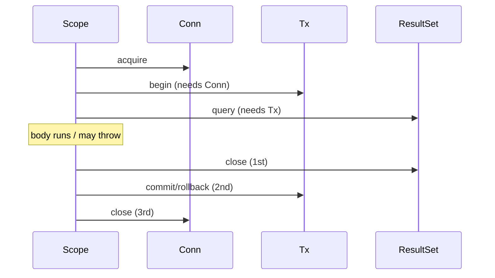

# RAII & Dispose — Senior Level

> **Category:** [Resource & Type-Safety Patterns](../README.md) — treat a resource's lifetime as part of its type, so release is a structural guarantee rather than a discipline.

> **Prerequisites:** [Junior](junior.md) · [Middle](middle.md)
> **Focus:** **Architecture** and **ownership**

---

## Table of Contents

1. [Introduction](#introduction)
2. [Ownership & Move Semantics](#ownership-move-semantics)
3. [Cleanup Ordering & Exception Safety](#cleanup-ordering-exception-safety)
4. [Architecting Resource Lifetimes](#architecting-resource-lifetimes)
5. [The Finalizer Safety Net, Done Right](#the-finalizer-safety-net-done-right)
6. [Composing Resources](#composing-resources)
7. [Concurrency & Locks](#concurrency-locks)
8. [Code Examples — Advanced](#code-examples-advanced)
9. [Liabilities](#liabilities)
10. [Migration Patterns](#migration-patterns)
11. [Diagrams](#diagrams)
12. [Related Topics](#related-topics)

---

## Introduction

> Focus: **architecture** and **ownership**

At the senior level RAII stops being a per-function idiom and becomes a question of **who owns each resource's lifetime, and across what boundary**. The hard problems are not "how do I close a file" — they are: a resource acquired in one layer and released in another; a pool that hands out leased connections; a resource captured by a closure that escapes its scope; cleanup ordering between interdependent resources; and making the *type system* enforce ownership.

The category's framing applies directly: RAII is **type safety applied to time** — the resource's *lifetime* becomes part of its type, so the compiler/runtime guarantees release. The senior job is to design types and boundaries so that guarantee actually holds.

---

## Ownership & Move Semantics

RAII presupposes **exactly one owner** at a time. Two owners → double-free / double-close. Zero owners → leak. The model that makes this airtight is **move semantics**: ownership *transfers* rather than copies.

### C++ — `unique_ptr` as the canonical owning handle

```cpp
std::unique_ptr<File> f = std::make_unique<File>("data.txt");
// f owns the File; ~File runs when f dies.
auto g = std::move(f);   // ownership MOVES to g; f is now null
// only g closes the file. Double-close impossible.
```

`unique_ptr` cannot be copied — only moved — so the type system enforces single ownership. Releasing is the destructor; transferring is `std::move`.

### Rust — ownership in the type system, enforced at compile time

```rust
let f = File::open("data.txt")?;   // f owns the handle
let g = f;                          // MOVE: f is no longer usable
// drop(g) (RAII) closes the file exactly once.
// Touching f after the move is a COMPILE error.
```

Rust generalizes C++ RAII: the borrow checker proves at compile time that every resource has one owner and is dropped exactly once. This is RAII with the leaks and double-frees made *unrepresentable*.

### Go / Java / Python — convention, not compiler

These languages have no move semantics, so ownership is a **documented convention**:

- A function that **returns** an open resource transfers ownership; it must *not* `defer Close()`.
- A function that **borrows** a resource (receives it as a parameter) must *not* close it.

```go
// Owns: caller must close the returned file
func openLog() (*os.File, error) { return os.OpenFile("app.log", ...) }

// Borrows: must NOT close f — the owner will
func writeLine(f *os.File, s string) error { _, err := f.WriteString(s); return err }
```

Getting this wrong is the source of most double-close and use-after-close bugs in GC languages.

---

## Cleanup Ordering & Exception Safety

### LIFO is a contract, not a coincidence

Resources release in **reverse acquisition order** because later resources often *depend on* earlier ones.

```java
try (Connection conn = pool.get();              // 1st acquired
     Transaction tx = conn.begin();             // depends on conn
     ResultSet rs = tx.query(sql)) {            // depends on tx
    consume(rs);
}   // rs closes, then tx (commit/rollback), then conn — each before its dependency
```

If `conn` closed before `tx`, the rollback would have no connection to run on. LIFO guarantees the dependency is still alive during cleanup.

### Exception safety levels

A senior reviewer classifies every resource-touching function:

| Guarantee | Meaning |
|---|---|
| **No-throw** | Cleanup never throws (the gold standard for destructors/`close`). |
| **Strong** | On failure, state rolls back as if nothing happened (transactions). |
| **Basic** | No leaks, invariants hold, but partial effects may remain. |

RAII delivers at least the **basic** guarantee automatically: no leaks regardless of how the scope exits. Achieving **strong** (rollback) is the job of the resource's `__exit__`/`Dispose`, as in the transaction examples.

### Exceptions during cleanup

The dangerous case: the body throws, *then* cleanup also throws. The body's exception is the real cause; the cleanup's is noise. Languages handle this differently:

- **Java:** the cleanup exception becomes a **suppressed exception** on the primary — both are preserved (`Throwable.getSuppressed()`).
- **C++:** a destructor that throws during stack unwinding calls `std::terminate`. Hence the rule: **destructors must not throw.**
- **Go/Python:** you must handle this manually; naive code loses the original error.

---

## Architecting Resource Lifetimes

### Lifetime should match a natural boundary

| Lifetime | Boundary | Mechanism |
|---|---|---|
| One operation | Function/block | `defer` / `with` / try-with-resources |
| One request | HTTP request scope | request-scoped DI + middleware cleanup |
| Application | Process | startup/shutdown hooks, not scope blocks |
| Pooled | Pool's discretion | lease/return, not destruction |

A common architectural mistake is using block-scope RAII for a request-scoped resource (reopening a connection per query) or, worse, for an app-scoped one. **Match the RAII scope to the lifetime, not the other way around.**

### Leases over raw handles

For pooled resources, don't expose the raw resource — expose a **lease** that, on close, *returns* the resource to the pool instead of destroying it:

```python
@contextmanager
def lease(pool):
    conn = pool.acquire()
    try:
        yield conn
    finally:
        pool.release(conn)   # close == return, not destroy

with lease(pool) as conn:
    conn.execute(...)
```

This keeps the RAII ergonomics (`with`) while the underlying resource lives in the pool.

---

## The Finalizer Safety Net, Done Right

A finalizer must never be primary cleanup — but a *well-built* safety net catches the bug where a caller forgot to close, and **screams about it** rather than silently papering over the leak.

### Java — `Cleaner` (the modern replacement for `finalize`)

```java
public final class NativeBuffer implements AutoCloseable {
    private static final Cleaner CLEANER = Cleaner.create();

    private final long handle;                 // unmanaged resource
    private final Cleaner.Cleanable cleanable;

    private static final class State implements Runnable {
        final long handle;
        State(long h) { this.handle = h; }
        public void run() {                    // safety-net path
            free(handle);
            System.getLogger("leak").log(WARNING, "NativeBuffer not closed()!");
        }
    }

    public NativeBuffer(int size) {
        this.handle = alloc(size);
        this.cleanable = CLEANER.register(this, new State(handle));
    }

    @Override public void close() {
        cleanable.clean();                     // deterministic path; idempotent
    }
}
```

Key properties:
- The cleanup **State is a static class** — if it captured `this`, the object could never become unreachable, defeating the Cleaner.
- `close()` and the Cleaner share one `Cleanable`, so cleanup runs **once**.
- The safety net **logs the leak** so it surfaces in testing, not just silently fixes it.

This mirrors .NET's `Dispose(bool)` + `GC.SuppressFinalize` (covered in [middle](middle.md)): deterministic primary path, GC-time backstop, idempotent, and noisy on misuse.

---

## Composing Resources

When one resource wraps another, the wrapper owns the inner resource's lifetime and must release it:

```python
class BufferedConnection:
    def __init__(self, host):
        self._sock = socket.create_connection(host)   # acquires inner
        self._buf = Buffer()
    def __enter__(self): return self
    def __exit__(self, *exc):
        try:
            self._buf.flush(self._sock)   # may use the socket — order matters
        finally:
            self._sock.close()            # then release inner, always
        return False
```

The wrapper's `__exit__` must close the inner resource **in `finally`**, so a flush failure still releases the socket. Composition makes ordering and exception-safety the wrapper's responsibility.

---

## Concurrency & Locks

### Lock guards are RAII's killer app

A held lock not released on an error path is a **deadlock** — the single most common production hang. RAII makes it structurally impossible:

```cpp
{
    std::scoped_lock lk(mtx_a, mtx_b);   // acquires both, deadlock-free ordering
    critical_section();
}   // releases both at scope exit, even on throw
```

```python
with lock_a, lock_b:        # acquired; both released LIFO on any exit
    critical_section()
```

### The subtle trap: releasing on a different thread

RAII assumes the releasing thread is the acquiring thread/scope. If a resource is captured by a closure that runs on another goroutine/thread, the original scope's `defer`/`with` may fire while the resource is still in use elsewhere — a **use-after-close** race. Ownership must transfer *with* the work:

```go
f, _ := os.Open(path)
go func() {
    defer f.Close()       // ✅ the goroutine now OWNS f's lifetime
    process(f)
}()
// do NOT defer f.Close() in the outer function — that would race
```

---

## Code Examples — Advanced

### Go — `errgroup`-style cleanup aggregation

```go
type Closer struct{ closers []io.Closer }

func (c *Closer) Add(x io.Closer) { c.closers = append(c.closers, x) }

func (c *Closer) Close() error {
    var err error
    for i := len(c.closers) - 1; i >= 0; i-- {   // LIFO
        if cerr := c.closers[i].Close(); cerr != nil && err == nil {
            err = cerr                            // keep first error, keep closing
        }
    }
    return err
}
```

A reusable LIFO multi-closer: every resource closes even if an earlier one errors, preserving the first failure.

### Python — `ExitStack` for dynamic resource sets

```python
from contextlib import ExitStack

def open_all(paths):
    with ExitStack() as stack:
        files = [stack.enter_context(open(p)) for p in paths]
        # all files open; ExitStack closes ALL of them (LIFO) on exit,
        # even if opening file #7 raised (the first 6 still close).
        return merge(files)
```

`ExitStack` is RAII for a runtime-determined number of resources — the `with` you can't write statically.

### Java — suppressed exceptions in action

```java
try (var a = new Loud("A"); var b = new Loud("B")) {
    throw new RuntimeException("body");   // primary
}
// If a.close() and b.close() also throw, they attach as suppressed:
// catch (RuntimeException e) { e.getSuppressed() -> [B.close, A.close] }
```

---

## Liabilities

### Symptom 1: `close()` scattered across error paths

Every manual `close()` on an error branch is a leak waiting to be added in the next branch. Replace with one scope-bound mechanism.

### Symptom 2: Finalizer doing real work

If correctness depends on `finalize`/`__del__` running, the design is already broken — it may never run. Move cleanup to deterministic disposal; keep the finalizer as a logging backstop only.

### Symptom 3: Ambiguous ownership

A resource passed around with no clear owner gets closed twice or never. Document (or, in Rust/C++, *type*) the owner.

### Symptom 4: Block-scope RAII for a long-lived resource

Opening/closing a connection per query when it should be pooled. RAII at the wrong granularity is a performance bug.

---

## Migration Patterns

### `try/finally` → try-with-resources

```java
// Before
Connection c = pool.get();
try { use(c); } finally { c.close(); }

// After
try (Connection c = pool.get()) { use(c); }
```

### Finalizer → deterministic dispose + Cleaner

```java
// Before: protected void finalize() { free(handle); }   // deprecated, unreliable
// After:  implements AutoCloseable + Cleaner safety net (see above)
```

### Raw handle → lease (pooling)

```python
# Before: conn = pool.acquire(); ...; pool.release(conn)   # release often skipped
# After:  with lease(pool) as conn: ...                    # release guaranteed
```

### Ad-hoc cleanup → `ExitStack` / multi-closer

Replace nested `try/finally` pyramids for N resources with `ExitStack` (Python) or a LIFO `Closer` (Go).

---

## Diagrams

### Ownership transfer (move)



### LIFO cleanup with dependencies



---

## Related Topics

- **Next:** [RAII & Dispose — Professional](professional.md)
- **Practice:** [Tasks](tasks.md), [Find-Bug](find-bug.md), [Optimize](optimize.md), [Interview](interview.md)
- **Foundations:** [Fail Fast](../../01-control-flow/02-fail-fast/junior.md), [Guard Clauses](../../01-control-flow/01-guard-clauses-and-early-return/junior.md)
- **Anti-pattern cured:** [Sequential Coupling](../../../anti-patterns/02-design/README.md)
- **Concurrency:** lock guards connect to the broader [concurrency](https://en.cppreference.com/w/cpp/thread) story.

---

[← Middle](middle.md) · [Resource & Type-Safety](../README.md) · [Roadmap](../../../../README.md) · **Next:** [Professional](professional.md)
