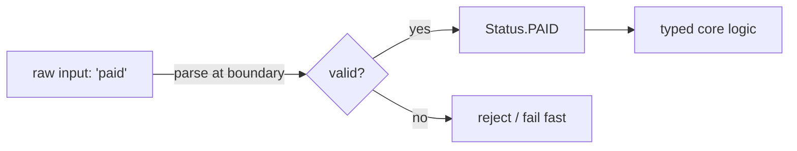
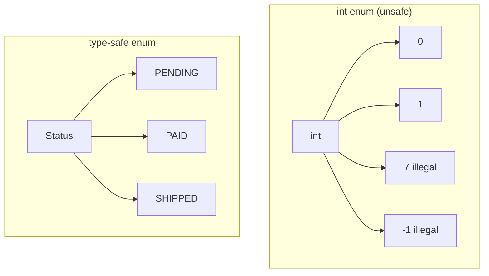

# Type-Safe Enums — Junior Level

> **Category:** [Resource & Type-Safety Patterns](../README.md) — model a fixed set of named choices as a dedicated type the compiler can check, instead of `int`/`String` constants.

---

## Table of Contents

1. [Introduction](#introduction)
2. [Prerequisites](#prerequisites)
3. [Glossary](#glossary)
4. [Core Concepts](#core-concepts)
5. [Real-World Analogies](#real-world-analogies)
6. [Mental Models](#mental-models)
7. [Pros & Cons](#pros-cons)
8. [Use Cases](#use-cases)
9. [Code Examples](#code-examples)
10. [Coding Patterns](#coding-patterns)
11. [Clean Code](#clean-code)
12. [Best Practices](#best-practices)
13. [Edge Cases & Pitfalls](#edge-cases-pitfalls)
14. [Common Mistakes](#common-mistakes)
15. [Tricky Points](#tricky-points)
16. [Test Yourself](#test-yourself)
17. [Cheat Sheet](#cheat-sheet)
18. [Summary](#summary)
19. [Further Reading](#further-reading)
20. [Related Topics](#related-topics)
21. [Diagrams](#diagrams)

---

## Introduction

> Focus: **What is it?** and **How to use it?**

A **type-safe enum** models a *fixed set of named choices* — a traffic light's `RED`/`YELLOW`/`GREEN`, an order's `PENDING`/`PAID`/`SHIPPED` — as a **dedicated type** the compiler understands, rather than as raw `int` or `String` constants.

In one sentence: instead of passing `1`, `2`, `3` (or `"pending"`, `"paid"`) around and hoping every call site uses the right value, you declare a real type so that an illegal value **won't even compile**.

### Why this matters

Here is the anti-pattern this cures — the **"int enum"** (and its cousin, **"stringly-typed"** code):

```java
// "int enum" anti-pattern
public static final int STATUS_PENDING = 0;
public static final int STATUS_PAID    = 1;
public static final int STATUS_SHIPPED = 2;

void process(int status) { ... }

process(7);             // compiles fine — 7 is not a valid status, but int doesn't care
process(STATUS_PAID);   // correct
process(userAge);       // compiles fine — passed the wrong int entirely
```

Nothing stops a caller from passing `7`, a negative number, or an unrelated `int`. There is no namespace (`STATUS_` prefix is a manual hack), no way to list all valid values, and no compiler help when you add a fourth status and forget to handle it somewhere.

The type-safe version makes illegal values **unrepresentable**:

```java
enum Status { PENDING, PAID, SHIPPED }

void process(Status status) { ... }

process(Status.PAID);   // only Status values are accepted
process(7);             // compile error
process(userAge);       // compile error
```

This is **Joshua Bloch's Typesafe Enum pattern**, which became the Java `enum` keyword.

---

## Prerequisites

- **Required:** Constants and basic types in your language.
- **Required:** `switch`/`match` statements.
- **Helpful:** Why "magic numbers" and "magic strings" are considered code smells (see [Magic Numbers / Magic Container](../../anti-patterns/02-design/README.md)).

---

## Glossary

| Term | Definition |
|------|-----------|
| **Enum (enumeration)** | A type whose values are a fixed, named set. |
| **Constant** | A single named member of the enum (`Status.PAID`). |
| **Int enum anti-pattern** | Using `int` constants to represent a closed set of choices. |
| **Stringly-typed** | Using `String` values where a dedicated type belongs. |
| **Exhaustiveness** | The compiler verifying a `switch`/`match` handles every case. |
| **Ordinal** | An enum constant's position (0, 1, 2…) — useful but dangerous to persist. |
| **Namespacing** | Constants live *inside* the type: `Status.PAID`, not a bare `PAID`. |

---

## Core Concepts

### 1. The set of values is closed and known at compile time

An enum is the right tool when you can list *every* legal value up front: days of the week, card suits, HTTP methods. If the set must grow at runtime, an enum is the wrong tool (see [Middle](middle.md)).

### 2. Illegal values are unrepresentable

Because the type only has the declared constants, you literally cannot construct an invalid one. The compiler rejects `7` where a `Status` is expected.

### 3. Values are namespaced

`Status.PAID` and `Color.RED` cannot be confused. There is no global `PAID` polluting your namespace.

### 4. The compiler can check exhaustiveness

A `switch` over an enum can be verified to handle every constant — so when you add a new one, the compiler points at the places you forgot.

---

## Real-World Analogies

| Concept | Analogy |
|---|---|
| **Type-safe enum** | A vending machine with labelled buttons (A1, A2, B1). You can only press a button that exists. |
| **Int enum** | The same machine where you type a raw number — type `99` and the machine jams. |
| **Exhaustiveness** | A checklist where every box must be ticked before you proceed. |
| **Ordinal** | The button's *position* on the panel — rearrange the panel and the positions shift. |

---

## Mental Models

**The intuition:** *"Make the wrong value impossible to write, not just wrong to use."*

```
int enum:        any int  ──► function   (compiler trusts you)
                  ▲
                  └─ 7, -1, userAge all slip through

type-safe enum:  Status ──► function     (compiler guards the door)
                  ▲
                  └─ only PENDING | PAID | SHIPPED exist
```

A type-safe enum draws a fence around the legal values. Everything inside the fence is allowed; nothing outside it can be passed.

---

## Pros & Cons

| Pros | Cons |
|------|------|
| Illegal values are unrepresentable | The value set is closed — runtime extension is awkward |
| Compiler-checked exhaustiveness (where supported) | Slightly more ceremony than a bare `int` |
| Namespaced, self-documenting names | Serialization needs care (don't persist ordinals) |
| Enums can carry data and behavior | Overkill for a one-off pair of values |
| Cures magic numbers / stringly-typed code | Language support varies (Go is weak here — see below) |

### When to use:
- A fixed set of choices known at compile time.
- A value passed around that "should be one of N things".
- A `switch` that branches on a category.

### When NOT to use:
- The set must be extended by plugins/config at runtime → use polymorphism or a registry.
- There are exactly two states *and* a `boolean` reads clearly (but prefer an enum if the two states aren't obviously true/false).

---

## Use Cases

- **Order / payment status** — `PENDING`, `PAID`, `SHIPPED`, `CANCELLED`.
- **Directions / compass** — `NORTH`, `SOUTH`, `EAST`, `WEST`.
- **Log levels** — `DEBUG`, `INFO`, `WARN`, `ERROR`.
- **HTTP methods** — `GET`, `POST`, `PUT`, `DELETE`.
- **Card games** — suits, ranks.
- **State machines** — the set of states a workflow can be in.

---

## Code Examples

### Java — `enum` (the canonical type-safe enum)

```java
public enum Status {
    PENDING, PAID, SHIPPED, CANCELLED
}

void handle(Status s) {
    switch (s) {
        case PENDING   -> notifyAwaitingPayment();
        case PAID      -> reserveStock();
        case SHIPPED   -> sendTracking();
        case CANCELLED -> refund();
    }
}

// Usage
handle(Status.PAID);     // OK
handle("paid");          // compile error — String is not Status
```

**Highlights:**
- `Status` is a real type; only its four constants exist.
- A modern `switch` over an enum can be checked for exhaustiveness.

---

### Python — `enum.Enum`

```python
from enum import Enum

class Status(Enum):
    PENDING = "pending"
    PAID = "paid"
    SHIPPED = "shipped"
    CANCELLED = "cancelled"

def handle(s: Status) -> None:
    match s:
        case Status.PENDING:   notify_awaiting_payment()
        case Status.PAID:      reserve_stock()
        case Status.SHIPPED:   send_tracking()
        case Status.CANCELLED: refund()

# Usage
handle(Status.PAID)       # OK
handle("paid")            # type checker (mypy) flags it; not a Status
```

> **Python note:** `Status.PAID` is a singleton object, so `is` comparisons work and identity is stable. Use `enum.Enum` (not bare strings) so a type checker can catch mistakes.

---

### Go — typed constant + `iota` (with honest limitations)

> **Go note:** Go has **no real enum**. The idiom is a *named integer type* plus `iota`. It gives you namespacing and a distinct type — but it does **not** prevent illegal values or check exhaustiveness. See [Middle](middle.md) for why.

```go
package order

type Status int

const (
    Pending Status = iota // 0
    Paid                  // 1
    Shipped               // 2
    Cancelled             // 3
)

func (s Status) String() string {
    switch s {
    case Pending:   return "pending"
    case Paid:      return "paid"
    case Shipped:   return "shipped"
    case Cancelled: return "cancelled"
    default:        return "unknown"
    }
}

// Usage
var s Status = Paid       // OK, namespaced
var bad Status = 99       // COMPILES — Go does not stop this!
```

The `default: "unknown"` and the fact that `Status(99)` compiles are the Go reality: you get a *named* type, but the compiler will not enforce the closed set for you.

---

## Coding Patterns

### Pattern 1: Replace magic numbers/strings with an enum

```python
# Before — stringly-typed
def set_level(level: str): ...     # "debug"? "DEBUG"? "verbose"? who knows
set_level("dbug")                  # typo, no error until runtime

# After
class Level(Enum):
    DEBUG = 1; INFO = 2; WARN = 3; ERROR = 4

def set_level(level: Level): ...
set_level(Level.DEBUG)             # typo is now a compile/lint error
```

### Pattern 2: Exhaustive switch — let the compiler find missed cases

```java
String label(Status s) {
    return switch (s) {            // switch expression must cover all cases
        case PENDING   -> "Awaiting payment";
        case PAID      -> "Paid";
        case SHIPPED   -> "Shipped";
        case CANCELLED -> "Cancelled";
    };
    // Add a 5th constant and this won't compile until you handle it.
}
```

### Pattern 3: Parse external input into the enum at the boundary

```python
def parse_status(raw: str) -> Status:
    try:
        return Status(raw)             # validate once, at the edge
    except ValueError:
        raise ValueError(f"unknown status: {raw!r}")
```

Once parsed, the rest of your code works with `Status`, never raw strings.



---

## Clean Code

### Naming

| ❌ Bad | ✅ Good |
|---|---|
| `int s = 1;` (what is 1?) | `Status s = Status.PAID;` |
| `"pending"` strings everywhere | `Status.PENDING` |
| `STATUS_PAID` global constant | `Status.PAID` (namespaced) |
| `Color c = 0xFF0000;` | `Color c = Color.RED;` |

### Keep the enum focused

An enum should name *one* category. Don't mix `RED`, `GREEN`, `SMALL`, `LARGE` into one enum — that's two enums (`Color` and `Size`).

---

## Best Practices

1. **Reach for an enum the moment a value "should be one of a few things."**
2. **Parse external input (JSON, DB, CLI) into the enum at the boundary**, then work with the typed value.
3. **Prefer `switch`/`match` expressions** so the compiler can check exhaustiveness.
4. **Name constants by meaning, not number** — `ERROR`, not `LEVEL_3`.
5. **In Go, always add validation and a `String()` method** — the type alone won't protect you.

---

## Edge Cases & Pitfalls

- **Bare strings sneaking in** — one `if status == "paid"` defeats the whole pattern. Compare against the enum, not its string form.
- **Go's `Status(99)`** — any int converts to the type. Validate at construction.
- **Forgetting a case in a non-exhaustive `switch`** — in languages/styles without exhaustiveness, a missed case silently falls through.
- **A `default` branch hides new cases** — a catch-all `default` means adding a constant won't trigger a compile error where you needed one.

---

## Common Mistakes

1. **Using `int`/`String` constants instead of a real type** — the original anti-pattern.
2. **Adding a `default:` to every switch out of habit** — it suppresses the exhaustiveness check that would catch the next added constant.
3. **Comparing enums to raw strings** (`s.toString().equals("paid")`) — brittle and case-sensitive.
4. **Putting unrelated values in one enum.**
5. **In Go, treating `iota` constants as if the compiler enforces them** — it doesn't.

---

## Tricky Points

- **An enum is a *type*, its constants are *values*.** `Status` is the type; `Status.PAID` is a value of that type.
- **`boolean` vs two-value enum.** `isActive` is fine as a boolean; but `Mode.LIGHT`/`Mode.DARK` reads far better than `boolean isDark`.
- **Ordinal is a trap for persistence.** `Status.PAID` is "position 1" — reorder the constants and that 1 now means something else. Never store ordinals (see [Middle](middle.md)).

---

## Test Yourself

1. What anti-pattern does a type-safe enum replace?
2. Why is `process(7)` dangerous with int constants but impossible with an enum?
3. What does "exhaustiveness" mean for a `switch`?
4. Why is Go's `iota`-based enum weaker than Java's?
5. Where should you convert a raw string into an enum?

<details><summary>Answers</summary>

1. The "int enum" / "stringly-typed" anti-pattern — raw `int`/`String` constants for a closed set of choices.
2. `int` accepts any integer; the enum type only has its declared constants, so the compiler rejects anything else.
3. The compiler verifies the `switch` handles every constant of the enum.
4. Go has no true enum: any `int` is assignable to the named type, and there's no exhaustiveness check.
5. At the boundary (parsing JSON/DB/CLI input), once, then use the typed value everywhere after.

</details>

---

## Cheat Sheet

```java
// Java
enum Status { PENDING, PAID, SHIPPED }
Status s = Status.PAID;
```

```python
# Python
from enum import Enum
class Status(Enum): PENDING = 1; PAID = 2; SHIPPED = 3
s = Status.PAID
```

```go
// Go (named type + iota — validate yourself!)
type Status int
const ( Pending Status = iota; Paid; Shipped )
```

---

## Summary

- A type-safe enum models a **fixed set of choices as a real type**.
- It cures the **int enum** and **stringly-typed** anti-patterns.
- Benefits: illegal values unrepresentable, namespacing, exhaustive `switch`.
- **Java** has true enums; **Python** has `enum.Enum`; **Go** has only a named `int` type that you must validate yourself.
- Parse external input into the enum at the boundary, then stay typed.

---

## Further Reading

- *Effective Java* (Joshua Bloch), Item 34 — "Use enums instead of int constants"
- [Python `enum` documentation](https://docs.python.org/3/library/enum.html)
- Go blog: "Constants" and the `stringer` tool

---

## Related Topics

- **Next:** [Type-Safe Enums — Middle](middle.md)
- **Cures:** [Sentinel & Special Values](../03-sentinel-and-special-values/junior.md), [Magic Numbers / Magic Container](../../anti-patterns/02-design/README.md), [Flag Arguments](../../clean-code/03-functions/README.md).
- **Generalizes to:** [Algebraic Data Types](../../functional-programming/06-algebraic-data-types/junior.md).
- **Companion:** [RAII & Dispose](../01-raii-and-dispose/junior.md), [Fail Fast](../../01-control-flow/02-fail-fast/junior.md).

---

## Diagrams



[Resource & Type-Safety](../README.md) · [Roadmap](../../../README.md) · **Next:** [Type-Safe Enums — Middle](middle.md)
</content>
</invoke>
