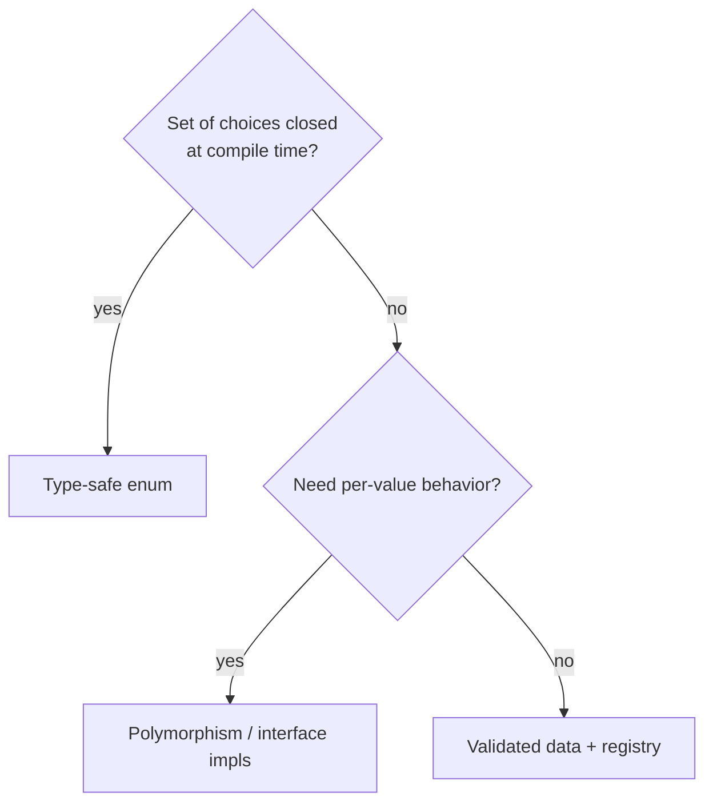
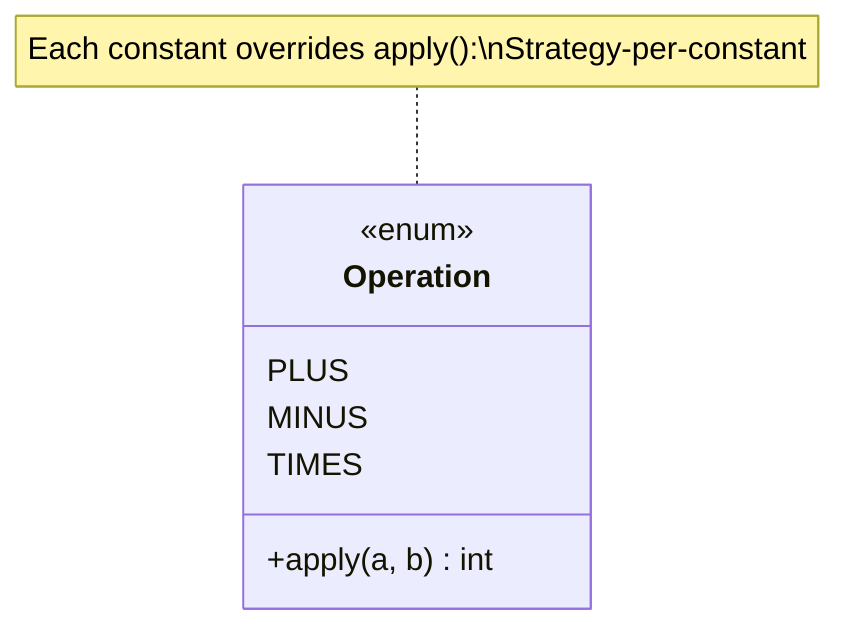

# Type-Safe Enums — Middle Level

> **Category:** [Resource & Type-Safety Patterns](../README.md) — choose an enum (and design it well) when the set of choices is closed; reach for polymorphism or a registry when it isn't.

> **Prerequisite:** [Junior](junior.md)
> **Focus:** **Why** and **When**

---

## Table of Contents

1. [Introduction](#introduction)
2. [When to Use a Type-Safe Enum](#when-to-use-a-type-safe-enum)
3. [When NOT to Use One](#when-not-to-use-one)
4. [Real-World Cases](#real-world-cases)
5. [Production-Grade Code](#production-grade-code)
6. [Enums With Data and Behavior](#enums-with-data-and-behavior)
7. [The Go Gap and How to Close It](#the-go-gap-and-how-to-close-it)
8. [Serialization & Versioning](#serialization-versioning)
9. [Trade-offs](#trade-offs)
10. [Alternatives](#alternatives)
11. [Edge Cases](#edge-cases)
12. [Best Practices](#best-practices)
13. [Summary](#summary)
14. [Diagrams](#diagrams)

---

## Introduction

> Focus: **Why** and **When**

At the junior level, an enum is "a nicer set of constants." At the middle level, the questions are sharper: *Is the set genuinely closed?* *Should the enum carry data or behavior?* *How do I serialize it without locking my code to constant ordering?* *What do I do in Go, where the compiler won't help me?*

The central judgment: an enum is the right tool for a **closed set** — values you can enumerate at compile time and that change only when *you* edit the code. The moment the set must be extended by configuration, plugins, or external data, an enum becomes a liability and polymorphism or a registry wins.

---

## When to Use a Type-Safe Enum

- The full set of values is **known and fixed at compile time**.
- You branch on the value with `switch`/`match` and want **exhaustiveness checking**.
- The value is passed across module boundaries and you want a self-documenting, illegal-value-proof type.
- Each value may carry **associated data** (an HTTP status code's number, a planet's mass) or **per-value behavior**.

## When NOT to Use One

- **The set is open / runtime-extensible.** Plugin types, user-defined categories, currencies your config adds — use a registry or polymorphism, not an enum you must recompile to extend.
- **The values are genuinely unbounded** (a user ID, a country from an external API that may add entries) — model them as data, validated at the boundary.
- **Two states that are truly boolean** — `enabled`/`disabled` can be a `boolean`; reserve enums for sets where named values add clarity.



---

## Real-World Cases

- **`java.time.DayOfWeek` / `Month`** — closed sets that carry behavior (`plus`, `getDisplayName`).
- **HTTP status families** — `1xx`…`5xx` modelled as an enum carrying the numeric code.
- **State machines** — order lifecycle, connection state; each state knows its legal transitions.
- **Feature flags' *modes*** — `OFF`, `ON`, `CANARY` (a tri-state that a boolean can't express).
- **Compiler/parser token kinds** — a closed set, switched on constantly.

---

## Production-Grade Code

### Java — enum carrying data

```java
public enum Planet {
    MERCURY(3.303e+23, 2.4397e6),
    EARTH  (5.976e+24, 6.37814e6),
    JUPITER(1.9e+27,   7.1492e7);

    private final double mass;     // kg
    private final double radius;   // m

    Planet(double mass, double radius) {
        this.mass = mass;
        this.radius = radius;
    }

    public double surfaceGravity() {
        return 6.67300E-11 * mass / (radius * radius);
    }
}

double g = Planet.EARTH.surfaceGravity();
```

The enum *is* the data table. No parallel array, no risk of mismatched indices.

### Python — `IntEnum` and `StrEnum`

```python
from enum import IntEnum, StrEnum, auto

class Priority(IntEnum):     # compares/orders like an int, still type-named
    LOW = 1
    MEDIUM = 2
    HIGH = 3

class Color(StrEnum):        # Python 3.11+: behaves like str (JSON-friendly)
    RED = "red"
    GREEN = "green"

assert Priority.HIGH > Priority.LOW          # ordering works
assert Color.RED == "red"                    # StrEnum compares equal to its value
```

> Use `auto()` when the underlying value is irrelevant: `RED = auto()`. Use `StrEnum`/`IntEnum` only when you *want* interoperability with `str`/`int` (e.g., JSON, DB) — it deliberately weakens the type boundary.

---

## Enums With Data and Behavior

The most powerful form: **per-constant behavior** — each enum value implements a method differently. This is "strategy-per-constant", a Strategy pattern collapsed into the enum.

```java
public enum Operation {
    PLUS  { public int apply(int a, int b) { return a + b; } },
    MINUS { public int apply(int a, int b) { return a - b; } },
    TIMES { public int apply(int a, int b) { return a * b; } };

    public abstract int apply(int a, int b);
}

int r = Operation.TIMES.apply(6, 7);   // 42
```

Adding `DIVIDE` *forces* you to implement `apply` — the abstract method makes the new behavior mandatory. This is enums acting as a closed, exhaustive Strategy.

In Python, attach methods directly:

```python
from enum import Enum

class Operation(Enum):
    PLUS = "+"
    TIMES = "*"

    def apply(self, a: int, b: int) -> int:
        match self:
            case Operation.PLUS:  return a + b
            case Operation.TIMES: return a * b
```

---

## The Go Gap and How to Close It

Go's `iota` enum is **not** type-safe in the way Java's is:

1. **Any int is assignable.** `var s Status = 99` compiles.
2. **No exhaustiveness check.** A `switch` missing a case compiles silently.
3. **No automatic string form.** You must write `String()` or generate it.

Closing the gap requires *discipline plus tooling*:

```go
type Status int

const (
    Pending Status = iota
    Paid
    Shipped
    statusEnd          // unexported sentinel for bounds checking
)

//go:generate stringer -type=Status

func (s Status) Valid() bool { return s >= Pending && s < statusEnd }

func ParseStatus(raw string) (Status, error) {
    switch raw {
    case "pending": return Pending, nil
    case "paid":    return Paid, nil
    case "shipped": return Shipped, nil
    default:        return 0, fmt.Errorf("invalid status %q", raw)
    }
}
```

- **`stringer`** generates the `String()` method.
- **`Valid()`** is your manual exhaustiveness/bounds guard.
- **Exhaustiveness linters** (`exhaustive`, `go-check-sumtype`) flag `switch` statements missing a case — wire them into CI. This is the closest Go gets to compiler-enforced enums.

---

## Serialization & Versioning

The single most common production bug with enums: **persisting the ordinal**.

```java
// DANGEROUS — stores position 0,1,2…
db.save(status.ordinal());

// Later someone alphabetizes the constants:
enum Status { CANCELLED, PAID, PENDING, SHIPPED }
// Now ordinal 0 means CANCELLED, not PENDING. Every stored row is silently wrong.
```

**Rules:**
- **Never serialize `ordinal()` or rely on declaration order.** Persist the *name* (string) or an explicit, stable code you assign.
- **Pin an explicit value** when storing: give each constant a stable code.

```java
public enum Status {
    PENDING("P"), PAID("A"), SHIPPED("S");
    private final String code;
    Status(String code) { this.code = code; }
    public String code() { return code; }
}
```

- **Adding a constant is backward-compatible; removing/renaming one is not.** Old serialized data may reference a constant your new code no longer has — handle unknown values explicitly on read (fail fast or map to a known `UNKNOWN`).

---

## Trade-offs

| Benefit | Cost / Caveat |
|---|---|
| Illegal values unrepresentable | Closed set — recompile to extend |
| Exhaustiveness catches missed cases | A stray `default:` silences the check |
| Carries data/behavior cleanly | Heavier than a constant; can grow into a god-type |
| Self-documenting, namespaced | Serialization needs an explicit stable mapping |
| Strategy-per-constant | Tight coupling of all behaviors in one file |

---

## Alternatives

- **Sealed classes / sum types** (Kotlin `sealed`, Rust `enum`, Scala `sealed trait`) — a stronger generalization where each case can carry *different* data. See [Senior](senior.md) and [Algebraic Data Types](../../functional-programming/06-algebraic-data-types/junior.md).
- **Polymorphism** — for open sets: an interface with one implementation per type, registered at runtime.
- **`Optional`/`Result`** — when the "value" is really "present/absent" or "ok/error", not a category (see [Sentinel & Special Values](../03-sentinel-and-special-values/junior.md)).

---

## Edge Cases

- **Flag/bitset enums** — when values combine (`READ | WRITE`). Java `EnumSet`, Python `enum.Flag`. Covered in [Senior](senior.md).
- **Empty enum** — legal but pointless; usually a modelling mistake.
- **Single-constant enum** — Bloch's idiom for a Singleton (`enum Singleton { INSTANCE; }`).
- **Enum with mutable state** — an anti-pattern; enum constants are effectively global singletons, so mutable fields are shared mutable global state.

---

## Best Practices

1. **Decide closed vs open first.** Closed → enum. Open → polymorphism/registry.
2. **Let enums hold their associated data** instead of parallel maps/arrays keyed by ordinal.
3. **Persist names or explicit codes, never ordinals.**
4. **Avoid blanket `default:`** so exhaustiveness checking stays useful.
5. **In Go, pair the type with `stringer`, a `Valid()`/parse function, and an exhaustiveness linter.**

---

## Summary

- Use an enum for a **closed** set; use polymorphism/registry for an **open** one.
- Enums can carry **data** and **per-constant behavior** (strategy-per-constant).
- **Serialization:** persist names/explicit codes; ordinals are a time bomb.
- **Go** needs `stringer` + validation + exhaustiveness linters to approximate type safety.
- Python's `IntEnum`/`StrEnum` trade some type strictness for `int`/`str` interop — use deliberately.

---

## Diagrams



[← Junior](junior.md) · [Resource & Type-Safety](../README.md) · [Roadmap](../../../README.md) · **Next:** [Type-Safe Enums — Senior](senior.md)
</content>
