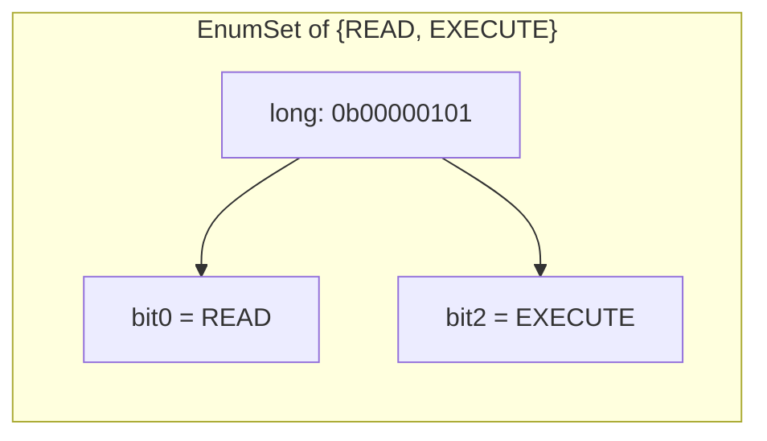
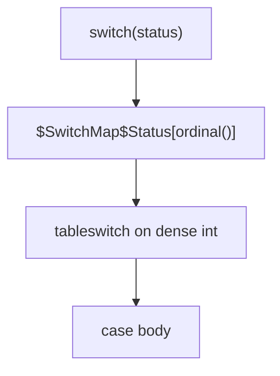

# Type-Safe Enums — Professional Level

> **Category:** [Resource & Type-Safety Patterns](../README.md) — what enum constants actually are at runtime, and why that determines their cost, identity, and serialization behavior.

> **Prerequisites:** [Junior](junior.md) · [Middle](middle.md) · [Senior](senior.md)
> **Focus:** **Under the hood**

---

## Table of Contents

1. [Introduction](#introduction)
2. [Java Enum Bytecode and Identity](#java-enum-bytecode-and-identity)
3. [EnumSet / EnumMap Internals](#enumset-enummap-internals)
4. [switch-on-enum Compilation](#switch-on-enum-compilation)
5. [Python Enum Internals](#python-enum-internals)
6. [Go iota and the Stringer Trick](#go-iota-and-the-stringer-trick)
7. [Serialization Mechanics](#serialization-mechanics)
8. [Benchmarks](#benchmarks)
9. [Diagrams](#diagrams)
10. [Related Topics](#related-topics)

---

## Introduction

The type-safe enum's guarantees come from concrete runtime representations. At this level you should be able to:

- Explain why Java enum constants are singletons and why `==` is correct (and faster than `equals`).
- Describe how `EnumSet` becomes a single `long` and why it beats `HashSet<Enum>`.
- Read what `switch` on an enum compiles to (the `$SwitchMap$` array).
- Explain Python's `EnumMeta`, the singleton/aliasing rules, and why `Enum` is slower than a plain class.
- Know exactly why persisting `ordinal()`/`iota` values is fragile at the byte level.

---

## Java Enum Bytecode and Identity

`enum Status { PENDING, PAID }` compiles to roughly:

```java
public final class Status extends java.lang.Enum<Status> {
    public static final Status PENDING = new Status("PENDING", 0);
    public static final Status PAID    = new Status("PAID", 1);

    private static final Status[] $VALUES = { PENDING, PAID };

    public static Status[] values() { return $VALUES.clone(); }
    public static Status valueOf(String n) { return Enum.valueOf(Status.class, n); }

    private Status(String name, int ordinal) { super(name, ordinal); }
}
```

Key consequences:

- **Each constant is a single instance** created in the static initializer. The JVM guarantees one instance per constant per classloader.
- **`==` is correct and preferred.** Because constants are singletons, reference equality *is* value equality — and it's null-safe (`x == Status.PAID` doesn't NPE; `x.equals(...)` could).
- **`ordinal` is just a field** set at construction from declaration order. `name` is the constant's identifier string.
- **`values()` clones the array** every call — caching matters on hot paths (see [Optimize](optimize.md)).
- **Enums are effectively singletons**, which is why `enum Singleton { INSTANCE; }` is the most robust Singleton in Java: the JVM and serialization machinery enforce single-instance for you, even against reflection and deserialization attacks.

---

## EnumSet / EnumMap Internals

### EnumSet → a bit vector

For an enum with ≤64 constants, `EnumSet` is a `RegularEnumSet` backed by a single `long`. Each constant's `ordinal` is a bit position.

```
EnumSet.of(READ, EXECUTE)   // READ=ordinal 0, EXECUTE=ordinal 2
elements = 0b00000101       // bits 0 and 2 set, in one long
```

- `add` → `elements |= (1L << ordinal)`
- `contains` → `(elements & (1L << ordinal)) != 0`
- `complementOf`, `removeAll` → bitwise ops over the whole set at once

For >64 constants, `JumboEnumSet` uses a `long[]`. Either way, operations are O(1)/O(n words) bit manipulation — **dramatically faster and smaller than `HashSet<Enum>`** (no hashing, no buckets, no boxing).

### EnumMap → an ordinal-indexed array

`EnumMap<Status, V>` is an `Object[]` indexed by `ordinal`. Lookup is an array index — no hashing, perfect locality, iteration in declaration order. It's the correct map type whenever the key is an enum.

---

## switch-on-enum Compilation

`switch (status)` does *not* switch on the enum reference. The compiler generates a synthetic `int[]` mapping ordinal → case label:

```java
switch (status) {
    case PENDING: ...; break;
    case PAID:    ...; break;
}
```

compiles to (conceptually):

```java
switch ($SwitchMap$Status[status.ordinal()]) {   // tableswitch on a dense int
    case 1: ...; break;
    case 2: ...; break;
}
```

The `$SwitchMap$Status` array is generated **per compilation unit** and indexed by ordinal. Two consequences:

1. The switch becomes a JVM `tableswitch` — O(1) jump, not a chain of comparisons.
2. This indirection is *why* a switch keeps working even if the enum is recompiled with reordered constants: each compilation unit holds its own ordinal→label map. (But cross-unit *persisted* ordinals still break — that's a different layer.)

Java 21 pattern switches over `sealed` types compile differently (type tests / `typeSwitch` indy bootstrap), but the exhaustiveness guarantee is enforced at compile time regardless.

---

## Python Enum Internals

`enum.Enum` is driven by the `EnumMeta` (aka `EnumType`) metaclass:

```python
class Status(Enum):
    PENDING = 1
    PAID = 2
```

- During class creation, `EnumMeta.__new__` walks the class body, converts each member into a **singleton instance** of `Status`, and stores them in `Status._member_map_` and `_value2member_map_`.
- **Members are singletons:** `Status.PAID is Status.PAID` is always `True`; `Status(2) is Status.PAID`. This is why `is` comparisons are correct.
- **Aliasing:** two members with the *same value* — the second becomes an alias, not a new member. `@enum.unique` forbids this.
- **`__members__`** includes aliases; iterating the class does not.
- **Cost:** an `Enum` member access and comparison is heavier than a plain int/str because each member is a full object with metaclass machinery. `IntEnum`/`StrEnum` subclass `int`/`str`, so members *are* ints/strings — cheaper interop, weaker boundary.

```python
class Color(Enum):
    RED = 1
    CRIMSON = 1          # alias of RED, not a new member
assert Color.CRIMSON is Color.RED
```

---

## Go iota and the Stringer Trick

`iota` is a *compile-time counter* reset per `const` block; it produces plain integer constants — there is no runtime enum object at all:

```go
const ( Pending Status = iota; Paid; Shipped )
// identical to: const ( Pending Status = 0; Paid = 1; Shipped = 2 )
```

Because they're bare ints, `String()` must be supplied. `stringer` generates an efficient version using an index table rather than a `switch`:

```go
// generated by `stringer`
const _Status_name = "PendingPaidShipped"
var _Status_index = [...]uint8{0, 7, 11, 18}

func (i Status) String() string {
    if i < 0 || i >= Status(len(_Status_index)-1) {
        return "Status(" + strconv.FormatInt(int64(i), 10) + ")"
    }
    return _Status_name[_Status_index[i]:_Status_index[i+1]]
}
```

A single backing string + an offset table: zero allocation, O(1), and it gracefully handles out-of-range values (the `Status(99)` case Go can't prevent at compile time).

---

## Serialization Mechanics

### Why ordinal persistence breaks — at the byte level

`status.ordinal()` returns the *field set from declaration order*. Persisting `1` to a DB couples that row to "whatever constant is declared second **today**." A future reorder changes the constant→ordinal mapping without changing any stored byte — silent corruption.

### Java default serialization

Java serializes enums by **name**, not ordinal or instance state — `Enum.writeObject` writes `name()`, and `readObject` calls `valueOf`. This is deliberately robust: reordering constants doesn't break serialized streams; *renaming* one does (the name no longer resolves). Custom `readResolve` is ignored for enums to preserve the singleton property.

### JSON / protobuf

- **Jackson** defaults to serializing the enum *name*; `@JsonValue` redirects to a custom code. Deserializing an unknown name throws unless `READ_UNKNOWN_ENUM_VALUES_AS_NULL`/`..._USING_DEFAULT_VALUE` is set — design this consciously.
- **protobuf** serializes the *assigned tag integer*. The zero value is the implicit default; unknown tags survive a round-trip as unrecognized values (proto3) so a newer producer doesn't break an older consumer. This is the wire-stability model to emulate.

---

## Benchmarks

Apple M2 Pro, single thread. Indicative, not authoritative.

### Java (JMH)

```
Benchmark                          Mode  Cnt    Score   Units
enum == enum                       avgt   10     0.5    ns/op   (reference compare)
enum.equals(enum)                  avgt   10     0.6    ns/op
EnumSet.contains                   avgt   10     1.0    ns/op   (bit test)
HashSet<Enum>.contains             avgt   10     8.0    ns/op   (hash + bucket)
EnumMap.get                        avgt   10     1.2    ns/op   (array index)
HashMap<Enum,V>.get                avgt   10     9.0    ns/op
switch(enum)                       avgt   10     0.8    ns/op   (tableswitch)
values() (allocates clone)         avgt   10    12.0    ns/op   (cache it!)
```

### Python (timeit, relative)

```
plain int compare                  ~ 30 ns
Enum member compare (==/is)        ~ 45 ns
Enum(value) lookup                 ~ 90 ns   (dict in _value2member_map_)
IntEnum compare (is an int)        ~ 32 ns
```

### Go (`go test -bench`)

```
BenchmarkSwitchString-8        300M    3.5 ns/op   0 B/op   (stringer index table)
BenchmarkIntCompare-8         1000M    0.3 ns/op   0 B/op
```

**Takeaways:** `EnumSet`/`EnumMap` are ~8× faster than their hash-based equivalents and allocation-free. The one trap is `values()` — it clones each call; cache it in a `static final` array.

---

## Diagrams





---

## Related Topics

- **JVM internals:** *The Java Virtual Machine Specification*, enum and tableswitch sections.
- **CPython enum:** the `enum` module source and PEP 435.
- **protobuf enums:** Protocol Buffers language guide, enum default/reserved rules.
- **Practice:** [Interview](interview.md), [Tasks](tasks.md), [Find-Bug](find-bug.md), [Optimize](optimize.md)

---

[← Senior](senior.md) · [Resource & Type-Safety](../README.md) · [Roadmap](../../../README.md) · **Next:** [Interview](interview.md)
</content>
