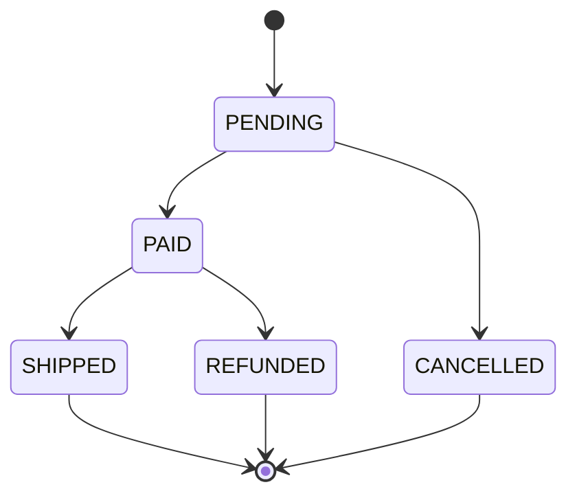
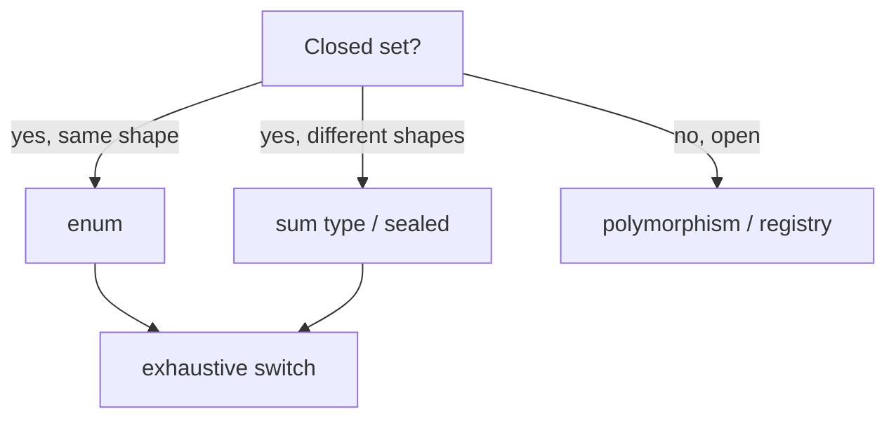

# Type-Safe Enums — Senior Level

> **Category:** [Resource & Type-Safety Patterns](../README.md) — architect closed sets so illegal states are unrepresentable, evolution is safe, and exhaustiveness is enforced by the compiler or by CI.

> **Prerequisites:** [Junior](junior.md) · [Middle](middle.md)
> **Focus:** **Architecture** and **evolution**

---

## Table of Contents

1. [Introduction](#introduction)
2. [Enums as the Weak End of a Spectrum](#enums-as-the-weak-end-of-a-spectrum)
3. [Sum Types: The Strong Generalization](#sum-types-the-strong-generalization)
4. [Exhaustiveness as an Architectural Guarantee](#exhaustiveness-as-an-architectural-guarantee)
5. [Enum vs Polymorphism for Open Sets](#enum-vs-polymorphism-for-open-sets)
6. [Flag Enums and Bitsets](#flag-enums-and-bitsets)
7. [Serialization, Versioning, and Wire Stability](#serialization-versioning-and-wire-stability)
8. [Code Examples — Advanced](#code-examples-advanced)
9. [Liabilities](#liabilities)
10. [Migration Patterns](#migration-patterns)
11. [Diagrams](#diagrams)
12. [Related Topics](#related-topics)

---

## Introduction

> Focus: **architecture** and **evolution**

A senior treats enums not as a syntactic nicety but as a *modelling decision about a domain's state space*. The governing principle — **make illegal states unrepresentable** — is the same one behind sum types, sealed hierarchies, and the typestate pattern. The design questions are:

- Do all cases carry the *same shape* of data (enum) or *different shapes* (sum type)?
- Is exhaustiveness enforced by the compiler, by a linter, or by nothing — and what breaks when someone adds a case?
- How does this type cross a wire/boundary (DB, JSON, protobuf) **without** coupling the schema to source ordering?
- Is the set truly closed, or am I forcing an open set into a closed shape (a smell that resurfaces as endless `default:` branches)?

---

## Enums as the Weak End of a Spectrum

A plain enum is the *least expressive* point on a spectrum of closed-type modelling:

```
bool            (2 cases, no data, no names)
   │
   ▼
enum            (N named cases, all same shape, optional shared data)
   │
   ▼
sum / ADT       (N named cases, EACH a different shape)
   │
   ▼
typestate       (cases encoded in the type parameter; transitions checked)
```

An enum says: "one of N named things, all interchangeable in shape." The moment different cases need *different fields* — `Circle{radius}` vs `Rectangle{w,h}` — a flat enum forces you into nullable fields or parallel maps, and you've outgrown it.

---

## Sum Types: The Strong Generalization

Where the language allows, model heterogeneous closed sets as **sum types** (a.k.a. tagged unions, algebraic data types).

### Rust — `enum` is a true sum type

```rust
enum Shape {
    Circle { radius: f64 },
    Rectangle { width: f64, height: f64 },
    Triangle { base: f64, height: f64 },
}

fn area(s: &Shape) -> f64 {
    match s {                          // compiler enforces exhaustiveness
        Shape::Circle { radius } => std::f64::consts::PI * radius * radius,
        Shape::Rectangle { width, height } => width * height,
        Shape::Triangle { base, height } => 0.5 * base * height,
    }
}
```

Each variant carries *its own* data; `match` is exhaustively checked. This is the gold standard the pattern aspires to.

### Kotlin — `sealed` hierarchy

```kotlin
sealed interface Shape
data class Circle(val radius: Double) : Shape
data class Rectangle(val width: Double, val height: Double) : Shape

fun area(s: Shape): Double = when (s) {   // exhaustive: no else needed
    is Circle -> Math.PI * s.radius * s.radius
    is Rectangle -> s.width * s.height
}
```

### TypeScript — discriminated union

```ts
type Shape =
  | { kind: "circle"; radius: number }
  | { kind: "rectangle"; width: number; height: number };

function area(s: Shape): number {
  switch (s.kind) {
    case "circle": return Math.PI * s.radius ** 2;
    case "rectangle": return s.width * s.height;
    default: { const _exhaustive: never = s; return _exhaustive; } // compile error if a case is missed
  }
}
```

The `never` assignment is the idiom that *manufactures* exhaustiveness checking in a language that doesn't enforce it natively.

### Java — sealed + records + pattern switch (Java 21)

```java
sealed interface Shape permits Circle, Rectangle {}
record Circle(double radius) implements Shape {}
record Rectangle(double w, double h) implements Shape {}

double area(Shape s) {
    return switch (s) {                       // exhaustive over the permitted set
        case Circle c    -> Math.PI * c.radius() * c.radius();
        case Rectangle r -> r.w() * r.h();
    };
}
```

Java's `sealed` + records + pattern-matching `switch` brings true sum types to the JVM. Use this — not a flat `enum` with nullable fields — when cases differ in shape.

---

## Exhaustiveness as an Architectural Guarantee

Exhaustiveness is what turns "add a case" from a *bug hunt* into a *compile-error checklist*. The architectural value is **change confidence**: a new constant produces a list of every site that must be updated.

| Language | Exhaustiveness mechanism |
|---|---|
| Rust | Native — `match` must be total |
| Kotlin | `when` on `sealed`/`enum` as an *expression* is exhaustive |
| Java 21 | `switch` over `sealed`/`enum` is exhaustive |
| TypeScript | `never`-assertion idiom (manual) |
| Python | None at runtime; `mypy --strict` + `assert_never` |
| Go | None — linter (`exhaustive`) only |

**The anti-guarantee:** a `default:`/`else`/`_ =>` branch *destroys* exhaustiveness. Reserve catch-alls for genuinely open inputs (e.g., a byte from the network); never use one over your own closed type, or you forfeit the compiler's help exactly when you most need it.

```python
from typing import assert_never

def area(s: Shape) -> float:
    match s:
        case Circle():    return ...
        case Rectangle(): return ...
        case _: assert_never(s)   # mypy errors here if a case is unhandled
```

---

## Enum vs Polymorphism for Open Sets

The classic tension: enum-`switch` vs polymorphic dispatch.

| | Enum + switch | Polymorphism |
|---|---|---|
| Add a **case** | Edit every switch (compiler helps if exhaustive) | Add one class — no existing code touched |
| Add an **operation** | Add one method/switch — done | Edit every class to add the method |
| Set openness | Closed (recompile to extend) | Open (plugins, runtime registration) |
| Locality | All behavior for an op in one place | All behavior for a case in one place |

This is the **expression problem** in miniature. Choose by which axis changes more often:

- **Cases stable, operations grow** → enum (or sum type). Adding `area`, `perimeter`, `render` is cheap; you rarely add a shape.
- **Operations stable, cases grow** → polymorphism/registry. New payment providers arrive constantly; the operations (`charge`, `refund`) are fixed.

Forcing an open set into an enum produces the tell-tale smell: a `default:` branch that throws `UnsupportedOperationException` and a backlog of "we forgot to handle the new type" incidents.

---

## Flag Enums and Bitsets

When values **combine** (permissions, capabilities), you want a *set* of enum values, not a single one.

### Java — `EnumSet` / `EnumMap`

```java
enum Perm { READ, WRITE, EXECUTE, DELETE }

EnumSet<Perm> perms = EnumSet.of(Perm.READ, Perm.WRITE);
perms.contains(Perm.WRITE);   // true
```

`EnumSet` is internally a **bit vector** (a single `long` for ≤64 constants) — as fast as hand-rolled bit flags, but type-safe and readable. `EnumMap` is an array indexed by ordinal: a dense, fast map keyed by enum. **Prefer these over raw `int` bitmasks** — you keep the performance and gain type safety and exhaustiveness.

### Python — `enum.Flag`

```python
from enum import Flag, auto

class Perm(Flag):
    READ = auto()
    WRITE = auto()
    EXECUTE = auto()

p = Perm.READ | Perm.WRITE
assert Perm.READ in p
```

### Go — explicit bit shifts (no language support)

```go
type Perm uint

const (
    Read    Perm = 1 << iota   // 1
    Write                      // 2
    Execute                    // 4
)

p := Read | Write
has := p&Write != 0
```

Go gives you `1 << iota` but, again, no protection against illegal bits.

---

## Serialization, Versioning, and Wire Stability

The senior-level rule: **the enum's source representation and its wire representation are independent contracts.**

- **Wire = explicit, stable codes.** protobuf enums pin an integer; JSON should use the *name* string or an assigned code — never the language ordinal.
- **Reserve removed values.** In protobuf, `reserved 3;` prevents reusing a retired tag. Removing a constant in Java doesn't reserve anything — old data referencing it now fails to deserialize.
- **Decode unknown values explicitly.** A forward-compatible service must handle "a value newer than my code." protobuf yields an `UNKNOWN`/unrecognized variant; design your domain enum with an explicit `UNKNOWN` *or* fail fast — never let an unrecognized value masquerade as a valid one.
- **Default/zero value is special.** protobuf's enum zero value is the implicit default; reserve it for `UNSPECIFIED`, not a meaningful state, or absent fields silently become that state.

```protobuf
enum Status {
  STATUS_UNSPECIFIED = 0;   // the zero value must be "unknown"
  STATUS_PENDING = 1;
  STATUS_PAID = 2;
  reserved 3;               // a retired value — never reuse this tag
}
```

---

## Code Examples — Advanced

### Java — enum state machine with legal transitions

```java
public enum State {
    PENDING { public Set<State> next() { return EnumSet.of(PAID, CANCELLED); } },
    PAID    { public Set<State> next() { return EnumSet.of(SHIPPED, REFUNDED); } },
    SHIPPED { public Set<State> next() { return EnumSet.noneOf(State.class); } },
    CANCELLED { public Set<State> next() { return EnumSet.noneOf(State.class); } },
    REFUNDED  { public Set<State> next() { return EnumSet.noneOf(State.class); } };

    public abstract Set<State> next();

    public State transitionTo(State target) {
        if (!next().contains(target))
            throw new IllegalStateException(this + " -> " + target + " is illegal");
        return target;
    }
}
```

The legal transition graph lives *in the type*. Illegal transitions fail fast, and adding a state forces you to define its `next()`.

### Go — sum type emulation via sealed interface

```go
// Go has no enums-with-data, but an unexported method seals an interface.
type Shape interface{ isShape() }

type Circle struct{ R float64 }
type Rect   struct{ W, H float64 }

func (Circle) isShape() {}    // only types in this package can implement Shape
func (Rect) isShape()   {}

func Area(s Shape) float64 {
    switch v := s.(type) {
    case Circle: return math.Pi * v.R * v.R
    case Rect:   return v.W * v.H
    default:     panic("unhandled shape")   // linter (go-check-sumtype) can flag missing cases
    }
}
```

The unexported `isShape()` method *seals* the interface to the package — the nearest Go gets to a closed sum type.

---

## Liabilities

### Symptom 1: `default:` that throws

A closed enum whose every switch ends in `default: throw new IllegalStateException()`. Either it's not really closed (use polymorphism) or you've disabled exhaustiveness (remove the `default`).

### Symptom 2: Parallel arrays keyed by ordinal

`String[] labels = {"Pending", "Paid"};` indexed by `status.ordinal()`. Reorder the enum and labels desync. Move the data *into* the enum.

### Symptom 3: God-enum

One enum with 60 constants and 400 lines of per-constant behavior. The closed-set assumption is straining; consider a registry or splitting domains.

### Symptom 4: Ordinal/order coupling

Anything that depends on declaration order — `ordinal()`, `values()[i]`, persisted positions — is a latent bug that fires the day someone reorders constants.

---

## Migration Patterns

### Int/String constants → enum

```java
// Before
static final int RED = 0, GREEN = 1;
// After
enum Color { RED, GREEN }
```

Migrate by adding the enum, deprecating constants, converting at call sites, then deleting the constants. A parse function bridges old persisted ints during transition.

### Flat enum → sealed/sum type

When constants accrete nullable companion fields (`shapeType` + nullable `radius` + nullable `width`), that's the signal to promote to a sealed hierarchy where each case carries only its own data.

### Closed enum → polymorphism (open set)

When a `default:` keeps throwing because new cases arrive from outside your control, invert: define an interface, one implementation per case, register at runtime. The enum was the wrong shape for an open domain.

---

## Diagrams





---

## Related Topics

- **Next:** [Type-Safe Enums — Professional](professional.md)
- **Strong generalization:** [Algebraic Data Types](../../functional-programming/06-algebraic-data-types/junior.md)
- **Cures:** [Sentinel & Special Values](../03-sentinel-and-special-values/junior.md), [Magic Container](../../anti-patterns/02-design/README.md)
- **Pairs with:** [Fail Fast](../../01-control-flow/02-fail-fast/junior.md), [Special Case](../../01-control-flow/04-special-case/junior.md)
- **Practice:** [Tasks](tasks.md), [Find-Bug](find-bug.md), [Optimize](optimize.md), [Interview](interview.md)

---

[← Middle](middle.md) · [Resource & Type-Safety](../README.md) · [Roadmap](../../../README.md) · **Next:** [Professional](professional.md)
</content>
