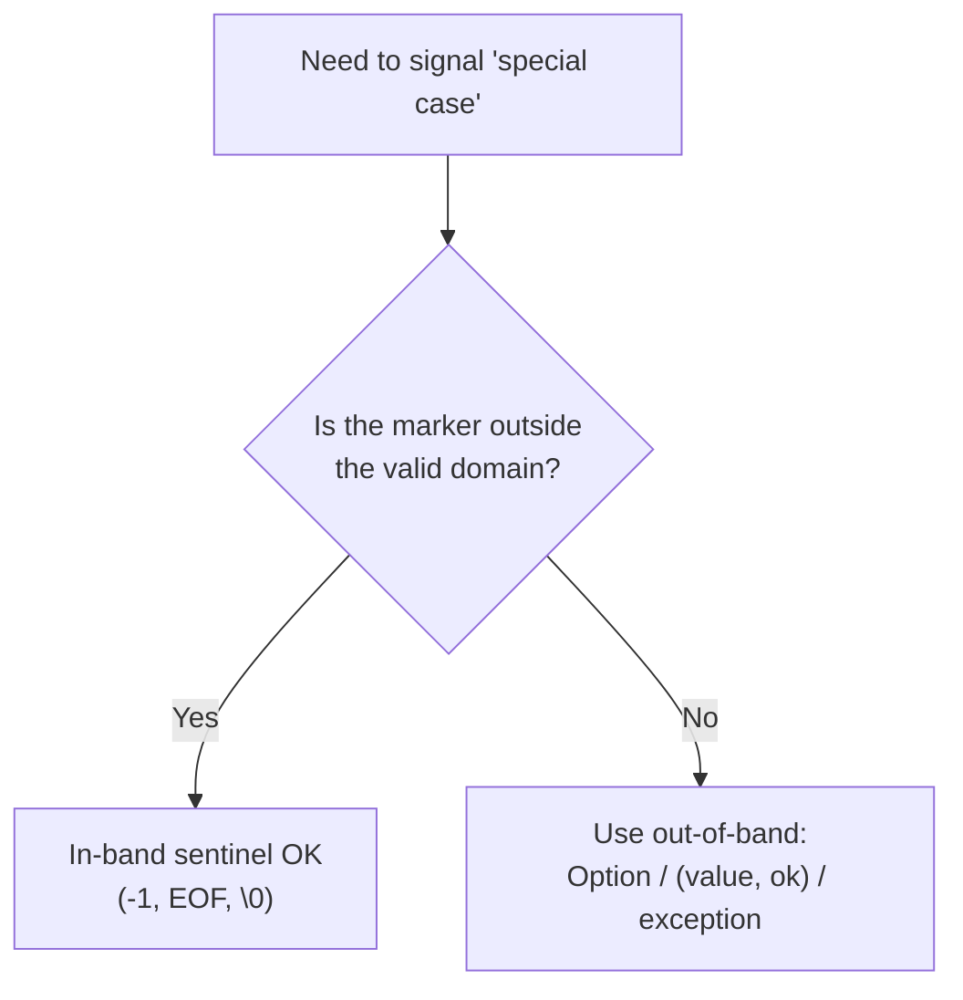
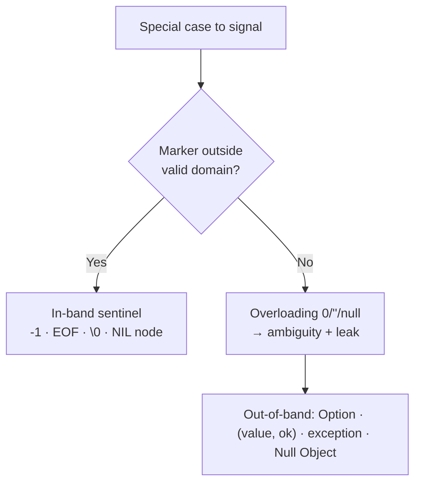

# Sentinel & Special Values — Junior Level

> **Category:** [Resource & Type-Safety Patterns](../README.md) — use (and know when *not* to use) in-band markers like `-1`, `""`, `NaN`, `null` to stand for a special condition.

---

## Table of Contents

1. [Introduction](#introduction)
2. [Prerequisites](#prerequisites)
3. [Glossary](#glossary)
4. [Core Concepts](#core-concepts)
5. [Real-World Analogies](#real-world-analogies)
6. [Mental Models](#mental-models)
7. [Pros & Cons](#pros-cons)
8. [Use Cases](#use-cases)
9. [Code Examples](#code-examples)
10. [Coding Patterns](#coding-patterns)
11. [Clean Code](#clean-code)
12. [Best Practices](#best-practices)
13. [Edge Cases & Pitfalls](#edge-cases-pitfalls)
14. [Common Mistakes](#common-mistakes)
15. [Tricky Points](#tricky-points)
16. [Test Yourself](#test-yourself)
17. [Cheat Sheet](#cheat-sheet)
18. [Summary](#summary)
19. [Further Reading](#further-reading)
20. [Related Topics](#related-topics)
21. [Diagrams](#diagrams)

---

## Introduction

> Focus: **What is it?** and **How to use it?**

A **sentinel value** (or **special value**) is an ordinary in-band value that you reserve to mean *"a special condition happened here"* — most often *"not found"*, *"end of data"*, or *"no value present"*. Instead of returning a second flag or throwing an exception, you encode the special case **inside the value itself**.

You have already met dozens of them:

- `"hello".indexOf("z")` returns **`-1`** — "not found".
- Reading past the end of a file gives **`io.EOF`** (Go) or **`-1`** from a byte stream (Java).
- A C string ends at the **`\0`** null terminator.
- A missing object reference is **`null`** / `nil` / `None`.

The pattern has **two faces**, and a junior engineer must learn both:

- **The good face (in-band, out-of-domain).** When the sentinel is a value the data *can never legitimately be*, it is a clean, efficient idiom. `indexOf` returns a valid index `0, 1, 2, …` or `-1`; since `-1` is never a real index, there is no ambiguity.
- **The bad face (overloading a valid value).** When you reuse a value that *is* a legal reading — `0` for "no temperature", `""` for "name unknown" — the special meaning becomes ambiguous and silently leaks into your math and logic.

This file teaches you to recognize both, and to reach for the safer alternatives (`Option`, multiple return values, the Null Object) when in-band signaling would lie.

---

## Prerequisites

- **Required:** Variables, return values, and `if` conditions.
- **Required:** The idea of `null` / `nil` / `None`.
- **Helpful:** Familiarity with [Guard Clauses](../../01-control-flow/01-guard-clauses-and-early-return/junior.md) and [Null Object](../../01-control-flow/03-null-object/junior.md).

---

## Glossary

| Term | Definition |
|------|-----------|
| **Sentinel value** | An in-band value reserved to mean a special condition (`-1`, `EOF`, `null`). |
| **In-band signaling** | Encoding "something special" inside the normal data channel (the return value). |
| **Out-of-band signaling** | Reporting the special case through a *separate* channel: a second return, an exception, an `Option`. |
| **Out-of-domain** | A sentinel that is never a legal value for the data (`-1` for an array index). Safe. |
| **Overloaded value** | A *legal* value (`0`, `""`) secretly repurposed to mean "absent". Dangerous. |
| **Magic number** | An unexplained literal (`-1`, `999`) whose meaning is not obvious from the code. |
| **Sentinel node** | A real, do-nothing node placed at the boundary of a data structure to remove edge-case checks. |
| **Option / Optional / Maybe** | A type that explicitly models "value or nothing" without a magic value. |

---

## Core Concepts

### 1. The sentinel must be outside the valid domain

A sentinel works cleanly only when it can **never collide** with a real value.

```
indexOf → 0, 1, 2, … (real indices)  OR  -1 (impossible index = "not found")
```

`-1` is safe because no array has index `-1`. The instant a sentinel *could* be real data, it becomes a bug.

### 2. In-band vs out-of-band

```
in-band:     return -1            // the answer and the error share one channel
out-of-band: return value, found  // two channels: "value" and "was it found?"
```

Out-of-band signaling is harder to ignore — you must look at `found` before trusting `value`.

### 3. The leak

The danger of a bad sentinel is that nothing stops you from *using* it:

```python
temperature = sensor.read()   # returns 0 to mean "no reading"
average = (temperature + other) / 2   # 0 silently drags the average down
```

A real `0` and a "no data" `0` are indistinguishable, so the error flows downstream invisibly.

### 4. The cure: make absence its own thing

`Option`/`Optional`, `Result`/`(value, err)`, exceptions, and the [Null Object](../../01-control-flow/03-null-object/junior.md) all replace a magic value with an explicit "there is nothing here" the caller cannot forget.

---

## Real-World Analogies

| Concept | Analogy |
|---|---|
| **Out-of-domain sentinel** | A "0 floor" button that doesn't exist in the building — pressing it obviously means "cancel", never a real floor. |
| **Overloaded value** | Writing `0` in the "age" box to mean "I'd rather not say" — now every newborn looks like a non-answer. |
| **Null terminator** | A period at the end of a sentence: you read until you hit it, then stop. |
| **EOF sentinel** | The "end of reel" leader on old film — a physical marker that says "the data is over." |
| **Sentinel node** | A dummy mannequin at the front of a clothing rack so the staff never have to special-case "the first item." |

---

## Mental Models

**The intuition:** *"A sentinel is safe only when it lives in a place a real value can never go."*

```
            value's real domain
   ┌───────────────────────────────────┐
   │  0   1   2   3   …                 │   ← legal answers
   └───────────────────────────────────┘
 -1  ← sentinel lives OUTSIDE the box  → SAFE

   ┌───────────────────────────────────┐
   │  0  ← also a legal answer          │   ← sentinel INSIDE the box
   └───────────────────────────────────┘
                                          → AMBIGUOUS / BUG
```

**The decision:** *"Is the special meaning impossible to confuse with real data?"*
- Yes → in-band sentinel is fine and fast.
- No → use out-of-band signaling (`Option`, `(value, ok)`, exception).

---

## Pros & Cons

| Pros (when out-of-domain) | Cons (when overloaded) |
|------|------|
| Zero extra allocation — no wrapper object | Ambiguity: is `0` real or "absent"? |
| Fast — one comparison, no boxing | Leaks into arithmetic/logic silently |
| Familiar idioms (`-1`, `EOF`, `\0`) | Every caller must *remember* to check |
| Removes boundary branches (sentinel nodes) | Forgotten check = `NullPointerException` / corrupt result |
| Tiny, cache-friendly representation | "Magic number" hurts readability |

### When in-band sentinels are fine:
- The sentinel is provably outside the valid domain (`-1` index, `EOF`, `\0`).
- Performance-sensitive code where a wrapper object is too costly.
- A sentinel **node** that simplifies data-structure boundaries.

### When to avoid them:
- The sentinel *could* be a real value (`0`, `""`, `-1` for a number that can be negative).
- The "absence" is a normal, expected outcome callers must handle — use `Option`/`Result`.

---

## Use Cases

- **Search APIs** — `indexOf` / `str.find` returning `-1`.
- **Stream reading** — `io.EOF`, `read()` returning `-1` at end of stream.
- **C-style strings** — `\0` null terminator marks the end.
- **Sentinel nodes** — a dummy head in a linked list, the `NIL` node in a red-black tree.
- **"No value" in databases** — `NULL` distinguishing "unknown" from `0`.
- **Optional function arguments** — a unique `_MISSING` object so `None` can be a real argument.

---

## Code Examples

### Go — the idiomatic `(value, ok)` and sentinel errors

```go
package main

import (
    "errors"
    "fmt"
)

// GOOD in-band sentinel: -1 is out of the index domain.
func indexOf(xs []int, target int) int {
    for i, x := range xs {
        if x == target {
            return i
        }
    }
    return -1 // "not found" — never a real index
}

// BETTER for "absence": the comma-ok idiom is out-of-band.
func lookup(m map[string]int, key string) (int, bool) {
    v, ok := m[key]
    return v, ok // caller MUST read ok before trusting v
}

// io.EOF is a sentinel ERROR — compared with errors.Is, not ==.
var ErrNotFound = errors.New("not found")

func main() {
    fmt.Println(indexOf([]int{10, 20, 30}, 20)) // 1
    fmt.Println(indexOf([]int{10, 20, 30}, 99)) // -1

    if v, ok := lookup(map[string]int{"a": 0}, "a"); ok {
        fmt.Println("found:", v) // found: 0  — note: 0 is real, ok told us so
    }
    fmt.Println(errors.Is(ErrNotFound, ErrNotFound)) // true
}
```

**Highlights:** `-1` is safe (out of domain). For map lookups, Go uses `(value, ok)` precisely because `0` *is* a valid value — a sentinel would lie.

---

### Java — `Optional` instead of `null`

```java
import java.util.*;

public class Lookup {
    // BAD: -1 leaks; callers forget to check.
    static int indexOf(int[] xs, int target) {
        for (int i = 0; i < xs.length; i++)
            if (xs[i] == target) return i;
        return -1;
    }

    // GOOD: Optional makes "absent" impossible to ignore.
    static Optional<User> findUser(Map<String, User> db, String id) {
        return Optional.ofNullable(db.get(id));
    }

    public static void main(String[] args) {
        // The compiler / API forces you to handle the empty case:
        findUser(Map.of(), "u1")
            .map(User::name)
            .ifPresentOrElse(
                name -> System.out.println("Hello " + name),
                ()   -> System.out.println("No such user"));
    }
    record User(String name) {}
}
```

> `Optional` is the out-of-band cure for the **billion-dollar mistake**: a `null` you forgot to check.

---

### Python — `None` vs a unique `_MISSING` sentinel

```python
# A unique object that no caller can accidentally pass.
_MISSING = object()

def get(config: dict, key: str, default=_MISSING):
    if key in config:
        return config[key]
    if default is _MISSING:
        raise KeyError(key)          # no default was given
    return default                   # default could legitimately be None!

cfg = {"timeout": None}              # None is a REAL value here
print(get(cfg, "timeout"))           # None  (present, value is None)
print(get(cfg, "retries", default=3))# 3     (absent, used default)
# get(cfg, "missing")                # raises KeyError
```

`None` cannot mark "argument not passed" here, because `None` is a legal value. A private `_MISSING` object is genuinely outside the domain.

---

## Coding Patterns

### Pattern 1: Out-of-domain sentinel (safe)

```python
def first_negative(xs):
    for i, x in enumerate(xs):
        if x < 0:
            return i
    return -1          # -1 is never a valid index
```

### Pattern 2: Replace overloaded value with `(value, found)`

```go
// BAD: 0 means both "score is zero" and "no score".
func score(m map[string]int, k string) int { return m[k] }

// GOOD:
func score(m map[string]int, k string) (int, bool) {
    v, ok := m[k]
    return v, ok
}
```

### Pattern 3: Null Object instead of `null`

```java
interface Logger { void log(String msg); }
final class NullLogger implements Logger {
    public void log(String msg) { /* do nothing */ }
}
// Callers never null-check; they call log() unconditionally.
```

See [Null Object](../../01-control-flow/03-null-object/junior.md).



---

## Clean Code

### Name your sentinels

| ❌ Bad | ✅ Good |
|---|---|
| `return -1;` | `return NOT_FOUND;` (a named constant) |
| `if (x == 999)` | `if (x == SENTINEL_UNKNOWN)` |
| `magic 0 means "no data"` | `Optional<Reading>` / `(Reading, bool)` |

A bare `-1` is a [magic number](../../../anti-patterns/02-design/README.md). Give it a name so the next reader knows it is a sentinel, not arithmetic.

---

## Best Practices

1. **Only use a sentinel that is impossible as real data.** If `0`, `-1`, or `""` could be valid, do not overload them.
2. **Never overload a valid value to mean failure.** This is the cardinal API-design rule.
3. **Prefer out-of-band signaling for "absence"** — `Optional` (Java), `(value, ok)` / `error` (Go), `Option`/`None` discipline (Python).
4. **Name your sentinels.** No bare magic numbers.
5. **Compare sentinel errors by identity** (`errors.Is` in Go), not by string.
6. **Document the sentinel** in the function's contract: "returns `-1` if not found."

---

## Edge Cases & Pitfalls

- **`-1` for a value that can be negative.** A function returning a temperature can legitimately return `-1`°C — a `-1` sentinel is now a bug.
- **`NaN` comparisons.** `NaN != NaN` is `true`; you cannot test for it with `==`. Use `Double.isNaN` / `math.IsNaN`.
- **`null` in a collection.** `map.get(k)` returning `null` can mean "absent" *or* "present, mapped to null." Use `containsKey` / `(value, ok)`.
- **Empty string as "no name".** A user legitimately named `""`? Unlikely, but "no value" should still be `Optional`, not `""`.

---

## Common Mistakes

1. **Forgetting to check the sentinel** — using a `-1` index to read an array → out-of-bounds crash.
2. **Overloading `0`** — "0 visits" vs "never visited" collapse into one value.
3. **Returning `null` from a method that should return a list** — return an empty list instead.
4. **Treating `NaN` as a normal number** — it poisons every arithmetic result.
5. **Comparing sentinel errors with `==` on the message string** instead of `errors.Is`.

---

## Tricky Points

- **A sentinel is a contract, not a value.** `-1` only means "not found" because the API *promises* it. Break the promise and callers break.
- **`null` is the most overused sentinel of all** — Tony Hoare called inventing it his "billion-dollar mistake."
- **Sentinel *nodes* are not the same as sentinel *values*.** A dummy linked-list head is a legitimate, advanced use you will meet at the middle level.
- **`Optional` is not free** — it allocates. Sentinels exist partly *because* they are cheaper. The trade-off is real.

---

## Test Yourself

1. What makes a sentinel value *safe* to use?
2. Why is returning `0` to mean "no reading" dangerous?
3. What is "out-of-band" signaling, and name three forms of it.
4. Why can't `NaN` be detected with `x == NaN`?
5. What is Tony Hoare's "billion-dollar mistake"?

<details><summary>Answers</summary>

1. It is **out of the valid domain** — it can never collide with a real value (e.g., `-1` for an array index).
2. `0` is a legal reading; the special meaning is ambiguous and leaks silently into arithmetic.
3. Reporting the special case through a separate channel: a second return value (`(value, ok)`), an exception, or an `Option`/`Optional`.
4. By IEEE-754 rules `NaN` is unequal to everything, including itself; use `isNaN`.
5. The invention of the **null reference**, source of countless null-dereference crashes.

</details>

---

## Cheat Sheet

```go
// Go — out-of-domain sentinel + comma-ok
i := indexOf(xs, t)        // -1 if absent
v, ok := m[key]            // ok=false if absent
errors.Is(err, io.EOF)     // sentinel error
```

```java
// Java — prefer Optional over null
Optional<User> u = find(id);
int i = list.indexOf(x);   // -1 if absent (legacy)
```

```python
# Python — None vs unique sentinel
_MISSING = object()
def get(d, k, default=_MISSING): ...
i = s.find("z")            # -1 if absent
```

---

## Summary

- A **sentinel** encodes a special case *in-band*, inside the return value.
- It is **safe only when out of the valid domain** (`-1` index, `EOF`, `\0`).
- It is **dangerous when overloaded** onto a legal value (`0`, `""`, `null`) — the meaning is ambiguous and leaks.
- For real "absence", prefer **out-of-band** signaling: `Optional`, `(value, ok)`, exceptions, [Null Object](../../01-control-flow/03-null-object/junior.md).
- Never overload a valid value to mean failure. Name your sentinels.

---

## Further Reading

- Tony Hoare, *"Null References: The Billion Dollar Mistake"* (QCon 2009).
- *Effective Java* (Bloch), Item 55 — "Return optionals judiciously" and Item 54 — "Return empty collections, not nulls."
- Go blog: *"Errors are values"* and the `errors.Is` documentation.

---

## Related Topics

- **Next:** [Sentinel & Special Values — Middle](middle.md)
- **The cures:** [Null Object](../../01-control-flow/03-null-object/junior.md), [Special Case](../../01-control-flow/04-special-case/junior.md), [Type-Safe Enums](../02-type-safe-enums/junior.md).
- **Functional form:** [Algebraic Data Types](../../../functional-programming/06-algebraic-data-types/junior.md).

---

## Diagrams



[← Type-Safe Enums](../02-type-safe-enums/junior.md) · [Resource & Type-Safety](../README.md) · [Roadmap](../../../README.md) · **Next:** [Middle](middle.md)
