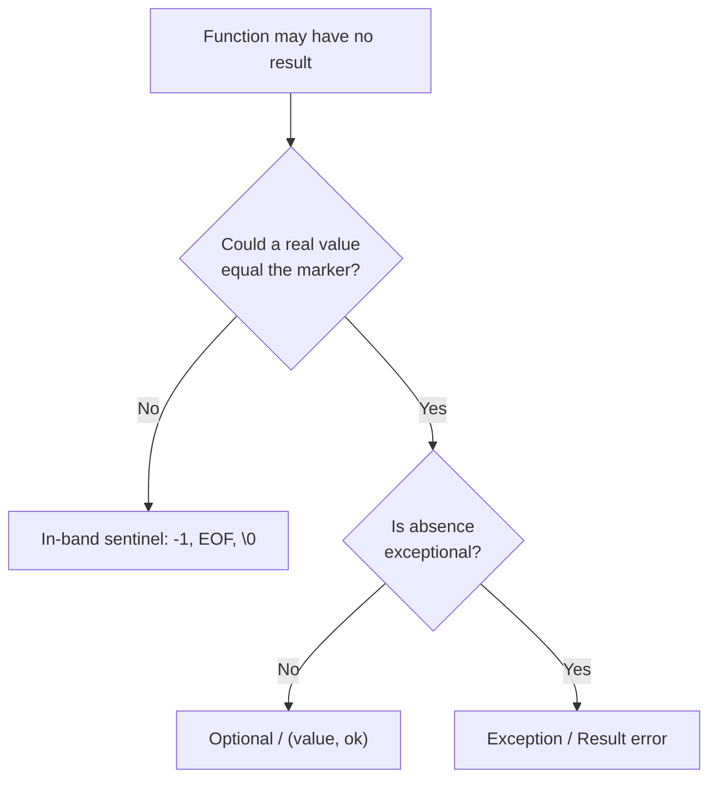
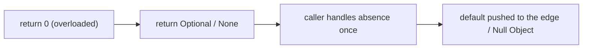

# Sentinel & Special Values — Middle Level

> **Category:** [Resource & Type-Safety Patterns](../README.md) — choosing *when* an in-band sentinel earns its keep and *when* it lies.

---

## Table of Contents

1. [Introduction](#introduction)
2. [When to Use a Sentinel](#when-to-use-a-sentinel)
3. [When NOT to Use a Sentinel](#when-not-to-use-a-sentinel)
4. [Real-World Cases](#real-world-cases)
5. [Production-Grade Code](#production-grade-code)
6. [Trade-offs](#trade-offs)
7. [Alternatives](#alternatives)
8. [Refactoring Away a Bad Sentinel](#refactoring-away-a-bad-sentinel)
9. [Edge Cases](#edge-cases)
10. [Tricky Points](#tricky-points)
11. [Best Practices](#best-practices)
12. [Summary](#summary)
13. [Diagrams](#diagrams)

---

## Introduction

> Focus: **Why** and **When**

The junior level taught the two faces of sentinels. The middle-level skill is **judgment**: drawing the line between the sentinel that is a clean, decades-old idiom and the one that quietly corrupts data three layers downstream.

The deciding question is always the same:

> *Can the special value ever collide with a legitimate value of the same type?*

- **No collision possible** → in-band sentinel is correct, fast, and idiomatic. `-1` from `indexOf`, `io.EOF`, the `\0` terminator, a `NIL` tree node.
- **Collision possible** → the sentinel is a latent bug. Reach for **out-of-band signaling**: `Optional`, `(value, ok)`, `Result`/`error`, exceptions, or the [Null Object](../../01-control-flow/03-null-object/junior.md).

This file is about applying that test in real codebases — and about the API-design rule that follows from it: **never overload a value from the valid range to mean failure.**

---

## When to Use a Sentinel

Use an in-band sentinel when **all** of these hold:

1. **The sentinel is out of the valid domain.** No legitimate value equals it.
2. **The absence case is unsurprising and locally handled.** Callers check it right away (search → "not found").
3. **It is part of a documented, stable contract.** `indexOf` returns `-1`; everyone knows it.
4. **Performance matters.** A wrapper (`Optional`) allocation is measurable on the hot path.
5. **It is a sentinel *node*, not value** — a structural dummy that removes boundary branches.

### Strong-fit examples

- Array/substring search: `-1` for "not found".
- Stream termination: `io.EOF`, `read() == -1`.
- C strings: the `\0` terminator.
- Sentinel nodes: dummy linked-list head/tail; the shared `NIL` node in a red-black tree; a sentinel placed at the end of an array so a search loop drops its bounds check.

---

## When NOT to Use a Sentinel

| Anti-pattern symptom | Better choice |
|---|---|
| `0` means both "zero" and "no data" | `Optional` / `(value, ok)` |
| `-1` returned for a number that can be negative | `Optional` / `Result` |
| `""` means "name not set" | `Optional<String>` |
| `null` returned for "absent", callers crash | `Optional` / [Null Object](../../01-control-flow/03-null-object/junior.md) |
| Sentinel must be checked but callers forget | out-of-band (compiler/API forces the check) |
| `NaN` flows through a financial calculation | explicit validation + error |

The unifying rule: **if the sentinel lives inside the valid range, it will eventually be mistaken for real data.**

---

## Real-World Cases

### 1. `String.indexOf` — the textbook *good* sentinel

```java
int i = csv.indexOf(',');
if (i == -1) { /* no comma — single field */ }
```

`-1` is impossible as a real index, the contract is universally known, and the check is right at the call site. This is the sentinel done right.

### 2. `io.EOF` — a sentinel *error*

```go
for {
    n, err := r.Read(buf)
    process(buf[:n])
    if errors.Is(err, io.EOF) { break } // expected, not exceptional
    if err != nil { return err }        // truly unexpected
}
```

EOF is *expected* and so is modeled as a sentinel error rather than a thrown exception. Note `errors.Is`, never `err == io.EOF` blindly — wrapped errors break `==`.

### 3. Sensor reading — the textbook *bad* sentinel

```python
def read_temp() -> float:
    if not sensor.ready():
        return 0.0          # BUG: 0.0 °C is a real temperature
    return sensor.value()
```

`0.0` is a perfectly valid temperature, so "no reading" and "freezing" are indistinguishable. The fix is `Optional[float]` / `float | None` *with* a documented contract.

### 4. SQL `NULL` — three-valued logic

`NULL` is SQL's sentinel for "unknown". It deliberately is **not** `0` or `''`, which is why `WHERE x = NULL` never matches (you must use `IS NULL`). The database designers understood the cardinal rule decades ago.

---

## Production-Grade Code

### Go — sentinel error vs `(value, ok)`, used correctly

```go
package cache

import "errors"

var ErrMiss = errors.New("cache: miss") // sentinel error, compared via errors.Is

type Cache struct{ m map[string][]byte }

// comma-ok: the right tool when the zero value ([]byte(nil)) is a legal entry.
func (c *Cache) Get(key string) ([]byte, bool) {
    v, ok := c.m[key]
    return v, ok
}

// sentinel error: the right tool when callers branch on a named failure.
func (c *Cache) Require(key string) ([]byte, error) {
    if v, ok := c.m[key]; ok {
        return v, nil
    }
    return nil, ErrMiss
}

func use(c *Cache) {
    if _, err := c.Require("k"); errors.Is(err, ErrMiss) {
        // refill...
    }
}
```

### Java — `Optional` + `OptionalInt` to avoid boxing

```java
import java.util.*;

public final class Inventory {
    private final Map<String, Integer> stock;
    Inventory(Map<String, Integer> stock) { this.stock = stock; }

    // GOOD: Optional makes absence explicit and un-ignorable.
    public Optional<Integer> quantity(String sku) {
        return Optional.ofNullable(stock.get(sku));
    }

    // OptionalInt avoids Integer boxing when the value is a primitive.
    public OptionalInt firstLowStock(int[] levels, int threshold) {
        for (int i = 0; i < levels.length; i++)
            if (levels[i] < threshold) return OptionalInt.of(i);
        return OptionalInt.empty();   // not -1
    }
}
```

> Use `OptionalInt`/`OptionalLong`/`OptionalDouble` for primitives — they avoid the boxing cost that makes some teams cling to `-1`.

### Python — `Optional` discipline and the unique-sentinel idiom

```python
from typing import Optional

def read_temp() -> Optional[float]:
    """None means 'no reading'; any float (incl. 0.0) is a real measurement."""
    if not sensor_ready():
        return None
    return sensor_value()

t = read_temp()
if t is not None:           # the check the type forces you to write
    record(t)

# When None itself is a valid value, use a private sentinel object:
_UNSET = object()
def update(profile, *, nickname=_UNSET):
    if nickname is not _UNSET:
        profile.nickname = nickname   # caller explicitly passed something (maybe None)
```

---

## Trade-offs

| Dimension | In-band sentinel | `Optional` / `(value, ok)` | Exception |
|---|---|---|---|
| Allocation | None | Wrapper / tuple | Stack trace (costly) |
| Forgettable? | Easy to forget | Hard to ignore | Impossible to ignore |
| Ambiguity risk | High if overloaded | None | None |
| Performance | Fastest | Slight cost | Worst on throw |
| Idiomatic for | search, EOF, nodes | "absence is normal" | "absence is exceptional" |

The axis is **"how easy is it to forget the check?"** vs **"how cheap is it?"** Sentinels are cheapest and most forgettable; exceptions are dearest and unforgettable.

---

## Alternatives

### vs `Optional` / `Maybe`

`Optional<T>` wraps "value or nothing" in the type system. The caller *cannot* dereference without acknowledging emptiness. Pay one allocation; lose one whole class of bug.

### vs Multiple return values (Go)

`(value, ok)` and `(value, err)` are Go's first-class out-of-band channels. The `ok`/`err` is positionally separate from the value — you must name it to ignore it (`_`), which is at least visible.

### vs `Result` / `Either`

For "value **or** a reason it failed", `Result<T, E>` (Rust), `Either<E, T>` (FP), or Go's `(T, error)` carries the error *as data*. Richer than a bare sentinel; see [Algebraic Data Types](../../../functional-programming/06-algebraic-data-types/junior.md).

### vs Null Object / Special Case

When callers would otherwise pepper the code with `if (x != null)`, return an object that *behaves correctly by default*: a `NullLogger`, a `GuestUser`, an `UnknownCustomer`. See [Null Object](../../01-control-flow/03-null-object/junior.md) and [Special Case](../../01-control-flow/04-special-case/junior.md).

### vs Type-Safe Enums

A "stringly-typed" sentinel like `status == "UNKNOWN"` is better modeled as an explicit enum member the compiler can check exhaustively. See [Type-Safe Enums](../02-type-safe-enums/junior.md).

---

## Refactoring Away a Bad Sentinel

### Before — overloaded `0`

```python
def discount(user) -> float:
    return user.loyalty_discount or 0.0   # 0.0 = "no discount" AND "0% tier"

price = base * (1 - discount(user))       # both cases collapse
```

**Step 1 — make absence explicit.**

```python
def discount(user) -> Optional[float]:
    return user.loyalty_discount          # may be None
```

**Step 2 — force the caller to decide.**

```python
d = discount(user)
price = base * (1 - d) if d is not None else base
```

**Step 3 — or push the default to the edge** with a Null Object / default policy, so the core logic never sees the absence at all.

The same three steps apply to `-1`, `""`, and `null`: *surface the absence in the type, then handle it once at the boundary.*

---

## Edge Cases

### 1. Wrapped sentinel errors

```go
err := fmt.Errorf("read config: %w", io.EOF)
err == io.EOF              // false! wrapping changed the pointer
errors.Is(err, io.EOF)     // true — always use this
```

### 2. `null` in a map

```java
map.get(k)                 // null: absent OR present-but-null?
map.containsKey(k)         // the disambiguator
```

### 3. `NaN` is its own special value

`NaN` propagates through arithmetic and breaks sorting and equality. It is a *floating-point* sentinel with rules of its own — never compare with `==`.

### 4. Sentinel must survive serialization

If `-1` means "not found" but you serialize the struct to JSON, downstream consumers may not know the convention. Out-of-band (`null` field, `present: false`) survives the boundary better.

---

## Tricky Points

- **`(value, ok)` vs `(value, err)` in Go.** Use `ok` when absence is ordinary (map miss); use `err` when the caller may want a *reason*. Don't return both.
- **`Optional` as a field or parameter is an anti-pattern.** `Optional` is designed for *return types*. Use `@Nullable` fields and overloaded methods instead (Effective Java, Item 55).
- **An empty collection beats a `null` collection.** `return List.of()`, not `null` — callers iterate without checking.
- **A sentinel node is not a sentinel value.** Nodes are a legitimate structural optimization (next level); overloaded values are a bug.

---

## Best Practices

1. **Apply the collision test before every sentinel.** Could a real value equal it? If yes, don't.
2. **Never overload a valid value to mean failure.**
3. **Use `(value, ok)` in Go when the zero value is legal.**
4. **Use `Optional` for return types in Java; never for fields/parameters.**
5. **Use `errors.Is` for sentinel errors**, never `==`.
6. **Return empty collections, not `null`.**
7. **Document the sentinel contract** explicitly in the signature/Javadoc/docstring.

---

## Summary

- The middle-level skill is **judgment**: collision-possible → out-of-band; collision-impossible → sentinel is fine.
- In-band sentinels shine for search, EOF, terminators, and sentinel nodes.
- Overloaded values (`0`, `""`, `null`, misplaced `-1`) leak silently — refactor to `Optional`/`(value, ok)`/`Result`.
- Never overload a valid value to mean failure; return empty collections, not `null`; compare sentinel errors with `errors.Is`.

---

## Diagrams

### The collision test



### Refactor a bad sentinel



[← Junior](junior.md) · [Resource & Type-Safety](../README.md) · [Roadmap](../../../README.md) · **Next:** [Senior](senior.md)
