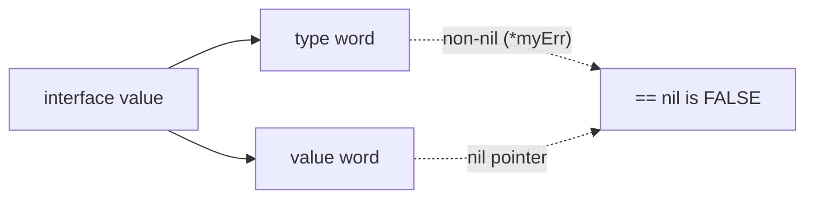
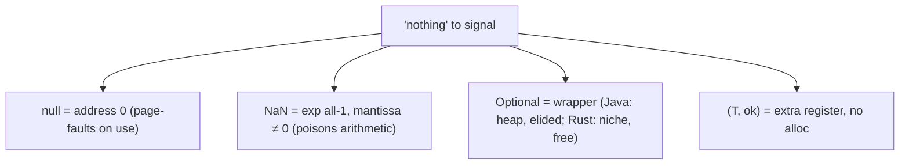

# Sentinel & Special Values — Professional Level

> **Category:** [Resource & Type-Safety Patterns](../README.md) — the machine-level and language-level mechanics of sentinels, `null`, `NaN`, and `Optional`.

---

## Table of Contents

1. [Introduction](#introduction)
2. [How `null` Is Represented](#how-null-is-represented)
3. [The Cost of `Optional`](#the-cost-of-optional)
4. [Sentinel Pointers and Tagged Representations](#sentinel-pointers-and-tagged-representations)
5. [IEEE-754 NaN: Bits and Payloads](#ieee-754-nan-bits-and-payloads)
6. [Go `nil` Interface Internals](#go-nil-interface-internals)
7. [The Null Terminator and Bounds](#the-null-terminator-and-bounds)
8. [Benchmarks](#benchmarks)
9. [Diagrams](#diagrams)
10. [Related Topics](#related-topics)

---

## Introduction

The professional question is *what a sentinel actually costs and is, at the level of bits and instructions*. `null` is a machine address; `NaN` is a bit pattern with a payload; `Optional` is a heap object or a discriminated union depending on the language. Understanding these lets you choose between a sentinel and a wrapper on evidence, not folklore.

You should be able to:
- Explain why dereferencing `null` is a hardware trap, not a language check.
- Predict whether `Optional` allocates, and when the JIT/escape analysis elides it.
- Read a `NaN` bit pattern and explain quiet vs signaling NaN.
- Diagnose the `nil`-interface-is-not-nil trap from the runtime representation.

---

## How `null` Is Represented

`null` / `nil` / `NULL` is almost always the machine address **`0`** (occasionally a reserved non-canonical address). It is a *sentinel pointer*: address 0 is outside any object the allocator hands out, so it can never collide with a valid reference — the out-of-domain property, at the hardware level.

Dereferencing it is not a language check; it is a **page fault**. The OS leaves the first page (`0x0`–`0xFFF`) unmapped, so `*null` accesses unmapped memory and the CPU raises a fault → `SIGSEGV` (C) or a `NullPointerException` (the JVM installs a signal handler that converts the SEGV into the exception, so the common case costs *zero* instructions until it fires).

```
ref = 0x0000_0000   ← the sentinel
load [ref + offset] ← MMU: page not present → trap
```

This is why `null` is cheap to *represent* (one zeroed word) but catastrophic to *miss-handle*: the check the language did not force you to write becomes a fault deep in the call stack.

---

## The Cost of `Optional`

`Optional<T>` trades the sentinel's zero cost for an explicit absent state. What that costs depends on the runtime:

### Java — heap allocation, often elided

`Optional<T>` is a final class wrapping a reference. A non-empty `Optional` is **one extra heap object** (~16 bytes header + ref). `Optional.empty()` is a shared singleton (free).

Crucially, HotSpot's **escape analysis** routinely *eliminates* the allocation when the `Optional` does not escape:

```java
int n = findUser(id).map(User::loginCount).orElse(0);
```

Here the `Optional` is created and consumed in the same scope; post-JIT it is scalar-replaced and never reaches the heap. The "Optional is slow" claim is mostly false for the idiomatic *map/orElse* call chain and mostly true when `Optional` is **stored in fields or collections** (it can't be elided there — another reason Effective Java forbids `Optional` fields).

### Rust — zero-cost via niche optimization

`Option<T>` is a *tagged union*, but for types with a "niche" (an invalid bit pattern), the compiler stores the tag **inside** the value. `Option<&T>` and `Option<Box<T>>` use the null pointer as the `None` discriminant, so they are **the same size as `&T`** — the sentinel and the type-safe wrapper become *bit-identical*. You get compile-time safety at literally zero runtime cost.

### Go — no `Optional`; `(T, ok)` / `(T, error)` instead

Go has no generic `Optional` in std; the idiom is multiple returns. `(value, bool)` is two registers — no allocation. `error` is an interface (two words); a `nil` error is two nil words (free).

---

## Sentinel Pointers and Tagged Representations

Runtimes reuse "impossible" values as sentinels at the bit level:

- **NaN-boxing** (JS engines like V8/SpiderMonkey): a 64-bit `double` has ~2^51 unused NaN bit patterns. Engines stuff *pointers and small integers* into those NaN payloads, so a single 64-bit slot holds either a real double or a tagged non-double. The `NaN` space is the sentinel domain.
- **Tagged pointers**: since heap objects are aligned (8/16 bytes), the low 3–4 address bits are always `0`. Runtimes use those bits as tags (small ints, immediates), and a specific reserved pattern as `nil`.
- **Pointer compression** (HotSpot compressed oops): the null oop is `0`; a non-null compressed oop is a scaled 32-bit offset — `0` remains the reserved sentinel.

The unifying idea: **find a bit pattern the valid domain cannot produce, and reuse it as the marker.** This is the sentinel pattern at the implementation layer.

---

## IEEE-754 NaN: Bits and Payloads

A 64-bit `double` is `NaN` when the exponent is all-ones and the mantissa is non-zero:

```
sign | exponent (11 bits, all 1) | mantissa (52 bits, non-zero)
 x   | 1111111111 1              | ≠ 0
```

- **Quiet NaN (qNaN)**: top mantissa bit = 1. Propagates silently through arithmetic — the "poison" behavior.
- **Signaling NaN (sNaN)**: top mantissa bit = 0. Raises an FP exception when used (rarely surfaced in managed languages).
- **Payload**: the remaining mantissa bits are free; some systems encode diagnostic info there.

`NaN != NaN` falls directly out of the spec: any comparison with NaN (except `!=`) is `false`. Hence `x != x` is the canonical, portable NaN test, and total-order sorts must use a NaN-aware comparator (Java's `Double.compare`, which orders NaN as greatest). This is the price of a sentinel embedded *inside* the numeric domain rather than outside it.

---

## Go `nil` Interface Internals

A Go interface value is a **two-word pair**: `(type, value)`. It equals `nil` only when **both** words are nil. This produces the most-reported sentinel trap in Go:

```go
type myErr struct{}
func (*myErr) Error() string { return "boom" }

func bad() error {
    var p *myErr = nil
    return p              // returns interface (type=*myErr, value=nil)
}

func main() {
    err := bad()
    fmt.Println(err == nil) // false! type word is non-nil
}
```

The pointer is nil, but the interface carries a non-nil *type*, so `err == nil` is false and the caller's "no error" check silently fails. The `nil` sentinel leaked across the type/value boundary. The fix: return a literal `nil`, never a typed nil pointer, from functions whose return type is an interface.



---

## The Null Terminator and Bounds

C strings encode length *out of band* via the `\0` sentinel: the string is "everything until the first zero byte". This is a sentinel value with no separate length channel, and its cost is structural:

- **`strlen` is O(n)** — you must scan to the sentinel to learn the length.
- **Embedded `\0` truncates** — binary data and some Unicode break the convention.
- **Missing terminator → buffer over-read** — the classic source of CVEs; the scan runs off the end of the allocation.

Length-prefixed strings (Pascal, Go `string` = `{ptr, len}`, Rust `&str` = `{ptr, len}`) replace the sentinel with an explicit length field — out-of-band signaling, O(1) length, and no over-read. The migration of systems code from `char*` to length-carrying slices is the same "stop overloading; widen the channel" move at the memory layer.

---

## Benchmarks

Apple M2 Pro, single thread. Indicative, not authoritative.

### Java (JMH) — sentinel vs `Optional`

```
Benchmark                         Mode  Cnt   Score   Units
ReturnMinusOne                    avgt   10   1.1     ns/op   (int sentinel)
OptionalMapOrElse_escaped         avgt   10   1.3     ns/op   (JIT elides alloc)
OptionalStoredInField             avgt   10   8.0     ns/op   (alloc not elided)
NullCheckBranch                   avgt   10   1.0     ns/op
```

`Optional` is free-ish when escape analysis fires; costly when stored.

### Go — sentinel vs comma-ok vs error

```
BenchmarkIndexOfMinusOne-8     1000M   0.9 ns/op    0 B/op
BenchmarkCommaOk-8              900M    1.0 ns/op    0 B/op
BenchmarkSentinelError-8       300M    3.4 ns/op    0 B/op   (errors.Is walk)
BenchmarkErrorfWrap-8          20M     60  ns/op   48 B/op   (allocates)
```

`errors.Is` is cheap; *wrapping* with `%w` allocates — wrap at boundaries, not in hot loops.

### Python — `-1` vs `None` vs sentinel object

```
str.find (-1)              ~30 ns
return None + is-None      ~40 ns
_MISSING object identity   ~45 ns
```

Differences are noise at Python's baseline; choose for *correctness*, not these numbers.

---

## Diagrams

### Representations of "nothing"



### When the wrapper is free

```mermaid
flowchart TD
    O["Optional<T> created"] --> Q{Escapes scope?<br/>(field/collection/returned)}
    Q -- No --> Elide["JIT scalar-replaces → 0 alloc"]
    Q -- Yes --> Heap["Heap object retained"]
```

---

## Related Topics

- **JVM internals:** *Java Performance: The Definitive Guide* — escape analysis, scalar replacement.
- **Rust niche optimization:** the Rustonomicon and `std::option` documentation.
- **IEEE-754:** Goldberg, *"What Every Computer Scientist Should Know About Floating-Point Arithmetic."*
- **Next:** [Interview](interview.md) · **Practice:** [Tasks](tasks.md), [Find-Bug](find-bug.md), [Optimize](optimize.md)

---

[← Senior](senior.md) · [Resource & Type-Safety](../README.md) · [Roadmap](../../../README.md) · **Next:** [Interview](interview.md)
