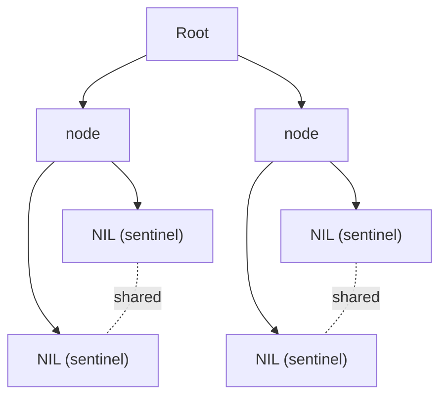
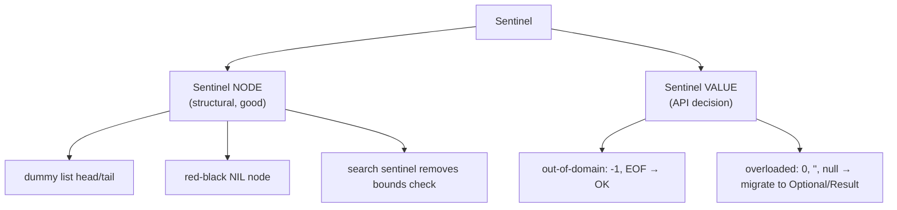
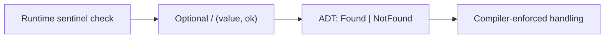

# Sentinel & Special Values — Senior Level

> **Category:** [Resource & Type-Safety Patterns](../README.md) — designing APIs and data structures where sentinels either earn their cost or are replaced by types.

---

## Table of Contents

1. [Introduction](#introduction)
2. [Sentinel Nodes in Data Structures](#sentinel-nodes-in-data-structures)
3. [The Sentinel-Search Optimization](#the-sentinel-search-optimization)
4. [API Design: Never Overload a Valid Value](#api-design-never-overload-a-valid-value)
5. [Out-of-Band Signaling at the Type Level](#out-of-band-signaling-at-the-type-level)
6. [The Billion-Dollar Mistake](#the-billion-dollar-mistake)
7. [Floating-Point Special Values](#floating-point-special-values)
8. [Code Examples — Advanced](#code-examples-advanced)
9. [Liabilities](#liabilities)
10. [Migration Patterns](#migration-patterns)
11. [Diagrams](#diagrams)
12. [Related Topics](#related-topics)

---

## Introduction

> Focus: **architecture** and **optimization**

At the senior level, sentinels split cleanly into two unrelated tools that share a name:

- **Sentinel *nodes / elements*** — a *legitimate, performance-motivated* technique. A real but inert element placed at a boundary so that algorithms never special-case "the edge". This is craft: it removes branches, shrinks code, and can speed up tight loops.
- **Sentinel *values*** — an *API-design* decision with correctness consequences. Here the senior job is mostly to *eliminate* overloaded values by pushing absence and error into the type system.

The senior decisions:
- Where does a sentinel **node** genuinely simplify a data structure?
- When is the allocation of `Optional`/`Result` worth paying, and when is a sentinel correct?
- How do you design a public API so a valid value can *never* be confused with failure?
- How do you migrate a codebase off `null`/`-1` without a flag day?

---

## Sentinel Nodes in Data Structures

A **sentinel node** is a real node that holds no client data but exists to remove boundary conditions.

### Doubly-linked list with a dummy head/tail

Without a sentinel, every insert/delete must branch on "is this the first/last node?" (`head == null`, `node.prev == null`). With a sentinel:

```
[sentinel] ⇄ A ⇄ B ⇄ C ⇄ [sentinel]
```

Now *every* real node has a non-null `prev` and `next`. Insertion and deletion become unconditional pointer rewires — no null checks, no special first/last logic. This is how `java.util.LinkedList` and the Linux kernel's `list_head` are built.

### The `NIL` node in red-black trees

A red-black tree uses **one shared, black sentinel `NIL`** node as the universal leaf. Every "real" leaf points its children at `NIL`. The rebalancing algorithm (rotations, recoloring) can read `NIL.color` and `NIL.parent` freely instead of guarding every `node == null`. CLRS presents the canonical version this way precisely because it deletes a swarm of edge cases from the delete-fixup.



The win is **fewer branches in the hottest code**, paid for with one extra allocation. This is the *good* sentinel taken to its structural conclusion.

---

## The Sentinel-Search Optimization

A classic loop-level use: append the target as a sentinel so the loop's **bounds check disappears**.

### Java

```java
// Naive: two comparisons per iteration (i < n) AND (a[i] == key)
static int find(int[] a, int n, int key) {
    for (int i = 0; i < n; i++)
        if (a[i] == key) return i;
    return -1;
}

// Sentinel search: one comparison per iteration. a has capacity n+1.
static int findSentinel(int[] a, int n, int key) {
    int last = a[n - 1];
    a[n - 1] = key;            // plant the sentinel
    int i = 0;
    while (a[i] != key) i++;   // no bounds check — key is guaranteed present
    a[n - 1] = last;           // restore
    if (i < n - 1 || a[n - 1] == key) return i;
    return -1;
}
```

By guaranteeing the key is found, the loop drops the `i < n` test. On modern superscalar CPUs the win is smaller than it once was (branch prediction is good), but the technique still appears in `strlen`, `memchr`, and parser inner loops. The cost: you mutate the array, so it is unusable on read-only or shared data — a senior trade-off, not a default.

---

## API Design: Never Overload a Valid Value

The single most important senior rule for *values*:

> **A function's failure or "absent" result must come from a value that the success path can never produce.**

Violations and fixes:

| Overload | Why it breaks | Fix |
|---|---|---|
| `parseInt` returns `-1` on error | `-1` is a valid integer | `(int, error)` / `Optional<Integer>` |
| `find()` returns `0` index on miss | `0` is the first index | `-1` (out of domain) or `Optional` |
| `size()` returns `-1` for "unknown" | `-1` collides if size can't be negative? then OK, but document | document, or `OptionalLong` |
| `getUser()` returns `null` | every caller must remember to check | `Optional` / Null Object |
| `getBalance()` returns `0.0` for "no account" | `0.0` is a real balance | `Optional<Money>` |

The design heuristic: **if the type's domain has no spare value, you have no safe sentinel — you must widen the channel** (tuple, `Optional`, `Result`, exception).

---

## Out-of-Band Signaling at the Type Level

The mature answer is to make absence and error *part of the type*, so the compiler enforces handling.

```
Sentinel:   T               ← absence hides inside a normal T
Optional:   Optional<T>     ← absence is a distinct state of the type
Result:     Result<T, E>    ← failure carries a reason, as data
Go:         (T, error)      ← second channel, conventionally checked
ADT:        Found(T) | NotFound   ← exhaustive, compiler-checked
```

The progression moves the check from *runtime hope* to *compile-time guarantee* — the same shift this whole [category](../README.md) is about. The cost is allocation and (sometimes) ceremony; the benefit is that "forgot to check the sentinel" becomes unrepresentable.

---

## The Billion-Dollar Mistake

`null` is the universal overloaded sentinel: a single value injected into *every* reference type, meaning "no object", that the type system (in C, Java pre-`Optional`, Go's `nil`) does **not** force you to check. Tony Hoare, who introduced it to ALGOL W in 1965, later called it his "billion-dollar mistake" for the decades of null-dereference crashes it caused.

The senior takeaways:

- **Languages fixed it by making absence a type, not a value.** Kotlin's `T?` vs `T`, Swift's `Optional`, Rust's `Option<T>` (no `null` at all), Java's `Optional`, TypeScript's `strictNullChecks`.
- **Where the language still has `null`/`nil`**, you impose the discipline: `@Nullable` annotations + static analysis (NullAway, SpotBugs), `Optional` at API boundaries, Null Object for behavioral absence.
- **`nil` interfaces in Go** are a notorious trap: a non-nil interface holding a nil pointer is `!= nil`. This is `null` overloading biting through the type system.

---

## Floating-Point Special Values

IEEE-754 defines three built-in sentinels with special semantics:

- **`NaN`** — "not a number". `NaN != NaN`; it propagates through every operation; it breaks total ordering (sorting becomes undefined). Detect with `Double.isNaN` / `math.IsNaN` / `math.isnan`, never `==`.
- **`±Inf`** — overflow/division-by-zero results. Comparable but absorbs arithmetic (`Inf - Inf = NaN`).
- **`-0.0`** — distinct bit pattern equal to `0.0` under `==` but distinguishable via `1/x` (`-Inf` vs `+Inf`) or `Math.copySign`.

These are *the* example of well-designed sentinels: out-of-domain by construction, with explicit detection functions. They are also a warning — `NaN` "poisoning" a financial or scientific pipeline is exactly the silent-leak failure mode, just standardized.

---

## Code Examples — Advanced

### Go — sentinel-error API with `errors.Is` and wrapping

```go
package store

import (
    "errors"
    "fmt"
)

var (
    ErrNotFound = errors.New("store: not found")
    ErrConflict = errors.New("store: conflict")
)

func (s *Store) Get(id string) (*Record, error) {
    r, ok := s.data[id]
    if !ok {
        return nil, fmt.Errorf("get %q: %w", id, ErrNotFound) // wrap, keep identity
    }
    return r, nil
}

func handler(s *Store, id string) int {
    _, err := s.Get(id)
    switch {
    case errors.Is(err, ErrNotFound):
        return 404
    case err != nil:
        return 500
    default:
        return 200
    }
}
```

`errors.Is` walks the `%w` chain, so wrapping for context never breaks sentinel matching — the key reason Go's sentinel errors scale.

### Java — Null Object replacing a sentinel `null`

```java
public interface AuditSink { void record(Event e); }

public final class NoopAuditSink implements AuditSink {
    public static final AuditSink INSTANCE = new NoopAuditSink();
    public void record(Event e) { /* intentionally nothing */ }
}

// Wiring: callers never null-check the sink.
AuditSink sink = config.auditEnabled() ? new DbAuditSink() : NoopAuditSink.INSTANCE;
sink.record(event);   // always safe — no `if (sink != null)`
```

The Null Object turns "absence" into "present, but inert" — the behavioral equivalent of replacing a sentinel with a type.

### Python — exhaustive matching as ADT-style absence

```python
from dataclasses import dataclass

@dataclass(frozen=True)
class Found:
    value: int

@dataclass(frozen=True)
class NotFound:
    pass

Lookup = Found | NotFound

def find(xs: list[int], target: int) -> Lookup:
    for x in xs:
        if x == target:
            return Found(x)
    return NotFound()

match find([1, 2, 3], 9):
    case Found(value=v):
        print("got", v)
    case NotFound():
        print("absent")     # the compiler/linter flags a missing case
```

This is the [algebraic data type](../../../functional-programming/06-algebraic-data-types/junior.md) generalization: absence becomes a *constructor*, not a magic value, and `match` forces both arms.

---

## Liabilities

### Symptom 1: Sentinel convention spreads beyond its module

`-1` for "not found" is fine inside one function; passed through three APIs and serialized to JSON, no consumer remembers the convention. Convert to `Optional`/`null`-field at the boundary.

### Symptom 2: Sentinel node leaks to clients

A dummy head node returned to a caller who iterates and renders garbage. Sentinel nodes are an *internal* device — never expose them across the API surface.

### Symptom 3: Overloaded `null` everywhere

A codebase where every getter may return `null` forces defensive null checks at every call site — and one missed check is an NPE. This is the billion-dollar mistake in miniature; introduce `Optional`/Null Object incrementally.

### Symptom 4: `NaN`/`Inf` reaching persistence

`NaN` serialized to JSON is invalid (JSON has no `NaN`); to a database it may store as `NULL` or error. Validate floats *before* the boundary.

---

## Migration Patterns

### `null`-returning method → `Optional`

```java
// Before
User getUser(String id) { return db.get(id); }   // may be null

// After
Optional<User> findUser(String id) { return Optional.ofNullable(db.get(id)); }
```

Keep the old method delegating during migration; deprecate; migrate callers PR-by-PR; delete.

### Overloaded `-1`/`0` → multiple return values (Go)

```go
// Before
func parse(s string) int { /* returns -1 on failure */ }

// After
func parse(s string) (int, error) { /* -1 no longer overloaded */ }
```

### Scattered `null` checks → Null Object

Replace `if (logger != null) logger.log(...)` everywhere with a `NoopLogger` injected once. The absence is handled at wiring time, not at every call site.

---

## Diagrams

### Two meanings of "sentinel"



### Pushing absence left



---

## Related Topics

- **Next:** [Sentinel & Special Values — Professional](professional.md)
- **Practice:** [Interview](interview.md), [Tasks](tasks.md), [Find-Bug](find-bug.md), [Optimize](optimize.md)
- **The cures:** [Null Object](../../01-control-flow/03-null-object/junior.md), [Special Case](../../01-control-flow/04-special-case/junior.md), [Type-Safe Enums](../02-type-safe-enums/junior.md), [Algebraic Data Types](../../../functional-programming/06-algebraic-data-types/junior.md).
- **Sentinel nodes in DSA:** linked-list and red-black-tree topics in the [Data Structures roadmap](../../../../data-structures-and-algorithms/README.md).

---

[← Middle](middle.md) · [Resource & Type-Safety](../README.md) · [Roadmap](../../../README.md) · **Next:** [Professional](professional.md)
