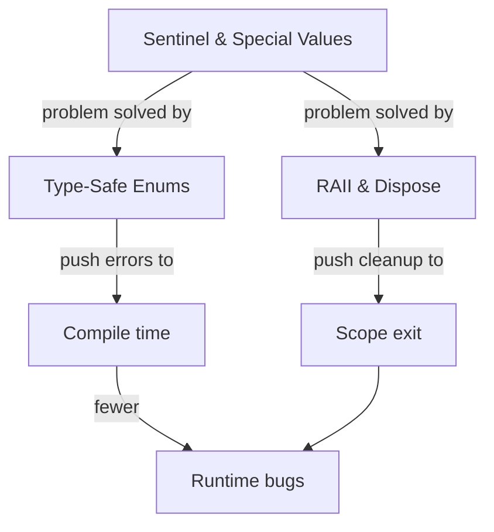

# Resource & Type-Safety Patterns

> *"The two cheapest bugs to prevent are the leaked file handle and the illegal state that the compiler could have rejected. Both are prevented by a pattern, not by discipline."*

---

## What This Category Covers

These three patterns move correctness from **runtime hope** to **compile-time and scope-time guarantee**. They share a single philosophy: *don't rely on a human remembering to do the right thing — make the right thing automatic or unrepresentable.*

- **Deterministic cleanup** — a resource (file, socket, lock, transaction) is released exactly when its scope ends, with no `finally` block to forget ([RAII & Dispose](01-raii-and-dispose/junior.md)).
- **Illegal states made impossible** — a fixed set of choices becomes a real type the compiler checks ([Type-Safe Enums](02-type-safe-enums/junior.md)), and the dangerous habit of overloading ordinary values to mean "special" is understood and contained ([Sentinel & Special Values](03-sentinel-and-special-values/junior.md)).

---

## The Three Patterns

| Pattern | Problem it solves | The move |
|---|---|---|
| [RAII & Dispose](01-raii-and-dispose/junior.md) | Leaked resources from forgotten or skipped cleanup on error paths | Bind the resource's lifetime to a scope/object so release is automatic (`defer`, `with`, `using`, try-with-resources, destructors) |
| [Type-Safe Enums](02-type-safe-enums/junior.md) | `int`/`String` constants that allow illegal values and "stringly-typed" bugs | Model the choices as a dedicated enum/sum type the compiler can exhaustively check |
| [Sentinel & Special Values](03-sentinel-and-special-values/junior.md) | `-1`, `""`, `NaN`, `0`, `NULL` overloaded to mean "absent/error", leaking into logic | Know the legitimate uses; prefer `Option`/`Optional`/`Result` where absence is real |

---

## How They Connect

- **Sentinel values** are the *problem statement* for this whole category: a magic `-1` or `NULL` is a correctness hole that the other two patterns close. Type-safe enums replace stringly-typed sentinels; `Option` types (covered alongside sentinels) replace `null`.
- **RAII** is **type safety applied to time** — the resource's *lifetime* becomes part of its type, so the compiler/runtime, not the programmer, guarantees release.
- Together they shift errors **left**: from production logs, to runtime exceptions, to compile errors and scope guarantees.

---

## When NOT to Use Them

- **Sentinel values are not always wrong** — `-1` for "index not found", `EOF`, and `NaN` are idiomatic and efficient in their domains. The pattern teaches *judgment*, not prohibition.
- **RAII** assumes deterministic scope; in fully garbage-collected, non-deterministic environments you may need explicit `dispose`/`close` plus a finalizer safety net instead.
- **Enums** can ossify — when the set of choices genuinely needs runtime extensibility, a registry or polymorphism may beat a closed enum.

---

## Related Topics

- **[Error Handling](../../clean-code/06-error-handling/README.md)** & **[Fail Fast](../01-control-flow/02-fail-fast/junior.md)** — the broader strategy these patterns plug into.
- **[Null Object](../01-control-flow/03-null-object/junior.md)** & **[Special Case](../01-control-flow/04-special-case/junior.md)** — the object-oriented answer to the same absence problem sentinels create.
- **[Algebraic Data Types](../../functional-programming/06-algebraic-data-types/junior.md)** — the functional generalization of type-safe enums and `Option`.
- **[Sequential Coupling](../../anti-patterns/02-design/README.md)** — the resource anti-pattern RAII dissolves.
