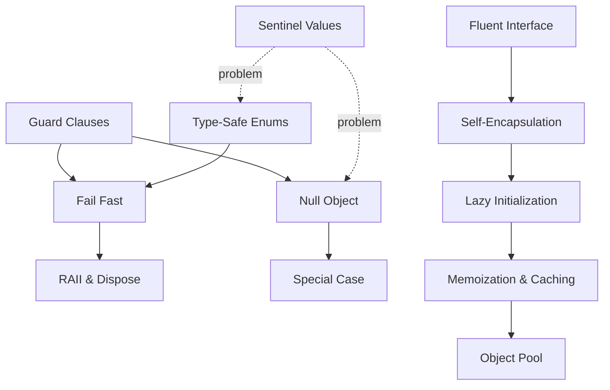

# Coding Patterns

> *"Design patterns are about objects and classes. Coding patterns are about the lines in front of you right now — the shape of a function, the guard at the top, the way a resource is released."*

---

## What Are Coding Patterns?

**Coding patterns** are small, recurring, language-level solutions that live *inside* a function or a single class — below the altitude of the [Gang-of-Four design patterns](../design-patterns/README.md), above the altitude of raw syntax. They are the idioms you reach for dozens of times a day without thinking: returning early instead of nesting, releasing a file handle the moment you open it, returning a do-nothing object instead of `null`.

Where a **design pattern** answers *"how should these objects collaborate?"*, a **coding pattern** answers *"what shape should this code take, right here?"* They are the difference between code that reads like prose and code that reads like a maze.

These patterns are **micro-decisions made consistently**. None of them is clever. Their power is cumulative: a codebase where every function guards its preconditions at the top, releases resources deterministically, and never returns a bare `null` is a codebase you can change without fear.

---

## The Three Categories

| Category | What it governs | Topics |
|---|---|---|
| **[Control Flow](01-control-flow/README.md)** | The path execution takes through a function — nesting, exits, the absence of a value | 4 |
| **[Object & State](02-object-and-state/README.md)** | How an object is built, when its state comes into existence, and how it is reused | 5 |
| **[Resource & Type Safety](03-resource-and-type-safety/README.md)** | Deterministic cleanup of resources, and pushing correctness into the type system | 3 |

Each topic is delivered as an **8-file suite**: `junior → middle → senior → professional`, plus `interview`, `tasks`, `find-bug`, and `optimize` for deliberate practice.

---

## All 12 Coding Patterns

### Control Flow — the shape of execution

| Pattern | One-line intent | Replaces |
|---|---|---|
| [Guard Clauses & Early Return](01-control-flow/01-guard-clauses-and-early-return/junior.md) | Handle invalid and edge cases up front, then return — keeping the happy path un-nested | The "arrow" of nested `if`/`else` |
| [Fail Fast](01-control-flow/02-fail-fast/junior.md) | Detect a broken precondition or corrupt state at the earliest possible point and stop | Silent propagation of bad state |
| [Null Object](01-control-flow/03-null-object/junior.md) | Return a do-nothing object with the expected interface instead of `null` | Scattered `if (x != null)` checks |
| [Special Case](01-control-flow/04-special-case/junior.md) | A dedicated object for a recurring special condition (missing customer, unknown user) | Special-case branches duplicated at every call site |

### Object & State — construction, timing, reuse

| Pattern | One-line intent | Replaces |
|---|---|---|
| [Fluent Interface](02-object-and-state/01-fluent-interface/junior.md) | Chain calls that each return the receiver, producing a readable mini-DSL | Imperative step-by-step setter sequences |
| [Lazy Initialization](02-object-and-state/02-lazy-initialization/junior.md) | Defer creating an expensive value until the first time it is actually needed | Paying construction cost that may never be used |
| [Memoization & Caching](02-object-and-state/03-memoization-and-caching/junior.md) | Cache the result of a pure computation keyed by its inputs | Recomputing the same answer repeatedly |
| [Object Pool](02-object-and-state/04-object-pool/junior.md) | Reuse a bounded set of expensive-to-create objects instead of allocating per use | Churn of allocation/teardown on hot paths |
| [Self-Encapsulation](02-object-and-state/05-self-encapsulation/junior.md) | Access a class's own fields through accessors, even internally | Internal code coupled to raw field representation |

### Resource & Type Safety — cleanup and correctness

| Pattern | One-line intent | Replaces |
|---|---|---|
| [RAII & Dispose](03-resource-and-type-safety/01-raii-and-dispose/junior.md) | Bind a resource's lifetime to a scope or object so cleanup is automatic and deterministic | Manual, easily-forgotten `close()`/`free()` |
| [Type-Safe Enums](03-resource-and-type-safety/02-type-safe-enums/junior.md) | Model a fixed set of choices as a real type the compiler can check | `int`/`String` constants and "stringly-typed" code |
| [Sentinel & Special Values](03-resource-and-type-safety/03-sentinel-and-special-values/junior.md) | Use (and know when *not* to use) in-band markers like `-1`, `""`, `NaN`, `NULL` | Ambiguous magic values that leak into logic |

---

## How These Patterns Relate

Coding patterns are not isolated tricks; they reinforce one another around three goals — **flatten the path**, **make absence explicit**, and **make cleanup and correctness automatic**.

- **Guard clauses** are how you **fail fast**: the guard at the top of a function is the earliest point to reject bad input.
- **Null Object** and **Special Case** are the constructive answer to the problems that **sentinel values** create — instead of a magic `null`/`-1` that every caller must remember to check, you return an object that behaves correctly by default.
- **Self-encapsulation** is what makes **lazy initialization** and **memoization** possible without rewriting every call site: because internal code already goes through an accessor, you can slip the "compute-on-first-access" logic in behind it.
- **RAII / dispose** is **fail-fast applied to resources** — the resource is released deterministically at scope exit rather than left to chance.
- **Type-safe enums** push the work of `fail fast` into the *compiler*: an illegal state becomes a compile error instead of a runtime branch.

---

## When to Reach for Each

| If you are… | Reach for… |
|---|---|
| Staring at code nested four `if`s deep | [Guard Clauses & Early Return](01-control-flow/01-guard-clauses-and-early-return/junior.md) |
| Debugging a crash that happened far from its cause | [Fail Fast](01-control-flow/02-fail-fast/junior.md) |
| Writing `if (x != null)` for the tenth time today | [Null Object](01-control-flow/03-null-object/junior.md) / [Special Case](01-control-flow/04-special-case/junior.md) |
| Building an object with many optional parts | [Fluent Interface](02-object-and-state/01-fluent-interface/junior.md) (see also [Builder](../design-patterns/01-creational/03-builder/junior.md)) |
| Paying startup cost for something rarely used | [Lazy Initialization](02-object-and-state/02-lazy-initialization/junior.md) |
| Recomputing the same expensive answer | [Memoization & Caching](02-object-and-state/03-memoization-and-caching/junior.md) |
| Allocating/freeing the same heavy object in a hot loop | [Object Pool](02-object-and-state/04-object-pool/junior.md) |
| Forgetting to `close()` files, sockets, or locks | [RAII & Dispose](03-resource-and-type-safety/01-raii-and-dispose/junior.md) |
| Passing `int` codes or magic strings to mean a choice | [Type-Safe Enums](03-resource-and-type-safety/02-type-safe-enums/junior.md) |
| Tempted to return `-1` to mean "not found" | [Sentinel & Special Values](03-resource-and-type-safety/03-sentinel-and-special-values/junior.md) |

---

## Relationship to Other Chapters

- **[Anti-Patterns](../anti-patterns/README.md)** — most coding patterns here are the *cure* to a named anti-pattern: guard clauses cure the [Arrow Anti-Pattern](../anti-patterns/01-development/README.md); type-safe enums cure the [Magic Container](../anti-patterns/02-design/README.md); RAII cures [Sequential Coupling](../anti-patterns/02-design/README.md) around resources.
- **[Clean Code](../clean-code/README.md)** — these patterns are the concrete moves behind clean-code principles like small functions, [Tell-Don't-Ask](../clean-code/05-objects-and-data-structures/README.md), and [immutability](../clean-code/14-immutability/).
- **[Design Patterns](../design-patterns/README.md)** — coding patterns sit one level below GoF patterns; Fluent Interface pairs with [Builder](../design-patterns/01-creational/03-builder/junior.md), Null Object is a [behavioral](../design-patterns/03-behavioral/README.md) micro-pattern.
- **[Refactoring](../refactoring/README.md)** — adopting these patterns *is* refactoring: "Replace Nested Conditional with Guard Clauses" and "Introduce Null Object" are named refactorings.

---

## How to Study This Chapter

1. Start with **[Control Flow](01-control-flow/README.md)** — these patterns change the code you write *today*, in every function.
2. Move to **[Object & State](02-object-and-state/README.md)** once you are comfortable shaping flow.
3. Finish with **[Resource & Type Safety](03-resource-and-type-safety/README.md)** — the patterns that prevent whole classes of production bugs.

Within each topic, read `junior → middle → senior → professional` in order, then do `tasks`, `find-bug`, and `optimize` to make the pattern muscle memory.
