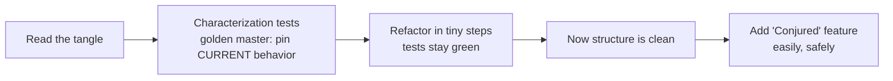

# Kata & Deliberate Practice — Practice Tasks

> **Category:** [Craftsmanship Disciplines](../README.md) — practice programming on purpose, on safe throwaway problems, the way a musician practices scales.

A curated catalog of 11 famous katas, ordered roughly easiest to hardest. Each entry gives the **spec**, the **learning goal** (what skill it trains), **constraints/variations** to make it deliberate practice, a worked **starting point** where helpful, and a **"Do it again differently"** note — because the whole point is to repeat each kata many times, each time differently.

> **How to use this catalog.** Pick *one* kata and *one* focus/constraint per session. Do it test-first ([Three Laws of TDD](../01-the-three-laws-of-tdd/junior.md)). Time-box it (30–45 min). Retrospect for 2 minutes: did the focus skill get smoother? Then **delete the code** and move on. Return to the same kata next week with a different constraint.

---

## Table of Contents

1. [Kata 1: FizzBuzz](#kata-1-fizzbuzz)
2. [Kata 2: String Calculator](#kata-2-string-calculator)
3. [Kata 3: Prime Factors](#kata-3-prime-factors)
4. [Kata 4: Roman Numerals](#kata-4-roman-numerals)
5. [Kata 5: Bowling Game](#kata-5-bowling-game)
6. [Kata 6: Tennis](#kata-6-tennis)
7. [Kata 7: Bank Account](#kata-7-bank-account)
8. [Kata 8: Mars Rover](#kata-8-mars-rover)
9. [Kata 9: Conway's Game of Life](#kata-9-conways-game-of-life)
10. [Kata 10: Gilded Rose (Refactoring)](#kata-10-gilded-rose-refactoring)
11. [Kata 11: Theatrical Players Refactoring](#kata-11-theatrical-players-refactoring)
12. [Building Your Practice Habit](#building-your-practice-habit)
13. [A 4-Week Starter Regimen](#a-4-week-starter-regimen)

---

## Kata 1: FizzBuzz

**Spec:** For the numbers 1 to 100, print the number — but `Fizz` for multiples of 3, `Buzz` for multiples of 5, and `FizzBuzz` for multiples of both.

**Learning goal:** The red-green-refactor rhythm and **taking the smallest possible step**. The domain is trivial on purpose — all attention goes to *how* you work.

**Constraints / variations:**
- *Tiny steps* — write the simplest code that passes each new test, even hard-coding, and let later tests force generality.
- *No conditionals* — express the rules without `if`/`switch` (lookup table, modular composition).
- *No mutation* — return values, never reassign.
- *5-minute clock* — once it's automatic, race it to expose any remaining friction.

**Starting point (Python, test-first):**

```python
def test_one_is_one():       assert fizzbuzz(1) == "1"
def test_three_is_fizz():    assert fizzbuzz(3) == "Fizz"
def test_five_is_buzz():     assert fizzbuzz(5) == "Buzz"
def test_fifteen():          assert fizzbuzz(15) == "FizzBuzz"
```

```python
def fizzbuzz(n):
    out = ("Fizz" if n % 3 == 0 else "") + ("Buzz" if n % 5 == 0 else "")
    return out or str(n)
```

**Do it again differently:** First time, drive it test-first with hard-coded steps. Second time, "no `if`" — build a `{3: "Fizz", 5: "Buzz"}` map and concatenate. Third time, in a language you're learning. Notice how the second and third feel — the friction shows you what to practice.

---

## Kata 2: String Calculator

**Spec:** Implement `add(string)` incrementally:
1. `""` → `0`; one number → that number; `"1,2"` → `3`.
2. Any count of comma-separated numbers.
3. New-lines may also separate numbers (`"1\n2,3"` → `6`).
4. A custom delimiter on the first line: `"//;\n1;2"` → `3`.
5. Negatives throw, listing all negatives in the message.
6. Numbers > 1000 are ignored.

**Learning goal:** Driving a growing spec **one test at a time**, and watching generality emerge. Excellent for practicing the [Transformation Priority Premise](middle.md) and resisting the urge to build everything up front.

**Starting point (Go, after the first three stages):**

```go
func Add(s string) int {
    if s == "" {
        return 0
    }
    sum := 0
    for _, part := range strings.FieldsFunc(s, func(r rune) bool {
        return r == ',' || r == '\n'
    }) {
        n, _ := strconv.Atoi(part)
        sum += n
    }
    return sum
}
```

**Do it again differently:** First pass, mutate a running sum in a loop. Second pass, *no mutation* — parse to a slice and fold/reduce. Third pass, focus on the *error path*: make the negatives-exception message excellent and test it precisely. Each pass trains a different muscle on the same problem.

---

## Kata 3: Prime Factors

**Spec:** `primeFactors(n)` returns the list of prime factors of `n` in ascending order. `primeFactors(12)` → `[2, 2, 3]`; `primeFactors(1)` → `[]`.

**Learning goal:** The single best kata for experiencing an algorithm **emerging from tests**. Done with tiny steps and the Transformation Priority Premise, the factoring loop assembles itself — you never "design" it.

**Worked emergence (Java):** Drive it one assertion at a time and watch the code grow only as far as each test forces:

```java
List<Integer> primeFactors(int n) {
    List<Integer> factors = new ArrayList<>();
    for (int divisor = 2; n > 1; divisor++) {
        for (; n % divisor == 0; n /= divisor) {
            factors.add(divisor);
        }
    }
    return factors;
}
```

The remarkable part is the *sequence* of red bars that drives you here: `1`→`[]`, `2`→`[2]`, `3`→`[3]`, `4`→`[2,2]` (introduces the inner loop), `8`→`[2,2,2]`, `9`→`[3,3]` (introduces the outer loop). Each test forces exactly one transformation.

**Constraints / variations:** *Strict TPP* — at every red bar, apply only the lowest-priority transformation that goes green. *No early design* — you may not write a loop until a test demands it.

**Do it again differently:** First pass, just get it green any way. Second pass, *strict TPP* — narrate which transformation each step is, and feel the algorithm assemble itself. The contrast between the two passes is the lesson.

---

## Kata 4: Roman Numerals

**Spec:** Convert an integer (1–3999) to its Roman numeral. `1`→`I`, `4`→`IV`, `9`→`IX`, `2024`→`MMXXIV`. (Variation: also convert Roman → integer.)

**Learning goal:** Expressing rules as **data, not nested conditionals**. The naive solution is a thicket of `if`s; the elegant one is a table you iterate. Trains "replace conditionals with data."

**The data-driven shape (Python):**

```python
NUMERALS = [(1000, "M"), (900, "CM"), (500, "D"), (400, "CD"),
            (100, "C"), (90, "XC"), (50, "L"), (40, "XL"),
            (10, "X"), (9, "IX"), (5, "V"), (4, "IV"), (1, "I")]

def to_roman(n):
    result = ""
    for value, symbol in NUMERALS:
        while n >= value:
            result += symbol
            n -= value
    return result
```

**Do it again differently:** First pass, let it grow into ugly conditionals via TDD — *then refactor* to the table (practicing the refactor itself). Second pass, start from the table and watch how few tests it takes. Third pass, do the reverse direction (Roman → integer) and notice the subtraction rule (`IV`, `IX`) as the tricky edge.

---

## Kata 5: Bowling Game

**Spec:** Score a game of ten-pin bowling. A game is 10 frames; a *spare* (all 10 in two rolls) adds the next roll as bonus; a *strike* (10 in one roll) adds the next two rolls; the 10th frame allows bonus rolls. Input is the sequence of rolls; output is the final score.

**Learning goal:** A favorite of Robert C. Martin. Trains **letting a clean design emerge** for a deceptively fiddly scoring problem, and resisting the over-engineered `Frame`/`Roll` class hierarchy that the problem *seems* to demand but doesn't.

**The lesson:** Most people instinctively model `Game → Frame → Roll` objects and drown in complexity. TDD pushes you toward a far simpler design: a flat list of rolls and a scoring loop that peeks ahead for bonuses. The kata's whole point is discovering that the obvious object model is *worse* than the simple list — a powerful lesson in [Simple Design](../04-simple-design/junior.md).

**Constraints / variations:** *No frame objects* — score directly from the roll list. *Pure functions only* — no mutable scorer state.

**Do it again differently:** First pass, deliberately build the `Frame` object model and feel the pain. Second pass, throw it away and do the simple roll-list version. Experiencing both is the most instructive way to internalize "don't over-model."

---

## Kata 6: Tennis

**Spec:** Score a single game of tennis between two players. Points go `Love, Fifteen, Thirty, Forty`; at 40–40 it's `Deuce`; a player who leads by one after deuce has `Advantage`; two points clear after deuce wins.

**Learning goal:** Mapping a **rule-heavy state space** cleanly, and (in the refactoring variant) cleaning up famously messy implementations. Lots of edge cases (deuce, advantage, win) make it great for test-design practice — one assertion per case.

**Constraints / variations:**
- *Greenfield* — drive the scorer from scratch, test-first, focusing on intention-revealing names for the states.
- *Refactoring variant* — the kata ships several pre-written ugly implementations (deeply nested conditionals, giant `switch`). Pick one and clean it up *without changing behavior*, under green tests.

**Do it again differently:** First do it greenfield with tiny steps. Then take a provided messy version and refactor it — practicing reading and untangling someone else's code, which is most of real work. Compare your greenfield design to the cleaned-up one.

---

## Kata 7: Bank Account

**Spec (Sandro Mancuso's version):** Implement an `Account` with three operations — `deposit(amount)`, `withdraw(amount)`, and `printStatement()` — that prints transactions with date, amount, and a running balance, **most recent first**.

```
Date       || Amount || Balance
14/01/2012 || -500   || 2500
13/01/2012 || 2000   || 2500
10/01/2012 || 1000   || 1000
```

**Learning goal:** Practicing **outside-in TDD** and where to put boundaries. The tricky, instructive part: the statement is the *output*, and dates/printing are *side effects* — so the kata trains isolating I/O (clock, console) behind seams so the core stays pure and testable. Great for practicing [test doubles](../02-test-design-and-fixtures/junior.md) and dependency injection.

**Constraints / variations:**
- *Tell, don't ask* — `printStatement()` formats; callers don't pull raw data out.
- *Inject the clock and the printer* — no hidden `now()` or `print` in the core; pass them in so tests are deterministic.
- *Immutable transactions* — record events, compute the statement by folding them.

**Do it again differently:** First pass, focus on injecting the clock so the date is testable. Second pass, model deposits/withdrawals as an immutable event list and *derive* the statement (an event-sourcing flavor). The second design reveals how much cleaner derived state can be.

---

## Kata 8: Mars Rover

**Spec:** A rover sits on a grid at `(x, y)` facing `N/E/S/W`. It accepts a string of commands: `L` (turn left), `R` (turn right), `M` (move forward one cell). Return its final position and heading. Extensions: wrap around grid edges; stop and report if a move would hit a known obstacle.

**Learning goal:** **Domain modeling** and the **Command pattern**. Trains turning a small language of commands into clean, composable behavior — and resisting a giant `switch` in favor of polymorphic commands or a transition table.

**A clean shape (Go sketch):**

```go
type Heading int // N, E, S, W

var moves = map[Heading][2]int{N: {0, 1}, E: {1, 0}, S: {0, -1}, W: {-1, 0}}

func (r Rover) execute(cmds string) Rover {
    for _, c := range cmds {
        switch c {
        case 'L': r.heading = (r.heading + 3) % 4
        case 'R': r.heading = (r.heading + 1) % 4
        case 'M': d := moves[r.heading]; r.x += d[0]; r.y += d[1]
        }
    }
    return r
}
```

**Constraints / variations:** *Immutable rover* — each command returns a new rover (as above). *No conditionals for turning* — use modular arithmetic / lookup tables for headings. *Obstacle detection* — add the "stop and report" rule and watch how it stresses your design.

**Do it again differently:** First pass, plain command loop. Second pass, *immutable* — each step returns a new rover and you `fold` the command string. Third pass, add wrapping and obstacles; notice whether your design absorbed the new rules cleanly or fought back — that's feedback on your modeling.

---

## Kata 9: Conway's Game of Life

**Spec:** An infinite grid of cells, each alive or dead. Compute the next generation from these rules:
- A live cell with 2 or 3 live neighbours survives.
- A dead cell with exactly 3 live neighbours becomes alive.
- All other cells die or stay dead.

**Learning goal:** The **coderetreat kata** — the one you do all day under escalating constraints. It has just enough depth to support endless variation, a crisp spec, and a satisfying visual result, yet is small enough to attempt fresh in 45 minutes. Trains clean modeling of state transitions and (under constraints) every design muscle you have.

**Classic coderetreat constraints (one per round, delete between rounds):**
- *No `if`* / no conditionals.
- *No mutation* — next generation is a pure function of the previous one.
- *No primitives* across method boundaries (Object Calisthenics).
- *No naming* — variables must be a single letter (forces tiny, obvious methods).
- *Ping-pong pairing* — one writes a failing test, the other makes it pass, swap.
- *Silent pairing* — no talking; communicate only through code and tests.
- *Verbs, not nouns* — model the solution with functions only, no classes.

**The hidden trap:** people obsess over the grid representation (2D array? coordinates? sparse set?). The deliberate-practice move is to *try a different representation each round* — a `Set` of live `(x,y)` coordinates often beats a 2D array and makes "infinite grid" trivial. Discovering that is the kind of insight only repetition surfaces.

**Do it again differently:** This kata is *designed* to be redone forever. Each round: delete everything, switch pairs, add one constraint. Over a coderetreat day you'll implement Game of Life six times and each will be genuinely different. The point is never to finish — it's to feel each constraint reshape your design.

---

## Kata 10: Gilded Rose (Refactoring)

**Spec:** You inherit a working but **ugly** inventory-update function (a thicket of nested `if`s mutating item quality each day). The rules: most items degrade in quality each day, faster past their sell-by date; "Aged Brie" *increases* in quality; "Sulfuras" never changes; "Backstage passes" increase faster as the concert nears, then drop to 0 after. Quality is clamped 0–50. **Your task:** add a new "Conjured" item type that degrades *twice* as fast — but first make the existing tangle safe to change.

**Learning goal:** The canonical **refactoring kata** and a complete rehearsal of the [working-with-legacy-code](../../working-with-legacy-code/README.md) workflow. You may *not* just rewrite it — the discipline is: **pin the behavior, then change the structure, then add the feature.**

**The workflow it trains:**



1. **Characterize.** The existing behavior is the spec. Write tests that capture what the code *currently does* (a "golden master" — run it over many items/days and snapshot the output). Now you have a safety net.
2. **Refactor under green.** Untangle the nested conditionals in tiny steps — extract methods, replace conditionals with polymorphism or a strategy per item type — re-running tests after every change.
3. **Add the feature.** Only once the structure is clean is "Conjured items degrade twice as fast" a trivial, safe change. If adding it is *hard*, your refactoring wasn't done.

**Constraints / variations:** *Micro-commits* — commit on every green bar; never break the build. *Golden master first* — no structural change until behavior is pinned. *No behavior change during refactor* — the new feature comes strictly after.

**Do it again differently:** First pass, characterization-test the whole thing as a golden master, then refactor. Second pass, refactor toward a *strategy-per-item-type* design. Third pass, try a *no-`if`* (polymorphic) target. The kata is a reusable rehearsal of the most valuable real-world skill: making messy code safe to change.

---

## Kata 11: Theatrical Players Refactoring

**Spec (Martin Fowler, *Refactoring* 2nd ed., opening example):** You're given a `statement()` function that prints a billing statement for a theatrical company's performances — a single long function mixing calculation, formatting, and amount/credit rules. **Task:** refactor it so a new requirement (an HTML statement, plus new play genres) becomes easy to add.

**Learning goal:** Practicing **Fowler's named refactorings in sequence** — Extract Function, Replace Temp with Query, Split Phase (separate calculation from formatting), Replace Conditional with Polymorphism. It's the textbook example, so it doubles as a guided tour of the refactoring catalog. See [Refactoring as a Discipline](../03-refactoring-as-a-discipline/middle.md).

**The workflow it trains:** Same disciplined rhythm as Gilded Rose, but here you're consciously applying *specific named moves* and learning when each applies:
1. Self-test the function (capture current output).
2. **Extract** the calculation pieces; **rename** for intent.
3. **Split phase** — separate the "compute the data" stage from the "render the text" stage, so a second renderer (HTML) is cheap.
4. **Replace conditional with polymorphism** for the per-genre rules.

**Do it again differently:** First pass, follow Fowler's sequence and *name each move as you make it* ("this is Extract Function," "this is Split Phase"). Second pass, do it from scratch aiming straight for the split-phase + polymorphic design and see how much the named moves have become instinct. The goal is for the refactoring catalog to live in your fingers.

---

## Building Your Practice Habit

A kata catalog is useless without a habit to run it. Make practice stick:

1. **Schedule it.** A fixed recurring slot (even 20–25 minutes, a few times a week) beats waiting for motivation. Put it on the calendar.
2. **Lower activation energy.** Keep a ready repo with a green test scaffold per language so you can start in 30 seconds.
3. **Always pick a focus, then a kata.** "Tonight: tiny steps." *Then* choose the problem. The focus is the practice; the kata is the vehicle.
4. **Time-box and retro.** A clock keeps practice from sprawling; a 2-minute "what got smoother? what's next?" turns reps into learning.
5. **Throw the code away.** Its value was the learning. Deleting it removes the temptation to "finish" and primes a fresh attempt.
6. **Re-do, don't move on.** Resist collecting katas. Depth (the same kata ten ways) beats breadth (ten katas once).
7. **Practice with others sometimes.** A pair or a dojo gives feedback you can't give yourself. (See [Pair & Mob Programming](../05-pair-and-mob-programming/junior.md).)
8. **Log lightly.** Date, kata, focus, what got easier, next focus. Over weeks the log shows whether a weakness is actually closing.

---

## A 4-Week Starter Regimen

A concrete program to turn this catalog into a habit. ~25 minutes a session, ~3 sessions a week, one focus each.

| Week | Mon — focus: TDD rhythm | Wed — focus: design | Fri — focus: refactoring |
|---|---|---|---|
| **1** | FizzBuzz, tiny steps | Roman Numerals, rules-as-data | Tennis (refactor a messy version) |
| **2** | Prime Factors, strict TPP | Mars Rover, immutable | Gilded Rose: characterize + refactor |
| **3** | String Calculator, one test at a time | Bowling, no frame objects | Gilded Rose: strategy-per-type target |
| **4** | FizzBuzz, *no `if`* (compare to week 1) | Game of Life, `Set` representation | Theatrical Players (named Fowler moves) |

Notice the deliberate repetition: FizzBuzz returns in week 4 under a harder constraint so you can *feel* the improvement; Gilded Rose recurs to drill the legacy workflow twice with different targets. After four weeks, audit: which focus skill got noticeably smoother? That answer chooses the *next* month's regimen.

> **The meta-lesson of this whole catalog:** you will never write FizzBuzz, score bowling, or model a Mars rover at work. The programs are disposable dumbbells. What you keep is the *fluency* — small steps, clean tests, fearless refactoring, intention-revealing names, design restraint — which you built where it was safe to be slow and wrong, so it would be there, automatic, when production isn't safe at all.

---

[← Interview](interview.md) · [Craftsmanship Disciplines](../README.md) · [Roadmap](../../../README.md) · **Back to:** [Junior](junior.md)
