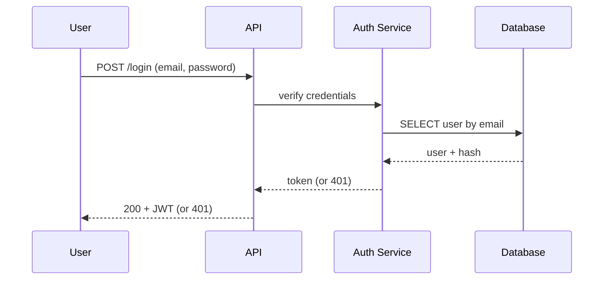
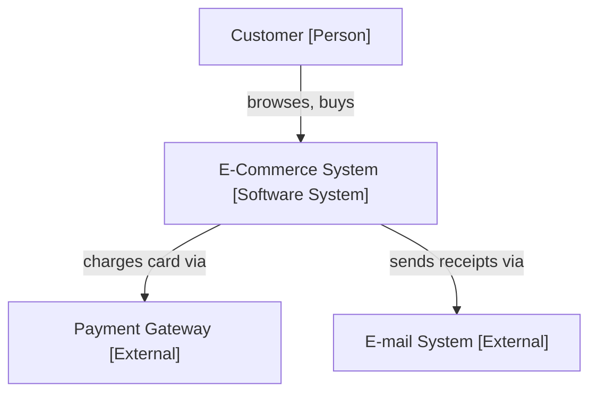

# Diagrams as Code — Interview Questions

> **Category:** [Documentation](../README.md) — write architecture and flow diagrams in plain-text markup, commit them next to the code, and render them automatically — instead of pasting binary screenshots that rot.

Conceptual and practical questions, graded junior → professional, plus coding tasks, trick, and behavioral questions.

---

## Table of Contents

1. [Junior Questions](#junior-questions)
2. [Middle Questions](#middle-questions)
3. [Senior Questions](#senior-questions)
4. [Professional Questions](#professional-questions)
5. [Practical Tasks](#practical-tasks)
6. [Trick Questions](#trick-questions)
7. [Behavioral Questions](#behavioral-questions)
8. [Tips for Answering](#tips-for-answering)

---

## Junior Questions

### J1. What is "diagrams as code"?

**Answer:** A diagram defined as committed plain-text markup (e.g., Mermaid, PlantUML, DOT) that a tool renders into a picture automatically — instead of a hand-drawn binary image exported from a GUI tool. The text is the source of truth and lives in the repo.

### J2. Why is it better than pasting a screenshot from draw.io or Lucidchart?

**Answer:** The text is version-controlled, diffable, and reviewable in PRs, lives next to the code, can be regenerated in CI, and is editable by anyone who can type. A screenshot is a binary blob — un-diffable, un-reviewable, high-friction to update — so it drifts out of date (doc rot) and nobody fixes it.

### J3. Which tool renders natively in GitHub Markdown?

**Answer:** **Mermaid.** You write a fenced ` ```mermaid ` block and GitHub/GitLab render it as a picture, no tooling. PlantUML and Graphviz/DOT do *not* render natively — you render them in CI or via a service like Kroki.

### J4. Name three diagram types and the question each answers.

**Answer:** Sequence → in what order do parts call each other (a protocol). Flowchart → what are the steps and decision branches. ER → what entities exist and how are they related (the data model). (Also: class → type structure; state → lifecycle/legal transitions; deployment → what runs where.)

### J5. In which document would you embed a diagram?

**Answer:** Inside the README (architecture overview), a design doc/RFC (proposed design), an ADR (a decision), or a runbook (incident flow / topology) — co-located with the prose that explains it, not as an orphan image file.

### J6. What does "one diagram, one question, one audience" mean?

**Answer:** Each diagram should answer a single question for a single reader. A diagram trying to show data *and* runtime *and* logic at once shows none clearly — split it into several focused diagrams.

### J7. Name three tools for diagrams as code besides Mermaid.

**Answer:** PlantUML (full UML), Graphviz/DOT (graph-layout engine), D2 (modern syntax), Structurizr (C4 model as code), Diagrams/mingrammer (cloud icons from Python), Kroki (a unified render service).

### J8. Do diagrams-as-code ever rot?

**Answer:** Yes — they're documentation. The practice reduces rot dramatically (diffable, reviewed in the same PR, can be generated) but doesn't eliminate it; hand-authored diagrams must still be updated when reality changes.

---

## Middle Questions

### M1. What is the C4 model? Name the four levels.

**Answer:** Simon Brown's hierarchy of abstraction for architecture diagrams — "maps at different zoom levels." **Context** (the system + its users and external systems), **Container** (the runnable units inside it and their protocols), **Component** (the parts inside one container), **Code** (classes inside one component — rarely hand-drawn). Country → city → street → building.

### M2. What does "container" mean in C4?

**Answer:** A separately runnable/deployable unit — a web app, an API process, a database, a single-page app, a serverless function. It has **nothing to do with Docker containers**, despite the name.

### M3. Why is C4 better than ad-hoc boxes-and-lines?

**Answer:** Consistent abstraction (every box on a diagram is the same kind of thing), a defined notation (boxes = people/systems/containers/components, arrows = labeled relationships), audience-appropriate zoom (pick the level for the reader), and it's notation/tool-independent (a model, drawable in Mermaid, PlantUML, Structurizr, or on a whiteboard).

### M4. What is the key advantage of Structurizr over hand-drawing each C4 level in Mermaid?

**Answer:** "One model, many views." You define people/systems/containers/relationships *once*; every view (Context, Container, Component) is projected from that single model, so the levels can't drift apart or contradict each other. Hand-drawn per-view files require keeping consistency by hand.

### M5. When would you use the Diagrams (mingrammer) library?

**Answer:** For cloud-architecture diagrams with real vendor icons (AWS/GCP/Azure/Kubernetes). You write Python and it draws the infra with recognizable logos — useful for deployment/infra pictures.

### M6. What is Kroki?

**Answer:** Not a syntax — a unified render *service*. One HTTP endpoint renders Mermaid, PlantUML, Graphviz, D2, and more, so a CI pipeline needs one integration instead of a separate toolchain per syntax.

### M7. Show the same sequence in Mermaid and PlantUML conceptually — what's the difference?

**Answer:** Both describe "User → API → DB and back" as text; the syntax differs (Mermaid is terser and renders natively on GitHub; PlantUML is more verbose but covers fuller UML and renders via a server/Kroki). They're alternative dialects of the same idea: text in, picture out.

---

## Senior Questions

### S1. What's the real trade-off between diagrams-as-code and GUI drawing tools?

**Answer:** They optimize different properties. Code wins on synchronization with a changing system, auditability (Git history), and consistency across many diagrams; GUI wins on visual polish, hand-tuned layout, and speed for throwaway sketches. The rule: *if the diagram changes and must stay true, it belongs in code; if it's a frozen, polished, or disposable artifact, a sketch or GUI tool is fine.*

### S2. What is the defining limitation of diagrams-as-code, and how do you handle it?

**Answer:** Auto-layout — you give up pixel-perfect control to a layout engine. Handle it by (1) making the diagram smaller (ugly layout usually means a too-big diagram — decompose it, the C4 discipline), (2) influencing the engine via declaration order/direction/subgraphs, (3) choosing a better engine (D2/ELK for architecture, Graphviz for large graphs), or (4) accepting "good enough" — a 90%-pretty diagram that's always correct beats a perfect one that's stale.

### S3. When should a diagram be generated rather than hand-authored?

**Answer:** When it describes current reality you can introspect — ER from the DB schema, dependency graph from imports, deployment from IaC. Generated diagrams **can't rot** (they're derived from the source of truth). Hand-author the diagrams that convey *intent/the why/proposed designs* — those can't be generated and must be maintained. Caveat: generation gives truth, not abstraction; an auto-generated big diagram is an unreadable hairball, so curate the high level and generate the detail.

### S4. Do diagrams-as-code eliminate doc rot?

**Answer:** No. They *reduce* it (diffable, reviewed in the same PR, generatable) but a hand-authored diagram still drifts if nobody updates it. The real anti-rot strategy: generate the as-is wherever possible, co-locate hand-authored diagrams so a code+diagram change land in one PR, make staleness reviewable, render in CI (parse gate), and delete diagrams you can't keep true — a wrong diagram is worse than none.

### S5. How does diagrams-as-code relate to docs-as-code?

**Answer:** It's a subset. Same repo, same review, same CI — diagrams-as-code is specifically the image-producing part of the docs-as-code pipeline that also lints prose, checks links, and publishes the site. Rendering belongs in that pipeline, not as a separate practice.

### S6. How do you avoid the "big ball of mud" diagram?

**Answer:** It's a discipline, not a tool feature — you can write mud in Mermaid as easily as Visio. Apply C4 (one zoom level per diagram), "one diagram one question one audience," a legend/consistent notation, and decompose by abstraction level (Context → Container → per-container Component). The total information is the same; comprehensibility per diagram is far higher.

---

## Professional Questions

### P1. How do you review a diagram in a PR?

**Answer:** Read the rendered diagram *and* the diff. Check: correctness (does it match what this PR's code does?), abstraction level (one C4 level, no service-next-to-class), one-question focus, notation consistency, that it renders (CI parse gate), and that it's embedded in the doc. The highest-value question: *"Does this diagram still match the code, and was it updated in this same PR?"* — that's the mechanism by which diagrams-as-code beats screenshots.

### P2. What does a CI pipeline for diagrams do, and what can't it do?

**Answer:** It parses/lints every diagram (broken diagram fails the build — no broken image merges), renders to SVG/PNG into the docs site (the published image always matches committed source), and validates the model where one exists (Structurizr). It **cannot** verify semantic correctness — that the diagram matches reality. That's the reviewer's and the sync mechanisms' job. CI proves syntax, never truth.

### P3. How do you migrate a legacy estate of `.png` diagrams?

**Answer:** Incrementally, never big-bang. Inventory and triage (accurate/stale/unknown); delete the dead and wrong; convert on touch (Boy Scout Rule — redraw a diagram as code when the system changes and it needs updating anyway); generate what you can (ER/deps/deployment); normalize survivors onto C4. Don't faithfully re-render stale diagrams, and don't keep both the `.png` and the code version.

### P4. What metrics tell you the practice is actually working?

**Answer:** Same-PR update rate (diagrams changed alongside related code — the core behavior), fraction of as-is diagrams that are generated, count of remaining `.png`s (migration progress), and the outcome metric: stale-diagram incidents / onboarding confusion. **Not** render-pass-rate alone (proves syntax, not truth) and **not** diagram count (more isn't better; true-and-read is).

### P5. How do you keep many diagrams in sync at scale?

**Answer:** A sync ladder, pushing each diagram toward its source of truth: generate from source (can't rot) > co-locate + review in the same PR > CODEOWNERS to force the right eyes > CI parse gate > cadenced architecture review for big-picture diagrams. Use one model/many views (Structurizr) so duplicated diagrams can't diverge.

---

## Practical Tasks

### C1. Write a Mermaid sequence diagram for a login flow (user → API → auth service → DB).



State that time flows downward and each arrow is one message; the diagram answers "in what order do these parts talk during login?"

### C2. Express a small C4 Context diagram for an e-commerce site in Mermaid.



Note it's *one* C4 level: our system as one box, plus people and external systems — no internal containers or classes mixed in.

### C3. Convert this idea to PlantUML: an API class with `id`, `total`, and a `submit()` method, owning many `OrderLine`s.

```text
@startuml
class Order {
  +String id
  +Money total
  +submit()
}
class OrderLine {
  +Product product
  +int quantity
}
Order "1" *-- "*" OrderLine
@enduml
```

### C4. Spot the problem with this diagram and fix it.

```text
flowchart LR
    PaymentsService --> validateCard()
    PaymentsService --> PostgreSQL
    validateCard() --> for_loop
```

**Problem:** mixed abstraction levels — a *service* (container), a *method* (`validateCard()`), a *datastore* (container), and a *for-loop* (code) in one picture, so it answers no question. **Fix:** split into a C4 Container diagram (PaymentsService → PostgreSQL, plus protocols) and, if needed, a separate Component/sequence diagram for the internals of `validateCard`. Each then stays at one level and answers one question.

### C5. Write a Graphviz/DOT snippet for a service dependency graph.

```text
digraph deps {
    rankdir=LR;
    web    -> api;
    api    -> db    [label="reads/writes"];
    api    -> cache;
    api    -> queue [label="publishes"];
    worker -> queue [label="consumes"];
}
```

Run `dot -Tsvg deps.dot -o deps.svg`; Graphviz auto-lays-out the graph. Mention DOT is most often *generated* by other tools (profilers, build systems).

---

## Trick Questions

### T1. "Diagrams-as-code can never go stale because it's in Git." True?

**False.** Hand-authored diagrams drift like any documentation; being in Git makes the staleness *diffable and reviewable*, not impossible. Only **generated** diagrams (from schema/IaC/code) can't rot. Believing "it's in Git so it's current" is how teams ship confidently-wrong diagrams.

### T2. "GitHub renders all diagram-as-code formats." Right?

**No.** GitHub renders **Mermaid** natively. PlantUML, Graphviz/DOT, D2, and Structurizr need CI rendering or a service like Kroki, after which you embed the resulting image. This is the most common beginner surprise.

### T3. A "container" in C4 is a Docker container. Agree?

**No.** In C4 a container is a separately runnable/deployable unit — web app, API process, database, SPA, serverless function. The name collides with Docker but means something different; this trips up almost everyone once.

### T4. "More diagrams = better-documented system." Correct?

**No.** A wrong or stale diagram is worse than none — it actively misleads (it can extend an outage if a responder trusts it). Fewer, true, focused diagrams beat many stale ones; deleting a misleading diagram is a positive act.

### T5. "Always use diagrams-as-code; never sketch by hand." Right?

**No — that's dogma.** During design thinking at a whiteboard, friction kills the thinking — sketch by hand. For a frozen, polished board deck, a GUI tool's hand-tuned layout wins. The trade-off is conditional: code is for diagrams that *change and must stay true*.

### T6. "Auto-layout being ugly means diagrams-as-code is the wrong choice." Agree?

**Usually not.** Ugly auto-layout is overwhelmingly a symptom of a *too-large* diagram answering more than one question — the fix is to decompose it (C4), not to abandon code. Influencing the engine or choosing a better one (D2/Graphviz) also helps. Reach for a GUI only for a true one-off needing precise placement.

---

## Behavioral Questions

### B1. Tell me about a time a stale diagram caused a problem.

**Sample:** "Our wiki had an eighteen-month-old `.png` showing the payments service reading from the primary DB, but reads had moved to a replica. During an incident a responder trusted it, failed over the wrong node, and extended the outage. We fixed it by generating the topology diagram from our Terraform in CI, so it can't drift. The lesson I quote: an as-is diagram you can't generate and don't co-locate will eventually lie, at the worst time."

### B2. How did you introduce diagrams-as-code to a team?

**Sample:** "I started with Mermaid because GitHub renders it natively — zero setup, instant payoff in PRs. I converted diagrams *on touch* rather than running a big migration, added a CI parse gate so broken diagrams couldn't merge, and made 'was the diagram updated in this PR?' a standard review question. For architecture we adopted C4 so diagrams stopped being each author's private box-and-line style."

### B3. Describe a time you simplified an over-complicated diagram.

**Sample:** "We had a forty-box 'architecture' diagram nobody could read or wanted to touch. I decomposed it with C4: one Context diagram for stakeholders, a Container diagram for the everyday picture, and Component diagrams only for the two containers complex enough to need them. Same information, but each diagram answered exactly one question — and because they were code, people actually maintained them."

### B4. When did you decide *not* to use diagrams-as-code?

**Sample:** "For a board-level architecture vision slide, the value was visual persuasion at one frozen moment — it wasn't going to track a changing system. I built that one in a GUI tool for the polish, while keeping all our *living* documentation (the Container diagrams, the request sequences) in Mermaid. Right tool for the property that mattered: sync for the living docs, polish for the frozen deck."

### B5. How do you stop diagrams from rotting across a large org?

**Sample:** "A sync ladder: generate the as-is from the source of truth wherever possible — those can't rot — then for hand-authored intent diagrams, co-locate them so the diagram and code change in one PR, make 'updated in this PR?' a review norm, and use a CI parse gate. We model architecture in Structurizr (one model, many views) so duplicated diagrams can't diverge, and we delete any diagram we can't keep true — a wrong diagram is worse than none."

---

## Tips for Answering

1. **Lead with the definition and the four benefits** — versioned, diffable/reviewable, lives next to the code, CI-rendered — contrasted with the rotting screenshot.
2. **Know Mermaid renders natively on GitHub; the others need CI/Kroki.** A common gotcha.
3. **Nail C4** — the four levels, the map metaphor, and that "container ≠ Docker."
4. **State the central trade-off:** code for diagrams that *change and must stay true*; sketch/GUI for frozen, polished, or disposable artifacts.
5. **Distinguish generated (can't rot) from hand-authored (must be maintained)** — and that generation gives truth, not abstraction.
6. **Admit diagrams rot too** — the senior signal is the anti-rot strategy (generate, co-locate, review, CI, delete), not pretending they don't.
7. **For metrics, name same-PR-update-rate and stale-diagram incidents**, not render-pass-rate or diagram count.

---

[← Professional](professional.md) · [Documentation](../README.md) · [Roadmap](../../README.md)
