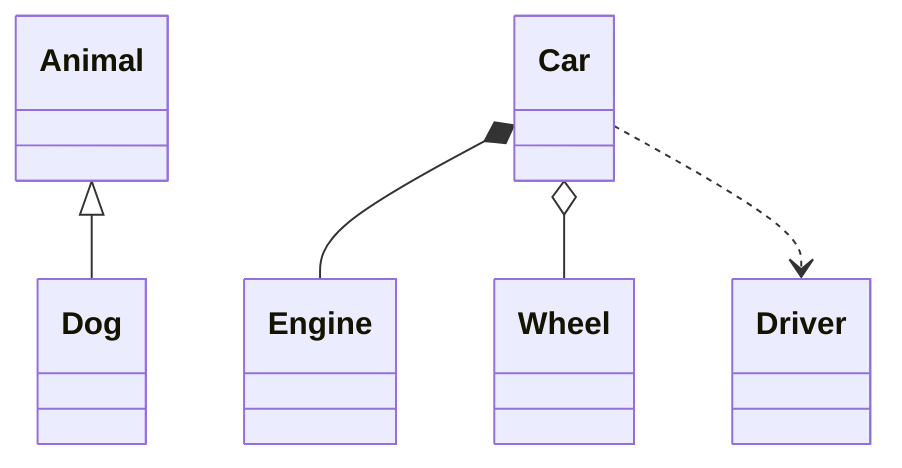

# UML Diagrams — Interview Level

> **Category:** [Documentation](../README.md) — a question bank on the five UML diagrams that matter, reading the notation, when each earns its keep, and Fowler's sketch-vs-blueprint framing.

A graded question bank (junior → professional) plus reading-the-notation, scenarios, rapid-fire, and the signals interviewers actually listen for.

---

## Table of Contents

1. [Introduction](#introduction)
2. [Prerequisites](#prerequisites)
3. [Fundamentals](#fundamentals)
4. [Technique: Choosing the Diagram](#technique-choosing-the-diagram)
5. [Reading the Notation](#reading-the-notation)
6. [Scenarios](#scenarios)
7. [Rapid-Fire](#rapid-fire)
8. [Red Flags / Green Flags](#red-flags--green-flags)
9. [Cheat Sheet](#cheat-sheet)
10. [Summary](#summary)
11. [Further Reading](#further-reading)
12. [Related Topics](#related-topics)

---

## Introduction

UML rarely gets a dedicated interview, but it surfaces constantly: a system-design interviewer hands you a marker, a design-doc review asks you to diagram a flow, or someone probes whether you can *read* the class diagram in a patterns book. The signal interviewers want is **judgement, not spec knowledge** — do you reach for the right diagram, keep it minimal, and treat it as a sketch rather than a blueprint?

> The one thing to internalize: nobody is impressed that you can name all 14 UML diagrams. They're impressed that you pick the *one* that answers the question, draw only what matters, and know when *not* to draw at all.

---

## Prerequisites

- The five diagrams and notation: [Junior](junior.md) and [Middle](middle.md).
- The judgement layer: [Senior](senior.md) (minimum-viable diagram, C4 vs UML).
- Comfortable sketching Mermaid/PlantUML from memory ([Diagrams as Code](../08-diagrams-as-code/junior.md)).

---

## Fundamentals

### Q1. UML has how many diagram types, and which actually matter?

*Testing: do you know the 80/20, or did you memorize a spec?*

**A:** UML defines **14** types, but five carry almost all the practical value: **class, sequence, state-machine, activity, use-case** — and even among those, class, sequence, and state-machine are the keepers; use-case is the weakest. The other nine (component, deployment, object, package, etc.) you learn the day you need them.

### Q2. What question does each of the five answer?

*Testing: diagram-to-question mapping, the core skill.*

**A:** Class → *what are the types and how do they relate?* (static structure). Sequence → *who calls whom, in what order?* (interaction over time). State-machine → *what states and which transitions are legal?* (lifecycle). Activity → *what are the steps and branches of a workflow?* (a flowchart with concurrency). Use-case → *who uses the system, for what?* (actors and scope).

### Q3. Which is the single most useful UML diagram day-to-day, and why?

*Testing: practical experience, not theory.*

**A:** The **sequence diagram.** It explains a flow — an auth handshake, a request lifecycle, a multi-service interaction — far better than prose, because order and participants are exactly what's hard to hold in your head. A reviewer instantly spots a wrong call order or a missing return.

### Q4. Filled diamond vs hollow diamond on a class diagram?

*Testing: the most-confused notation.*

**A:** **Filled = composition** — the part is owned and dies with the whole (an `Invoice` and its `LineItem`s). **Hollow = aggregation** — shared ownership, the part can outlive the whole (a `Team` and its `Player`s). Honest add-on: aggregation is famously fuzzy and many teams skip it, using only association and composition.

### Q5. What's the difference between a class diagram and a sequence diagram?

*Testing: static vs dynamic.*

**A:** A class diagram shows **static structure** — types and their relationships, frozen. A sequence diagram shows **dynamic behavior** — the order of messages between participants over time. One shows *what things are*, the other *what happens*.

### Q6. When is a use-case diagram worth drawing?

*Testing: honesty about a low-value diagram.*

**A:** Rarely. Its one niche is an early conversation about **system scope/boundary** — what's in, what's out, who the actors are. Most of the time a feature list or user-story map conveys the same thing faster. A candidate who reaches for use-case diagrams by reflex is a yellow flag.

---

## Technique: Choosing the Diagram

### Q7. What's your heuristic for whether to draw a diagram at all?

*Testing: economy — the senior signal.*

**A:** Draw a diagram when the relationships or flow are **hard to hold in your head or hard to convey in words**. If two sentences or a bullet list say it, write that — prose diffs and rots more gracefully. The diagram should be a *lens* that magnifies one thing, not a *map* that shows everything.

### Q8. Explain Fowler's three modes of using UML.

*Testing: the central conceptual framing.*

**A:** **Sketch** — informal, partial, drawn to communicate, then discarded. **Blueprint** — a detailed, complete spec handed to implementers. **Programming language** — generate runnable code from the model (MDA, round-trip). Blueprint and programming-language modes largely failed: they cost as much as a second copy of the source and rot on contact with code. **Sketch survives** because it's cheap, disposable, and asks nothing of the future. The right default is sketch-to-communicate-then-throw-away.

### Q9. A class diagram of an entire codebase — good idea?

*Testing: do you know what rots?*

**A:** No. A whole-codebase (often reverse-engineered) class diagram is unreadable and rots before it's useful — it answers no specific question. Diagram a **slice**: the pattern, the tricky aggregate, the module's core types you're actually discussing.

### Q10. C4 vs UML — when do you use which?

*Testing: architecture-level judgement.*

**A:** **C4 for the architecture levels** (Context, Container, Component) — the big picture of systems and their parts. **UML for the detail** — class/sequence/state when one piece is hard to follow. They're complementary; C4's own bottom "Code" level *is* UML and is usually not worth drawing. Big picture: C4. One tricky flow: drop to a UML sequence diagram.

### Q11. Where should a diagram live, and how does that change its contract?

*Testing: placement and rot awareness.*

**A:** In an **ADR**, it's a frozen snapshot of the decision — immutable, never edited, the safest home because nobody expects currency. In an **RFC/design doc**, it's the proposal under review. In a **README/architecture page**, readers assume it's *currently true* — the highest rot risk, so fund its maintenance or don't draw it. In a **runbook**, it must be accurate because someone reads it at 3 a.m.

---

## Reading the Notation

### Q12. Read this aloud:



*Testing: can you actually read class notation?*

**A:** `Dog` **is-a** `Animal` (generalization/inheritance — triangle points at the parent). `Car` is **composed of** an `Engine` (filled diamond — owned, dies with the car). `Car` **aggregates** `Wheel`s (hollow diamond — shared, can be swapped/outlive). `Car` **depends on** `Driver` (dashed — a transient "uses").

### Q13. In a sequence diagram, what do `->>`, `-->>`, and an `alt` fragment mean?

*Testing: sequence vocabulary.*

**A:** `->>` is a synchronous message/call; `-->>` is a return; an `alt` fragment is a boxed region showing **mutually exclusive branches** (e.g., cache hit vs miss). Related: `loop` (repetition), `opt` (single optional block), `par` (parallel).

### Q14. Write the full transition syntax for a state-machine, with a guard.

*Testing: state-machine depth.*

**A:** `SourceState --> TargetState : event [guard] / action`. For example: `Pending --> Paid : pay [amount == total] / send receipt`. The guard makes the *rule* explicit instead of burying it in `if` statements.

### Q15. What does an activity diagram add over a plain flowchart?

*Testing: when the formal notation is justified.*

**A:** **Forks/joins** (true parallelism) and **swimlanes** (who performs each action). If a workflow has concurrency or crosses teams/systems, those justify reaching for PlantUML's activity notation; otherwise a flowchart sketch is faster.

---

## Scenarios

### S1. You're in a design review and need to explain a four-service checkout flow. What do you draw?

*Testing: diagram selection under realistic pressure.*

**A:** A **sequence diagram** — the four services as participants, messages top-to-bottom in order, an `alt` fragment for any branch (e.g., payment success/failure). It's the clearest way to show *order across participants*, and reviewers can spot a wrong call sequence at a glance. I'd keep it to the services that matter and leave out logging/retries unless they're the point.

### S2. The team keeps arguing about whether an order can go from "shipped" back to "pending." How do you settle it with a diagram?

*Testing: matching diagram to problem.*

**A:** A **state-machine diagram.** Drawing the legal transitions makes the answer visible: if there's no arrow from `Shipped` to `Pending`, it's illegal — and the diagram becomes the spec for the status code. Guards on the transitions capture the conditions. This is the diagram's killer use: making illegal transitions obvious by their absence.

### S3. A new hire asks "how is this service structured?" What do you reach for — and what do you avoid?

*Testing: C4 vs UML and minimum-viable judgement.*

**A:** I'd start with a **C4 container/component** sketch — the big-picture parts and how they connect. I'd *avoid* a reverse-engineered full class diagram; it's unreadable and stale. If one module's design is genuinely subtle, I'd drop to a small **UML class diagram** of just that slice, plus a **sequence diagram** of the main flow.

### S4. Your manager wants "complete UML documentation" of the system before the rewrite. How do you respond?

*Testing: anti-BDUF judgement and stakeholder handling.*

**A:** I'd push back gently with the trade-off: comprehensive up-front UML (blueprint mode) costs as much as a second copy of the code and rots immediately — it's the classic Big Design Up Front failure. I'd propose **risk-driven** modeling instead: a C4 context/container diagram for orientation, plus UML sequence/state diagrams for the *risky* parts (a tricky protocol, the payment lifecycle), as committed Mermaid in the design doc. That gives 90% of the value at a fraction of the cost and won't rot into a liability.

### S5. How would you standardize diagramming across a 200-engineer org?

*Testing: professional-level systems thinking.*

**A:** Three levers. **Standardize** on diagrams-as-code — Mermaid as default (native GitHub rendering), PlantUML as the escape hatch, committed and CI-rendered, no drawing-tool screenshots in long-lived docs. **Build literacy** — every engineer can *read* class/sequence/state, via a short onboarding module; authoring stays optional. **Govern against BDUF** — no mandated UML packages, every diagram justifies a decision, disposable by default, long-lived diagrams are owned with update triggers. And I wouldn't measure diagram *count* — that's Goodhart bait; I'd watch freshness and onboarding outcomes.

---

## Rapid-Fire

*One-line answers expected.*

1. **Most useful UML diagram day-to-day?** Sequence.
2. **Three keepers?** Class, sequence, state-machine.
3. **Weakest of the five?** Use-case.
4. **Filled diamond?** Composition (owned, dies with the whole).
5. **Hollow diamond?** Aggregation (shared, can outlive).
6. **Triangle points at?** The parent (generalization/inheritance).
7. **Dashed arrow on a class diagram?** Dependency (transient "uses").
8. **`alt` fragment?** Mutually exclusive branches in a sequence diagram.
9. **Time flows which way in a sequence diagram?** Down.
10. **State transition syntax?** `Source --> Target : event [guard] / action`.
11. **Activity diagram's two extras over a flowchart?** Forks/joins and swimlanes.
12. **Fowler's surviving mode?** Sketch.
13. **C4 vs UML in five words?** C4 for architecture, UML for detail.
14. **Safest home for a diagram?** An ADR (frozen, immutable).
15. **Riskiest home?** README/architecture page (readers assume it's current).
16. **Renders natively on GitHub?** Mermaid (not PlantUML).
17. **Whole-codebase class diagram?** Don't — it rots and answers nothing.
18. **The drawing heuristic?** Draw when words/memory can't carry the load.

---

## Red Flags / Green Flags

**Red flags (in a candidate):**

- Recites all 14 UML diagram types as if breadth is the point.
- Reaches for a use-case diagram or a full class diagram by reflex.
- Treats UML as a mandatory blueprint to produce before coding (BDUF).
- Can't read a class or sequence diagram cold.
- Defends a sketch as a binding spec, or won't draw anything without "doing it properly."
- Confuses class (structure) with sequence (order) — wrong tool for the question.

**Green flags:**

- Picks the diagram by the question; draws the minimum that conveys it.
- Articulates Fowler's sketch-vs-blueprint and defaults to sketch-then-discard.
- Knows class/sequence/state are the keepers and use-case is weak.
- Gets the diamonds right *and* notes aggregation is fuzzy/often skipped.
- Knows where diagrams live and how that sets their maintenance contract (ADR frozen vs README live).
- Pushes back on "complete UML up front" with risk-driven modeling.
- Treats diagrams as committed, reviewable code (Mermaid/PlantUML).

---

## Cheat Sheet

```text
FIVE DIAGRAMS → QUESTION
  class         what are the types & relationships?      [KEEPER]
  sequence      who calls whom, in what order?           [KEEPER, most useful]
  state-machine what states & legal transitions?         [KEEPER]
  activity      steps & branches of a workflow
  use-case      who uses the system?            (weakest; use rarely)

NOTATION
  class: + public - private · --> assoc · *-- compose(owned) · o-- aggregate(shared)
         <|-- inherits (triangle -> parent) · ..> dependency
  seq:   ->> message · -->> return · alt/loop/opt/par fragments · time flows DOWN
  state: Source --> Target : event [guard] / action

JUDGEMENT
  draw when words/memory can't carry it · lens not map · diagram a slice not the codebase
  Fowler modes: sketch (survives) · blueprint (rots) · programming-language (failed)
  C4 = architecture levels · UML = detail   (skip C4 "Code")
  homes: ADR frozen(safe) · RFC proposal · README current(risky) · runbook accurate
  org: standardize (Mermaid+PlantUML) · literacy(read the 5) · anti-BDUF · don't count diagrams
```

---

## Summary

- Interviewers test **judgement, not spec recall**: pick the right diagram, keep it minimal, treat it as a sketch.
- Know the **five and their questions**; class/sequence/state are the keepers, **sequence** is the most useful, **use-case** is the weakest.
- Get the **notation** right — especially filled (composition) vs hollow (aggregation) diamonds — and be honest that aggregation is fuzzy.
- Articulate **Fowler's three modes** and why **sketch** survives while blueprint/code-gen failed.
- Show **economy**: draw a lens not a map, diagram a slice not the codebase, push back on BDUF with risk-driven modeling.
- Know **C4 vs UML** and how a diagram's **home sets its maintenance contract** (ADR frozen, README live/risky).

---

## Further Reading

- Martin Fowler, *UML Distilled* and ["UmlMode"](https://martinfowler.com/bliki/UmlMode.html).
- Simon Brown, [The C4 Model](https://c4model.com/).
- George Fairbanks, *Just Enough Software Architecture* — risk-driven modeling.
- [Mermaid](https://mermaid.js.org/) and [PlantUML](https://plantuml.com/) references.

---

## Related Topics

- **Study path:** [Junior](junior.md) → [Middle](middle.md) → [Senior](senior.md) → [Professional](professional.md)
- **Tooling:** [Diagrams as Code](../08-diagrams-as-code/interview.md).
- **Homes for diagrams:** [ADRs](../05-architecture-decision-records-adrs/interview.md), [Design Docs & RFCs](../06-design-docs-and-rfcs/interview.md).
- **Patterns documented with UML:** the **creational-patterns**, **structural-patterns**, **behavioral-patterns** skills.

---

[Documentation](../README.md) · [Roadmap](../../README.md) · **Back to:** [UML Diagrams — Junior](junior.md)
