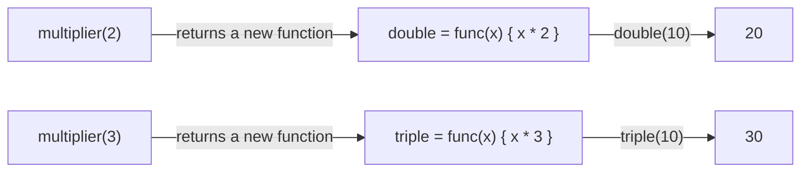

# First-Class & Higher-Order Functions — Junior Level

> **Roadmap:** [Functional Programming](../README.md) → First-Class & Higher-Order Functions
> *A function is just another value — once you believe that, half of "functional programming" stops being mysterious.*

---

## Table of Contents

1. [Introduction](#introduction)
2. [Prerequisites](#prerequisites)
3. [Glossary](#glossary)
4. [Core Concept 1 — Functions as Values](#core-concept-1--functions-as-values)
5. [Core Concept 2 — Passing & Returning Functions](#core-concept-2--passing--returning-functions)
6. [First-Class vs Higher-Order — the Exact Difference](#first-class-vs-higher-order--the-exact-difference)
7. [Core Concept 3 — Closures](#core-concept-3--closures)
8. [Callbacks: the Idea You Already Use](#callbacks-the-idea-you-already-use)
9. [Real-World Examples](#real-world-examples)
10. [Mental Models](#mental-models)
11. [Common Mistakes](#common-mistakes)
12. [Test Yourself](#test-yourself)
13. [Cheat Sheet](#cheat-sheet)
14. [Summary](#summary)
15. [Further Reading](#further-reading)
16. [Related Topics](#related-topics)

---

## Introduction

> Focus: **What is it, and why does it matter?**

Here is the single idea this whole topic rests on:

> **A function is a value.** It can be stored in a variable, put in a list, passed as an argument, and returned as a result — exactly like an integer or a string.

That sentence sounds small, but it is the foundation of the entire functional paradigm. The moment a language lets you treat functions as ordinary values, a new set of moves becomes possible: you can hand a piece of *behavior* to another piece of code, build functions that *produce* other functions, and capture data inside a function for later. Those moves are what `map`, `filter`, sort comparators, event handlers, and middleware are all made of.

You almost certainly use this already without naming it. When you call:

```python
names.sort(key=str.lower)            # Python — you passed a function as an argument
```

```java
list.forEach(System.out::println);   // Java — you passed a method as a value
```

```go
sort.Slice(xs, func(i, j int) bool { return xs[i] < xs[j] })  // Go — you passed a function literal
```

…you are using first-class and higher-order functions. The goal of this page is to turn that intuition into a precise, durable mental model — so that when you meet currying, composition, or `map`/`filter`/`reduce` later in this roadmap, they feel like obvious next steps instead of new magic.

> **The mindset shift:** stop thinking of functions only as *places code lives*. Start thinking of them as *things you can hold, name, pass around, and build with* — the same way you hold numbers and strings.

---

## Prerequisites

- **Required:** You can write functions, variables, and loops in at least one language (examples here use **Go**, **Java**, and **Python**).
- **Required:** You understand what an *argument* and a *return value* are.
- **Helpful:** You've called `.sort()` with a custom comparator, registered an event handler, or used `map`/`filter` — even once. That experience is the hook everything here attaches to.
- **Not required:** Any prior functional-programming knowledge. This is the entry point of the FP roadmap.

---

## Glossary

| Term | Definition |
|------|-----------|
| **First-class function** | A *property of a language*: functions are treated as ordinary values — storable, passable, returnable. |
| **Higher-order function (HOF)** | A *kind of function*: one that takes a function as an argument, returns a function, or both. |
| **Callback** | A function you pass to other code so it can call you back later (on an event, per element, on completion). |
| **Closure** | A function that "remembers" variables from the scope where it was created, even after that scope has exited. |
| **Function value / function literal** | A function written inline as a value, not declared with a name (`func(x){...}`, `lambda x: ...`, `x -> ...`). |
| **Lambda** | A short, anonymous function literal. Java/Python's name for the same thing. |
| **Method reference** | Java shorthand (`String::toLowerCase`) that turns an existing method into a function value. |
| **Predicate** | A function that returns a boolean — used to test or filter (`isEven`, `x -> x > 0`). |
| **Comparator** | A function that decides the order of two elements — the classic argument to a sort. |

> Keep two of these especially clear: **first-class** describes the *language*; **higher-order** describes a *function*. They are related but not the same thing. The dedicated section below pins down exactly how.

---

## Core Concept 1 — Functions as Values

In most modern languages a function can go anywhere a value can go. Watch the same function being treated like data in three languages.

### Store a function in a variable

```python
# Python
def square(x):
    return x * x

f = square          # no parentheses — we store the function itself, not its result
print(f(5))         # 25  — call it through the variable
```

```go
// Go
func square(x int) int { return x * x }

f := square          // f now holds the function value
fmt.Println(f(5))    // 25
```

```java
// Java — functions are values via functional interfaces
import java.util.function.IntUnaryOperator;

IntUnaryOperator square = x -> x * x;   // a lambda stored in a variable
System.out.println(square.applyAsInt(5)); // 25
```

The crucial detail in every example: **`square` without parentheses is the value; `square(5)` is the call.** `f = square` copies the function; `f = square(5)` copies the *number 25*. Confusing these two is the most common beginner slip — there's a whole entry about it in [Common Mistakes](#common-mistakes).

### Put functions in a list or a map

Because functions are values, you can collect them like any other data:

```python
# Python — a dictionary that maps a name to behavior
ops = {
    "add": lambda a, b: a + b,
    "sub": lambda a, b: a - b,
    "mul": lambda a, b: a * b,
}
print(ops["mul"](6, 7))   # 42
```

This replaces a long `if/elif` chain with a lookup table of behaviors — a small but real payoff of treating functions as data.

---

## Core Concept 2 — Passing & Returning Functions

Once functions are values, two new abilities follow immediately.

### Passing a function in

You hand a function to other code so *that* code decides when and how to call it.

```python
# Python — apply_twice takes a FUNCTION as its first argument
def apply_twice(fn, x):
    return fn(fn(x))

print(apply_twice(square, 3))   # square(square(3)) = 81
```

`apply_twice` doesn't know or care what `fn` does. It only knows it can be *called*. That ignorance is the point: the behavior is supplied from outside, so one `apply_twice` works with `square`, `increment`, `to_upper`, or anything else.

### Returning a function out

A function can *build and return* a brand-new function:

```go
// Go — multiplier returns a function configured with `factor`
func multiplier(factor int) func(int) int {
    return func(x int) int {
        return x * factor       // `factor` is captured — see Closures below
    }
}

double := multiplier(2)
triple := multiplier(3)
fmt.Println(double(10), triple(10))   // 20 30
```

`multiplier(2)` runs once and returns a *new function* that multiplies by 2. We just used code to **manufacture functions** — a factory whose products are behaviors. This is the seed of [currying and partial application](../07-currying-and-partial-application/junior.md).



---

## First-Class vs Higher-Order — the Exact Difference

These two terms are constantly mixed up. The distinction is simple once you see what each one describes.

| | First-class functions | Higher-order functions |
|---|---|---|
| **It describes…** | a **language** | a **function** |
| **Means** | functions can be used as values (stored, passed, returned) | takes a function as input and/or returns a function |
| **You ask** | "Does this language allow it?" | "Does this particular function do it?" |
| **Example** | "Go has first-class functions." | "`sort.Slice` is a higher-order function." |

Put plainly:

- **First-class functions** is the *permission* — the language treats functions as values.
- **Higher-order functions** is what you *do with that permission* — write functions that consume or produce other functions.

> You cannot have higher-order functions without first-class functions. First-class is the rule of the road; higher-order is a car driving on it. Every language in this roadmap — Go, Java, Python, Haskell — has first-class functions, so both are available to you everywhere.

A higher-order function is exactly one of these:

```python
def hof_takes(fn):          # 1) takes a function  → higher-order
    return fn(10)

def hof_returns():          # 2) returns a function → higher-order
    return lambda x: x + 1

def not_hof(x):             # takes/returns plain values → NOT higher-order
    return x + 1
```

---

## Core Concept 3 — Closures

A **closure** is a function bundled together with the variables it captured from the scope where it was created. The function "closes over" those variables and keeps them alive — even after the outer function has returned.

We already wrote one. Look again at `multiplier`:

```go
func multiplier(factor int) func(int) int {
    return func(x int) int {
        return x * factor   // `factor` lives in the OUTER function...
    }                       // ...but the returned function still uses it later
}
```

By the time you call `double(10)`, `multiplier` has long since returned — yet `factor` (which was `2`) is still available. The inner function carried it along. That captured `factor` *is* the closure.

A closure can also hold **mutable** state, which gives you a private counter with no class in sight:

```python
# Python — a closure as a private counter
def make_counter():
    count = 0
    def next_id():
        nonlocal count      # we want to modify the captured variable
        count += 1
        return count
    return next_id

gen = make_counter()
print(gen(), gen(), gen())   # 1 2 3   — `count` persists between calls, hidden inside
```

`count` is not global and not a field on an object — it lives *inside* the closure, reachable only through `next_id`. Two separate counters built by `make_counter()` each get their own independent `count`.

> **Mental model:** a closure is a function with a backpack. When the function is created, it packs the variables it needs from the surrounding scope into a backpack and carries them wherever it goes — so it can still use them long after it left home.

### One classic closure trap

Closures capture **variables**, not the *value at the moment of capture*. A loop variable shared across iterations bites everyone eventually:

```python
# Python — the famous "all functions print 3" surprise
fns = []
for i in range(3):
    fns.append(lambda: i)      # each lambda captures the SAME `i`
print([f() for f in fns])      # [2, 2, 2]  — not [0, 1, 2]!

# Fix: capture the current value with a default argument
fns = [(lambda v=i: v) for i in range(3)]
print([f() for f in fns])      # [0, 1, 2]
```

The lambdas all share one `i`; by the time they run, the loop has finished and `i` is `2`. (Go pre-1.22 had the same loop-variable trap; Go 1.22 changed loop semantics so each iteration gets a fresh variable.) Knowing closures capture *the variable* explains a surprising number of "impossible" bugs.

---

## Callbacks: the Idea You Already Use

A **callback** is just a function you pass to other code, with the understanding that the other code will *call it back* at the right moment — for each element, when a click happens, when a download finishes. There is no new mechanism here; a callback is simply a function value used as an argument. You've been writing higher-order calls all along.

```java
// Java — the classic sort comparator IS a callback
List<String> names = new ArrayList<>(List.of("Zoe", "amir", "Bao"));
names.sort((a, b) -> a.compareToIgnoreCase(b));   // sort calls your function on pairs
// or with a method reference:
names.sort(String::compareToIgnoreCase);
```

```python
# Python — filter takes a predicate callback, one element at a time
nums = [1, 2, 3, 4, 5, 6]
evens = list(filter(lambda n: n % 2 == 0, nums))   # [2, 4, 6]
```

```go
// Go — http.HandleFunc takes a callback invoked on every request
http.HandleFunc("/health", func(w http.ResponseWriter, r *http.Request) {
    fmt.Fprintln(w, "ok")
})
```

In each case *you* supply the small piece of behavior, and the *library* owns the control flow (when to loop, when to fire, when to compare). That division — **they own the "when", you own the "what"** — is the everyday face of higher-order functions.

---

## Real-World Examples

### 1. Sort comparators — the most-used HOF on earth

Every standard library's sort is a higher-order function: it takes *your* ordering rule and applies it.

```go
// Go — sort people by age, then build a different rule with no new sort code
sort.Slice(people, func(i, j int) bool {
    return people[i].Age < people[j].Age   // your rule, their algorithm
})
```

Want descending order, or sort-by-name? You change only the small callback. The sorting algorithm — written once, by someone else — stays untouched. That reuse is *why* sort takes a function instead of hard-coding one order.

### 2. `map` / `filter` — transform without writing loops

```python
# Python — apply a function to every element (map), keep some (filter)
prices = [10, 25, 40]
with_tax = list(map(lambda p: p * 1.1, prices))    # [11.0, 27.5, 44.0]
expensive = list(filter(lambda p: p > 20, prices)) # [25, 40]
```

`map` and `filter` are higher-order functions that hide the loop. You describe the transformation; they handle the iteration. (This trio gets its own deep dive in [Map / Filter / Reduce](../04-map-filter-reduce/junior.md).)

### 3. A configurable validator (returning a function)

```java
// Java — build a reusable validator from a rule
import java.util.function.Predicate;

static Predicate<String> minLength(int n) {
    return s -> s.length() >= n;     // returns a function configured with n
}

Predicate<String> atLeast8 = minLength(8);
System.out.println(atLeast8.test("hi"));        // false
System.out.println(atLeast8.test("password1")); // true
```

`minLength` is a function factory: call it with a number, get back a tailored predicate you can pass to `filter`, store, or combine.

### 4. Retry logic — passing behavior to a generic helper

```python
# Python — retry knows HOW to retry; you pass WHAT to run
def retry(action, attempts=3):
    for i in range(attempts):
        try:
            return action()          # action is a callback
        except Exception:
            if i == attempts - 1:
                raise

result = retry(lambda: fetch("https://api.example.com/data"))
```

`retry` contains the loop, the try/except, the back-off policy — written once. The *task* is supplied as a function. This is the same shape as a circuit breaker, a transaction wrapper, or a timing decorator: a higher-order helper that wraps behavior you hand in.

---

## Mental Models

Three pictures that make this stick:

1. **A function is a value with a "call" button.** A number you read; a string you concatenate; a function you *call*. Otherwise it's just data — store it, list it, pass it, return it.

2. **Higher-order functions = "you own the *what*, they own the *when*."** `sort` owns the algorithm; you own the comparison. `filter` owns the loop; you own the test. You inject the small decision into someone else's big machine.

3. **A closure is a function with a backpack.** It packs the variables it needs at creation time and carries them everywhere, so it can still use them after its birthplace is gone.

> A fourth, unifying view: **first-class functions let you pass *behavior* the same way you already pass *data*.** Once behavior is just another argument, enormous amounts of duplicated control flow (loops, retries, comparisons) collapse into one reusable helper plus a tiny per-use function.

---

## Common Mistakes

1. **Calling the function when you meant to pass it.** `register(handler())` *calls* `handler` and passes its return value; `register(handler)` passes the function. The stray `()` is the number-one beginner bug.
   ```python
   button.on_click(do_save())   # BUG: runs do_save now, passes its result (often None)
   button.on_click(do_save)     # right: passes the function to be called on click
   ```

2. **Thinking "first-class" and "higher-order" are synonyms.** First-class describes the *language*; higher-order describes a *function*. See [the comparison table](#first-class-vs-higher-order--the-exact-difference).

3. **Forgetting closures capture the variable, not its value.** The loop that builds `[2, 2, 2]` instead of `[0, 1, 2]` is a closure capturing a shared, still-changing variable. Bind the current value explicitly when you need a snapshot.

4. **Mutating captured state by accident.** A closure that changes a captured variable creates hidden, persistent state. That's powerful for a counter — and a [side-effect](../02-pure-functions-and-referential-transparency/junior.md) bug when you didn't intend it.

5. **Reaching for a class when a function would do.** A whole class with one method exists to *carry behavior*. If the behavior is small and stateless, a function value or lambda is lighter and clearer.

6. **Over-nesting lambdas until they're unreadable.** Lambdas are for *short* logic. If a callback grows past a couple of lines, give it a name with a regular function — readability beats cleverness.

---

## Test Yourself

1. In one sentence each, define **first-class function** and **higher-order function**, and say which one describes a language and which describes a function.
2. What does `f = square` store, and how is it different from `f = square(5)`?
3. Is `filter` a higher-order function? Why or why not?
4. What is a **closure**, and what does it mean to say it "closes over" a variable?
5. Predict the output, then explain it:
   ```python
   def make_adder(n):
       return lambda x: x + n
   add10 = make_adder(10)
   print(add10(5))
   ```
6. Why does this print `[2, 2, 2]` instead of `[0, 1, 2]`, and how would you fix it?
   ```python
   fns = [lambda: i for i in range(3)]
   print([f() for f in fns])
   ```

<details>
<summary>Answers</summary>

1. **First-class function:** a property of a *language* — functions can be used as values (stored, passed, returned). **Higher-order function:** a *function* that takes a function as an argument and/or returns a function. First-class describes the language; higher-order describes a function.
2. `f = square` stores the **function itself** (no call happens), so `f(5)` later runs it → `25`. `f = square(5)` *calls* `square` immediately and stores the **result `25`**; `f` is then just an integer and `f(5)` would fail.
3. **Yes.** `filter` takes a predicate *function* as an argument, which is exactly the definition of higher-order.
4. A **closure** is a function plus the variables it captured from its surrounding scope. "Closes over a variable" means the function keeps a live reference to that variable and can use it even after the outer scope has returned.
5. **`15`.** `make_adder(10)` returns a closure that captured `n = 10`; calling `add10(5)` computes `5 + 10`.
6. All three lambdas capture the **same** variable `i`, not its value at creation. By the time they run, the loop has finished and `i` is `2`, so each returns `2`. Fix by binding the current value, e.g. `[lambda v=i: v for i in range(3)]` → `[0, 1, 2]`.

</details>

---

## Cheat Sheet

| Concept | One-liner | You've seen it as |
|---|---|---|
| **First-class function** | Functions are values (store / pass / return) | `f = square`, function in a list |
| **Higher-order function** | Takes and/or returns a function | `sort`, `map`, `filter`, `retry` |
| **Callback** | A function passed in, called back later | sort comparator, event handler, HTTP handler |
| **Closure** | A function that remembers captured variables | counter factory, configured validator |
| **Function literal / lambda** | An inline, anonymous function value | `lambda x: x*2`, `x -> x*2`, `func(x){...}` |

| Language | Function as value | Lambda syntax |
|---|---|---|
| **Go** | `f := square` | `func(x int) int { return x*x }` |
| **Java** | `IntUnaryOperator f = x -> x*x;` | `x -> x*x`, method ref `String::toLowerCase` |
| **Python** | `f = square` | `lambda x: x*x` |

> **One rule to remember:** *Without parentheses, you pass the function; with parentheses, you call it.* That single distinction prevents most beginner bugs.

---

## Summary

- The foundation: **a function is a value** — storable, passable, returnable, just like a number or string. That property is called **first-class functions**, and every language in this roadmap has it.
- A **higher-order function** uses that property: it **takes a function and/or returns one**. `sort`, `map`, `filter`, retry helpers, and event registration are all higher-order. The split to remember: *first-class describes the language; higher-order describes a function.*
- A **closure** is a function that captures and remembers variables from where it was created — a function with a backpack. It enables function factories and private state, and it captures the *variable*, not a frozen value (the source of a classic loop bug).
- A **callback** is simply a function value used as an argument: *you* supply the behavior, the library supplies the control flow.
- You already use all of this — sort comparators, `map`/`filter`, click handlers. Naming it precisely is what unlocks the rest of this roadmap.
- Next: [`middle.md`](middle.md) — using these tools deliberately in real code, and the patterns (decorators, function tables, composition) they grow into.

---

## Further Reading

- **Structure and Interpretation of Computer Programs** — Abelson & Sussman — Chapter 1.3, "Formulating Abstractions with Higher-Order Procedures" — the canonical treatment.
- **Why Functional Programming Matters** — John Hughes (1990) — why higher-order functions are the glue of modular programs.
- **Eloquent JavaScript** — Marijn Haverbeke — the "Higher-Order Functions" and "Functions" chapters are an exceptionally clear, hands-on introduction (the ideas carry to any language).
- **Effective Java** — Joshua Bloch (3rd ed.) — Items on lambdas, method references, and functional interfaces.

---

## Related Topics

- [Map / Filter / Reduce](../04-map-filter-reduce/junior.md) — the most important higher-order functions you'll use daily.
- [Composition](../05-composition/junior.md) — combining small functions into pipelines.
- [Currying & Partial Application](../07-currying-and-partial-application/junior.md) — the natural next step from "functions that return functions."
- [Pure Functions & Referential Transparency](../02-pure-functions-and-referential-transparency/junior.md) — when capturing mutable state in a closure becomes a side effect.
- [Clean Code → Functions](../../clean-code/02-functions/README.md) — keeping the functions you pass around small and clear.
- [Clean Code → Async & Functional](../../clean-code/12-async-and-functional/README.md) — functional style in everyday application code.
