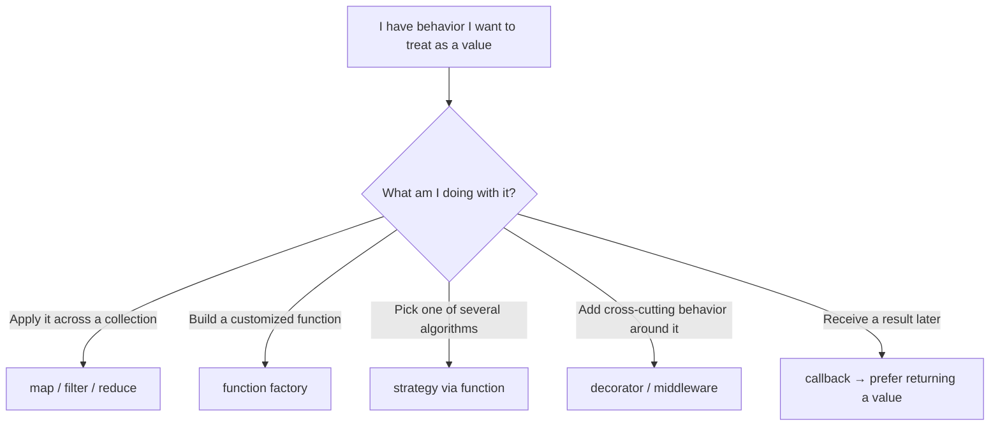

# First-Class & Higher-Order Functions — Middle Level

> **Roadmap:** [Functional Programming](../README.md) → First-Class & Higher-Order Functions
>
> *Junior asks "what is a function value?"; middle asks "when does passing a function make the code clearer than not — and when does it just make it cleverer?"*

---

## Table of Contents

1. [Introduction](#introduction)
2. [Prerequisites](#prerequisites)
3. [The HOF Idioms You Actually Use](#the-hof-idioms-you-actually-use)
4. [Map / Filter / Reduce as Higher-Order Functions](#map--filter--reduce-as-higher-order-functions)
5. [Function Factories: Functions That Return Functions](#function-factories-functions-that-return-functions)
6. [Strategy via Functions, Not Classes](#strategy-via-functions-not-classes)
7. [Decorators & Middleware: Wrapping Behavior](#decorators--middleware-wrapping-behavior)
8. [Callbacks → Returns: Inverting the Flow](#callbacks--returns-inverting-the-flow)
9. [Closures & State (and the Loop-Variable Trap)](#closures--state-and-the-loop-variable-trap)
10. [Composition: A Preview](#composition-a-preview)
11. [Trade-offs: When Not To Reach for a HOF](#trade-offs-when-not-to-reach-for-a-hof)
12. [Common Mistakes](#common-mistakes)
13. [Test Yourself](#test-yourself)
14. [Cheat Sheet](#cheat-sheet)
15. [Summary](#summary)
16. [Further Reading](#further-reading)
17. [Related Topics](#related-topics)

---

## Introduction

> Focus: **using first-class functions well in real code.**

At the junior level you learned the definitions: a *first-class* function can be stored in a variable, passed as an argument, and returned from another function; a *higher-order* function (HOF) is one that takes or returns a function. That knowledge is necessary but not the skill. The skill is **judgment** — knowing which everyday problems become smaller and clearer when you treat behavior as a value, and which problems a HOF only dresses up in cleverness.

This file walks through the handful of idioms that pay rent daily: the `map`/`filter`/`reduce` trio, function factories, the function-as-strategy pattern, decorators and middleware, and the conversion of callback-style APIs into value-returning ones. Then it deals honestly with the parts people get wrong — closures capturing the wrong variable, and the moment when a plain `for` loop is simply the better choice.

We use **Go**, **Java**, and **Python** throughout because each makes a different trade. Go gives you bare function values with no syntactic sugar; Java wraps them in functional interfaces and a Streams API; Python treats functions as ordinary objects and adds decorator syntax on top. Seeing one idea in three grammars is how you learn the *idea* rather than the keyword.

---

## Prerequisites

- **Required:** You can read [`junior.md`](junior.md) — you know what "function as a value" means and can pass a lambda to `map`.
- **Required:** Comfort with at least one of Go, Java, or Python at the level of writing loops and small functions.
- **Helpful:** Familiarity with the [Map / Filter / Reduce](../04-map-filter-reduce/junior.md) trio as operations (this file treats them as *higher-order functions*, which is a different lens).
- **Helpful:** A nodding acquaintance with [Pure Functions](../02-pure-functions-and-referential-transparency/junior.md) — HOFs are most predictable when the functions you pass are pure.
- **Helpful:** Awareness of the [Strategy pattern](../../design-patterns/README.md) in its classic OO form, so you can compare it to the function-based version.

---

## The HOF Idioms You Actually Use

Most real-world use of first-class functions reduces to five recurring shapes. Keep this map in your head; the rest of the file is one section per box.



The deciding question is always the one at the top: **am I passing behavior so a caller can vary what happens?** If yes, a HOF earns its place. If the "behavior" never actually varies, you are reaching for a HOF out of habit, and a plain function call is clearer.

---

## Map / Filter / Reduce as Higher-Order Functions

You already use `map`/`filter`/`reduce` to transform collections. The middle-level reframe: **they are higher-order functions** — their power comes entirely from the fact that the *operation* is a parameter. `map` doesn't know about doubling or uppercasing; it knows "apply the supplied function to each element." That separation — *iteration mechanics here, business logic there* — is the whole point.

**Python** has them built in, but comprehensions are the idiomatic spelling for `map`/`filter`:

```python
nums = [1, 2, 3, 4, 5]

# map + filter as HOFs (explicit form)
doubled_evens = list(map(lambda n: n * 2, filter(lambda n: n % 2 == 0, nums)))

# idiomatic Python: the comprehension does both, more readably
doubled_evens = [n * 2 for n in nums if n % 2 == 0]

# reduce is the odd one out — kept in functools, and often a loop reads better
from functools import reduce
total = reduce(lambda acc, n: acc + n, nums, 0)   # prefer sum(nums) here
```

Note the lesson hiding in that last line: even in a section about HOFs, `sum(nums)` beats `reduce`. Reach for the specialized tool first.

**Java** expresses the trio through the Streams API, where each operation takes a functional interface (`Function`, `Predicate`, `BinaryOperator`):

```java
List<Integer> nums = List.of(1, 2, 3, 4, 5);

List<Integer> doubledEvens = nums.stream()
    .filter(n -> n % 2 == 0)   // Predicate<Integer>
    .map(n -> n * 2)           // Function<Integer,Integer>
    .toList();

int total = nums.stream().reduce(0, Integer::sum);  // BinaryOperator + identity
```

`Integer::sum` is a **method reference** — a first-class function pointing at an existing method. Prefer it over `(a, b) -> a + b` when a named method already does the job; it reads as the verb it is.

**Go** has no built-in `map`/`filter` over arbitrary slices (it favors explicit loops), but generics made small HOF helpers practical, and the standard library now ships some:

```go
// A generic Map helper — the function is the parameter that makes it reusable.
func Map[T, U any](xs []T, f func(T) U) []U {
    out := make([]U, len(xs))
    for i, x := range xs {
        out[i] = f(x)
    }
    return out
}

doubled := Map([]int{1, 2, 3}, func(n int) int { return n * 2 })

// Reduce-like folding lives in the stdlib for some cases, e.g. slices.IndexFunc,
// but Go's culture leans toward writing the loop when it's clearer.
```

Go's stance is instructive: the language *can* do HOFs, but its community treats an explicit loop as the default and a HOF helper as a deliberate choice. That bias toward clarity is exactly the trade-off this file keeps returning to.

> **Haskell aside.** In Haskell these are not library conveniences but the natural way to compute: `map (*2) . filter even $ nums`. The `.` composes the two into one pipeline before any element is touched. The cleanliness comes from the functions being pure and the language being built around them — which is why studying the idea at its source clarifies the borrowed version.

---

## Function Factories: Functions That Return Functions

A **function factory** (closure factory) is a function whose *return value* is another function, pre-configured with the arguments you gave the outer one. This is the everyday use of "functions returning functions," and it almost always relies on a closure capturing the outer arguments.

The use case: you have a general operation and want several specialized versions of it without repeating the body.

**Python:**

```python
def multiplier(factor):
    def multiply(n):
        return n * factor      # `factor` is captured from the enclosing scope
    return multiply

double = multiplier(2)
triple = multiplier(3)
double(10)   # 20
triple(10)   # 30
```

**Go** — the captured variable lives as long as the returned function does:

```go
func adder(base int) func(int) int {
    return func(n int) int {
        return base + n        // base captured by the closure
    }
}

addTen := adder(10)
addTen(5)   // 15
```

**Java** — lambdas can capture, but only **effectively final** locals (you may not reassign a captured variable). This is a deliberate restriction, not an accident; we return to *why* in the closures section.

```java
import java.util.function.IntUnaryOperator;

static IntUnaryOperator multiplier(int factor) {
    return n -> n * factor;    // factor must be effectively final
}

IntUnaryOperator triple = multiplier(3);
triple.applyAsInt(4);          // 12
```

When does a factory beat just passing the extra argument every time? When the configured function gets **handed off** — stored in a struct, registered as a handler, passed deep into code that shouldn't know about `factor`. The factory bakes the configuration in once so downstream code stays simple.

---

## Strategy via Functions, Not Classes

The classic **Strategy** design pattern lets you swap an algorithm at runtime. In a purely OO language you express it with an interface and one class per strategy. With first-class functions, a strategy is *just a function* — no interface, no class, no boilerplate.

Compare the shapes. The OO version (sketched) needs a `Comparator` interface plus a class for each ordering. The function version passes the comparison directly:

**Python** — sort by different strategies by passing the `key` function:

```python
people = [("Ann", 30), ("Bob", 25), ("Cy", 30)]

by_age  = sorted(people, key=lambda p: p[1])
by_name = sorted(people, key=lambda p: p[0])
# the "strategy" is the key function; no Strategy class in sight
```

**Go** — `sort.Slice` takes the comparison as a function; swapping strategies means swapping the closure:

```go
sort.Slice(people, func(i, j int) bool {
    return people[i].age < people[j].age   // strategy: order by age
})
```

**Java** sits in the middle: `Comparator` *is* the strategy interface, but lambdas and combinators let you build strategies inline instead of writing classes:

```java
people.sort(Comparator.comparingInt(Person::age));
people.sort(Comparator.comparing(Person::name)
                      .thenComparingInt(Person::age));  // composed strategy
```

The reframe: in languages with first-class functions, **"Strategy" often stops being a pattern you implement and becomes a parameter you pass.** A whole category of OO ceremony collapses into a function argument. (Several Gang-of-Four patterns dissolve this way — see [Design Patterns](../../design-patterns/README.md).)

---

## Decorators & Middleware: Wrapping Behavior

A **decorator** takes a function and returns a new function that adds behavior *around* the original — logging, timing, caching, retry, auth — without touching the original's body. The same shape, applied to request handlers in a chain, is called **middleware**. Both are higher-order functions: input is a function, output is a function.

**Python** has dedicated syntax. A decorator is a function-returning-a-function applied with `@`:

```python
import functools, time

def timed(fn):
    @functools.wraps(fn)               # preserves name/docstring of fn
    def wrapper(*args, **kwargs):
        start = time.perf_counter()
        result = fn(*args, **kwargs)   # call the wrapped function
        print(f"{fn.__name__} took {time.perf_counter() - start:.4f}s")
        return result
    return wrapper

@timed
def fetch(url): ...
# @timed is sugar for: fetch = timed(fetch)
```

The `@timed` line is *exactly* `fetch = timed(fetch)`. The syntax hides the fact that you are wrapping one function value in another — but that is all it is.

**Go** has no decorator syntax; you wrap explicitly. This is the canonical HTTP middleware shape:

```go
func Logging(next http.Handler) http.Handler {
    return http.HandlerFunc(func(w http.ResponseWriter, r *http.Request) {
        log.Printf("%s %s", r.Method, r.URL.Path)
        next.ServeHTTP(w, r)           // call the wrapped handler
    })
}

// Chaining middleware = nesting wrappers:
handler := Logging(Auth(Recover(mux)))
```

**Java** typically expresses the same idea by wrapping a `Function` or by composing it:

```java
Function<String, String> base = s -> s.trim();
Function<String, String> logged = s -> {
    System.out.println("input: " + s);
    return base.apply(s);              // wrap base with logging
};
```

The unifying insight: **decorator, middleware, and "wrapper" are the same higher-order pattern**, varying only in syntax and in what they wrap (a plain function vs an HTTP handler). For deeper treatment of request pipelines see the [Middleware pattern](../../design-patterns/README.md).

---

## Callbacks → Returns: Inverting the Flow

A **callback** is a function you hand to another function so *it* can call *you* back with the result later. Callbacks are unavoidable for genuinely asynchronous or event-driven code (you don't have the value yet). But they are overused for synchronous code, where they cause two problems: nesting ("callback hell") and inverted control — the callee decides when and whether you run.

The middle-level instinct: **if the work is synchronous, prefer returning a value over invoking a callback.** A function that returns is composable; a function that calls you back is not.

```python
# Callback style — the function decides what happens next
def find_user(uid, on_found, on_missing):
    user = db.get(uid)
    if user: on_found(user)
    else:    on_missing(uid)

# Return style — the *caller* decides what happens next
def find_user(uid):
    return db.get(uid)            # returns user or None

user = find_user(uid)
if user is None: ...              # control stays with the caller, easy to compose
```

The return-style version is shorter, testable without stub callbacks, and chains naturally into `map`/`filter`. Callbacks remain the right tool when the result truly isn't ready yet — timers, I/O completion, UI events — but for "compute and hand back," returning wins.

> This distinction is the seed of why FP prefers values like [`Option`/`Result`](../06-algebraic-data-types/junior.md) over callbacks for the success/failure split: a returned `Option` keeps control with the caller; a pair of `onSuccess`/`onError` callbacks takes it away.

---

## Closures & State (and the Loop-Variable Trap)

A **closure** is a function bundled with the variables it captured from its defining scope. Closures are how function factories remember their configuration and how decorators reach the function they wrap. They can also hold *mutable* state — a counter, a cache, an accumulator — which is sometimes exactly what you want and sometimes a footgun.

A closure holding mutable state, deliberately:

```python
def make_counter():
    count = 0
    def increment():
        nonlocal count           # without this, count is treated as a new local
        count += 1
        return count
    return increment

c = make_counter()
c(); c(); c()                    # 1, 2, 3 — state lives in the closure
```

This is a tiny stateful object without a class. Fine in moderation; but remember that *shared* mutable closure state has the same hazards as any shared mutable state under concurrency (see [Immutability](../03-immutability/junior.md)).

### The classic loop-variable capture pitfall

The most common closure bug: creating closures **inside a loop** that all capture the *same* loop variable, then observing that they all see its final value.

**Go** (this was the canonical Go gotcha before 1.22):

```go
funcs := []func(){}
for i := 0; i < 3; i++ {
    funcs = append(funcs, func() { fmt.Println(i) })
}
for _, f := range funcs { f() }
// Go ≤ 1.21: prints 3, 3, 3  — every closure captured the SAME i
// Go ≥ 1.22: prints 0, 1, 2  — the loop variable is now per-iteration
```

Pre-1.22 the loop variable `i` was *one* variable mutated across iterations, so every closure saw its last value, `3`. Go 1.22 changed the semantics so each iteration gets a fresh `i`. If you are on an older Go, the fix is to rebind per iteration: `i := i` inside the loop body.

**Python** has the same trap, and *no* version has "fixed" it (the language semantics are deliberate):

```python
funcs = [lambda: i for i in range(3)]
print([f() for f in funcs])      # [2, 2, 2] — all capture the same `i`

# Fix: bind the current value via a default argument (evaluated at definition time)
funcs = [lambda i=i: i for i in range(3)]
print([f() for f in funcs])      # [0, 1, 2]
```

The default-argument trick works because default values are evaluated *when the lambda is defined*, capturing the current `i` by value.

**Java** sidesteps the trap by *refusing to compile* it: a lambda may only capture an **effectively final** variable. Because a loop counter is reassigned each iteration, you cannot capture it directly — the compiler forces you to introduce a fresh `final` per iteration. The restriction that looks annoying is precisely what prevents this bug.

```java
List<Supplier<Integer>> fns = new ArrayList<>();
for (int i = 0; i < 3; i++) {
    final int captured = i;          // a fresh final per iteration
    fns.add(() -> captured);         // capturing `i` directly would not compile
}
// fns now yield 0, 1, 2
```

**The general rule:** when you create a closure inside a loop, ask *"does each closure capture its own value, or do they share one mutable variable?"* If shared, rebind to a fresh per-iteration value before capturing.

---

## Composition: A Preview

Once functions are values, you can **compose** them: feed the output of one into the input of the next to build a bigger function from small ones. This is the subject of its own section ([Composition](../05-composition/junior.md)); here is just enough to see why HOFs lead there.

```python
def compose(f, g):
    return lambda x: f(g(x))      # apply g, then f

clean = compose(str.strip, str.lower)
clean("  Hello  ")                # "hello"
```

`compose` is itself a higher-order function — it takes two functions and returns a third. The payoff is **pipelines**: instead of a deeply nested `a(b(c(x)))` or a pile of intermediate variables, you express a transformation as a chain of named steps. Streams (`stream().map().filter()`) and shell pipes (`grep | sort | uniq`) are the same idea wearing different syntax. The map/filter/reduce trio composes especially well because each returns a collection the next can consume.

---

## Trade-offs: When Not To Reach for a HOF

First-class functions are a tool, not a virtue. The middle-level mark of competence is declining to use them when a plain construct is clearer.

**Prefer a plain loop when:**

- **There's an early exit or `break`.** Expressing "stop at the first match" through `reduce` or a fold is awkward; a `for` loop with `break` says it plainly. (Go especially favors this.)
- **You need the index, or to mutate in place.** Loops own this territory.
- **Side effects per element are the point** (printing, writing to a DB). `map` is for *transforming* values; using it purely for side effects misleads the reader into expecting a returned collection.
- **The body is more than a few lines.** A multi-statement lambda inside a `map` is usually a named function struggling to get out — or just a loop.

**Prefer a HOF when:**

- The operation **varies** and you want the caller to supply it (the whole point of strategy/factory).
- You're building a **pipeline** of transformations on data.
- You want to **eliminate boilerplate** that differs only in one step (decorators over logging/timing/retry).

**The readability-vs-cleverness line.** A `map`/`filter` chain that reads top-to-bottom like a sentence is *more* readable than the equivalent loop. A point-free tangle of composed combinators that requires you to trace types in your head is *less* readable than a loop, even though it's "more functional." Optimize for the next reader, not for the FP score.

```python
# Clever, but harder to read than it needs to be:
result = reduce(lambda a, x: a + [f(x)] if pred(x) else a, items, [])

# Clearer, same result:
result = [f(x) for x in items if pred(x)]
```

> **Rule of thumb:** if you find yourself explaining a one-liner in a code comment, the loop was probably the better choice.

---

## Common Mistakes

1. **Using `map` for side effects.** `map(send_email, users)` (in Python, where `map` is lazy) may not even run; even when it does, readers expect `map` to *return* something. Use a `for` loop when the goal is the effect, not the result.
2. **The loop-variable capture bug.** Creating closures in a loop that all share one mutable counter. Rebind per iteration (or rely on Go ≥ 1.22 / Java's effectively-final rule, which catch it for you).
3. **Reaching for `reduce` where a specialized function exists.** `reduce(operator.add, xs, 0)` should be `sum(xs)`; folding to build a list should be a comprehension. `reduce` is for genuinely custom accumulation.
4. **Forgetting `functools.wraps` in Python decorators.** Without it, the wrapped function loses its name, docstring, and signature — breaking introspection, debugging, and some frameworks.
5. **Capturing mutable shared state across goroutines/threads.** A closure over a shared variable is a data race waiting to happen under concurrency; the captured variable is shared, not copied. See [Concurrency](../../../language-internals/concurrency-async-parallel/concurrency/README.md).
6. **Deep callback nesting for synchronous work.** If you have the value now, return it. Reserve callbacks for genuinely deferred results.
7. **Multi-line lambdas masquerading as expressions.** When a lambda grows past a line or two, give it a name (a `def`/named function). Anonymous-but-complex defeats the readability you were chasing.

---

## Test Yourself

1. Explain why `map`, `filter`, and `reduce` are called *higher-order* functions. What single property gives them their flexibility?
2. Write (in any of the three languages) a function factory `make_prefixer(prefix)` that returns a function adding `prefix` to any string. What does the returned function capture?
3. In Python, `funcs = [lambda: i for i in range(3)]` then calling each gives `[2, 2, 2]`. Why? How do you make it give `[0, 1, 2]`?
4. Java refuses to compile a lambda that captures a reassigned loop counter. How does this restriction *prevent* the bug from question 3 rather than just being an inconvenience?
5. You're converting a synchronous `find(id, onFound, onMissing)` callback API into return-style. What do you gain, and when would the callback version still be the right choice?
6. Give two concrete situations where a plain `for` loop is clearer than a `map`/`filter`/`reduce` chain.

<details>
<summary>Answers</summary>

1. They each take a **function as an argument** (and `reduce` could be seen as returning the folded result). That property — accepting behavior as a parameter — is what lets one implementation of the iteration mechanics serve unlimited business operations. The HOF knows *how to traverse*; you supply *what to do*.
2. The returned inner function captures `prefix` via a **closure**. Example (Python): `def make_prefixer(prefix): return lambda s: prefix + s`. `make_prefixer(">> ")("hi")` → `">> hi"`. The closure keeps `prefix` alive after `make_prefixer` returns.
3. All three lambdas capture the *same* variable `i`, which after the comprehension finishes holds its last value, `2`. Fix by binding the current value at definition time with a default argument: `[lambda i=i: i for i in range(3)]`, which evaluates the default when the lambda is created.
4. The bug requires multiple closures to share one mutable variable. Java's "effectively final" rule forbids capturing a variable that is reassigned, so the loop counter can't be captured at all. You're forced to introduce a fresh `final` per iteration (`final int captured = i;`), which gives each closure its *own* value — eliminating the sharing that causes the bug.
5. You gain composability (the result flows into the next call / a `map` chain), testability (no stub callbacks needed), and control staying with the caller (no inverted flow). The callback version is still right when the result is **not available yet** — async I/O, timers, UI events — i.e., genuinely deferred computation.
6. Examples: (a) you need an **early exit** (`break` on first match), which folds express awkwardly; (b) the per-element work is a **side effect** (logging, DB writes) rather than a transformation; also acceptable answers: needing the **index**, in-place mutation, or a body too long to read as a lambda.

</details>

---

## Cheat Sheet

| Idiom | Shape | Use it when… | Go / Java / Python note |
|---|---|---|---|
| **map / filter / reduce** | HOF takes the operation | Transforming a collection | Py comprehensions; Java Streams; Go: write the loop or a generic helper |
| **Function factory** | function returns a configured function | You hand off a pre-configured function | Java needs captured vars effectively final |
| **Strategy via function** | algorithm passed as a parameter | Swapping algorithms at runtime | Replaces a Strategy class entirely |
| **Decorator / middleware** | function wraps a function | Cross-cutting behavior (log/time/retry/auth) | Python `@`; Go explicit `next(...)`; Java compose |
| **Callback → return** | prefer returning a value | Work is synchronous | Callbacks only for deferred results |

**Loop-capture rule:** a closure made in a loop must capture its **own** value, not share one mutable variable. (Go ≥ 1.22 and Java's effectively-final rule handle this for you; Python needs the `i=i` default trick.)

**Two golden rules:**
- *Pass a function when the behavior varies; call a function when it doesn't.*
- *A HOF that reads like a sentence beats a loop; a HOF that needs a comment loses to one.*

---

## Summary

- **Higher-order functions are about varying behavior**: pass a function so the caller decides *what* happens while the HOF handles *how* it's applied. If nothing varies, you don't need a HOF.
- **Five idioms cover most real use**: `map`/`filter`/`reduce` (operation as parameter), function factories (return a configured function), strategy-as-function (algorithm as argument), decorators/middleware (wrap behavior), and converting synchronous callbacks back into returned values.
- **Go, Java, Python make different trades**: Go offers bare function values and leans on loops; Java wraps functions in interfaces and the Streams API and enforces effectively-final capture; Python treats functions as objects and adds `@` decorator sugar.
- **Closures capture variables, not snapshots** — which powers factories and decorators but causes the loop-variable bug when several closures share one mutable variable. Rebind per iteration.
- **Judgment beats reflex**: prefer a plain loop for early exits, indices, side effects, and long bodies; reach for a HOF for pipelines, varying operations, and boilerplate removal. Optimize for the next reader.
- Next: [`senior.md`](senior.md) for designing HOF-heavy APIs and the performance/allocation costs of closures at scale; and [Composition](../05-composition/junior.md), where these function values get chained into pipelines.

---

## Further Reading

- **Structure and Interpretation of Computer Programs** — Abelson & Sussman — §1.3, "Formulating Abstractions with Higher-Order Procedures," the canonical treatment.
- **Effective Java** — Joshua Bloch (3rd ed.) — Items 42–44 on lambdas, method references, and the standard functional interfaces.
- **Fluent Python** — Luciano Ramalho (2nd ed.) — chapters on first-class functions, closures, and decorators in idiomatic Python.
- **The Go Programming Language** — Donovan & Kernighan — §5.6–5.7 on anonymous functions, closures, and the (pre-1.22) loop-variable caveat.
- **Why Functional Programming Matters** — John Hughes (1990) — the argument that higher-order functions and composition are *the* sources of modularity.

---

## Related Topics

- [Map / Filter / Reduce](../04-map-filter-reduce/junior.md) — the trio as operations, plus fusion and lazy vs eager evaluation.
- [Composition](../05-composition/junior.md) — chaining function values into pipelines; point-free style.
- [Currying & Partial Application](../07-currying-and-partial-application/junior.md) — the principled cousin of the function-factory idiom.
- [Pure Functions & Referential Transparency](../02-pure-functions-and-referential-transparency/junior.md) — HOFs are most predictable when the functions you pass are pure.
- [Clean Code → Functions](../../clean-code/02-functions/README.md) — function arguments, flag arguments, and keeping functions small.
- [Design Patterns](../../design-patterns/README.md) — Strategy, Decorator, and how first-class functions collapse several of them.
