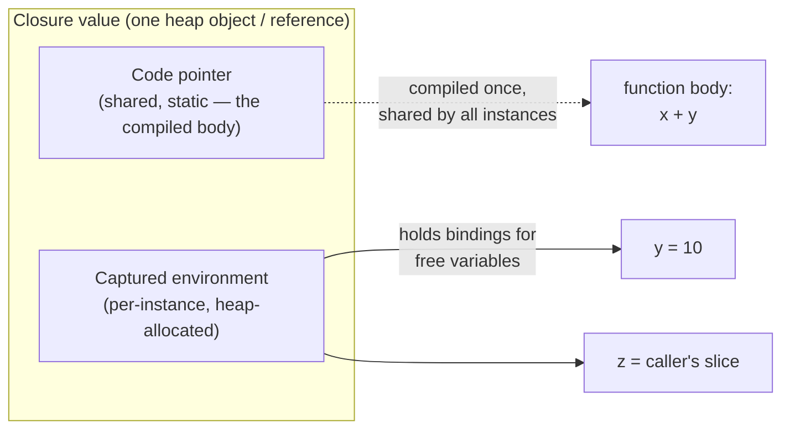

# First-Class & Higher-Order Functions — Professional Level

> **Roadmap:** [Functional Programming](../README.md) → First-Class & Higher-Order Functions
>
> *A function value is not free. It is a pointer to code plus a captured environment, allocated, scanned by the GC, and dispatched through a call site the optimizer may or may not be able to see through. At this level you stop asking "is passing functions clean?" and start asking "what does this closure cost, and how do I measure it?"*

---

## Table of Contents

1. [Introduction](#introduction)
2. [Prerequisites](#prerequisites)
3. [Theory: Functions as the Fundamental Unit](#theory-functions-as-the-fundamental-unit)
4. [What a Closure Actually Is: Code + Environment](#what-a-closure-actually-is-code--environment)
5. [Runtime & GC: What a Closure Costs](#runtime--gc-what-a-closure-costs)
6. [Dispatch: Inlining, Devirtualization, and Megamorphism](#dispatch-inlining-devirtualization-and-megamorphism)
7. [Defunctionalization: Turning Functions Back into Data](#defunctionalization-turning-functions-back-into-data)
8. [Optimization & Measurement](#optimization--measurement)
9. [A Before/After: Closure-Heavy vs Inlined Loop](#a-beforeafter-closure-heavy-vs-inlined-loop)
10. [Common Mistakes](#common-mistakes)
11. [Test Yourself](#test-yourself)
12. [Cheat Sheet](#cheat-sheet)
13. [Summary](#summary)
14. [Further Reading](#further-reading)
15. [Related Topics](#related-topics)

---

## Introduction

> Focus: the **theoretical roots** of first-class functions (why functions are the atom of computation) and their **runtime reality** — closure allocation, GC cost, escape analysis, how the JVM, Go, and CPython actually implement a lambda, and when a higher-order call inlines vs. degrades into an unpredictable indirect dispatch.

Earlier levels established the *what* and the *when*: a function value can be stored, passed, and returned (first-class), and a function that takes or returns functions is higher-order (HOF). You learned to reach for `map`/`filter`/`reduce`, callbacks, and partial application instead of hand-rolled loops and switch ladders.

This file goes one layer down — to the **runtime and the toolchain**. The professional insight is that a function value is a *data structure with a representation and a lifetime*, and a higher-order call is a *call site with optimization characteristics*. Both have measurable costs that are usually negligible and occasionally decisive. The two disciplines from the performance-minded chapters apply verbatim:

1. **Never argue from intuition.** Closures are *usually* fine. The cases where they aren't — tight numeric loops, hot allocation paths, megamorphic dispatch sites — reveal themselves only under a profiler. Every claim here pairs with the tool that would falsify it on *your* code; illustrative numbers are labeled as such.
2. **Know the mechanism, then you know the cost.** Once you understand that a capturing lambda is a heap object and a non-capturing lambda is a singleton, that escape analysis can stack-allocate the former, and that one HOF threaded with thirty different functions makes a megamorphic call site, the performance behavior stops being mysterious.

> **The mental model:** a closure is **code + a captured environment**. The code is shared and static; the environment is allocated, has a lifetime, and is visible to the garbage collector. A higher-order call is a contract with the optimizer: keep it monomorphic and it inlines to nothing; flood it with types and it becomes an indirect jump the CPU can't predict.

---

## Prerequisites

- **Required:** Comfortable with the same concepts at [`senior.md`](senior.md) — you compose HOFs and design APIs around function parameters without hesitation.
- **Required:** A working mental model of a managed runtime: heap vs. stack, a tracing GC's mark phase, JIT inlining (JVM), Go's escape analysis and compiler, CPython's bytecode interpreter and reference counting.
- **Required:** You can read a flame graph, a `benchstat` diff, and a JMH result and tell signal from noise.
- **Helpful:** Lambda-calculus literacy — you've seen `λx. x` and beta reduction, even informally.
- **Helpful:** profiling-techniques and big-o-analysis for the measurement vocabulary.

---

## Theory: Functions as the Fundamental Unit

First-class functions are not a convenience feature bolted onto imperative languages. They are the **base case of a complete model of computation**. In the **lambda calculus** (Alonzo Church, 1930s), there are only three things:

```
term ::= x            -- a variable
       | λx. term     -- an abstraction (a one-argument function)
       | term term    -- an application (calling a function on an argument)
```

That is the entire language. There are no numbers, no booleans, no loops, no data structures — yet it is **Turing-complete**. Everything is encoded as functions. Booleans become functions that choose between two arguments; numbers become functions that apply another function `n` times (Church numerals); data structures, recursion (via fixed-point combinators), and control flow all fall out of the one operation that exists: applying a function to an argument.

The takeaway for an engineer is not the encodings — it is the **claim that the function is the irreducible unit of abstraction**. When you pass a comparator to a sort, return a configured handler from a factory, or build a pipeline of transformations, you are using the calculus's only move: treating an abstraction as a value and applying it. Every "functional" feature in Go, Java, and Python is a practical re-discovery of this 90-year-old result.

> **Haskell aside.** Haskell is the lambda calculus with a type system and lazy evaluation grafted on; `\x -> x` is literally `λx. x`. Studying it is studying the model in its purest runtime form — which is why, when a concept gets murky in a language with loops and mutation, the Haskell version often makes the underlying idea snap into focus.

Two consequences matter at runtime:

- **Application is the only primitive operation**, so a language's calling convention and its function-value representation are *the* performance-critical machinery — not an afterthought. How cheaply you can create and call a function value bounds how cheaply you can abstract.
- **Free variables must be captured.** The abstraction `λx. x + y` mentions `y`, which is *free* (not its parameter). To make this a value you can carry around, the runtime must capture `y`'s binding. That capture is the closure, and the cost of that capture is the subject of the rest of this file.

---

## What a Closure Actually Is: Code + Environment

A **closure** is a function value paired with the environment of free variables it captured at the point of definition. "Code + environment" is not a metaphor — it is the literal heap representation in every language here.



Consider `λx. x + y` realized in each language. The **code** (`x + y`) is compiled once and shared by every closure created from that lambda. The **environment** holds `y` and is allocated *per closure instance* — two calls to the factory that produces this lambda make two distinct environments.

```go
// Go: makeAdder returns a closure. `y` is a free variable, captured.
func makeAdder(y int) func(int) int {
    return func(x int) int { return x + y } // captures y
}
add10 := makeAdder(10) // a closure: code(x+y) + env{y:10}
```

```java
// Java: the lambda captures `y`. The compiler synthesizes a closure object.
int y = 10;
IntUnaryOperator add10 = x -> x + y; // captures y (must be effectively final)
```

```python
# Python: the inner function closes over `y`, stored in a "cell".
def make_adder(y):
    return lambda x: x + y   # x + y; y lives in a cell, reached via __closure__
add10 = make_adder(10)
```

The critical engineering distinction is **capturing vs. non-capturing**:

- A **non-capturing** lambda (`x -> x + 1`) has an empty environment. It depends on nothing outside its parameters, so it can be a **singleton** — created once and reused forever, zero per-use allocation.
- A **capturing** lambda (`x -> x + y`) has a non-empty environment that depends on runtime values. Each instance generally needs its **own heap-allocated environment**, because each may capture different values.

This single distinction drives most of the runtime cost difference, and each runtime exploits it differently.

---

## Runtime & GC: What a Closure Costs

### Java / JVM — `invokedynamic`, the lambda metafactory, and caching

The JVM does **not** compile a lambda to an anonymous inner class at compile time. Instead `javac` emits the lambda body as a private static method and leaves an `invokedynamic` (indy) bytecode at the use site. The *first* time that site executes, the JVM calls a **bootstrap method** — `LambdaMetafactory` — which spins up an implementation class for the functional interface and returns a `CallSite`. Subsequent executions reuse the linked call site; the expensive metafactory work happens once.

The payoff is in **caching**, and it hinges on capture:

- A **non-capturing** lambda has no state, so the metafactory returns a **single shared instance** bound into a constant call site. Every evaluation of `x -> x + 1` yields the *same* object — no allocation after the first.
- A **capturing** lambda links to a call site that **allocates a new instance per evaluation**, threading the captured values into its fields. `x -> x + y` in a loop that runs a million times, with `y` differing per iteration, allocates a million closure objects.

```java
// Hot loop pitfall: a capturing lambda created per iteration → 1 alloc/iter.
for (Order o : orders) {
    handlers.add(e -> process(e, o)); // captures `o` → new closure each iteration
}
// If the lambda captured nothing, the JVM would reuse one instance for all.
```

You can see the linkage and any subsequent inlining with `-XX:+PrintCompilation` and `-XX:+PrintInlining`; allocation shows up in JFR allocation profiling. The lambda's body, once the call site is hot and monomorphic, inlines like any other call — at which point the closure object may even be **scalar-replaced** (its fields promoted to registers) by escape analysis, erasing the allocation entirely. The lesson: *capturing in a hot loop is the cost; non-capturing is nearly free; and the JIT may erase even the capturing cost if the closure doesn't escape.*

### Go — escape analysis decides stack vs. heap

Go has no JIT; its compiler makes the stack-vs-heap decision statically via **escape analysis**. A captured variable that the compiler can prove does not outlive the stack frame stays on the stack — the closure costs nothing extra. A captured variable that *escapes* (because the closure is returned, stored, or sent to another goroutine) is **boxed onto the heap**, and that allocation is GC-managed.

```go
// Does NOT escape: the closure is called and discarded within the frame.
func sumWith(xs []int, f func(int) int) int {
    total := 0
    for _, x := range xs { total += f(x) } // f doesn't escape here
    return total
}

// DOES escape: the closure outlives makeCounter, so `count` is heap-boxed.
func makeCounter() func() int {
    count := 0                 // escapes to heap (captured by returned closure)
    return func() int { count++; return count }
}
```

Prove it, don't guess — `-gcflags=-m` reports each decision:

```bash
go build -gcflags='-m -m' ./... 2>&1 | grep -E 'escapes to heap|moved to heap|func literal'
# e.g.:  ./counter.go:3:2: moved to heap: count
#        ./counter.go:4:9: func literal escapes to heap
```

The structural lever is **capture less, and capture by value**. A closure that captures a large struct by reference keeps that whole struct alive for the closure's lifetime — a quiet memory leak if the closure is long-lived (stored in a registry, a cache, a goroutine). Capturing only the one field you need lets the rest be collected.

### Python — function objects and cell variables

In CPython every `def`/`lambda` evaluates to a **function object** (`PyFunctionObject`) at runtime — itself a heap allocation with a reference count. Free variables captured from an enclosing scope are stored in **cell** objects, reachable via the function's `__closure__` tuple; the compiler marks them in `co_freevars`/`co_cellvars`.

```python
def make_adder(y):
    return lambda x: x + y

add10 = make_adder(10)
print(add10.__closure__)              # (<cell at 0x...: int object at 0x...>,)
print(add10.__closure__[0].cell_contents)  # 10
```

CPython does **not inline** and does **not do escape analysis** — every call is a full interpreter dispatch through the eval loop, and every closure created in a loop is a fresh `PyFunctionObject` plus its cells. This is why a higher-order `map(f, xs)` in pure Python is often *slower* than a comprehension: the per-element function-call overhead (frame setup, argument binding) dominates. `dis` exposes the machinery:

```python
import dis
dis.dis(make_adder)
#  ... MAKE_FUNCTION ...           # builds the closure each call
#  ... LOAD_DEREF / STORE_DEREF    # cell-variable access (vs LOAD_FAST for locals)
```

`LOAD_DEREF` (cell access) is measurably slower than `LOAD_FAST` (local slot). In a hot Python loop, a closed-over variable costs more per read than a local — usually irrelevant, occasionally not.

> **Diagnose it:** JVM → JFR allocation events + `PrintCompilation`/`PrintInlining`; Go → `-gcflags=-m` for escape, `pprof -alloc_space` for the allocation rate; Python → `dis` for `MAKE_FUNCTION`/`LOAD_DEREF`, `timeit`/`pyperf` for the per-call cost.

---

## Dispatch: Inlining, Devirtualization, and Megamorphism

Passing a function is, at the machine level, an **indirect call** — a jump through a pointer the compiler may not know at compile time. The decisive question for performance is whether the optimizer can *see through* that pointer to the concrete target. This is the exact same megamorphism story as virtual dispatch, because a HOF call site and a polymorphic call site are the same machine shape.

- **Monomorphic** call site — one concrete function flows through it. The JIT records the target in an inline cache, **devirtualizes** (replaces the indirect call with a direct one), and **inlines** the body. The HOF abstraction compiles away to nothing.
- **Bimorphic** — two targets. Still handled by an inline cache with a type guard; usually still inlined.
- **Megamorphic** — many distinct functions flow through one site. The inline cache overflows, the JIT gives up, and **every call becomes a full indirect dispatch** the CPU struggles to predict, with no inlining and no downstream optimization.

A generic HOF — say a `pipeline.map(fn)` or an event bus's `dispatch(handler)` — is a megamorphism *factory* when dozens of different functions pass through the one hot call site.

```java
// One HOF call site; 30 different lambdas flow through it across the program.
results = events.stream().map(this::dispatch).collect(toList());
// If `dispatch` internally calls handler.apply(e) and 30 handler shapes reach
// that apply site, it goes megamorphic: no inlining of the handler bodies.
```

Confirm with `-XX:+PrintInlining` (look for `not inlined ... too many types` / `megamorphic` at the site) on the JVM, or `-gcflags=-m` on Go to see whether the indirect call inlined at all. The fix mirrors the dispatch chapter: **keep hot call sites monomorphic** — e.g. specialize the hot path so one concrete function flows through it, partition work by function identity, or replace function-passing with data (next section). Go's compiler will inline an indirect call only when it can prove the concrete function at the site; a function passed in as a parameter and called in a loop frequently *cannot* be inlined, which is precisely why a hand-inlined loop sometimes beats the HOF form.

> **The professional nuance:** the cost of a HOF is rarely the one indirect call — it's the **lost inlining** of the callee and everything the optimizer could have done after inlining (constant folding, loop-invariant hoisting, vectorization). On a cold or warm path that's free; on a million-iteration numeric loop it's the whole game.

---

## Defunctionalization: Turning Functions Back into Data

**Defunctionalization** (Reynolds, 1972) is the reverse of first-class functions: replace each function value with a **data tag**, and replace each application with a `switch`/`match` that interprets the tag. It is the classic technique for getting first-class-function expressiveness in a setting where closures are expensive, unavailable, or need to be **serialized, persisted, or sent over the wire** (you can't send a code pointer to another machine; you can send a tag).

```go
// First-class form: behavior carried as a closure.
type Op func(int) int
ops := []Op{ func(x int) int { return x + 1 }, func(x int) int { return x * 2 } }

// Defunctionalized form: behavior carried as DATA, interpreted by one apply().
type Op struct {
    Kind string // "inc" | "scale"
    N    int    // operand, e.g. the scale factor
}
func apply(op Op, x int) int {
    switch op.Kind {        // one monomorphic, branch-predictable, inlinable site
    case "inc":   return x + 1
    case "scale": return x * op.N
    }
    return x
}
```

Why a professional reaches for it:

- **Serializability.** A defunctionalized op is plain data — JSON it, store it in a database, replay it. A closure cannot cross a process boundary.
- **Dispatch performance.** The single `apply` `switch` is one monomorphic, branch-predictable, inlinable site — versus a megamorphic indirect call through many distinct closures. On a hot path this can be the faster shape (the same reasoning as a jump table beating megamorphic polymorphism).
- **Inspectability.** You can log, diff, optimize, and validate the op as a value before running it. A closure is opaque.

The trade-off is the usual one: you lose open extensibility (adding an op means editing the central `switch`, not just defining a new function) and you write an interpreter by hand. Reach for it when behavior must be **data** — persisted, transmitted, inspected — or when a megamorphic HOF site is a measured bottleneck. Otherwise, first-class functions are the cleaner default.

---

## Optimization & Measurement

The whole point of this level is that you **measure before and after**, change one lever, and re-measure. The toolbox, per runtime:

| Concern | Go | Java / JVM | Python |
|---|---|---|---|
| **Closure allocation / heap** | `-gcflags=-m` (escape), `pprof -alloc_space` | JFR allocation events, async-profiler `-e alloc` | `tracemalloc`, `memray` |
| **Inlining / devirtualization** | `go build -gcflags='-m -m'` | `-XX:+PrintInlining`, `-XX:+PrintCompilation` | (none — CPython doesn't inline) |
| **CPU / per-call cost** | `go test -cpuprofile`, `pprof` | async-profiler `-e cpu`, JFR | `cProfile`, `py-spy`, `scalene` |
| **Microbenchmark** | `testing.B` + `benchstat` | JMH | `timeit`, `pyperf` |
| **Bytecode / dispatch shape** | `go tool objdump` | `javap -c`, `-XX:+PrintInlining` | `dis.dis` |
| **GC behavior** | `GODEBUG=gctrace=1` | `-Xlog:gc*`, JFR GC events | `gc.set_debug`, generational stats |

```bash
# Go: which closures escape, and the allocation rate they cause
go build -gcflags='-m -m' ./... 2>&1 | grep -E 'escapes|moved to heap|func literal'
go test -bench=. -benchmem -memprofile mem.out ./... && go tool pprof -alloc_space mem.out

# Java: did the HOF call site inline, or go megamorphic?
java -XX:+UnlockDiagnosticVMOptions -XX:+PrintInlining -jar bench.jar 2>&1 | grep -iE 'inlin|megamorphic|too many'

# Python: is the closure created per call, and how slow is the dispatch?
python -m dis your_module.py | grep -E 'MAKE_FUNCTION|LOAD_DEREF|CALL'
python -m timeit -s 'from m import f, xs' 'list(map(f, xs))'
python -m timeit -s 'from m import f, xs' '[f(x) for x in xs]'
```

> **Discipline:** if you cannot point at the tool that would falsify your performance claim, you are guessing. "Closures are slow" and "HOFs are slow" are both false in general and occasionally true in particular — only the instrument tells you which case you're in.

Three high-leverage optimizations, each measured:

1. **Hoist non-capturing lambdas out of loops** so the runtime reuses one instance (JVM already shares them; Go/Python benefit from manual hoisting). Confirm the allocation drop with JFR / `-benchmem` / `tracemalloc`.
2. **Capture less.** Capture the one field, not the whole struct, to shorten the captured environment's lifetime and shrink the allocation. Confirm with the alloc profile and (Go) `-m`.
3. **Specialize the hot path** so its call site stays monomorphic, or **defunctionalize** it so dispatch is a jump table. Confirm with `PrintInlining` / `-m` and a JMH / `benchstat` A/B.

---

## A Before/After: Closure-Heavy vs Inlined Loop

A hot numeric reduction, written as a chain of higher-order calls vs. a flat loop. The HOF version is clearer; the question is what it costs *on this hot path*.

```go
// BEFORE — closure-heavy pipeline. Each stage is an indirect call the
// compiler may not inline; intermediate slices allocate.
func sumSquaresOfEvens(xs []int) int {
    return reduce(
        mapInts(
            filterInts(xs, func(x int) bool { return x%2 == 0 }),
            func(x int) int { return x * x }),
        0, func(a, b int) int { return a + b })
}
```

```go
// AFTER — fused into one flat loop. No function values, no intermediate
// slices, every operation inlined and the loop body vectorizable.
func sumSquaresOfEvens(xs []int) int {
    total := 0
    for _, x := range xs {
        if x%2 == 0 { total += x * x }
    }
    return total
}
```

What changed at runtime: the BEFORE version threads three function values through three generic HOFs (indirect calls the compiler often can't inline) and allocates two intermediate slices; the AFTER version is straight-line code the compiler inlines fully, keeps `total` in a register, and may vectorize.

> **Illustrative impact (labeled — reproduce, don't trust):** on a 10M-element slice, `benchstat` showed the fused loop at roughly **2–4× fewer ns/op** and **near-zero allocations** versus the closure-pipeline form, which allocated the two intermediate slices and paid for un-inlined indirect calls. On a JVM Stream version, a warmed-up JIT closed much of the gap by inlining and scalar-replacing — *the magnitude is runtime- and warmup-dependent, which is exactly why you measure your own with `-benchmem`/JMH rather than copying this number.*

The professional reading is **not** "loops beat functions." It is:

- On a **cold/warm or non-hot** path, the pipeline's clarity wins and its cost is invisible — keep it.
- On a **proven hot** path (a profiler points at it), the fused loop's full inlining and zero allocation can be decisive — and you isolate that fused, less-pretty loop behind a clean function boundary with a committed benchmark, exactly as you would any deliberately-ugly fast path.
- The JIT narrows the gap that the Go compiler and CPython cannot — *the right answer is runtime-specific and benchmark-driven, never dogmatic.*

---

## Common Mistakes

Professional-level mistakes — subtle, and therefore expensive:

1. **Assuming "closures are slow" (or "fast") in general.** Both are false. A non-capturing lambda is a reused singleton on the JVM and a stack value in Go; a capturing one in a hot loop allocates. The cost is specific; measure the specific case.
2. **Capturing a whole struct to use one field.** The closure pins the entire object for its lifetime — a quiet memory leak when the closure is long-lived. Capture the field, not the aggregate.
3. **Creating capturing lambdas inside a hot loop.** One allocation per iteration. Hoist non-capturing lambdas; refactor to capture loop-invariant data once outside the loop.
4. **Ignoring megamorphism at a generic HOF site.** Thirty functions through one `map`/`dispatch` site overflows the inline cache; the callee bodies stop inlining. Check `PrintInlining`/`-m` before assuming the abstraction is free.
5. **Believing the Go compiler inlines every passed-in function.** An indirect call through a function *parameter* often isn't inlined — which is why a hand-fused loop can beat the HOF form on a hot path. Verify with `-m`.
6. **Treating `map(f, xs)` as free in Python.** Per-element function-call overhead (frame setup, `LOAD_DEREF`) frequently makes it *slower* than a comprehension. `timeit` both before choosing.
7. **Reaching for defunctionalization (or fused loops) prematurely.** They sacrifice extensibility and clarity. Use them when behavior must be serialized/inspected, or when a profiler proves the HOF dispatch is the bottleneck — not on principle.
8. **Refactoring closure code for speed with no baseline.** Capture a `benchstat`/JMH/JFR baseline first, change one lever, re-measure. A blended change with one number teaches nothing.

---

## Test Yourself

1. Explain the difference between how the JVM represents a **non-capturing** vs. a **capturing** lambda, and why one is nearly allocation-free while the other can allocate per evaluation. Which tool confirms the allocation?
2. In Go, what determines whether a captured variable lives on the stack or the heap, and which compiler flag prints that decision?
3. A generic `pipeline.map(fn)` is on a hot path and the JIT won't inline the function bodies. Name the phenomenon, why it's slow, and the flag that confirms it.
4. Why is a fused flat loop sometimes faster than the equivalent `filter`→`map`→`reduce` chain — and why is "loops beat functions" still the wrong conclusion?
5. What is defunctionalization, and give two concrete reasons to prefer it over passing closures.
6. In CPython, what is a "cell" variable, which bytecodes access it, and why might a closed-over variable read slower than a local in a hot loop?
7. You capture a large struct in a closure stored in a long-lived registry, and memory climbs. What's the mechanism, and what's the fix?

<details>
<summary>Answers</summary>

1. A non-capturing lambda has an empty environment, so `LambdaMetafactory` returns a **single shared instance** bound into a constant call site — reused on every evaluation, no allocation after the first. A capturing lambda must thread runtime values into per-instance fields, so its call site **allocates a new object per evaluation** (unless escape analysis scalar-replaces it because it doesn't escape). Confirm with JFR allocation profiling (and `-XX:+PrintInlining` to see whether it inlined/scalar-replaced).
2. **Escape analysis**: if the compiler can prove the captured variable does not outlive the stack frame, it stays on the stack (free); if the closure is returned/stored/sent to a goroutine, the variable **escapes** and is heap-boxed (GC-managed). `go build -gcflags='-m -m'` prints `moved to heap` / `escapes to heap` per decision.
3. **Megamorphism**: many distinct functions flow through one call site, overflowing the inline cache, so the JIT can't devirtualize or inline — every call becomes a full indirect dispatch the CPU struggles to predict, and all downstream optimization (folding, hoisting, vectorization) is lost. Confirm with `-XX:+PrintInlining` showing `too many types` / `megamorphic` at the site.
4. The fused loop is straight-line code the compiler **inlines fully**, keeps the accumulator in a register, allocates no intermediate collections, and may vectorize; the chain threads function values through generic HOFs (indirect calls often not inlined) and allocates intermediates. It's still wrong to conclude "loops beat functions" because (a) the gap is invisible off the hot path, where clarity wins, (b) a warmed-up JIT can inline and scalar-replace the chain to near-parity, and (c) the magnitude is runtime- and benchmark-specific — measure, don't dogmatize.
5. Defunctionalization replaces each function value with a **data tag** and each application with a `switch`/`match` interpreter. Prefer it when behavior must be **serialized/persisted/transmitted** (you can't send a code pointer across a process boundary) or **inspected/logged/diffed** as data, and when a **megamorphic HOF dispatch** is a measured bottleneck (the single `switch` is one monomorphic, inlinable, branch-predictable site).
6. A **cell** is a heap box CPython uses to share a variable between an enclosing function and the closures that capture it; it's reached via the function's `__closure__` and accessed with `LOAD_DEREF`/`STORE_DEREF` (vs. `LOAD_FAST` for plain locals). `LOAD_DEREF` is an extra indirection through the cell, so it's measurably slower than `LOAD_FAST` — usually irrelevant, occasionally material in a tight loop.
7. The closure captures the struct **by reference**, so the entire object is kept reachable for the closure's lifetime; a long-lived registry keeps the closure alive, so the GC can never collect the struct — a quiet leak. Fix: capture only the specific field(s) the closure needs (a small value), letting the rest of the struct be collected; confirm the change with an allocation/heap profile.

</details>

---

## Cheat Sheet

| Concern | What's really happening | Measure with | Lever |
|---|---|---|---|
| **Non-capturing lambda** | Empty env → singleton (JVM), stack value (Go) | JFR alloc, `-gcflags=-m` | Already near-free; hoist out of loops if your runtime re-creates it |
| **Capturing lambda** | Per-instance heap env threading captured values | JFR alloc, `pprof -alloc_space`, `tracemalloc` | Capture less, capture by value; hoist invariant captures out of loops |
| **Go escape** | Captured var heap-boxed if it outlives the frame | `go build -gcflags='-m -m'` | Don't return/store the closure if you can avoid it; capture one field |
| **JVM lambda** | `invokedynamic` + `LambdaMetafactory`; capturing allocs, non-capturing cached; JIT may scalar-replace | `PrintCompilation`, `PrintInlining`, JFR | Keep the call site monomorphic; let escape analysis erase the alloc |
| **Python closure** | `PyFunctionObject` + cells; `MAKE_FUNCTION` per def, `LOAD_DEREF` per read; no inlining | `dis`, `timeit`, `tracemalloc` | Prefer comprehensions on hot loops; promote cell vars to locals |
| **HOF dispatch** | Indirect call; inlines if mono/bimorphic, megamorphic kills inlining | `PrintInlining`, `-gcflags=-m`, JMH/`benchstat` | Specialize hot site to monomorphic, or defunctionalize to a jump table |
| **Hot fused loop** | Full inlining, register accumulator, zero intermediates, vectorizable | `benchstat -benchmem`, JMH | Use on profiled hot paths only; fence behind a clean API + committed bench |

**Three golden rules:**
- *A closure is code + a heap-allocated environment; non-capturing is nearly free, capturing costs allocation — know which you have, and measure it.*
- *A HOF call site is free when monomorphic (JIT inlines it) and expensive when megamorphic (no inlining); the lost inlining, not the indirect call, is the real cost.*
- *Closures and HOFs are the clean default everywhere except a profiled hot loop, where a fused loop or defunctionalized dispatch — isolated behind a clean boundary with a committed benchmark — may win.*

---

## Summary

- First-class functions are the **base case of computation** — the lambda calculus shows that application of functions to arguments is a complete, Turing-complete model. Every functional feature in Go, Java, and Python is a re-discovery of this.
- A **closure is code + a captured environment**, and that's the literal heap representation: shared static code, per-instance environment. The decisive distinction is **capturing vs. non-capturing** — the latter is singleton/stack-cheap, the former allocates.
- **JVM:** lambdas are `invokedynamic` + `LambdaMetafactory`; non-capturing lambdas are cached singletons, capturing ones allocate per evaluation, and escape analysis can scalar-replace the allocation when the closure doesn't escape.
- **Go:** escape analysis decides stack vs. heap; a captured variable that outlives its frame is heap-boxed. `-gcflags=-m` prints every decision. Capture less, capture by value.
- **Python:** every `def`/`lambda` is a runtime `PyFunctionObject`; captured vars live in cells accessed via `LOAD_DEREF`; CPython neither inlines nor does escape analysis, so HOF per-call overhead is real and `map(f, xs)` often loses to a comprehension.
- **Dispatch is the same megamorphism story as virtual calls:** a monomorphic HOF site inlines to nothing; a megamorphic one (many functions through one site) defeats inlining, and the **lost inlining** — not the indirect call — is the cost.
- **Defunctionalization** turns function values back into data interpreted by a `switch` — use it when behavior must be serialized/inspected or when a megamorphic site is a measured bottleneck.
- **Measure first, always:** Go `-m`/`pprof`/`benchstat`, JVM `PrintInlining`/JFR/JMH, Python `dis`/`timeit`. Capture a baseline, change one lever, re-measure. Closures are usually fine; hot loops may differ — only the instrument tells you which case you're in.
- Next on the level ladder, drill the sibling concepts; the runtime discipline here recurs throughout FP.

---

## Further Reading

- **Lambda Calculus and Combinators** — Hindley & Seldin (2008) — the formal model functions-as-values descends from.
- **Definitional Interpreters for Higher-Order Programming Languages** — John C. Reynolds (1972) — the original defunctionalization paper.
- **Optimizing Java** — Evans, Gough, Newland (2018) — `invokedynamic`, lambda metafactory, JIT inlining, escape analysis, JMH, JFR.
- **The Garbage Collection Handbook** — Jones, Hosking, Moss (2nd ed., 2023) — why object lifetime and allocation rate (which closures drive) determine GC cost.
- **High Performance Python** — Gorelick & Ozsvald (2nd ed., 2020) — function-call overhead, `dis`, `timeit`, when HOFs lose to comprehensions.
- **Go's escape analysis & inlining** — `go build -gcflags=-m` docs; the Go compiler's inliner and escape-analysis source commentary.
- **Systems Performance** — Brendan Gregg (2nd ed., 2020) — branch prediction and indirect-call cost behind megamorphic dispatch.

---

## Related Topics

- [Recursion & Tail Calls](../08-recursion-and-tail-calls/professional.md) — the FP loop; its runtime cost (stack growth, TCO or its absence) is the natural companion to closure cost here.
- [Currying & Partial Application](../07-currying-and-partial-application/professional.md) — partial application *is* closure creation; this file's capture/allocation analysis applies directly.
- [Composition](../05-composition/professional.md) — function pipelines are chained HOF call sites; the inlining/megamorphism analysis here is what decides their cost.
- [Map / Filter / Reduce](../04-map-filter-reduce/professional.md) — the canonical HOFs; the fused-loop vs. pipeline trade-off lives there too (fusion).
- [Anti-Patterns → Bad Structure](../../anti-patterns/01-development/01-bad-structure/professional.md) — the megamorphic-dispatch and "ugly-but-fast, fenced off" disciplines, applied to structure.
- [Over-Engineering → Premature Optimization](../../anti-patterns/01-development/03-over-engineering/professional.md) — profile before you fuse a loop or defunctionalize; the counterweight to this file.
- profiling-techniques · big-o-analysis · memory-leak-detection — the measurement toolkits referenced throughout.
