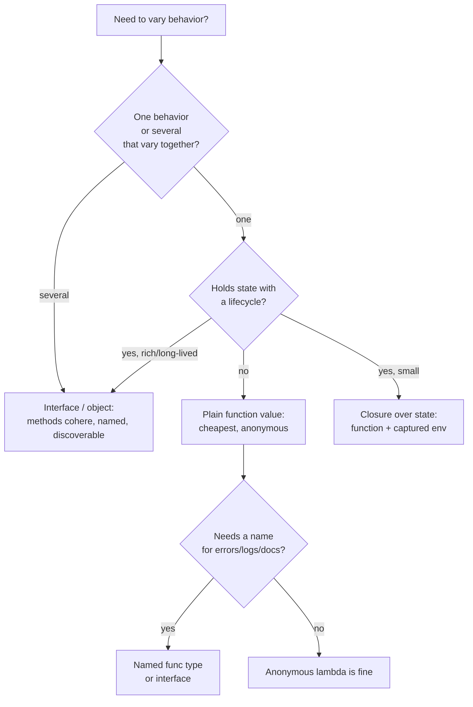

# First-Class & Higher-Order Functions — Senior Level

> **Roadmap:** [Functional Programming](../README.md) → First-Class & Higher-Order Functions
>
> *A first-class function is a value you can pass, return, and store. A higher-order function is one that takes or returns another function. At the senior level the question stops being "how do they work" and becomes "what should I design **with** them" — when a function is the right unit of extension, when an interface or an object is, and what each choice costs the people who maintain the code.*

---

## Table of Contents

1. [Introduction](#introduction)
2. [Prerequisites](#prerequisites)
3. [The Core Design Lens: A Function Is a One-Method Interface](#the-core-design-lens-a-function-is-a-one-method-interface)
4. [Designing APIs Around Functions](#designing-apis-around-functions)
   - [Dependency Injection: Functions vs Interfaces](#dependency-injection-functions-vs-interfaces)
   - [The Functional-Options Pattern](#the-functional-options-pattern)
   - [Callback Contracts](#callback-contracts)
   - [Hooks and Extension Points](#hooks-and-extension-points)
5. [HOFs as the Basis of Reusable Abstractions](#hofs-as-the-basis-of-reusable-abstractions)
6. [When Functions Beat Objects (and Vice Versa)](#when-functions-beat-objects-and-vice-versa)
7. [Language-Support Comparison](#language-support-comparison)
8. [Maintainability & Testability Implications](#maintainability--testability-implications)
9. [Limits & Pitfalls at Scale](#limits--pitfalls-at-scale)
10. [Common Mistakes](#common-mistakes)
11. [Test Yourself](#test-yourself)
12. [Cheat Sheet](#cheat-sheet)
13. [Summary](#summary)
14. [Further Reading](#further-reading)
15. [Related Topics](#related-topics)

---

## Introduction

> Focus: **design and architecture implications.** Not "what is a closure" — that was junior and middle. Here: *how do I shape an API, a module boundary, or a plugin system around functions, and when is that the wrong tool?*

At the junior level you learned that a function can be a value. At the middle level you used `map`/`filter`/`reduce`, wrote closures that capture state, and reached for callbacks. The senior shift is **architectural**: a first-class function is the smallest possible unit of dependency, extension, and polymorphism your language offers. Every time you accept a function parameter you are making a design decision that is equivalent to — but cheaper than — defining a single-method interface and asking callers to implement it.

That cheapness is the whole story. It is why the same idea shows up everywhere under different names: a Go `func(*Server)` option, a Java `Comparator`, a Python decorator, a React hook, an Express middleware, an HTTP handler, a retry policy, a SQL transaction body. They are all the same move — *pass behavior as a value to invert who decides what happens* — and the senior skill is recognizing the move, choosing it deliberately, and knowing the three or four places it quietly becomes a liability.

> **The senior mindset shift:** the junior asks "can I pass a function here?"; the senior asks "is a *function* the right shape for this extension point, or do I need the structure, naming, lifecycle, and discoverability that an interface or an object gives me — and what will the next maintainer pay for my choice?"

---

## Prerequisites

- **Required:** Fluency with [`junior.md`](junior.md) and [`middle.md`](middle.md) — closures, capture semantics, passing/returning functions, the `map`/`filter`/`reduce` trio.
- **Required:** You have designed an API others consume, and maintained one you did not write.
- **Helpful:** Working knowledge of [Dependency Injection](../../design-patterns/README.md) and the [Strategy pattern](../../design-patterns/03-behavioral/08-strategy/junior.md) — HOFs are, design-wise, both of these in miniature.
- **Helpful:** Familiarity with [Composition](../05-composition/senior.md) and [Currying & Partial Application](../07-currying-and-partial-application/senior.md) — the techniques that make function-valued APIs ergonomic.
- **Helpful:** Comfort reading at least two of Go, Java, Python, and Haskell, since the design trade-offs are most visible in their *differences*.

---

## The Core Design Lens: A Function Is a One-Method Interface

Hold this equivalence in your head; everything below is a corollary of it.

```
interface Strategy { R apply(A a); }   ≡   func(A) R
```

A function value *is* a one-method interface with the method name erased. This single fact explains both the appeal and the limits of function-based design:

- **Appeal** — no nominal type to declare, no class to instantiate, no name to bikeshed. The call site is the implementation. Adding a strategy is writing a lambda, not a file.
- **Limit** — you *lose the name, the grouping, and the lifecycle*. An interface can have several methods that vary together, a stable identity, documentation attached to the type, and implementations you can enumerate. A bare `func(A) R` has none of that; it is anonymous behavior.

So the design rule that governs this entire topic is:

> **Use a function when the variation is a single behavior with no identity to maintain. Use an interface or object when the variation is multiple behaviors that change together, needs a name, holds state with a lifecycle, or must be discoverable.**

Everything in the rest of this file is an application of that rule.



---

## Designing APIs Around Functions

Four recurring patterns dominate function-valued API design. Each is the "one-method interface" lens applied to a different problem.

### Dependency Injection: Functions vs Interfaces

The textbook way to make code testable is to inject dependencies. The textbook *form* is an interface; the lightweight form is a function. Choosing between them is the most common senior judgment call in this topic.

Consider a service that needs to fetch a user. The interface form:

```go
// Interface DI — the conventional shape.
type UserRepo interface {
    FindByID(ctx context.Context, id string) (User, error)
}

type Service struct{ repo UserRepo }

func (s *Service) Greet(ctx context.Context, id string) (string, error) {
    u, err := s.repo.FindByID(ctx, id)
    if err != nil { return "", err }
    return "Hello, " + u.Name, nil
}
```

The function form injects only the *one capability the service actually uses*:

```go
// Function DI — inject the capability, not the object.
type FindUser func(ctx context.Context, id string) (User, error)

type Service struct{ find FindUser }

func (s *Service) Greet(ctx context.Context, id string) (string, error) {
    u, err := s.find(ctx, id)            // identical call site
    if err != nil { return "", err }
    return "Hello, " + u.Name, nil
}
```

The trade-off, made explicit:

| Dimension | Function injection | Interface injection |
|---|---|---|
| **Coupling** | Depends on *one method's signature* — the narrowest possible dependency | Depends on the whole interface, even unused methods |
| **Testing** | Pass a literal closure: `func(_ context.Context, _ string) (User, error) { return testUser, nil }` | Write/generate a mock or stub type |
| **Cohesion** | Loses the fact that `FindByID` and `Save` belong to the same repo | Keeps related operations grouped and named |
| **Discoverability** | "What can a repo do?" has no single answer | One interface lists the contract |
| **Refactoring** | N functions to thread when you need N capabilities | One field, even as the interface grows |

The decisive question is **cardinality of need**. If the consumer genuinely uses *one* method, a function is the better, narrower dependency — it satisfies the Interface Segregation Principle for free, and tests need no mocking framework. If the consumer uses *several methods that cohere*, an interface keeps them named and grouped; threading five separate functions through constructors is worse than one repo. The anti-pattern in both directions: injecting a fat interface when you call one method (over-coupling), or shredding a cohesive object into a fistful of loose functions (lost cohesion).

> **Senior heuristic:** inject a *function* when you'd otherwise define a one-method interface purely to enable a test. Inject an *interface/object* when the methods form a real, named contract that varies as a unit.

### The Functional-Options Pattern

Go has no keyword arguments, default parameters, or builder syntax, so the idiomatic way to build a configurable constructor is **functional options**: variadic functions that each mutate a config. This is first-class functions used as a *configuration DSL*.

```go
type Server struct {
    addr    string
    timeout time.Duration
    tls     *tls.Config
    logger  *slog.Logger
}

// An Option is a function that customizes a Server.
type Option func(*Server)

func WithTimeout(d time.Duration) Option {
    return func(s *Server) { s.timeout = d }      // closure captures d
}
func WithTLS(c *tls.Config) Option {
    return func(s *Server) { s.tls = c }
}
func WithLogger(l *slog.Logger) Option {
    return func(s *Server) { s.logger = l }
}

func NewServer(addr string, opts ...Option) *Server {
    s := &Server{                                 // defaults live here, in one place
        addr:    addr,
        timeout: 30 * time.Second,
        logger:  slog.Default(),
    }
    for _, opt := range opts {                     // apply each option in order
        opt(s)
    }
    return s
}

// Call site — self-documenting, every argument named, defaults invisible.
srv := NewServer(":8080", WithTimeout(5*time.Second), WithTLS(cfg))
```

Why this beats the alternatives in Go specifically:

- **vs a config struct** — defaults are centralized (not duplicated at every call site that must zero-fill fields); the API is backward-compatible when you add an option (a new `WithX` doesn't break existing callers, unlike adding a struct field that callers must now consider); and validation can live in the option.
- **vs telescoping constructors** — no `NewServer(addr, timeout, tls, logger, ...)` positional soup where `nil, nil, 0` is unreadable.

The cost is real and worth naming: more boilerplate (one `WithX` per field), options that interact must be validated *after* all are applied, and a careless option can read another field that a later option overwrites (order sensitivity). It is the right pattern for *libraries with many optional, mostly-independent settings*; it is over-engineering for a struct with two required fields. Other languages don't need it — Python has keyword args with defaults, Java has builders or records — which is itself a lesson: **the functional-options pattern is a workaround for a missing language feature, elevated to an idiom.** Recognize it as such.

### Callback Contracts

A callback is a function you hand to someone else to call *back* into your code. The senior concern is not "how to pass one" but **the contract around it**, because a callback's behavior at the call site is invisible to its author. A well-designed callback API answers, in documentation and ideally in types:

1. **When and how often** is it called? Once? Per item? Zero times on empty input? On error paths too?
2. **On which thread / goroutine?** Synchronously before return, or asynchronously later? This determines whether the callback may touch shared state.
3. **What may it assume about state?** Are locks held? Is a transaction open? Is it inside a `defer`?
4. **What happens if it panics / throws / returns an error?** Does the host swallow it, propagate it, or abort the batch?
5. **Re-entrancy** — may the callback call back into the API that invoked it?

```java
// A callback contract made explicit in the signature and Javadoc.
public interface RetryPolicy {
    /**
     * Called once per failed attempt, BEFORE the next retry sleeps.
     * Invoked on the calling thread, synchronously. Must NOT block
     * for long and must NOT throw — a throw aborts the retry loop
     * and propagates to the caller of execute().
     *
     * @param attempt 1-based attempt number that just failed
     * @param error   the failure; never null
     * @return the delay before the next attempt; Duration.ZERO to retry now,
     *         a negative duration to STOP retrying and rethrow.
     */
    Duration onFailure(int attempt, Throwable error);
}
```

The single most common production incident from callbacks is the **threading assumption mismatch**: a callback that mutates a `HashMap` is registered with an API that invokes it from a pool of threads, and the map corrupts under concurrency. The contract — "called on which thread" — is load-bearing, and a function value carries *no* type information about it. This is a structural weakness of function-based extension: **the contract lives in prose, not in the type.** A senior compensates by documenting it ruthlessly and, where the language allows, encoding parts of it (e.g., a `Sendable` bound, a `Send` bound in Rust, an `@GuardedBy` annotation).

### Hooks and Extension Points

A hook is a *named, optional* callback slot in a lifecycle: `beforeSave`, `afterCommit`, `onConnectionLost`. Hooks are how frameworks let you extend behavior without subclassing. Design them as functions when the extension is a single behavior; promote to an interface when the lifecycle has *several* coordinated hooks (then it's a listener/observer — see [Observer pattern](../../design-patterns/03-behavioral/08-strategy/junior.md)).

```python
# Hooks as first-class functions: a pluggable pipeline stage.
from typing import Callable

Hook = Callable[[Request], Request]

class Pipeline:
    def __init__(self) -> None:
        self._before: list[Hook] = []
        self._after:  list[Hook] = []

    def before_request(self, hook: Hook) -> Hook:   # usable as a decorator
        self._before.append(hook)
        return hook                                  # return so @ stacking works

    def handle(self, req: Request) -> Response:
        for h in self._before:
            req = h(req)                             # each hook transforms the request
        resp = self._dispatch(req)
        return resp

pipeline = Pipeline()

@pipeline.before_request                            # registration reads like config
def add_trace_id(req: Request) -> Request:
    req.headers["X-Trace-Id"] = new_id()
    return req
```

The design tension with hooks is **ordering and isolation**: if `add_trace_id` must run before `authenticate`, the list order encodes a dependency that nothing enforces — the same hidden temporal coupling that makes spaghetti code dangerous. Senior hook design either declares hooks order-independent (pure transforms that compose freely) or makes ordering explicit (priorities, a declared phase) rather than relying on registration order. And a hook that throws should fail loudly with *which* hook failed, never silently skip — a swallowed hook exception is among the hardest production bugs to diagnose because the symptom (missing trace IDs) is far from the cause.

---

## HOFs as the Basis of Reusable Abstractions

The deepest architectural value of higher-order functions is that they let you **factor out the varying part of an algorithm and keep the invariant part once.** This is the same goal as the Template Method pattern — but where Template Method needs a class hierarchy and inheritance, an HOF needs a parameter.

The classic example is *resource management*. The invariant is "acquire, run something, always release"; the varying part is the something:

```python
# The HOF owns the invariant (acquire/release, exactly once, even on error).
# The caller supplies only the varying behavior.
def with_transaction(db, body: Callable[[Connection], T]) -> T:
    conn = db.begin()
    try:
        result = body(conn)      # <-- the only thing that varies
        conn.commit()
        return result
    except Exception:
        conn.rollback()          # invariant: never leak an open transaction
        raise
    finally:
        conn.close()

# Three different operations, ONE place that guarantees commit/rollback/close.
user  = with_transaction(db, lambda c: c.query("SELECT ... "))
_     = with_transaction(db, lambda c: c.execute("UPDATE ..."))
```

Every caller that uses `with_transaction` is *structurally incapable* of leaking a connection or forgetting to roll back — the abstraction makes the mistake unrepresentable. That is the senior payoff: not "less typing" but **a correctness invariant enforced by an abstraction instead of by discipline.** The same shape underlies retry-with-backoff (invariant: the loop and the backoff; varying: the operation), timing/instrumentation wrappers, locking, caching/memoization, and the entire middleware concept.

This is why HOFs are the basis of reusable abstractions in a way that copy-paste and even inheritance are not: the invariant is written *once*, callers cannot bypass it, and the varying part is a value they pass — testable in isolation, composable, replaceable. When you find the same try/finally, the same loop, the same setup/teardown repeated across a codebase, the senior move is to lift it into an HOF and pass the difference. (The discipline of keeping that lifted invariant honest is the [DRY principle](../../clean-code/02-functions/README.md) done right — abstracting a true invariant, not coincidental similarity.)

---

## When Functions Beat Objects (and Vice Versa)

This is the crux. Functions and objects are duals — both bundle behavior, and an object with one method *is* a function with captured state. The choice is about which costs you can afford.

**Reach for a function (or closure) when:**

- The variation is **a single behavior** — a comparator, a predicate, a transform, a handler. A `Comparator` is a function; making it a class adds ceremony with no payoff.
- The thing is **anonymous and local** — used once, at the call site, never referenced elsewhere. A lambda beats a named class for `list.sort(by=lambda x: x.age)`.
- You want **composition over configuration** — `compose(validate, normalize, persist)` reads as a pipeline; the object equivalent is a chain of collaborators wired by hand.
- State is **small and captured** — a closure over a counter or a config value is lighter than a class with one field.

**Reach for an object / interface when:**

- The variation is **multiple methods that vary together** — a `PaymentProvider` with `charge`, `refund`, `capture` must vary as a *set*; three loose functions can drift out of sync. (Passing a "bag of functions" struct is just a worse, unnamed interface.)
- The behavior **has identity** — it appears in logs, errors, metrics, or config by name. `"RetryPolicy: exponential"` beats a stack trace pointing at an anonymous lambda.
- There is **rich, long-lived state with a lifecycle** — open/close, connect/disconnect, a state machine. Closures *can* hold state but obscure its lifecycle; an object names it.
- You need **discoverability and a stable contract** — implementers should be able to ask "what must I provide?" and tooling should enumerate implementations. An interface answers; a `func` type does not.
- The behavior must be **extended by subtyping or shared via inheritance/mixins** — though prefer [composition](../05-composition/senior.md) here too.

> **The litmus test:** if you'd have to write a comment explaining what the anonymous function *is* ("this is the eviction policy"), it wanted a name — promote it to a named type or interface. If naming it would add nothing a reader doesn't already see, a function is correct.

A frequent senior mistake in each direction: **gold-plating with objects** (a `Strategy` interface, a factory, and three classes where a `map[string]func()` would do) and **shredding into functions** (a service constructor taking eight function parameters that all came from one repository, destroying cohesion and making the call site unreadable). The "bag of functions struct" is the canary for the second mistake — when your function parameters start traveling together in a struct, they wanted to be an interface.

---

## Language-Support Comparison

The *same* design decision feels different in each language because the language's support for first-class functions differs. Knowing the differences lets you write idiomatic code in each rather than smuggling one language's habits into another.

| Aspect | Go | Java | Python | Haskell |
|---|---|---|---|---|
| **Functions are values** | Yes, native `func` type | Via `@FunctionalInterface` objects (`Function`, `Supplier`, `Comparator`, …) | Yes, everything is an object including functions | Yes — the *default* unit of abstraction |
| **Closures** | Yes, capture by reference | Yes, but captured locals must be *effectively final* | Yes, late-binding capture (a famous gotcha) | Yes, pure — captures values, no mutation |
| **Lambda syntax** | `func(x int) int { return x*2 }` (verbose) | `x -> x * 2` | `lambda x: x*2` (expression-only) | `\x -> x*2` |
| **Method references** | No | Yes — `String::length`, `obj::method`, `Cls::new` | Bound/unbound methods are first-class | N/A (functions already first-class) |
| **Currying / partial app** | Manual (return a closure) | Manual / `Function.andThen` | `functools.partial` | **Automatic** — all functions are curried |
| **Generics over functions** | Yes (Go 1.18+) | Yes, via type parameters | Duck-typed, `Callable[...]` hints | Yes, with full HM type inference |
| **Idiomatic role** | Options pattern, handlers, narrow DI | Streams, callbacks, Strategy via lambdas | Decorators, HOFs, callbacks everywhere | The whole paradigm |

A few differences that bite in design:

**Go** makes functions native and cheap, which is why the functional-options pattern and `http.HandlerFunc` exist — but its lambda syntax is verbose, so deeply point-free or curried code reads badly. Go closures capture by *reference*, so the classic loop-variable bug bit Go too (fixed by per-iteration scoping in Go 1.22). Idiomatic Go uses functions for narrow extension points and structs/interfaces for everything with identity.

```go
// http.HandlerFunc: an adapter making a plain function satisfy an interface.
// This is THE Go idiom for "a function is a one-method interface."
type HandlerFunc func(ResponseWriter, *Request)
func (f HandlerFunc) ServeHTTP(w ResponseWriter, r *Request) { f(w, r) }
```

**Java** has no standalone function type; every lambda is an instance of a *functional interface*. This is the one-method-interface equivalence made *literal* — a Java lambda only exists because the language defines `Function<T,R>`, `Predicate<T>`, etc. **Method references** (`String::length`) are Java's superpower here, turning existing methods into function values with zero boilerplate. The constraint that captured variables be effectively final pushes Java toward immutable, functional-friendly capture.

```java
// Method references turn existing methods into function values.
names.stream().map(String::toUpperCase).sorted(Comparator.comparingInt(String::length));
```

**Python** is "first-class everything" — functions, methods, classes are all objects you can pass and store, which is why **decorators** (HOFs that wrap functions) are pervasive. Two senior traps: Python lambdas are expression-only (multi-statement behavior needs a `def`), and closures capture *variables, not values*, late-bound — `[lambda: i for i in range(3)]` all return `2`. The fix (`lambda i=i: i`) is a capture idiom every senior Python dev knows.

**Haskell** is the pure ideal: functions are the primary abstraction, *automatically curried* (`f a b` is `(f a) b`), and the type system tracks effects so a function value's purity is guaranteed by its type. Studying it clarifies what the others approximate — when you see Go's options or Java's streams, you're seeing pieces of what Haskell does uniformly. You will rarely *ship* Haskell, but its model is the reference design.

```haskell
-- Every function is curried; partial application is free, no functools needed.
add :: Int -> Int -> Int
add x y = x + y
add5 :: Int -> Int        -- partial application is just "not passing the last arg"
add5 = add 5
```

> **The portable lesson:** the *design move* (pass behavior as a value) is universal; the *ergonomics and safety* (syntax weight, capture semantics, effect tracking, discoverability) differ sharply. Write to the grain of the language: options in Go, method refs and streams in Java, decorators in Python, point-free purity in Haskell — don't transplant one language's idiom into another where it reads as foreign.

---

## Maintainability & Testability Implications

Function-valued design is a maintainability lever in both directions; seniors weigh both edges.

**Testability — the upside.** A function dependency is the easiest thing in the world to test, because the test *is* the dependency:

```python
# No mocking framework, no stub class — the dependency is a literal.
def test_greet_uses_name():
    fake_find = lambda _id: User(name="Ada")     # the "mock" is one line
    svc = Service(find=fake_find)
    assert svc.greet("1") == "Hello, Ada"
```

This is the strongest practical argument for function injection over interface injection in test-heavy code: you replace "generate a mock implementing 6 methods" with "pass a lambda." It also pushes design toward purity — an HOF that takes a transform and returns a transform is trivially testable because it has no hidden collaborators. (See [Mocking strategies](../../clean-code/02-functions/README.md) for when a fake function beats a mock object.)

**Maintainability — the double edge.**

- *Upside:* invariants captured in an HOF (the transaction/retry examples) mean the maintainer cannot reintroduce the bug the abstraction prevents. Composition over a pipeline localizes change — adding a stage is adding a function.
- *Downside:* anonymous behavior is **un-greppable and un-navigable**. "Find all implementations of `PaymentProvider`" is a tooling click; "find every lambda passed as a retry policy" is a manual hunt. Stack traces through chains of anonymous functions are noise. A 4-line lambda inline at a call site is fine; a 40-line lambda is a function that lost its name and its tests.

> **The maintainability rule of thumb:** keep passed functions *small and pure*. The moment a lambda needs a name to be understood, a docstring to be used, or a unit test of its own, it has outgrown anonymity — extract and name it. Anonymity is a convenience for trivial behavior, not a home for logic.

---

## Limits & Pitfalls at Scale

First-class functions are not free, and the costs compound as systems grow. The senior value is knowing where the cliffs are.

### Callback hell

Nesting callbacks to sequence asynchronous steps produces the "pyramid of doom": deeply indented, error-handling-at-every-level, impossible-to-follow code. This is the [Arrow anti-pattern](../../design-patterns/03-behavioral/08-strategy/junior.md) wearing a functional costume.

```javascript
// Callback hell — each step nests in the previous one's callback.
getUser(id, (err, user) => {
  if (err) return done(err);
  getOrders(user, (err, orders) => {        // indent grows, error handling repeats
    if (err) return done(err);
    enrich(orders, (err, full) => {
      if (err) return done(err);
      render(full, done);                    // the actual goal, buried four deep
    });
  });
});
```

The fix is to replace raw callbacks with a *compositional* abstraction — Promises/`async-await`, futures, or a monadic chain (`flatMap`) — which flattens the nesting back into a sequence. This is exactly what [monads](../09-monads-plain-english/senior.md) give you: a uniform way to chain effectful steps without manual nesting. The lesson: **callbacks don't compose; chainable abstractions do.** When sequencing more than two async steps, reach for the chainable form.

### Lost stack traces and observability

A function value carries no name, so a crash inside an anonymous callback produces a stack trace full of `<lambda>`, `func1`, `anonymous`, or `<<closure>>`. At scale this destroys debuggability: you know *something in a retry policy* failed, but not *which* one. Asynchronous callbacks are worse — the stack at failure time is the *executor's* stack, not the registration site, so the trace doesn't even show who scheduled the work. Mitigations: name functions even when passing them (a named `func` reads in traces); attach context (request IDs, span names) so logs reconstruct the path; and prefer abstractions (async/await, structured concurrency) that preserve causal stacks.

### Over-abstraction and the point-free trap

Because HOFs are so good at factoring out variation, they invite *too much* of it. The failure modes:

- **Premature HOF-ification** — lifting an "invariant" out of two call sites that were only *coincidentally* similar, then bending the abstraction painfully when the third case differs. This is [the wrong abstraction](../../clean-code/02-functions/README.md) (Sandi Metz: "duplication is far cheaper than the wrong abstraction").
- **Point-free obfuscation** — composing so many functions with no named intermediates (`(.) . (.)`, `flip . curry`) that the code is a puzzle. Cleverness is not a maintainability strategy; the next reader pays.
- **Configuration via callbacks gone wild** — a "flexible" framework where every behavior is an injectable function, so understanding control flow means tracing a dozen registered closures across files. The flexibility nobody asked for becomes the rigidity everyone fights.

> **The scale lesson:** every function-valued extension point is a place where control flow *leaves* the code you're reading and *re-enters* from somewhere you can't see. A few such points are powerful; too many turn a codebase into a maze of inversions where no single file tells the story. Inject behavior where variation is real and demanded — not everywhere it's possible.

### Performance (briefly)

Closures allocate (the captured environment is heap-allocated in most runtimes); a hot loop calling a passed-in lambda may defeat inlining and add indirect-call overhead. This rarely matters — but in a tight numeric kernel, the difference between a monomorphic inlined loop and one calling a `func` value through a pointer can be large. Measure before "functionalizing" a hot path. (Detailed treatment is [`professional.md`](professional.md)'s domain.)

---

## Common Mistakes

1. **Injecting a fat interface to call one method.** You depend on `UserRepo`'s six methods to use `FindByID`. *Inject the single function (or a one-method interface); narrow the dependency to what you actually use.*
2. **Shredding a cohesive object into loose functions.** A constructor takes eight function parameters that all came from one repository, destroying cohesion. *When function parameters travel together in a struct, they wanted to be an interface.*
3. **Undocumented callback contracts.** No statement of when/how-often/on-which-thread a callback runs, then a callback mutating shared state corrupts it under concurrency. *Specify timing, threading, re-entrancy, and error behavior in the type and the docs.*
4. **The 40-line anonymous lambda.** Logic that needs a name, a comment, or its own test, jammed inline. *Extract and name it — anonymity is for trivial behavior only.*
5. **Callback hell instead of a chainable abstraction.** Nesting three+ async callbacks into a pyramid. *Use Promises/async-await/futures/`flatMap` — callbacks don't compose, chains do.*
6. **Premature HOF abstraction over coincidental similarity.** Lifting an "invariant" from two cases that were only superficially alike, then warping it for the third. *Wait for the real, demanded invariant; duplication is cheaper than the wrong abstraction.*
7. **Point-free / over-composed obfuscation.** Chaining functions with no named intermediates as a flex. *Optimize for the reader; name the steps.*
8. **Transplanting idioms across languages.** Forcing functional-options into Python (which has keyword args) or point-free style into Go (whose lambdas are verbose). *Write to the grain of each language.*
9. **Passing anonymous functions that vanish from stack traces.** Crashes show `<lambda>`/`func1`. *Name passed functions and attach context so traces and logs stay diagnosable.*
10. **The loop-variable capture bug.** A closure in a loop captures the *variable*, not its value, so all closures see the final value (Python; Go pre-1.22). *Bind per-iteration (`lambda i=i:` / a fresh scoped variable).*

---

## Test Yourself

1. You're writing a service that needs to read a single record from a repository in order to do its job. Argue for function injection over interface injection here — and then give the condition under which your argument flips.
2. The functional-options pattern is idiomatic in Go but essentially absent in Python and Java. What does that tell you about *why* the pattern exists, and what do Python and Java use instead?
3. A teammate adds an extension point as a bare `func(Event)` callback. List the four things about its *contract* that the type alone fails to communicate, and why one of them is the most common source of production incidents.
4. State the core equivalence between a function value and an interface, and use it to explain the single rule for choosing between "pass a function" and "define an interface."
5. You have a try/finally for opening and closing a database transaction repeated across fifteen call sites. Describe the HOF refactor and name the *correctness property* (not just the line-count saving) it buys you.
6. Give a concrete example where promoting an anonymous lambda to a *named type or interface* is the correct senior move, and the signal that told you to do it.
7. You are sequencing five asynchronous steps and the code is becoming a nested pyramid. What is the underlying property of raw callbacks that causes this, and what class of abstraction fixes it?

<details>
<summary>Answers</summary>

1. The service uses exactly one capability, so a function injects the *narrowest possible* dependency — it depends only on `FindByID`'s signature, not on a whole interface's surface; it satisfies Interface Segregation for free; and tests pass a one-line closure instead of a generated mock. The argument **flips** when the service comes to need several methods of the repository that vary together (e.g., also `Save`, `Delete`): then threading multiple loose functions destroys cohesion and an interface keeps the contract named and grouped. Decide by *cardinality of need*.
2. It tells you the functional-options pattern is a **workaround for missing language features** — Go has no keyword arguments, default parameter values, or builder syntax, so options-as-functions reconstruct named, optional, defaulted, backward-compatible configuration. Python achieves the same with keyword arguments and defaults; Java uses builders or records (and increasingly records + `with`-style copying). The idiom is brilliant *for Go* and pointless elsewhere.
3. The type `func(Event)` fails to communicate: **(a) when/how often** it's called (once? per event? on empty? on error paths?); **(b) on which thread/goroutine** and whether synchronously or async; **(c) what state it may assume** (locks held? transaction open? re-entrant?); **(d) error behavior** (does a panic/throw abort the host, get swallowed, or propagate?). The **threading assumption** is the most common incident source: a callback that mutates shared mutable state, invoked from a thread pool, corrupts that state — and the type gives no warning, because the contract lives in prose, not in the type.
4. A function value **is a one-method interface with the method name erased** (`func(A) R ≡ interface { m(A) R }`). The rule: use a *function* when the variation is a single anonymous behavior with no identity/lifecycle to maintain; use an *interface/object* when the variation is multiple methods that change together, needs a name (for logs/errors/docs/discovery), or holds long-lived state with a lifecycle.
5. Lift the invariant into an HOF: `withTransaction(db, body)` that does begin → `body(conn)` → commit, with rollback in `catch` and close in `finally`, and have all fifteen sites pass only their `body`. The correctness property: every caller is **structurally incapable of leaking a connection or forgetting to roll back** — the abstraction makes the mistake unrepresentable, so the invariant is enforced by code, not by discipline. (The line-count saving is incidental.)
6. Example: an inline `lambda` passed as a cache eviction policy that, in logs and metrics, you want to see as `"LRU"` rather than `<lambda>`, and which is reused in three places. The **signals**: it needs a comment to explain what it *is*, it appears (anonymously) in stack traces/metrics where a name would aid diagnosis, and it's referenced more than once. Any of those means it outgrew anonymity — promote it to a named `EvictionPolicy` type/interface.
7. Raw callbacks **do not compose**: to sequence step B after step A you must *nest* B inside A's callback, so N sequential steps produce N levels of nesting plus repeated per-level error handling (the pyramid of doom). The fix is a **chainable/monadic abstraction** — Promises with `async/await`, futures, or `flatMap` — which represents "then" as composition rather than nesting, flattening the pyramid back into a linear sequence with one error path.

</details>

---

## Cheat Sheet

| Design question | Reach for a **function** | Reach for an **interface/object** |
|---|---|---|
| How many behaviors vary? | One | Several that cohere |
| Does it need a name (logs/errors/docs)? | No | Yes |
| Long-lived state with a lifecycle? | No (or tiny captured state) | Yes |
| Must implementations be discoverable/enumerable? | No | Yes |
| How do you test it? | Pass a literal closure | Mock/stub a type |
| Dependency width | One signature (narrowest) | Whole contract |

**The core equivalence:** `func(A) R` ≡ a one-method interface with the name erased. Cheaper, anonymous; loses name, grouping, lifecycle, discoverability.

**API patterns:**
- *Function DI* — inject the one capability, not the fat object; tests pass a lambda.
- *Functional options (Go)* — `Option func(*T)`; centralizes defaults, backward-compatible; it's a workaround for missing keyword args.
- *Callback contract* — always specify **when / how often / which thread / on-error / re-entrancy**; the type can't.
- *Hooks* — functions for single behaviors; make ordering explicit, fail loudly with *which* hook.
- *HOF invariants* — lift acquire/run/release, retry, lock, time once; callers pass the difference and can't bypass the invariant.

**Scale pitfalls:** callback hell (use chainable/monadic forms) · lost stack traces (name passed funcs, attach context) · over-abstraction & point-free obfuscation (name the steps; duplication beats the wrong abstraction) · closure allocation in hot loops (measure).

**Three golden rules:**
- *A function is a one-method interface — use it when the variation is one anonymous behavior, an interface when it needs a name, a group, or a lifecycle.*
- *Lift true invariants into HOFs so callers cannot reintroduce the bug; never lift coincidental similarity.*
- *Every injected function is a place control flow leaves your file — inject where variation is real, not everywhere it's possible.*

---

## Summary

- **The lens:** a first-class function *is* a one-method interface with the method name erased. Cheapness (no type, no class, no name) is its appeal; lost name, grouping, lifecycle, and discoverability are its limits. Every choice in this topic follows from that equivalence.
- **API design:** inject a **function** to depend on a single capability (narrowest dependency, trivially testable) and an **interface** when methods cohere or need identity. **Functional options** are Go's idiom for configurable constructors — and a workaround for missing keyword arguments. **Callbacks** need explicit contracts (when/how-often/which-thread/on-error/re-entrancy) because the type carries none of it. **Hooks** want explicit ordering and loud failure.
- **Reusable abstractions:** HOFs let you write an invariant **once** (transaction, retry, lock, timing) and have callers pass only the varying part — buying a *correctness property*, not just brevity: the abstraction makes the mistake unrepresentable.
- **Functions vs objects:** functions for single, anonymous, composable behavior; objects/interfaces for multiple coherent methods, named identity, rich lifecycle, and discoverability. Watch for both failure modes — over-objectifying trivial variation and shredding cohesive objects into loose functions (the "bag of functions struct").
- **Language grain:** the *move* (pass behavior as a value) is universal; ergonomics differ — Go's options & handlers, Java's method refs & streams, Python's decorators & late-binding capture, Haskell's automatic currying & effect-tracked purity. Write idiomatically; don't transplant.
- **Scale limits:** callback hell (fix with chainable/monadic abstractions), lost stack traces (name and contextualize), over-abstraction and point-free obfuscation (name the steps; duplication beats the wrong abstraction), and closure cost in hot paths (measure).
- Next: [`professional.md`](professional.md) — performance, allocation, inlining, and runtime implications of function-valued design at the systems level.

---

## Further Reading

- **Structure and Interpretation of Computer Programs** — Abelson & Sussman — higher-order procedures as the foundation of abstraction (the canonical treatment).
- **Why Functional Programming Matters** — John Hughes (1990) — higher-order functions and lazy evaluation as the two glues that make programs modular.
- **Effective Java** — Joshua Bloch (3rd ed.) — Items on functional interfaces, lambdas vs anonymous classes, method references, and the builder/options trade-off.
- **The Go Blog / Dave Cheney** — "Functional options for friendly APIs" — the origin and rationale of the functional-options pattern.
- **Refactoring** — Martin Fowler (2nd ed.) — Replace Conditional with Polymorphism, Replace Function with Command, and the inverse — the object↔function duality in practice.
- **Sandi Metz, "The Wrong Abstraction"** (2016) — why premature HOF abstraction over coincidental similarity is worse than duplication.
- **Learn You a Haskell for Great Good** — Lipovača — currying, partial application, and point-free style in the language that makes them primary.

---

## Related Topics

- [Composition](../05-composition/senior.md) — how function-valued APIs become pipelines; `f ∘ g` and why composition beats inheritance.
- [Currying & Partial Application](../07-currying-and-partial-application/senior.md) — the technique that makes function-valued APIs ergonomic and adapts arities.
- [Monads — Plain English](../09-monads-plain-english/senior.md) — the chainable abstraction that cures callback hell.
- [Pure Functions & Referential Transparency](../02-pure-functions-and-referential-transparency/senior.md) — why keeping passed functions pure makes them testable and composable.
- [Design Patterns → Strategy](../../design-patterns/03-behavioral/08-strategy/junior.md) — the OO counterpart of "inject a function"; an HOF is Strategy without the ceremony.
- [Clean Code → Functions](../../clean-code/02-functions/README.md) — small functions, the wrong abstraction, DRY done right, and when a fake function beats a mock.
- [Clean Code → Async & Functional](../../clean-code/12-async-and-functional/README.md) — flattening callback pyramids and writing functional style in everyday code.
