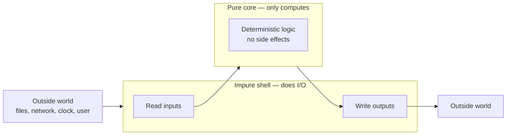

# Pure Functions & Referential Transparency — Junior Level

> **Roadmap:** [Functional Programming](../README.md) → Pure Functions & Referential Transparency
>
> *A pure function is a vending machine: the same coin always gives you the same snack, and nothing else in the world changes when you press the button. That single discipline — same input → same output, no surprises — is what makes functional code easy to test, easy to reason about, and safe to cache.*

---

## Table of Contents

1. [Introduction](#introduction)
2. [Prerequisites](#prerequisites)
3. [Glossary](#glossary)
4. [Core Concept 1 — What Is a Pure Function?](#core-concept-1--what-is-a-pure-function)
5. [Core Concept 2 — Side Effects](#core-concept-2--side-effects)
6. [Core Concept 3 — Referential Transparency](#core-concept-3--referential-transparency)
7. [Pure vs Impure — Side by Side](#pure-vs-impure--side-by-side)
8. [Why It Matters](#why-it-matters)
9. [The Pure Core / Impure Shell Mental Model](#the-pure-core--impure-shell-mental-model)
10. [Common Mistakes](#common-mistakes)
11. [Test Yourself](#test-yourself)
12. [Cheat Sheet](#cheat-sheet)
13. [Summary](#summary)
14. [Further Reading](#further-reading)
15. [Related Topics](#related-topics)

---

## Introduction

> Focus: **What is a pure function, and why should you care?**

You already write functions every day. This topic adds one question you can ask about *any* function: **"Is it pure?"** The answer changes how much you can trust that function — whether you can test it in one line, reuse it without fear, cache its result, or hand it to ten threads at once.

A function is **pure** when it satisfies two rules:

1. **Deterministic** — given the same inputs, it *always* returns the same output. No exceptions, no "it depends on the time / the database / a random number."
2. **No side effects** — calling it changes nothing outside itself. It doesn't write to a file, print to the screen, mutate a global, send a network request, or modify the arguments you passed in.

That's the whole definition. Everything else in this file is a consequence of those two rules.

> **The mindset shift:** an impure function is a *story* — to know what it does you have to know the state of the world when it runs. A pure function is a *fact* — `add(2, 3)` is `5`, today, tomorrow, on any machine, in any order. Facts are far easier to build software out of than stories.

Functional programming doesn't ban side effects — a program with zero effects can't even print "hello." The goal is to **push effects to the edges** and keep the *core logic* pure, so that the part of your program that holds the real decisions is the part that's easiest to trust.

---

## Prerequisites

- **Required:** You can read and write functions, variables, and conditionals in at least one language (examples here use Go, Java, and Python).
- **Required:** You understand the difference between a function's **arguments** (what goes in) and its **return value** (what comes out).
- **Helpful:** You've been bitten at least once by a "spooky" bug — code that worked yesterday, or worked alone but broke when called twice. Impurity is often the cause.
- **Helpful:** A first look at [First-Class & Higher-Order Functions](../01-first-class-and-higher-order-functions/junior.md), the previous topic — purity is what makes those functions safe to pass around.

---

## Glossary

| Term | Definition |
|------|-----------|
| **Pure function** | A function that is deterministic *and* has no side effects. Same input → same output, and nothing outside changes. |
| **Impure function** | Any function that breaks either rule — its output varies, or it touches the outside world. |
| **Deterministic** | Always produces the same result for the same inputs. The opposite is *non-deterministic* (depends on time, randomness, external state). |
| **Side effect** | Any observable change a function makes beyond returning a value: I/O, mutation, network, logging, throwing, changing globals. |
| **Referential transparency** | The property that an expression can be replaced by its computed value without changing the program's behavior. Pure functions create it. |
| **Mutation** | Changing a value in place (e.g. appending to a list you were given) rather than producing a new value. |
| **Memoization / caching** | Storing a function's result so repeated calls with the same input skip the work. Only safe for pure functions. |
| **Equational reasoning** | Understanding code by mentally substituting expressions for their values, like algebra. Enabled by referential transparency. |

---

## Core Concept 1 — What Is a Pure Function?

A pure function maps inputs to outputs and does *nothing else*. Picture a vending machine: insert a known coin, get a known snack. Press the same button with the same coin and you get the same snack — every single time. The machine doesn't also email your manager, repaint the wall, or give a different snack on Tuesdays.

Here is the canonical pure function in three languages:

```go
// Go — pure: output depends only on inputs; nothing outside changes.
func Add(a, b int) int {
    return a + b
}
```

```java
// Java — pure
int add(int a, int b) {
    return a + b;
}
```

```python
# Python — pure
def add(a, b):
    return a + b
```

Test purity with two questions:

1. **Determinism check:** If I call it twice with the same arguments, do I *always* get the same answer? `add(2, 3)` is `5` now and forever — yes.
2. **Side-effect check:** Does calling it leave any trace on the world — a printed line, a changed variable, a saved file, a network request? `add` returns and leaves no footprint — yes.

Pass both and the function is pure.

A pure function may use whatever it likes *internally* — local variables, loops, helper calls — as long as those stay private to the call. This one is still pure even though it mutates a local list, because nothing escapes:

```python
# Python — STILL pure: the mutation is on a private local, invisible from outside.
def squares(n):
    result = []          # local, created fresh each call
    for i in range(n):
        result.append(i * i)
    return result        # only the value leaves; no external state touched
```

`squares(3)` is `[0, 1, 4]` every time, and calling it changes nothing else. Pure.

---

## Core Concept 2 — Side Effects

A **side effect** is anything a function does that is observable *outside* of returning a value. The common ones:

| Side effect | Example |
|---|---|
| **I/O** | Printing, reading/writing files, console output |
| **Network** | HTTP requests, database queries |
| **Mutating shared state** | Changing a global, a field, or a passed-in argument |
| **Reading changing state** | Reading the clock, a random source, env vars, the DB |
| **Throwing exceptions** | Exiting via an error instead of returning a value |

Each of these breaks purity, and most break it twice (an HTTP call is both non-deterministic *and* a side effect).

```go
// Go — IMPURE: prints (I/O side effect) AND its output depends on the clock.
func Greet(name string) string {
    fmt.Println("greeting " + name)          // side effect: I/O
    return name + " at " + time.Now().String() // non-deterministic: clock
}
```

```python
# Python — IMPURE: mutates the argument the caller still owns.
def add_item(cart, item):
    cart.append(item)   # side effect: caller's list is changed underneath them
    return cart
```

That last one is the sneaky one for juniors. The pure version returns a **new** value and leaves the input untouched:

```python
# Python — pure: produce a new list; don't touch the caller's.
def add_item(cart, item):
    return cart + [item]   # new list; original 'cart' is unchanged
```

The difference is the entire game. With the impure version, calling `add_item` *reaches back* into the caller's data and rewrites it. With the pure version, the function only answers a question — *"what would the cart look like with this item added?"* — and the caller decides what to do with the answer.

> A useful slogan: **a pure function takes a snapshot and returns a new snapshot. It never edits the photo you handed it.**

---

## Core Concept 3 — Referential Transparency

**Referential transparency** is the payoff of purity, stated as a property of *expressions*:

> An expression is **referentially transparent** if you can replace it with its computed value without changing how the program behaves.

If `add(2, 3)` always equals `5`, then anywhere `add(2, 3)` appears you can substitute `5`. The program means exactly the same thing. That's algebra — the same move you make when you rewrite `x + 0` as `x`.

```python
# Pure → referentially transparent.
total = add(2, 3) + add(2, 3)
# We may freely rewrite this as:
total = 5 + 5
# ...or even:
x = add(2, 3)
total = x + x      # all three versions behave identically
```

Now watch it break with an impure function:

```python
import random

def roll():
    return random.randint(1, 6)   # impure: non-deterministic

total = roll() + roll()      # two different dice
# NOT the same as:
x = roll()
total = x + x                # one die counted twice — different behavior!
```

You **cannot** substitute `roll()` with a single value, because it isn't *a* value — it's a different value each time. The expression is **referentially opaque**. The moment a function is impure, this safe substitution is gone, and with it the ability to reason about code by simple replacement.

> **Why the fancy name matters:** referential transparency is just the formal way of saying *"this expression is a dependable stand-in for its result."* It's what lets you — and the compiler, and a caching layer — treat code like math.

A brief **Haskell** aside, because the pure language makes the idea vivid: in Haskell *every* function is pure by default, so `add 2 3` is genuinely interchangeable with `5` everywhere, always. To do I/O at all, Haskell makes the effect part of the *type* (`IO`), so the type system itself tracks where purity ends. You don't need Haskell to use these ideas — Go, Java, and Python let you write pure functions freely — but Haskell is what they look like when purity is the rule instead of a choice.

---

## Pure vs Impure — Side by Side

The same intent, written both ways, in each language. Read the impure column and ask the two questions; you'll find each one fails.

```java
// Java — IMPURE: depends on a mutable field; mutates it too.
class Counter {
    private int count = 0;
    int next() { return ++count; }   // different result each call; mutates state
}

// Java — pure version: state goes in and comes out explicitly.
int next(int count) { return count + 1; }   // same input → same output, no mutation
```

```go
// Go — IMPURE: reads an external, changing source.
var rate float64 = 0.2

func WithTax(price float64) float64 {
    return price * (1 + rate)   // answer changes if global 'rate' is edited elsewhere
}

// Go — pure: the dependency becomes a parameter.
func WithTax(price, rate float64) float64 {
    return price * (1 + rate)   // fully determined by its inputs
}
```

```python
# Python — IMPURE: result depends on "now".
from datetime import date
def is_expired(expiry):
    return expiry < date.today()   # answer depends on when you call it

# Python — pure: pass the moment in.
def is_expired(expiry, today):
    return expiry < today          # deterministic; testable with any 'today'
```

Notice the recurring fix: **turn a hidden dependency into an explicit parameter.** The clock, the global, the field — each becomes an argument. The function stops asking the world "what time is it?" and instead is *told* the answer. That one move is how most impure functions become pure.

A quick sorting table for any function you meet:

| If it... | Then it's... | Because |
|---|---|---|
| Returns the same output for the same input, every time | a candidate for pure | deterministic |
| Reads the clock / random / a DB / a global | impure | non-deterministic |
| Prints, logs, writes a file, sends a request | impure | side effect (I/O) |
| Changes an argument or a shared variable | impure | side effect (mutation) |
| Only computes and returns a value | **pure** | both rules hold |

---

## Why It Matters

Purity isn't an aesthetic preference. It buys four concrete things you feel as a working engineer.

### 1. Testability

A pure function is the easiest thing in software to test: feed inputs, assert the output. No mocks, no database, no clock to freeze, no setup or teardown.

```python
# Testing a pure function — one line, no fixtures.
assert add(2, 3) == 5
assert with_tax(100, 0.2) == 120
```

Testing an *impure* function means recreating its world — spin up a DB, stub the network, fake the clock, reset globals between tests. That cost is exactly why teams push logic into pure functions: the part you most need to test becomes the part that's trivial to test.

### 2. Reasoning (equational reasoning)

Because pure expressions can be substituted for their values, you can understand code locally — read a function in isolation and *know* what it does without tracing the whole program's state. You debug by substitution, like simplifying an equation, instead of stepping through a running machine in your head.

### 3. Caching & memoization

If a function is pure, its result depends only on its inputs — so you can **store the result** and skip the work next time. Same input, same answer, guaranteed.

```python
# Python — safe ONLY because the function is pure.
from functools import lru_cache

@lru_cache
def fib(n):
    return n if n < 2 else fib(n - 1) + fib(n - 2)
```

Try to cache an impure `roll()` and you'd return the *same die* forever — a bug. Caching is correct precisely when referential transparency holds.

### 4. Concurrency safety

A pure function shares nothing and mutates nothing, so two threads can call it at the same time with zero coordination — no locks, no races. The hardest bugs in concurrent code come from shared mutable state; pure functions have none. (More in [Concurrency](../../../language-internals/concurrency-async-parallel/concurrency/README.md).)

> **The through-line:** every one of these benefits is the same fact viewed from a different angle. "Same input → same output, no side effects" is *what makes a result safe to predict, substitute, store, and share.* That's why this one small property earns its own roadmap topic.

---

## The Pure Core / Impure Shell Mental Model

You can't write a useful program with zero effects — something must read input and print output. The functional answer is not to eliminate effects but to **organize** them: keep a large **pure core** of logic, wrapped in a thin **impure shell** that touches the outside world.



The shell gathers messy real-world data, hands plain values to the pure core, gets plain values back, and performs the effects. The decisions — the part that's worth testing and reasoning about — live in the pure core.

```python
# Shell: impure — reads the clock and prints. Tiny, dumb.
def main(orders):
    today = date.today()                       # effect: read clock
    report = build_report(orders, today)       # pure call
    print(report)                              # effect: I/O

# Core: pure — all the real logic, fully testable with no clock and no console.
def build_report(orders, today):
    overdue = [o for o in orders if o.due < today]
    return f"{len(overdue)} overdue out of {len(orders)}"
```

`build_report` is the brain and it's pure: pass any `today`, assert the string. The shell is so thin there's little left to break. At the junior level, just recognizing this split — *"effects at the edges, logic in the middle"* — is the goal. The full treatment is in [Effect Tracking](../10-effect-tracking/junior.md).

---

## Common Mistakes

Mistakes juniors make when first learning purity:

1. **Calling a function pure when it reads hidden state.** If it consults the clock, a random source, a global, or a field, it is *not* deterministic — even if it "doesn't change anything." Reading changing state breaks purity just as surely as writing does.
2. **Thinking "no `print`" means pure.** Mutating a passed-in list or a shared variable is a side effect too, even with zero I/O. Check for mutation, not just for output.
3. **Believing internal mutation makes a function impure.** A local variable or loop that never escapes the call is fine — `squares(n)` mutates a private list and is still pure. Purity is about what's *observable from outside*, not what happens inside.
4. **Trying to make everything pure.** A program with no effects does nothing. The goal is a pure *core*, not a pure program. Effects are necessary; just confine them to the shell.
5. **Caching an impure function.** Memoizing something that depends on time or randomness returns stale or wrong results. Caching is only safe when referential transparency holds.
6. **Confusing "returns a new value" with "modifies in place."** `cart + [item]` (pure) and `cart.append(item)` (impure) look similar and behave completely differently for the caller. Prefer producing new values over editing inputs.

---

## Test Yourself

1. State the two rules a function must satisfy to be pure.
2. Is this function pure? Why or why not?
   ```python
   def double(x):
       return x * 2
   ```
3. Is this function pure? Why or why not?
   ```go
   func LogAndAdd(a, b int) int {
       fmt.Println(a, b)
       return a + b
   }
   ```
4. Define **referential transparency** in your own words, and explain why `roll() + roll()` (a dice roll) is *not* referentially transparent.
5. This function mutates a list internally. Is it pure?
   ```python
   def sorted_copy(xs):
       result = list(xs)   # private copy
       result.sort()       # mutates the local copy only
       return result
   ```
6. Name one concrete benefit you get *because* a function is pure, and explain the connection.
7. Make this pure by removing its hidden dependency:
   ```python
   from datetime import date
   def days_left(expiry):
       return (expiry - date.today()).days
   ```

<details>
<summary>Answers</summary>

1. **(1) Deterministic** — same inputs always give the same output; **(2) No side effects** — it changes nothing outside itself (no I/O, mutation, network, globals).
2. **Pure.** `double(4)` is `8` every time (deterministic) and it touches nothing outside (no side effects). Both rules hold.
3. **Impure.** It satisfies determinism (`a + b` is consistent) but `fmt.Println` is an I/O side effect. Breaking *either* rule makes it impure.
4. **Referential transparency** means an expression can be replaced by its computed value without changing the program's behavior. `roll() + roll()` isn't transparent because `roll()` returns a *different* value each call, so you can't substitute it with any single number — `x = roll(); x + x` behaves differently (one die counted twice) from `roll() + roll()` (two dice).
5. **Pure.** The mutation is on a *private local copy* (`result`), not on the caller's `xs`. Same input always yields the same sorted output, and nothing observable from outside changes. Internal mutation that never escapes is fine.
6. Any one of: **Testability** — feed inputs, assert output, no setup/mocks, because the result depends only on inputs. **Equational reasoning** — substitute the expression for its value to understand code locally. **Caching** — store results by input, safe because the answer never varies. **Concurrency** — call from many threads without locks, because there's no shared mutable state.
7. Turn the clock into a parameter:
   ```python
   def days_left(expiry, today):
       return (expiry - today).days   # deterministic; testable with any 'today'
   ```

</details>

---

## Cheat Sheet

| Question to ask | If "yes"... |
|---|---|
| Same input → same output, always? | deterministic ✓ |
| Reads clock / random / DB / global? | **impure** (non-deterministic) |
| Prints / logs / writes file / sends request? | **impure** (I/O side effect) |
| Mutates an argument or shared variable? | **impure** (mutation side effect) |
| Only computes and returns a value? | **pure** ✓ |

| Concept | One-liner |
|---|---|
| **Pure function** | Deterministic + no side effects. A *fact*, not a *story*. |
| **Side effect** | Any observable change beyond the return value. |
| **Referential transparency** | An expression can be replaced by its value. The payoff of purity. |
| **The fix** | Turn hidden dependencies (clock, global, field) into explicit parameters. |
| **The architecture** | Pure core (logic) + impure shell (effects at the edges). |

> **One rule to remember:** *push effects to the edges, keep the logic pure — that's the part you most need to test and trust.*

---

## Summary

- A **pure function** obeys two rules: it is **deterministic** (same input → same output) and has **no side effects** (it changes nothing outside itself).
- **Side effects** include I/O, network, mutation of shared or passed-in data, reading changing state (clock, random, DB), and throwing. Reading hidden state breaks purity just like writing does.
- **Referential transparency** is the payoff: a pure expression can be replaced by its value, so you can reason about code like algebra. Impurity destroys this — you can't substitute a value for something that changes each call.
- Purity buys four concrete wins: **testability** (no mocks), **reasoning** (local, by substitution), **caching** (safe memoization), and **concurrency** (no shared state). All four are the same property seen from different angles.
- You don't make the *whole program* pure — you keep a **pure core** of logic wrapped in a thin **impure shell** that handles effects. The common fix is to turn a hidden dependency into an explicit parameter.
- Next: [`middle.md`](middle.md) — recognizing subtle impurity, refactoring real code toward purity, and the cost/benefit trade-offs in production.

---

## Further Reading

- **Structure and Interpretation of Computer Programs** — Abelson & Sussman — the substitution model of evaluation, which *is* referential transparency.
- **Functional Programming in Scala** — Chiusano & Bjarnason — Chapter 1 on what purity is and why it matters ("the red book").
- **Why Functional Programming Matters** — John Hughes (1990) — the classic argument for building from pure, composable pieces.
- **Out of the Tar Pit** — Moseley & Marks (2006) — on accidental complexity, much of it caused by uncontrolled state and effects.

---

## Related Topics

- [First-Class & Higher-Order Functions](../01-first-class-and-higher-order-functions/junior.md) — purity is what makes functions safe to pass around as values.
- [Immutability](../03-immutability/junior.md) — the data-side companion to purity; not mutating inputs is half of being pure.
- [Effect Tracking](../10-effect-tracking/junior.md) — the full pure-core / impure-shell pattern this file previews.
- [Clean Code → Pure Functions](../../clean-code/15-pure-functions/README.md) — the everyday-code chapter on writing pure functions.
- [Clean Code → Async & Functional](../../clean-code/12-async-and-functional/README.md) — functional style in day-to-day code.
- [Concurrency](../../../language-internals/concurrency-async-parallel/concurrency/README.md) — why pure functions are safe to run in parallel.
