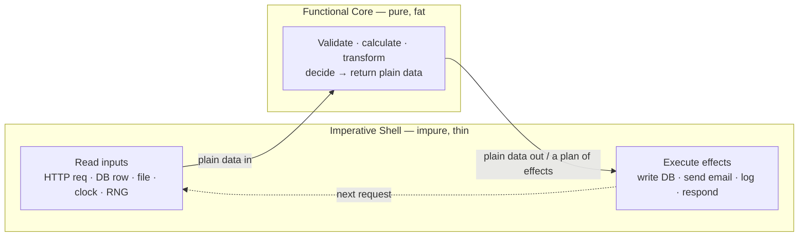

# Pure Functions & Referential Transparency — Middle Level

> **Roadmap:** [Functional Programming](../README.md) → Pure Functions & Referential Transparency
>
> *Knowing what a pure function is buys you nothing. Knowing where to put the impure 5% of your program — and keeping the other 95% pure on purpose — is the skill that pays.*

---

## Table of Contents

1. [Introduction](#introduction)
2. [Prerequisites](#prerequisites)
3. [Functional Core, Imperative Shell](#functional-core-imperative-shell)
4. [Making Functions Pure: The Five Techniques](#making-functions-pure-the-five-techniques)
5. [The Payoffs: Memoization, Testing, Parallelism](#the-payoffs-memoization-testing-parallelism)
6. [Trade-offs: When Purity Costs More Than It Saves](#trade-offs-when-purity-costs-more-than-it-saves)
7. [A Haskell Aside: Purity Enforced by the Type System](#a-haskell-aside-purity-enforced-by-the-type-system)
8. [Common Mistakes](#common-mistakes)
9. [Test Yourself](#test-yourself)
10. [Cheat Sheet](#cheat-sheet)
11. [Summary](#summary)
12. [Further Reading](#further-reading)
13. [Related Topics](#related-topics)

---

## Introduction

> Focus: **using purity well in real code.**

At the junior level you learned the definition: a **pure function** depends only on its arguments, returns only through its return value, and has no observable side effects — so calling it with the same inputs always yields the same output (**referential transparency**: the call can be replaced by its result without changing the program's meaning).

That definition is true and useless on its own, because **real programs must read files, hit databases, log, fetch the time, and talk to networks** — all of which are impure by definition. The naive conclusion ("I can't make my program pure, so why bother?") is the wrong one.

The middle-level insight is that purity is not all-or-nothing. It is a **boundary you draw on purpose.** You push the unavoidable impurity to the *edges* of the system — a thin outer layer that reads inputs and writes outputs — and keep the *decision-making* in the middle pure. The decisions are where bugs hide, where logic is complex, and where tests pay off. The edges are simple and few. This is the **functional core, imperative shell** pattern, and learning to apply it is the entire content of this file.

---

## Prerequisites

- **Required:** You can read [`junior.md`](junior.md) — you can spot a side effect and explain referential transparency in your own words.
- **Required:** You've written enough code to have *debugged* something whose behavior changed between runs for no obvious reason (a shared cache, a global, a clock).
- **Helpful:** Comfort with [first-class & higher-order functions](../01-first-class-and-higher-order-functions/middle.md) — injecting behavior as an argument is the main tool here.
- **Helpful:** Basic [dependency injection](../../clean-code/15-pure-functions/README.md) vocabulary — "pass the collaborator in, don't construct it inside."
- **Helpful:** You write tests and have felt the pain of mocking.

---

## Functional Core, Imperative Shell

The pattern (named by Gary Bernhardt) splits a program into two layers with different rules:

- **Functional core** — pure functions that take data and return data. All the *logic*: validation, calculation, transformation, decision-making. No I/O, no clock, no randomness, no mutation of shared state. Easy to test, easy to reason about, safe to run in parallel.
- **Imperative shell** — a thin outer layer that performs I/O: reads requests, queries databases, calls the core, then writes the results out. It contains *no interesting logic* — just plumbing. It's hard to unit-test, but there's barely anything to test.

The shell **gathers inputs**, hands plain data to the core, gets plain data back, and **executes the effects** the core decided on.



The shape to internalize: **inputs flow in from the edge, decisions happen in the pure middle, effects flow back out to the edge.** Notice the core never *performs* the database write — it *returns a description* of what should be written, and the shell carries it out.

### A concrete before/after (Python)

```python
# ❌ Tangled: logic and I/O interleaved. Impossible to test without a real DB
#    and SMTP server; behavior depends on time-of-call.
def process_signup(email, db, mailer):
    if "@" not in email:
        raise ValueError("bad email")
    if db.exists(email):                    # I/O in the middle of logic
        raise ValueError("duplicate")
    user = {"email": email,
            "created": datetime.now()}      # hidden clock dependency
    db.insert(user)                         # I/O
    mailer.send(email, "Welcome!")          # I/O
    return user
```

```python
# ✅ Split. The decision is pure; the shell does the I/O around it.

# --- functional core: data in, data out, no I/O, time passed in ---
def decide_signup(email, already_exists, now):
    if "@" not in email:
        return Rejected("bad email")
    if already_exists:
        return Rejected("duplicate")
    user = {"email": email, "created": now}
    return Accepted(user, welcome_email=(email, "Welcome!"))

# --- imperative shell: gather inputs, run core, execute the plan ---
def process_signup(email, db, mailer, clock):
    outcome = decide_signup(email, db.exists(email), clock.now())
    if isinstance(outcome, Rejected):
        raise ValueError(outcome.reason)
    db.insert(outcome.user)                 # effect, decided by the core
    mailer.send(*outcome.welcome_email)     # effect, decided by the core
    return outcome.user
```

`decide_signup` is now a pure function. Testing every business rule — bad email, duplicate, the exact `created` timestamp, the welcome-email contents — needs **no database, no SMTP, no mocks, and no clock**. You call a function with plain values and assert on the returned value. The shell is four lines of obvious plumbing.

---

## Making Functions Pure: The Five Techniques

Most impurity is incidental, not essential. Here are the recurring moves that turn an impure function pure. Each is "pull the effect out, pass the result in."

### 1. Inject dependencies instead of constructing them

A function that reaches out to build its own collaborators (a DB client, an HTTP client) is impure and untestable. **Pass collaborators in** so the caller — the shell — owns them.

```go
// ❌ impure: constructs and calls a real dependency inside
func TaxOwed(orderID string) float64 {
    db := sql.Open(...)                 // hidden I/O + hidden config
    o := loadOrder(db, orderID)
    return o.Subtotal * rateFor(o.Region)
}

// ✅ pure: the order is data passed in; the rate table is data passed in
func TaxOwed(o Order, rates map[string]float64) float64 {
    return o.Subtotal * rates[o.Region]
}
```

The shell does the `loadOrder`; the core does the arithmetic. Same inputs → same output, forever.

### 2. Return data instead of mutating

Mutating an argument or shared state is a side effect. **Build and return a new value** instead.

```python
# ❌ mutates the caller's list — caller's data silently changes
def apply_discount(cart, pct):
    for item in cart:
        item["price"] *= (1 - pct)        # in-place mutation

# ✅ returns new items, leaves the input untouched
def apply_discount(cart, pct):
    return [{**item, "price": item["price"] * (1 - pct)} for item in cart]
```

The pure version is referentially transparent: `apply_discount(cart, 0.1)` can be substituted by its result anywhere, and the original `cart` is still valid for other readers — which is exactly what makes it safe to share across threads (see [Immutability](../03-immutability/middle.md)).

### 3. Pass time in, don't read the clock

`now()` is the most common purity leak: it returns a different value every call, so any function that reads it is non-deterministic and a nightmare to test (you can't assert on "whatever time it is").

```java
// ❌ impure: reads the wall clock; test must freeze time or sleep
boolean isExpired(Token t) {
    return t.expiry().isBefore(Instant.now());
}

// ✅ pure: "now" is an argument; the shell supplies Instant.now()
boolean isExpired(Token t, Instant now) {
    return t.expiry().isBefore(now);
}
```

Testing the boundary is now trivial: `isExpired(token, token.expiry())`, `isExpired(token, token.expiry().plusSeconds(1))`. No clock-mocking library required. The same move applies to "today's date," timeouts, and TTLs.

### 4. Pass randomness in, don't generate it

Randomness is non-determinism by design. Inject the random value (or a seeded generator) so the core stays pure and testable; let the shell pull the entropy.

```python
# ❌ impure: result differs every call; can't assert on the outcome
def assign_bucket(user_id):
    return "A" if random.random() < 0.5 else "B"

# ✅ pure: the roll is supplied; tests pass an exact value
def assign_bucket(user_id, roll):          # roll in [0, 1)
    return "A" if roll < 0.5 else "B"
# shell: assign_bucket(uid, random.random())
```

Now you can test the boundary exactly (`roll=0.49 → "A"`, `roll=0.50 → "B"`) and reproduce any "random" bug by replaying the roll that caused it.

### 5. Return a description of effects, not the effect

When the *decision* about an effect is logic but *performing* it is I/O, split them: the core returns a **plain-data plan** (an event, a command, a list of writes), and the shell interprets it. This is what `decide_signup` did with `welcome_email`. It scales: the core can return `[InsertUser(u), SendEmail(...), Log("signup", u.id)]` and the shell loops over the list executing each. The logic that *chose* those effects is fully testable; only the trivial executor is impure.

> **The unifying idea:** every technique replaces *"the function fetches an impure value"* with *"the caller passes the value in."* Impurity doesn't vanish — it gets **lifted up and out** to the single layer that's allowed to have it.

---

## The Payoffs: Memoization, Testing, Parallelism

Purity isn't an aesthetic preference; it unlocks three concrete capabilities that impure code simply cannot offer.

### Memoization comes for free

Referential transparency says the same inputs always produce the same output — which means the result can be **cached by its inputs** with zero risk of staleness. You can wrap *any* pure function in a cache without reading its body or worrying about invalidation, because the answer can never change.

```python
from functools import lru_cache

@lru_cache(maxsize=None)            # safe ONLY because the function is pure
def fib(n):
    return n if n < 2 else fib(n - 1) + fib(n - 2)
```

```java
// Java: memoize a pure function with a ConcurrentHashMap
private final Map<Integer, Long> cache = new ConcurrentHashMap<>();
long fib(int n) {
    if (n < 2) return n;
    return cache.computeIfAbsent(n, k -> fib(k - 1) + fib(k - 2));
}
```

Try this on an *impure* function — say one that reads the clock or a database — and the cache hands back yesterday's answer. Memoization is correct **if and only if** the function is pure. This is referential transparency cashed out as a performance feature.

### Testing needs no mocks

A pure function's entire contract is *(inputs) → output*. To test it you supply inputs and assert on the output. There is nothing to mock, stub, or spy on, because there are no collaborators to fake — they were all lifted into the shell.

```python
# Pure-core tests: arrange = literal data, act = call, assert = compare. Done.
def test_duplicate_is_rejected():
    out = decide_signup("a@b.com", already_exists=True, now=FIXED_TIME)
    assert out == Rejected("duplicate")

def test_created_timestamp_uses_supplied_now():
    out = decide_signup("a@b.com", already_exists=False, now=FIXED_TIME)
    assert out.user["created"] == FIXED_TIME
```

These tests are **fast** (no I/O), **deterministic** (no clock/RNG/network flakiness), and **clear** (the whole world is visible in the arguments). Purity is also the precondition for [property-based testing](../../clean-code/15-pure-functions/README.md): you can only assert "for all inputs, this property holds" about a function whose output depends solely on its inputs. The mocking you *don't* have to write is the strongest day-to-day argument for the functional core.

### Parallelism is safe by construction

The classic source of concurrency bugs — data races — requires *shared mutable state*. A pure function reads its inputs and writes only its return value; it mutates nothing shared, so two threads can run it on different data simultaneously with no locks, no race conditions, and no ordering hazards.

```python
from concurrent.futures import ProcessPoolExecutor

# Safe to fan out precisely because score() is pure: no shared mutable state.
with ProcessPoolExecutor() as pool:
    scores = list(pool.map(score, candidates))
```

```go
// Go: pure transform per item, run concurrently with no mutex needed
results := make([]Result, len(items))
var wg sync.WaitGroup
for i, it := range items {
    wg.Add(1)
    go func(i int, it Item) {
        defer wg.Done()
        results[i] = transform(it)   // pure: writes only its own slot
    }(i, it)
}
wg.Wait()
```

There's no mutex on `results` because each goroutine writes a distinct index and `transform` touches no shared state. The moment `transform` mutated a shared map or read a shared counter, you'd need synchronization and you'd be back in race-condition territory. **Purity is what makes "just parallelize it" actually safe.** (See [Concurrency](../../../language-internals/concurrency-async-parallel/concurrency/README.md) for the full picture.)

---

## Trade-offs: When Purity Costs More Than It Saves

Purity is a powerful default, not a religion. The middle-level skill includes knowing its limits.

**I/O has to happen somewhere.** A program that only computes pure functions and never performs an effect is a program that does nothing observable. The goal is never "100% pure" — it's "as pure as possible, with effects concentrated in a thin, obvious shell." Don't feel you've failed because the shell exists; the shell is the *point* of the split.

**Some things are inherently effectful — don't fight it.** Reading user input, generating a UUID, getting the current time: these are essential effects. The win isn't eliminating them, it's *isolating* them so they appear once, at the edge, instead of being smeared through the logic.

**Threading state through arguments can get noisy.** Passing `now`, `roll`, and three injected collaborators through every function can feel like boilerplate, and deep call chains may have to forward values they don't use. Mitigations: bundle related dependencies into a small context object; keep the pure core *shallow* so values don't travel far; and at the senior level, [effect systems / the IO monad](../10-effect-tracking/middle.md) formalize this threading so it disappears.

**Copy-instead-of-mutate has a cost.** Returning new values instead of mutating allocates, and in hot loops over large structures that allocation can matter. The answer is usually [persistent data structures with structural sharing](../03-immutability/middle.md), not abandoning purity — but in genuinely performance-critical inner loops, a localized, *encapsulated* mutation (whose impurity doesn't escape the function) is a legitimate optimization. A function that mutates only its own locals and returns a value is still observationally pure.

**Purity doesn't make wrong logic right.** A pure function can compute the wrong answer deterministically. Purity buys you *testability and reasoning*; correctness still requires good tests and clear thinking.

> **Rule of thumb:** push effects out until pushing further would create more complexity than it removes — then stop. The boundary's job is to be *clear*, not to be at the absolute outermost millimeter.

---

## A Haskell Aside: Purity Enforced by the Type System

In Go, Java, and Python, "keep the core pure" is a **discipline** — nothing stops you from sneaking a `print` or a DB call into a "pure" function; only review and tests catch it. Haskell makes the boundary a **law the compiler enforces.**

In Haskell, a function's type tells you whether it can perform effects. A function typed `Int -> Int` *cannot* do I/O — there is no way to read a file or print inside it; the type system forbids it. Any effect must live in the `IO` type:

```haskell
double :: Int -> Int           -- guaranteed pure: cannot touch the outside world
double x = x * 2

greet  :: String -> IO ()      -- the IO tag marks it as effectful
greet name = putStrLn ("Hi " ++ name)
```

The `IO` in `greet`'s type is exactly the "imperative shell" made visible and checkable. The functional core / imperative shell pattern that you apply *by convention* in mainstream languages is, in Haskell, the *default the compiler insists on*. You can't accidentally blur the line. That's the same idea this whole file teaches — Haskell just refuses to compile the version where you got it wrong. (More in [Effect Tracking](../10-effect-tracking/middle.md) and [Monads — Plain English](../09-monads-plain-english/middle.md).)

---

## Common Mistakes

1. **"My program can't be pure because it does I/O."** Wrong target. The goal is a pure *core* with a thin impure *shell*, not a pure *whole*. Effects belong at the edge, not nowhere.
2. **Hidden clock and RNG reads.** A function that looks pure but calls `now()`/`random()` internally is non-deterministic and untestable. Pass time and randomness in as arguments.
3. **Mutating an argument and also returning it.** Returning `self`/the input after mutating it *looks* functional but isn't — callers who still hold the old reference get surprised. Return a *new* value and leave inputs untouched.
4. **Constructing dependencies inside the function.** `db := connect()` inside the body makes the function impure and forces real infrastructure (or heavy mocks) into every test. Inject collaborators from the shell.
5. **Performing the effect in the core instead of returning a plan.** When the *decision* is logic, return data describing the effect and let the shell execute it; don't do the DB write inside the function you want to keep pure.
6. **Caching an impure function.** Memoizing something that reads the clock/DB serves stale results. Memoization is correct only for pure functions.
7. **Treating purity as all-or-nothing.** Refusing to ship until everything is pure leads to paralysis; allowing impurity to leak everywhere defeats the purpose. Draw the boundary, then keep it.
8. **Calling locally-encapsulated mutation "impure."** A function that mutates only its own locals and shares nothing is observationally pure — that's a valid optimization, not a violation.

---

## Test Yourself

1. A teammate says "we do database access, so functional core / imperative shell doesn't apply to us." What's the flaw in that reasoning, and how would you actually structure such a service?
2. `discount(cart)` reads `datetime.now()` to check whether a sale is active. Name two problems this causes and rewrite the signature to fix them.
3. Why is it safe to wrap a pure function in `lru_cache` but dangerous to wrap an impure one? Give a concrete failure for the impure case.
4. You have `assign_bucket(user_id)` returning `"A"`/`"B"` via `random.random()`. Make it pure, and explain how the change helps both testing and reproducing a reported bug.
5. Why can pure functions be parallelized without locks, while impure ones often need synchronization? What specific property of impurity creates the hazard?
6. Give one situation where a localized in-place mutation is acceptable inside an otherwise pure function, and explain why it doesn't break referential transparency.

<details>
<summary>Answers</summary>

1. The flaw is conflating "the program does I/O" with "no part of the program can be pure." DB access is an *effect* you push to the shell: the shell reads the rows, hands plain data to a pure core that makes all the decisions, gets plain data (or a plan of writes) back, and the shell performs the writes. The logic — the part worth testing — stays pure even though the system as a whole does I/O.
2. (a) It's **non-deterministic** — the same cart yields different totals depending on when you call it, so tests are flaky and can't assert a fixed result. (b) It **hides a dependency** — readers can't see that the result depends on time. Fix: `discount(cart, now)` — pass the timestamp in; the shell supplies `datetime.now()`, and tests supply a fixed value to check both inside and outside the sale window.
3. A pure function's output depends only on its inputs, so a cached result can never become stale — referential transparency guarantees the answer is still correct. An impure function's output can change between calls, so the cache serves a value that's now wrong. Concrete failure: memoizing `current_exchange_rate()` returns Monday's rate forever; or memoizing `is_token_expired(t)` (which reads the clock) caches "not expired" and keeps reporting that after the token actually expires.
4. `assign_bucket(user_id, roll)` with the roll passed in (`roll = random.random()` lives in the shell). Testing: you assert exact boundaries (`roll=0.49 → "A"`, `roll=0.50 → "B"`) with no RNG. Reproducing a bug: capture/log the roll that triggered the bad assignment and replay that exact value in a test — impossible when the randomness is generated internally.
5. Data races require *shared mutable state*. A pure function mutates nothing shared — it reads its inputs and writes only its return value — so concurrent calls on different data can't interfere; no locks needed. An impure function that writes a shared variable/map/counter creates exactly the shared-mutable-state condition that two threads can corrupt, forcing synchronization. The hazardous property is **shared mutation**, which purity forbids.
6. Building a result by mutating a *local* buffer/accumulator and then returning it — e.g., filling a local slice in a loop and returning it. It's fine because the mutation never escapes the function: no caller observes intermediate states and no shared state is touched, so from the outside the function is still (same inputs → same output) with no observable side effect. Referential transparency is about *observable* behavior, and locally-scoped mutation is unobservable.

</details>

---

## Cheat Sheet

| Impurity you found | Technique | What the core gets instead |
|---|---|---|
| Builds its own DB/HTTP client | **Inject dependencies** | Plain data, or a collaborator passed in |
| Mutates an argument / shared state | **Return new data** | Inputs left untouched; a new value out |
| Reads `now()` / today's date | **Pass time in** | `now` as a parameter |
| Generates `random()` | **Pass randomness in** | A roll / seeded value as a parameter |
| Performs the effect itself | **Return a plan of effects** | Data describing what to do; shell executes |

| Payoff | Why purity enables it |
|---|---|
| **Memoization** | Same inputs → same output, so caching can never go stale |
| **Mock-free testing** | No collaborators in the core → nothing to mock; fast & deterministic |
| **Safe parallelism** | No shared mutation → no data races → no locks |

**Mental model:** *functional core (fat, pure, all the logic) wrapped in an imperative shell (thin, impure, all the I/O). Inputs flow in, decisions happen in the middle, effects flow out.*

**Golden rule:** *don't eliminate effects — lift them up and out to one thin layer that's allowed to have them.*

---

## Summary

- Purity is not all-or-nothing. The practical goal is a **functional core** (pure logic) wrapped in a thin **imperative shell** (all the I/O) — inputs flow in, decisions happen in the pure middle, effects flow out the edge.
- Most impurity is incidental and removable with five moves: **inject dependencies**, **return data instead of mutating**, **pass time in**, **pass randomness in**, and **return a plan of effects** for the shell to execute. Each replaces "the function fetches an impure value" with "the caller passes it in."
- Purity unlocks three concrete payoffs: **memoization** (safe caching, because results never go stale), **mock-free testing** (fast, deterministic, no collaborators to fake), and **safe parallelism** (no shared mutation → no data races → no locks).
- The trade-offs are real: I/O must happen somewhere, threading state can get noisy, and copy-instead-of-mutate has a cost — so push effects out until pushing further adds more complexity than it removes, then stop.
- In Go/Java/Python the boundary is a discipline you maintain by review and tests; in **Haskell** the type system enforces it, with `IO` marking exactly the shell. Same idea, compiler-checked.
- Next: [`senior.md`](senior.md) — formalizing the boundary with effect tracking, and reasoning about purity at the architecture level.

---

## Further Reading

- **Gary Bernhardt — "Boundaries" (talk, 2012)** — the canonical articulation of functional core / imperative shell.
- **Functional Programming in Scala** — Chiusano & Bjarnason — referential transparency, the substitution model, pushing effects to the edge.
- **Out of the Tar Pit** — Moseley & Marks (2006) — why state and effects are the dominant source of complexity, and how to minimize them.
- **Structure and Interpretation of Computer Programs** — Abelson & Sussman — the substitution model of evaluation, which *is* referential transparency.
- **Clean Code → Pure Functions** — [`../../clean-code/15-pure-functions/README.md`](../../clean-code/15-pure-functions/README.md) — the everyday-code framing of the same discipline.

---

## Related Topics

- [Pure Functions & Referential Transparency — junior.md](junior.md) — the definitions and side-effect spotting this file builds on.
- [Immutability](../03-immutability/middle.md) — return-new-data at scale: persistent structures and structural sharing.
- [First-Class & Higher-Order Functions](../01-first-class-and-higher-order-functions/middle.md) — injecting behavior and values as arguments, the main tool for making functions pure.
- [Effect Tracking](../10-effect-tracking/middle.md) — formalizing the core/shell boundary with the IO monad and effect systems.
- [Monads — Plain English](../09-monads-plain-english/middle.md) — how `IO` and friends make effects first-class values.
- [Clean Code → Async & Functional](../../clean-code/12-async-and-functional/README.md) — purity and effects in concurrent everyday code.
- [Concurrency](../../../language-internals/concurrency-async-parallel/concurrency/README.md) — why shared mutable state is the root of races that purity sidesteps.
