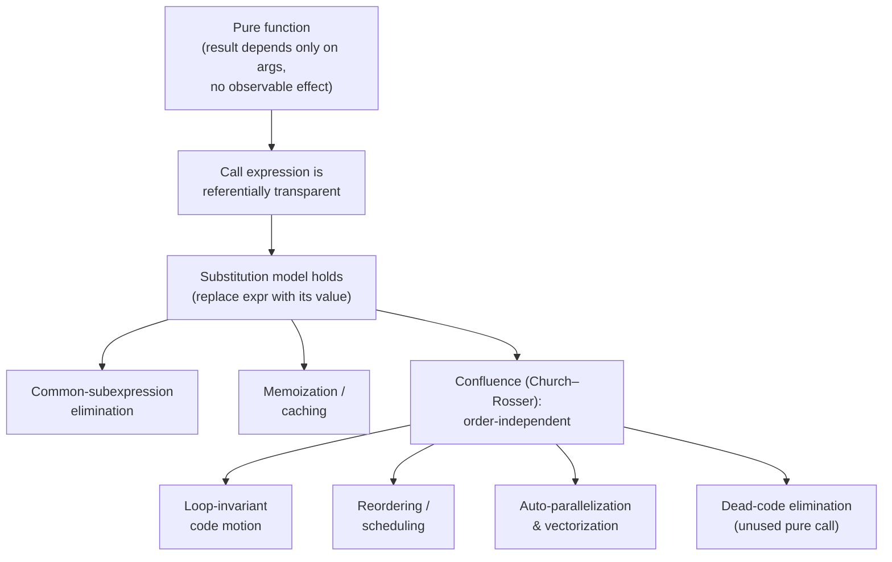

# Pure Functions & Referential Transparency — Professional Level

> **Roadmap:** [Functional Programming](../README.md) → Pure Functions & Referential Transparency
>
> *Purity is, first and last, a **correctness and reasoning** tool. The performance story is downstream: a pure function is one the compiler, the runtime, and you are all allowed to **substitute, reorder, cache, and parallelize** without changing the result — and that permission is what unlocks the optimizations.*

---

## Table of Contents

1. [Introduction](#introduction)
2. [Prerequisites](#prerequisites)
3. [Formal Semantics: What "Referentially Transparent" Actually Means](#formal-semantics-what-referentially-transparent-actually-means)
4. [Purity-Enabled Optimizations](#purity-enabled-optimizations)
5. [Why Mainstream Compilers Can't Assume Purity](#why-mainstream-compilers-cant-assume-purity)
6. [Memoization: Cost / Benefit](#memoization-cost--benefit)
7. [Measurement](#measurement)
8. [Strictness, Laziness, and the GHC Interplay](#strictness-laziness-and-the-ghc-interplay)
9. [Common Mistakes](#common-mistakes)
10. [Test Yourself](#test-yourself)
11. [Cheat Sheet](#cheat-sheet)
12. [Summary](#summary)
13. [Further Reading](#further-reading)
14. [Related Topics](#related-topics)

---

## Introduction

> Focus: the **formal meaning** of referential transparency (substitution / β-reduction / denotational semantics), the **specific compiler and runtime optimizations** purity unlocks, why JVM/Go/CPython mostly *can't* take them, and how to **measure** the wins — with the constant reminder that the wins are a side benefit of a property you adopt for *correctness*.

`junior.md` taught you what a side effect is. `middle.md` taught you to push effects to the edges. `senior.md` taught you to architect a pure core behind an impure shell. This file goes one layer down — to **semantics and the machine**.

The professional insight is twofold. First, "referential transparency" is not a vibe; it is a precise property — *an expression can be replaced by its value without changing the program's meaning* — and that precision is exactly what an optimizer (or a human refactorer) needs to license a transformation. Second, **most of the performance benefit attributed to "functional code" is not intrinsic** — pure code is not magically faster instruction-for-instruction. The speedups come from **enabled** optimizations (CSE, hoisting, memoization, reordering, parallelization) that purity makes *legal*. Take that framing seriously: if you reach for purity hoping for raw speed, you will be disappointed; if you reach for it to make code substitutable, the speed is a dividend you can then choose to collect.

> **The mental model:** a pure function is a value-to-value mapping with no hidden inputs and no hidden outputs. That contract is a *proof obligation discharged in advance* — it tells three parties (you, the compiler, the scheduler) "you may treat two calls with equal arguments as interchangeable." Every optimization in this file is a cash-out of that one guarantee.

---

## Prerequisites

- **Required:** Fluent with [`senior.md`](senior.md) — you can design a functional core / imperative shell and identify effects in real code.
- **Required:** Comfortable reading bytecode/assembly-level reasoning at a conceptual level: what "hoist a load out of a loop," "inline," and "devirtualize" mean.
- **Required:** You can run and read a microbenchmark (`benchstat`, JMH, `pyperf`/`timeit`) and tell signal from noise.
- **Helpful:** Basic lambda-calculus vocabulary (β-reduction, substitution) and a passing familiarity with Haskell's evaluation model.
- **Helpful:** big-o-analysis, profiling-techniques, caching-strategies skills for the measurement and trade-off vocabulary.

---

## Formal Semantics: What "Referentially Transparent" Actually Means

### Substitution and the substitution model

An expression `e` is **referentially transparent** if replacing `e` with its value `v` everywhere it occurs leaves the program's observable behavior unchanged. Equivalently: `e` *denotes* `v` — it has no other effect on the world that would make the substitution observable.

This is the **substitution model of evaluation** (SICP's term): to evaluate `f(g(x))`, you may evaluate `g(x)` to a value and substitute it. The model only holds if every subexpression is referentially transparent. The instant a subexpression reads a clock, mutates a global, or prints, substitution stops being sound — `now()` cannot be replaced by "the value it returned last time."

```python
# Referentially transparent: square(5) denotes 25, full stop.
def square(x): return x * x
# square(5) + square(5)  ==  25 + 25  ==  let y = square(5) in y + y   ✓ all equal

# NOT referentially transparent: now() denotes a different value each call.
import time
def now(): return time.time()
# now() + now()  ≠  let y = now() in y + y   ✗ the two are observably different
```

A function is **pure** when (a) its result depends *only* on its arguments (no hidden inputs: globals, clocks, I/O, randomness) and (b) it has no observable effect besides returning that result (no hidden outputs: mutation visible to callers, I/O, exceptions used as control flow over shared state). Purity of the function is what makes every *call expression* referentially transparent.

### β-reduction and the lambda calculus

In the lambda calculus, applying a function is **β-reduction**: `(λx. body) arg` reduces to `body` with `arg` substituted for `x`. The Church–Rosser theorem guarantees **confluence** — if an expression can be reduced in multiple orders, all terminating reduction orders reach the *same* normal form. That is the theoretical license for **reordering and parallel evaluation**: in a pure (effect-free) calculus, the order in which you reduce independent redexes cannot change the answer.

```text
(λx. x * x) 5        -- a redex
  →β  5 * 5          -- β-reduce: substitute 5 for x
  →    25            -- δ-reduce: apply the primitive *
```

Confluence is *the* reason an optimizer is allowed to evaluate `a` and `b` in `f(a, b)` in either order, in parallel, or to skip `b` entirely if it's unused. Effects break confluence: `print("a") + print("b")` has an observable order, so the calculus no longer lets you reorder.

There's a sharp subtlety worth internalizing: confluence guarantees all *terminating* reduction orders reach the same normal form — it says nothing about *termination itself*. Different strategies differ on whether they terminate at all. **Normal-order** (leftmost-outermost) reduction is the most likely to terminate (it's the basis of Haskell's laziness); **applicative-order** (evaluate arguments first, like most strict languages) can diverge where normal order would have produced a value, e.g. `(λx. 42) (loop)` returns `42` lazily but spins forever strictly. So purity buys you *equality of results when you get one*, and laziness can buy you *a result where strictness loops* — which is exactly why the strictness/laziness choice (below) is a real engineering lever, not a wash.

### Denotational semantics: a function *is* its graph

Denotational semantics assigns each program fragment a mathematical *denotation* — for a pure function, that denotation is simply a mathematical function (a set of input→output pairs), independent of how it's computed. Two pure functions with the same input/output graph are *equal* as denotations even if their code differs. This is the formal underpinning of **equational reasoning**: you can prove `map f . map g == map (f . g)` by showing both sides denote the same function, then have the compiler (or yourself) substitute the cheaper side. Impure code has no such clean denotation — its meaning must drag along the entire state of the world, which is why you can't reason about it equationally.

> **The chain that matters:** *purity* → call expressions are *referentially transparent* → the *substitution model* holds → *confluence* licenses reordering/parallelism → equal subexpressions are *interchangeable*. Every optimization below is one of these links cashed in.



---

## Purity-Enabled Optimizations

Each transformation below is *unsound* in general code and *sound* exactly when the relevant expressions are pure. The pattern repeats: **purity supplies the proof the optimizer needs.**

### 1. Common-subexpression elimination (CSE)

If `f` is pure, the two calls `f(x)` in `f(x) + f(x)` provably return the same value, so the compiler computes it once and reuses it. With an impure `f` (logging, a counter, a clock) the calls may differ, so CSE is illegal.

```c
// CSE is legal only because expensive() is pure:
//   y = expensive(a) + expensive(a);   →   t = expensive(a); y = t + t;
// If expensive() incremented a global, the two calls differ → no CSE.
```

### 2. Loop-invariant code motion (LICM / hoisting)

A pure call whose arguments don't change inside a loop can be **hoisted** out — computed once before the loop. With shared mutable state the compiler can't prove the call returns the same value each iteration, so it conservatively keeps it inside (the exact effect we saw destroy [LICM in spaghetti code](../../anti-patterns/01-development/01-bad-structure/professional.md)).

```python
# Hand-illustration of what an optimizer does when norm() is pure.
# Before — norm(config) recomputed every iteration:
for x in xs:
    y.append(x * norm(config))     # norm(config) is loop-invariant
# After — hoisted, because norm is pure and config is unchanged in the loop:
k = norm(config)
for x in xs:
    y.append(x * k)
```

CPython will *not* do this for you (no such optimizer pass); you hoist it by hand — and you can *only* hoist it by hand safely because you know `norm` is pure. That's purity paying off in a language whose compiler can't.

### 3. Reordering and scheduling

Confluence says independent pure subexpressions can be evaluated in any order. This lets a compiler reschedule instructions to fill pipeline slots and hide memory latency, and lets a build-graph or dataflow engine run independent pure stages in whatever order is convenient. Effects pin the order; purity frees it.

The scope of this is broader than instruction scheduling. **Build systems** (Bazel, Nix, `make`) treat each rule as a pure function of its inputs — given the same sources, the same output — which is what lets them reorder, parallelize, and *cache* build steps across machines. **Dataflow / query engines** (Spark, SQL planners) reorder pure operators (push filters down, reorder joins) precisely because each operator is a referentially-transparent transform of its input relation. **React / UI reconcilers** assume render functions are pure of their props so they can re-run, batch, and skip them freely. The same one property — substitutability — scales from a single CPU pipeline to a distributed build farm; an effect anywhere in that chain pins the order and forfeits the caching at that level.

### 4. Dead-code elimination

If `f` is pure and its result is unused, the whole call can be deleted — it cannot matter. If `f` might have an effect, the compiler must keep it "just in case." This is why `_ = f(x)` in Go or an unused pure expression can vanish entirely, while an unused impure call cannot.

### 5. Auto-parallelization

This is the headline win and the one most over-promised. Pure subexpressions have no data races by construction — there is no shared mutable state to race on — so they can be farmed out to threads with zero synchronization. Haskell exposes this directly:

```haskell
import Control.Parallel (par, pseq)

-- `a `par` b` hints the runtime it may evaluate `a` in parallel with `b`.
-- Sound ONLY because a and b are pure: no ordering, no shared state to corrupt.
parSum :: [Int] -> [Int] -> Int
parSum xs ys = left `par` (right `pseq` (left + right))
  where left  = sum xs
        right = sum ys
```

GHC also ships **rewrite rules** — author-declared equations the compiler applies as optimizations, sound *because* the functions are pure:

```haskell
{-# RULES "map/map"  forall f g xs.  map f (map g xs) = map (f . g) xs #-}
-- Two passes fused into one. Legal only because map, f, g are pure
-- (no observable order or effect to preserve). This is "stream fusion" territory.
```

The professional caveat: `par` is a *hint*, not a guarantee, and naive `par` on cheap work loses to its own overhead. Purity makes parallelism **safe**; it does not make it **free** — you still need enough work per spark to beat scheduling cost. See [Laziness & Streams](../12-laziness-and-streams/professional.md) for how laziness complicates *when* the parallel work actually fires.

### 6. SIMD / vectorization

A vectorizing compiler turns a scalar loop into one operating on 4/8/16 lanes at once — but only if iterations are **independent** and the loop body has **no side effects** that would impose an order. A pure, branch-light loop body over a flat array is the ideal vectorization target; a body that mutates shared state, calls an opaque impure function, or throws on some lane is not. Purity (plus a data layout the loop can prove is non-aliasing) is a precondition for the compiler to even attempt it.

```go
// Pure, independent body → a vectorizer's dream (Go's compiler is conservative
// here, but the principle holds across LLVM/GCC-backed languages):
for i := range out { out[i] = a[i]*scale + b[i] }   // no effects, no cross-iteration dep
// Impure body → vectorization blocked: the call may have an order-dependent effect.
for i := range out { out[i] = transform(a[i]) }      // transform opaque/impure? no SIMD
```

### 7. How impurity blocks every one of these at once

It's worth seeing the negative space directly: a *single* effect dropped into an otherwise-pure region disables the whole list at that site. Consider one innocent-looking edit:

```go
// Before: pure body — vectorizable, CSE-able, hoistable, parallelizable.
func score(items []Item, w Weights) float64 {
    total := 0.0
    for _, it := range items { total += weight(it, w) }   // weight pure
    return total
}
// After: one debug log inside the loop.
func score(items []Item, w Weights) float64 {
    total := 0.0
    for _, it := range items {
        log.Debug("scoring", it.ID)   // EFFECT: ordered I/O, observable
        total += weight(it, w)
    }
    return total
}
```

That one line forbids: vectorization (the loop now has an ordered side effect per iteration), reordering (the logs must appear in iteration order), parallelization (concurrent logging interleaves, and the call is no longer race-free), and any CSE/DCE the compiler might have attempted on the body. The function's *type* didn't change, so no tool warns you — the optimizations just silently stop. The discipline that follows: **keep hot loop bodies pure; lift effects (logging, metrics, I/O) to the boundary**, exactly the functional-core/imperative-shell architecture from [`senior.md`](senior.md), now justified by the optimizer rather than only by testability.

> **The through-line:** none of these speedups are *because pure code runs faster*. They are because purity hands the optimizer a *proof of safety* it otherwise lacks, unlocking transforms it would otherwise refuse. Remove the proof (add an effect) and every one of these silently turns off.

---

## Why Mainstream Compilers Can't Assume Purity

Haskell's compiler knows purity from the **type system**: anything that can perform I/O has type `IO a`, so a function `Int -> Int` is *guaranteed* pure and GHC may freely apply all of the above. Go, Java, and CPython have **no effect system** — a `func(int) int` might log, mutate a global, or fire a missile. Lacking a proof of purity, these compilers must assume the *worst case* (the function is impure) and therefore **forgo CSE, LICM, reordering, and DCE across most function calls.**

```java
// The JVM JIT cannot tell these apart from their signatures:
static int pure(int x)   { return x * x; }                 // pure
static int impure(int x) { counter++; return x * x; }      // mutates a static
// Both are `static int (int)`. With no effect annotation, the JIT treats a call
// to either conservatively unless it can INLINE and then re-prove purity locally.
```

The JIT's escape hatch is **inlining**: once a small callee is inlined into the caller, the JIT *sees its body* and can locally prove it touches no escaping state, re-enabling CSE/LICM at that site. That's why JVM performance loves small, inlinable, effectively-pure methods — the optimizer recovers, post-inline, the proof the type system never gave it. But across a non-inlined call, or a megamorphic/virtual call it can't resolve, purity is invisible and the optimizations stay off.

Go's compiler is even more conservative than the JVM here: it has no JIT, applies a fixed inlining budget at build time, and performs little cross-function purity analysis. Its **escape analysis** (`-gcflags=-m`) answers a related but distinct question — does a value outlive its stack frame — which interacts with purity (a pure function that doesn't leak its arguments often keeps allocations on the stack), but it does *not* CSE or hoist calls to a function it merely *suspects* is pure. CPython is the extreme case: a bytecode interpreter with no optimizer pass at all, so a pure function is re-invoked on every textual occurrence — `dis.dis` will show the `CALL` op fire twice for `f(x) + f(x)`. In all three, the lesson is the same: **you cannot architect for a purity-driven optimization your toolchain doesn't perform.** If you want the win, you apply it by hand (hoist the call, memoize) — and purity is what makes doing so *safe*.

### What `@Contract`, `const`, and `pure` annotations buy you

A handful of languages let you *assert* purity so tools can act on it:

| Mechanism | Language / tool | What it does |
|---|---|---|
| `__attribute__((const))` / `((pure))` | C/C++ (GCC/Clang) | `const` = result depends only on args, reads no memory; `pure` = may read memory but no side effects. **Enables CSE/LICM/DCE of calls.** Lying corrupts results. |
| `@Contract(pure = true)` | Java (JetBrains annotations) | **Static-analysis only** (IntelliJ/inspections). The *JIT ignores it.* Helps humans and linters, not runtime codegen. |
| `[Pure]` | C# (`System.Diagnostics.Contracts`) | Documentation/analyzer hint; no JIT optimization guarantee. |
| `const fn` | Rust | Compile-time evaluability (different axis), and the borrow checker already enforces no-shared-mutation, giving the optimizer aliasing guarantees. |
| `IO a` type | Haskell | The real thing: purity is *enforced by types*, so GHC trusts and exploits it everywhere. |

The hard truth: in the JVM and Go, purity annotations are for **humans and static analyzers**, not the code generator. They document intent and let linters warn you, but they do **not** flip on JIT-level CSE/parallelization. In C/C++ they *do* drive codegen — and are correspondingly dangerous: marking an impure function `const` lets the compiler eliminate calls you needed, producing wrong results with no warning.

> **Diagnose what your compiler actually did:** Go `go build -gcflags='-m -m'` (inlining/escape); Java `-XX:+PrintInlining` and `-XX:+PrintCompilation`; for C/Clang, inspect the emitted assembly (`-S -O2`) to confirm a `const`-marked call was CSE'd. CPython does *none* of this — `dis.dis` shows it calls the function every time.

---

## Memoization: Cost / Benefit

Memoization is purity's most directly-collectable dividend: because a pure function maps equal inputs to equal outputs, you may **cache** results keyed by arguments and skip recomputation. It is sound *only* for pure functions — memoizing `now()` or `random()` is a bug, and memoizing a function that mutates state silently drops the mutation on cache hits.

### The trade — space and staleness vs recompute

Memoization trades **memory** (and lookup cost) for **CPU** (avoided recomputation). The win is real only when:

- the function is **expensive** relative to a hash+lookup,
- inputs **repeat** (high hit rate), and
- the cached set **fits** in your memory budget (or you bound it with eviction).

```python
from functools import lru_cache

@lru_cache(maxsize=None)          # unbounded → memory leak if input space is large!
def fib(n: int) -> int:           # pure: safe to memoize
    return n if n < 2 else fib(n-1) + fib(n-2)
# Turns exponential O(φ^n) recomputation into O(n) — the classic overlapping-
# subproblems win (see Dynamic Programming). But maxsize=None caches forever.

@lru_cache(maxsize=10_000)        # bounded: LRU eviction caps memory, costs some hits
def normalize(url: str) -> str: ...
```

`maxsize=None` is the trap: an *unbounded* cache on a large or unbounded input domain is a memory leak with a friendly name. Bound it (`lru_cache(maxsize=...)`, an explicit LRU, or a TTL cache) and you reintroduce the question memoization seemed to dodge — **eviction policy and hit rate** — which is the whole content of the caching-strategies skill.

### Purity vs cache invalidation — the deep point

Memoizing a *pure* function needs **no invalidation**: the answer for a given input never changes, so a cache entry is valid forever. The moment the function depends on *anything* external — a database row, a config value, a clock — it is no longer pure, and you inherit the hardest problem in caching: knowing *when* an entry is stale. **Purity is what makes a cache trivially correct.** Impurity is what makes cache invalidation "one of the two hard things." So before adding invalidation logic, ask whether the function is actually pure — if it is, you don't need invalidation at all; if it isn't, no amount of memoization sugar makes it safe without it.

### A concurrency wrinkle the demos hide

A memoization table shared across threads is itself **shared mutable state** — the very thing purity was helping you avoid. Two threads computing the same uncached key race to fill the slot, and without synchronization you get torn reads or duplicate (wasteful but harmless, *if* the function is pure) computation. The standard answers — a lock around the table, a concurrent map, or a per-key "compute once" primitive — reintroduce coordination cost:

```java
// Java: a thread-safe memo via computeIfAbsent. Sound only because square is pure;
// two threads may still both compute on a cold key (computeIfAbsent doesn't fully
// prevent that), but with a PURE function the redundant work is the only penalty.
private final Map<Integer,Integer> memo = new ConcurrentHashMap<>();
int squareMemo(int x) { return memo.computeIfAbsent(x, k -> k * k); }
```

The thing that keeps this *correct* under concurrency is, again, purity: because `k -> k*k` has no effect, a duplicated computation on a cold key wastes a few cycles but can never corrupt state. Memoize an *impure* function across threads and you get a genuine race on its effects. So purity doesn't just make a single-threaded cache valid forever — it's what makes a *concurrent* cache safe to under-synchronize.

> **Cost ledger:** memoization adds (1) memory for stored results, (2) hash/lookup cost on every call (a *loss* when hit rate is low or the function is cheap), (3) eviction bookkeeping if bounded, and (4) thread-safety overhead if shared across threads. It pays off only when avoided recompute exceeds all four. Measure the hit rate before celebrating.

---

## Measurement

Purity itself isn't measured — its *cashed-in optimizations* are. Two illustrative experiments, with the discipline that **the numbers below are labeled illustrative; reproduce them on your code.**

### A. A memoization win (Python)

```python
import functools, timeit

def fib_raw(n):    return n if n < 2 else fib_raw(n-1) + fib_raw(n-2)

@functools.lru_cache(maxsize=None)
def fib_memo(n):   return n if n < 2 else fib_memo(n-1) + fib_memo(n-2)

print(timeit.timeit(lambda: fib_raw(32),  number=10))   # exponential recompute
print(timeit.timeit(lambda: fib_memo(32), number=10))   # near-linear, cache hits
print(fib_memo.cache_info())                            # hits/misses/size — the proof
```

```text
# ILLUSTRATIVE — reproduce with your interpreter/CPU:
fib_raw(32)  × 10  : ~1.40 s
fib_memo(32) × 10  : ~0.000012 s        (~100,000× on this shape)
cache_info()       : CacheInfo(hits=287, misses=33, maxsize=None, currsize=33)
```

The headline ratio is an artifact of *overlapping subproblems* (this is a dynamic-programming shape), not of memoization in general. Read `cache_info()`: **the hit/miss ratio is the real metric** — a low hit rate would make memoization a net loss despite the demo's drama.

### B. An auto-cache / CSE-style win (Go microbenchmark)

```go
func expensive(x int) int { /* pure: a few hundred ns of math */ }

// "Recompute" path — calls expensive twice with equal args.
func BenchmarkRecompute(b *testing.B) {
    for i := 0; i < b.N; i++ { sink = expensive(7) + expensive(7) }
}
// "Cached" path — hand-applied CSE (what a pure-aware optimizer would do).
func BenchmarkCached(b *testing.B) {
    for i := 0; i < b.N; i++ { t := expensive(7); sink = t + t }
}
```

```text
# ILLUSTRATIVE — go test -bench . -count=10 | benchstat
BenchmarkRecompute-8   612 ns/op
BenchmarkCached-8      308 ns/op        (~2× — one call elided)
```

Go's compiler *won't* do this CSE across the call (no purity proof), so you do it by hand — which is only *safe* because you know `expensive` is pure. The benchmark proves both the win and the principle: the speedup is the *enabled optimization*, applied manually because the toolchain can't.

### C. Confirming the compiler did (or didn't) optimize

Wall-clock alone can mislead — you want to see the *transform*. Inspect what each toolchain emitted:

```bash
# Go: did the call get inlined / did the value escape? (purity prerequisite)
go build -gcflags='-m -m' ./... 2>&1 | grep -E 'inlin|escapes'

# Java: did the JIT inline the small pure method (recovering its purity proof)?
java -XX:+UnlockDiagnosticVMOptions -XX:+PrintInlining -jar app.jar 2>&1 | grep score

# Python: proof there is NO optimization — the CALL fires per textual occurrence.
python -c "import dis; dis.dis(lambda x: f(x) + f(x))"   # two CALL ops, every run
```

The Python disassembly is the most instructive: it makes concrete that CPython gives you *zero* purity-driven optimization, so any win there is one you collect by hand (memoize, hoist) — safely, because the function is pure.

> **Discipline:** every number above is paired with the instrument that produced it (`timeit` + `cache_info()`, `testing.B` + `benchstat`, `-gcflags=-m`, `PrintInlining`, `dis`). If you can't point at the tool that would falsify your claim, you're guessing — capture a baseline, change one lever (add memoization / hoist the call), re-measure, and read the hit rate, not just the wall-clock.

---

## Strictness, Laziness, and the GHC Interplay

Purity in Haskell comes paired with **non-strict (lazy) evaluation by default**, and the two interact in ways that bite professionals.

- **Laziness needs purity to be sane.** Deferring evaluation is only safe if *when* a value is forced doesn't matter — which is exactly purity/confluence. In an impure language, lazy evaluation of an effectful expression would scramble effect order; in Haskell, purity guarantees the deferred computation has no observable timing.
- **Laziness enables transformations like fusion** — `map f . map g` fused into one pass, infinite structures, `take 5 (cycle xs)` — all sound because the underlying functions are pure.
- **But laziness has a cost: thunks.** A deferred computation is a heap-allocated thunk; build up millions of them (the classic lazy `foldl` accumulator) and you get a **space leak** — memory blows up holding unevaluated work. The fix is *strictness*: `foldl'` (strict accumulator), bang patterns (`!x`), or the `Strict` pragma force evaluation eagerly.

```haskell
-- Space leak: lazy foldl builds a giant thunk chain before forcing anything.
sumBad   = foldl  (+) 0 [1..10_000_000]   -- O(n) thunks on the heap → blowup
-- Strict fold forces the accumulator each step: constant space.
sumGood  = foldl' (+) 0 [1..10_000_000]   -- from Data.List
```

The professional point: **purity buys you the freedom to choose evaluation strategy** (because the *result* is the same either way), but the *performance* of lazy vs strict is yours to tune. GHC's strictness analyzer reclaims some of this automatically (proving a thunk is always forced, it evaluates eagerly), but it can't catch everything — heap-profile with `+RTS -h` to find thunk leaks. Laziness is covered in depth in [Laziness & Streams](../12-laziness-and-streams/professional.md); the takeaway here is that purity and evaluation strategy are *orthogonal* — purity gives you the safety to pick, not a free lunch on the pick.

---

## Common Mistakes

Professional-level mistakes — subtle, and therefore costly:

1. **Expecting purity to be intrinsically faster.** Pure code is not faster instruction-for-instruction; the wins come from *enabled* optimizations and *caching* you still have to collect. Adopt purity for correctness/reasoning; treat the speedups as a separately-measured dividend.
2. **Assuming the JVM/Go compiler exploits your purity.** Without an effect system, they don't — they assume the worst across calls unless inlining locally re-proves it. `@Contract(pure=true)` is for linters, not the JIT. Don't architect for an optimization your toolchain doesn't perform.
3. **Marking an impure C/C++ function `const`/`pure`.** This *does* drive codegen — and a wrong annotation makes the compiler eliminate calls you needed, yielding wrong answers with no diagnostic. The dangerous inverse of mistake #2.
4. **Unbounded memoization.** `lru_cache(maxsize=None)` (or a hand-rolled `dict` cache) on a large/unbounded input domain is a memory leak. Bound it and confront eviction; measure the hit rate before assuming a win.
5. **Memoizing something that isn't pure.** Caching a function that reads a clock, DB, or config returns stale results on cache hits. If you find yourself adding invalidation, the function was impure — purity is precisely what would have made the cache correct without invalidation.
6. **Celebrating a memoization demo's ratio.** The 100,000× `fib` number is an *overlapping-subproblems* artifact, not a general law. Read `cache_info()`/hit rate; a cold or low-hit cache is a net loss.
7. **Confusing purity with laziness (in Haskell).** They're orthogonal. Lazy `foldl` on pure data still leaks space via thunks; purity gave you the *right* to be lazy, not immunity from its costs. Use `foldl'`/bang patterns and heap-profile.
8. **Adding an effect to a hot pure loop "for logging."** A single `log.Debug` or counter increment inside the body can silently disable vectorization, CSE, and LICM at that site. Move effects out of the hot path; keep the loop body pure.

---

## Test Yourself

1. State referential transparency in one sentence, then explain why `now() + now()` is not referentially transparent in terms of the substitution model.
2. Church–Rosser / confluence licenses which two specific optimizations, and why does adding a side effect to a subexpression revoke that license?
3. Two `static int f(int)` methods on the JVM — one pure, one mutating a global — have identical signatures. Why can't the JIT optimize the pure one's calls across a call boundary, and what single mechanism lets it recover the purity proof?
4. What does `@Contract(pure = true)` actually buy you on the JVM, and how does that differ from GCC's `__attribute__((const))`?
5. You memoize a function with `lru_cache(maxsize=None)` and memory climbs forever in production. Give two distinct root causes and the fix for each.
6. Explain the link between *purity* and *cache invalidation*: why does memoizing a pure function need no invalidation, and what changes the moment the function reads a database?
7. In Haskell, a lazy `foldl (+) 0 [1..10^7]` blows the heap while `foldl'` doesn't, even though both are pure. Reconcile this with the claim that "purity lets the compiler choose evaluation order freely."

<details>
<summary>Answers</summary>

1. Referential transparency: an expression can be replaced by its value without changing the program's observable behavior. `now() + now()` fails because under the substitution model you could rewrite it as `let y = now() in y + y`, but the two `now()` calls denote *different* values (different timestamps), so the substitution is observable — the expression has a hidden input (the clock), making it impure and not substitutable.
2. Confluence licenses **reordering/scheduling** (independent redexes may be reduced in any order, including in parallel — i.e. auto-parallelization) and the safety of **dead-code elimination** of unused subexpressions. A side effect imposes an *observable order* (e.g. print order, mutation visibility), so reducing in a different order — or skipping the expression — now changes behavior; the calculus is no longer confluent for that term.
3. The signatures are identical and the JVM has no effect system, so without seeing the body the JIT must assume a call *might* have effects and conservatively disables CSE/LICM/DCE across that call. The recovery mechanism is **inlining**: once the small callee is inlined into the caller, the JIT sees its body, can prove locally that it touches no escaping state, and re-enables the optimizations at that site. (Hence the JVM's love of small inlinable methods.)
4. On the JVM, `@Contract(pure = true)` is a **static-analysis hint** — IntelliJ/linters use it to warn about ignored return values, redundant calls, etc.; the JIT *ignores it entirely*, so it drives no codegen. `__attribute__((const))` in GCC/Clang **does** drive codegen — the compiler will CSE/hoist/eliminate calls to the marked function — which makes it powerful and dangerous (a wrong annotation silently produces wrong results).
5. (a) **Unbounded cache over a large/unbounded input domain** — every distinct argument is stored forever; fix with `maxsize=<bound>` (LRU eviction) or a TTL cache. (b) **Caching on arguments that are effectively unique** (e.g. objects with identity-based hashing, or values that always differ) — the cache only grows and never hits; fix by keying on a canonical/normalized value or not memoizing at all. (Either way: measure the hit rate.)
6. A pure function's output for a given input never changes, so a cache entry is valid *forever* — there is nothing to invalidate. The moment the function reads a database (or clock, or config), its output for the same arguments can change when the external state changes, so cached entries can go stale and you must detect *when* — i.e. you inherit cache invalidation, "one of the two hard problems." Purity is exactly what removes that problem; impurity is what creates it.
7. Purity guarantees the *result* (the denotation) is the same regardless of evaluation order/strategy — that's what's free. It does **not** guarantee the *resource cost* is the same: lazy `foldl` defers each `+`, building O(n) heap thunks before forcing, which leaks space; `foldl'` forces the accumulator each step for constant space. Purity bought the *freedom to choose* strict vs lazy without changing the answer; choosing well (and profiling thunks with `+RTS -h`) is the engineer's job.

</details>

---

## Cheat Sheet

| Concept | What it means | Why it matters |
|---|---|---|
| **Referential transparency** | Expr replaceable by its value, behavior unchanged | The precise property that licenses substitution, CSE, memoization |
| **Substitution model** | Evaluate subexprs to values and substitute | Holds only if every subexpr is referentially transparent |
| **β-reduction / confluence** | `(λx.b) a → b[a/x]`; all reduction orders agree | License for reordering, parallelism, DCE of unused pure exprs |
| **Denotational semantics** | A pure function *is* its input→output graph | Foundation of equational reasoning (`map f . map g == map (f∘g)`) |
| **CSE** | Compute a repeated pure expr once | Legal only if the expr is pure (impure calls may differ) |
| **LICM / hoisting** | Move loop-invariant pure call out of loop | Blocked by shared mutable state (no purity proof) |
| **Auto-parallelization** | Run independent pure exprs concurrently | Safe (no races) by construction; *not free* — needs enough work (Haskell `par`) |
| **Vectorization (SIMD)** | One op over many lanes | Needs effect-free, independent, non-aliasing loop body |
| **Effect system** | Types track effects (`IO a` in Haskell) | What lets GHC trust purity; JVM/Go/CPython lack it |
| **`const`/`pure` (C/C++)** | Compiler-trusted purity assertion | Drives codegen; **wrong annotation = wrong results** |
| **`@Contract(pure)` (JVM)** | Static-analysis hint only | Helps linters; JIT ignores it |
| **Memoization** | Cache results keyed by args | Sound only for pure fns; trades memory for recompute |
| **Pure ⇒ no invalidation** | Pure cache entries never go stale | Impurity is what creates the cache-invalidation problem |

**Three golden rules:**
- *Adopt purity for **correctness and reasoning**; treat every speedup (CSE, memoization, parallelism) as a separately-measured dividend, not an intrinsic property.*
- *Your JVM/Go compiler does **not** read your purity intent — annotations there are for humans and linters; only inlining locally recovers the proof. C/C++ `const`/`pure` is the exception, and a dangerous one.*
- *Memoizing a pure function needs no invalidation; if you're writing invalidation logic, the function wasn't pure — and no `lru_cache` makes an impure cache safe.*

---

## Summary

- **Referential transparency is a formal property**, not a style: an expression is referentially transparent when it can be replaced by its value without changing behavior. Purity of a function is what makes every call to it referentially transparent.
- The semantics chain is the whole game: **purity → referential transparency → substitution model → confluence (Church–Rosser) → interchangeable/reorderable subexpressions.** Every optimization in this file is one link cashed in.
- **Purity-enabled optimizations** — CSE, loop-invariant code motion, reordering, dead-code elimination, auto-parallelization (Haskell `par`, GHC rewrite rules / fusion), and SIMD — are each *unsound in general code and sound exactly when the expressions are pure*. Purity supplies the proof the optimizer needs.
- **Mainstream compilers can't assume purity.** Go/JVM/CPython have no effect system, so they conservatively treat calls as possibly-impure and forgo these transforms — except where **inlining** lets the JIT locally re-prove purity. `@Contract(pure)`/`[Pure]` are linter hints the JIT ignores; C/C++ `const`/`pure` *do* drive codegen and are correspondingly dangerous when wrong.
- **Memoization** is purity's most directly-collectable dividend, trading memory (and lookup/eviction cost) for avoided recompute — a win only with an expensive function, repeating inputs, and a bounded cache. The deep point: **a pure function's cache needs no invalidation**; impurity is precisely what creates the invalidation problem.
- **Measure the dividend, not the property.** Pair every claim with its instrument (`timeit` + `cache_info()`, `testing.B` + `benchstat`, `-gcflags=-m`, `PrintInlining`); read the **hit rate**, not just wall-clock; the dramatic `fib` ratio is an overlapping-subproblems artifact, not a general law.
- **Purity and laziness are orthogonal** (Haskell): purity gives you the *freedom* to choose strict or lazy evaluation because the result is unchanged, but lazy `foldl` still leaks space via thunks — `foldl'`/bang patterns and `+RTS -h` are how you pay the right cost.
- The professional framing, restated: **purity is mostly a correctness and reasoning tool.** The performance wins are real but indirect — they come *through* enabled optimizations and caching you choose to collect, not from pure code being faster on its own.

---

## Further Reading

- **Structure and Interpretation of Computer Programs** — Abelson & Sussman (2nd ed., 1996) — the substitution model of evaluation and where it breaks.
- **Why Functional Programming Matters** — John Hughes (1990) — the classic case for purity + laziness + composition (modularity, not speed, is the headline).
- **A Tutorial on the Universality and Expressiveness of Fold** — Hutton (1999) — equational reasoning over pure recursion schemes (fusion's foundation).
- **Real World Haskell** / **Parallel and Concurrent Programming in Haskell** — Marlow (2013) — `par`/`pseq`, sparks, strictness, and heap profiling thunk leaks in practice.
- **GHC User's Guide — Rewrite Rules & Strictness Analysis** — how author-declared equations and the demand analyzer turn purity into codegen.
- **Engineering a Compiler** — Cooper & Torczon (2nd ed., 2011) — CSE, LICM, DCE, and exactly which proofs each pass requires.
- **GCC/Clang docs — function attributes `const` and `pure`** — the one mainstream place purity assertions drive optimization, with the caveats.
- **High Performance Python** — Gorelick & Ozsvald (2nd ed., 2020) — `functools.lru_cache`, profiling, and when memoization actually pays.

---

## Related Topics

- [Immutability](../03-immutability/professional.md) — purity's structural partner; immutable data is what makes "no hidden output" cheap to guarantee.
- [Laziness & Streams](../12-laziness-and-streams/professional.md) — the orthogonal axis: how *when* pure code evaluates affects fusion, parallelism, and thunk-driven space leaks.
- [Effect Tracking](../10-effect-tracking/professional.md) — the effect systems (`IO`, etc.) that let a compiler *know* a function is pure and exploit it.
- [Map / Filter / Reduce](../04-map-filter-reduce/professional.md) — fusion and lazy-vs-eager pipelines, the most common place purity-enabled rewrites pay off.
- [Bad Structure → professional](../../anti-patterns/01-development/01-bad-structure/professional.md) — the mirror image: how *impurity* (shared mutable state) defeats LICM, CSE, and vectorization.
- big-o-analysis · profiling-techniques · caching-strategies · dynamic-programming — the measurement, caching, and overlapping-subproblems toolkits referenced throughout.
