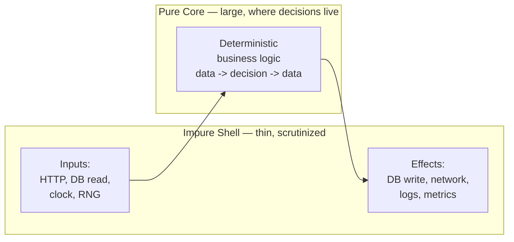
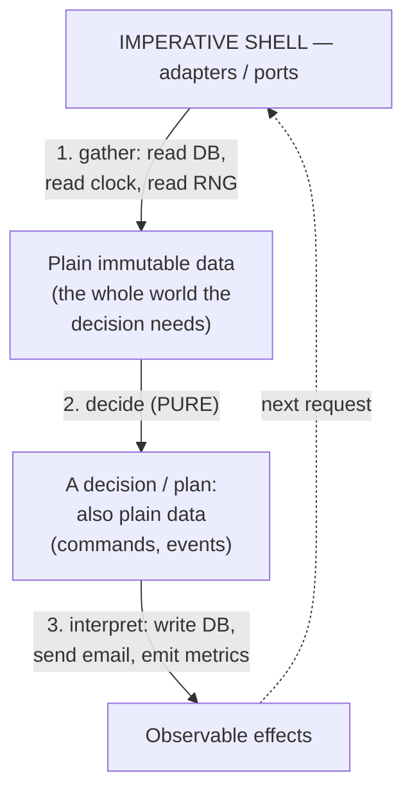

# Pure Functions & Referential Transparency — Senior Level

> **Roadmap:** [Functional Programming](../README.md) → Pure Functions & Referential Transparency
>
> *A pure function is a value you haven't computed yet. Referential transparency is the licence to treat it that way — to swap the call for its result, anywhere, without telling anyone. At senior level the question stops being "is this function pure?" and becomes "where in my architecture do I put the impurity, and what does drawing that line buy me?"*

---

## Table of Contents

1. [Introduction](#introduction)
2. [Prerequisites](#prerequisites)
3. [Architecture: A Pure Core Behind an Impure Shell](#architecture-a-pure-core-behind-an-impure-shell)
4. [Equational Reasoning & Its Payoffs](#equational-reasoning--its-payoffs)
5. [Concurrency, Parallelism & Distributed Implications](#concurrency-parallelism--distributed-implications)
6. [Language Reality & The Limits of Purity](#language-reality--the-limits-of-purity)
7. [Common Mistakes](#common-mistakes)
8. [Test Yourself](#test-yourself)
9. [Cheat Sheet](#cheat-sheet)
10. [Summary](#summary)
11. [Further Reading](#further-reading)
12. [Related Topics](#related-topics)

---

## Introduction

> Focus: **design and architecture implications.** Not "what is a pure function" — that was [`junior.md`](junior.md). Not "how do I write one" — that was [`middle.md`](middle.md). This is: *how do I shape a system around purity, and what concrete properties does that shape guarantee?*

A function is **pure** when two things hold: it returns the same output for the same input (determinism), and it causes no observable effect besides returning that output (no mutation of arguments or globals, no I/O, no clock, no randomness). **Referential transparency** is the consequence: an expression can be replaced by its value — or its value by the expression — anywhere it appears, without changing the meaning of the program. `f(3)` and `7` are interchangeable forever.

This sounds like a property of *functions*. The senior insight is that it is really a property of *boundaries*. A large system is never all-pure — it must eventually write a row, send a packet, read a clock. The architectural decision is **where the impurity lives**, and the discipline is to make that region as small, as central, and as shallow as possible while the rest of the system — the part that holds your business logic, your hardest decisions, your money math — stays pure.

The payoff is not aesthetic. Purity is the precondition for a stack of capabilities seniors care about:

- **Equational reasoning** — you can refactor by substitution and *know* you preserved behavior.
- **Caching / memoization** — a pure result is cacheable by definition; an impure one is a trap.
- **Safe concurrency** — pure code has no shared mutable state, so it parallelizes without locks.
- **Trivial testability** — no mocks, no setup, no clock injection; input in, assert output.
- **Idempotency & retries** — the foundation of every reliable distributed operation.
- **Bounded bug surface** — a bug that depends on order, timing, or hidden state *cannot live* in pure code. Purity doesn't fix bugs; it evicts whole categories of them from most of your codebase.

That last point reframes the whole topic. **Purity is a containment strategy for nondeterminism.** Every line of pure code is a line where Heisenbugs, race conditions, and "works on my machine" simply cannot occur. The impure shell is where they *can* — so you make it small enough to scrutinize.



---

## Prerequisites

- **Required:** Fluency with [`junior.md`](junior.md) and [`middle.md`](middle.md) — you can identify side effects, write a pure function, and extract effects out of a tangled one.
- **Required:** Comfort with [Immutability](../03-immutability/senior.md) — purity and immutability are mutually reinforcing; mutable arguments break referential transparency silently.
- **Helpful:** [Composition](../05-composition/senior.md) and [Effect Tracking](../10-effect-tracking/senior.md) — the pure core is *assembled* by composition and its boundary is *guarded* by effect tracking.
- **Helpful:** Exposure to hexagonal / ports-and-adapters architecture and to idempotency in distributed systems.
- **Helpful:** Any acquaintance with a language that *enforces* purity (Haskell) — it makes the boundary visible in the type system, which clarifies what discipline you are simulating in Go/Java/Python.

---

## Architecture: A Pure Core Behind an Impure Shell

The dominant senior-level pattern for purity is **functional core, imperative shell** (Gary Bernhardt's name) — which is the same idea as the **pure core** in **hexagonal / ports-and-adapters** architecture, viewed from the FP side. Both say: push effects to the edge; keep the middle pure.

### The shape



The flow is always the same three beats:

1. **Gather** (impure) — the shell reads everything the decision depends on *up front*: rows from the database, the current time, a random seed, config. It collects them into plain immutable values.
2. **Decide** (pure) — the core takes those values and computes a decision. It does not read the clock; the clock reading was *passed in*. It does not write to the database; it *returns a description* of what should be written. Same inputs → same decision, always.
3. **Interpret** (impure) — the shell takes the decision (which is just data: "charge this card," "send this email," "insert these rows") and carries it out.

The crucial inversion: **the core never performs effects; it returns descriptions of effects, and the shell performs them.** Time, randomness, and I/O become *inputs* and *outputs* of the pure core, never things it reaches out and touches.

### Worked example — the same logic, before and after

```python
# IMPURE: decision and effects are welded together. Untestable without a clock,
# a DB, and a payment gateway. Bugs can hide in ordering and hidden state.
def renew_subscription(user_id):
    user = db.fetch_user(user_id)               # I/O
    if user.expires_at < datetime.now():        # hidden clock dependency
        amount = user.plan.price
        if user.loyalty_years > 2:
            amount *= 0.9                        # business rule buried in I/O code
        gateway.charge(user.card, amount)        # I/O, irreversible
        db.set_expiry(user_id, datetime.now() + timedelta(days=30))  # I/O + clock
        mailer.send(user.email, "renewed")       # I/O
```

```python
# PURE CORE: a single function from data to a decision. No clock, no DB, no
# gateway. 'now' is an argument. The output is a *plan*, not an action.
@dataclass(frozen=True)
class RenewalPlan:
    charge: Money | None
    new_expiry: datetime | None
    email: str | None

def decide_renewal(user: User, now: datetime) -> RenewalPlan:   # PURE
    if user.expires_at >= now:
        return RenewalPlan(charge=None, new_expiry=None, email=None)  # nothing to do
    amount = user.plan.price * (Decimal("0.9") if user.loyalty_years > 2 else 1)
    return RenewalPlan(
        charge=amount,
        new_expiry=now + timedelta(days=30),
        email="renewed",
    )

# IMPERATIVE SHELL: gather, call the pure core, interpret the plan.
def renew_subscription(user_id):                                  # IMPURE, thin
    user = db.fetch_user(user_id)                                 # gather
    now = datetime.now()                                          # gather the clock
    plan = decide_renewal(user, now)                             # decide (pure)
    if plan.charge is not None:                                   # interpret
        gateway.charge(user.card, plan.charge)
        db.set_expiry(user_id, plan.new_expiry)
        mailer.send(user.email, plan.email)
```

Look at what moved. *Every interesting decision* — the expiry comparison, the loyalty discount, the 30-day extension — is now in `decide_renewal`, which is pure: you test the loyalty discount with one line, `assert decide_renewal(loyal_user, now).charge == expected`, no mocks, no clock, no database. The shell that remains has no branches worth testing; it is plumbing. **The hard part is pure; the impure part is trivial.** That asymmetry is the whole point.

### Why this is the same thing as hexagonal architecture

Ports-and-adapters says: the **domain** sits in the center and depends on nothing; **ports** are interfaces it defines; **adapters** (DB, HTTP, queues) implement those ports at the edge. Map it onto purity:

| Hexagonal term | Functional-core term | Property |
|---|---|---|
| Domain core | Pure core | Deterministic, no effects, all the logic |
| Port (interface) | The *type* of the data passed in / the plan returned | The contract at the boundary |
| Adapter | Imperative shell | Where effects actually happen |
| "Domain depends on nothing" | "Core is pure" | The same constraint, two vocabularies |

Hexagonal architecture is the OO/dependency-inversion expression of "keep effects at the boundary"; functional core/imperative shell is the FP expression. A senior recognizes them as one idea and uses whichever vocabulary the team speaks. The synergy is real: **dependency inversion gives you the seam; purity tells you what to put behind it.**

### Where the bugs can — and can't — live

This architecture creates a **bug containment field**. Reason about the two regions separately:

- In the **pure core**, a bug is always a *logic* bug: a wrong formula, a missed case, an off-by-one. It is fully reproducible — given the inputs that triggered it, it triggers every time. There is no "it only fails under load," no "it works until the cache warms," no race. You can capture the failing inputs and write a regression test that pins it forever.
- In the **impure shell**, the *only* bugs that can live are effect bugs: a botched retry, a transaction that should have wrapped two writes, a partial failure. These are the hard, nondeterministic, distributed-systems bugs — and you have deliberately concentrated them into the smallest, most-reviewed surface in the system.

So the architectural promise is precise: **make the shell small, and you have made the region where nondeterministic bugs can exist small.** You haven't eliminated hard bugs; you've quarantined them.

### How big should the core be? — the senior trade-off

"Push effects to the edge" has a failure mode: a core so greedy that the shell becomes a tangle of round-trips. The tension is **gather-everything-up-front** versus **decide-as-you-go**.

- The pure core needs *all* the data its decision depends on, passed in before it runs. If a decision can't know what it needs until it's partway through (decide A, then based on A fetch B, then decide C), a strictly pure core forces you to either over-fetch B always, or split the decision into stages with the shell shuttling between them.
- The pragmatic resolution is to **interleave at the granularity of decisions, not effects**: each pure step takes gathered data and returns *either* a final plan *or* a "I need more data: fetch X" request, which the shell satisfies before calling the next pure step. The core stays pure (it returns *descriptions* of what to fetch, the way it returns descriptions of what to write); the shell stays a dumb interpreter; and you avoid blind over-fetching. This is the same "effects as data" move applied to *reads*, and it's the conceptual seed of the free-monad / effect-interpreter style covered in [Effect Tracking](../10-effect-tracking/senior.md).

The judgment call: a core that's too small leaks logic into the shell (defeating testability); a core that demands the whole database up front kills performance. Seniors size the core to **"all the data this decision needs, and no more"** and let the *shell's* fetch strategy (batch, lazy, paginated) be a separate, tunable concern from the *core's* logic. Keeping those two concerns separate is itself a payoff of the split.

---

## Equational Reasoning & Its Payoffs

Referential transparency licenses **equational reasoning**: reasoning about a program the way you reason about algebra — by substituting equals for equals. This is not a parlor trick; it is the mechanism behind a cluster of practical capabilities.

### Substitution as the model

If `f` is pure, then for any expression `f(x)`, you may:

- replace `f(x)` with its value (and vice versa) anywhere it occurs;
- pull a repeated `f(x)` out into a `let y = f(x)` without changing meaning (common subexpression elimination);
- delete `f(x)` entirely if its result is unused (dead code elimination), because it has no effect to lose;
- reorder two independent calls, or run them in parallel, because neither depends on the other's effects.

Each bullet is a refactoring you perform daily. In *impure* code, **every one of them is unsafe.** `log("hi"); log("hi")` is not the same as `let m = log("hi") in (m; m)` — the second logs once. `next_id()` cannot be hoisted or deduplicated. Referential transparency is what makes the entire refactoring catalog *valid by construction* rather than "valid if you remember this function has no side effects."

```haskell
-- In Haskell the compiler relies on this. Because `expensive x` is pure,
-- GHC may float it out, share it, or drop it. The let-binding below is
-- *guaranteed* equivalent to inlining `expensive x` twice — same value,
-- computed once. That guarantee is referential transparency, machine-checked.
result = let y = expensive x in (y, y)   -- == (expensive x, expensive x)
```

### Payoff 1 — Refactoring you can trust

The reason "Extract Function," "Inline Variable," "Slide Statements," and "Replace Loop with Pipeline" are *safe* is that they preserve value under substitution. In a pure region you can apply them mechanically — even automatically — and be certain behavior is unchanged. In an impure region, each refactor requires you to *prove* you didn't reorder or duplicate an effect. Purity converts refactoring from a careful audit into a routine.

### Payoff 2 — Caching and memoization, for free and for real

A pure function's result depends only on its inputs, so `(inputs → result)` is a stable mapping you may cache *anywhere* — in a dictionary, in Redis, on a CDN — and it can never go stale for the same inputs.

```go
// Memoizing a PURE function is always correct: identical args -> identical result.
func Memoize[K comparable, V any](f func(K) V) func(K) V {
    cache := map[K]V{}
    var mu sync.Mutex
    return func(k K) V {
        mu.Lock(); defer mu.Unlock()
        if v, ok := cache[k]; ok {
            return v
        }
        v := f(k) // safe to cache forever: f has no hidden inputs or effects
        cache[k] = v
        return v
    }
}
```

The danger is memoizing an *impure* function. Memoize `getUserBalance(id)` — which reads a mutable database — and you have built a bug: the cache returns a value that reality has since changed. The senior rule is blunt: **caching is only correct over pure functions.** When you cache an impure result, you are really asserting "this is pure *enough* for this TTL," and the TTL is your apology for lying. Every cache-invalidation headache is the bill for caching something that wasn't referentially transparent. The architectural fix is to push the impure read *out* of the cached function — cache `priceFor(plan, region)` (pure), not `priceFromDB(planId)` (impure).

This scales all the way up. The reason an **HTTP/CDN cache** is correct is that a `GET` is supposed to be referentially transparent — same URL, same representation — which is exactly why the spec calls `GET` *safe* and *idempotent* and why `POST` is not cacheable. A `Cache-Control: immutable` header is a *purity assertion* made over the wire: "this URL → this bytes mapping will never change." The whole multi-layer caching stack — L1 memo table, Redis, CDN, browser — is one idea applied at four scales: **a referentially transparent computation may be replaced by a stored copy of its result.** Cache invalidation is hard precisely because it is the act of admitting a function you treated as pure actually wasn't. Architect the boundary so the *cacheable* layer is genuinely pure (compute over already-fetched, content-addressed inputs) and the *fetching* layer is separate, and most invalidation pain evaporates — you cache the transform, not the read.

### Payoff 3 — Testing without ceremony

A pure function is the easiest thing in software to test: it has no setup, no teardown, no mocks, no fakes, no injected clock, no test database. You supply inputs and assert on the output. This is also why purity is the precondition for **property-based testing** — to assert `decode(encode(x)) == x` for ten thousand random `x`, the functions must be deterministic. The functional-core/imperative-shell split is, among other things, a *testability* strategy: it relocates all the logic worth testing into the region that is trivial to test, and leaves the region that's hard to test (the shell) almost logic-free.

---

## Concurrency, Parallelism & Distributed Implications

This is where purity stops being a coding nicety and becomes a systems property.

### Parallelism without locks

Data races require **shared mutable state**. Pure functions mutate nothing shared, so two pure computations can run on two cores simultaneously with *zero* synchronization — no mutex, no atomic, no memory barrier in your code. There is nothing to protect because there is nothing being changed.

```go
// Pure mapping over a slice -> embarrassingly parallel. Each f(x) is independent
// because f has no shared state to contend over. No locks anywhere.
func ParMap[A, B any](f func(A) B, xs []A) []B { // f MUST be pure for this to be safe
    out := make([]B, len(xs))
    var wg sync.WaitGroup
    for i, x := range xs {
        wg.Add(1)
        go func(i int, x A) { defer wg.Done(); out[i] = f(x) }(i, x)
    }
    wg.Wait()
    return out
}
```

This generalizes: `map`, `filter`, and `reduce` over pure functions are parallelizable by the *runtime*, with no code change — which is exactly why Java's `stream().parallel()`, Rust's Rayon, and Haskell's `parMap` exist. **Purity is the licence that makes auto-parallelization safe.** Hand `parallel()` an impure lambda (one that increments a shared counter) and you've reintroduced the race the abstraction promised to remove — the abstraction trusts you to be pure, and silently breaks when you aren't.

```java
// Java Streams: switching to parallel is a ONE-WORD change — but only because
// the mapping function is pure. The runtime splits the work across the common
// ForkJoinPool with no synchronization in your code.
List<Money> totals = orders.parallelStream()   // <- the whole concurrency story
        .map(o -> priceOf(o))                   // PURE: no shared state, no I/O
        .collect(toList());

// The trap, in the same one word. This lambda mutates a captured variable, so
// `parallel` races on `seen` and silently produces wrong, run-dependent results.
Set<String> seen = new HashSet<>();
orders.parallelStream()
      .filter(o -> seen.add(o.sku()))           // IMPURE side effect -> data race
      .forEach(this::process);                  // works in serial, corrupts in parallel
```

The diff between correct and corrupt is invisible to the type checker; the only thing standing between them is whether the lambda is pure. That is the senior reason to keep stream/iterator pipelines pure even when you "know" you're running serially today — the day someone adds `.parallel()` for a perf win, purity is what decides whether it's a one-word win or a one-word Heisenbug.

### The senior framing: order independence

A pure expression's value does not depend on *when* it is evaluated relative to others. That single property is what underwrites: parallel execution (any order), lazy evaluation (evaluate later), speculative/out-of-order execution, memoization (evaluate once, reuse), and distributed evaluation (evaluate on another machine). Every one of these is "evaluate this somewhere/sometime else," and every one is safe exactly to the degree the code is pure. When you make a region pure, what you are actually buying is **scheduling freedom** over it — the right to move the computation in time and space without coordination. That is also why the same pure function can run in a unit test, in a parallel stream, in a Spark job across a cluster, and in a browser, unchanged: none of those environments differ in anything the pure function can observe. Impurity is precisely the dependence on *where and when* you run; purity is its absence, and absence-of-when is what schedulers exploit.

### Idempotency and purity in distributed systems

Distributed systems force you to handle **partial failure**: a request times out, but did it succeed? The universal answer is **retry**, and retry is only safe if the operation is **idempotent** — doing it twice has the same effect as doing it once. Idempotency is purity's distributed cousin:

- A **pure** function is trivially idempotent: calling it twice produces the same value and no effect, so a retry is free.
- The *effects* in your shell — the part that actually charges a card or inserts a row — are where idempotency must be *engineered*, because effects are not naturally idempotent (charging twice charges twice).

The functional-core/imperative-shell split helps directly. Because the core is pure, **re-running the decision is always safe** — a retried request recomputes the *same plan* deterministically. The only thing that needs idempotency machinery is the shell's interpretation of that plan, and that machinery is well known: idempotency keys, dedup tables, conditional writes, "create if not exists."

```go
// The decision is pure -> safe to recompute on every retry, no matter how many.
plan := decide(order, now)              // pure: same order+now -> same plan, always
// Only the EFFECT needs idempotency engineering. The key derives from the
// (immutable) inputs, so a retry hits the same key and dedups.
key := idempotencyKey(order.ID, plan)   // pure derivation of the key
if !ledger.Exists(key) {                // shell: make the effect happen at-most-once
    ledger.Charge(key, plan.Amount)     // conditional, keyed write
}
```

This is the deep link between FP and reliability: **the more of your operation you can express as a pure decision over gathered data, the smaller the surface that needs distributed-systems idempotency, and the easier retries become.**

### Deterministic replay: event sourcing's hidden contract

Event sourcing stores the *events* (what happened) and derives current state by folding them through a reducer: `state = events.reduce(apply, initial)`. The entire scheme rests on one assumption that is rarely stated out loud: **`apply` must be pure.** Replaying the same event log must reproduce *byte-identical* state — that is what makes the log the source of truth, what lets you rebuild a read model from scratch, time-travel to any past state, or migrate to new projection code by replaying history.

```python
# The fold MUST be pure for replay to be trustworthy. The forbidden lines show
# the classic ways teams accidentally poison it.
def apply(state: Account, event: Event) -> Account:        # PURE reducer
    match event:
        case Deposited(amount):
            return replace(state, balance=state.balance + amount)
        case Withdrawn(amount):
            return replace(state, balance=state.balance - amount)
    # WRONG, if it appeared here: state.last_seen = datetime.now()  -> replay drifts
    # WRONG, if it appeared here: audit_table.insert(...)            -> replay re-fires effects
```

The bug seniors must catch in review: a reducer that reads the clock, generates an ID, or performs a write. The first time you run it, it "works." The day you *replay* — to rebuild a projection or recover from a corrupt read model — every clock read returns a different value and every write fires again, and the rebuilt state silently disagrees with the original. The discipline is exactly the topic of this file: **non-determinism (the timestamp, the generated ID) must be captured *in the event* at write time** (so it's now data the pure fold reads), never re-derived at fold time. Referential transparency of the reducer is the contract that makes the event log mean anything at all.

### A caution: purity is necessary, not sufficient

Purity removes data races *within* a computation. It does **not** by itself solve concurrency at the boundary — two shell instances can still race on the *same external resource* (the database row, the bank account). Purity shrinks the concurrency problem to the shell and the external state; it does not delete it. Seniors are precise about this so they don't oversell the paradigm.

---

## Language Reality & The Limits of Purity

### Who enforces it?

The biggest practical divide between languages is whether purity is **enforced by the compiler** or **maintained by discipline**.

| Language | How purity is handled | What this means for you |
|---|---|---|
| **Haskell** | *Enforced.* A function's type tells you if it can do I/O: `Int -> Int` is pure; anything effectful lives in `IO` and the types won't let you call it from pure code. | The boundary is machine-checked. You *cannot* accidentally read the clock in a pure function — it won't compile. The core/shell split is in the type system. |
| **Java** | *Discipline*, with help. No enforcement, but `record` (immutable carriers), `final`, sealed types, and the Streams API make a pure core natural to express and review. | You design the split; convention + code review + immutability enforce it. |
| **Python** | *Discipline.* Dynamic, mutable by default; `@dataclass(frozen=True)`, type hints, and naming conventions are your only signals. | Easiest to violate accidentally (a mutable default argument, a global tweak); requires the most vigilance. |
| **Go** | *Discipline.* No `const` structs, no purity annotations; but small functions, value semantics, and explicit dependencies make the split idiomatic. | You enforce by structure: pure functions take values and return values; effects live in methods on types that hold the I/O clients. |

In Haskell the architecture of this whole topic is not a *pattern you follow* — it is *the only thing that compiles*. `IO` is the imperative shell, made a type. In Go/Java/Python, the same architecture is a *convention you choose and defend*. Knowing this tells you where to spend review attention: in the disciplined languages, the boundary is invisible, so you must keep it visible by structure, naming, and tests.

```haskell
-- The type IS the boundary. `pureCore` cannot perform I/O — there is no way to
-- read the clock or hit the DB inside it; the type system forbids it. `main`
-- (the shell) gathers effects in IO, calls the pure core, then interprets.
pureCore :: Order -> UTCTime -> Plan      -- guaranteed pure by its type
pureCore order now = ...

main :: IO ()
main = do
  now   <- getCurrentTime                 -- effect: gather (in IO)
  order <- loadOrder                       -- effect: gather (in IO)
  let plan = pureCore order now           -- pure decision
  runPlan plan                             -- effect: interpret (in IO)
```

### The limits: what purity can never absorb

A program that did nothing impure would be a space heater — it must eventually observe and change the world. The senior skill is recognizing the **irreducible effects** and *modeling* them rather than pretending they're pure.

- **I/O (network, disk, DB).** The canonical effect. Model: gather reads up front into data, return writes as a plan; the shell does both.
- **Time / the clock.** `now()` is nondeterministic — same inputs, different outputs across calls. Model: **pass time in as a parameter.** The core receives `now: datetime`; only the shell calls the real clock. This single move makes time-dependent logic deterministically testable ("what happens at 23:59 on a renewal date?" is a unit test, not a flaky integration test).
- **Randomness.** `random()` breaks determinism by design. Model: pass in a **seed** or the already-drawn random values, so the core is `decide(inputs, seed)` — deterministic given the seed, reproducible for tests and replay.
- **Logging and metrics.** The honest awkward case. A `log.info(...)` is, strictly, a side effect, and littering the pure core with it technically breaks purity. The pragmatic senior stance: treat *diagnostic* logging/metrics as a **benign, commutative effect** that doesn't affect the program's value or correctness, and tolerate it in the core — or, when you want strictness, **return the log lines as part of the plan** (the Writer-monad idea: accumulate messages in the output, emit them in the shell). Most teams accept lightweight logging in the core as a deliberate, documented exception; the line you must not cross is letting *control flow* depend on an effect.

> **The senior judgment on logging:** purity is a tool for containing nondeterminism, not a religion. A metrics counter or a debug log in the core does not make decisions nondeterministic — the *return value* is unchanged. Treating it as an exception is fine; what is not fine is reading the clock or the DB inside the core, because that changes what the core *decides*. Police the inputs to decisions ruthlessly; be pragmatic about benign output effects.

### Modeling effects so the core stays pure

- **Configuration and environment.** The sneakiest hidden input, because it *looks* constant. A function that reads `os.environ["TAX_RATE"]` or a global feature flag is impure — its result depends on deploy-time state the caller can't see, and two environments give two answers. Model: **resolve config in the shell and pass it in.** The core takes `tax_rate: Decimal`; the shell reads the env. Now the core is testable across every config value with no environment manipulation, and the dependency is explicit in the signature rather than buried in a `getenv` call three layers deep.

The unifying technique across all the limits: **turn an effect into data at the boundary.** A clock read becomes a `now` parameter (input as data). A database write becomes a "Plan" or a list of commands (output as data). A log line becomes an entry in an accumulated list (output as data). The pure core then manipulates only data — and the shell, at the very edge, translates that data into actual effects. This is the bridge to [Effect Tracking](../10-effect-tracking/senior.md) and the `IO` monad: the most rigorous version of "effects as data" is to make the *description* of an effect a first-class value the type system tracks.

---

## Common Mistakes

Mistakes seniors make when architecting around purity:

1. **Hidden inputs masquerading as purity.** A function with no I/O calls but that reads `datetime.now()`, `os.environ`, a global config, or a module-level cache is **not pure** — it has hidden inputs. It will pass a casual review and then fail intermittently. *Audit for hidden inputs (clock, env, globals, randomness), not just for obvious I/O.*
2. **Mutating an argument and calling it pure.** Sorting a list in place, appending to a passed-in slice, or tweaking a field on an argument object breaks referential transparency even with no I/O — the caller's value changed under them. *Pure functions return new values; they never mutate what they're given.* (See [Immutability](../03-immutability/senior.md).)
3. **Caching an impure function.** Memoizing something that reads mutable external state produces stale results that are maddening to debug. *Only pure functions are safely cacheable; push the impure read out before you cache.*
4. **A "pure core" that's actually a thin film over an impure one.** If the core calls back into the shell (a domain object that lazily fetches from the DB, an ORM entity that hits the network on attribute access), it isn't pure and you've gained nothing. *The core must receive already-gathered data; no lazy I/O through the back door.*
5. **Letting control flow depend on a benign effect.** A log line is tolerable; `if log.write(...) succeeds: charge()` is not. The moment an effect's *result* drives a decision, the decision is impure. *Effects may be emitted by the core (debatably); they must never be consumed by it.*
6. **Overselling purity for concurrency.** "It's all pure, so we have no concurrency bugs" — false. Two shell instances still race on the shared database row. *Purity removes in-computation races; boundary/external-state concurrency still needs design (locks, transactions, idempotency).*
7. **Purity zealotry that hurts the codebase.** Threading a logger through twenty pure functions as a Writer monad in a language with no support for it, to avoid one `log.debug`, is a net loss in clarity. *Purity is risk-adjusted: enforce it where determinism pays (decisions, money, caching, parallelism); be pragmatic at the edges.*
8. **Forgetting that retries need the *core* to be deterministic.** Idempotency keys protect the effect, but if the core reads the clock or RNG, a retry computes a *different plan* and the key won't match. *A retriable operation needs a pure decision AND an idempotent effect — both.*

---

## Test Yourself

1. Explain, in terms of referential transparency, why memoizing `getAccountBalance(id)` (which reads a mutable DB) is a bug, while memoizing `formatCurrency(amount, locale)` is always safe.
2. You have `process_payment(order_id)` that reads the DB, reads the clock, decides a discount, charges a card, and emails a receipt. Sketch the functional-core/imperative-shell split: what is the pure function's signature, and what does it *return*?
3. A teammate says "we made everything pure, so we don't need locks anymore." In what sense are they right, and in what specific sense are they wrong?
4. Why is `now()` inside a function a bigger threat to testability and reliability than a `log.info(...)` call, even though both are technically side effects?
5. Your distributed payment operation is retried on timeout. Explain why making the *decision* pure is what lets the retry be safe, and what the *shell* still has to do that purity alone doesn't give you.
6. Map the four roles of hexagonal architecture (domain, port, adapter, "domain depends on nothing") onto the functional-core/imperative-shell vocabulary.
7. In which of Go, Java, Python, Haskell is the pure/impure boundary checked by the compiler, and what does that change about *where you spend review effort* in the other three?

<details>
<summary>Answers</summary>

1. `formatCurrency` is referentially transparent: `formatCurrency(5, "en-US")` always equals `"$5.00"`, so the `(args → result)` mapping is stable forever and any cache of it is correct. `getAccountBalance` is **not** referentially transparent — its result depends on mutable external state, so `getAccountBalance(7)` is *not* substitutable for any fixed value; the moment the DB changes, the cached value is wrong. Memoizing it asserts a stability the function doesn't have. Fix: cache the pure transformation, not the impure read.
2. Pure signature: `decide_payment(order: Order, now: datetime) -> PaymentPlan`, where `PaymentPlan` is plain immutable data describing the *intended* effects (e.g. `charge: Money | None`, `receipt_email: str | None`, `audit_rows: list[...]`). It performs **no** I/O and does **not** charge or email — it *returns a description* of what should happen. The shell: (a) gathers — `order = db.fetch(...)`, `now = clock.now()`; (b) calls `decide_payment`; (c) interprets the plan — `gateway.charge(...)`, `mailer.send(...)`, `db.insert(...)`.
3. **Right:** pure computations share no mutable state, so two of them running concurrently cannot data-race; you can parallelize the pure core (and use `parallel()` / Rayon / `parMap`) without locks. **Wrong:** purity is necessary, not sufficient, for *system* correctness — the impure shell still touches shared external resources (a DB row, a bank balance), and two shell instances can still race there. Purity shrinks the locking problem to the boundary; it doesn't delete it.
4. `now()` changes the function's **return value / decision** — same arguments, different output across calls — so it destroys determinism: the function is no longer testable by example, behaves differently at different times, and breaks reproducibility/replay. A `log.info(...)` doesn't change the return value or any decision; it's a benign output effect. The threat scales with whether the effect influences the *decision*, and the clock does while logging doesn't.
5. A pure decision means recomputing `decide(order, now)` on a retry yields the **exact same plan** every time, so the retry is computing the right thing and the derived idempotency key is stable. What purity alone does **not** give you: the *effect* (charging the card) is not naturally idempotent, so the shell must engineer at-most-once execution — an idempotency key, a dedup/ledger table, or a conditional write — so that two arrivals of the same plan charge once. You need both: a deterministic core *and* an idempotent shell.
6. Domain ↔ pure core (all the logic, depends on nothing); port (interface) ↔ the *types* of the data passed in and the plan returned (the boundary contract); adapter ↔ imperative shell (DB/HTTP/queue code that performs effects); "domain depends on nothing" ↔ "the core is pure." They are the same constraint in two vocabularies — hexagonal is the dependency-inversion phrasing, functional-core/imperative-shell is the FP phrasing.
7. Only **Haskell** checks it at the compile level — effectful code has an `IO` type and the type system forbids calling it from pure code, so the boundary is machine-verified. In **Go, Java, Python** purity is discipline, so the boundary is *invisible* to the compiler — which means you must keep it visible by other means: structure (pure functions take/return values; effects live on I/O-holding types), naming, immutability (`frozen=True`, `record`, `final`), and tests. Review effort there goes into *hunting hidden inputs* (clock, globals, env, lazy I/O) and *guarding the seam*, because nothing else will catch a violation.

</details>

---

## Cheat Sheet

| Concept | What it is | Senior payoff |
|---|---|---|
| **Pure function** | Same input → same output, no observable effect | Cacheable, parallelizable, trivially testable, idempotent |
| **Referential transparency** | An expression is interchangeable with its value | Equational reasoning → safe refactoring by substitution |
| **Functional core / imperative shell** | Pure decision in the middle, effects at the edge | Logic is testable; bugs of nondeterminism are quarantined to a thin shell |
| **Hexagonal / ports-and-adapters** | Domain depends on nothing; adapters at the edge | The same idea via dependency inversion — purity says what goes behind the seam |
| **Effects as data** | Clock→param, write→returned plan, log→accumulated list | Keeps the core pure while still doing real work |
| **Memoization** | Cache `(inputs → result)` | Correct **only** over pure functions; otherwise stale-cache bugs |
| **Idempotency** | Doing it twice = doing it once | Purity's distributed cousin; pure decision + idempotent effect = safe retry |

**The boundary rules:**
- The core **receives** time/randomness/data/config as inputs and **returns** effects as a plan. It never reaches out.
- **Police the inputs to decisions** (clock, RNG, env, globals, config, lazy I/O); be pragmatic about benign output effects (logs, metrics).
- **Cache only pure functions.** A TTL on an impure result is an apology for caching a lie.
- **Make the shell small** — that is the region where nondeterministic bugs are *allowed* to live.

**"Is this function actually pure?" — the five hidden-input checks:** does it read the **clock**? the **RNG**? the **environment / global config**? a **mutable global / shared cache**? does it perform **lazy I/O** through an argument (an ORM entity, a lazy stream)? Any "yes" means it is impure — push that input out to the shell and pass the resolved value in.

**Three golden rules:**
- *Purity is a property of boundaries, not just functions — decide where impurity lives and keep it thin and central.*
- *Referential transparency is the licence to substitute equals for equals — it's what makes caching, parallelism, and refactoring safe by construction.*
- *Purity contains nondeterminism; idempotency extends that containment across the network. Pure decision + idempotent effect = a reliable distributed operation.*

---

## Summary

- A **pure function** is deterministic and effect-free; **referential transparency** is the resulting licence to replace any expression with its value, anywhere, forever.
- At senior level, purity is a property of **boundaries**: the architectural job is to decide *where impurity lives* and to keep that region thin, central, and shallow.
- The dominant pattern is **functional core / imperative shell** — gather effects up front (impure), decide (pure, returns a *plan*), interpret the plan (impure). It is the FP twin of **hexagonal / ports-and-adapters**; dependency inversion gives the seam, purity says what goes behind it.
- This split is a **bug containment field**: pure-core bugs are fully reproducible logic bugs; only the thin shell can host nondeterministic, ordering, and partial-failure bugs — so you shrink the shell to shrink that surface.
- **Equational reasoning** (substitute equals for equals) is what makes the whole refactoring catalog *valid by construction*, makes pure results **cacheable** without staleness, and makes pure functions **trivially testable** and property-test-able.
- **Concurrency:** pure code shares no mutable state, so it parallelizes without locks; purity is the licence that makes `parallel()` / Rayon / `parMap` safe. But purity is *necessary, not sufficient* — the shell can still race on external state.
- **Distributed:** purity's cousin is **idempotency**. A pure decision is safe to recompute on every retry; the shell still needs idempotency keys / dedup / conditional writes to make the *effect* at-most-once. Pure decision + idempotent effect = safe retry. Event sourcing depends on the same determinism in the fold.
- **Language reality:** Haskell *enforces* the boundary in the type system (`IO`); Go, Java, and Python rely on *discipline*, so review effort there must hunt hidden inputs and guard the seam by structure, immutability, and tests.
- **Limits:** I/O, time, randomness, logging, and metrics can't be made pure — but they can be **modeled as data at the boundary** (clock→parameter, write→returned plan, log→accumulated list). Police the inputs to decisions ruthlessly; be pragmatic about benign output effects. Purity is risk-adjusted, not a religion.

---

## Further Reading

- **Boundaries** — Gary Bernhardt (talk / screencast, 2012) — the canonical "functional core, imperative shell" framing, with the testability argument made concretely.
- **Out of the Tar Pit** — Moseley & Marks (2006) — the foundational case that *accidental* complexity comes largely from state and control, and that isolating it (a pure logic core) is the durable fix.
- **Domain Modeling Made Functional** — Scott Wlaschin (2018) — building a pure domain core with types, then pushing effects to the edge, in F#; the cleanest book-length treatment of this exact architecture.
- **Functional Programming in Scala** — Chiusano & Bjarnason (2014) — referential transparency, the substitution model, and effects-as-values (the `IO` type) developed from first principles.
- **Hexagonal Architecture** — Alistair Cockburn (2005, ports-and-adapters) — the OO/dependency-inversion expression of "keep effects at the boundary."
- **Designing Data-Intensive Applications** — Martin Kleppmann (2017) — idempotency, exactly-once semantics, and deterministic replay (event sourcing) — the distributed-systems payoff of determinism.
- **Why Functional Programming Matters** — John Hughes (1990) — why composability and reasoning, both rooted in purity, are the paradigm's real selling points.

---

## Related Topics

- [Immutability](../03-immutability/senior.md) — purity's twin; a mutable argument breaks referential transparency even with zero I/O.
- [Composition](../05-composition/senior.md) — the pure core is *assembled* by composing small pure functions into pipelines.
- [Effect Tracking](../10-effect-tracking/senior.md) — the rigorous next step: making "effects as data" first-class and type-checked (the `IO` monad, the functional core / imperative shell as a type discipline).
- [Map / Filter / Reduce](../04-map-filter-reduce/senior.md) — the operations that auto-parallelize *because* their function arguments are pure.
- [Monads — Plain English](../09-monads-plain-english/senior.md) — `IO`, `Writer`, and friends are how you model time, logging, and effects without leaving the pure world.
- [Clean Code → Pure Functions](../../clean-code/15-pure-functions/README.md) — the everyday-code chapter on writing pure functions in ordinary languages.
- [Architecture → System Design](../../../../Architecture/system-design/README.md) — the systems-level treatment of caching, idempotency, and replay, whose correctness ultimately rests on referential transparency.
