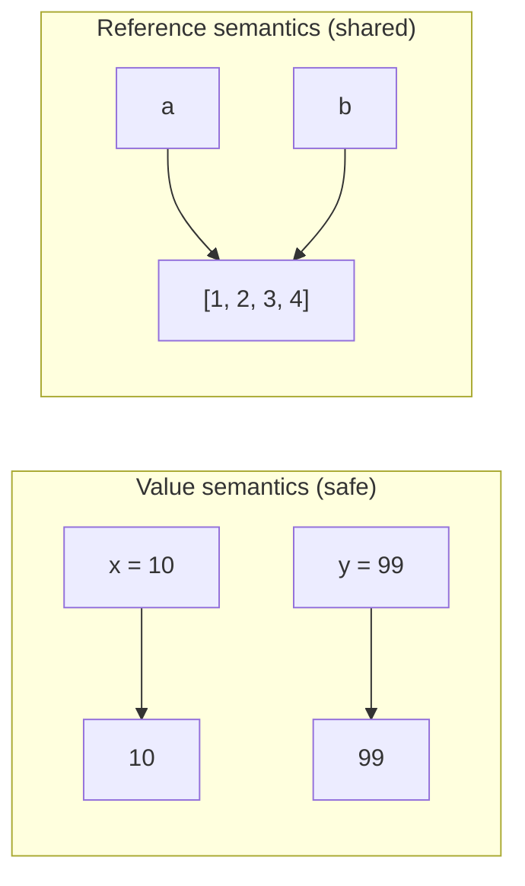

# Immutability — Junior Level

> **Roadmap:** [Functional Programming](../README.md) → Immutability
> *An immutable value never changes after it is created — so once you understand it, you never have to wonder who changed it behind your back.*

---

## Table of Contents

1. [Introduction](#introduction)
2. [Prerequisites](#prerequisites)
3. [Glossary](#glossary)
4. [Core Concept: Value vs Reference](#core-concept-value-vs-reference)
5. [Why Mutation Causes Bugs (Spooky Action at a Distance)](#why-mutation-causes-bugs-spooky-action-at-a-distance)
6. [Making Things Immutable, Per Language](#making-things-immutable-per-language)
7. [Copy Instead of Mutate](#copy-instead-of-mutate)
8. [Mental Models](#mental-models)
9. [Common Mistakes](#common-mistakes)
10. [Test Yourself](#test-yourself)
11. [Cheat Sheet](#cheat-sheet)
12. [Summary](#summary)
13. [Further Reading](#further-reading)
14. [Related Topics](#related-topics)

---

## Introduction

> Focus: **What is immutability, and why does it matter?**

Here is a small, ordinary bug. You hand someone a shopping list written on paper. They walk off, cross out two items, scribble three new ones, and hand the paper back. Later you reach for *your* list — and it's been rewritten. You never agreed to that. You don't even know *when* it happened or *who* did it.

That is **mutation**: changing a value in place, after it has been shared. And it is one of the most reliable sources of bugs in real software, precisely because the change happens *somewhere else, at some other time*, far from where you notice the damage.

**Immutability** is the discipline of not allowing that. An immutable value is one that **can never change after it is created.** If you want a different value, you create a new one — the original stays exactly as it was. The shopping-list version: instead of editing your paper, the other person photocopies it, edits the copy, and hands the copy back. Your original is untouched. Forever.

That single rule — *never change in place; create a new value instead* — is the heart of functional programming. It is what makes [pure functions](../02-pure-functions-and-referential-transparency/junior.md) possible, what makes code safe to run in parallel, and what makes a program something you can actually reason about. At the junior level your only goals are to **recognize when something can be mutated**, to **understand why that is dangerous**, and to **know the basic tools your language gives you** to prevent it.

> **The mindset shift:** stop thinking of a variable as a *box you keep refilling*, and start thinking of a value as a *fact that was true at one moment*. Facts don't change. If the situation is different now, that's a different fact — a new value.

---

## Prerequisites

- **Required:** You can declare variables, write functions, and use lists/arrays and objects/structs in at least one language (examples here use Go, Java, and Python).
- **Required:** You understand what a function *parameter* is — that you can pass a value into a function.
- **Helpful:** You've been bitten at least once by "I changed something here and a totally unrelated thing broke." That is the pain immutability prevents.
- **Helpful:** A loose sense of [pure functions](../02-pure-functions-and-referential-transparency/junior.md) — functions that don't change anything outside themselves. Immutability is what makes them practical.

---

## Glossary

| Term | Definition |
|------|-----------|
| **Mutable** | Able to be changed in place after creation. A list you can `append` to is mutable. |
| **Immutable** | Unable to be changed after creation. The only way to "change" it is to make a new value. |
| **Value semantics** | When you pass or assign something, the receiver gets an independent *copy*. Editing one side never affects the other. |
| **Reference semantics** | When you pass or assign something, the receiver gets a *pointer to the same thing*. Editing one side affects everyone holding the reference. |
| **Mutation** | The act of changing a value in place (e.g. `list[0] = 5`, `obj.name = "x"`). |
| **Aliasing** | Two or more names referring to the same underlying mutable object. The setup for spooky bugs. |
| **Copy / defensive copy** | Making a fresh, independent duplicate so the original can't be touched through your reference. |
| **`const` / `final` / `frozen`** | Language keywords that lock something against reassignment or modification (details below — they don't all mean the same thing). |

---

## Core Concept: Value vs Reference

To understand immutability you must first understand **what actually gets passed around** when you assign a variable or call a function. There are two possibilities, and mixing them up is the #1 source of mutation bugs.

### Value semantics: you get your own copy

With **value semantics**, assigning or passing a value copies it. The two sides are independent — change one, the other is untouched.

```go
// Go — primitives and structs have value semantics
x := 10
y := x      // y is a COPY of x
y = 99
// x is still 10. Changing y could not possibly affect x.
```

This is the safe, predictable world. It *behaves like* immutability even for things you can technically change, because nobody else shares your copy.

### Reference semantics: you share the same thing

With **reference semantics**, assigning or passing a value hands over a *reference* — a pointer to one shared object. Now two names point at the same memory. Change it through one name, and the change is visible through the other.

```python
# Python — lists have reference semantics
a = [1, 2, 3]
b = a          # b is NOT a copy — it's the SAME list
b.append(4)
print(a)       # [1, 2, 3, 4]   ← a changed too, because a and b ARE the same list
```



Look at the right side of that diagram: `a` and `b` are two labels on the **same box**. That shared box is the seed of nearly every mutation bug. Value semantics avoid the problem by giving each name its own box. Immutability avoids it from the other direction: it lets names *share* a box safely, because the box can never change.

> **The key insight:** sharing is not the problem. *Sharing something that can change* is the problem. Immutability makes sharing safe by removing the "can change" part.

---

## Why Mutation Causes Bugs (Spooky Action at a Distance)

Physicists use the phrase *"spooky action at a distance"* for effects that happen far away with no visible cause. Mutation produces exactly that feeling in code: you change a value in one place, and something breaks in a completely different place that you never touched.

Here is the classic version. You write a helper that, you think, just *reads* a list:

```python
# Python — a function that secretly mutates its argument
def first_three(items):
    items.sort()        # oops: sort() mutates the list IN PLACE
    return items[:3]

prices = [50, 10, 99, 3, 70]
cheapest = first_three(prices)
print(cheapest)   # [3, 10, 50]   ✅ looks fine
print(prices)     # [3, 10, 50, 70, 99]   ❌ the caller's list got REORDERED
```

Nobody asked `first_three` to reorder `prices`. But because Python passes the list by reference and `sort()` mutates in place, the caller's data was silently rewritten. Three months later, some *other* code that relied on `prices` being in original order produces wrong output — and the bug appears to live there, miles from the real cause.

This is what makes mutation bugs so expensive:

- **The cause and the symptom are far apart.** You debug the wrong file.
- **The bug is timing-dependent.** It only shows up if `first_three` happened to run before the code that cared about order. Change the call order and the bug moves or vanishes.
- **It scales with sharing.** The more places hold a reference to the same mutable object, the more places a single change can break.
- **It explodes under concurrency.** If two threads mutate the same object at once, you get corrupted data and crashes that are nearly impossible to reproduce. (More in [Concurrency](../../../language-internals/concurrency-async-parallel/concurrency/README.md).)

The immutable fix is boringly safe — make a copy, never touch the original:

```python
def first_three(items):
    return sorted(items)[:3]   # sorted() returns a NEW list; items is untouched

prices = [50, 10, 99, 3, 70]
cheapest = first_three(prices)
print(prices)     # [50, 10, 99, 3, 70]   ✅ original preserved, no spooky action
```

> **Smell test:** if a function changes anything its caller can still see — its arguments, a global, a shared object — it can cause spooky action at a distance. A function that only *returns* new values cannot.

---

## Making Things Immutable, Per Language

Every mainstream language gives you tools to lock things down. The catch — and a real source of junior confusion — is that **these keywords protect different things**, and "immutable" has a stricter meaning than most of them deliver. Read carefully.

### Go — `const` (shallow, primitives only)

Go has no general "freeze an object" feature. `const` works only for compile-time constants (numbers, strings, booleans):

```go
const MaxRetries = 3        // ✅ a true constant, can never change
// MaxRetries = 4           // ❌ compile error

// But a struct or slice cannot be const. Go's immutability is by CONVENTION:
type Point struct{ X, Y int }

// To "change" a Point immutably, return a NEW one:
func (p Point) MoveBy(dx, dy int) Point {
    return Point{X: p.X + dx, Y: p.Y + dy}   // new value, original p untouched
}
```

In Go, immutability is a **discipline**: pass structs by value (you get a copy), and write methods that *return* new values instead of mutating the receiver.

### Java — `final` and `record`

`final` stops **reassignment**, but be careful — for an object reference it only freezes *which object the variable points to*, not the object's contents:

```java
final List<String> names = new ArrayList<>();
// names = otherList;   // ❌ can't reassign the variable
names.add("Ada");       // ✅ STILL ALLOWED — the list itself is mutable!
```

That surprise — `final` on a mutable object is *not* immutability — trips up nearly everyone. For real immutability, use a **`record`** (Java 16+), which builds a class whose fields are final and set once at construction:

```java
public record Point(int x, int y) {}      // fields are final, no setters

Point p = new Point(1, 2);
// p.x = 5;                                // ❌ no setter, can't mutate
Point moved = new Point(p.x() + 3, p.y()); // make a NEW Point to "change" it
```

To get a truly unmodifiable *collection*, wrap it: `List.copyOf(names)` or `Collections.unmodifiableList(...)` returns a view that throws if you try to mutate it.

### Python — `tuple` and frozen dataclass

A regular `list` is mutable; a **`tuple`** is its immutable twin:

```python
point = (1, 2)        # a tuple — immutable
# point[0] = 5        # ❌ TypeError: 'tuple' object does not support item assignment
moved = (point[0] + 3, point[1])   # make a new tuple
```

For objects, a normal class lets you mutate any attribute. A **frozen dataclass** locks them:

```python
from dataclasses import dataclass

@dataclass(frozen=True)
class Point:
    x: int
    y: int

p = Point(1, 2)
# p.x = 5            # ❌ FrozenInstanceError
moved = Point(p.x + 3, p.y)   # new instance, original untouched
```

Python also has `frozenset` (immutable `set`). The pattern is always the same: choose the immutable variant, and "change" by constructing a new value.

### A brief Haskell aside

In Haskell, **everything is immutable by default** — there is no assignment operator that overwrites a value. When you write `x = 5`, that's a permanent definition, not a box you can refill. This sounds extreme, but it's exactly why Haskell programs are so easy to reason about: you never have to ask *"what is `x` right now?"* — `x` is `5`, always, everywhere. Mainstream languages are slowly moving toward this default (records, `val`, `const`, `readonly`), borrowing the safety without the full commitment.

> **The pattern across all languages:** there is no real "edit in place." There is "make a new value that reflects the change, and let the old one go." The keyword (`const` / `final` / `frozen` / `tuple` / `record`) just *enforces* that you don't cheat.

---

## Copy Instead of Mutate

The everyday skill of immutability is this: **when you want a changed version, build a new value instead of editing the old one.** Three common shapes:

**Adding to a list** — don't `append` to a shared list; build a new one:

```python
# ❌ mutates the original
def with_item(cart, item):
    cart.append(item)
    return cart

# ✅ returns a new list, original untouched
def with_item(cart, item):
    return cart + [item]      # new list = old items + the new one
```

**Updating a field** — don't set the attribute; construct a new object:

```python
# ✅ Python frozen dataclass: replace() builds a copy with one field changed
from dataclasses import replace
moved = replace(point, x=point.x + 1)
```

```java
// ✅ Java record: a "wither" returns a new instance
record Point(int x, int y) {
    Point withX(int newX) { return new Point(newX, y); }
}
```

**Defensive copying at boundaries** — if you must accept or hand out a mutable object, copy it so no one can mutate your insides through their reference:

```java
class Schedule {
    private final List<String> days;
    Schedule(List<String> days) {
        this.days = List.copyOf(days);     // copy IN: caller can't mutate ours later
    }
    List<String> getDays() {
        return List.copyOf(days);          // copy OUT: caller can't mutate ours via the getter
    }
}
```

> **"Isn't copying wasteful?"** At the junior level: don't worry about it — correctness first, and most copies are tiny. Real FP languages use *structural sharing* (persistent data structures) to make immutable updates cheap, but that's a [later topic](middle.md). For now, a clear copy beats a clever mutation.

---

## Mental Models

Pick whichever of these makes immutability click for you.

- **The fact, not the box.** A value is a fact that was true at a moment (`temperature = 20°C at noon`). Facts don't get edited; if it's warmer now, that's a *new* fact. Stop picturing a variable as a refillable box.
- **The photocopy rule.** Never hand out your original document. Hand out a photocopy. People can scribble all over the copy; your original is safe. (That's defensive copying.)
- **Git for values.** Immutable data is like git commits: you never edit a past commit, you make a *new* commit on top. The old state is always there, intact, to look back at.
- **The frozen ice cube.** Once water freezes into a cube, you can't reshape *that* cube. You can melt it and freeze a new shape — but the original cube, while it exists, is fixed. `frozen` means exactly this.
- **Sharing is fine if nothing changes.** Ten people can safely read the *same* printed book at once. Trouble starts only if one of them can rewrite the pages while others are reading. Immutability removes the rewrite ability, so unlimited sharing becomes safe.

---

## Common Mistakes

1. **Thinking `final`/`const` makes the object immutable.** They usually only stop *reassignment of the variable*. `final List` can still be `.add()`-ed to. To freeze the *contents* you need a record, a frozen type, or an unmodifiable wrapper.
2. **Assuming `b = a` copies.** For lists, dicts, and objects in Python (and reference types in Java/Go), `b = a` shares the same object. Mutating `b` mutates `a`. Copy explicitly when you mean a copy.
3. **Mutating a function's arguments.** Sorting, appending to, or editing a passed-in list/object reaches back and changes the caller's data — classic spooky action. Return new values instead.
4. **Shallow copy where you needed deep.** Copying the outer list but not the objects *inside* it leaves the inner objects shared and still mutable. (Deep vs shallow is a `middle.md` topic, but know the trap exists.)
5. **Storing a mutable object you didn't copy.** If a constructor saves the caller's list directly, the caller can mutate your internals later through their own reference. Defensive-copy at the boundary.
6. **Reusing one mutable object as a "default."** A mutable default (e.g. a shared list reused across calls) accumulates state between calls and leaks data between callers. Each call should get a fresh value.

---

## Test Yourself

1. In one sentence, what does it mean for a value to be *immutable*?
2. What is the difference between **value semantics** and **reference semantics**, and why does it matter for mutation bugs?
3. What does the term *"spooky action at a distance"* describe in the context of mutation?
4. In Java, you write `final List<String> xs = new ArrayList<>();`. Can you still do `xs.add("a")`? Why or why not?
5. What does this Python code print, and why?
   ```python
   a = [1, 2, 3]
   b = a
   b.append(4)
   print(a)
   ```
6. Rewrite this function so it does not mutate its argument:
   ```python
   def double_all(nums):
       for i in range(len(nums)):
           nums[i] *= 2
       return nums
   ```

<details>
<summary>Answers</summary>

1. An immutable value **cannot be changed after it is created** — to get a different value you must create a new one; the original stays exactly as it was.
2. **Value semantics:** assigning/passing makes an independent *copy*, so changing one side never affects the other. **Reference semantics:** assigning/passing shares a *pointer to the same object*, so a change through one name is visible through all names. It matters because reference semantics let a change in one place silently affect data held elsewhere — the root of mutation bugs.
3. It describes a change made in one place that breaks something in a *completely different, distant* place that you never touched — because both places shared the same mutable object. Cause and symptom are far apart, making the bug hard to find.
4. **Yes, `xs.add("a")` still works.** `final` only prevents *reassigning the variable* `xs` to a different list; it does not freeze the list's contents. The `ArrayList` itself is still mutable. For real immutability use `List.copyOf(...)` or a record.
5. It prints `[1, 2, 3, 4]`. `b = a` does **not** copy the list — `a` and `b` are two names for the *same* list (reference semantics), so `b.append(4)` mutates the one shared list that `a` also points to.
6. ```python
   def double_all(nums):
       return [n * 2 for n in nums]   # new list; original nums is untouched
   ```

</details>

---

## Cheat Sheet

| Idea | What to remember |
|---|---|
| **Immutable** | Can't change after creation. To "change," make a *new* value. |
| **Value semantics** | Assignment/pass = a copy. Safe; sides are independent. |
| **Reference semantics** | Assignment/pass = a shared pointer. Mutating one affects all. |
| **Spooky action** | A change here breaks something far away — both shared a mutable object. |
| **Go** | `const` for primitives only; structs by value; methods *return* new values. |
| **Java** | `final` = no reassignment (not real immutability); use `record` + `List.copyOf`. |
| **Python** | `tuple`, `frozenset`, `@dataclass(frozen=True)`; "change" via `replace()` / new value. |
| **Haskell** | Everything immutable by default — the pure form of the idea. |
| **The rule** | Don't mutate shared data. Copy, transform, return a new value. |

> **One rule to remember:** *Don't change shared data in place. Make a new value and leave the old one alone.*

---

## Summary

- **Immutability** means a value can never change after it's created. To represent a change, you create a *new* value and leave the original intact.
- The danger it prevents is **mutation through shared references**: when two names point at the same mutable object, a change through one is silently visible through the other — *spooky action at a distance*, where the bug appears far from its cause.
- Know your language's tools, and their limits: Go's `const` (primitives only) plus by-value structs; Java's `final` (only blocks reassignment) versus `record` and `List.copyOf` (real immutability); Python's `tuple`, `frozenset`, and frozen dataclass. Haskell makes immutability the default — the pure form of the idea.
- The everyday skill is **copy instead of mutate**: return new lists/objects rather than editing arguments, and defensively copy at boundaries so no one can reach into your internals.
- At the junior level your job is to **recognize when something is mutable**, **understand why mutating shared data is dangerous**, and **reach for the immutable tool** your language offers.
- Next: [`middle.md`](middle.md) — *deep vs shallow copies, structural sharing, persistent data structures, and making immutable updates cheap in real code.*

---

## Further Reading

- **Structure and Interpretation of Computer Programs** — Abelson & Sussman — the chapters on assignment and state show *why* mutation breaks reasoning.
- **Effective Java** — Joshua Bloch (3rd ed., 2018) — "Item 17: Minimize mutability" and the case for defensive copies.
- **Functional Programming in Scala** — Chiusano & Bjarnason — the functional argument for immutable data, from the ground up.
- **Out of the Tar Pit** — Moseley & Marks (2006) — argues that *mutable state* is the single biggest source of complexity in software.

---

## Related Topics

- [Pure Functions & Referential Transparency](../02-pure-functions-and-referential-transparency/junior.md) — immutability is what makes a function pure: no shared state to change.
- [Map / Filter / Reduce](../04-map-filter-reduce/junior.md) — the core trio works by *producing new values*, never mutating the input.
- [Clean Code → Immutability](../../clean-code/14-immutability/README.md) — the everyday-code view of the same discipline.
- [Concurrency](../../../language-internals/concurrency-async-parallel/concurrency/README.md) — why immutable data is the easiest data to share safely across threads.
