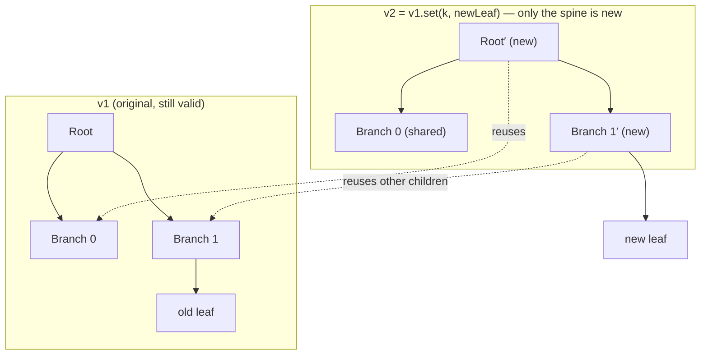

# Immutability — Middle Level

> **Roadmap:** [Functional Programming](../README.md) → Immutability
>
> *Knowing that immutable data is safer is the junior lesson. Using it well — updating without mutating, sharing structure instead of deep-copying, and knowing the few places where mutation is still the right call — is the middle one.*

---

## Table of Contents

1. [Introduction](#introduction)
2. [Prerequisites](#prerequisites)
3. [Immutable Update Patterns](#immutable-update-patterns)
4. [Persistent Structures & Structural Sharing](#persistent-structures--structural-sharing)
5. [Copy-on-Write & Defensive Copying](#copy-on-write--defensive-copying)
6. [Freezing at Boundaries & Value Objects](#freezing-at-boundaries--value-objects)
7. [Trade-offs: When Mutation Is Fine](#trade-offs-when-mutation-is-fine)
8. [Common Mistakes](#common-mistakes)
9. [Test Yourself](#test-yourself)
10. [Cheat Sheet](#cheat-sheet)
11. [Summary](#summary)
12. [Further Reading](#further-reading)
13. [Related Topics](#related-topics)

---

## Introduction

> Focus: **using immutability well in real code**, not just defending why it matters.

At the junior level you learned *what* immutability is and *why* it helps: shared mutable state is the source of aliasing bugs, race conditions, and "who changed this?" debugging sessions. The natural objection follows immediately — **"if I can't change anything, how do I get any work done?"**

The answer is that you don't change values; you **derive new ones**. A bank balance doesn't mutate from 100 to 90 — you produce a *new* balance of 90 and let the old one be garbage-collected. That sounds wasteful until you understand the two ideas that make it cheap and ergonomic:

1. **Update patterns** — concise ways to say "the same thing, but with one field different" (spread, `with`, copy-and-modify, builders).
2. **Structural sharing** — the new value reuses most of the old value's memory instead of copying it.

This file is about wielding those in everyday Go, Java, and Python code, plus the engineering judgment of *where* to enforce immutability (boundaries) and *where* local mutation is perfectly fine.

---

## Prerequisites

- **Required:** You can read [`junior.md`](junior.md) — you know what immutable data is and why shared mutable state causes bugs.
- **Required:** Comfort with one of Go, Java, or Python at the level of structs/records/classes and their standard collections.
- **Helpful:** [Pure Functions & Referential Transparency](../02-pure-functions-and-referential-transparency/middle.md) — immutability is what makes purity practical; the two reinforce each other.
- **Helpful:** A passing sense of how garbage collection / reference counting works, since structural sharing leans on it.
- **Context:** The everyday-code framing of this topic lives in [Clean Code → Immutability](../../clean-code/14-immutability/README.md); this file goes deeper on the *data-structure* mechanics.

---

## Immutable Update Patterns

The whole game is **"return a copy with one thing changed"** expressed without ceremony. Each language has an idiom.

### Copy-and-modify (Go)

Go has no `with` keyword, but **struct assignment copies by value**. That gives you a clean copy-and-modify idiom for free:

```go
type User struct {
    Name  string
    Email string
    Age   int
}

// Return a NEW User; the original is never touched.
func (u User) WithEmail(email string) User {
    u.Email = email // u is already a copy (value receiver)
    return u
}

original := User{Name: "Ada", Email: "ada@old.com", Age: 36}
updated  := original.WithEmail("ada@new.com")
// original.Email == "ada@old.com"   (unchanged)
// updated.Email  == "ada@new.com"
```

The value receiver `u User` (not `*User`) is doing the work: Go hands the method its own copy, so mutating `u.Email` is local. This is idiomatic Go immutability — small value types passed and returned by value.

> **Caveat:** struct copy is **shallow**. If `User` held a `[]string` or a `map`, the copy would share that slice/map header with the original. More on that in [Copy-on-Write & Defensive Copying](#copy-on-write--defensive-copying).

### Records & `with`-style copies (Java)

A Java `record` is immutable by construction — all fields are `final`, no setters:

```java
public record User(String name, String email, int age) {}

User original = new User("Ada", "ada@old.com", 36);

// "Copy with one change" — call the canonical constructor, vary one arg.
User updated = new User(original.name(), "ada@new.com", original.age());
```

For records with many fields, the manual re-listing is noisy. A common pattern is a **wither method** or a small builder:

```java
public record User(String name, String email, int age) {
    public User withEmail(String email) {
        return new User(this.name, email, this.age);
    }
}

User updated = original.withEmail("ada@new.com");
```

> Java 21+ adds **record patterns** for deconstruction, but there is still no language-level `with` (it's a proposed feature). Withers or builders remain the practical answer.

### Spread / replace (Python)

Python's `frozen` dataclass plus `dataclasses.replace` is the cleanest copy-with-change in the standard library:

```python
from dataclasses import dataclass, replace

@dataclass(frozen=True)
class User:
    name: str
    email: str
    age: int

original = User("Ada", "ada@old.com", 36)
updated  = replace(original, email="ada@new.com")
# original.email == "ada@old.com"   (frozen — assignment would raise FrozenInstanceError)
```

`frozen=True` makes attribute assignment raise at runtime and gives you a sensible `__hash__`, so the object can live in a `set` or be a `dict` key. For plain tuples, "update" means rebuilding:

```python
point = (3, 4)
moved = (point[0] + 1, point[1])   # new tuple; tuples have no in-place edit
```

### Builders for multi-step construction

When an object is assembled across many steps (parsing, request building, config), threading copies through each step is awkward. A **builder** collects the mutable working state in one place and emits a single immutable result at the end:

```java
User u = new UserBuilder()
    .name("Ada")
    .email("ada@new.com")
    .age(36)
    .build();   // produces an immutable User
```

The builder itself *is* mutable — and that's fine, because it's **local and unshared** (see [When Mutation Is Fine](#trade-offs-when-mutation-is-fine)). The immutability guarantee applies to the value that escapes, not to the scaffolding used to build it.

| Language | Idiom | One-liner |
|---|---|---|
| Go | value receiver + copy | `func (u User) WithX(x T) User { u.X = x; return u }` |
| Java | `record` + wither / builder | `original.withX(x)` |
| Python | `frozen` dataclass + `replace` | `replace(original, x=...)` |

---

## Persistent Structures & Structural Sharing

The objection to immutable collections is performance: *"copying a 10,000-element list to change one element is O(n) — that's insane."* It would be, if you actually copied. **Persistent data structures** don't.

A **persistent** (a.k.a. functional) data structure preserves the previous version of itself when modified. The trick that makes this cheap is **structural sharing**: the new version reuses the unchanged parts of the old version's internal tree, allocating only the nodes along the path to the change.

### The intuition: an immutable tree

Most persistent collections are implemented as balanced trees (e.g. a 32-way **HAMT** / RRB-tree under the hood). "Updating" a leaf means rebuilding only the spine from root to that leaf — about `log₃₂(n)` nodes, effectively a small constant for any realistic `n` — while every other subtree is **shared by reference** with the old version.



Both `v1` and `v2` are fully usable. `v2` allocated only `Root′` and `Branch 1′`; `Branch 0` and most of `Branch 1`'s children are the *same objects* the original points at. No deep copy, no mutation of `v1`.

The cost profile this buys you:

| Operation | Naive copy-on-write | Persistent (structural sharing) |
|---|---|---|
| Update one element | O(n) copy | ~O(log n), effectively constant |
| Read | O(1) | ~O(log n), effectively constant |
| Memory per version | full copy | only changed path |
| Old version still valid? | yes | yes |

### In practice

- **Python — `pyrsistent`.** A mature persistent-collections library: `PVector`, `PMap`, `PSet`. Updates return new versions and share structure.

  ```python
  from pyrsistent import pvector

  v1 = pvector([1, 2, 3])
  v2 = v1.set(1, 99)     # v2 = [1, 99, 3]; v1 unchanged, shares the rest
  v3 = v1.append(4)      # v3 = [1, 2, 3, 4]; v1 still [1, 2, 3]
  # v1, v2, v3 coexist; no element was copied wholesale
  ```

- **Java — there is no persistent collection in the JDK.** `List.copyOf` / `Collections.unmodifiableList` give you *unmodifiable views or shallow copies*, **not** structural sharing. For real persistent structures reach for a library (Vavr's `io.vavr.collection.List`/`Vector`, or PCollections). Know the difference: "unmodifiable" prevents writes; "persistent" makes *new versions* cheap.

- **Go — no persistent collections in the standard library either.** Idiomatic Go favours small value types and copy-on-write at boundaries; if you need persistent maps/vectors you adopt a library or accept copy costs. Go's pragmatism here is a deliberate trade (see [trade-offs](#trade-offs-when-mutation-is-fine)).

> **Mental model:** "immutable" is the *contract* (you can't change a value in place). "Persistent + structural sharing" is the *implementation* that makes honouring that contract cheap. You can have immutability without structural sharing (you just pay O(n) copies) — the library buys you the efficient version.

---

## Copy-on-Write & Defensive Copying

These two patterns are how you get immutability's safety *without* a persistent-collections library — by controlling exactly when copies happen.

### Copy-on-write (COW)

**Share freely while everyone only reads; copy lazily the moment someone needs to write.** Most readers never trigger a copy, so the common path is allocation-free, and writers can't corrupt readers' view.

```python
# Conceptual COW wrapper around a list.
class CowList:
    def __init__(self, data):
        self._data = data
        self._shared = True       # we don't own this buffer yet

    def get(self, i):             # reads never copy
        return self._data[i]

    def set(self, i, value):      # first write copies, then mutates the private copy
        if self._shared:
            self._data = list(self._data)
            self._shared = False
        self._data[i] = value
```

This is exactly how `slices.Clone` + careful sharing works in Go, and how the JVM's older `CopyOnWriteArrayList` works (every write copies the whole backing array — great for read-mostly, terrible for write-heavy).

### Defensive copying

When you accept a mutable collection from a caller, or hand one back, you face an **aliasing leak**: the caller still holds a reference and can mutate your internal state behind your back. Defensive copying severs the alias at the boundary.

```java
public final class Schedule {
    private final List<LocalDate> dates;

    // COPY on the way IN — caller can't keep a backdoor reference.
    public Schedule(List<LocalDate> dates) {
        this.dates = List.copyOf(dates);   // unmodifiable snapshot
    }

    // COPY (or an unmodifiable view) on the way OUT — caller can't mutate ours.
    public List<LocalDate> getDates() {
        return dates;                       // already unmodifiable; safe to return
    }
}
```

```go
// Go: defensive copy of a slice field, because slice = (ptr, len, cap) header is shared on assignment.
func NewSchedule(dates []time.Time) *Schedule {
    return &Schedule{dates: slices.Clone(dates)} // own a private copy
}
```

The Go example is the classic shallow-copy trap: assigning `s.dates = dates` copies only the *header*; both slices then point at the **same backing array**. `slices.Clone` (Go 1.21+) gives you a real copy of the elements.

> **Rule:** copy at the **trust boundary** — when data crosses into or out of a type that promises immutability. Inside that boundary, with data you fully own, you can skip the copies.

---

## Freezing at Boundaries & Value Objects

You rarely need *everything* immutable. The high-leverage move is to make data immutable **at the boundaries** — the points where it's shared, persisted, sent across threads, or returned to callers — while allowing pragmatic mutation in private, local scopes.

### Freeze at the edge

| Boundary | Why freeze here | Mechanism |
|---|---|---|
| Returning internal state | Caller could mutate your guts | `List.copyOf` / `slices.Clone` / `frozen` |
| Map / cache keys | A mutated key corrupts the structure | `frozen` dataclass, `record`, value-type struct |
| Crossing thread boundaries | Eliminates data races by construction | Immutable value passed to the goroutine/thread |
| Public API DTOs | Callers shouldn't depend on mutability | `record` / read-only struct |
| Configuration loaded at startup | Read everywhere, written once | Freeze after load |

Inside a single function, mutate a local accumulator all you like — it never escapes, so it can't be aliased or raced.

### Immutable value objects

A **value object** is defined by its *contents*, not its identity: two `Money(10, "USD")` are equal regardless of which one you created first. Value objects should be immutable, and all three languages give you that with one declaration:

```java
public record Money(long cents, String currency) {}          // Java: equals/hashCode/toString free
```

```python
@dataclass(frozen=True)
class Money:                                                  # Python: frozen → hashable, immutable
    cents: int
    currency: str
```

```go
type Money struct{ Cents int64; Currency string }            // Go: small value struct, passed by value
```

Because they're immutable and compare by value, value objects are safe to use as map keys, safe to share across threads, and trivially safe to cache. Operations return new instances:

```python
ten_usd  = Money(1000, "USD")
twenty   = replace(ten_usd, cents=2000)   # new value; ten_usd untouched
```

---

## Trade-offs: When Mutation Is Fine

Immutability is a default, not a religion. The middle skill is knowing the exceptions.

### The real cost: copies and allocations

Every "update" potentially allocates. With structural sharing that's `O(log n)` and cheap; with naive copy-on-write it's `O(n)` and can dominate a hot loop. The honest trade is **allocation pressure (and GC work) vs. the elimination of an entire class of aliasing/concurrency bugs.** For the vast majority of code, the safety wins easily. For a tight inner loop, measure.

### When mutation is the right call

Mutation is safe and often *better* when the mutable state is **local and not shared**:

1. **Local accumulators.** Building a result inside a function — a slice you `append` to, a map you fill, a `StringBuilder` — that **never escapes** the function. No one else can observe it mid-construction, so there's nothing to corrupt.

   ```go
   func uppercaseAll(in []string) []string {
       out := make([]string, 0, len(in)) // local; mutated freely
       for _, s := range in {
           out = append(out, strings.ToUpper(s))
       }
       return out // becomes the caller's; we no longer touch it
   }
   ```

2. **Builders.** The whole point of a builder is to mutate working state locally, then emit one immutable value. The scaffolding is mutable; the product is not.

3. **Performance-critical hot paths** where profiling shows allocation/copy cost matters — e.g. an in-place sort of a buffer you own, or reusing a pooled object. Reach for this *after* measuring, not by default.

4. **Genuinely stateful domain objects** (a connection pool, a counter, a cache) where the entity's *identity and evolving state over time* is the point. Forcing these into immutability is contortion, not clarity.

> **The litmus test:** *"Can anything other than this function observe this mutation?"* If no — local, unshared, doesn't escape — mutate freely. If yes — shared, returned, stored, sent to another thread — freeze it.

This is the **functional core / imperative shell** idea in miniature: immutable values flow between functions; mutation is quarantined inside small, local scopes. The same boundary discipline scales up in [Effect Tracking](../10-effect-tracking/middle.md).

---

## Common Mistakes

1. **Shallow copy mistaken for deep copy.** Copying a struct/record/object copies references to nested mutable collections, not the collections themselves. `slices.Clone` the field, `List.copyOf` the field — don't assume struct assignment did it. This is the single most common immutability bug in Go and Java.
2. **`final` / `frozen` only freezes the reference, not the target.** A `final List` can still have elements added; a `frozen` dataclass holding a plain `list` field can have that list mutated. Immutability must go **all the way down** to be a real guarantee — use unmodifiable/`frozen`/persistent collections for the contents too.
3. **Confusing "unmodifiable" with "persistent."** `Collections.unmodifiableList` and `List.copyOf` *prevent writes*; they do **not** make creating new versions cheap. If you need many cheap derived versions, that requires a persistent structure (Vavr, `pyrsistent`), not an unmodifiable view.
4. **Deep-copying when you should share.** Defensively deep-copying immutable data on every read is pure waste — if it can't change, sharing the reference is safe and free. Copy at the boundary of *mutable* data, not immutable data.
5. **Forgetting an unmodifiable *view* still reflects the source.** `Collections.unmodifiableList(src)` blocks writes *through the view*, but mutating `src` directly still changes what the view shows. For a true snapshot, copy (`List.copyOf`).
6. **Banning all mutation.** Forcing immutability onto a local accumulator or a builder adds allocations and noise for zero safety benefit — nothing else can see that state. Reserve immutability for things that are *shared*.
7. **Mutable objects as map keys / set members.** Mutate a key after insertion and you've corrupted the structure's invariants (the element is now in the wrong bucket). Keys must be immutable — that's a chief use of `frozen`/`record`/value structs.

---

## Test Yourself

1. In Go, you write `func (u User) WithName(n string) User { u.Name = n; return u }` and `User` has a field `Tags []string`. A caller does `b := a.WithName("x"); b.Tags[0] = "z"`. Does `a.Tags[0]` change? Why?
2. What is the difference between an **unmodifiable** collection (`List.copyOf`) and a **persistent** collection (`pyrsistent.PVector`)? When does the distinction actually matter?
3. Explain *structural sharing* in one sentence, and why it makes immutable updates `~O(log n)` instead of `O(n)`.
4. You accept `List<Item>` in a constructor and store it in a `final` field. Is the object now immutable? What's the gap, and how do you close it?
5. Give two situations where reaching for mutation is the correct engineering choice, and state the property they share.
6. Why must objects used as `dict`/`Map` keys be immutable?

<details>
<summary>Answers</summary>

1. **Yes, `a.Tags[0]` changes too.** The value receiver copies the `User` struct, but a struct copy is **shallow**: both `a.Tags` and `b.Tags` are slice headers pointing at the **same backing array**. To fix, defensively copy the slice in the wither: `u.Tags = slices.Clone(u.Tags)`.
2. **Unmodifiable** prevents writes to *that* collection but copying it to make a changed version is O(n); it's a snapshot/guard. **Persistent** makes deriving new versions cheap (`~O(log n)`) via structural sharing, with all versions coexisting. The distinction matters when you create **many derived versions** (undo history, state per request, diffing) — there, unmodifiable + copy is O(n) each time, persistent is not.
3. *A new version reuses (by reference) all the unchanged subtrees of the old version, allocating only the nodes on the path from the root to the change* — so the work is proportional to the tree's depth (`log n`), not its size (`n`).
4. **Not fully immutable.** `final` freezes the *reference*, not the list's contents, and the caller still holds a reference to the same list — they can mutate it through their copy, or you could expose it and let others mutate yours. Close the gap with a **defensive copy** that is also unmodifiable: `this.items = List.copyOf(items)`, and return it (or another `copyOf`) from getters.
5. (a) A **local accumulator** that never escapes a function; (b) a **builder** mutating working state before emitting one immutable value. (Also: profiled hot paths, genuinely stateful entities.) Shared property: **the mutation is local and unshared — nothing else can observe it**, so there's no aliasing or concurrency risk.
6. The collection places a key in a bucket based on its hash/value *at insertion time*. If the key mutates afterward, its hash/equality changes and the structure can no longer find it (or finds a wrong one) — the invariant is broken. Immutable keys can't drift out from under the structure.

</details>

---

## Cheat Sheet

| Need | Go | Java | Python |
|---|---|---|---|
| Immutable value type | small value struct, pass by value | `record` | `@dataclass(frozen=True)` |
| Copy with one change | value receiver `WithX` | wither / new record / builder | `dataclasses.replace` |
| Defensive copy a collection | `slices.Clone` / `maps.Clone` | `List.copyOf` | `tuple(...)` / `frozenset(...)` |
| Unmodifiable view | (none built-in) | `Collections.unmodifiableList` | — |
| Persistent (cheap versions) | library (e.g. immutable libs) | Vavr / PCollections | `pyrsistent` |
| Safe map key | value struct | `record` | `frozen` dataclass / tuple |

**Three rules of thumb:**
- *Freeze at boundaries (returns, keys, threads, APIs); mutate freely in local, unshared scopes.*
- *Copy at the boundary of **mutable** data — never deep-copy immutable data, just share it.*
- *Immutability must go all the way down: `final`/`frozen` freezes the reference, not the contents.*

---

## Summary

- Immutability is workable because you **derive new values** instead of changing old ones — and two ideas make that ergonomic and cheap: **update patterns** (copy-and-modify, `with`/withers, `replace`, builders) and **structural sharing**.
- **Persistent data structures** reuse the unchanged subtrees of the previous version, allocating only the path to the change — turning a naive `O(n)` copy into an effectively-constant `~O(log n)` update while keeping every version valid. The JDK and Go std-lib don't ship these; `pyrsistent` (Python) and Vavr/PCollections (Java) do.
- **Copy-on-write** shares while reading and copies lazily on first write; **defensive copying** severs aliasing at the trust boundary. Beware the **shallow-copy trap** — struct/object copies share nested mutable collections.
- The pragmatic stance is to **freeze at boundaries** (returns, keys, thread hand-offs, public DTOs, value objects) and allow **local, unshared mutation** (accumulators, builders, profiled hot paths). The litmus test: *can anything else observe this mutation?*
- Next: [`senior.md`](senior.md) — persistent-structure internals (HAMT/RRB-trees), lenses for deep updates, and immutability under real concurrency and performance constraints.

---

## Further Reading

- **Purely Functional Data Structures** — Chris Okasaki (1998) — the foundational text on persistent structures and structural sharing.
- **Ideal Hash Trees** — Phil Bagwell (2001) — the HAMT, which underlies most modern persistent maps/vectors.
- **Effective Java** — Joshua Bloch (3rd ed., 2018) — Item 17 "Minimize mutability," defensive copying, and value-based classes.
- **pyrsistent documentation** — practical persistent collections for Python.
- **Out of the Tar Pit** — Moseley & Marks (2006) — why eliminating mutable state attacks accidental complexity at its root.

---

## Related Topics

- [Immutability — Junior](junior.md) — what immutable data is and why shared mutable state causes bugs.
- [Pure Functions & Referential Transparency](../02-pure-functions-and-referential-transparency/middle.md) — immutability is the precondition that makes purity practical.
- [Map / Filter / Reduce](../04-map-filter-reduce/middle.md) — transformations that *produce* new collections rather than mutating in place.
- [Effect Tracking](../10-effect-tracking/middle.md) — the functional-core / imperative-shell discipline that scales "freeze at boundaries" to whole systems.
- [Clean Code → Immutability](../../clean-code/14-immutability/README.md) — the everyday-code framing of the same principle.
