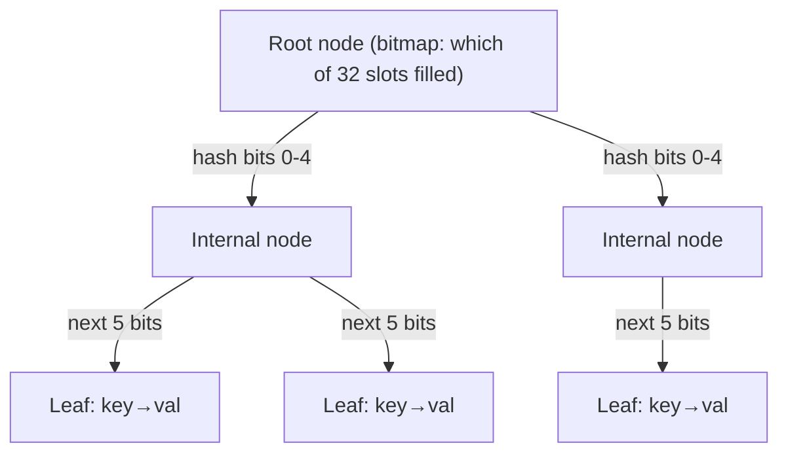
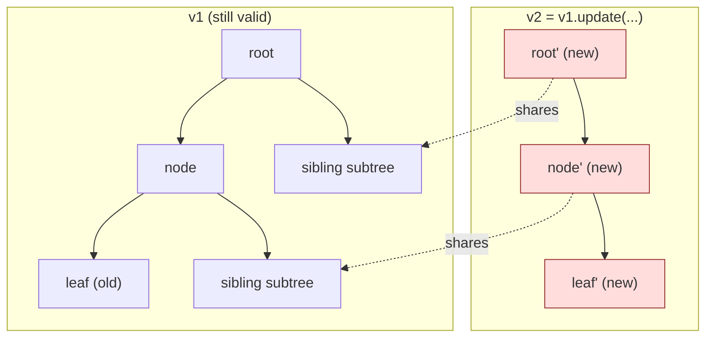

# Immutability — Professional Level

> **Roadmap:** [Functional Programming](../README.md) → Immutability
>
> *Immutability is not free, and it is not expensive — it is a trade you make against the memory system. This file is about the receipts: how persistent collections share structure in O(log n), what those updates cost the garbage collector and the cache, and how to measure whether immutability is helping or hurting on your workload.*

---

## Table of Contents

1. [Introduction](#introduction)
2. [Prerequisites](#prerequisites)
3. [Persistent Structure Internals](#persistent-structure-internals)
4. [GC, Allocation, and Cache Reality](#gc-allocation-and-cache-reality)
5. [Copy-on-Write Internals](#copy-on-write-internals)
6. When Immutability Helps, When It Hurts — and How to Measure
7. [Common Mistakes](#common-mistakes)
8. [Test Yourself](#test-yourself)
9. [Cheat Sheet](#cheat-sheet)
10. [Summary](#summary)
11. [Further Reading](#further-reading)
12. [Related Topics](#related-topics)

---

## Introduction

> Focus: **what immutability costs and saves the machine** — allocation rate, GC pressure, cache locality, copy size — and **how persistent data structures make "create a modified copy" cheap enough to use by default.**

The earlier levels argued *why* immutable values make code easier to reason about: no aliasing surprises, no defensive copies, safe sharing across threads. All true. But every senior engineer eventually hits the objection that ends the conversation: *"a new copy on every change is too slow."* That objection is correct for the naive implementation and almost always wrong for the real one. The gap between the two is the subject of this file.

The mechanism that closes the gap is **structural sharing**: an "update" to a persistent collection does not copy the whole structure — it copies only the *path* from the root to the changed node and reuses (shares) everything else. The old version and the new version coexist, both valid, both immutable, sharing the vast majority of their memory. For a tree with ~32-way branching, that path is `O(log₃₂ n)` deep — effectively a small constant for any collection you will hold in RAM.

Two disciplines define this level:

1. **Never argue immutability's cost from intuition.** "Copies are slow" and "the GC will handle it" are both guesses until you have an allocation profile and a GC trace. Every claim here is paired with the instrument that proves it on *your* code; illustrative numbers are labeled as such.
2. **Know when the cheap-update model breaks.** Persistent structures make *sharing* cheap. They do **not** make copying a flat, contiguous array cheap. Immutability over a million-element `[]float64` you mutate per element is a different — and often losing — proposition than immutability over a tree. Knowing which shape you have is the whole game.

> **The mental model:** an immutable value is a *commitment never to mutate in place*. Persistent data structures honor that commitment by trees with fat fan-out, so "modify" becomes "allocate a thin spine and share the rest." The bill arrives as short-lived allocations — which a generational GC is purpose-built to clear cheaply, and which Go's escape analysis can sometimes erase entirely.

There are really three numbers in tension, and the entire professional discussion is about which one dominates *your* workload:

1. **Update cost** — `O(log n)` for a persistent structure, `O(n)` for naive full copy, `O(1)` for in-place mutation. This is where structural sharing earns its keep.
2. **Allocation/GC cost** — proportional to how much garbage you generate *and how long it lives*. Cheap when garbage dies young, expensive when versions are retained.
3. **Read/scan cost** — dominated by cache locality. Flat contiguous memory wins; pointer-linked trees lose.

A mutable flat array optimizes (3) and (1) at the cost of safe sharing; a persistent structure optimizes (1) and safe sharing at the cost of (3); a naive full-copy approach optimizes nothing and is the strawman people benchmark to "prove" immutability is slow. The senior skill was choosing immutable vs mutable APIs; the professional skill is knowing *which of these three numbers your hot path is actually paying* and reaching for the structure that minimizes it — then proving it with a profiler.

---

## Prerequisites

- **Required:** Fluent with [`senior.md`](senior.md) — you can choose immutable vs mutable APIs under production constraints and reason about thread-safety from immutability.
- **Required:** A working model of a managed runtime: heap vs stack, a tracing/generational GC's young vs old generation, allocation as a pointer bump, escape analysis (Go) and JIT escape analysis (JVM).
- **Required:** You can read an allocation profile and a GC trace and tell a real regression from noise.
- **Helpful:** Familiarity with CPU cache lines (~64 bytes), pointer-chasing vs sequential access, big-o-analysis for the `O(log n)` vs `O(n)` distinction.
- **Helpful:** profiling-techniques and memory-leak-detection skills for the measurement vocabulary used throughout.

---

## Persistent Structure Internals

A **persistent** data structure preserves all previous versions when modified — every update returns a new version and the old one stays valid and unchanged. The naive way to get persistence is full copy-on-write: copy everything on every change. The professional way is **structural sharing** via wide, shallow trees. Three families cover almost everything you will meet.

### 1. HAMT — maps and sets (Clojure, Scala, many JVM/JS libraries)

A **Hash Array Mapped Trie** is the workhorse behind immutable maps and sets. It is a trie keyed on the *bits of a key's hash*. Each node consumes a 5-bit slice of the hash (32 possible children — hence ~32-way branching) and uses a **bitmap** plus a *compact* child array so empty slots cost nothing: the bitmap's popcount tells you how many real children exist and where a given child sits in the dense array.



To **insert/update** a key: hash it, walk down 5 bits at a time to the leaf, then build a new path back up — a fresh leaf, fresh copies of each node *on that path only*, each pointing at the **shared** unchanged siblings of the old tree. Everything not on the path is reused by pointer. Lookup, insert, and delete are all `O(log₃₂ n)` — for a 10-million-entry map that is depth ≈ 5. Practitioners and the literature often call this "effectively O(1)" because the depth is bounded by a tiny constant for any realistic size.

```text
Update key K in a HAMT with N entries:
  copied:  the ~5 nodes on the root→leaf path        (≈ 5 small allocations)
  shared:  every other node — i.e. essentially all   (0 allocations)
  vs naive immutable map copy: N node copies
```

Two implementation details matter at the professional level. First, the **bitmap + popcount** trick is what keeps a 32-way node small: instead of a 32-slot array mostly full of nulls, the node stores a 32-bit bitmap of which slots are occupied and a *dense* array of only the present children; to find child `i` you `popcount` the bitmap below bit `i`. A node with three children is a 3-element array, not a 32-element one — so the tree is fat in *fan-out* but lean in *memory*. Second, **hash collisions** (two distinct keys whose full hashes are equal, or equal in all consumed bits) are handled by a special collision-leaf node holding a small list; this is rare with a good hash and bounded, so it doesn't change the asymptotics. **Transients** are the other professional escape hatch: Clojure and Scala expose a *mutable-during-construction* mode (`transient`/builder) that skips path copying while you build a collection in one thread, then `persistent!` freezes it — giving you mutable-speed bulk construction with an immutable result, the best of both. This is the same functional-core / imperative-shell idea applied inside one data structure.

### 2. Bitmapped Vector Trie / RRB Trie — vectors (Clojure's vector, Scala's `Vector`)

Indexed sequences use a tree of the same shape but indexed by the *integer index's* bits rather than a hash. Clojure's `PersistentVector` is a 32-way **bitmapped vector trie**: the index's bits pick the child at each level, leaves are arrays of 32 elements, and the tree depth is `⌈log₃₂ n⌉`. Indexing, `assoc` (update at index), and `conj` (append) are all `O(log₃₂ n)` with the same path-copying-plus-sharing trick, plus a small "tail" buffer that makes repeated appends amortized O(1).

**RRB trees** (Relaxed Radix Balanced) extend this so that *concatenation* and *slicing* of two persistent vectors are also `O(log n)` — they relax the strict "every node full" radix invariant and store sub-tree sizes so unbalanced joins stay logarithmic. This is what makes Scala's `Vector` and Clojure's RRB vectors viable as general-purpose sequences, not just stacks.

### 3. Balanced trees — sorted maps/sets, finger trees

When you need *ordered* iteration or range queries, the persistent structure is a **balanced search tree** (red-black or weight-balanced) used persistently: an update copies the root-to-leaf path (`O(log n)` nodes) and shares the rest. Haskell's `Data.Map`/`Data.Set` and Scala's `TreeMap` are this. **Finger trees** add `O(1)` amortized access to both ends and `O(log n)` split/concat — the backbone of Haskell's `Data.Sequence`.

### The unifying idea: path copying

Every one of these does the same thing — **path copying with structural sharing**:



Only the red nodes are allocated; both `v1` and `v2` are fully usable, fully immutable, and share the entire grey subtree. The cost of an "immutable update" is therefore **the depth of the tree, not its size** — and depth is `log₃₂ n`, a number that barely moves between a thousand and a billion elements.

### What each ecosystem actually ships

The professional reality is that you rarely *implement* these — you pick a library and must know its cost model. The three project languages differ sharply:

- **Clojure** makes persistent collections the *default* — `{}`, `[]`, `#{}` literals are HAMT-backed maps/sets and a bitmapped vector trie, with transients for bulk construction. Immutability is the path of least resistance and structural sharing is automatic.
- **Scala** ships `immutable.HashMap` (a HAMT, specifically a CHAMP variant that improves iteration and memory locality) and `immutable.Vector` (RRB-based). You opt in by importing from `scala.collection.immutable`; the mutable collections are a deliberate, separate choice.
- **Java** has no persistent collections in the standard library — `List.of`/`Map.of` produce *unmodifiable* views (throw on mutation) but are **not** persistent: there is no cheap "with one more element" operation; you copy. For true structural sharing on the JVM you reach for a library (Vavr, PCollections, or Clojure's collections directly). This is why a Java engineer must be especially careful: "immutable" in `Collections.unmodifiableList` means *"you can't change it"*, not *"changing it is cheap."*
- **Go** has neither persistent collections nor an unmodifiable-collection type in the standard library — immutability is a *convention* enforced by value semantics, unexported fields, and copy-at-the-boundary discipline. The `slices`/`maps` helpers copy; there is no structural sharing unless you build or import a HAMT.
- **Python** gives you immutable `tuple`/`frozenset`/`str`/`bytes` but no persistent map/vector in the stdlib; libraries like `pyrsistent` provide HAMT-backed `PMap`/`PVector` when you need cheap updates on shared big data.

The lesson: *"immutable" and "persistent" are different guarantees.* Immutable means *cannot be changed*; persistent means *changing it cheaply produces a new version that shares structure*. Java's `List.of` and Python's `tuple` are immutable but not persistent — update them and you pay `O(n)`. Confusing the two is how teams "go immutable" and then discover their hot path copies whole collections.

---

## GC, Allocation, and Cache Reality

Structural sharing makes updates *algorithmically* cheap. The runtime story is more nuanced: immutability trades **in-place mutation** for **short-lived allocation**, and whether that trade pays depends entirely on your runtime's allocator, GC, and the access pattern's cache behavior.

### 1. Immutability means more short-lived allocations — and that's mostly fine

Each persistent update allocates the few path nodes. In a hot loop that updates a map a million times, that is millions of small objects — but they are overwhelmingly **short-lived** (the intermediate versions are usually dropped immediately). This is precisely the workload a **generational GC** is built for: the *weak generational hypothesis* says most objects die young, so the young generation (Go's nursery-like behavior via the tri-color collector; the JVM's Eden) is collected cheaply and frequently, and only survivors get promoted. Allocation itself is typically a **pointer bump** in a thread-local buffer — on the order of a few nanoseconds — not a `malloc` syscall.

So the honest framing is: immutability raises **allocation rate**, not necessarily **GC pause time**, *as long as the garbage dies young*. The danger is when intermediate versions *survive* (you keep references to many historical versions) — then they promote to the old generation and you pay for major collections. Measure the difference, don't assume it.

There is a second-order effect worth naming: a tracing GC's pause cost is driven by the volume of **live** objects it must mark, not the dead ones it reclaims. Persistent structures keep many small live nodes around (the shared subtrees of every retained version), so a long-lived persistent collection can *inflate the live set* the GC scans on every cycle — even though no single update is expensive. The 32-way fan-out helps here too: fewer, fatter nodes means fewer objects for the GC to mark than a binary tree of the same size would have. If you hold large persistent structures for the life of the process, watch the *mark phase* duration, not just the allocation rate.

```text
gctrace reading (Go), illustrative — the two failure modes:
  HEALTHY:  young garbage, short pauses, heap returns to baseline each cycle
            gc 142 @3.1s 0%: 0.05+1.2+0.03 ms clock, heap 80→40 MB  ← dies young
  DANGER:   retained versions promoted, live set grows, mark phase climbs
            gc 143 @3.4s 2%: 0.05+9.8+0.03 ms clock, heap 400→380 MB ← survives
```

### 2. Escape analysis can erase the cost (Go and the JVM)

A modern compiler that can *prove* an allocation never outlives its function will put it on the **stack** instead of the heap — zero GC cost. In Go this is escape analysis; you see its decisions directly:

```go
// Go — does this allocation escape to the heap, or stay on the stack?
type Point struct{ X, Y int }

func translate(p Point, dx int) Point {
    return Point{X: p.X + dx, Y: p.Y} // returned by VALUE — copy semantics
}
```

```bash
# Ask the compiler what it decided. -m prints escape/inline analysis.
go build -gcflags='-m -m' ./... 2>&1 | grep -E 'escapes|does not escape|moved to heap'
# Output like:
#   ./p.go:5:6: can inline translate
#   ./p.go:5:24: p does not escape          ← stays on stack, no GC cost
```

Go's value semantics are an underrated immutability tool: passing and returning **small structs by value** is a copy, but a cheap stack copy that the compiler often keeps register-resident. The cost only appears when a value **escapes** — captured by a closure, stored in an interface, returned by pointer, or grown beyond what the compiler will stack-allocate — at which point it "moves to heap." On the JVM, the analogous optimization is **scalar replacement** driven by JIT escape analysis (`-XX:+PrintEscapeAnalysis`, and inlining via `-XX:+PrintInlining`), which can dissolve a short-lived immutable object into registers entirely.

### 3. Cache locality: persistent trees lose to flat arrays on scans

This is immutability's real runtime weakness and the one practitioners most often miss. A flat array is **contiguous**: a sequential scan streams cache lines and the prefetcher feeds the CPU perfectly — near-zero cache misses. A persistent tree is a graph of separately-allocated nodes connected by pointers; iterating it is **pointer chasing**, and each hop risks a cache miss (~100+ cycles to main memory). For read-heavy, scan-the-whole-thing workloads, the flat array wins decisively on locality even though both are "O(n)."

```text
Sequential sum of 10M ints:
  flat []int (contiguous):     streams cache lines, prefetcher happy → fast
  persistent vector (32-way):  leaf arrays are contiguous (good!), but
                               crossing nodes chases pointers → more misses
```

The 32-way branching is partly a *cache* decision, not just an algorithmic one: fat leaves (arrays of 32) keep most accesses inside a contiguous block, so persistent vectors are far better on locality than a binary tree would be — but still behind a single flat array. Confirm with `perf stat -e cache-misses,cache-references` on the scan.

```text
Sum 10M ints, before/after (labeled-illustrative; reproduce with benchstat + perf):
  flat []int:          ~3 ms,  ~0.4M cache-misses    (contiguous, prefetched)
  persistent vector:   ~9 ms,  ~3.1M cache-misses    (node-crossing pointer chase)
  binary persistent:   ~22 ms, ~9M  cache-misses     (why fan-out matters)
The flat array wins ~3x on a pure scan — but it cannot give you O(log n) shared
updates. The trade is locality-for-cheap-updates; pick by which dominates YOUR
workload, and prove it with the cache-miss counter, not intuition.
```

### 4. The cost of defensive copies — what immutability *removes*

The flip side: mutable shared data forces **defensive copies**. Every API that returns mutable internal state must copy it (or risk a caller mutating your insides); every setter that accepts a mutable collection must copy it on the way in. These copies are `O(n)`, eager, and frequent — and immutability eliminates *all* of them, because sharing an immutable value is free and safe. A persistent map handed to ten callers is one allocation; a mutable map handed to ten callers that each need isolation is ten `O(n)` copies. When you tally immutability's allocation cost, you must net out the defensive copies it deletes — that is often where it comes out ahead.

```go
// Mutable internal state forces a defensive copy on EVERY getter call — O(n) each.
func (c *Cache) Keys() []string {
    out := make([]string, len(c.keys)) // defensive copy: caller must not mutate ours
    copy(out, c.keys)                  // O(n) allocation per call, per caller
    return out
}

// An immutable (frozen, never-mutated) slice can be returned directly — O(1), shared.
func (c *Cache) Keys() []string { return c.frozenKeys } // safe BY CONTRACT, no copy
```

The second form is only correct if `frozenKeys` is genuinely never mutated after construction — that is the *commitment* immutability makes. Get the contract right and you delete an `O(n)` allocation from every getter call; get it wrong and you have an aliasing bug. This is the trade the professional weighs: a discipline (never mutate) in exchange for deleted copies and safe sharing.

> **Diagnose it:** allocation rate and where bytes are born → Go `-memprofile` + `pprof -alloc_space`, JFR allocation events, Python `tracemalloc`; promotion/pause behavior → `GODEBUG=gctrace=1`, JVM `-Xlog:gc*`; locality → `perf stat -e cache-misses`; stack-vs-heap → Go `-gcflags=-m`, JVM escape-analysis flags.

---

## Copy-on-Write Internals

**Copy-on-write (COW)** is the lightweight cousin of full structural sharing: multiple readers share one underlying buffer, and a copy is made **only at the moment someone writes**. It gives you immutability's safety (readers can't be surprised) while deferring — and often avoiding — the copy.

### Where COW lives

- **CPython strings and `bytes`** are immutable; "modifying" one allocates a new object. `tuple` and `frozenset` are immutable too. Python's value model leans on this heavily — and the classic trap is `s += x` in a loop over strings, which is `O(n²)` because each `+=` allocates a whole new string; the idiom is to accumulate in a `list` and `"".join()` once at the end (build mutable, freeze at the boundary, again). CPython's reference-counting GC also interacts with this: a brand-new immutable copy whose old version's refcount drops to zero is freed *immediately* (no waiting for a GC cycle), so short-lived intermediate immutables in CPython are reclaimed eagerly — but you still paid to allocate every one of them.
- **The OS does COW for you** on `fork()`: the child shares the parent's pages read-only; the kernel duplicates a page only when one side writes it. Same idea, page-granular.
- **Java's `CopyOnWriteArrayList`/`CopyOnWriteArraySet`** copy the entire backing array on *every* mutation, so readers never lock and never see a torn state. This is COW at its bluntest — and its cost model is the warning label below.
- **Go slices** are a subtle, *manual* COW hazard: a slice is a (pointer, len, cap) header over a shared backing array. Two slices can alias the same array; a write through one is visible through the other, and `append` copies *only* when capacity is exceeded. Go gives you no automatic COW — you must copy explicitly (`append([]T(nil), s...)` or `copy`) when you want isolation.

```go
// Go — the COW hazard: s2 aliases s1's backing array until a realloc.
s1 := []int{1, 2, 3}
s2 := s1[:2]        // shares the SAME backing array
s2[0] = 99          // mutates s1[0] too — surprise aliasing!
s2 = append(s2, 7)  // may overwrite s1[2] if cap allows, OR realloc if not
// Explicit copy = manual COW boundary:
s3 := append([]int(nil), s1...) // s3 is independent; mutate freely
```

### The COW cost model — and when it degrades

COW shines when writes are **rare relative to reads**: you pay a copy occasionally and share cheaply the rest of the time. It **degrades to full copies** when writes are frequent — and `CopyOnWriteArrayList` is the cautionary tale: an `add()` in a loop copies the whole array each time, turning N appends into `O(N²)` total work and N short-lived arrays for the GC.

```text
CopyOnWriteArrayList, 10k sequential add() calls (labeled-illustrative):
  total array bytes copied ≈ 1 + 2 + ... + 10_000 = ~50M element-copies → O(N²)
  vs ArrayList add():       amortized O(1) per add, doubling growth → O(N) total
```

The rule: COW is for **read-mostly** shared data (config snapshots, listener lists that rarely change). For write-heavy data, reach for a real persistent structure (path copying, `O(log n)` per write) or a mutable structure behind a lock — never a full-copy COW in a write loop.

A useful way to see the spectrum: **full-copy COW** (`CopyOnWriteArrayList`) copies *everything* on every write — O(n) per write, O(1) read, structural sharing of nothing. A **persistent structure** copies only the *path* — O(log n) per write, O(log n) read, sharing of almost everything. **In-place mutation** copies nothing — O(1) per write, but no safe sharing without a lock. COW is the right point on that spectrum *only* when writes are rare enough that the occasional full copy is cheaper than maintaining a tree. The moment writes become frequent, COW is strictly the worst choice — it has the per-write cost of full copying *and* the GC churn of allocating a fresh whole buffer each time.

---

## When Immutability Helps, When It Hurts — and How to Measure

The professional judgment is not "immutable everywhere" or "mutable for speed" — it is matching the *shape of the data and the access pattern* to the right tool, then proving it with numbers.

### Where immutability HELPS (and the cost is small or negative)

- **Sharing without defensive copies.** Hand the same immutable value to N consumers, threads, or cache entries — one allocation, zero copies, zero aliasing bugs. This often makes immutable code allocate *less* than mutable-plus-defensive-copies code.
- **Lock-free concurrency.** An immutable snapshot needs no lock to read. Publish a new version with a single atomic pointer swap (compare-and-swap on a root reference) and readers either see the old complete version or the new complete version — never a torn intermediate. This is how Clojure's atoms, persistent collections, and software-transactional memory get scalable reads. No reader-writer lock, no read contention. The write path becomes a CAS loop — read the current root, compute a new persistent version (cheap path copy), CAS the root from old to new, retry on contention — which is wait-free for readers and lock-free for writers:

```go
// Go — lock-free publication of an immutable snapshot via atomic pointer swap.
// Readers never lock; they load a complete, consistent version.
type Config struct{ /* immutable fields */ }
var current atomic.Pointer[Config]

func read() *Config { return current.Load() }   // wait-free, no lock, no copy

func update(mutate func(*Config) *Config) {
    for {
        old := current.Load()
        nw := mutate(old)            // build a NEW immutable version (shares structure)
        if current.CompareAndSwap(old, nw) {
            return                   // published atomically; readers see old OR new
        }                            // lost the race → retry against fresh root
    }
}
```
- **Time travel / auditing / undo.** Because old versions persist for free (structural sharing), keeping history is nearly free: undo stacks, event sourcing, snapshot isolation, and debugging "what did this look like 3 versions ago" all fall out of the structure.
- **Cache keys and memoization.** Immutable values have stable identity/hash and are safe to use as map keys and memo keys — no risk of a key mutating out from under the table.

### Where immutability HURTS (and you should reach for mutation, fenced off)

- **Huge per-update copies of flat structures.** If your data is a large contiguous buffer (`[]float64`, a bitmap, an image) and you update it element-by-element, a *naive* immutable copy is `O(n)` **per update** — quadratic over a loop. Persistent structures help only if you actually use one; an immutable-by-full-copy flat array in a hot loop is the worst case.
- **Tight numeric inner loops.** A physics step or matrix kernel that scans and updates contiguous memory wants in-place mutation for cache locality and vectorization. Allocating a new array per iteration thrashes the GC and defeats SIMD.
- **Single-owner, never-shared local state.** A buffer built up inside one function and never escaping has no aliasing risk — immutability buys you nothing and costs allocations. Build it mutably, freeze (or just return) at the boundary.

The Java example below shows the canonical mismatch — an immutable-style accumulation that secretly does `O(n²)` work because each "append" rebuilds the whole array:

```java
// HURTS — immutable-by-full-copy in a build loop: O(n²) total, n throwaway arrays.
int[] acc = new int[0];
for (int x : source) {
    int[] next = Arrays.copyOf(acc, acc.length + 1); // copies ALL prior elements
    next[acc.length] = x;                            // → 1+2+...+n element copies
    acc = next;                                      // each old array is garbage
}

// HELPS — build mutably (single owner, never escapes), expose immutably at the edge.
List<Integer> tmp = new ArrayList<>();               // amortized O(1) per add
for (int x : source) tmp.add(x);
List<Integer> result = List.copyOf(tmp);             // one freeze at the boundary
```

This is the functional-core / imperative-shell rule applied locally: *mutate where you own it, publish immutable where you share it.* The immutability that matters is the immutability **callers can observe** — internal mutation that never escapes is invisible and free.

### Before/After: naive full-copy vs structural sharing

The decisive comparison. Updating a 1,000,000-entry map 100,000 times:

```text
Approach A — naive immutable map (full copy on every put):
  per update:   copy all 1,000,000 entries        → O(n)
  100k updates: ~100,000,000,000 entry-copies      → O(n·u)  (minutes; GC on fire)

Approach B — persistent HAMT (path copying):
  per update:   copy ~5 path nodes, share the rest → O(log₃₂ n)
  100k updates: ~500,000 small node allocations     → O(u·log n)  (milliseconds)

Labeled-illustrative ratio: ~200,000x fewer allocations for B at n=1e6.
Both are immutable and thread-safe; only B is usable. MEASURE on your data
(JMH for the JVM, testing.B + benchstat for Go) before trusting any ratio.
```

The lesson is not "immutability is fast" — it is "**immutability is fast *with the right structure*; immutability via full copy is the slow strawman people benchmark and reject.**"

### How to measure (per language)

| Concern | Go | Java / JVM | Python |
|---|---|---|---|
| **Allocation / heap** | `-memprofile`, `pprof -alloc_space` / `-alloc_objects` | JFR allocation events, async-profiler `-e alloc` | `tracemalloc`, `memray` |
| **Object / value size** | `unsafe.Sizeof`, field-order check | `jol` (Java Object Layout) | `sys.getsizeof`, `pympler` |
| **GC behavior / pauses** | `GODEBUG=gctrace=1`, `go tool trace` | `-Xlog:gc*`, JFR GC events | `gc` module stats, generational counts |
| **Stack vs heap (escape)** | `go build -gcflags='-m -m'` | `-XX:+PrintEscapeAnalysis`, `+PrintInlining` | (n/a — CPython doesn't stack-allocate objects) |
| **Cache locality** | `perf stat -e cache-misses` | `perf`, async-profiler hw events | `perf stat python …` |
| **Microbenchmark** | `testing.B` + `benchstat` | JMH (with `-prof gc` for alloc rate) | `pyperf`, `timeit` |

```bash
# Go: prove the allocation cost of an immutable-update benchmark
go test -bench=Update -benchmem -memprofile=mem.out ./...
go tool pprof -alloc_space mem.out      # where bytes are born

# Go: did the value escape, or stay on the stack?
go build -gcflags='-m -m' ./... 2>&1 | grep -E 'escapes|moved to heap|does not escape'
```

```python
# Python: measure the real footprint and churn of "copy" semantics
import sys, tracemalloc
t = (1, 2, 3)                       # immutable
print(sys.getsizeof(t))             # shallow size of the tuple object
tracemalloc.start()
xs = tuple(range(1_000_000))
new = xs + (999,)                   # NAIVE: builds a whole new tuple → O(n)!
cur, peak = tracemalloc.get_traced_memory()
print(cur, peak)                    # see the full-copy cost; this is why Python
                                    # uses a real persistent lib for big shared data
```

> **Discipline:** if you cannot point at the allocation profile, GC trace, or `perf` counter that would *falsify* your claim about immutability's cost, you are guessing. Capture a baseline, change one thing (structure, or mutability), re-measure.

---

## Common Mistakes

Professional-level mistakes — subtle, and therefore expensive:

1. **Benchmarking immutability with full copies and concluding it's slow.** The naive `newMap = copy(oldMap); newMap[k] = v` is `O(n)` per update by construction. That is not what a persistent map does. Compare against a real HAMT/persistent vector before rejecting immutability.
2. **Assuming the GC will absorb everything.** It absorbs *young* garbage cheaply. If you retain many intermediate versions (e.g., an unbounded undo history), they promote to the old generation and you pay major GC. Check promotion with `gctrace`/`-Xlog:gc*`, not faith.
3. **Ignoring cache locality on read-heavy scans.** Replacing a flat array with a persistent tree for data you mostly *iterate* trades pointer-chasing cache misses for a feature you don't use. If writes are rare and scans are hot, a flat immutable array (copied rarely) may beat a tree.
4. **Treating Go slices as immutable.** A slice header shares its backing array; `s[:2]` and `append` can mutate or alias data you thought you copied. Copy explicitly at the boundary, or you have a mutation-through-aliasing bug, not immutability.
5. **Using `CopyOnWriteArrayList` for write-heavy data.** It copies the whole array on every mutation — `O(n²)` over a build loop and a GC firehose. COW is read-mostly only.
6. **Letting escape analysis surprise you.** A small struct you assumed was stack-allocated escapes because you captured it in a closure or stored it in an interface — now it's heap garbage in a hot loop. Verify with `-gcflags=-m`; restructure to keep it on the stack.
7. **Forgetting to net out defensive copies.** Reporting immutability's allocation cost without subtracting the `O(n)` defensive copies it *eliminates* makes it look worse than it is. Compare total allocations of both real designs, not just the immutable side's.
8. **Persistent structures for single-owner local state.** A buffer that never escapes one function gains nothing from persistence and pays for it. Build mutably, expose immutably at the boundary (the functional-core / imperative-shell split).

---

## Test Yourself

1. Explain why a HAMT update is `O(log₃₂ n)` rather than `O(n)`, and name exactly what gets allocated versus shared on a single `put`.
2. Why is the high allocation rate of immutable updates usually *not* a GC catastrophe, and under what condition does it become one? What would you measure to tell the difference?
3. A teammate benchmarks "immutable maps" against a mutable `HashMap`, finds them 1000x slower, and proposes banning immutability. What is almost certainly wrong with the benchmark?
4. On a read-heavy workload that scans 10M elements end to end, a flat `[]int` beats a persistent vector even though both are O(n). Explain the cache-level reason and the tool you'd use to confirm it.
5. Why are two Go slices a copy-on-write hazard, and what is the explicit operation that gives you a true independent copy?
6. When does immutability make code allocate *less* than the mutable alternative? (Hint: think about what mutable shared state forces you to do at API boundaries.)
7. You return a small struct by value from a Go function and want it stack-allocated. What could cause it to escape to the heap, and how do you verify the compiler's decision?

<details>
<summary>Answers</summary>

1. A HAMT is a trie over the key's hash bits, 5 bits (32-way) per level, so its depth is `⌈log₃₂ n⌉` ≈ a small constant (≈5 at n=10M). A `put` walks root→leaf along that path, then allocates a **fresh copy of each node on the path** (≈5 nodes) plus the new leaf; **every off-path subtree is shared by pointer** with the old version. So you allocate the depth, not the size.
2. The intermediate versions are overwhelmingly **short-lived**, and a generational GC collects young garbage with cheap, frequent minor collections (allocation itself is a pointer bump). It becomes a problem when intermediate versions **survive** — you retain references (e.g., unbounded history), they get **promoted to the old generation**, and you pay major/full GCs. Measure promotion and pause time via `GODEBUG=gctrace=1` / JVM `-Xlog:gc*` and an allocation profile.
3. The benchmark almost certainly implements "immutable" as **full copy on every update** (`copy then mutate`), which is `O(n)` per put by construction — the slow strawman. A real persistent map (HAMT) does path copying at `O(log₃₂ n)` per put with structural sharing. Re-benchmark against an actual persistent collection (Clojure's, Scala's, or a Go/Java HAMT library) with `-benchmem`/JMH `-prof gc`.
4. A flat array is **contiguous**, so a sequential scan streams cache lines and the hardware prefetcher hides memory latency — near-zero misses. A persistent vector is a tree of separately-allocated nodes linked by pointers; crossing nodes is **pointer chasing**, each hop risking a ~100+ cycle cache miss. (Its 32-element leaves are contiguous, which helps, but it still trails a single flat buffer.) Confirm with `perf stat -e cache-misses,cache-references`.
5. A Go slice is a `(ptr, len, cap)` header over a **shared backing array**; `s2 := s1[:2]` makes `s2` alias `s1`'s storage, so a write through `s2` mutates `s1`, and `append` overwrites shared elements when capacity allows. A true independent copy is an explicit allocation-and-copy: `s3 := append([]T(nil), s1...)` (or `make` + `copy`).
6. When mutable shared state forces **defensive copies** at boundaries: every getter that returns internal mutable state, and every setter that stores a caller's mutable collection, must copy `O(n)` to stay safe. An immutable value is shared freely with zero copies, so handing one value to N consumers is 1 allocation vs N `O(n)` copies — net fewer allocations.
7. It escapes if it is **captured by a closure, stored in an interface, returned via pointer, assigned into a heap object, or too large for the compiler to stack-allocate**. Verify with `go build -gcflags='-m -m'` and look for `escapes to heap` / `moved to heap` versus `does not escape` at that line.

</details>

---

## Cheat Sheet

| Structure | Used for | Update cost | Mechanism |
|---|---|---|---|
| **HAMT** | immutable map / set | `O(log₃₂ n)` ≈ const | hash-bit trie, 32-way, bitmap + dense child array, path copying |
| **Bitmapped vector trie** | immutable indexed vector | `O(log₃₂ n)`; append amortized O(1) | index-bit trie, 32-way, tail buffer |
| **RRB tree** | vector with cheap concat/slice | `O(log n)` incl. concat/split | relaxed radix balance + size tables |
| **Balanced tree (RB/WB)** | sorted map/set, range queries | `O(log n)` | path copy of root→leaf, share rest |
| **Finger tree** | sequence, deque | `O(1)` ends, `O(log n)` split/concat | nested 2-3 tree |

| Decision | Choose immutable / persistent when… | Choose mutable (fenced) when… |
|---|---|---|
| **Sharing** | value handed to many readers/threads | single owner, never escapes |
| **Write pattern** | scattered updates, need history | dense element-by-element in a hot loop |
| **Access pattern** | mixed read/write, point lookups | full sequential scans of contiguous data |
| **Concurrency** | lock-free reads via atomic root swap | exclusive owner under a lock |

**Three golden rules:**
- *Persistent = path copying + structural sharing → "update" costs the tree's **depth**, not its **size**.*
- *Immutability raises **allocation rate**, not necessarily **GC pause** — as long as the garbage dies young; verify promotion, don't assume it.*
- *Net out the defensive copies immutability deletes; benchmark a real persistent structure, never the full-copy strawman.*

---

## Summary

- **Structural sharing** is the whole trick: a persistent update copies only the **root-to-leaf path** and shares everything else, so updates cost `O(log₃₂ n)` — effectively constant — not `O(n)`.
- **HAMTs** (hash-bit tries, 32-way, bitmap + dense arrays) back immutable maps/sets; **bitmapped vector / RRB tries** back immutable vectors with cheap append and concat; **balanced trees / finger trees** back ordered and sequence types. All use the same path-copying-plus-sharing mechanism.
- **Allocation, not pauses, is the bill.** Immutability produces many short-lived objects, exactly what a **generational GC** clears cheaply — provided intermediate versions die young. Retained history promotes to old-gen and costs real GC; measure it.
- **Escape analysis** (Go `-gcflags=-m`, JVM scalar replacement) can erase the cost entirely by stack-allocating values that don't escape; Go's by-value copy semantics for small structs are an underrated, near-free immutability tool.
- **Cache locality is immutability's real weakness:** persistent trees pointer-chase, flat arrays stream — so for read-heavy full scans a contiguous array beats a tree even at equal big-O. The 32-way fan-out is partly a cache mitigation.
- **Copy-on-write** is read-mostly immutability: cheap sharing, copy on first write. It degrades to `O(n²)` when writes are frequent (`CopyOnWriteArrayList` in a loop), and Go slices are a manual COW *hazard*, not a feature.
- **Immutability helps** with safe sharing (no defensive copies), lock-free reads (atomic root swap), and free history; it **hurts** on huge flat per-update copies and tight numeric loops — there, mutate behind a clean boundary.
- **The professional move:** match data shape and access pattern to the structure, benchmark a *real* persistent collection (not the full-copy strawman), and prove the trade with an allocation profile, GC trace, and `perf` counters — change one lever, re-measure.

---

## Further Reading

- **Ideal Hash Trees** — Phil Bagwell (2001) — the original HAMT paper; the bitmap + array-mapped trie that every immutable map descends from.
- **RRB-Trees: Efficient Immutable Vectors** — Bagwell & Rompf (2011) — relaxed radix balancing for `O(log n)` concat/slice on persistent vectors.
- **Purely Functional Data Structures** — Chris Okasaki (1998) — the canonical text on persistence, amortization, and finger trees.
- **The Garbage Collection Handbook** — Jones, Hosking, Moss (2nd ed., 2023) — generational GC, the weak generational hypothesis, why object lifetime drives pause times.
- **What Every Programmer Should Know About Memory** — Ulrich Drepper (2007) — cache lines, sequential vs pointer-chasing access, prefetching.
- **Clojure's data structures** — the `PersistentHashMap`/`PersistentVector` source and Hickey's talks on structural sharing and identity-vs-state.
- **Go escape analysis & inlining** — `go build -gcflags=-m` docs; **Optimizing Java** (Evans, Gough, Newland, 2018) for JIT escape analysis and JMH allocation profiling.

---

## Related Topics

- [Pure Functions & Referential Transparency](../02-pure-functions-and-referential-transparency/professional.md) — immutability is what makes purity affordable; the two reinforce each other.
- [Laziness & Streams](../12-laziness-and-streams/professional.md) — lazy structures share and defer like persistent ones; complementary allocation trade-offs.
- [Functional vs OO in Practice](../11-functional-vs-oo-in-practice/professional.md) — the functional-core / imperative-shell split that fences mutation behind immutable boundaries.
- [Memory Management → Tracing Garbage Collection](../../../language-internals/memory-management/05-tracing-garbage-collection/README.md) — generational GC, young/old generations, why short-lived garbage is cheap.
- [Memory Management → Escape Analysis](../../../language-internals/memory-management/08-escape-analysis/README.md) — how the compiler decides stack vs heap and can erase allocation cost.
- [Memory Management → Memory Layout](../../../language-internals/memory-management/09-memory-layout/README.md) — cache lines and locality that make flat arrays beat trees on scans.
- [Anti-Patterns → Over-Engineering → Premature Optimization](../../anti-patterns/01-development/03-over-engineering/professional.md) — measure before you choose mutable-for-speed.
- profiling-techniques · memory-leak-detection · big-o-analysis — the measurement toolkit referenced throughout.
