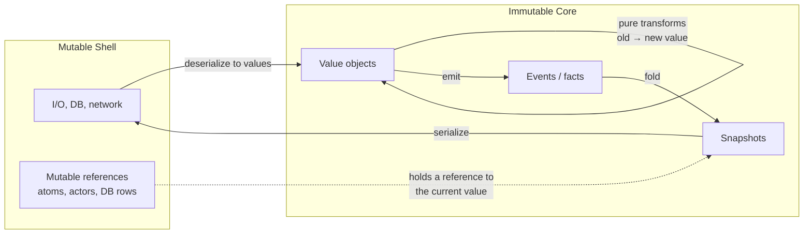
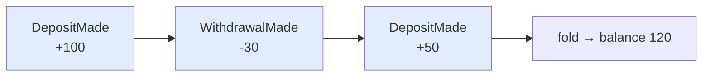
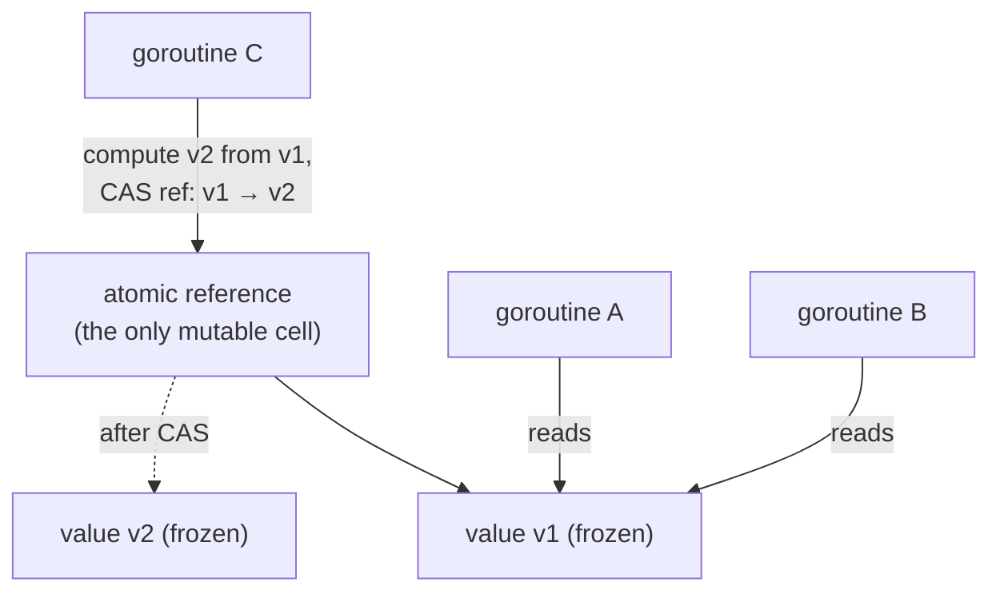
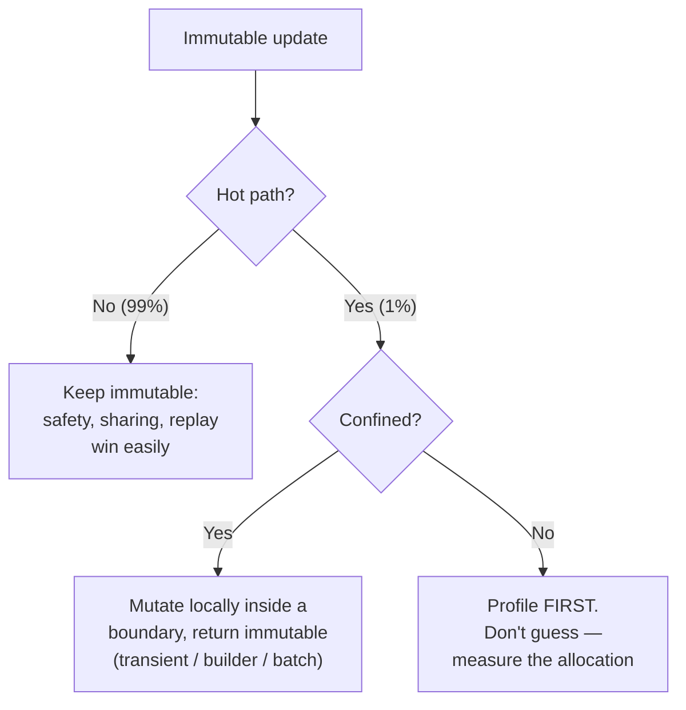

# Immutability — Senior Level

> **Roadmap:** [Functional Programming](../README.md) → Immutability
>
> *Junior asked "how do I avoid mutating this list?"; middle asked "how do persistent structures share memory?". The senior question is architectural: **what does it mean to design a whole system around values that never change** — and where does that promise stop paying and start costing?*

---

## Table of Contents

1. [Introduction](#introduction)
2. [Prerequisites](#prerequisites)
3. [Immutability as an Architectural Decision](#immutability-as-an-architectural-decision)
4. [Immutable Architecture Patterns](#immutable-architecture-patterns)
   - [Value Objects & DDD](#value-objects--ddd)
   - [Event Sourcing & Append-Only Logs](#event-sourcing--append-only-logs)
   - [Snapshots, Time-Travel & Undo](#snapshots-time-travel--undo)
   - [Immutable DTOs & API Contracts](#immutable-dtos--api-contracts)
5. [Concurrency & Safe Sharing](#concurrency--safe-sharing)
6. [Language Reality](#language-reality)
   - [Java — records & sealed types](#java--records--sealed-types)
   - [Go — conventions, copy semantics, no deep immutability](#go--conventions-copy-semantics-no-deep-immutability)
   - [Python — frozen dataclass & tuple](#python--frozen-dataclass--tuple)
   - [Clojure / Scala / Haskell — immutable by default](#clojure--scala--haskell--immutable-by-default)
7. [Limits & Costs at Scale](#limits--costs-at-scale)
8. [When to Allow Controlled Mutation](#when-to-allow-controlled-mutation)
9. [Common Mistakes](#common-mistakes)
10. [Test Yourself](#test-yourself)
11. [Cheat Sheet](#cheat-sheet)
12. [Summary](#summary)
13. [Further Reading](#further-reading)
14. [Related Topics](#related-topics)

---

## Introduction

> Focus: **design & architecture implications.** Immutability stops being a coding habit and becomes a property of the system — one that buys you concurrency safety, auditability, and time-travel, and bills you in memory and GC.

A senior does not adopt immutability because it is fashionable or "functional." A senior adopts it because it converts an entire class of *runtime* problems — data races, aliasing bugs, "who changed this object?", lost-update conflicts, irreproducible incidents — into problems that **cannot occur by construction**. When a value cannot change after creation, an enormous amount of defensive reasoning disappears: you can hand the same reference to ten goroutines, cache it forever, log it, and replay it, and none of those actions can corrupt it.

That guarantee is not free, and the senior's job is to know exactly what it costs and where it stops. Immutability at scale means snapshots that consume memory, allocations that pressure the garbage collector, and languages whose "immutability" is shallow, conventional, or outright absent. The interesting decisions live at the boundary: which parts of the system are immutable *all the way down*, which are immutable *by contract but mutable underneath*, and which deliberately permit mutation for performance — under control, behind a boundary, with the escape hatch documented.

> **The senior mindset shift:** the junior asks "is this object immutable?"; the senior asks "what does the *system* gain by making this data immutable, what does it pay, and at which boundary does the immutable region end and the mutable, effectful world begin?"

---

## Prerequisites

- **Required:** Fluency with [`junior.md`](junior.md) and [`middle.md`](middle.md) — you can explain copy-on-write, structural sharing, and persistent data structures, and you instinctively reach for immutable values in everyday code.
- **Required:** You have shipped a concurrent system and debugged at least one data race or aliasing bug.
- **Helpful:** Familiarity with [Pure Functions & Referential Transparency](../02-pure-functions-and-referential-transparency/senior.md) — immutability is the data-side complement of purity.
- **Helpful:** Exposure to [Algebraic Data Types](../06-algebraic-data-types/senior.md) (value objects are usually product types) and the [functional core / imperative shell](../10-effect-tracking/senior.md) pattern.
- **Helpful:** Working knowledge of [memory layout and GC](../../../language-internals/memory-management/README.md) in your target runtime.

---

## Immutability as an Architectural Decision

The central senior insight: **immutability is not a property of a class, it is a property of a region of your system.** You draw a boundary; inside it, data is values that never change; outside it lives state, time, and effects. The quality of an architecture is largely determined by *where you draw that line* and *how clean the boundary is*.



Inside the immutable core, *change* is modeled as the production of a new value from an old one — never as the in-place edit of an existing one. The only place mutation is allowed is at the very edge: a single mutable reference cell (an atom, a `sync` primitive, a database row) that you *swing* from pointing at the old immutable value to pointing at the new one. All the hard concurrency reasoning collapses onto that one cell; everything it points to is frozen and therefore safe to share without locks.

This reframing is what unlocks the four architectural patterns below. They are not separate techniques — they are four consequences of the same decision to treat data as values.

---

## Immutable Architecture Patterns

### Value Objects & DDD

A **value object** (Evans, *Domain-Driven Design*) is a domain concept defined entirely by its attributes, with no identity of its own: `Money(100, USD)`, `DateRange(start, end)`, `EmailAddress("a@b.com")`. Two value objects with equal attributes are equal, full stop. The defining design rule is that **value objects are immutable** — you don't change a `Money`, you produce a new one.

This is not pedantry; it removes a real bug class. If `Money` were mutable, handing it to a `Discount` calculator that mutated it would silently change the price everywhere that object was aliased. Immutability makes a value object safe to share freely — pass it, cache it, use it as a map key, put it in a set — exactly because nobody can change it under you.

```java
// Java 17+ — a record is a value object: immutable, value-equality, no identity.
public record Money(long amountMinor, Currency currency) {
    public Money {                                  // compact canonical constructor: validate
        if (amountMinor < 0) throw new IllegalArgumentException("negative money");
        Objects.requireNonNull(currency);
    }
    // "Change" returns a NEW value; the receiver is never mutated.
    public Money plus(Money other) {
        if (!currency.equals(other.currency))
            throw new IllegalArgumentException("currency mismatch");
        return new Money(amountMinor + other.amountMinor, currency);
    }
}
```

The senior discipline: **entities have identity and a lifecycle (and a mutable reference); value objects do not.** An `Order` entity changes over time, but it changes by *replacing* its value-typed fields (`status`, `total`) with new immutable values. Keep the mutable surface (the entity, or its single reference cell) thin, and push all the domain richness into immutable value objects underneath. The result is a domain model where almost everything is a value, and the rare mutable thing is small and obvious.

A second senior payoff of value objects: they are the natural home for **validation at the boundary**. A `Money` that *cannot* be constructed negative, or an `EmailAddress` that *cannot* exist unless it parsed, means every function downstream receives a value that is already correct — no re-validation, no "is this string a valid email?" scattered across the codebase. Immutability is what makes this trustworthy: because the validated value can never be mutated into an invalid one afterward, the guarantee established at construction holds for the object's entire lifetime. This is the "make illegal states unrepresentable" principle expressed through immutable, self-validating values — and it composes, because a `DateRange(start, end)` built from two validated `Date` values inherits their guarantees.

### Event Sourcing & Append-Only Logs

Take immutability to its architectural conclusion and you arrive at **event sourcing**: instead of storing *current state* and overwriting it, you store the **immutable, append-only sequence of facts** that produced it. `MoneyDeposited`, `MoneyWithdrawn`, `AccountFrozen` — each event is a value, written once, never updated or deleted. Current state is a *derived* value: `state = fold(applyEvent, initial, events)`.



Because the log is immutable and append-only, you get properties that are expensive or impossible with a mutating store:

- **Audit by construction.** The history *is* the data; you can't lose the "why" because the why is never overwritten.
- **Temporal queries.** "What was the balance on March 1?" is `fold` over events up to that timestamp — the past is still there.
- **Rebuildable read models.** Any number of projections (a SQL view, a search index, a cache) are pure functions of the same log; you can drop and rebuild them, or add a new one, by replaying.
- **Debugging by replay.** A production incident is reproducible: feed the exact event sequence into the code path and watch it happen again.

```java
// Event sourcing in miniature: state is a pure fold over immutable facts.
sealed interface Event permits Deposited, Withdrawn {}
record Deposited(long cents) implements Event {}
record Withdrawn(long cents) implements Event {}

long balance(List<Event> log) {                 // derive current state by folding
    long acc = 0;
    for (var e : log) acc += switch (e) {
        case Deposited d -> d.cents();
        case Withdrawn w -> -w.cents();
    };
    return acc;                                  // log untouched; any projection re-foldable
}
```

The same idea, lighter, is the **append-only log** generally: write-ahead logs, Kafka topics, Git's object store, ledger tables. The unifying principle is *don't destroy information; record the change as a new immutable entry.* (This is also the seam to [event-driven architecture](../../../../Architecture/system-design/README.md) and CQRS.)

A subtle senior obligation: events being immutable means you can never "fix" a past event by editing it — corrections are *new* events (`MoneyDepositedCorrected`), and the log carries the mistake *and* its correction, which is exactly the auditability you wanted. It also means **schema evolution** is a first-class concern: old events were written with old shapes and must remain readable forever, so you version event types and write upcasters rather than migrating data in place.

The cost, foreshadowing the limits section: replaying a million events to answer one query is slow, which is why event sourcing always comes paired with **snapshots**.

### Snapshots, Time-Travel & Undo

A **snapshot** is a captured immutable value of "the whole state at a point in time." Because the state is immutable, capturing a snapshot is *free* — you just keep the reference. Nobody can change the thing you're pointing at, so the reference *is* a perfect point-in-time copy without any defensive deep-copy.

This single fact powers three features that are notoriously painful with mutable state:

- **Undo / redo.** Keep a stack of past state values. Undo is "point the current reference at the previous snapshot." With mutable state you'd have to reconstruct the prior state by reverse-applying mutations — error-prone and often lossy.
- **Time-travel debugging.** Step backward through application states (the Redux DevTools model) because each past state still exists as a value.
- **Optimistic UI & transactional retry.** Snapshot, mutate a candidate, validate; on conflict, discard and retry from the snapshot — no rollback logic, just drop the candidate.

```python
# Python — undo for free when state is an immutable value.
from dataclasses import replace

history: list[Document] = [doc]          # each entry is a complete immutable snapshot
def edit(new_text: str) -> None:
    history.append(replace(history[-1], text=new_text))   # new value, old still intact
def undo() -> None:
    if len(history) > 1: history.pop()    # "rollback" = drop the latest reference
current = lambda: history[-1]
```

This is also the foundation of **reproducibility**: a snapshot plus the pure transforms applied to it fully determines the output. If you log "started from snapshot S, applied events E1..En," anyone can reproduce the exact result — the cornerstone of reproducible builds, deterministic simulations, and replayable incident analysis. (See [event sourcing](#event-sourcing--append-only-logs) — snapshots are the performance answer to "don't replay from the beginning of time.")

The reason snapshots are cheap *despite* keeping history is **structural sharing** (the middle-level mechanism, now at architectural scale): when state is a persistent data structure, a new snapshot that differs from the previous one in a single field shares all the unchanged structure with it. A hundred undo states of a large document do not cost a hundred full copies — they cost a hundred *diffs*. This is precisely why time-travel and undo are practical on immutable state and impractical on mutable state: with mutation you must copy defensively to snapshot; with persistence you keep a reference and the structure is shared automatically. The cost reappears only when the *deltas themselves* accumulate without bound — which is what the [limits](#limits--costs-at-scale) section addresses.

### Immutable DTOs & API Contracts

At a system boundary — an HTTP handler, a message consumer, an RPC service — the data crossing the wire should be an **immutable DTO**. Once you have deserialized a request into a value, nothing should mutate it as it flows through validation, business logic, and logging. Three concrete payoffs:

1. **No spooky action across layers.** A logging middleware that redacts a field can't accidentally redact it for the handler too, because it works on a *new* value.
2. **Safe to log and retry.** You can capture the exact request value for an audit log, a dead-letter queue, or a retry, knowing it is the request as received — nothing downstream rewrote it.
3. **Versionable contracts.** Treating the contract as an immutable value pairs naturally with additive, non-breaking [API versioning](../../../../Architecture/system-design/README.md): you add a field (a new value shape), you never mutate the meaning of an existing one.

The senior nuance: immutability of the DTO is *in addition to* validation, not a substitute. Make illegal states unrepresentable at the boundary (a parsed, validated, immutable `EmailAddress`, not a raw mutable `String`), and the rest of the system can trust the value without re-checking it. This is "parse, don't validate" expressed as immutable value objects.

---

## Concurrency & Safe Sharing

This is where immutability pays its largest architectural dividend: **immutable data is thread-safe for free.** A value that cannot change has no write to race against, so there is *nothing to synchronize*. Any number of threads, goroutines, or actors can read the same immutable object simultaneously — no locks, no mutexes, no atomics, no memory barriers, no data races. The hardest, most defect-dense part of concurrent programming simply does not apply to frozen data.



The architectural pattern is **mutable reference, immutable target**: confine *all* mutability to one atomic reference cell, and have every update be "compute a new immutable value, then compare-and-swap the cell to point at it." Readers always see a consistent, complete value — never a half-updated one — because the value they hold can't be edited mid-read. This is exactly Clojure's `atom`, Go's `atomic.Pointer[T]`, Java's `AtomicReference<T>`, and the heart of Software Transactional Memory.

```go
// Go — lock-free shared config: readers never block, never see a torn update.
type Config struct{ Timeout time.Duration; Hosts []string } // treated as immutable
var cfg atomic.Pointer[Config]

func Current() *Config { return cfg.Load() }                // any goroutine, no lock
func Reload(next *Config) { cfg.Store(next) }               // swing the one pointer
```

Three senior caveats keep this honest:

- **"Immutable" must mean immutable *all the way down*.** If `Config.Hosts` (a Go slice) is appended to or sorted in place by any reader, the free thread-safety evaporates — a reader can observe a mid-mutation slice. Shallow immutability is a *partial* guarantee (see the Go section).
- **Safe publication still matters.** A reader must observe the *fully constructed* value. The atomic store/load provides the happens-before edge; constructing the value and then publishing it via a non-synchronized field does not. Build it, *then* publish it through the atomic/`final`/`volatile` mechanism.
- **CAS contention, not corruption.** Under heavy write contention, compare-and-swap loops retry (and may rebuild the new value each time). The data is never corrupt, but throughput can suffer — at which point you shard the state or move the hot field out (see [limits](#limits--costs-at-scale)).

The Java form makes the safe-publication point concrete: the JMM guarantees that `final` fields of an object are visible to any thread that sees a reference to the object *after construction completes*. That is the language-level edge that turns "I built an immutable object" into "every thread sees a fully built immutable object."

```java
// Java — immutable snapshot published lock-free; final fields give the
// happens-before edge, so readers never see a half-constructed value.
final class Snapshot {                       // all fields final → safe publication
    final Map<String, Long> counts;
    Snapshot(Map<String, Long> src) { this.counts = Map.copyOf(src); } // deep-ish freeze
}
final AtomicReference<Snapshot> ref = new AtomicReference<>(new Snapshot(Map.of()));

long read(String k) { return ref.get().counts.getOrDefault(k, 0L); }  // no lock

void bump(String k) {                          // optimistic, retry-on-contention
    ref.updateAndGet(cur -> {
        var next = new HashMap<>(cur.counts);
        next.merge(k, 1L, Long::sum);
        return new Snapshot(next);             // new immutable value, then CAS
    });
}
```

The net architectural effect: immutability lets you replace pessimistic locking (which serializes and deadlocks) with optimistic, lock-free coordination over a single reference — turning shared mutable state, the bane of concurrency, into shared *immutable* state, which is trivially safe. The trade you are making is **read scalability and correctness for write contention**: reads become free and infinitely parallel, while concurrent writers may retry their CAS. For read-heavy shared state (config, routing tables, caches, feature flags) — the overwhelmingly common case — this is a spectacular win.

---

## Language Reality

The promise of immutability is uniform; the languages are not. A senior knows precisely how deep their language's immutability actually goes, because the architecture above is only as safe as the weakest link.

### Java — records & sealed types

Java's `record` (16+) gives you concise, value-equality, *shallowly* immutable carriers — the canonical value-object tool. `sealed` interfaces/classes (17+) let you model closed sums (a fixed set of subtypes), so an immutable domain becomes a set of records under a sealed parent, exhaustively pattern-matched.

```java
public sealed interface Shape permits Circle, Rect {}
public record Circle(double r) implements Shape {}
public record Rect(double w, double h) implements Shape {}

double area(Shape s) = switch (s) {            // exhaustive: compiler enforces all cases
    case Circle c -> Math.PI * c.r() * c.r();
    case Rect r   -> r.w() * r.h();
};
```

**The catch — shallow immutability.** `record Team(List<Player> players)` is immutable in its *reference* but the `List` itself is mutable; a caller can `team.players().add(...)`. The senior fix: defensively copy into an unmodifiable view in the canonical constructor (`List.copyOf(players)`), or use a genuinely immutable collection. The `final` field gives you safe publication (a guaranteed visibility edge after construction) — a real, JMM-backed concurrency guarantee that mere convention does not.

### Go — conventions, copy semantics, no deep immutability

Go has **no language-level immutability** beyond `const` (which is restricted to compile-time scalars — no `const` structs, slices, or maps). Immutability in Go is *convention plus copy semantics*:

- **Value types copy on assignment and on pass-by-value.** Passing a `struct` by value gives the callee its own copy — a poor man's immutability, as long as the struct contains no reference-typed fields (slices, maps, pointers, channels).
- **The leak: reference fields.** A struct with a slice or map field copies the *header*, not the backing array — both copies alias the same underlying data. Mutating through one is visible through the other. So "I passed it by value" is **not** deep immutability the moment a slice/map/pointer is involved.

```go
type Order struct{ ID string; Items []Item }  // Items is a slice → shared backing array

func process(o Order) {        // o is a shallow copy
    o.Items[0].Qty = 99        // MUTATES the caller's data — same backing array!
}
```

The senior Go playbook: keep "immutable" structs free of reference fields where possible; when a slice/map must be carried, **copy it on the way in** (or return defensive copies on the way out) and document the value as read-only by convention; expose data through accessor methods rather than exported reference fields; and lean on `atomic.Pointer[T]` for the shared-config pattern. Go gives you no compiler enforcement — the discipline is yours, and code review is the enforcement mechanism. (This is the language reality that makes Go's "share memory by communicating" advice — see [concurrency](../../../language-internals/concurrency-async-parallel/concurrency/README.md) — partly a workaround for the lack of deep immutability.)

### Python — frozen dataclass & tuple

Python's immutability is also shallow and opt-in. `@dataclass(frozen=True)` blocks attribute reassignment (raising `FrozenInstanceError`) and synthesizes `__hash__`, making the instance usable as a dict key or set member. `tuple`, `frozenset`, `str`, and numeric types are immutable; `list`, `dict`, `set` are not.

```python
from dataclasses import dataclass

@dataclass(frozen=True)
class Point:
    x: int
    y: int
    tags: tuple[str, ...] = ()      # tuple, NOT list — keep the field immutable too

p = Point(1, 2)
# p.x = 9        # raises FrozenInstanceError
```

Validation in a frozen dataclass needs `__post_init__` with `object.__setattr__` to normalize (since direct assignment is blocked) or, more cleanly, to raise on invalid input:

```python
@dataclass(frozen=True)
class EmailAddress:
    value: str
    def __post_init__(self) -> None:
        if "@" not in self.value:                # validate at construction...
            raise ValueError(f"invalid email: {self.value!r}")
        # ...frozen guarantees it stays valid for the object's whole life.
```

**The catch is identical to Java/Go:** `frozen=True` freezes the *binding*, not the *object* it points to. A frozen dataclass with a `list` field still lets you `p.items.append(...)` — and worse, it'll happily build `__hash__` over a mutable field, so the hash silently lies after a mutation. The senior rule: a frozen dataclass must contain only immutable fields (`tuple` not `list`, `frozenset` not `set`, nested frozen dataclasses) for the immutability to be real. Note also Python has no parallelism story under the GIL for CPU work, so the *thread-safety* dividend is muted — the value of frozen types here is mostly correctness and hashability, not lock-free scaling (this is shifting as the no-GIL builds mature).

### Clojure / Scala / Haskell — immutable by default

These languages flip the default, which is what makes the architecture above *cheap* rather than a constant discipline:

- **Clojure:** all core collections (vectors, maps, sets, lists) are **persistent and immutable** — backed by Bagwell's Hash Array Mapped Tries, giving structural sharing so a "modified" map shares almost all its structure with the original (effectively O(log₃₂ n), near-constant). Mutation is *explicitly* opt-in via reference types (`atom`, `ref`, `agent`) that hold immutable values and coordinate change (CAS for atoms, STM for refs). The whole language is the "mutable reference, immutable target" pattern by default.
- **Scala:** immutable collections are the default namespace; `case class` gives records with `copy()` for "modify"; you must reach for `mutable.*` deliberately. It offers both worlds, and the senior discipline is to keep the mutable corner small and local.
- **Haskell:** **everything is immutable**; there are no variables to mutate. "Change" is always a new value, and effects (including controlled mutation via `IORef`/`STRef`/`MVar`) are explicitly typed in `IO`/`ST`. Immutability isn't a pattern you apply — it's the substrate, and the compiler exploits it for aggressive sharing and optimization.

The lesson for the senior working in Go/Java/Python: you are *reconstructing*, by convention and defensive copying, a guarantee these languages give you structurally. Knowing what the "real thing" looks like tells you exactly which guarantees you are *not* getting for free and must enforce yourself.

---

## Limits & Costs at Scale

Immutability is an architectural asset, not a religion. At scale it bills you, and a senior budgets for it explicitly.

**Memory of snapshots and history.** Event sourcing keeps every fact forever; undo keeps every prior state; time-travel keeps the timeline. Even with structural sharing, history is *unbounded by default* and grows without limit. The mitigations are deliberate: **snapshot + truncate** (periodically materialize state and discard the events before it), **bounded history** (keep the last N undo states, drop the rest), **retention/compaction** (log compaction in Kafka, snapshot rotation), and **archival** to cold storage. "We never delete anything" is a feature until it fills the disk.

**GC pressure from allocation.** Every "modification" allocates a new value. In a hot loop — parsing a million records, updating a tight game/simulation state at 60 Hz — naive immutable updates produce a torrent of short-lived garbage that hammers the allocator and the garbage collector, causing pause spikes and throughput loss. Structural sharing reduces *how much* is copied, but it does not make allocation free; an HAMT update still allocates the path of changed nodes.

**Allocation cost vs. mutation cost.** A persistent vector update is O(log₃₂ n) *and* allocates; a mutable array write is O(1) and allocates nothing. For most code the difference is irrelevant and dwarfed by the correctness and concurrency wins. For the genuinely hot 1%, it is decisive — which is what motivates the escape hatch below.



The senior rule of order: **immutability first, mutation as a profiled exception.** You do not pre-optimize by reaching for mutable structures everywhere; you build immutable, measure, and surgically introduce confined mutation only where the profiler proves it matters. Premature mutation re-opens exactly the bug classes immutability closed, in exchange for a speedup you probably didn't need.

---

## When to Allow Controlled Mutation

The mature position is not "never mutate" — it is "**mutate locally, behind a boundary, and hand the outside world only immutable values.**" Several established patterns let you have the performance of mutation *inside* a region while preserving immutability *at the seams*:

- **Transients (Clojure) / the builder pattern.** Clojure's `transient`/`persistent!` lets you mutate a collection efficiently during a tight build, then "freeze" it back to a persistent value — the mutable phase never escapes. Java's `StringBuilder` → `String`, and the Builder pattern generally, are the same idea: mutate the builder, emit an immutable product.
- **The `ST` monad (Haskell).** Genuinely mutable arrays/refs, *statically guaranteed* not to leak: `runST` returns a pure value, and the type system forbids the mutable references from escaping the computation. Local mutation, globally pure — the gold standard for "controlled."
- **The functional core / imperative shell.** Keep the domain logic immutable and pure; concentrate mutation (the DB, the cache, the single reference cell) in a thin shell at the edge. The mutation exists, but it's *localized and obvious*, not smeared through the domain. (See [Effect Tracking](../10-effect-tracking/senior.md).)
- **Object pooling / arenas for allocation-bound hot paths.** When GC pressure is the proven bottleneck, reuse buffers within a confined scope. This trades safety for speed *deliberately*, in a small audited region, with the immutable contract restored at the boundary.

```go
// Go — controlled mutation: build with a mutable slice inside, hand back an
// immutable-by-contract value. The mutable buffer never escapes the function.
func BuildReport(rows []Row) Report {
    buf := make([]Line, 0, len(rows))   // local, mutable, hot-path-friendly
    for _, r := range rows {
        buf = append(buf, render(r))    // mutate freely — no one else can see buf
    }
    return Report{Lines: buf}           // the buffer's lifetime ends here; treat Report as read-only
}
```

The discipline that makes "controlled mutation" controlled: the mutable region is **small, local, and does not leak a mutable reference**. The moment a mutable object escapes the boundary — returned to a caller, stored in shared state, published to another thread — it is no longer controlled, and you have silently re-introduced the aliasing and race bugs. The senior gate in review: *"Show me that nothing mutable crosses this boundary."*

Note the asymmetry that makes this safe: building *up* a value through local mutation and then freezing it is fine, because the mutation happened before anyone else could observe the value. The danger is the reverse — handing out a reference and *then* mutating — which is the aliasing bug immutability exists to prevent. "Mutate during construction, freeze at publication" is the rule that distinguishes the two; Clojure's `transient`/`persistent!` and Haskell's `runST` are simply *language-enforced* versions of exactly this discipline.

---

## Common Mistakes

1. **Mistaking shallow for deep immutability.** A `final`/`frozen`/value-typed wrapper around a mutable `List`/slice/`dict` is *not* immutable — callers mutate the inner collection and the guarantee is a lie. *Make it immutable all the way down (defensive `copyOf`, `tuple` not `list`, no reference fields in Go structs) or don't claim it.*
2. **Relying on Go pass-by-value for deep immutability.** Passing a struct with a slice/map/pointer field copies only the header; both copies alias the backing data. *Copy reference fields explicitly on the boundary, or document and enforce read-only by convention — Go gives you zero compiler help.*
3. **Hashing a frozen object that contains a mutable field.** A `frozen=True` dataclass with a `list` field builds a `__hash__` that goes stale the instant the list mutates, corrupting every set/dict that holds it. *Frozen means frozen contents, not just a frozen binding.*
4. **Unbounded history.** Event logs and undo stacks that grow forever eventually exhaust memory or disk. *Pair every append-only structure with snapshotting, retention, compaction, or a bounded window from day one.*
5. **Ignoring GC pressure in hot paths.** Naive immutable updates in a 60 Hz loop or a million-row parse can dominate runtime via allocation/GC. *Profile; confine mutation locally (transient/builder/arena) only where measurement proves it matters.*
6. **Pre-optimizing with mutation.** Reaching for mutable structures "for performance" across the codebase, re-opening aliasing and race bugs to win a speedup you never measured. *Immutable first; mutation is a profiled, confined exception.*
7. **Leaking a mutable reference from a "controlled" region.** A builder/transient/pooled buffer that escapes its boundary is no longer controlled and silently re-introduces every bug immutability closed. *Verify nothing mutable crosses the seam.*
8. **Forgetting safe publication.** Building an immutable value and then sharing it through a non-synchronized field — another thread may see a partially constructed object. *Publish through `final`/`volatile`/atomic so there is a happens-before edge.*

---

## Test Yourself

1. You introduce event sourcing for an accounts ledger. Name three architectural capabilities it gives you that an overwrite-in-place store cannot, and the one cost that forces you to add snapshots.
2. Explain the "mutable reference, immutable target" concurrency pattern. Why does it let readers run lock-free, and what is the *one* thing that can still go wrong if the target isn't immutable all the way down?
3. A Go teammate says "I pass the struct by value, so it's immutable." Under what exact condition is this false, and what concretely goes wrong?
4. A Python `@dataclass(frozen=True)` has a `list` field. Give two distinct ways this breaks the immutability guarantee.
5. Why is taking a snapshot of immutable state effectively free, and how does that single fact give you undo, time-travel, and reproducibility?
6. You profiled a hot loop doing immutable updates and GC is the bottleneck. Describe a way to keep the *external* contract immutable while mutating internally, and state the one rule that keeps it "controlled."
7. Contrast how Clojure and Haskell give you immutability versus how you'd reconstruct it in Java/Go. What guarantee do you *not* get for free in the latter?

<details>
<summary>Answers</summary>

1. **(a)** A complete, tamper-evident audit trail by construction (history is never overwritten); **(b)** temporal queries — "state as of date X" is a `fold` over events up to that time; **(c)** rebuildable/added read models and **replay-based debugging** of incidents (any two of these plus audit count). The cost: answering a query by replaying the entire log from the beginning is slow and gets slower as the log grows — so you add **snapshots** (materialize state periodically and replay only from the latest snapshot).
2. Confine all mutability to a single atomic reference cell; every update computes a *new* immutable value and compare-and-swaps the cell to point at it. Readers `Load` the reference and read the value without a lock because the value can't change under them — there's no write to race against, only the atomic pointer swap. What can still go wrong: if the target isn't immutable *all the way down* (e.g., a Go slice field appended to, or a Java `List` inside a record), a reader can observe a mid-mutation inner structure, and the lock-free safety is lost.
3. False when the struct contains a **reference-typed field** — a slice, map, pointer, or channel. The by-value copy duplicates the struct header but the slice/map still points at the *same backing array/buckets*, so mutating an element through the copy mutates the caller's data (and any other aliasing copy). Deep immutability requires copying the reference field's contents, not just the struct.
4. **(a)** `frozen=True` only blocks attribute *reassignment*; you can still call `instance.the_list.append(...)`, mutating the contained list in place. **(b)** The synthesized `__hash__` is computed over fields including the mutable list, so after a mutation the hash no longer matches, silently corrupting any `set`/`dict` that holds the instance (lookup misses, duplicate entries). Fix: use a `tuple` field so the contents are genuinely immutable.
5. Because the state value cannot change, the snapshot is just *keeping the reference* — no defensive deep copy is needed, since nothing can mutate the thing you point at. That gives undo (keep a stack of past state references; undo = point current at the previous one), time-travel (every past state still exists as a value, so you can step backward), and reproducibility (a snapshot plus the pure transforms applied to it fully determines the output, so anyone can replay it exactly).
6. Use a confined mutable phase that produces an immutable result: a **transient → `persistent!`** (Clojure), a **builder** (`StringBuilder` → `String`), an **`ST` computation** (Haskell), or a pooled/arena buffer — mutate freely *inside*, return an immutable value at the boundary. The rule that keeps it controlled: **no mutable reference escapes the boundary** — nothing mutable is returned, stored in shared state, or published to another thread.
7. Clojure: all core collections are persistent/immutable by default with structural sharing, and mutation is opt-in via `atom`/`ref`. Haskell: *everything* is immutable; there are no variables, and mutation is explicitly typed in `IO`/`ST`. In Java/Go you reconstruct this by convention + defensive copying (`List.copyOf`, copying slice fields, `final`). What you do **not** get for free: **compiler-enforced deep immutability** — the language won't stop a teammate from mutating an inner collection, so enforcement falls to discipline and code review (with `final` at least giving you JMM-backed safe publication).

</details>

---

## Cheat Sheet

| Concern | Immutable approach | What it buys | What it costs / the catch |
|---|---|---|---|
| **Domain modeling** | Value objects (records / case classes / frozen dataclasses) | Value equality, safe sharing, map keys | Shallow by default — freeze contents too |
| **State change over time** | Event sourcing / append-only log | Audit, temporal queries, replay, rebuildable views | Unbounded growth → needs snapshots + retention |
| **Point-in-time / undo** | Snapshots (keep references) | Free undo, time-travel, reproducibility | Memory of retained history → bound it |
| **Boundary data** | Immutable DTOs (parse, don't validate) | No cross-layer mutation, safe to log/retry, versionable | Validation is still required |
| **Concurrency** | Mutable reference → immutable target (CAS) | Lock-free reads, no data races, safe publication | Must be deep-immutable; CAS contention on writes |
| **Hot path** | Confined mutation (transient/builder/`ST`/arena) | Mutation speed, low GC | Mutable reference must not escape the boundary |

**Language reality at a glance:**

| Language | Default | Mechanism | Deep? |
|---|---|---|---|
| **Go** | mutable | `const` (scalars only), value copy, convention | No — slice/map/pointer fields alias |
| **Java** | mutable | `record`, `sealed`, `final`, `List.copyOf` | Shallow; deep needs defensive copy |
| **Python** | mutable | `@dataclass(frozen=True)`, `tuple`, `frozenset` | Shallow; freeze fields too |
| **Clojure/Scala** | **immutable** | persistent collections (HAMT), `atom`/`ref` | Yes (structural sharing) |
| **Haskell** | **immutable** | everything; `IORef`/`ST` for controlled mutation | Yes, total |

**Three golden rules:**
- *Immutability is a property of a region — draw the boundary; immutable core, mutable shell.*
- *Shallow immutability is a half-truth; make it immutable all the way down or don't claim it.*
- *Immutable first; mutation is a profiled, confined exception that never escapes its boundary.*

---

## Summary

- **Immutability at the senior level is an architectural decision, not a coding habit:** you draw a boundary, make data *values* inside it, and confine state, time, and effects to a thin mutable shell at the edge.
- **Four patterns fall out of that one decision:** immutable **value objects** (DDD), **event sourcing / append-only logs** (audit, temporal queries, replay), **snapshots** (free undo, time-travel, reproducibility), and **immutable DTOs** at boundaries (no cross-layer mutation, versionable contracts).
- **The biggest dividend is concurrency:** frozen data is thread-safe for free. The pattern is *mutable reference, immutable target* — confine all mutability to one atomic cell and CAS it, letting readers run lock-free with no data races, provided the target is immutable all the way down and safely published.
- **Language reality varies sharply.** Go has no deep immutability (slice/map/pointer fields alias through value copies); Java `record`/`sealed` and Python `frozen` dataclasses are *shallow* and need frozen contents; Clojure/Scala/Haskell give it by default via persistent collections and an immutable substrate — which is the guarantee you *reconstruct by discipline* elsewhere.
- **It costs memory and GC at scale:** unbounded history needs snapshots/retention/compaction; naive immutable updates in hot loops pressure the allocator. The order is **immutable first, mutation as a profiled exception**, introduced only where measurement proves it matters.
- **Controlled mutation is the mature middle:** transients/builders, Haskell's `ST`, functional-core/imperative-shell, arenas — mutate locally, return immutable, and never let a mutable reference escape the boundary.
- Next: [`professional.md`](professional.md) — persistent data structure internals, GC tuning, and the runtime economics of immutable systems.

---

## Further Reading

- **Domain-Driven Design** — Eric Evans (2003) — value objects vs. entities; the source of "value objects are immutable."
- **Implementing Domain-Driven Design** — Vaughn Vernon (2013) — event sourcing, aggregates, and immutable domain events in practice.
- **Designing Data-Intensive Applications** — Martin Kleppmann (2017) — event logs, change data capture, derived state, and the "turning the database inside out" view of immutable logs.
- **Out of the Tar Pit** — Moseley & Marks (2006) — the case that *state* (not logic) is the dominant source of complexity, and the argument for minimizing mutable state.
- **Purely Functional Data Structures** — Chris Okasaki (1998) — the foundational theory of persistent, immutable structures and their amortized costs.
- **Clojure's reference model** — Rich Hickey, "Are We There Yet?" and "The Value of Values" (talks) — values, identity, time, and the atom/ref/agent split.
- **Effective Java** — Joshua Bloch (3rd ed., 2018) — Item 17 "Minimize mutability," Item 50 "Make defensive copies," Item 76 — the canonical JVM treatment.

---

## Related Topics

- [Functional Programming → Pure Functions & Referential Transparency](../02-pure-functions-and-referential-transparency/senior.md) — purity is the behavior-side complement of immutable data.
- [Functional Programming → Algebraic Data Types](../06-algebraic-data-types/senior.md) — value objects are product types; sealed/sum types model closed immutable domains.
- [Functional Programming → Effect Tracking](../10-effect-tracking/senior.md) — the functional-core / imperative-shell boundary where the immutable region meets effects.
- [Functional Programming → Map / Filter / Reduce](../04-map-filter-reduce/senior.md) — `fold`/`reduce` is how you derive state from an immutable event log.
- [Concurrency](../../../language-internals/concurrency-async-parallel/concurrency/README.md) — lock-free coordination, atomics, and why immutable sharing beats locking.
- [Memory Management](../../../language-internals/memory-management/README.md) — allocation and GC costs that immutability trades against.
- [Clean Code → Pure Functions](../../clean-code/15-pure-functions/README.md) — the everyday-code complement: pure functions over immutable values.
- [Architecture → System Design](../../../../Architecture/system-design/README.md) — event sourcing, CQRS, API versioning at the system scale.
