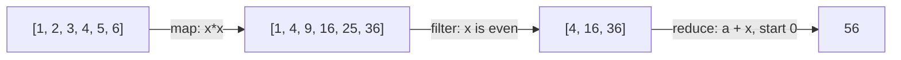

# Map / Filter / Reduce — Junior Level

> **Roadmap:** [Functional Programming](../README.md) → Map / Filter / Reduce
>
> *Three verbs replace almost every loop you write: `map` transforms each element, `filter` keeps the ones you want, `reduce` collapses many values into one. Learn to see your loops as combinations of these three, and your code starts describing **what** you want instead of **how** to compute it.*

---

## Table of Contents

1. [Introduction](#introduction)
2. [Prerequisites](#prerequisites)
3. [Glossary](#glossary)
4. [The Shape of a Loop](#the-shape-of-a-loop)
5. [map — transform every element](#map--transform-every-element)
6. [filter — keep the elements you want](#filter--keep-the-elements-you-want)
7. [reduce — collapse many values into one](#reduce--collapse-many-values-into-one)
8. [Chaining the Trio](#chaining-the-trio)
9. [A Brief Haskell Aside](#a-brief-haskell-aside)
10. [Mental Models](#mental-models)
11. [Common Mistakes](#common-mistakes)
12. [Test Yourself](#test-yourself)
13. [Cheat Sheet](#cheat-sheet)
14. [Summary](#summary)
15. [Further Reading](#further-reading)
16. [Related Topics](#related-topics)

---

## Introduction

> Focus: **What is it, and why does it matter?**

Look at the loops you write in a normal day and you'll notice they keep doing the same three things:

- **Transform** every item — "give me each price *with tax*."
- **Select** some items — "give me only the items *over $100*."
- **Combine** everything into a single answer — "give me the *total*."

`map`, `filter`, and `reduce` are the named versions of exactly these three jobs. Each one takes a collection and a small function, and returns a result. Instead of writing the mechanics of a loop — the counter, the index, the temporary accumulator, the `append` — you name the *intent* and hand over a function that says what to do with one element.

That's the whole pitch. A loop says **how**: "start at index 0, look at each element, push into a new list, stop at the end." `map`/`filter`/`reduce` say **what**: "transform each," "keep these," "fold into one." The how is handled for you, identically, every time — which means fewer off-by-one bugs, fewer accidental mutations, and code that reads like the sentence in your head.

> **The mindset shift:** stop thinking "I need to iterate." Start thinking "I need to *transform*, *select*, or *combine*." Once you can classify a loop into one of those three, the functional version writes itself.

This file is about recognizing the trio and mapping ordinary loops onto it. *When* the functional version is faster or slower, lazy or eager, and how it composes at scale — that's [`middle.md`](middle.md) and [`senior.md`](senior.md).

---

## Prerequisites

- **Required:** You can write a `for`/`foreach` loop over a list in at least one language (examples use Go, Java, and Python).
- **Required:** You're comfortable with the idea of a **function** — a named block that takes inputs and returns an output.
- **Helpful:** You've met [first-class and higher-order functions](../01-first-class-and-higher-order-functions/junior.md) — `map`/`filter`/`reduce` are the most common higher-order functions you'll ever use, because you pass a *function* as an argument.
- **Helpful:** A nodding acquaintance with [pure functions](../02-pure-functions-and-referential-transparency/junior.md). The functions you pass to the trio should ideally be pure — same input, same output, no side effects — which is what makes the result predictable.

---

## Glossary

| Term | Definition |
|------|-----------|
| **Higher-order function** | A function that takes another function as an argument (or returns one). `map`, `filter`, and `reduce` are all higher-order. |
| **Element function** | The small function you hand to the trio, applied to one element at a time (e.g. `x -> x * 2`). |
| **Predicate** | A function that returns `true`/`false`, used by `filter` to decide whether to keep an element. |
| **Accumulator** | The running result `reduce` carries from one element to the next (the total so far, the list built so far). |
| **Initial value** | The accumulator's starting value in `reduce` — `0` for a sum, `[]` for building a list, `""` for joining strings. |
| **Lambda / closure** | An anonymous, inline function — the usual way to write the element function: `lambda x: x*2`, `x -> x*2`, `func(x int) int { return x*2 }`. |
| **Pipeline** | Several operations chained so each one's output feeds the next: `map` → `filter` → `reduce`. |
| **Comprehension** | Python's compact syntax for `map`/`filter` in one expression: `[x*2 for x in xs if x > 0]`. |

---

## The Shape of a Loop

Nearly every collection-processing loop fits one of three shapes. Learn to spot the shape and you've found the right tool.

| You want to… | Output size | Tool | Element function returns |
|---|---|---|---|
| Transform each element | **same** count, new values | `map` | the new value |
| Keep some elements | **fewer or equal** count, same values | `filter` | `true` / `false` (a predicate) |
| Combine into one result | **one** value | `reduce` | the updated accumulator |



The diagram is the mental model for the whole file: data flows left to right, **`map` keeps the count and changes the values**, **`filter` keeps the values and changes the count**, **`reduce` collapses the whole thing to a single value**. Each box is a new collection — the original `[1..6]` is never modified.

---

## map — transform every element

**`map` applies a function to every element and returns a new collection of the same length.** One input element → one output element. Use it whenever you're saying "for each X, give me *something derived from* X."

### The loop you'd write

```python
# Python — the imperative version: double every number
nums = [1, 2, 3, 4]
doubled = []
for n in nums:
    doubled.append(n * 2)
# doubled == [2, 4, 6, 8]
```

Notice the ceremony: declare an empty list, loop, append, hope you didn't typo the variable name. The *only* interesting part is `n * 2`. Everything else is plumbing.

### The map version

```python
# Python — three ways, all equivalent
nums = [1, 2, 3, 4]

doubled = [n * 2 for n in nums]        # list comprehension (most Pythonic)
doubled = list(map(lambda n: n * 2, nums))  # built-in map()
# both → [2, 4, 6, 8]
```

In Python the **list comprehension** is idiomatic; `map()` exists and is fine, but most Python code uses comprehensions for transforms. Both express the same idea: *the result is `n * 2` for each `n`.*

### map in Java (Streams)

```java
// Java — Stream.map: transform each element, collect back to a list
List<Integer> nums = List.of(1, 2, 3, 4);

List<Integer> doubled = nums.stream()
    .map(n -> n * 2)
    .toList();                 // [2, 4, 6, 8]
```

`stream()` turns the list into a pipeline, `.map(n -> n * 2)` transforms each element, `.toList()` collects the results back into a list.

### map in Go (manual, then generics)

Go has no built-in `map` over slices (and `map` is also a *keyword* for the dictionary type — different thing). Before generics you wrote the loop; since Go 1.18 you can write a reusable generic helper.

```go
// Go — the honest loop (still common and perfectly idiomatic in Go)
nums := []int{1, 2, 3, 4}
doubled := make([]int, len(nums))
for i, n := range nums {
    doubled[i] = n * 2
}
// doubled == [2 4 6 8]

// Go — a generic Map helper (write once, reuse everywhere)
func Map[T, U any](xs []T, f func(T) U) []U {
    out := make([]U, len(xs))
    for i, x := range xs {
        out[i] = f(x)
    }
    return out
}

doubled := Map(nums, func(n int) int { return n * 2 })
```

> **Go reality check:** Go's culture favors the explicit loop, and the standard library deliberately ships few of these helpers. Knowing the *concept* still matters — `Map` is the pattern, even when you spell it out as a `for`.

> **Key rule:** `map` **never changes the length.** Input of 4 → output of 4. If your "transform" sometimes drops elements, you actually want `filter` (or `filter` then `map`), not `map`.

---

## filter — keep the elements you want

**`filter` keeps only the elements for which a predicate returns `true`,** and returns a new, usually shorter collection. The values themselves are unchanged — `filter` decides *whether* an element survives, not what it becomes.

### The loop you'd write

```python
# Python — imperative: keep only the even numbers
nums = [1, 2, 3, 4, 5, 6]
evens = []
for n in nums:
    if n % 2 == 0:
        evens.append(n)
# evens == [2, 4, 6]
```

### The filter version

```python
# Python — comprehension with a condition, or filter()
nums = [1, 2, 3, 4, 5, 6]

evens = [n for n in nums if n % 2 == 0]        # comprehension (idiomatic)
evens = list(filter(lambda n: n % 2 == 0, nums))  # built-in filter()
# both → [2, 4, 6]
```

The `if n % 2 == 0` is the **predicate** — the question asked of each element. If the answer is `true`, the element stays.

### filter in Java (Streams)

```java
// Java — Stream.filter takes a predicate
List<Integer> nums = List.of(1, 2, 3, 4, 5, 6);

List<Integer> evens = nums.stream()
    .filter(n -> n % 2 == 0)
    .toList();                 // [2, 4, 6]
```

### filter in Go (generic helper)

```go
// Go — a generic Filter helper
func Filter[T any](xs []T, keep func(T) bool) []T {
    var out []T
    for _, x := range xs {
        if keep(x) {
            out = append(out, x)
        }
    }
    return out
}

nums := []int{1, 2, 3, 4, 5, 6}
evens := Filter(nums, func(n int) bool { return n%2 == 0 })
// evens == [2 4 6]
```

> **`map` vs `filter` in one line:** `map` changes the *values* and keeps the *count*; `filter` keeps the *values* and changes the *count*. If you're tempted to "skip" an element inside a `map`, that's a `filter`.

---

## reduce — collapse many values into one

**`reduce` (also called `fold`) walks the collection carrying an accumulator, combining each element into it, and returns the single final accumulator.** Sum, product, max, count, "join into one string," "build a map from a list" — all of these are reductions.

It takes three things: the collection, a **combining function** `(accumulator, element) -> newAccumulator`, and an **initial value** for the accumulator.

### The loop you'd write

```python
# Python — imperative: sum a list
nums = [1, 2, 3, 4]
total = 0                  # initial value
for n in nums:
    total = total + n      # combine each element into the accumulator
# total == 10
```

The `total = 0` is the initial value; `total = total + n` is the combining step. `reduce` is just those two pieces named explicitly.

### The reduce version

```python
# Python — functools.reduce (reduce is NOT a built-in; you must import it)
from functools import reduce

nums = [1, 2, 3, 4]
total = reduce(lambda acc, n: acc + n, nums, 0)   # 10
#               └─ combining fn ─┘   └nums┘ └init┘
```

> **Python note:** for plain sums and similar, Python prefers the dedicated built-ins — `sum(nums)`, `max(nums)`, `min(nums)`, `"".join(words)` — and reserves `functools.reduce` for *custom* combinations that have no specialized function. Guido deliberately moved `reduce` out of the built-ins into `functools` because explicit loops or specialized functions are usually clearer. Reach for `reduce` when the combination is genuinely your own.

### reduce in Java (Streams)

```java
// Java — Stream.reduce with an identity (initial) value and a combiner
List<Integer> nums = List.of(1, 2, 3, 4);

int total = nums.stream()
    .reduce(0, (acc, n) -> acc + n);   // 10
//          └init┘ └── combiner ──┘

// For numeric sums Java also offers the clearer specialized form:
int total2 = nums.stream().mapToInt(Integer::intValue).sum();
```

### reduce in Go (generic helper)

```go
// Go — a generic Reduce helper (note: accumulator type U may differ from element type T)
func Reduce[T, U any](xs []T, init U, combine func(U, T) U) U {
    acc := init
    for _, x := range xs {
        acc = combine(acc, x)
    }
    return acc
}

nums := []int{1, 2, 3, 4}
total := Reduce(nums, 0, func(acc, n int) int { return acc + n })
// total == 10
```

### reduce is the general one

`map` and `filter` can both be *defined in terms of* `reduce` — that's why `reduce` is sometimes called the most powerful (and most dangerous) of the three. A `map` is "reduce that appends `f(x)`"; a `filter` is "reduce that appends `x` only if the predicate holds." You rarely write them that way — the point is that `reduce` is the general fold and the other two are specialized, more readable cases.

> **Choosing the initial value matters:** `0` for sums, `1` for products, `[]` for building a list, `""` for joining strings, an empty map for grouping. The initial value is the answer for an *empty* collection — and reducing an empty collection without an initial value is a classic crash (see Common Mistakes).

---

## Chaining the Trio

The real power shows up when you combine them into a **pipeline**, each step's output feeding the next. Read it top to bottom like a recipe.

> *"Take the orders, get each total **with tax** (`map`), keep only those **over $100** (`filter`), then **sum** them (`reduce`)."*

```python
# Python — a pipeline expressed with comprehension + sum
orders = [50, 120, 200, 30, 150]

big_total = sum(
    price * 1.1                       # map: add 10% tax
    for price in orders
    if price * 1.1 > 100              # filter: keep > $100
)
# 120→132, 200→220, 150→165  →  sum == 517.0
```

```java
// Java — the same pipeline reads like the sentence
double bigTotal = orders.stream()
    .map(price -> price * 1.1)        // add tax
    .filter(total -> total > 100)     // keep big ones
    .reduce(0.0, Double::sum);        // total them
```

```go
// Go — composing the generic helpers
withTax := Map(orders, func(p float64) float64 { return p * 1.1 })
big     := Filter(withTax, func(t float64) bool { return t > 100 })
total   := Reduce(big, 0.0, func(acc, t float64) float64 { return acc + t })
```

Compare that to the imperative version — a single loop with a temp variable, an `if`, and a running total tangled together. The pipeline separates the three concerns so each line does one obvious thing.

> **A note on order:** `filter` *before* `map` when you can — it shrinks the data before the (possibly expensive) transform runs. The performance reasoning behind that, and *fusion* (collapsing the passes), live in [`middle.md`](middle.md).

---

## A Brief Haskell Aside

It's worth seeing the trio in the language that made it famous, because the pure form strips away all ceremony — there's no loop to compare against, because Haskell barely has loops.

```haskell
-- Haskell — the trio in its native habitat
map    (\x -> x * 2)   [1,2,3,4]      -- [2,4,6,8]
filter (\x -> even x)  [1,2,3,4,5,6]  -- [2,4,6]
foldr  (\x acc -> x + acc) 0 [1,2,3,4] -- 10  (foldr = reduce from the right)

-- the chained pipeline, right-to-left with composition (.)
sum (filter (> 100) (map (* 1.1) orders))
```

Two things to notice:

1. Haskell calls `reduce` **`fold`** — specifically `foldr` (fold from the right) and `foldl` (fold from the left). The name "fold" is the older, more precise term; "reduce" is the name JavaScript and friends popularized. They're the same idea.
2. There's **no loop variable, no index, no mutation** anywhere. Haskell has no `for` to fall back on, so `map`/`filter`/`fold` aren't a nicer alternative — they're *the* way to process a list. That's why studying FP at the source clarifies *why* these functions exist: they were never a convenience layer on top of loops, they were the loops.

---

## Mental Models

- **Three verbs for three jobs.** *Transform* → `map`. *Select* → `filter`. *Combine* → `reduce`. Classify the loop first, then the function follows.
- **map = same count, new values. filter = same values, fewer count. reduce = one value out.** If you ever need a sentence to decide, use this one.
- **The element function is the only interesting part.** A loop is 80% plumbing (counter, append, bounds) and 20% logic. The trio deletes the plumbing and keeps the logic.
- **`reduce` is the parent; `map` and `filter` are the well-behaved children.** Anything is *possible* with `reduce`, but if `map` or `filter` says it more clearly, use them — readability beats cleverness.
- **The initial value is the empty-collection answer.** Sum of nothing is `0`; product of nothing is `1`; list of nothing is `[]`. Always supply it.
- **Nothing is mutated.** Each step produces a *new* collection; the original is untouched. That predictability is half the reason to use the trio at all (see [Immutability](../03-immutability/junior.md)).

---

## Common Mistakes

1. **Using `map` when you mean `filter`.** "I'll `map`, but skip the ones I don't want" — you can't *skip* in a `map`, since it must return one element per input. Dropping elements is `filter`'s job. Filter first, then map.

2. **Mutating shared state inside the element function.** The whole benefit evaporates if your `map`/`filter` function reaches outside and changes a variable, writes to a list, or fires off a side effect.

   ```python
   # BAD — map used for its side effect, not its return value
   results = []
   list(map(lambda x: results.append(x * 2), nums))  # results filled as a side effect 🚫
   #     ^ map returns [None, None, ...]; you abused it as a loop

   # GOOD — let map return the new collection
   results = [x * 2 for x in nums]
   ```
   If you only want a side effect (printing, saving), use a plain `for` loop — that's what it's for. `map`/`filter` are for *producing values*.

3. **Reducing an empty collection without an initial value.** In several languages `reduce` with no initial value throws (or returns an "empty" result you didn't expect) when the collection is empty. Always pass the initial value; it doubles as the empty-case answer.

   ```python
   from functools import reduce
   reduce(lambda a, b: a + b, [])      # 💥 TypeError: reduce() of empty iterable with no initial value
   reduce(lambda a, b: a + b, [], 0)   # ✅ 0
   ```

4. **Cramming everything into one giant `reduce`.** Because `reduce` *can* do anything, juniors sometimes build a single monster reduction that maps, filters, and combines all at once. Split it: `map`, then `filter`, then `reduce`. Each stage stays readable and testable.

5. **Forgetting Python's `map`/`filter` are lazy and one-shot.** `map()` and `filter()` return iterators, not lists. Wrap in `list()` if you need a list, and remember you can only consume them once.

   ```python
   m = map(lambda x: x * 2, nums)
   print(list(m))   # [2, 4, ...]
   print(list(m))   # [] — already consumed!
   ```

6. **Reaching for the trio when a plain loop is clearer.** This is not a contest. If a `for` loop with a guard clause reads better — especially in Go, where the loop *is* idiomatic — write the loop. The trio is a tool, not a loyalty oath.

---

## Test Yourself

1. In one sentence each, say what `map`, `filter`, and `reduce` do, and what happens to the **count** of elements in each.
2. You have a list of names and want them all in UPPERCASE. Which of the three do you use, and why not the others?
3. You have a list of integers and want only the ones greater than 10. Which one?
4. You have a list of prices and want the single total. Which one, and what's the initial value?
5. Rewrite this loop using the trio (in any language):
   ```python
   nums = [1, 2, 3, 4, 5, 6, 7, 8]
   total = 0
   for n in nums:
       if n % 2 == 0:
           total += n * n
   ```
6. Why is `reduce` sometimes called "the dangerous one" even though it's the most powerful?
7. What's wrong with this code, and how would you fix it?
   ```python
   squared = []
   list(map(lambda x: squared.append(x ** 2), [1, 2, 3]))
   ```

<details>
<summary>Answers</summary>

1. **`map`** transforms every element — **count unchanged**. **`filter`** keeps elements matching a predicate — **count shrinks or stays the same**. **`reduce`** combines all elements into a single value — **count becomes 1**.
2. **`map`** — you're transforming each name into a new value (its uppercase form), one in, one out, count unchanged. `filter` only keeps/drops (doesn't change values); `reduce` collapses to one value (you want a list of names back).
3. **`filter`** — you're selecting elements by a condition (`n > 10`), not transforming them or collapsing them.
4. **`reduce`**, with an initial value of **`0`** (the sum of an empty list is `0`). Combining function: `acc + price`.
5. Filter to evens, map to squares, reduce by summing:
   ```python
   from functools import reduce
   nums = [1, 2, 3, 4, 5, 6, 7, 8]
   total = reduce(lambda acc, n: acc + n,
                  (n * n for n in nums if n % 2 == 0),
                  0)
   # or simply: total = sum(n*n for n in nums if n % 2 == 0)   → 120
   ```
6. Because `reduce` is general enough to express *any* of the three (and far more), it's easy to stuff complex, hard-to-read logic into one reduction. `map` and `filter` are more constrained, so they communicate intent more clearly. Use the most specific tool that fits.
7. It abuses `map` for a **side effect** (`squared.append(...)`), so `map` returns `[None, None, None]` and the real result hides in a mutated external list. Fix: let `map`/the comprehension *return* the values — `squared = [x ** 2 for x in [1, 2, 3]]`.

</details>

---

## Cheat Sheet

| Operation | Job | Count change | Element fn returns | Python | Java Stream | Go (generic) |
|---|---|---|---|---|---|---|
| **`map`** | Transform each | unchanged | the new value | `[f(x) for x in xs]` / `map(f, xs)` | `.map(f)` | `Map(xs, f)` |
| **`filter`** | Keep matching | shrinks/equal | `true` / `false` | `[x for x in xs if p(x)]` / `filter(p, xs)` | `.filter(p)` | `Filter(xs, p)` |
| **`reduce`** | Combine to one | → 1 | new accumulator | `functools.reduce(f, xs, init)` | `.reduce(init, f)` | `Reduce(xs, init, f)` |

```text
Decide which one:
  Output has the SAME count, different values  → map
  Output has FEWER values, unchanged           → filter
  Output is ONE value (sum, max, joined, ...)  → reduce

Initial value for reduce = the answer for an EMPTY collection:
  sum → 0   product → 1   list → []   string → ""   group → {}
```

> **One rule to remember:** *Classify the loop as transform / select / combine first; the function (`map` / `filter` / `reduce`) follows automatically.*

---

## Summary

- **`map`, `filter`, and `reduce` are the named versions of the three things loops do:** transform each element, keep some elements, and combine everything into one value.
- Each takes a collection plus a small **element function**, and returns a **new** result — the original is never mutated.
- **`map`** keeps the count and changes the values; **`filter`** keeps the values and changes the count; **`reduce`** collapses everything to a single value using an accumulator and an initial value.
- They **chain into pipelines** that read like the sentence in your head — `map` (add tax) → `filter` (keep big) → `reduce` (total) — separating concerns a single loop tangles together.
- Languages spell them differently: **Python** prefers comprehensions (with `map`/`filter` and `functools.reduce` available), **Java** uses the **Streams** API, **Go** uses plain loops or generic helpers, and **Haskell** uses `map`/`filter`/`fold` as the *only* way to process lists.
- At the junior level your job is to **classify each loop** as transform / select / combine and reach for the matching tool — while remembering that a plain loop is sometimes still the clearest choice.
- Next: [`middle.md`](middle.md) — eager vs lazy evaluation, why `filter` before `map`, fusion, and when these passes cost more than the loop they replaced.

---

## Further Reading

- **Structure and Interpretation of Computer Programs** — Abelson & Sussman — §2.2.3 "Sequences as Conventional Interfaces" is the classic treatment of map/filter/accumulate.
- **Why Functional Programming Matters** — John Hughes (1990) — makes the case for higher-order functions and composition as the source of FP's power.
- **Java Streams documentation** — the `java.util.stream` package overview, the canonical reference for `map`/`filter`/`reduce` on the JVM.
- **Python `functools` docs** — `functools.reduce`, plus the comprehension section of the Python tutorial for the idiomatic `map`/`filter` forms.
- **Learn You a Haskell for Great Good!** — Miran Lipovača — the "Higher Order Functions" chapter covers `map`, `filter`, and folds gently.

---

## Related Topics

- [First-Class & Higher-Order Functions](../01-first-class-and-higher-order-functions/junior.md) — *why* you can pass `x -> x*2` into `map`; the trio are higher-order functions.
- [Pure Functions & Referential Transparency](../02-pure-functions-and-referential-transparency/junior.md) — the element functions you pass should be pure for predictable results.
- [Immutability](../03-immutability/junior.md) — the trio returns new collections instead of mutating; this is why.
- [Composition](../05-composition/junior.md) — chaining `map`/`filter`/`reduce` is composition in its most everyday form.
- [Laziness & Streams](../12-laziness-and-streams/junior.md) — why Python's `map`/`filter` return lazy iterators, and what laziness buys you.
- [Clean Code → Async & Functional](../../clean-code/12-async-and-functional/README.md) — the everyday-code view of writing in this style.
