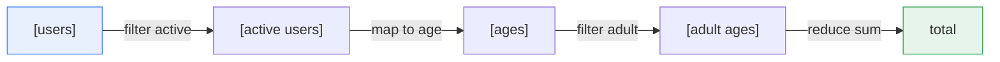
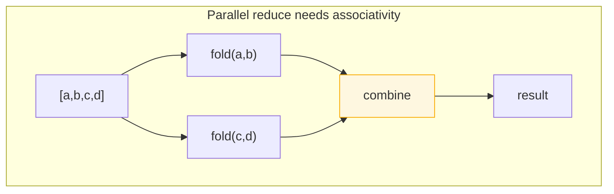

# Map / Filter / Reduce — Middle Level

> **Roadmap:** [Functional Programming](../README.md) → Map / Filter / Reduce
>
> *The trio is easy to learn and easy to abuse. The middle skill is building readable pipelines, knowing when `reduce` is the wrong tool, and reaching for the right idiom in each language instead of forcing one shape everywhere.*

---

## Table of Contents

1. [Introduction](#introduction)
2. [Prerequisites](#prerequisites)
3. [Chaining Pipelines](#chaining-pipelines)
4. [Fold Left / Right & Initial Values](#fold-left--right--initial-values)
5. [flatMap & Grouping](#flatmap--grouping)
6. [When Reduce Is the Wrong Tool](#when-reduce-is-the-wrong-tool)
7. [Trade-offs](#trade-offs)
8. [Common Mistakes](#common-mistakes)
9. [Test Yourself](#test-yourself)
10. [Cheat Sheet](#cheat-sheet)
11. [Summary](#summary)
12. [Further Reading](#further-reading)
13. [Related Topics](#related-topics)

---

## Introduction

> Focus: **using it well.**

At the junior level you learned what `map`, `filter`, and `reduce` *are*: `map` transforms each element, `filter` keeps the ones that pass a predicate, `reduce` (a.k.a. `fold`) collapses a collection into a single value. Each is a higher-order function that takes a function and a collection.

The middle-level question is different. You already reach for these by reflex — the problem is that *reflex is not judgment.* A `reduce` with a six-line lambda that mutates a map is technically correct and genuinely worse than the loop it replaced. A pipeline that chains eight stages allocates seven intermediate collections nobody asked for. A `fold` that builds a list with `[head] + acc` is quadratic and looks innocent.

This file is about the **decisions around** the trio: how to compose stages into a pipeline that reads top-to-bottom, why fold direction and the initial value matter, when to escape to `flatMap` / grouping helpers, and — most importantly — **when to put the lambda down and write a loop or call a purpose-built helper** (`sum`, `groupBy`, `Collectors.toMap`). Examples are in **Go**, **Java** (Streams / Collectors), and **Python**, because the *same* idea wears a very different idiom in each.

---

## Prerequisites

- **Required:** You can read [`junior.md`](junior.md) — you know what `map`, `filter`, and `reduce` do individually and have written a few of each.
- **Required:** Comfort with [first-class & higher-order functions](../01-first-class-and-higher-order-functions/middle.md) — passing functions as arguments and writing lambdas.
- **Helpful:** A sense of [pure functions](../02-pure-functions-and-referential-transparency/junior.md) — the trio behaves predictably only when the function you pass has no side effects.
- **Helpful:** Awareness that these stages compose, which leads naturally into [composition](../05-composition/middle.md).

---

## Chaining Pipelines

The payoff of the trio is **composition**: each stage takes a collection and returns a collection, so stages snap together. A pipeline reads as a sequence of *what happens*, in order, with no loop bookkeeping in between.



The cardinal rule of readable pipelines: **filter before you map, and map before you reduce.** Filtering first shrinks the work everything downstream has to do; mapping to the shape you need before reducing keeps the reduce trivial.

**Python** — comprehensions are the idiomatic pipeline; chained generator expressions stay lazy:

```python
from itertools import filterfalse

users = [...]  # list of dicts
# Pipeline: keep active -> extract age -> keep adults -> sum
total = sum(
    u["age"]
    for u in users
    if u["active"] and u["age"] >= 18
)
```

Python deliberately makes you *not* chain `.map().filter()`; the comprehension fuses all stages into one pass with one allocation. (More on why comprehensions beat `map`/`filter` in Python under [Trade-offs](#trade-offs).)

**Java** — the Stream API is built for chaining; each operation returns a new stream:

```java
int total = users.stream()
    .filter(User::isActive)          // intermediate
    .filter(u -> u.age() >= 18)      // intermediate
    .mapToInt(User::age)             // intermediate (specialized IntStream)
    .sum();                          // terminal
```

Note `mapToInt` → `sum()` rather than a hand-rolled `reduce`. Java's stream is **lazy until the terminal operation**: nothing runs until `.sum()` (a terminal op) pulls elements through. That laziness means the two `filter`s and the `map` fuse into a single pass — no intermediate `List` is materialized between stages.

**Go** — there is no built-in pipeline syntax, and chaining method-style is not idiomatic. The honest Go pipeline is a single loop, or small generic helpers from `slices` / a tiny utility package:

```go
total := 0
for _, u := range users {
    if u.Active && u.Age >= 18 {
        total += u.Age
    }
}
```

```go
// With Go 1.21+ generics helpers (or your own Filter/Map):
adults := Filter(users, func(u User) bool { return u.Active && u.Age >= 18 })
ages   := Map(adults, func(u User) int { return u.Age })
total  := Reduce(ages, 0, func(a, x int) int { return a + x })
```

The Go version of "chaining" allocates a new slice at **every** helper call (`Filter` returns a slice, `Map` returns a slice). For three stages over a million elements that is two throwaway slices. This is exactly why idiomatic Go often keeps the explicit loop: it fuses the stages for free and the reader sees the whole flow at once. Reach for the helpers when the readability win is real and the data is small.

> **Pipeline order rule:** `filter → map → reduce`. Filter early to do less work; reduce last on already-shaped data.

---

## Fold Left / Right & Initial Values

`reduce` is the general tool — `map` and `filter` can both be *expressed* as reductions. Understanding `reduce` deeply means understanding two things juniors usually skip: **direction** and **the initial value**.

### Left fold vs. right fold

A **left fold** (`foldl`) processes elements front-to-back, accumulating into a result that travels left-to-right:

```text
foldl(f, z, [a, b, c])  =  f(f(f(z, a), b), c)
```

A **right fold** (`foldr`) processes back-to-front:

```text
foldr(f, z, [a, b, c])  =  f(a, f(b, f(c, z)))
```

For a **commutative and associative** operation (sum, product, max, count) the two give the same answer, so direction is irrelevant — pick left. Direction matters when the operation is *not* associative or when building order-sensitive output:

- **Subtraction:** `foldl(-, 0, [1,2,3]) = ((0-1)-2)-3 = -6`, but `foldr(-, 0, [1,2,3]) = 1-(2-(3-0)) = 2`. Different results.
- **List construction:** `foldr(cons, [], xs)` rebuilds `xs` in order; `foldl(cons, [], xs)` reverses it.

Most languages give you the left fold by default — Java's `reduce`, Python's `functools.reduce`, and a typical Go `Reduce` helper all fold left. A true right fold is rare outside Haskell/Scala; in eager languages you simulate it by reversing the input or recursing. **The practical takeaway: know that your `reduce` is a *left* fold, and if order or non-associativity matters, that determines whether your accumulator logic is correct.**

### Initial values, associativity, and the empty case

The initial value (the "seed", `z`, or "identity") is not optional decoration — it answers *"what is the result of reducing nothing?"*

```python
from functools import reduce
import operator

reduce(operator.add, [], 0)        # -> 0      (identity for +)
reduce(operator.mul, [], 1)        # -> 1      (identity for *)
reduce(operator.add, [])           # -> TypeError: empty sequence with no initial value
```

That last line is the classic bug: a left fold **without** a seed must use the first element as the seed, so it *raises* on an empty collection. Always pass an explicit identity unless you have a reason to want the throw.

The identity must genuinely be the identity for your operation: `0` for `+`, `1` for `×`, `""` for string concat, `[]` for list append, `Integer.MIN_VALUE` for `max`, the empty set for union. Get this wrong and your result is silently off for the empty (or single-element) case.

**Java** has three `reduce` overloads, and the distinction is exactly about identity and associativity:

```java
// 1) No identity -> returns Optional (handles the empty stream honestly)
Optional<Integer> sum = nums.stream().reduce(Integer::sum);

// 2) Identity + accumulator -> returns a plain value, never empty
int sum2 = nums.stream().reduce(0, Integer::sum);

// 3) Identity + accumulator + COMBINER -> required for parallel streams
int sum3 = nums.parallelStream().reduce(0, Integer::sum, Integer::sum);
```

In overload (3) the **accumulator** folds an element into a partial result and the **combiner** merges two partial results from different threads. Java's contract demands the operation be **associative** and the identity a true identity — because a parallel stream splits the data, folds each chunk independently, then combines. If your operation isn't associative, `parallelStream().reduce(...)` gives a *non-deterministic* answer. Associativity is what makes parallel reduction even possible.



> **Identity rule:** always supply an explicit, *correct* identity. It defines the empty-collection answer and, with associativity, is the precondition for parallel reduction.

---

## flatMap & Grouping

Two operations sit just above the basic trio and solve problems `map`/`filter` cannot.

### flatMap / mapcat — map then flatten

`map` with a function that returns a *collection* gives you a collection-of-collections. `flatMap` (Clojure calls it `mapcat`, Python spells it differently) maps **and** concatenates the results into one flat collection. Use it whenever each input produces zero-or-more outputs.

```java
// Java: each order has many line items; flatten to all items
List<Item> allItems = orders.stream()
    .flatMap(order -> order.items().stream())   // Stream<Item>, not Stream<List<Item>>
    .collect(Collectors.toList());
```

```python
# Python: flatten + transform in one comprehension (the idiomatic flatMap)
all_items = [item for order in orders for item in order.items]

# or, when each element yields a variable number of results:
from itertools import chain
words = list(chain.from_iterable(line.split() for line in lines))
```

```go
// Go: flatMap is just a nested append; no special syntax
var allItems []Item
for _, order := range orders {
    allItems = append(allItems, order.Items...)
}
```

`flatMap` also models **filtering-while-mapping**: return an empty collection to drop an element, a one-element collection to keep it, an N-element collection to expand it — all in one stage. That generality is why it's the workhorse behind `Optional.flatMap`, `Stream.flatMap`, and (conceptually) monadic `bind`, which you'll meet in [Monads — Plain English](../09-monads-plain-english/junior.md).

### Grouping and partitioning

A *very* common need is "bucket these elements by some key." Doing this with a raw `reduce` into a map is the single most over-used and least-readable application of `reduce`. Every language gives you a better tool.

**Java** — `Collectors.groupingBy` is purpose-built and composes with a downstream collector:

```java
// Group orders by customer
Map<String, List<Order>> byCustomer =
    orders.stream().collect(Collectors.groupingBy(Order::customerId));

// Group AND aggregate: total spend per customer (downstream collector)
Map<String, Integer> spendByCustomer =
    orders.stream().collect(Collectors.groupingBy(
        Order::customerId,
        Collectors.summingInt(Order::total)));

// Partition into exactly two buckets by a boolean
Map<Boolean, List<Order>> bigVsSmall =
    orders.stream().collect(Collectors.partitioningBy(o -> o.total() > 100));
```

`partitioningBy` is the specialized two-bucket case (`true`/`false`) and is both clearer and slightly faster than `groupingBy` on a boolean.

**Python** — two right answers depending on input ordering:

```python
from collections import defaultdict
from itertools import groupby

# General grouping (input need NOT be sorted): the idiomatic choice
by_customer = defaultdict(list)
for o in orders:
    by_customer[o.customer_id].append(o)

# itertools.groupby groups only CONSECUTIVE equal keys -> sort first!
orders.sort(key=lambda o: o.customer_id)
grouped = {k: list(g) for k, g in groupby(orders, key=lambda o: o.customer_id)}
```

The `itertools.groupby` footgun trips many engineers: it only collapses **adjacent** equal keys, so without a prior sort it produces many tiny groups. For unsorted data, `defaultdict(list)` is the clearer and correct tool.

**Go** — a plain loop into a map; this is genuinely the idiomatic and most readable version:

```go
byCustomer := map[string][]Order{}
for _, o := range orders {
    byCustomer[o.CustomerID] = append(byCustomer[o.CustomerID], o)
}
```

> **Grouping rule:** never hand-roll grouping with `reduce`. Use `Collectors.groupingBy` (Java), `defaultdict(list)` (Python), or a `map[K][]V` loop (Go). They state intent and avoid subtle accumulator bugs.

---

## When Reduce Is the Wrong Tool

`reduce` is the most powerful and the most *misused* member of the trio. The power is the problem: because it can express anything, it tempts you to express things that have clearer names.

### Use a named helper when one exists

If your reduce is reimplementing `sum`, `min`, `max`, `count`, `any`, `all`, or `join`, stop — the named version says *what* you mean, not *how* it's computed.

```python
# Don't:
total = reduce(lambda a, x: a + x, nums, 0)
# Do:
total = sum(nums)

# Don't:
worst = reduce(lambda a, x: x if x > a else a, scores, scores[0])
# Do:
worst = max(scores)

# Don't:
all_pass = reduce(lambda a, x: a and x.ok, items, True)
# Do:
all_pass = all(x.ok for x in items)
```

```java
// Don't reduce to count or sum:
long n = items.stream().filter(Item::active).count();          // not reduce(0, (a,x)->a+1)
int  s = items.stream().mapToInt(Item::price).sum();           // not reduce(0, Integer::sum)
boolean any = items.stream().anyMatch(Item::active);           // short-circuits; reduce can't
```

`anyMatch` / `allMatch` even **short-circuit** (stop at the first decisive element); a `reduce` always walks the whole collection. So here the helper is not only clearer but faster.

### Use a loop when the body grows or mutates

A `reduce` whose accumulator is a mutable structure being poked at — appending to a list, putting into a map, mutating a builder — has lost the *value-transforming* spirit that justifies the trio. The lambda becomes a loop body crammed into an expression, harder to read and to debug (no clean place to set a breakpoint, no line numbers in a stack trace).

```python
# Reduce abused as a disguised loop — DON'T do this:
result = reduce(
    lambda acc, x: (acc[x.key].append(x), acc)[1],   # mutation hidden in a tuple trick
    items,
    defaultdict(list),
)
```

```python
# The honest version is shorter, faster to read, and debuggable:
result = defaultdict(list)
for x in items:
    result[x.key].append(x)
```

The tell-tales that you should drop back to a loop:

- The lambda is more than ~one expression / one line.
- The accumulator is **mutated** rather than a new value returned.
- You needed a tuple/comma trick to sneak a side effect into an expression.
- You'd want to step through it in a debugger.

### `reduce`'s reputation

This is not a fringe opinion. Guido van Rossum argued for removing `reduce` from Python's builtins precisely because non-trivial reductions are *less* readable than the equivalent loop — and in Python 3 it was moved to `functools` to discourage casual use. Reserve `reduce` for genuine folds with a small, pure, associative-ish combiner where no named aggregate fits.

> **Reduce decision rule:** named aggregate exists (`sum`/`max`/`any`/`count`/`join`) → use it. Accumulator is mutable or the lambda grows → use a loop. Only the residue — a clean fold with a one-line pure combiner — earns `reduce`.

---

## Trade-offs

The trio is not free. Choosing it over a loop (or one idiom over another) is a real engineering trade-off.

### Intermediate collections

The naïve "chain of helpers" model — each stage returns a new collection — allocates one collection per stage. Over large data that is wasted memory and GC pressure.

| Style | Allocations for `filter → map → reduce` |
|---|---|
| Eager helpers (Go `Filter`/`Map`, JS `arr.filter().map()`) | 2 intermediate collections + the result |
| **Lazy / fused** (Java Streams, Python generators, Rust iterators) | 0 intermediate collections — one pass |
| Hand loop | 0 intermediate collections — one pass |

This is why **laziness matters for performance** (full treatment in [Laziness & Streams](../12-laziness-and-streams/middle.md)). A Java `Stream` and a Python generator expression *fuse* the stages: each element flows through filter→map→reduce before the next element is touched, so no intermediate list exists. An eager helper materializes the whole intermediate slice before the next stage starts.

### Readability vs. cleverness

The trio is a readability tool *until it isn't*. A three-stage pipeline of named functions reads beautifully; a one-liner with three nested lambdas and a tuple trick reads worse than the loop it replaced. Optimize for the reader.

### Idiom per language — pick the native one

The same intent has a *preferred* form in each language, and fighting the grain produces worse code:

| Intent | Python | Java | Go |
|---|---|---|---|
| transform + filter | **comprehension** `[f(x) for x in xs if p(x)]` | `stream().filter().map()` | explicit `for` loop |
| sum / aggregate | `sum(...)`, `max(...)` | `mapToInt().sum()`, `Collectors.summingInt` | `for` loop |
| group by key | `defaultdict(list)` | `Collectors.groupingBy` | `map[K][]V` loop |
| flatten | nested comprehension / `chain.from_iterable` | `flatMap` | nested `append` |

- **Python:** comprehensions are clearer and faster than `map`/`filter` + lambda (no per-element function-call overhead, no `lambda`). Use `map(f, xs)` only when `f` already exists as a named function, never with a lambda.
- **Java:** Streams are the idiom, but they have startup cost — for a tiny list in a hot loop a plain `for` can be faster. Use `Collectors` (especially `groupingBy`/`toMap`) instead of hand-rolled `reduce`.
- **Go:** the language deliberately lacks a Stream API. Generics make `Map`/`Filter`/`Reduce` *possible*, but the idiom remains the explicit loop, which fuses stages and reads plainly. Reserve helpers for short, small-data pipelines.

> **Idiom rule:** write the trio in each language's native dialect. A comprehension in Python, a `Collectors` pipeline in Java, a loop in Go — not a transliteration of the same lambda chain into all three.

---

## Common Mistakes

1. **`reduce`-ing into a mutable accumulator.** Appending/putting inside a fold lambda turns a value transformation into a hidden loop. Use a real loop (or `groupingBy`/`defaultdict`).
2. **Forgetting the identity / empty case.** A seedless left fold throws on an empty collection, and a wrong identity (`0` for `max`, `1` for `+`) silently corrupts the empty/single-element result.
3. **Reinventing named aggregates.** `reduce(+, xs, 0)` instead of `sum`, or a reduce that counts instead of `count()`/`len()`. The named helper states intent and may short-circuit.
4. **`itertools.groupby` without sorting first.** It only groups *consecutive* equal keys; unsorted input yields fragmented groups. Sort first, or use `defaultdict(list)`.
5. **Map-before-filter.** Mapping the whole collection and then filtering does transformation work you immediately discard. Filter first.
6. **Side effects inside `map`/`filter`.** These should be pure transformations. Doing I/O or mutation inside them is surprising, breaks laziness reasoning, and is undefined-order under parallel streams.
7. **Parallelizing a non-associative reduce.** `parallelStream().reduce` with a non-associative operator (or a non-identity seed) gives non-deterministic results.
8. **Over-chaining in eager languages.** A long chain of eager `Filter().Map().Filter()` helpers allocates an intermediate collection per stage; collapse to a loop or a lazy stream.
9. **Transliterating idioms.** Forcing `map(lambda ...)` chains in Python (where comprehensions win) or method-chain helpers in Go (where a loop wins) produces non-idiomatic, often slower code.

---

## Test Yourself

1. You have a list of orders; you want the total revenue from orders over $100. Write the pipeline and explain why you put `filter` before `map`.
2. `reduce(operator.sub, [1, 2, 3])` — what does it return, and why does fold *direction* matter here when it didn't for `+`?
3. Why does Java require a *combiner* in the three-argument `reduce`, and what property must the accumulator satisfy for a parallel stream to be correct?
4. You wrote `reduce(lambda acc, x: acc + [x.name], people, [])`. Name two problems with it and give a better version.
5. When should you use `flatMap` instead of `map`? Give a concrete example.
6. A teammate groups records with `itertools.groupby` and gets duplicate keys in the output. What did they forget, and what would you use instead?
7. Give three signals that a `reduce` should be rewritten as a plain loop.

<details>
<summary>Answers</summary>

1. `sum(o.total for o in orders if o.total > 100)` (Python) or `orders.stream().filter(o -> o.total() > 100).mapToInt(Order::total).sum()` (Java). Filter first so that `map`/`sum` only touch the rows that survive — mapping the whole list then discarding most of it is wasted transformation work.
2. It returns `((1-2)-3) = -4` (a left fold). Subtraction is **not associative or commutative**, so left vs. right fold give different answers (`foldr` would give `1-(2-3) = 2`); for `+` (associative + commutative) direction is irrelevant.
3. A parallel stream splits the data into chunks, folds each chunk independently (producing several partial results), then must merge them — the **combiner** does that merge. For correctness the accumulator/combiner must be **associative** and the seed a true **identity**, otherwise the result depends on how the data was split (non-deterministic).
4. (a) It **mutates by allocation** — `acc + [x.name]` builds a brand-new list every iteration, making the fold **O(n²)**; (b) it's a disguised loop that's harder to read/debug than the equivalent. Better: `[p.name for p in people]` — a comprehension, O(n) and clearer.
5. Use `flatMap` when each element maps to *zero-or-more* results that you want flattened into one collection — e.g. each `order` has a list of `items` and you want all items across all orders: `orders.stream().flatMap(o -> o.items().stream())`. `map` alone would give you a stream of *lists*.
6. `itertools.groupby` only groups **consecutive** equal keys, so unsorted input produces a new group every time the key changes back — hence repeated keys. Either `sort` by the key first, or (better for unsorted data) use `defaultdict(list)`.
7. Any of: the lambda exceeds ~one expression; the accumulator is *mutated* rather than returned fresh; you needed a tuple/comma trick to embed a side effect; a named aggregate (`sum`/`max`/`any`) already covers it; you'd want to set a breakpoint inside it.

</details>

---

## Cheat Sheet

| Situation | Reach for | Avoid |
|---|---|---|
| Transform + filter (Python) | comprehension `[f(x) for x in xs if p(x)]` | `map(lambda...)` chains |
| Transform + filter (Java) | `stream().filter().map()` | manual index loop |
| Transform + filter (Go) | explicit `for` loop | long eager helper chains |
| Sum / max / count / any | `sum`/`max`/`count`/`anyMatch` | `reduce` reinventing them |
| Group by key | `groupingBy` / `defaultdict(list)` / `map[K][]V` | `reduce` into a map |
| Two-bucket split | Java `partitioningBy` | `groupingBy` on a boolean |
| Map → variable-length output | `flatMap` / nested comprehension | `map` then manual flatten |
| Genuine fold | `reduce` with **identity** + one-line pure combiner | mutable-accumulator `reduce` |

**Three golden rules:**
- *Order the pipeline `filter → map → reduce` — do less work, then shape it, then collapse it.*
- *Always pass an explicit, correct identity; it defines the empty case and enables parallel reduction (with associativity).*
- *If a named aggregate fits or the accumulator mutates, it isn't a `reduce` — it's a `sum`/`groupBy` or a loop.*

---

## Summary

- The trio's value is **composition**: stages that each take a collection and return one snap into a pipeline that reads as *what happens, in order*. Order matters — `filter → map → reduce`.
- **`reduce` is a left fold.** Direction is irrelevant for associative+commutative operations (sum, max) but decisive for subtraction or order-sensitive output. The **initial value** is the identity that defines the empty-collection result and, with **associativity**, is the precondition for parallel reduction.
- **`flatMap`** maps-then-flattens (and can filter/expand in one stage); **grouping/partitioning** has dedicated tools — `Collectors.groupingBy`/`partitioningBy`, `defaultdict(list)`, a `map[K][]V` loop — that are always better than a hand-rolled `reduce` into a map.
- **`reduce` is the wrong tool** when a named aggregate fits (`sum`/`max`/`any`/`count`/`join`, which also short-circuit) or when the accumulator is mutated and the lambda grows — then use a loop. Reserve `reduce` for clean, one-line, pure folds.
- **Trade-offs:** eager helper chains allocate an intermediate collection per stage; lazy/fused streams (Java Streams, Python generators) and plain loops do one pass. Write the trio in each language's **native idiom** — comprehensions in Python, `Collectors` in Java, loops in Go — not a single lambda chain transliterated everywhere.
- Next: [`senior.md`](senior.md) — fusion, transducers, and the deeper algebra (folds as catamorphisms) behind the trio.

---

## Further Reading

- **Structure and Interpretation of Computer Programs** — Abelson & Sussman — §2.2.3 "Sequences as Conventional Interfaces": the original case for map/filter/accumulate as composable stages.
- **Java SE API — `java.util.stream` package summary** — the contract for laziness, associativity, the three `reduce` overloads, and `Collectors`.
- **Python docs — *Functional Programming HOWTO*** and the `itertools` / `functools` references — comprehensions vs. `map`/`filter`, `reduce`, `groupby`.
- **"The fate of reduce() in Python 3000"** — Guido van Rossum — why non-trivial reductions are less readable than loops.
- **Why Functional Programming Matters** — John Hughes (1990) — composition and "glue" as the real payoff of higher-order functions.

---

## Related Topics

- [Composition](../05-composition/middle.md) — pipelines are composition applied to collection-shaped functions.
- [Laziness & Streams](../12-laziness-and-streams/middle.md) — why fused/lazy pipelines avoid intermediate collections.
- [First-Class & Higher-Order Functions](../01-first-class-and-higher-order-functions/middle.md) — the mechanism the trio is built on.
- [Recursion & Tail Calls](../08-recursion-and-tail-calls/middle.md) — `fold` is the structured form of accumulator recursion.
- [Monads — Plain English](../09-monads-plain-english/junior.md) — `flatMap` is `bind`; the trio generalizes beyond lists.
- [Clean Code → Async & Functional](../../clean-code/12-async-and-functional/README.md) — applying functional style in everyday code.
