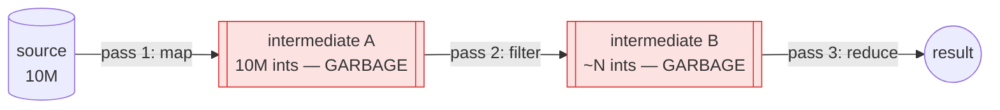

# Map / Filter / Reduce — Professional Level

> **Roadmap:** [Functional Programming](../README.md) → Map / Filter / Reduce
>
> *The trio is semantically trivial. Its cost is entirely in **where the intermediate values live** and **how many times the data is walked.** This file is about turning a chain of allocations into a single pass — and measuring the difference instead of asserting it.*

---

## Table of Contents

1. [Introduction](#introduction)
2. [Prerequisites](#prerequisites)
3. [The Intermediate-Allocation Problem](#the-intermediate-allocation-problem)
4. [Loop Fusion / Deforestation](#loop-fusion--deforestation)
5. [Eager vs Lazy: Memory and Throughput](#eager-vs-lazy-memory-and-throughput)
6. [Java Stream Internals & Parallelism](#java-stream-internals--parallelism)
7. [Boxing, Branch Cost & Measurement](#boxing-branch-cost--measurement)
8. [`reduce` as a Catamorphism](#reduce-as-a-catamorphism)
9. [Common Mistakes](#common-mistakes)
10. [Test Yourself](#test-yourself)
11. [Cheat Sheet](#cheat-sheet)
12. [Summary](#summary)
13. [Further Reading](#further-reading)
14. [Related Topics](#related-topics)

---

## Introduction

> Focus: **theory + runtime.** Three questions decide the performance of every `map`/`filter`/`reduce` chain you will ever write — *how many collections does it allocate, how many times does it walk the data, and what does each element cost to box and to branch on?* Everything below is an answer to one of those three.

The earlier levels taught the semantics: `map` transforms each element, `filter` keeps a subset, `reduce`/`fold` collapses the sequence to one value. That is correct and complete as *semantics*. As *machine behavior* it is dangerously incomplete, because the obvious implementation — run `map` to completion, then `filter` its result, then `reduce` that — allocates a fresh collection at every arrow and walks the data once per stage. On large inputs the trio's cost is dominated not by the transform functions but by **the collections nobody named.**

This is the professional distinction. A junior writes `xs.map(f).filter(p).sum()` and ships it. A professional knows that line has two possible compilations that differ by an order of magnitude in allocation and throughput — an **eager chain** of three passes with two throwaway collections, or a **fused single pass** with none — and knows which one their language gives them by default, how to force the other, and how to *prove* the gap with a benchmark rather than a hunch.

Two disciplines define this level:

1. **Count the intermediates.** Before reasoning about speed, ask how many collections a chain allocates. In eager languages (Python lists, Go slices) the answer is "one per stage." In lazy ones (Haskell, Java `Stream`, Python generators) the answer can be zero. That count, not the big-O of the transform, is usually what the profiler blames.
2. **Never argue throughput from intuition.** Every claim here pairs with the instrument that proves it on *your* data: JMH for the JVM, `testing.B` + `benchstat` for Go, `timeit`/`pyperf` for Python. The illustrative numbers in this file are labeled as such; your job is to generate the real ones.

> **The mental model:** a `map`/`filter`/`reduce` chain is a *description of a computation*, not a sequence of collection-building steps. Whether that description compiles to N passes with N−1 intermediates or to **one pass with none** depends on laziness, fusion, and which API you reached for. The whole game is collapsing the description into one walk.

---

## Prerequisites

- **Required:** Fluent with [`senior.md`](senior.md) — you can refactor imperative loops into declarative pipelines and back, and you know `map`/`filter`/`reduce` cold.
- **Required:** Working model of a managed heap: allocation cost, a tracing GC's mark/sweep, why short-lived garbage still costs (young-gen churn, allocation-rate-driven GC frequency).
- **Required:** You can read a JMH table, a `benchstat` diff, and a `timeit` result and tell signal from noise.
- **Helpful:** Lazy evaluation and stream mechanics — see [Laziness & Streams](../12-laziness-and-streams/professional.md), which this file leans on heavily.
- **Helpful:** big-o-analysis, profiling-techniques, memory-leak-detection skills for the measurement vocabulary.

---

## The Intermediate-Allocation Problem

Take the canonical chain — "double every number, keep the big ones, sum them":

```python
result = sum(x * 2 for x in xs if x * 2 > 100)  # we'll get here; first the naive form
```

Written eagerly, stage by stage, on a Python list:

```python
# EAGER — each stage materializes a full list. Three passes, two throwaway lists.
doubled  = [x * 2 for x in xs]          # pass 1: allocates a list of len(xs)
big      = [y for y in doubled if y > 100]  # pass 2: allocates a second list
result   = sum(big)                      # pass 3: walks the second list
```

For `len(xs) == 10_000_000`, this allocates **two intermediate lists of ~10M elements each** that exist only to be consumed by the next stage and immediately become garbage. The transform functions (`* 2`, `> 100`) are trivial; the cost is the two collections and the three separate walks over (mostly) the same data.

The same shape, the same trap, in Go and Java with eager helpers:

```go
// Go — generic helpers (hand-rolled or x/exp/slices-style) are EAGER.
doubled := Map(xs, func(x int) int { return x * 2 })   // new []int, len(xs)
big     := Filter(doubled, func(y int) bool { return y > 100 }) // another new []int
result  := Reduce(big, 0, func(a, b int) int { return a + b })
// Two heap slices allocated, two GC-tracked, two extra passes.
```

```java
// Java — Collectors materialize. This is an eager chain wearing a Stream costume.
List<Integer> doubled = xs.stream().map(x -> x * 2).collect(toList());     // list 1
List<Integer> big     = doubled.stream().filter(y -> y > 100).collect(toList()); // list 2
int result            = big.stream().mapToInt(i -> i).sum();
```



The costs, all of which a profiler will surface and none of which the source code names:

- **Allocation pressure.** Two large arrays allocated and discarded per call. Allocation is cheap per object but the *rate* drives GC frequency; a hot endpoint doing this per request churns the young generation.
- **Memory footprint.** Peak resident memory is `O(input)` for *each* live intermediate — you hold the whole doubled list in RAM before filtering starts. For inputs near memory limits this is the difference between running and OOM.
- **Cache traffic.** Three passes touch ~30M elements of memory traffic where one pass would touch ~10M. The data is read from and written to RAM three times instead of streamed once.
- **No short-circuit.** If the real goal were `.first()` or `.any()`, the eager chain still builds the *entire* doubled and filtered lists before the consumer looks at element zero.

> **Diagnose it:** Python `tracemalloc` (peak + per-line allocation) or `memray`; Go `-memprofile` / `pprof -alloc_space` and the `B/op` + `allocs/op` columns from `benchstat`; Java JFR allocation events or `-Xlog:gc*` showing young-gen churn. The signature of this anti-pattern is **high allocation rate with low algorithmic work** — the GC is busy collecting collections you never meant to keep.

---

## Loop Fusion / Deforestation

The fix is not to write a worse loop — it is to make the *same* declarative chain compile to a single pass with no intermediate collections. This transformation has a name in the literature: **deforestation** (Wadler, 1990) — eliminating the intermediate data structures ("trees") that a composition of transformations would otherwise build. The runtime-engineering term for the same idea is **loop fusion**: collapsing `map ∘ filter ∘ reduce` into one loop body.

The hand-fused version makes the target explicit:

```go
// FUSED by hand — one pass, zero intermediate slices, zero extra GC pressure.
sum := 0
for _, x := range xs {
    y := x * 2          // map, inlined
    if y > 100 {        // filter, inlined
        sum += y        // reduce, inlined
    }
}
```

This is what every fusion mechanism is *trying to produce automatically* so you don't have to surrender the declarative form. The mechanisms differ by language:

**1. Lazy streams / pull-based iteration (Java `Stream`, Python generators, Rust iterators).** A lazy pipeline doesn't compute anything until a terminal operation *pulls*. Each pulled element flows through `map` then `filter` then into the reduce **before the next element is pulled** — so no stage ever materializes a full collection. This is fusion by *architecture*: the intermediates never exist because evaluation is element-at-a-time.

```python
# FUSED via generators — element-at-a-time, no intermediate lists.
result = sum(x * 2 for x in xs if x * 2 > 100)
#            └─ generator expression: map+filter fused, sum pulls one at a time
# Peak extra memory: O(1), not O(n). One logical pass.
```

```java
// FUSED via Stream — lazy by design. map/filter are intermediate ops that build
// no collection; sum() is the terminal op that drives one pass.
int result = xs.stream()
               .mapToInt(x -> x * 2)   // primitive stream — also dodges boxing (see below)
               .filter(y -> y > 100)
               .sum();                  // single traversal, zero intermediate lists
```

**2. Transducers (Clojure, and the pattern ported to many languages).** A transducer is a *composable transformation* decoupled from the source and the sink. `(comp (map f) (filter p))` builds one combined reducing function; running it over a source applies `f` and `p` per element in a single reduce with no intermediate sequences. Fusion becomes a first-class, reusable value rather than a compiler trick.

**3. Compiler rewrite rules (GHC / Haskell).** Haskell's libraries ship `RULES` pragmas (the classic `foldr/build` short-cut fusion, and the stream-fusion framework) that let the *compiler* rewrite `foldr k z (map f (filter p xs))` into a single recursive loop at compile time, allocating no intermediate list. The programmer writes the maximally-declarative form; GHC deforests it.

```haskell
-- Haskell: written as a three-stage pipeline...
result = sum (map (*2) (filter (>50) xs))
-- ...but GHC's list-fusion RULES rewrite this to a single foldr/loop with
-- NO intermediate list ever allocated. Declarative source, fused machine code.
```

### Before / After — labeled illustrative numbers

A microbenchmark of "double, keep >100, sum" over 10M `int`s, eager-chain vs fused, is the canonical demonstration. **These numbers are illustrative — reproduce them on your hardware with the harnesses in the next section.**

| Form | Passes | Intermediate collections | Allocations | Throughput (rel.) |
|---|---|---|---|---|
| Eager chain (3 stages, materialized) | 3 | 2 × `O(n)` | ~2 × n objects/refs | **1.0× (baseline)** |
| Fused (lazy stream / generator) | 1 | 0 | ~0 (plus pipeline scaffolding) | **~2.5–4×** |
| Hand-written loop | 1 | 0 | 0 | **~3–5×** (often == fused, sometimes a touch faster) |

```
# Go benchstat sketch (illustrative):
                  │  eager-chain  │            fused-loop             │
                  │    sec/op     │   sec/op     vs base              │
DoubleFilterSum   │   42.1m ± 2%  │  11.3m ± 1%   -73.2%             │
                  │     B/op      │    B/op      vs base              │
DoubleFilterSum   │  160.0Mi ± 0% │   0.0  ± 0%   -100.00%           │  ← intermediates gone
                  │   allocs/op   │  allocs/op   vs base              │
DoubleFilterSum   │     2.00 ± 0% │   0.00 ± 0%   -100.00%           │
```

The headline is the **`B/op` and `allocs/op` going to zero**, not just the wall-clock win. The throughput improvement is a *consequence* of removing the allocation and the extra passes; the allocation columns are the proof of *why*.

> **The catch — fusion isn't free or guaranteed.** Lazy fusion adds per-element overhead (a virtual call / closure invocation per stage) that a fully-inlined hand loop avoids; on small inputs the eager or hand-loop form can win because the pipeline scaffolding dominates. GHC's RULES fire only when the code matches the pattern (a `let`-bound intermediate or an unfortunate `seq` can block them). The professional move is to **know your default** (is this language eager or lazy here?) and **measure the specific chain**, not to assume fusion always happens.

---

## Eager vs Lazy: Memory and Throughput

The same trio behaves oppositely depending on whether the language evaluates the chain eagerly or lazily. This is the single most important runtime distinction in this topic.

| Property | **Eager** (Python `list`, Go slice helpers, Java `Collectors.toList`) | **Lazy** (Java `Stream`, Python generator, Haskell, Rust `Iterator`) |
|---|---|---|
| Intermediate collections | One per stage | **Zero** (fused element-at-a-time) |
| Peak extra memory | `O(n)` per live stage | `O(1)` |
| Passes over data | One per stage | **One** total |
| Short-circuit (`first`/`any`/`take`) | No — full chain runs first | **Yes** — stops at the first hit |
| Per-element overhead | Low (tight loop per stage) | Higher (closure/virtual call per stage) |
| Reusable after consumption | Yes (it's a materialized collection) | **No** — a lazy stream/iterator is single-use |
| Debuggability | Easy — inspect intermediates | Harder — nothing exists until pulled |
| Best when | Small data, need the intermediate, reuse it | Large data, long chains, early termination, streaming |

**Eager's hidden virtue.** Eager isn't simply "worse." When the input is small, a tight per-stage loop with no closure indirection can beat a lazy pipeline whose scaffolding cost dominates. And if you genuinely *need* the doubled list (you reuse it three times), materializing it once is correct — laziness would recompute it on each consumption unless you force/cache it.

**Lazy's decisive wins.** Two cases make laziness not just faster but *categorically necessary*:

- **Short-circuiting.** `stream.map(expensive).filter(p).findFirst()` evaluates `expensive` only until the first match. The eager equivalent computes `expensive` for *every* element first. On a 10M-element source where the answer is element 3, that is the difference between 3 calls and 10M.
- **Infinite / unbounded sources.** A generator or `Stream.iterate(...)` can `map`/`filter` an infinite sequence and `take(k)`; the eager form cannot exist — it would never finish materializing stage one. (See [Laziness & Streams](../12-laziness-and-streams/professional.md).)

```python
# Lazy short-circuit: stops at the first match; expensive() called ~3 times.
first_big = next(y for x in xs if (y := expensive(x)) > THRESH)

# Eager equivalent: expensive() called len(xs) times before we look at element 0.
first_big = [expensive(x) for x in xs if expensive(x) > THRESH][0]  # wasteful + double-calls
```

```python
# timeit sketch (illustrative), 10M ints, "double, keep >100, sum":
#   list comprehension chain (2 lists) : 1.00x  (baseline, ~2 GB peak via tracemalloc)
#   map()+filter() returning iterators : ~0.95x (lazy in py3, but lambda call overhead)
#   generator expression (fused)       : ~0.70x (O(1) peak memory — the real win)
#   hand loop                          : ~0.65x
# Lesson: in Python the memory story (generator: O(1) peak) often matters more than ns.
```

> **Diagnose it:** the eager-vs-lazy choice is visible in `tracemalloc`/`memray` peak (lazy stays flat, eager spikes per stage) and in the `allocs/op` column. If peak memory scales with input *and* you never reuse the intermediate, you have an eager chain that should be lazy.

---

## Java Stream Internals & Parallelism

Java's `Stream` is the richest production example of a fused, lazy pipeline, and its internals reward understanding because its parallel mode is the most commonly *misused* feature in this whole topic.

**Pipeline structure.** A stream is a lazily-built linked structure of **pipeline stages**. Each intermediate operation (`map`, `filter`) creates a new stage that wraps the previous one; *no work happens* until a **terminal operation** (`sum`, `collect`, `findFirst`, `reduce`) is invoked. The terminal op drives a single traversal, pushing each element through the chained stages — this is the fusion: stages compose into one `accept(element)` call path, no intermediate collection.

**Spliterator.** The source is described by a `Spliterator` ("splittable iterator") — it knows how to traverse (`tryAdvance`) *and* how to split itself (`trySplit`) for parallelism, plus characteristics (`SIZED`, `ORDERED`, `SORTED`, `DISTINCT`) the pipeline uses to optimize. A well-characterized source (an `ArrayList`, an array, an `IntStream.range`) splits cheaply into balanced halves; a poorly-characterized one (a `LinkedList`, an I/O source, `iterate`) splits badly or not at all.

**Short-circuiting.** Terminal ops like `findFirst`, `anyMatch`, `limit` are short-circuiting — the traversal stops as soon as the answer is known, exactly the lazy win described above. `findAny` exists specifically so the parallel engine needn't preserve encounter order when you don't care.

```java
// Sequential stream: one Spliterator, one thread, one fused pass.
OptionalInt firstBig = xs.stream()
    .mapToInt(x -> x * 2)
    .filter(y -> y > 100)
    .findFirst();          // short-circuits — stops at the first match
```

### Parallel streams: the fork-join trap

`.parallel()` reuses the **common ForkJoinPool** to split the source via `trySplit`, process chunks on multiple threads, and combine results. It is one method call — and that is the danger, because it hides a cost model that frequently makes it *slower* than sequential.

`parallelStream()` tends to **lose** when:

- **The source splits badly.** `LinkedList`, `HashSet` iteration, `Stream.iterate`, or any non-`SIZED`/non-balanced source produces lopsided splits; one thread gets most of the work and the parallelism evaporates while you still pay coordination overhead.
- **N is small or per-element work is tiny.** The fork/split/merge and pool-scheduling overhead is fixed; below a threshold (rule of thumb: **N × cost-per-element must be large**, often cited as needing ≳ ~10⁴–10⁵ cheap elements to break even) sequential wins outright.
- **The merge is expensive or stateful.** Combining results (`Collectors.toList`, `groupingBy`) has its own cost; an ordered collector forces extra work to restore encounter order.
- **It contends on shared state.** A lambda touching a shared mutable structure (a non-concurrent collector, an external counter) either corrupts data or serializes on a lock, erasing the gain. Parallel stream lambdas must be **stateless and non-interfering** — this is a *correctness* requirement, not just a performance one.
- **It steals the common pool.** The default `ForkJoinPool.commonPool()` is shared process-wide; a blocking or long parallel stream starves *every other* parallel stream and CompletableFuture in the JVM. Blocking I/O inside a parallel stream is a classic production incident.

```java
// LOOKS faster, often slower. Measure before believing.
int sum = bigList.parallelStream()         // LinkedList here = bad splits → no speedup
    .mapToInt(x -> compute(x))             // if compute() is cheap, overhead dominates
    .sum();                                // and it borrows the shared common pool

// Correct parallel use: large, well-characterized, SIZED source; substantial per-element
// work; stateless lambdas; sequential measured as the baseline first.
int sum2 = Arrays.stream(bigArray)         // primitive array → SIZED, splits perfectly
    .parallel()
    .map(x -> expensivePureTransform(x))   // heavy + pure → parallelism pays
    .sum();
```

> **Diagnose it:** JMH with `@Threads`/`Blackhole` comparing `.stream()` vs `.parallelStream()` on *your* source and *your* element cost — never assume. JFR will show ForkJoinPool worker activity and whether splits are balanced. The default answer to "should I add `.parallel()`?" is **no, until a JMH benchmark on the real workload says yes.**

---

## Boxing, Branch Cost & Measurement

Two per-element costs determine whether a fused chain is fast or merely fused: **boxing** in numeric reduces, and **branch prediction** in filters.

### Boxing: `IntStream` vs `Stream<Integer>`

On the JVM, `Stream<Integer>` stores **boxed** `Integer` objects — each is a heap object with a header, reached through a reference, and each arithmetic step unboxes and re-boxes. A `map(i -> i * 2)` on a `Stream<Integer>` allocates a fresh `Integer` per element (outside the −128..127 cache) and chases a pointer per access. The primitive specializations — `IntStream`, `LongStream`, `DoubleStream` — store raw primitives in a flat array, no boxing, no pointer chase, vectorizable.

```java
// SLOW — boxed. Every element is a heap Integer; sum() unboxes 10M times.
int s1 = xs.stream()                 // Stream<Integer>
           .map(i -> i * 2)          // allocates a new Integer per element
           .reduce(0, Integer::sum); // unbox both args every step

// FAST — primitive. Flat int storage, no allocation, no unboxing.
int s2 = xs.stream()
           .mapToInt(Integer::intValue)  // (or start from IntStream)
           .map(i -> i * 2)
           .sum();
```

```
# JMH sketch (illustrative), sum of doubled 10M ints:
Benchmark                       Mode  Cnt   Score   Error  Units
boxedStreamReduce              avgt    5  58.402 ± 2.1  ms/op   ← Integer boxing tax
intStreamSum                   avgt    5  12.118 ± 0.6  ms/op   ← ~4.8x faster, 0 boxing alloc
intStreamSum:·gc.alloc.rate    avgt    5  ≈0     MB/sec        ← the proof: no allocation
boxedStreamReduce:·gc.alloc.rate avgt  5  ≈3200  MB/sec        ← 10M Integers/op
```

The `gc.alloc.rate` row (JMH's `-prof gc`) is the smoking gun: the boxed form allocates an `Integer` per element, the primitive form allocates nothing. The same trap exists in Python only weakly (ints are always objects, but small ints are cached) and in Go not at all for `[]int` — but on the JVM it is the most common silent 3–5× tax in numeric pipelines.

### Branch / predicate cost in `filter`

A `filter` is a branch per element. The CPU's branch predictor makes a *well-predicted* branch nearly free (~1 cycle) and a *mispredicted* one expensive (a pipeline flush, ~15–20 cycles). So `filter`'s real cost depends on the **predictability of the predicate over your data**:

- A predicate that's ~99% one way (`x > 0` on mostly-positive data) predicts perfectly — nearly free.
- A predicate that's ~50/50 and data-order-random is a misprediction factory — every other element flushes the pipeline.

This is why two `filter`s with identical big-O can differ measurably in throughput, and why **predicate ordering matters**: put the cheapest, most-selective predicate first so it rejects most elements before the expensive predicate runs (`.filter(cheapCommon).filter(expensiveRare)`), and the downstream stages see fewer elements.

### The measurement toolkit

| Concern | Go | Java / JVM | Python |
|---|---|---|---|
| **Microbenchmark** | `testing.B` + `benchstat` | **JMH** (`@Benchmark`, `Blackhole`) | `timeit`, `pyperf` |
| **Allocation per op** | `-benchmem` → `B/op`, `allocs/op` | JMH `-prof gc` → `gc.alloc.rate` | `tracemalloc`, `memray` |
| **CPU profile** | `-cpuprofile`, `pprof` | async-profiler, JFR | `cProfile`, `py-spy`, `scalene` |
| **Branch/cache counters** | `perf stat -e branches,branch-misses` | `perf`, async-profiler hw events | `perf stat python …` |
| **Did it fuse / inline?** | `go build -gcflags=-m` | `-XX:+PrintInlining` | (CPython doesn't inline) |

```bash
# Go: prove the intermediates are gone — allocs/op should hit 0 for the fused form.
go test -bench=DoubleFilterSum -benchmem -count=10 | tee out.txt && benchstat out.txt

# Java: prove boxing — gc.alloc.rate separates IntStream (≈0) from Stream<Integer>.
java -jar benchmarks.jar DoubleFilter -prof gc

# Python: prove the memory win — peak stays O(1) for the generator form.
python -c "import tracemalloc, timeit; ..."   # compare list-comp peak vs genexpr peak
```

> **Discipline:** the three columns that *prove* this topic's lessons are **`allocs/op` / `B/op`** (did fusion remove the intermediates?), **`gc.alloc.rate`** (did `IntStream` remove the boxing?), and **`branch-misses`** (is the filter predictable?). Wall-clock alone tells you *that* it's faster; these tell you *why*, which is what lets you generalize the fix.

---

## `reduce` as a Catamorphism

`reduce`/`fold` is not merely "the third member of the trio." It is the **universal recursion scheme** over a sequence — in category-theory terms, a **catamorphism**: the unique structure-collapsing morphism from an algebraic data type to a result. The practical payoff of knowing this is twofold.

**1. `map` and `filter` are special cases of `fold`.** You can define both in terms of `reduce`, which is why fusion works: a chain of maps and filters *is* a single fold whose step function is the composition of the per-stage transforms. That is the theoretical statement of which loop fusion is the implementation.

```haskell
-- map and filter are folds; therefore map∘filter∘fold collapses to one fold.
map f    = foldr (\x acc -> f x : acc) []
filter p = foldr (\x acc -> if p x then x : acc else acc) []
-- A fold is the catamorphism for lists: it replaces (:) and [] with your (step, init).
```

**2. Associativity is what enables parallel reduce.** A sequential `foldl` threads an accumulator left-to-right — inherently serial. But if the combining operation is **associative** (`(a ⊕ b) ⊕ c == a ⊕ (b ⊕ c)`), the reduction can be split into independent sub-reductions on different threads and combined in any grouping — this is exactly what Java's `Stream.reduce(identity, accumulator, combiner)` and parallel reduce require. The `identity` must be a true identity element (`x ⊕ identity == x`) and the operation must be associative, or the parallel result is nondeterministic.

```java
// Parallel reduce is correct ONLY if combiner is associative and identity is a real
// identity. '+' with 0 qualifies; subtraction or "append with a separator" does not.
int sum = stream.parallel().reduce(0, Integer::sum);   // ✓ associative, 0 is identity
// reduce(1.0, (a,b) -> a - b)  ✗  not associative → wrong/nondeterministic in parallel
```

This is why `sum`, `min`, `max`, `count`, and monoidal concatenation parallelize trivially while "running difference" or "build a string left-to-right with state" do not. The algebra (monoid: associative op + identity) is the *precondition* for the fork-join split to be correct — the catamorphism view tells you, before you benchmark, whether a reduce is even *eligible* for parallelism.

> **The through-line:** fusion (one pass) and parallelism (many passes combined) are the two performance superpowers of the trio, and **both are theorems about `fold`** — fusion because map/filter *are* folds, parallelism because an associative fold splits. The theory isn't decoration; it tells you which optimizations are legal.

---

## Common Mistakes

Professional-level mistakes — subtle, and therefore expensive:

1. **Materializing intermediates you immediately consume.** `collect(toList())` between a `map` and a `filter`, or stage-by-stage list comprehensions, allocates `O(n)` garbage for nothing. Keep the pipeline lazy end-to-end; collect once, at the terminal.
2. **Assuming your language fuses.** Python list comprehensions and Go slice helpers are **eager** — no fusion, one allocation per stage. Only generators/`Stream`/iterators/Haskell fuse. Know your default before reasoning about cost.
3. **Reaching for `Stream<Integer>` in a numeric reduce.** Boxing is a silent 3–5× tax with an allocation per element. Use `IntStream`/`LongStream`/`DoubleStream`; confirm with JMH `gc.alloc.rate ≈ 0`.
4. **Sprinkling `.parallel()` as a free speedup.** On small N, cheap per-element work, badly-splitting sources (`LinkedList`), or stateful lambdas it is slower or wrong — and it borrows the shared common pool, hurting the whole JVM. Default to sequential; add parallel only when a JMH benchmark on the real source says yes.
5. **Filtering after the expensive map.** `.map(expensive).filter(p)` runs `expensive` on every element. Push selective, cheap filters *before* the expensive map so fewer elements reach it. (Don't confuse this with fusion — order matters even in a fused pass because it changes how many elements each stage sees.)
6. **Reusing a consumed lazy stream / iterator.** A `Stream` or Python generator is single-use; touching it twice throws or yields nothing. If you need two passes, materialize once or build two pipelines.
7. **Parallel-reducing with a non-associative combiner.** Subtraction, division, ordered string-building with state — these give nondeterministic results under parallel reduce. Verify the monoid (associative op + true identity) before parallelizing.
8. **Benchmarking only wall-clock.** A faster ns/op without checking `allocs/op` and `gc.alloc.rate` doesn't tell you *why* — and a "win" that's really the JIT eliminating dead code (no `Blackhole`) is a measurement artifact. Always capture the allocation columns and consume your results.

---

## Test Yourself

1. Explain, in terms of passes and allocations, why `xs.map(f).filter(p).sum()` written with eager helpers is slower than the hand-written single loop — and name the benchmark columns that would prove the difference.
2. What is loop fusion / deforestation, and name three distinct mechanisms (across different languages) that achieve it. When does fusion *fail* to happen or *lose* to the eager form?
3. Give two cases where laziness is not merely faster but categorically necessary (impossible to do eagerly).
4. On the JVM, why is `Stream<Integer>` summed via `reduce` so much slower than `IntStream.sum()`? Which JMH profiler row is the smoking gun?
5. List four conditions under which `parallelStream()` is *slower* than `stream()`, and the tool you'd use to decide on a real workload.
6. Why does the associativity of a reduce's combining operation determine whether it can be parallelized? Give one operation that qualifies and one that doesn't.
7. Two `filter` predicates have identical big-O but one is measurably slower. Give the microarchitectural reason and the counter that confirms it.

<details>
<summary>Answers</summary>

1. The eager form runs **three passes** (map, filter, reduce) and allocates **two intermediate collections** of `O(n)` that become garbage immediately; the hand loop runs **one pass** and allocates **zero** intermediates. The proof columns are **`allocs/op`** and **`B/op`** (Go `-benchmem`) — they drop to 0 for the fused/loop form — plus throughput as the consequence.
2. Deforestation/fusion = collapsing a composition of transforms into one pass with no intermediate data structures. Mechanisms: (a) **lazy pull-based iteration** (Java `Stream`, Python generators, Rust iterators — element-at-a-time, intermediates never materialize); (b) **transducers** (Clojure — compose reducing functions into one); (c) **compiler rewrite rules** (GHC `foldr/build` / stream fusion RULES). It fails when the language is eager (Python lists, Go slices) or the RULES don't match (a forced/`seq`'d intermediate); it *loses* on small N where per-element closure/virtual-call overhead exceeds the saved allocation.
3. (a) **Short-circuiting** — `map(expensive).filter(p).findFirst()` evaluates `expensive` only until the first match; eager computes it for all elements first. (b) **Infinite/unbounded sources** — `Stream.iterate`/generators can map/filter then `take(k)`; the eager form would never finish materializing stage one.
4. `Stream<Integer>` holds **boxed** `Integer` heap objects — one allocation per element plus unbox/re-box per arithmetic step and a pointer chase per access; `IntStream` stores flat primitives with no boxing. The smoking gun is JMH `-prof gc`'s **`gc.alloc.rate`** row: ≈0 for `IntStream`, multi-GB/s for the boxed form.
5. Slower when: (a) the source **splits badly** (`LinkedList`, `iterate`, non-`SIZED`); (b) **N is small or per-element work is tiny** so overhead dominates; (c) the **merge/collector is expensive or ordered**; (d) lambdas touch **shared mutable state** (contention/lock or corruption) — also: it borrows the shared common pool. Decide with **JMH** comparing `.stream()` vs `.parallelStream()` on the actual source and element cost.
6. Parallel reduce splits the sequence into independent chunks reduced on separate threads and combined in arbitrary grouping; that's only correct if `(a⊕b)⊕c == a⊕(b⊕c)` (**associativity**) with a true identity. `+`/`min`/`max`/concat qualify; **subtraction** (or stateful ordered string-building) does not — parallel grouping changes the result.
7. **Branch prediction.** A `filter` is a branch per element; a ~50/50, order-random predicate mispredicts constantly (each flush ~15–20 cycles) while a ~99%-one-way predicate is nearly free — same big-O, different throughput. Confirm with `perf stat -e branches,branch-misses`.

</details>

---

## Cheat Sheet

| Concern | Symptom | Measure with | Fix |
|---|---|---|---|
| **Intermediate allocations** | High `allocs/op` / peak memory `O(n)` per stage; GC churn with little real work | `-benchmem`, `tracemalloc`/`memray`, JFR alloc | Keep pipeline lazy end-to-end; collect once at the terminal |
| **No fusion (eager default)** | Python list-comp chains, Go slice helpers | `tracemalloc` peak, `B/op` | Generators / `Stream` / iterators / Haskell; or hand loop |
| **Boxing in numeric reduce** | `Stream<Integer>`; `gc.alloc.rate` in GB/s | JMH `-prof gc` | `IntStream`/`LongStream`/`DoubleStream` |
| **Unpredictable `filter`** | Same big-O, slower; high `branch-misses` | `perf stat -e branch-misses` | Order predicates cheap+selective first; restructure data |
| **Wrong-source parallel stream** | `.parallel()` no faster or slower | JMH `.stream()` vs `.parallelStream()`, JFR | Sequential by default; parallel only on large, `SIZED`, heavy, stateless work |
| **Non-associative parallel reduce** | Nondeterministic parallel result | Property test vs sequential | Use a monoid (associative op + identity) or stay sequential |

**Three golden rules:**
- *Count the intermediates first; the collections nobody named are usually what the profiler blames.*
- *Know your default — eager (Python list, Go slice) allocates per stage; lazy (Stream, generator, Haskell) fuses to one pass with none.*
- *Prove every optimization with the allocation columns (`allocs/op`, `gc.alloc.rate`), not wall-clock alone — and add `.parallel()` only when a benchmark on the real source says yes.*

---

## Summary

- The trio's semantics are trivial; its cost is **intermediate-collection allocation** and **number of passes** — not the transform functions. An eager `map→filter→reduce` chain allocates one collection and one pass *per stage*.
- **Loop fusion / deforestation** collapses the chain into a single pass with zero intermediates. It arrives three ways: **lazy pull-based iteration** (Java `Stream`, Python generators, Rust iterators), **transducers** (Clojure), and **compiler rewrite RULES** (GHC). Fusion isn't free — on small N the per-element scaffolding can lose to the eager or hand-loop form.
- **Eager vs lazy** is the central distinction: eager (Python lists, Go slices) materializes `O(n)` per stage and can't short-circuit; lazy (Stream, generators, Haskell) uses `O(1)` extra memory, one pass, short-circuits, and handles infinite sources — at the price of higher per-element overhead and single-use semantics.
- **Java `Stream` internals:** lazily-linked pipeline stages, no work until the terminal op, traversal/splitting via `Spliterator`, short-circuiting terminals. `.parallel()` reuses the shared ForkJoinPool and **frequently loses** — bad-splitting sources, small N, cheap elements, stateful lambdas, expensive merges. Default sequential; parallelize only on a JMH-proven workload.
- **Boxing** is the JVM's silent numeric tax: `Stream<Integer>` allocates an `Integer` per element; `IntStream`/`LongStream`/`DoubleStream` store flat primitives — often 3–5× faster with ≈0 allocation (`gc.alloc.rate` is the proof). **Filter branch cost** depends on predicate predictability; order cheap, selective predicates first.
- **Measure first, always:** the proof columns are `allocs/op`/`B/op` (fusion removed intermediates), `gc.alloc.rate` (`IntStream` removed boxing), and `branch-misses` (predictable filter) — via JMH, `testing.B`+`benchstat`, and `timeit`/`tracemalloc`.
- **`reduce` is a catamorphism** — the universal fold. `map` and `filter` *are* folds (which is why fusion works), and an **associative** combiner with a true identity is the precondition for **parallel** reduce. The theory tells you which optimizations are legal before you benchmark which are fast.
- This completes the level ladder for the trio: [`junior.md`](junior.md) → [`middle.md`](middle.md) → [`senior.md`](senior.md) → **professional.md** (runtime & fusion).

---

## Further Reading

- **Deforestation: transforming programs to eliminate trees** — Philip Wadler (1990) — the original statement of removing intermediate data structures from composed transforms.
- **Stream Fusion: From Lists to Streams to Nothing at All** — Coutts, Leshchinsky, Stewart (ICFP 2007) — the framework behind GHC's list fusion.
- **Java 8 in Action / Modern Java in Action** — Urma, Fusco, Mycroft — Stream pipeline internals, Spliterator, parallel stream cost model.
- **JMH (Java Microbenchmark Harness)** — official samples, especially the GC profiler (`-prof gc`) and `Blackhole` for avoiding dead-code elimination.
- **Optimizing Java** — Evans, Gough, Newland (2018) — boxing cost, escape analysis, when parallel streams pay.
- **High Performance Python** — Gorelick & Ozsvald (2nd ed., 2020) — generators vs comprehensions, `tracemalloc`, memory-vs-speed trade-offs.
- **Clojure transducers** — Rich Hickey's reference docs — fusion as a first-class, composable value.
- **Go testing & benchmarking** — `testing.B`, `-benchmem`, and `benchstat` docs at `golang.org/x/perf`.

---

## Related Topics

- [Laziness & Streams](../12-laziness-and-streams/professional.md) — the evaluation model that makes fusion and short-circuiting possible; this file's closest sibling.
- [Composition](../05-composition/professional.md) — `map`/`filter`/`reduce` chains are function composition over sequences; fusion is composition collapsed into one pass.
- [Recursion & Tail Calls](../08-recursion-and-tail-calls/professional.md) — `fold` is the structured recursion scheme; the catamorphism view connects them.
- [Pure Functions & Referential Transparency](../02-pure-functions-and-referential-transparency/professional.md) — purity is what lets fusion and parallel reduce reorder/merge work safely.
- [Immutability](../03-immutability/professional.md) — why transforms return new values, and the structural-sharing cost model behind them.
- [Over-Engineering → Premature Optimization](../../anti-patterns/01-development/03-over-engineering/professional.md) — profile before you fuse or parallelize; the counterweight to this file.
- big-o-analysis · profiling-techniques · memory-leak-detection — the measurement and complexity toolkits referenced throughout.
