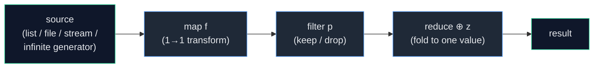
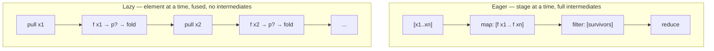
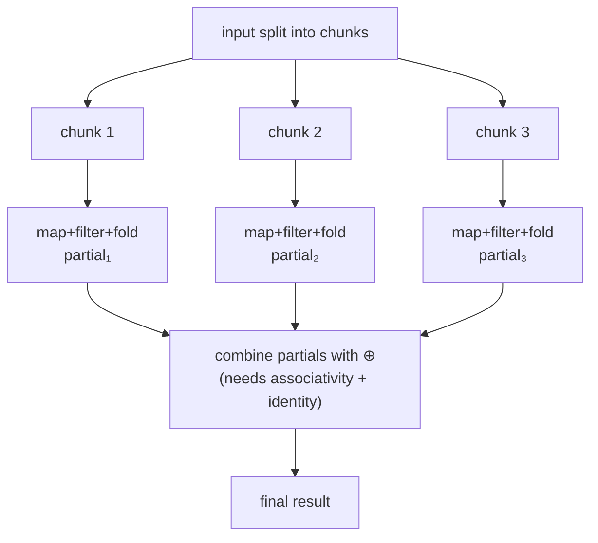

# Map / Filter / Reduce — Senior Level

> **Roadmap:** [Functional Programming](../README.md) → Map / Filter / Reduce
>
> *Essence: at the senior level the trio stops being three list functions and becomes the vocabulary of **data-transformation architecture** — how a pipeline is shaped, when it evaluates, whether it composes without intermediate collections, whether it parallelizes, and which API contract (eager list vs lazy stream) you expose at a boundary.*

---

## Table of Contents

1. [Introduction](#introduction)
2. [Prerequisites](#prerequisites)
3. [Designing Data-Transformation Pipelines](#designing-data-transformation-pipelines)
4. [Lazy vs Eager Evaluation](#lazy-vs-eager-evaluation)
5. [Transducers: Composable, Collection-Independent Transforms](#transducers-composable-collection-independent-transforms)
6. [Parallel Map-Reduce: The Big-Data Lineage](#parallel-map-reduce-the-big-data-lineage)
7. [`reduce` as the Universal Primitive](#reduce-as-the-universal-primitive)
8. [Limits: Ordering, Side Effects, and Short-Circuiting](#limits-ordering-side-effects-and-short-circuiting)
9. [Common Mistakes](#common-mistakes)
10. [Test Yourself](#test-yourself)
11. [Cheat Sheet](#cheat-sheet)
12. [Summary](#summary)
13. [Further Reading](#further-reading)
14. [Related Topics](#related-topics)

---

## Introduction

> Focus: **design and architecture implications.** Not "what does `map` do" but "what does choosing `map`/`filter`/`reduce` *commit you to* across evaluation strategy, memory, parallelism, and API surface."

At the junior level the trio is three loops you didn't have to write. At the middle level it is a fluent style — chain `filter().map().reduce()` and read top-to-bottom. The senior level is where the abstraction stops being free: a three-stage chain over a 50-million-row dataset that allocates two intermediate lists will OOM where the equivalent fused stream streams in constant memory; a `reduce` whose combiner isn't associative will silently produce wrong answers the day someone parallelizes it; an API that returns `List<T>` instead of `Stream<T>` forces every caller to materialize, and you can never take it back without breaking them.

The throughline of this file: **map, filter, and reduce are not implementations — they are a contract about *shape* (one-to-one, filtering, folding) that is deliberately silent about *strategy* (eager/lazy, sequential/parallel, materialized/streamed).** That silence is the whole point. It is what lets the same `xs.map(f).filter(p)` run as an eager array transform in a script, a lazy demand-driven pipeline over a file, or a 1,000-node Spark job — *because the operations describe the transformation, not the traversal.* Your job as a senior is to choose the strategy deliberately, expose the right contract at each boundary, and know exactly where the abstraction's silence becomes a trap (ordering, side effects, non-associative folds).



The diagram is the *logical* shape every pipeline shares. The senior questions sit underneath it: does data flow left-to-right one element at a time (lazy) or stage-by-stage with full intermediate collections (eager)? Can the stages run on different cores? Where does the abstraction stop describing and start *deciding*?

---

## Prerequisites

- **Required:** Fluency with [`junior.md`](junior.md) and [`middle.md`](middle.md) — you can write and read `map`/`filter`/`reduce` chains in at least two languages and explain what each stage does to the element type.
- **Required:** [Higher-order functions & closures](../01-first-class-and-higher-order-functions/senior.md) — the trio *is* HOFs; you should be comfortable passing and returning functions.
- **Required:** [Pure functions & referential transparency](../02-pure-functions-and-referential-transparency/senior.md) — pipelines reason correctly only when the stage functions are pure; this file's "side effects" section depends on it.
- **Helpful:** [Composition](../05-composition/senior.md) — transducers are composition applied to reducing functions.
- **Helpful:** [Laziness & streams](../12-laziness-and-streams/senior.md) — the deep treatment of demand-driven evaluation and infinite sequences; this file uses it, that file proves it.
- **Helpful:** [Recursion & tail calls](../08-recursion-and-tail-calls/senior.md) — `reduce`/`fold` is the canonical tail-recursive accumulator; catamorphisms generalize it.

---

## Designing Data-Transformation Pipelines

A pipeline is a series of stages where each stage's output type is the next stage's input type. Designing one well is mostly about **stage typing, stage ordering, and the boundary contract** — three decisions that the fluent syntax hides.

### Order stages for correctness *and* cost

`filter` before `map` and `map` before `filter` are not interchangeable. They differ in result type, in cost, and sometimes in correctness:

```python
# Cost: filter-then-map does the expensive transform on fewer elements.
result = [expensive(x) for x in xs if cheap_predicate(x)]   # GOOD: predicate first
# vs.
result = [y for y in (expensive(x) for x in xs) if cheap_predicate2(y)]  # transform all, then drop
```

The rule of thumb: **push `filter` as early as possible** (transform the smallest set), and **push expensive `map`s as late as possible** (do costly work only on survivors). This is the local, hand-written version of *predicate pushdown* — the same optimization a SQL planner or Spark's Catalyst applies automatically when it reorders a `WHERE` below a projection. When you control the pipeline by hand, you are the optimizer.

But ordering can also be a *correctness* constraint, not just a cost one: if the `map` is what produces the field the `filter` tests, the filter *must* come after. Selectivity-based reordering is only legal when stages are independent and pure — another reason purity (the prerequisite) is load-bearing here.

### Type the stages so illegal pipelines don't compose

A well-designed pipeline reads as a sequence of total transformations between named types, so a wrong assembly is a compile error rather than a runtime surprise:

```
RawLine          --map parse-->     Result[Record]
Result[Record]   --filter ok-->     Result[Record]   (drop the Errs)
Result[Record]   --map unwrap-->    Record
Record           --filter active--> Record
[Record]         --reduce-->        Summary
```

Each arrow is a stage with a distinct input/output type. Parsing returns `Result`/`Either` rather than throwing, so a malformed line becomes *data flowing through the filter*, not an exception that blows up the traversal mid-stream. This is the [ADT](../06-algebraic-data-types/senior.md) discipline applied to pipelines: make the failure a value the pipeline can route, not a control-flow event that escapes it.

### Decide the boundary contract: stream out, or list out?

The single most consequential API decision for a transformation function is its **return type**, because it dictates the *evaluation strategy of every caller*:

```java
// Contract A — eager: caller gets everything, already computed and buffered.
List<Order> recentOrders(Instant since);          // materializes; simple; can OOM on big results

// Contract B — lazy: caller gets a recipe and pulls on demand.
Stream<Order> recentOrders(Instant since);         // streams; composes with caller's stages; caller MUST close
```

- **Return a `List`/slice** when the result is small and bounded, callers will iterate it more than once, or the source must be drained *now* (e.g., to release a DB connection or lock). Eager results are simple, re-iterable, and have obvious lifetimes.
- **Return a `Stream`/`Iterator`/generator** when the result may be large or unbounded, when callers will add their own `filter`/`map`/`take` stages (and you want those to *fuse* with yours rather than re-walk a materialized list), or when you want backpressure. The cost: lazy results are single-use, have resource lifetimes the caller must honor (close the file/cursor), and leak the producer's evaluation timing into the consumer.

> **The irreversibility:** you can always materialize a stream into a list at the boundary (`stream.collect()`), but a caller cannot *un-materialize* a list you handed them — the intermediate collection already exists. So a public API that returns `List` has *already made the eager decision for everyone downstream, forever.* Returning `Iterator`/`Stream` keeps the choice in the caller's hands. This is why streaming APIs (JDBC cursors, `bufio.Scanner`, Python generators, Java `Stream`) dominate at large scale and library boundaries.

---

## Lazy vs Eager Evaluation

This is the senior distinction that the trio's uniform syntax most aggressively hides. `xs.map(f).filter(p).take(10)` looks identical whether it allocates two full intermediate lists or pulls exactly the elements it needs — and the difference is the difference between an OOM and constant memory.

### Eager: each stage fully completes before the next begins

In an eager pipeline (Python list comprehensions, Go slice loops, JavaScript `Array.prototype.map`, Java without `.stream()`), `map` runs to completion building a whole new collection, *then* `filter` walks that whole collection building another, *then* `reduce` walks that. For `n` elements and `k` stages you allocate up to `k` intermediate collections of size ~`n`. Three-stage chain over 10M rows = up to ~30M elements of transient garbage and three full passes.

```python
# EAGER (lists): three full materializations. Reads ALL of a huge file into memory.
lines  = open("huge.log").readlines()          # the entire file, in RAM
parsed = [parse(l) for l in lines]             # second full copy
errors = [p for p in parsed if p.level == "ERROR"]   # third
count  = len(errors)
```

### Lazy: demand-driven, element-at-a-time, fused

In a lazy pipeline (Python generators/`itertools`, Java `Stream`, Rust iterators, Haskell by default, Clojure's lazy seqs), nothing happens until a **terminal operation** pulls. Then each element is drawn from the source and pushed through *all* stages before the next element is fetched — `map` and `filter` are **fused** into a single pass with **no intermediate collection at all**. Memory is O(1) in the pipeline (plus whatever the terminal accumulates).

```python
# LAZY (generators): O(1) pipeline memory, ONE pass, never holds the whole file.
lines  = (l for l in open("huge.log"))         # generator: nothing read yet
parsed = (parse(l) for l in lines)             # lazy
errors = (p for p in parsed if p.level == "ERROR")
count  = sum(1 for _ in errors)                # NOW it pulls, one line at a time
```

Both snippets read identically as a three-stage chain. The second processes a 100 GB file in a few megabytes of RAM. **That is the entire reason laziness matters for large or infinite data.**



### Why laziness is *required*, not merely nicer, for some workloads

- **Infinite sources.** `naturals().map(square).filter(isPrime).take(100)` is only expressible lazily — an eager `map` over an infinite generator never returns. Laziness lets you describe an unbounded transformation and consume a finite prefix.
- **Short-circuiting.** Lazy pipelines stop pulling the moment the terminal is satisfied: `findFirst`, `take(n)`, `anyMatch` touch only as many elements as needed. An eager `map` always processes the whole input even if the consumer wanted one element.
- **Bounded memory over unbounded input.** Streaming a file/socket/cursor that doesn't fit in RAM is *only* possible if no stage materializes.

### Where laziness costs you

It is not free. Lazy pipelines pay **per-element call overhead** (each element traverses a chain of closures/iterator `next()` calls), defeat **CPU cache locality and SIMD/vectorization** (an eager array `map` is a tight, branch-predictable, vectorizable loop; a lazy chain is pointer-chasing through wrappers), and introduce **subtle lifetime and exception timing** (the work happens at the terminal, far from where the pipeline was *defined*, so a stack trace points at `collect()`, not at the `map` that threw). For small, in-memory, multi-pass data, eager is usually faster *and* simpler. The senior judgment: **lazy for large/unbounded/short-circuiting; eager for small/in-memory/CPU-bound-and-vectorizable.**

### Fusion: why lazy chains don't pay per stage

The property that turns "nice syntax" into "constant memory" is **fusion** (a.k.a. deforestation): adjacent `map`/`filter` stages collapse into a *single* per-element function so no intermediate structure is ever built. `xs.map(f).filter(p).map(g)` becomes, conceptually, one step `λx. let y = f x in if p y then [g y] else []` applied as the source is pulled. Haskell's GHC does this as a *compiler* optimization (stream fusion / `build`-`foldr` rules); Rust's iterators and Java's `Stream` get it *structurally* (each adapter wraps the next and pulls one element); Python generators get it *behaviorally* (a `yield` in one generator drives the next). The architectural consequence: **a 12-stage lazy pipeline over a billion rows still allocates nothing per stage** — fusion is what makes deep pipelines cheap. The catch is that fusion is fragile: inserting a *materializing* step in the middle (`list(...)`, `.collect()`, `.toList()`, sorting, a `groupBy` that must see everything) breaks the chain into two fused segments with a full intermediate between them. Know where your materialization barriers are.

---

## Transducers: Composable, Collection-Independent Transforms

A chained pipeline couples the transformation to the *collection it runs on*. `xs.map(f).filter(p)` is a transformation of *lists*; you can't reuse that exact `map(f).filter(p)` to process a channel, a stream of socket events, or an `into` a different output type without rewriting it against that collection's API. **Transducers** (Rich Hickey, Clojure 2014) decouple the *what* (the sequence of transforms) from the *where* (the source) and the *how* (the accumulation).

### The core insight: `map` and `filter` in terms of `reduce`

Everything in the trio is expressible as a transformation of a **reducing function** — a function `(acc, x) -> acc`. A transducer is *a function from one reducing function to another*: `(acc, x -> acc) -> (acc, x -> acc)`. It says "given how you'd combine an element, here's how to combine it *after my transform*," without ever naming the collection or the accumulator type.

```clojure
;; Clojure — a transducer is a transform of a reducing fn `rf`. No collection mentioned.
(defn mapping [f]
  (fn [rf]
    (fn [acc x] (rf acc (f x)))))          ;; map: transform x, then hand to rf

(defn filtering [pred]
  (fn [rf]
    (fn [acc x] (if (pred x) (rf acc x) acc))))  ;; filter: maybe hand to rf, maybe skip

;; Compose with ordinary function composition — note: NO source collection here.
(def xform (comp (filtering even?) (mapping #(* % %))))

;; The SAME xform, applied to different "wheres" and "hows":
(transduce xform +    0  (range 1000))     ;; reduce into a sum
(into [] xform           (range 1000))     ;; build a vector
(into #{} xform          (range 1000))     ;; build a set
(sequence xform          (range 1000))     ;; produce a lazy seq
;; ... and onto a core.async channel, a stream, etc. — same xform, no rewrite.
```

### Why this matters architecturally

1. **One transformation, many sinks.** The same `xform` reduces into a number, a vector, a set, a channel, or a stream. With chained methods you'd write a different pipeline per sink.
2. **No intermediate collections — by construction.** `(comp (filtering ...) (mapping ...))` builds *one* fused reducing function; running it does a single pass with zero intermediate sequences, *eagerly or lazily*, on any source. You get fusion without relying on a lazy stream's optimizer to spot it.
3. **Composition is plain function composition.** Transducers compose with `comp` (`∘`) like any functions — the [composition](../05-composition/senior.md) algebra applies directly. (Note the reversed-looking order: `(comp A B)` applies `A`'s transform to elements *before* `B`'s, because each wraps the next's reducing function.)
4. **Decoupled from time.** Because a transducer is just "transform a reducing step," it works equally over a collection (pull) and over an event stream / channel (push) — the same `xform` can process historical batch data and a live feed.

Java's `Stream` and Rust's `Iterator` get *fusion* (no intermediates) but keep it *coupled to the source* — you can't lift a Java `Stream` pipeline off the stream and apply it to a `BlockingQueue`. Transducers are the generalization: **the transform as a first-class, source-agnostic value.** Even if your language has no transducer library, the mental model is valuable — it explains *why* `reduce` is the primitive the other two reduce to (next section), and it is the cleanest answer to "how do I reuse a pipeline across a batch source and a streaming source."

---

## Parallel Map-Reduce: The Big-Data Lineage

The trio's deliberate silence about *traversal* is exactly what lets it parallelize. `map` is **embarrassingly parallel** — each `f(x)` is independent, so the input can be split across cores/machines and mapped concurrently. `filter` is likewise per-element-independent. `reduce` parallelizes **only if its combining operation forms a monoid**: associative, with an identity element.

### The monoid requirement (the whole ballgame)

To fold in parallel you must be able to **split, fold each chunk independently, and combine the partials** — and get the same answer regardless of how you split. That requires:

- **Associativity:** `(a ⊕ b) ⊕ c == a ⊕ (b ⊕ c)`. Lets you group the work any way (`reduce(chunk1) ⊕ reduce(chunk2)`) and recombine.
- **Identity:** a `z` with `z ⊕ a == a == a ⊕ z`. Gives empty chunks a safe starting value.

`+`, `*`, `max`, `min`, set-union, string-concat, list-append, and "merge two histograms" are monoids → parallelizable. **Subtraction, division, and "average" are not associative → not directly parallelizable** (you parallelize `average` by reducing to the *monoid* `(sum, count)` and dividing at the very end — the classic "reshape your fold into a monoid" trick).



### From local cores to a thousand machines: the same idea

This is the **MapReduce / Spark lineage**. Google's MapReduce (2004) and then Hadoop and Spark are *this exact shape* scaled across a cluster: a `map` phase runs independently on data-local partitions, a `shuffle` groups by key, and a `reduce` phase folds each key's values with an associative combiner. Spark's `reduceByKey` *requires* an associative, commutative function for exactly the parallel-fold reason; its `aggregate`/`combineByKey` is the distributed form of "reshape into a monoid (`seqOp` builds partials, `combOp` merges them)." When you understand why a sequential `reduce` needs associativity to go parallel, you understand the core constraint of every big-data engine — they are `map`/`filter`/`reduce` with a network in the middle.

```java
// Java parallel streams: the trio across cores. The combiner MUST be associative,
// or the result is nondeterministic garbage as the framework re-splits the work.
double total = orders.parallelStream()      // fork-join splits the source
    .filter(o -> o.region() == Region.EU)   // per-element independent
    .mapToDouble(Order::amount)             // per-element independent
    .sum();                                  // sum is associative+identity → safe parallel

// DANGEROUS: a non-associative or order-dependent reduce under parallelStream.
String joined = words.parallelStream()
    .reduce("", (a, b) -> a + b);            // string concat IS associative → ok
// but reduce(0, (a,b) -> a - b) would give different results per run — illegal monoid.
```

### Spliterators and Go's manual pipelines: the same constraint, different ergonomics

- **Java** hides the split behind a **`Spliterator`** — the abstraction that knows how to *partition a source* for the fork-join pool. A good `Spliterator` (arrays, `IntStream.range`) splits in O(1) and parallelizes beautifully; a bad one (a `LinkedList`, an unsized `Iterator`) can't split cheaply, so `parallelStream()` adds overhead and *loses*. Senior reality: parallel streams pay off only for **CPU-bound work, large N, and a splittable source with no shared state** — and they share the *common fork-join pool* with the rest of the JVM, so a blocking task in a parallel stream can starve everything. Measure; don't sprinkle `.parallel()`.
- **Go** has no `parallelStream`; you build the fan-out **by hand with goroutines and channels**, which makes the monoid requirement *explicit* — you can see exactly where partials merge.

```go
// Go — a hand-built parallel map-reduce. The "combine" step (associative sum)
// is visible, not hidden by a framework. Ordering across workers is NOT preserved.
func parallelSum(xs []int, workers int) int {
    chunks := split(xs, workers)
    partials := make(chan int, workers)
    for _, c := range chunks {
        go func(c []int) {            // map+fold each chunk independently
            s := 0
            for _, x := range c {
                if x%2 == 0 {          // filter
                    s += x * x         // map + fold
                }
            }
            partials <- s              // emit partial
        }(c)
    }
    total := 0                         // identity element
    for i := 0; i < len(chunks); i++ {
        total += <-partials            // combine with associative ⊕
    }
    return total
}
```

The Go version makes a senior truth vivid: **the framework (parallel stream / Spark) buys you the split-and-combine machinery, but it cannot supply associativity — that is on you.** Get the monoid wrong and the bug is *nondeterministic*: correct on small inputs that don't split, wrong (and differently wrong each run) once the data is large enough to fan out.

### Language reality check: three very different ergonomics, one model

The same logical `map`/`filter`/`reduce` looks and behaves differently per language, and a senior picks the idiom that matches the data's scale:

- **Python** has *no* parallel `map`/`reduce` in the language (the GIL serializes pure-Python CPU work). For lazy, fused, single-thread streaming you use **generators + `itertools`** (`itertools.chain`, `islice`, `takewhile`, `groupby`; `functools.reduce` for the fold). For *actual* parallelism you reach outside the trio's syntax to `multiprocessing.Pool.map` (process-based, dodges the GIL, pays serialization cost) or `concurrent.futures`. So in Python, "lazy pipeline" and "parallel pipeline" are different tools, not the same chain with a flag.
- **Java** is the richest: `stream()` is lazy + fused, `parallelStream()` flips one source to the fork-join pool, and `Collector`s give you correct concurrent accumulation (with a real combiner) instead of side-effecting folds. The `Spliterator` is the seam that decides whether parallelism pays.
- **Go** has neither lazy streams nor a stream API; you compose pipelines by hand from **channels and goroutines** (the classic *generator → fan-out → fan-in* pattern), which makes laziness (a channel pulls as the consumer reads), backpressure (an unbuffered channel blocks the producer), and the associative combine step all *explicit and visible*. The cost is boilerplate; the benefit is that nothing about evaluation strategy is hidden.

The unifying point: **the model (`map`/`filter`/`reduce`, fusion, monoid-folds) is language-independent; the *ergonomics and the default strategy* are not.** Know which your language gives you for free and which you must build.

---

## `reduce` as the Universal Primitive

`map` and `filter` feel like peers of `reduce`, but they aren't — **`reduce` (a.k.a. `fold`) is the universal primitive, and the other two are special cases of it.** Recognizing this is the conceptual payoff of the section, and it is your on-ramp to *catamorphisms*.

### map and filter expressed via reduce

```python
# map f  ==  fold that conses f(x) onto the accumulator list.
def map_(f, xs):    return reduce(lambda acc, x: acc + [f(x)], xs, [])

# filter p  ==  fold that conses x only when p(x).
def filter_(p, xs): return reduce(lambda acc, x: acc + [x] if p(x) else acc, xs, [])

# Both are reductions whose accumulator happens to be a list. reduce is more general:
# the accumulator can be ANYTHING — a number, a dict, a set, a parser state, another
# stream. map/filter are reduce with the accumulator pinned to "a list, same shape out."
```

`map`, `filter`, `take`, `group-by`, `partition`, `sum`, `count`, building a histogram, parsing — all are folds with different accumulators and step functions. This is *why transducers are defined as transforms of reducing functions* (previous section): if `reduce` is the one primitive, then "transform a reducing function" is the one way to express *every* stage uniformly.

### `foldr` vs `foldl`: direction is not cosmetic

In strict languages this is mostly about associativity and tail-call shape; in a lazy language like Haskell it's a correctness *and* termination distinction worth understanding because it sharpens the whole concept:

```haskell
foldr f z [a,b,c] = f a (f b (f c z))   -- associates RIGHT; f's second arg can stay unevaluated
foldl f z [a,b,c] = f (f (f z a) b) c   -- associates LEFT; tail-recursive accumulator

-- foldr can work on INFINITE lists and short-circuit, IF f is lazy in its second arg:
any p = foldr (\x acc -> p x || acc) False   -- stops at the first True; works on [1..]
-- foldl on an infinite list never terminates — it must reach the end before producing anything.
```

The senior takeaway that transfers to *every* language: a left fold is the tail-recursive accumulator loop (great for strict, finite data and the natural target of [tail-call optimization](../08-recursion-and-tail-calls/senior.md)); a right fold is the *structural* fold that can be lazy and short-circuit. Java's `Stream.reduce` and Go's hand-loops are left folds; Haskell's idiomatic recursion and lazy short-circuiting lean on `foldr`.

### `reduce` as a catamorphism (the deep version)

A **catamorphism** is the generalization of `fold` from lists to *any recursive (algebraic) data structure*: it is the unique, structure-collapsing way to consume an ADT by replacing each constructor with a function. `reduce` over a list is the catamorphism for lists — it replaces "cons" with your step function `⊕` and "nil" with your identity `z`. The same idea folds a *tree* (replace `Leaf`/`Node` with functions to compute its height, sum, or rendered string), an *expression AST* (replace each node with an evaluator — that's how you write a tree-walking interpreter), or a JSON value.

```python
# A catamorphism over a binary tree: ONE fold parameterized by what each
# constructor becomes. height, sum, and flatten are all this fold with
# different (leaf, node) functions — exactly as map/filter are list-reduce.
def cata_tree(leaf, node, t):
    if t.is_leaf: return leaf(t.value)
    return node(cata_tree(leaf, node, t.left), cata_tree(leaf, node, t.right))

height = lambda t: cata_tree(lambda v: 1, lambda l, r: 1 + max(l, r), t)
total  = lambda t: cata_tree(lambda v: v, lambda l, r: l + r,         t)
```

Why a senior cares: once you see `reduce` as "collapse a structure by interpreting its constructors," you recognize the *same* pattern in tree-walking interpreters, query planners, serializers, and aggregation engines — they are all catamorphisms. It is the unifying answer to "what is the one operation underneath all this transformation code?" (The dual, *unfold/anamorphism* — *building* a structure from a seed, e.g. a generator producing an infinite stream — is the producer side and lives in [Laziness & Streams](../12-laziness-and-streams/senior.md).)

---

## Limits: Ordering, Side Effects, and Short-Circuiting

The trio's power comes from what it leaves unspecified — and that same silence is where it bites.

### Ordering guarantees differ by operation and by strategy

- `map` and `filter` are **order-preserving** in their *result sequence* (output stays in input order) even when run in parallel — Java parallel streams reassemble results in encounter order for `collect(toList())`. But the *execution order* of the `f`s is unspecified under parallelism, which only matters if `f` has side effects (it shouldn't).
- `reduce` preserves order only for the **sequential** left fold. Under parallelism the *grouping* changes (`(a⊕b)⊕(c⊕d)` instead of `((a⊕b)⊕c)⊕d`), which is fine for an *associative* `⊕` and **wrong for a non-associative or non-commutative one**. String concatenation is associative (parallel-safe) but *not* commutative — so a parallel reduce keeps left-to-right order *only because* the framework respects encounter order in the combine step; never rely on commutativity you don't have, and never rely on order from an operation that doesn't promise it.
- **`forEach` vs `forEachOrdered`** (Java) crystallizes the trap: `parallelStream().forEach(...)` runs the action in *arbitrary* order; if you need encounter order you must say `forEachOrdered`, paying back some parallelism.

### Side effects in pipelines: the cardinal sin

The trio is built for **pure** stage functions. Side effects inside `map`/`filter`/`reduce` break the model in three ways:

1. **Laziness reschedules them.** A side effect in a lazy `map` fires *if and when* the terminal pulls that element — possibly never (short-circuited away), possibly in a surprising order, possibly long after the `map` line ran. The classic bug: side-effecting work in a `stream.map(...)` that *has no terminal operation* simply never executes.
2. **Parallelism races them.** Two threads running `f` that mutates shared state is a data race. `reduce` with a mutating accumulator under `parallelStream` corrupts silently. (Java's answer is `collect` with a `Collector` that has a proper *combiner* — concurrent accumulation done right — never a side-effecting `forEach`/`reduce`.)
3. **Reordering changes them.** Selectivity-based stage reordering (filter-pushdown) is only legal for pure stages; a side-effecting stage makes the reorder observable.

> **The rule:** stage functions in a pipeline must be pure; *all* effects (I/O, logging, mutation, DB writes) belong at the **terminal**, where you've collected results, or in an explicit imperative shell *around* the pipeline. This is the [functional core / imperative shell](../10-effect-tracking/senior.md) discipline applied to the trio. A pipeline that does I/O per element is not a pipeline — it's a `for` loop wearing a `map` costume, and it has thrown away laziness, parallelizability, and reorderability for nothing.

### Short-circuiting only exists when laziness does

`findFirst`, `take(n)`, `anyMatch`, `limit` can stop early *only* in a lazy/streaming pipeline. The same logical operation on an eager list has already paid for the full `map` before you ever ask for the first element. If "stop as soon as you find one" matters (searching a huge or infinite source), you *must* be lazy — eager + short-circuit is a contradiction.

### When the trio is the wrong tool

- **Stateful inter-element dependencies** (a running computation where element `n`'s transform depends on the *result* for `n-1`) are a `scan`/`fold`-with-emitted-state, not a `map`. Forcing it into `map` with a closure over mutable state is the side-effect trap above.
- **Index-correlated logic across two collections** is often clearer as an explicit `zip`-then-map or a plain loop than a contorted `reduce`.
- **Early exit with cleanup / complex control flow** (break, continue, try/finally per element) frequently reads better as an imperative loop. The trio is for *transformation*, not for arbitrary control flow — bending it into the latter produces the [Arrow](../../anti-patterns/01-development/01-bad-structure/senior.md)'s functional cousin: an unreadable `reduce` doing five jobs.

---

## Common Mistakes

1. **Treating eager and lazy as interchangeable because the syntax matches.** Shipping an eager three-stage chain over a dataset that doesn't fit in memory, then being surprised by OOM. *Choose the strategy deliberately; the identical-looking code has wildly different memory profiles.*
2. **Returning `List` from a library boundary by default.** You've made the eager decision for every caller forever and forfeited fusion. *Return `Stream`/`Iterator`/generator from boundaries over large or composable data; let the caller decide to materialize.*
3. **A non-associative `reduce` under parallelism.** `average`, `subtract`, or a mutating accumulator in `parallelStream`/Spark: correct on small inputs that don't split, *nondeterministically wrong* once the data fans out. *Reduce only with a monoid; reshape (`average` → `(sum,count)`) when it isn't one.*
4. **Side effects inside pipeline stages.** I/O, logging, or mutation in `map`/`filter`/`reduce` — broken by laziness (may never run, runs in odd order) and by parallelism (data races). *Pure stages; effects at the terminal or in the imperative shell.*
5. **`.parallelStream()` as a free speedup.** Adding it to a small list, an `IO`-bound task, or a poorly-splittable source (`LinkedList`) makes it *slower*, and a blocking task starves the shared fork-join pool. *Parallel pays only for CPU-bound, large-N, splittable, stateless work — measure.*
6. **Filter-after-expensive-map.** Running the costly transform on elements you're about to discard. *Push filters early (predicate pushdown); push expensive maps late.*
7. **A lazy pipeline with no terminal operation.** In Java/Rust/Python, `stream.map(...).filter(...)` with nothing pulling does *nothing* — a classic "my logging never appeared" bug. *Laziness means no terminal, no work.*
8. **Relying on ordering an operation never promised.** Assuming `parallelStream().forEach` preserves encounter order, or that a parallel `reduce` is safe with a non-commutative op. *Use `forEachOrdered`/sequential when order matters; know your op's algebra.*
9. **Overusing `reduce` for clarity it destroys.** A single `reduce` that simultaneously maps, filters, groups, and accumulates three things is write-only code. *Just because everything is expressible as a fold doesn't mean it should be one giant fold — split it into named stages.*

---

## Test Yourself

1. Two pipelines read identically as `source.map(f).filter(p).reduce(g)`. One processes a 200 GB file in 50 MB of RAM; the other OOMs. What single property differs, and what mechanism gives the streaming one its constant memory?
2. You're designing a library function that returns "all transactions matching a query." Give the decision rule for returning `List<Tx>` vs `Stream<Tx>`, and explain which choice is *irreversible* for callers and why.
3. Why can `+` be used as a parallel `reduce` combiner but `average` cannot? Show how you'd parallelize an average anyway.
4. What is a transducer, and what does it decouple that a chained `map().filter()` pipeline does not? Name two distinct sinks the same transducer can target.
5. Express `filter` purely in terms of `reduce`. Then explain in one sentence why this makes `reduce` "the universal primitive."
6. A teammate adds `.parallel()` to a Java stream and it gets *slower*. List three distinct reasons this can happen.
7. Explain why a side effect placed inside a lazy `map` might execute zero times, and why the same side effect inside a *parallel* `reduce` is a correctness bug even if it does run.
8. What is a catamorphism, and in what sense is `reduce` over a list one? Name a real system whose core operation is a catamorphism over something other than a list.

<details>
<summary>Answers</summary>

1. **Eager vs lazy evaluation.** The OOM version is eager: each stage fully materializes an intermediate collection (the whole file in RAM, then a full mapped copy, then a full filtered copy). The streaming version is lazy: a terminal operation pulls one element at a time through *fused* stages, so `map` and `filter` run on each element in a single pass with **no intermediate collection** — pipeline memory is O(1), independent of input size.
2. **`List`** when the result is small/bounded, re-iterated by callers, or the source must be drained now (release a connection/lock). **`Stream`/`Iterator`** when the result may be large/unbounded, callers will add their own stages (so yours should *fuse* with theirs), or you want backpressure. The **`List` choice is irreversible**: it has already created the intermediate collection for every caller — a caller can't un-materialize it. A stream can always be `collect`ed by the caller, so it keeps the eager/lazy choice in the caller's hands.
3. `+` is **associative with an identity (0)** → a monoid, so you can split, sum each chunk, and add the partials in any grouping and get the same answer. `average` is **not associative** (`avg(avg(a,b),c) ≠ avg(a,b,c)`). Parallelize it by reducing to the monoid **`(sum, count)`** per chunk, combining partials with element-wise addition, and dividing `sum/count` once at the very end.
4. A transducer is a **transform of a reducing function** — `(acc,x->acc) -> (acc,x->acc)` — that describes a sequence of transforms **without naming the source collection or the accumulation strategy**. A chained `map().filter()` is coupled to *list* (or stream) operations; a transducer decouples the *what* from the *where/how*. The same transducer can target, e.g., a **sum (number)**, a **vector**, a **set**, a **lazy seq**, or a **channel/stream** — pick any two.
5. `filter(p, xs) = reduce(lambda acc, x: acc + [x] if p(x) else acc, xs, [])`. Because `map` and `filter` (and `take`, `group-by`, `sum`, parsing, …) are all just `reduce` with different accumulators and step functions, `reduce` is the single primitive the rest are special cases of.
6. Any three: the source **doesn't split cheaply** (`LinkedList`, unsized iterator — bad `Spliterator`); the workload is **I/O-bound or N is small**, so coordination overhead dominates the per-element work; **shared mutable state / a non-associative combiner** forces serialization or produces extra synchronization; the task **blocks**, starving the shared common fork-join pool; per-element work is so cheap that **fork/join + result-merge overhead** exceeds the savings.
7. **Zero times under laziness:** a lazy `map` only runs `f` when a terminal *pulls* that element; if there's no terminal, or the element is short-circuited away (`take`, `findFirst`), `f` — and its side effect — never runs. **Correctness bug under parallel `reduce`:** even if it runs, two threads applying the step function may touch shared state concurrently (data race) and the framework may re-split/re-group the fold, so the effect's count/order/result is nondeterministic. Effects belong at the terminal or in the imperative shell, never in a stage.
8. A **catamorphism** is the generalization of `fold` to any recursive/algebraic data type: the unique structure-collapsing consumer that replaces each constructor with a function. `reduce` over a list is the list catamorphism — it replaces `cons` with your step `⊕` and `nil` with your identity `z`. Real example: a **tree-walking interpreter / expression evaluator** is a catamorphism over an AST (replace each node constructor with an evaluator); also JSON serializers and query planners that collapse a syntax tree.

</details>

---

## Cheat Sheet

| Decision | Pick this when… | Cost / catch |
|---|---|---|
| **Eager** (lists, comprehensions, slice loops) | Small/in-memory data, multiple passes, CPU-bound vectorizable loop | Allocates `k` intermediate collections; OOMs on huge/infinite input |
| **Lazy** (generators, `Stream`, iterators, `itertools`) | Large/unbounded data, short-circuiting, streaming a file/socket/cursor | Per-element overhead, no SIMD, effect timing detached from definition; single-use |
| **Return `List` from API** | Small bounded result, re-iterated, must drain source now | Irreversibly eager for *every* caller; no fusion downstream |
| **Return `Stream`/`Iterator`** | Large/composable result, want fusion + backpressure | Single-use, caller must close, lifetime leaks into consumer |
| **Sequential `reduce`** | Order matters, non-associative op, side-effect-free accumulation | Single-threaded |
| **Parallel `reduce` / `parallelStream` / Spark** | CPU-bound, large N, splittable source, **monoid** combiner | Wrong (nondeterministic) if op isn't associative; bad `Spliterator` or blocking starves pool |
| **Transducer** | One transform reused across many sinks (number/vector/set/channel) | Library/idiom support varies; reversed compose-order gotcha |
| **`reduce`/`fold` as the tool** | Folding to a single value or building any accumulator | Don't cram map+filter+group into one giant write-only fold |

**Stage-ordering rules:** push `filter` early (predicate pushdown), push expensive `map` late, reorder *only* if stages are pure and independent.

**Parallel-fold law:** parallelize a `reduce` ⇔ the combiner is a **monoid** (associative + identity). Not one? Reshape it into one (e.g. `average` → `(sum, count)`).

**Effect law:** pure stages; *all* effects at the terminal or in the imperative shell.

**Three reductions to remember:** `map` = `reduce` that conses `f(x)`; `filter` = `reduce` that conses on `p(x)`; *both* = a list catamorphism.

---

## Summary

- **The trio is a contract about *shape* (1→1, keep/drop, fold-to-one) that is deliberately silent about *strategy* (eager/lazy, sequential/parallel, materialized/streamed).** That silence is the source of both its power and its senior-level traps.
- **Pipeline design** is stage typing + stage ordering + the boundary contract. Push filters early and expensive maps late (predicate pushdown); type stages so wrong assemblies don't compile; choose your return type knowing it dictates *every caller's* evaluation strategy.
- **Lazy vs eager** is the distinction the uniform syntax hides hardest. Lazy = demand-driven, fused, O(1) pipeline memory, enables infinite sources and short-circuiting — *required* for data that doesn't fit in RAM. Eager = simpler, re-iterable, cache-friendly/vectorizable — better for small in-memory work. Identical-looking code, opposite memory profiles.
- **Transducers** decouple the transform (*what*) from the source (*where*) and accumulation (*how*) by defining each stage as a *transform of a reducing function* — one source-agnostic, fusing, composable transform reusable across number, vector, set, channel, or stream.
- **Parallel map-reduce** is the trio with the traversal split across cores or machines. `map`/`filter` are embarrassingly parallel; `reduce` parallelizes **iff its combiner is a monoid** (associative + identity). This is the literal core of MapReduce/Spark — the framework supplies split-and-combine; *you* must supply associativity, or the bug is nondeterministic.
- **`reduce` is the universal primitive:** `map` and `filter` are folds with a list accumulator; `reduce` generalizes to a **catamorphism** — the structure-collapsing fold over *any* recursive ADT (trees, ASTs, JSON), which is what tree-walking interpreters and aggregation engines really are.
- **Limits:** ordering guarantees vary by op and strategy; **side effects belong at the terminal, never in a stage** (laziness reschedules them, parallelism races them, reordering exposes them); short-circuiting exists only where laziness does; and not everything should be a `map`/`reduce` — stateful or control-flow-heavy logic is often clearer as a loop.

---

## Further Reading

- **Rich Hickey — "Transducers" (Strange Loop 2014 talk & Clojure docs)** — the original, clearest exposition of transducers as transforms of reducing functions.
- **Dean & Ghemawat — "MapReduce: Simplified Data Processing on Large Clusters" (Google, 2004)** — the paper that scaled `map`/`reduce` across clusters; the associativity requirement made industrial.
- **Zaharia et al. — "Resilient Distributed Datasets" (Spark, NSDI 2012)** — the lineage from RDD transformations to `reduceByKey`/`aggregate`; why combiners must be associative.
- **Hutton — "A Tutorial on the Universality and Expressiveness of fold" (1999)** — the formal case that `fold` is the universal list operator; the on-ramp to catamorphisms.
- **Meijer, Fokkinga, Paterson — "Functional Programming with Bananas, Lenses, Envelopes and Barbed Wire" (1991)** — catamorphisms/anamorphisms as the recursion schemes underneath `fold`/`unfold`.
- **Java SE `java.util.stream` package docs & Brian Goetz — "Stream sources and spliterators"** — encounter order, `Spliterator` splitting, parallel-stream guidance from the API designers.
- **David Beazley — "Generator Tricks for Systems Programmers"** — Python generators/`itertools` as lazy, fused, O(1)-memory pipelines over huge streams.

---

## Related Topics

- [Laziness & Streams](../12-laziness-and-streams/senior.md) — the deep treatment of demand-driven evaluation, infinite sequences, and the producer side (unfold/anamorphism).
- [Composition](../05-composition/senior.md) — `f ∘ g` and point-free pipelines; transducers are composition applied to reducing functions.
- [Recursion & Tail Calls](../08-recursion-and-tail-calls/senior.md) — `fold`/`reduce` as the canonical tail-recursive accumulator; `foldl` vs `foldr` mechanics.
- [Pure Functions & Referential Transparency](../02-pure-functions-and-referential-transparency/senior.md) — why stage functions must be pure for reordering, fusion, and parallelism to be legal.
- [Algebraic Data Types](../06-algebraic-data-types/senior.md) — `Result`/`Either` as the way to route failures *through* a pipeline; the structures catamorphisms fold.
- [Effect Tracking](../10-effect-tracking/senior.md) — the functional core / imperative shell that keeps effects out of pipeline stages.
- [Higher-Order Functions](../01-first-class-and-higher-order-functions/senior.md) — the foundation: `map`/`filter`/`reduce` are higher-order functions taking the stage functions as arguments.
- [Concurrency](../../../language-internals/concurrency-async-parallel/concurrency/README.md) — goroutines/channels and fork-join, the runtime machinery under hand-built and framework parallel map-reduce.
