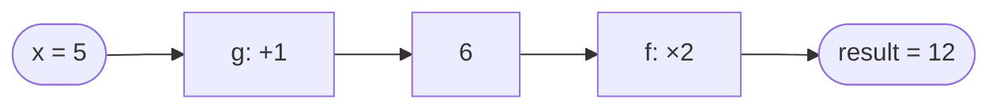

# Composition — Junior Level

> **Roadmap:** [Functional Programming](../README.md) → Composition
>
> *Essence: build big behaviors out of small functions by feeding one's output straight into the next — the same way you build long pipes out of short ones.*

---

## Table of Contents

1. [Introduction](#introduction)
2. [Prerequisites](#prerequisites)
3. [Glossary](#glossary)
4. [Core Concepts](#core-concepts)
   - [Function Composition (`f ∘ g`)](#function-composition-f--g)
   - [`compose` — Right to Left](#compose--right-to-left)
   - [`pipe` — Left to Right](#pipe--left-to-right)
   - [Order Matters](#order-matters)
   - [`compose` vs Method Chaining](#compose-vs-method-chaining)
5. [Pipelines in Practice](#pipelines-in-practice)
6. [Mental Models](#mental-models)
7. [Common Mistakes](#common-mistakes)
8. [Test Yourself](#test-yourself)
9. [Cheat Sheet](#cheat-sheet)
10. [Summary](#summary)
11. [Further Reading](#further-reading)
12. [Related Topics](#related-topics)

---

## Introduction

> Focus: **What is composition, and why does it matter?**

You already compose things every day without naming it. Toothpaste-then-brush. Crack-the-eggs-then-whisk-then-fry. Each step takes the result of the one before and does the next thing to it. **Function composition is exactly this idea written in code:** take a few small functions, each of which does one tiny job, and wire them together so the *output* of one becomes the *input* of the next.

The slogan of this topic is **"build big from small."** Instead of writing one large function that trims a string, lowercases it, and removes spaces all at once, you write three small functions — `trim`, `lowercase`, `removeSpaces` — and *combine* them into a bigger one called, say, `normalize`. Each small piece is easy to read, easy to test, and reusable in other combinations.

This matters because small functions are cheap and big functions are expensive. A 4-line function that does one thing is something you can verify by reading it once. A 60-line function that does eight things is something you *hope* works. Composition lets you keep writing 4-line functions and still get 60-line behavior — assembled, not hand-written.

```text
data ──▶ [ trim ] ──▶ [ lowercase ] ──▶ [ removeSpaces ] ──▶ result
         small          small             small
         └──────────── one big "normalize" ─────────────┘
```

At the junior level your goal is to **recognize when several steps are really one pipeline**, and to know the two standard tools — `compose` (right to left) and `pipe` (left to right) — for joining them. You don't need point-free wizardry or category theory; you need the instinct to stop nesting calls inside calls and start stacking small steps in a row.

---

## Prerequisites

- **Required:** You can write and call functions in at least one language (examples use Go, Java, and Python).
- **Required:** You understand that a function takes inputs and returns an output — and that the output can be passed straight into another function.
- **Helpful:** Comfort with [first-class & higher-order functions](../01-first-class-and-higher-order-functions/junior.md) — composition is built *out of* functions-as-values. If `compose(f, g)` looks strange because functions are being passed as arguments, read that topic first.
- **Helpful:** Familiarity with [pure functions](../02-pure-functions-and-referential-transparency/junior.md). Composition works most reliably when each step is pure (same input → same output, no side effects), because then the order and result are fully predictable.

---

## Glossary

| Term | Definition |
|------|-----------|
| **Function composition** | Combining two or more functions so the output of one becomes the input of the next, producing a single new function. |
| **`f ∘ g`** | Math notation read "f after g": apply `g` first, then `f`. `(f ∘ g)(x) = f(g(x))`. |
| **`compose`** | A helper that combines functions **right to left** (mirrors `f ∘ g`): `compose(f, g)(x) == f(g(x))`. |
| **`pipe`** | A helper that combines functions **left to right** (reading order): `pipe(g, f)(x) == f(g(x))`. |
| **Pipeline** | A sequence of small transformations applied to a value in order; the practical shape composition takes in real code. |
| **Unary function** | A function taking exactly one argument. Composition chains cleanest when each step is unary: one value in, one value out. |
| **Point-free style** | Defining a function purely by composing others, without naming its argument. A *senior-level* flourish; mentioned here, not required. |
| **Method chaining** | Calling methods one after another on a returned object: `x.a().b().c()`. A related, object-oriented way to express a pipeline. |

---

## Core Concepts

### Function Composition (`f ∘ g`)

Mathematicians write composition as `f ∘ g`, read **"f after g"**. The rule is:

```text
(f ∘ g)(x) = f(g(x))
```

Apply `g` to `x` first, then apply `f` to that result. The order is **inside-out**: the function written on the *right* runs *first*. This trips up almost everyone at first, because we read left to right but the math applies right to left.

Here it is concretely. Let `g(x) = x + 1` and `f(x) = x * 2`:

```text
(f ∘ g)(5) = f(g(5)) = f(6) = 12     // add first, then double
(g ∘ f)(5) = g(f(5)) = g(10) = 11    // double first, then add  ← different!
```

In code, the most direct way to compose is just to nest the calls:

```python
result = double(increment(5))   # increment first, then double → 12
```

That works, but as the chain grows — `h(g(f(x)))` — the nesting becomes a wall of parentheses you have to read inside-out. The whole point of `compose` and `pipe` is to flatten that nesting into a readable list of steps.



> **Read it as a sentence:** `f ∘ g` is "do g, *then* f." The arrow of *data* flows left to right (`x → g → f → result`), even though the *notation* `f ∘ g` lists `f` first.

### `compose` — Right to Left

`compose` is a small helper that takes functions and returns a *new* function which runs them right to left, exactly mirroring `f ∘ g`. You define it once and reuse it everywhere.

**Python:**

```python
from functools import reduce

def compose(*funcs):
    # compose(f, g, h)(x) == f(g(h(x)))  — rightmost runs first
    return reduce(lambda outer, inner: lambda x: outer(inner(x)), funcs)

increment = lambda n: n + 1
double    = lambda n: n * 2

f = compose(double, increment)   # "double after increment"
print(f(5))                      # 12  (increment → 6, then double → 12)
```

**Go** has no generics-free built-in for this, but a typed `compose` for one type is a few lines:

```go
// Go — compose two int→int functions, right to left.
func compose(f, g func(int) int) func(int) int {
    return func(x int) int {
        return f(g(x)) // g first, then f
    }
}

func main() {
    increment := func(n int) int { return n + 1 }
    double    := func(n int) int { return n * 2 }

    normalize := compose(double, increment) // double after increment
    fmt.Println(normalize(5))               // 12
}
```

**Java** uses the built-in `Function.compose`, which already follows the right-to-left rule:

```java
import java.util.function.Function;

Function<Integer, Integer> increment = n -> n + 1;
Function<Integer, Integer> doubler   = n -> n * 2;

// doubler.compose(increment) == "doubler after increment"
Function<Integer, Integer> f = doubler.compose(increment);
System.out.println(f.apply(5)); // 12  (increment first, then double)
```

The key thing to internalize: **`compose(f, g)` reads "f after g," so `g` runs first.** That right-to-left order matches the math `f ∘ g` — convenient if you think in math, surprising if you think in reading order. Which is why `pipe` exists.

### `pipe` — Left to Right

`pipe` is the same idea with the order flipped to match how we read: **left to right, first step first.** Most engineers find pipelines far easier to follow this way — the code reads in the same direction the data flows.

**Python:**

```python
from functools import reduce

def pipe(*funcs):
    # pipe(f, g, h)(x) == h(g(f(x)))  — leftmost runs first
    return reduce(lambda inner, outer: lambda x: outer(inner(x)), funcs)

increment = lambda n: n + 1
double    = lambda n: n * 2

f = pipe(increment, double)   # increment FIRST, then double — reads in order
print(f(5))                   # 12
```

**Java** spells `pipe` as `andThen` (left to right):

```java
// andThen runs THIS function first, then the argument — left to right.
Function<Integer, Integer> f = increment.andThen(doubler); // increment, then double
System.out.println(f.apply(5)); // 12
```

**Go** — same helper, just apply `f` then `g` in the other order:

```go
func pipe(f, g func(int) int) func(int) int {
    return func(x int) int {
        return g(f(x)) // f first, then g
    }
}
```

So the two helpers are mirror images:

| Helper | Order | `(_, _)(x)` equals | Java spelling | Reads like |
|--------|-------|--------------------|---------------|-----------|
| `compose(f, g)` | right → left | `f(g(x))` | `f.compose(g)` | math `f ∘ g` |
| `pipe(f, g)` | left → right | `g(f(x))` | `f.andThen(g)` | a recipe / pipeline |

> **Junior rule of thumb:** prefer **`pipe` / `andThen`** for everyday pipelines. Code that reads in the same direction it executes is code you misread less often. Reach for `compose` when you're matching math notation or working in a codebase that already standardized on it.

### Order Matters

Composition is **not** commutative: `f ∘ g` is usually *not* the same as `g ∘ f`. Swapping the order of steps changes the answer, just like in a recipe — *salt then boil* differs from *boil then salt*.

```python
add_tax    = lambda price: price * 1.10   # +10%
add_fee    = lambda price: price + 2       # flat $2

# Tax the price, then add the fee:
pipe(add_tax, add_fee)(100)   # 100 → 110 → 112

# Add the fee first, then tax everything:
pipe(add_fee, add_tax)(100)   # 100 → 102 → 112.2   ← different total!
```

The fee gets taxed in the second version. Neither is "wrong" in general — but only one matches your business rule. **When you compose, you are encoding a sequence, and the sequence is a decision.** Getting it right is part of getting the logic right.

There's also a quieter constraint: the **types must line up**. The output type of each step must be an acceptable input type for the next. You can't pipe a function that returns a `string` into one that expects a `[]int`. Composition is a chain only if every link fits the next.

### `compose` vs Method Chaining

You've probably already written pipelines without calling them that — through **method chaining**:

```java
// Java — method chaining: each call returns something the next call acts on.
String result = " Hello World "
        .trim()              // "Hello World"
        .toLowerCase()       // "hello world"
        .replace(" ", "");   // "helloworld"
```

```python
# Python — chained on the value, same left-to-right flow.
result = " Hello World ".strip().lower().replace(" ", "")
```

Method chaining and `pipe` express the **same pipeline shape** — a value flowing through a series of transformations, left to right. The difference is *where the steps live*:

| | Method chaining | `compose` / `pipe` |
|---|---|---|
| **Steps are** | methods that must exist *on the object* | standalone functions, defined anywhere |
| **Extending it** | you can only chain methods the type already provides | you can drop in *any* function with matching types |
| **Mixing types** | awkward — each step must return a chainable type | natural — steps just need output→input to line up |
| **Reuse** | the chain is tied to that one object's API | the composed function is a value you can name, pass, and reuse |
| **Reads** | left to right | `pipe` left to right; `compose` right to left |

Method chaining is excellent when the steps genuinely belong to the type (string methods, query builders, Java/Python streams). Composition wins when your steps are **plain functions you wrote yourself** and want to combine freely — including functions from different modules that share no common object. They aren't rivals; they're two ways to write the same "value through a series of steps" idea, and mature code uses both.

> A Java `Stream` (`list.stream().filter(...).map(...).collect(...)`) is method chaining *and* composition at once: each `filter`/`map` takes a standalone function, and the chain wires them into one pipeline. See [Map / Filter / Reduce](../04-map-filter-reduce/junior.md) for that trio.

---

## Pipelines in Practice

Here is the canonical junior example — normalizing a username — written three ways in three languages. Watch how the same small functions assemble into one bigger behavior.

**Python — explicit `pipe`:**

```python
def trim(s):          return s.strip()
def lower(s):         return s.lower()
def no_spaces(s):     return s.replace(" ", "")

normalize = pipe(trim, lower, no_spaces)   # build big from small

print(normalize("  John Doe "))   # "johndoe"
```

Each of `trim`, `lower`, `no_spaces` is one trivial line — readable, individually testable, reusable. `normalize` is *assembled*, not hand-written, and its definition reads like a checklist of the steps.

**Java — `andThen` chain:**

```java
import java.util.function.Function;

Function<String, String> trim     = String::strip;
Function<String, String> lower    = String::toLowerCase;
Function<String, String> noSpaces = s -> s.replace(" ", "");

Function<String, String> normalize =
        trim.andThen(lower).andThen(noSpaces); // left to right

System.out.println(normalize.apply("  John Doe ")); // "johndoe"
```

**Go — manual pipeline (no generic helper needed for clarity):**

```go
func trim(s string) string     { return strings.TrimSpace(s) }
func lower(s string) string    { return strings.ToLower(s) }
func noSpaces(s string) string { return strings.ReplaceAll(s, " ", "") }

func normalize(s string) string {
    // Each step feeds the next — a pipeline, spelled out.
    return noSpaces(lower(trim(s)))
}

func main() {
    fmt.Println(normalize("  John Doe ")) // "johndoe"
}
```

The Go version shows something honest: **you don't always need a `compose` helper.** Spelling the pipeline out — `noSpaces(lower(trim(s)))` — *is* composition. Go's type system makes a fully generic `compose` clumsy, so idiomatic Go often just nests the calls or writes a small named function like `normalize`. That's fine. The *concept* — small functions feeding each other — is what matters, not the helper.

Now compare the composed version against the same logic crammed into one function:

```python
# Composed — three named steps, assembled.
normalize = pipe(trim, lower, no_spaces)

# All-in-one — works, but harder to test, reuse, and reorder.
def normalize(s):
    return s.strip().lower().replace(" ", "")
```

For three trivial steps the all-in-one is fine (and method chaining makes it tidy). The composed form starts to pay off when steps are **non-trivial, reused elsewhere, or likely to change order** — exactly the situation where you want each piece isolated and named.

> **Haskell aside.** In Haskell, composition is so central it gets its own operator: `.` (a literal dot). `normalize = strip . toLower . removeSpaces` means "removeSpaces first, then toLower, then strip" — right to left, just like `compose` and the math `∘`. Haskell programmers write whole functions this way (called *point-free* style) because nearly every function is unary and composable by default. You don't need to write Haskell, but it's worth knowing that the `compose` helpers above are recreating, in other languages, a thing Haskell ships as a single character.

---

## Mental Models

Pick whichever picture makes composition click for you:

- **LEGO bricks.** Small functions are bricks; composition is snapping them together. You don't carve a castle from one block — you assemble it from many. The bricks stay reusable for the *next* build.
- **Plumbing / pipes.** Data is water; each function is a pipe segment. `pipe(a, b, c)` joins three short pipes into one long one. The water (data) flows left to right; the joints must fit (types line up).
- **An assembly line.** A raw part enters at one end; each station does one operation and passes it on; a finished product comes out. Reordering stations changes the product — that's why **order matters**.
- **A recipe.** "Chop, then sauté, then season." A pipeline is a recipe; each function is a step; the dish is the final value. Swap steps and you get a different (maybe ruined) dish.

The unifying idea behind all four: **a complex transformation is a sequence of simple ones.** Composition is the tool that lets you *name and reuse* each simple step instead of fusing them into one inseparable lump.

---

## Common Mistakes

1. **Getting the direction backwards.** `compose(f, g)` runs `g` first (right to left); `pipe(f, g)` runs `f` first (left to right). Mixing them up silently flips your pipeline. When unsure, prefer `pipe` / `andThen` and read the steps in order.
2. **Forgetting that order changes the answer.** `f ∘ g ≠ g ∘ f` in general — recall the tax-then-fee example. Composition encodes a *sequence*; reordering steps is a logic change, not a cosmetic one.
3. **Composing functions whose types don't line up.** Each step's output must be a valid input for the next. A step that returns `nil`/`None`/`null` or a different type breaks the chain — and the break may only surface at runtime in dynamically typed languages.
4. **Trying to compose multi-argument functions directly.** Composition chains cleanest with *unary* (one-in, one-out) functions. If a step needs two arguments, fix the extra one ahead of time (see [Currying & Partial Application](../07-currying-and-partial-application/junior.md)) so the step becomes unary.
5. **Over-composing trivial code.** Three one-line transformations don't always need a `compose` helper — `noSpaces(lower(trim(s)))` or a plain method chain can be clearer. Reach for explicit composition when steps are substantial, reused, or reordered, not as a reflex.
6. **Hiding side effects inside a "composed" step.** If a step secretly logs, mutates a global, or calls the network, the pipeline's result stops being predictable and order becomes hard to reason about. Compose [pure functions](../02-pure-functions-and-referential-transparency/junior.md) wherever you can; keep the messy effects out of the chain.

---

## Test Yourself

1. In the math notation `f ∘ g`, which function runs **first** — `f` or `g`? What does `(f ∘ g)(x)` expand to?
2. Given `inc(x) = x + 1` and `sqr(x) = x * x`, what does `pipe(inc, sqr)(3)` return? What does `compose(inc, sqr)(3)` return?
3. Explain in one sentence the difference between `compose` and `pipe`.
4. Your business rule is "apply a 10% discount, *then* add a $5 shipping fee." You have `discount` and `addShipping` as functions. Write the pipeline (in any language or pseudocode) and state what `pipe(addShipping, discount)` would do wrong.
5. When would you prefer **method chaining** over a standalone `compose`/`pipe`, and when the reverse?
6. Why does composition work best with **unary** (single-argument) functions, and what's the standard fix for a step that needs two arguments?

<details>
<summary>Answers</summary>

1. **`g` runs first.** `f ∘ g` is read "f *after* g," so `g` is applied to `x` first, then `f` to that result: `(f ∘ g)(x) = f(g(x))`.
2. `pipe(inc, sqr)(3)`: inc first → `4`, then sqr → **`16`**. `compose(inc, sqr)(3)`: sqr first → `9`, then inc → **`10`**. (Same two functions, opposite order, different results — order matters.)
3. **`compose` runs right to left** (`compose(f, g)(x) == f(g(x))`, matching the math `f ∘ g`); **`pipe` runs left to right** (`pipe(f, g)(x) == g(f(x))`, matching reading/recipe order).
4. Correct: `pipe(discount, addShipping)` → discount applied first, then $5 shipping added on top. `pipe(addShipping, discount)` would add the $5 *first* and then discount the whole thing by 10% — so the customer gets 10% off the shipping too, which is the wrong rule.
5. Prefer **method chaining** when the steps genuinely belong to the object/type (string methods, stream/query builders) and you want a fluent read. Prefer **`compose`/`pipe`** when your steps are standalone functions — possibly from different modules — that you want to combine freely, name, reuse, or mix across types.
6. Composition feeds exactly one output into exactly one input, so each step must take **one** argument to slot into the chain. The standard fix is **partial application / currying**: pre-supply the extra argument so the step collapses to a unary function — `addTax(rate)` returns a unary `price -> price * (1 + rate)`.

</details>

---

## Cheat Sheet

| Concept | Meaning | Remember it as |
|---------|---------|----------------|
| `f ∘ g` | "f after g" → `f(g(x))` | rightmost runs first |
| `compose(f, g)` | right → left → `f(g(x))` | matches math `∘` |
| `pipe(f, g)` | left → right → `g(f(x))` | matches a recipe — *prefer this* |
| Java `f.compose(g)` | `f(g(x))` | right to left |
| Java `f.andThen(g)` | `g(f(x))` | left to right (`pipe`) |
| Haskell `.` | `f . g` = `f(g(x))` | right to left, one character |
| Order | `f ∘ g ≠ g ∘ f` | swapping steps changes the result |
| Types | output of each step must fit the next | the chain breaks at the first mismatch |
| Best with | **unary** functions (one in, one out) | curry/partial to make a step unary |

> **One rule to remember:** *Build big from small. Write tiny single-purpose functions, then `pipe` them together — left to right, in the order the data flows.*

---

## Summary

- **Composition** means combining small functions so each one's output feeds the next, producing one bigger function. The slogan is **build big from small.**
- The math is `f ∘ g`, read **"f after g"** → `f(g(x))`: the **rightmost function runs first**.
- Two standard helpers express this in code: **`compose`** (right to left, mirrors `∘`) and **`pipe`** (left to right, mirrors reading and recipes). Juniors should default to **`pipe` / `andThen`** because it reads in the direction data flows.
- **Order matters** — `f ∘ g` is generally not `g ∘ f` — and the **types must line up** from one step to the next.
- **Method chaining** (`x.a().b().c()`) is the same pipeline shape expressed on an object; use it when the steps belong to the type, and use composition when the steps are standalone functions you want to combine freely.
- Composition pays off most when steps are non-trivial, reused, or reordered; for three trivial lines, a method chain or plain nesting is fine. Keep the steps **pure** so the pipeline stays predictable.
- Next: [`middle.md`](middle.md) — composing functions that can *fail*, point-free style, and composing across `Option`/`Result`.

---

## Further Reading

- *Structure and Interpretation of Computer Programs* — Abelson & Sussman — building complex procedures from simple ones (the original "build big from small").
- *Why Functional Programming Matters* — John Hughes (1990) — argues that composition and higher-order functions are *the* glue that makes programs modular.
- *Professor Frisby's Mostly Adequate Guide to Functional Programming* — Brian Lonsdorf — an approachable, example-driven treatment of `compose`, `pipe`, and point-free style.
- *Grokking Simplicity* — Eric Normand — a beginner-friendly take on building behavior by chaining small, pure transformations.

---

## Related Topics

- [First-Class & Higher-Order Functions](../01-first-class-and-higher-order-functions/junior.md) — composition is built out of functions-as-values; start here if `compose(f, g)` looks strange.
- [Pure Functions & Referential Transparency](../02-pure-functions-and-referential-transparency/junior.md) — why pipelines are most predictable when each step is pure.
- [Map / Filter / Reduce](../04-map-filter-reduce/junior.md) — the core trio you'll most often compose into data pipelines.
- [Currying & Partial Application](../07-currying-and-partial-application/junior.md) — how to turn a multi-argument step into a unary one so it fits a chain.
- [Clean Code → Functions](../../clean-code/02-functions/README.md) — small, single-purpose functions are the raw material composition assembles.
- [Clean Code → Pure Functions](../../clean-code/15-pure-functions/README.md) — the everyday-code companion to keeping composed steps side-effect-free.
