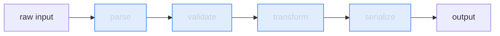
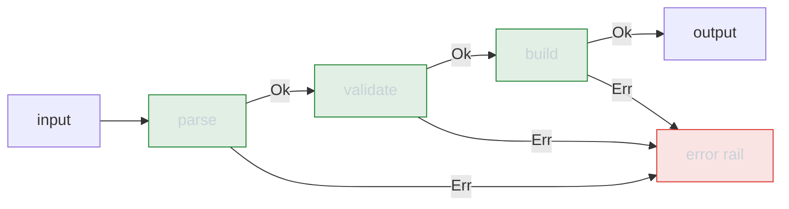

# Composition — Middle Level

> **Roadmap:** [Functional Programming](../README.md) → Composition
>
> *Knowing that `f ∘ g` exists is junior. Knowing **when a pipeline clarifies** and **when point-free style turns into a riddle** — and how to compose functions that can fail without drowning in `if err != nil` — is the middle skill.*

---

## Table of Contents

1. [Introduction](#introduction)
2. [Prerequisites](#prerequisites)
3. [Building Pipelines](#building-pipelines)
4. [`pipe` and `compose` Helpers, Per Language](#pipe-and-compose-helpers-per-language)
5. [Point-Free (Tacit) Style — and Where It Hurts](#point-free-tacit-style--and-where-it-hurts)
6. [Composition Over Inheritance, in Practice](#composition-over-inheritance-in-practice)
7. [Composing Functions That Can Fail](#composing-functions-that-can-fail)
8. [Middleware Is Just Composition](#middleware-is-just-composition)
9. [Trade-offs](#trade-offs)
10. [Common Mistakes](#common-mistakes)
11. [Test Yourself](#test-yourself)
12. [Cheat Sheet](#cheat-sheet)
13. [Summary](#summary)
14. [Further Reading](#further-reading)
15. [Related Topics](#related-topics)

---

## Introduction

> Focus: **using composition well** — building it into real pipelines, knowing its readability limits, and handling the case the textbook ignores: functions that can fail.

At the junior level, composition was a definition: `compose(f, g)(x) == f(g(x))`. Two pure functions glue into one. Clean, but academic.

In real code the questions are sharper. *Should this be a pipeline at all, or is a plain sequence of named variables clearer?* *When does removing the argument names (point-free style) make code elegant, and when does it make it unreadable?* *My functions return errors or `null` — how do I compose those without the glue code swallowing the meaning?*

The middle skill is **treating composition as a default building strategy** — preferring small functions wired together over large functions and deep inheritance — while keeping a sharp eye on the moment it stops helping the reader. Composition is a tool for *humans first*; the compiler does not care whether you used a pipe.

---

## Prerequisites

- **Required:** You can read [`junior.md`](junior.md) — you understand `f ∘ g`, that order matters, and that composition needs the output type of one function to match the input type of the next.
- **Required:** Comfort with [first-class & higher-order functions](../01-first-class-and-higher-order-functions/middle.md) — passing functions as values is the substrate of every helper here.
- **Helpful:** Familiarity with [map / filter / reduce](../04-map-filter-reduce/middle.md); pipelines and the core trio are the same idea seen from two angles.
- **Helpful:** Awareness of [pure functions](../02-pure-functions-and-referential-transparency/middle.md) — composition reasons cleanly only when the pieces are pure (or honest about their effects).

---

## Building Pipelines

A **pipeline** is composition you can read top-to-bottom: data flows through a series of single-purpose transforms, each step's output feeding the next. Where mathematical composition writes `f(g(h(x)))` (read right-to-left, inside-out), a pipeline writes the steps in execution order, which matches how we read.

```python
# Inside-out — you read it backwards to follow the data.
result = format(deduplicate(sorted(parse(raw))))

# Pipeline — same computation, reading order matches data flow.
parsed   = parse(raw)
ordered  = sorted(parsed)
unique   = deduplicate(ordered)
result   = format(unique)
```

The second form is not "less functional." It is composition with the intermediate values *named* — and names are documentation. The decision of whether to collapse those names into a single `pipe(...)` call is a **readability** decision, covered below, not a correctness one.

### The shape of a good pipeline step

Each stage should be a **pure-ish, single-purpose, total** function:

- **Single-purpose** — `validate`, not `validateAndSaveAndNotify`. A step that does three things cannot be reordered, reused, or tested in isolation.
- **Total where possible** — it returns a value for every input it accepts. Steps that can fail break the chain; the [fallible-composition](#composing-functions-that-can-fail) section handles them explicitly rather than letting them throw mid-pipe.
- **Type-aligned** — the output of step *n* is the input of step *n+1*. When types don't line up you need an *adapter* step, which is itself just another function in the chain.



Each box is a function; each arrow is a type that must match on both ends. Drawing a pipeline this way exposes a powerful property: any box can be swapped, inserted, or removed without touching its neighbors, as long as the arrow types still line up.

---

## `pipe` and `compose` Helpers, Per Language

`compose` runs right-to-left (`compose(f, g)(x) == f(g(x))`, math order). `pipe` runs left-to-right (`pipe(f, g)(x) == g(f(x))`, reading order). Most teams prefer `pipe` precisely because it reads in execution order. Each language reaches the same idea through different machinery.

### Python — `functools.reduce` over the function list

Python has no built-in `pipe`, but it is a few lines. The trick is to fold the list of functions, threading the value through:

```python
from functools import reduce
from typing import Callable

def pipe(*fns: Callable):
    """Left-to-right composition: pipe(f, g, h)(x) == h(g(f(x)))."""
    return lambda x: reduce(lambda acc, fn: fn(acc), fns, x)

def compose(*fns: Callable):
    """Right-to-left (math order): compose(f, g, h)(x) == f(g(h(x)))."""
    return lambda x: reduce(lambda acc, fn: fn(acc), reversed(fns), x)

clean = pipe(str.strip, str.lower, lambda s: s.replace(" ", "-"))
clean("  Hello World  ")          # -> "hello-world"
```

For multi-argument first steps, wrap the entry point or rely on Python 3.9+ generators. Note that Python's preferred idiom is often a **comprehension or generator chain**, not a `pipe` helper — reach for `pipe` when the steps are reusable named functions, not for a one-off transform a comprehension expresses more clearly.

### Java — explicit `Function` chaining, or a fold

`java.util.function.Function` ships composition built in: `andThen` (pipe order) and `compose` (math order). No helper needed for two or three steps:

```java
import java.util.function.Function;

Function<String, String> clean =
    ((Function<String, String>) String::strip)
        .andThen(String::toLowerCase)
        .andThen(s -> s.replace(' ', '-'));

clean.apply("  Hello World  ");   // "hello-world"
```

For a *dynamic* list of steps, fold with a stream — `reduce` over `Function::andThen`, seeded with the identity function:

```java
import java.util.List;
import java.util.function.Function;

static <T> Function<T, T> pipe(List<Function<T, T>> steps) {
    return steps.stream().reduce(Function.identity(), Function::andThen);
}
```

In day-to-day Java, the **Stream API** *is* the pipeline syntax — `stream.map(...).filter(...).collect(...)` is composition with a fluent face. Hand-rolled `pipe` helpers earn their place mainly when you need to store and pass a pipeline around as a value.

### Go — no generics-of-functions sugar; compose by hand

Go has no operator overloading and (until recently) no variadic generic compose in the standard library. Idiomatic Go favors an **explicit loop** or small typed helpers over a clever generic `pipe`:

```go
// Two-step compose is trivial and reads fine:
func compose[A, B, C any](g func(B) C, f func(A) B) func(A) C {
    return func(a A) C { return g(f(a)) }
}

// For a homogeneous chain, a slice + loop beats a recursive helper:
func pipe[T any](fns ...func(T) T) func(T) T {
    return func(x T) T {
        for _, fn := range fns {
            x = fn(x)
        }
        return x
    }
}

clean := pipe(strings.TrimSpace, strings.ToLower)
clean("  HELLO  ") // "hello"
```

Go's culture leans hard toward **explicit, readable code over abstraction**. A `pipe` helper is fine when steps are uniform `func(T) T`, but if the types change between steps (the common real case), Go programmers usually just write the sequence out — the named intermediate variables *are* the documentation, and that is considered a feature, not a limitation, in Go's idiom.

> **Cross-language takeaway:** every language can express composition, but the *idiomatic surface* differs. Java uses Streams and `andThen`; Python uses comprehensions and `functools`; Go uses explicit sequences and small generics. Match the host language's grain — a Haskell-style point-free `pipe` ported verbatim into Go will read as foreign.

---

## Point-Free (Tacit) Style — and Where It Hurts

**Point-free** (a.k.a. *tacit*) style means defining a function by composing other functions **without naming its arguments**. The "points" are the argument values; point-free means no points mentioned.

```python
# Pointful — the argument `words` is named and threaded explicitly.
def count_long(words):
    return len([w for w in words if len(w) > 5])

# Point-free-ish — describe the transform, never name the data.
count_long = pipe(
    lambda ws: filter(lambda w: len(w) > 5, ws),
    lambda ws: sum(1 for _ in ws),
)
```

When it works, point-free style is genuinely clarifying: the code reads as *what the data becomes*, not *how we shuffle a variable*. It eliminates a whole class of bugs (you can't pass the argument to the wrong place if you never write the argument).

### Where it hurts

Point-free style turns toxic at three specific thresholds:

1. **More than ~2–3 composed steps with non-obvious types.** Once the reader has to mentally track "what type is flowing here?" without a name to anchor it, the cleverness costs more than it saves. A name like `validatedOrders` is worth a hundred clever combinators.
2. **When you need plumbing combinators to make it fit.** In languages without first-class currying, going point-free often requires helpers (`flip`, `const`, argument-juggling lambdas) whose only job is to rearrange arguments. That plumbing is *noise* — it obscures intent rather than revealing it. This is sometimes called "pointless style" by its critics, only half in jest.
3. **At a debugger breakpoint.** A named intermediate (`ordered = sorted(parsed)`) is a place you can inspect. A single fused `pipe(...)` expression gives the debugger nowhere to stand. When a step can fail or you'll need to step through it, naming the intermediates buys you observability.

> **Rule of thumb:** prefer point-free for **short, total, type-obvious** chains (`pipe(trim, lower)`). Fall back to named intermediates the moment a reader would have to *decode* rather than *read*. Readability for the next human beats elegance for the author. This is the same judgment that governs every composition decision — composition is for people.

---

## Composition Over Inheritance, in Practice

"Favor composition over inheritance" predates FP — it's straight out of *Design Patterns* — but FP sharpens *why*: inheritance couples a subtype to the **entire** shape and lifecycle of its parent, while composition lets you assemble behavior from independent, swappable pieces. The functional flavor of "composition" is literally *function composition plus passing behavior as values*.

### The inheritance trap

```java
// Inheritance: behavior is fixed at class-definition time, in a rigid hierarchy.
class Logger { void log(String m) { ... } }
class TimestampLogger extends Logger { ... }
class TimestampJsonLogger extends TimestampLogger { ... }   // combinatorial explosion
```

Want timestamps *or* JSON *or* both *or* with a request-id? Inheritance forces a class per combination — the classic "inheritance combinatorial explosion." Each new axis multiplies the hierarchy.

### The compositional alternative

Model each concern as a **function that wraps another function**. Combinations are then just compositions — created at *runtime*, in any order, with no new types:

```java
import java.util.function.UnaryOperator;

// Each decorator is a function String -> String.
UnaryOperator<String> timestamp = m -> Instant.now() + " " + m;
UnaryOperator<String> asJson    = m -> "{\"msg\":\"" + m + "\"}";

// Compose the ones you want, in the order you want — no subclasses.
UnaryOperator<String> format = timestamp.andThen(asJson);
log(format.apply("started"));
```

```python
# Same idea in Python — behaviors are values you combine, not classes you extend.
def with_timestamp(fn): return lambda m: fn(f"{now()} {m}")
def with_retry(fn):     return lambda *a: _retry(fn, *a)

handler = with_timestamp(with_retry(send))   # stack concerns by composing
```

The payoff is the same property pipelines have: each concern is **independent, testable in isolation, and freely recombinable**. You add a fourth concern by writing one function, not by editing a class hierarchy. This is the functional reading of the **Strategy** and **Decorator** patterns — they are composition wearing OO clothes. The very next section, middleware, is this exact idea applied to request handling.

> Composition is not *anti*-OO. Modern Java, Kotlin, and C# blend both: small objects (or records) holding composed functions. The point is to **default to composition** and reach for inheritance only when there is a genuine, stable *is-a* relationship — see [Functional vs OO in Practice](../11-functional-vs-oo-in-practice/junior.md).

---

## Composing Functions That Can Fail

Here is where the textbook `f ∘ g` cracks. Real steps fail: parsing rejects bad input, lookups miss, validation says no. The naive responses each hurt composition:

- **Throwing exceptions** breaks the pipeline's data-flow story — control jumps somewhere else, and the type signature lies (it claims to return a value, but might not).
- **Returning `null` / sentinel values** forces a null check between *every* pair of steps, drowning the pipeline in defensive `if`s — the very tangle composition was meant to remove.

```go
// The problem: every step can fail, so glue swamps the logic.
func process(raw string) (Report, error) {
    parsed, err := parse(raw)
    if err != nil { return Report{}, err }
    valid, err := validate(parsed)
    if err != nil { return Report{}, err }
    enriched, err := enrich(valid)
    if err != nil { return Report{}, err }
    return build(enriched), nil
}
```

This works, and in Go it's idiomatic — but notice that **half the lines are error-propagation plumbing**, not business logic. The shape is so regular it begs to be abstracted.

### The insight: compose in a "can-fail" world

The fix is to make failure *part of the value* and teach composition to short-circuit on it. Instead of composing `A -> B`, you compose `A -> Result<B>` — functions that return either a success or a failure. The glue (call it `andThen` / `flatMap` / `bind`) runs the next step only on success and passes failure straight through.

```python
# Result type: either Ok(value) or Err(message).
def then(result, fn):
    """Run fn only if result is Ok; otherwise pass the Err through untouched."""
    ok, val = result
    return fn(val) if ok else result        # short-circuit on Err

# Each step now returns (ok, value):
def parse(raw):    return (True, raw.strip()) if raw else (False, "empty")
def validate(s):   return (True, s) if len(s) > 2 else (False, "too short")

# Composition reads linearly again — the error path is handled once, by `then`.
result = then(then(parse(raw), validate), build)
```

This is **railway-oriented programming**: picture two parallel tracks, a success rail and a failure rail. Each step is a junction — it either continues on the success rail or switches you onto the failure rail, where you stay until the end. The pipeline stays linear and readable; the branching lives inside one reusable combinator instead of being copy-pasted between every step.



This is only a **preview**. The proper treatment — `Option` / `Either` / `Result` as algebraic data types, and why `then` is a *monadic bind* — lives in [Algebraic Data Types](../06-algebraic-data-types/junior.md) and [Monads — Plain English](../09-monads-plain-english/junior.md). The takeaway for now: **when composing fallible steps, lift them into a wrapper type and compose with a short-circuiting combinator, so the happy path stays a clean pipeline.**

---

## Middleware Is Just Composition

If you have used a web framework — Express, Go's `net/http`, Java servlet filters, Python WSGI/ASGI — you have already written compositional code, possibly without naming it. **Middleware is function composition applied to request handlers.**

A middleware is a function that takes a handler and returns a *wrapped* handler with extra behavior — exactly the "function that wraps a function" shape from the composition-over-inheritance section. Stacking middleware is composing those wrappers.

```go
// Go: a Middleware decorates an http.Handler. This is `f ∘ g` for handlers.
type Middleware func(http.Handler) http.Handler

func Logging(next http.Handler) http.Handler {
    return http.HandlerFunc(func(w http.ResponseWriter, r *http.Request) {
        start := time.Now()
        next.ServeHTTP(w, r)                       // call the inner handler
        log.Printf("%s %s %v", r.Method, r.URL.Path, time.Since(start))
    })
}

func Auth(next http.Handler) http.Handler { /* check token, then next.ServeHTTP */ }

// Chaining middleware is composing functions, right-to-left:
func Chain(h http.Handler, mws ...Middleware) http.Handler {
    for i := len(mws) - 1; i >= 0; i-- {           // apply in reverse so the
        h = mws[i](h)                              // first listed runs outermost
    }
    return h
}

handler := Chain(routes, Logging, Auth, RateLimit)  // request flows Logging→Auth→...
```

```python
# Python: the @decorator syntax is composition with sugar.
def requires_auth(handler):
    def wrapped(request):
        if not request.token: return Response(401)
        return handler(request)                    # delegate to the wrapped handler
    return wrapped

@requires_auth          # == view = requires_auth(view)
def view(request): ...
```

Cross-cutting concerns — logging, auth, rate limiting, compression, tracing — are each a single wrapper. The request pipeline is the composition of those wrappers around the core handler. Order matters (auth before the handler; logging usually outermost), exactly as it does for any composition: `compose(f, g) != compose(g, f)`. Recognizing middleware *as* composition lets you reason about request pipelines with the same mental model as data pipelines.

---

## Trade-offs

Composition is a default, not a dogma. Weigh these honestly:

| Benefit | Cost / Tension |
|---|---|
| **Reusable, testable pieces** — each step tested alone | **Indirection** — following data through many small functions can be slower to *read* than one inline block |
| **Recombination without editing existing code** (open for extension) | **Type-alignment burden** — every seam is a type that must match; mismatches force adapter steps |
| **Linear, top-to-bottom reading** in pipeline form | **Debuggability drops** when intermediates are unnamed (point-free) — no breakpoint surface |
| **Cross-cutting concerns isolated** (middleware) | **Order-sensitivity** — silent bugs when wrappers/steps are composed in the wrong order |
| **Failure handled once** (railway) | **Wrapper-type tax** — lifting into `Result`/`Option` adds a layer to learn and unwrap |

The honest middle-level position: **compose by default, but stop composing the moment a named intermediate or a plain loop reads more clearly.** A three-line inline transform does not need a `pipe`. A hierarchy with a genuine, stable `is-a` relationship may legitimately use inheritance. Composition is the strong default *because* it keeps pieces independent — but "strong default" is not "always."

---

## Common Mistakes

1. **Point-free as a flex.** Collapsing a readable pipeline into a dense `pipe(curry(flip(...)), const(...))` to look clever. If a teammate has to decode it, you have traded their time for your aesthetics. Name the intermediates.
2. **Composing impure steps and expecting clean reasoning.** Composition's guarantees (reorder, test in isolation, recombine) hold for *pure* steps. A step that mutates shared state or depends on call order silently breaks them — the pipeline lies about being a pipeline.
3. **Ignoring composition order.** `compose` is right-to-left, `pipe` is left-to-right; `andThen` and `compose` are opposites. Mixing them up flips your data flow. Pick one convention per codebase and stick to it.
4. **Threading errors with exceptions through a "pure" pipeline.** A `throw` mid-pipe makes the type signature dishonest and turns the linear flow into a hidden jump. Lift fallible steps into `Result`/`Option` and compose with a short-circuiting combinator instead.
5. **Building a `pipe` helper the language already has.** Java has `andThen`; Streams *are* pipelines. Re-inventing them in a non-idiomatic shape fights the language and confuses readers. Use the host language's grain.
6. **Over-decomposing into one-liner functions.** Twenty single-line functions wired together can be *harder* to follow than one well-named ten-line function. Compose at the level of meaningful steps, not individual statements — the same "aim for cohesive, not maximally small" lesson as in structure.
7. **Forgetting that a multi-arg first step breaks naive `pipe`.** `pipe(f, g)` assumes each step takes one argument. A first step needing two arguments must be partially applied or wrapped first.

---

## Test Yourself

1. `pipe(f, g)(x)` and `compose(f, g)(x)` — which equals `f(g(x))` and which equals `g(f(x))`? Why does most pipeline code prefer the `pipe` direction?
2. You have a `clean = pipe(trim, lower, slugify)` chain and a 6-step `processOrder` chain whose intermediate types change at each step. For which one is point-free style appropriate, and why?
3. A teammate models `TimestampLogger extends JsonLogger extends Logger` and now needs a *plain* timestamped logger without JSON. Why is the hierarchy fighting them, and what's the compositional fix?
4. Your pipeline has steps that can fail. Why is throwing exceptions a poor fit for a composed pipeline, and what does "railway-oriented" do instead?
5. In what sense is HTTP middleware "just" function composition? What property of composition explains why middleware order matters?
6. When would you deliberately *not* use composition — preferring a plain loop, a named intermediate, or even inheritance?

<details>
<summary>Answers</summary>

1. `compose(f, g)(x) == f(g(x))` (right-to-left, math order); `pipe(f, g)(x) == g(f(x))` (left-to-right, execution order). Pipeline code prefers `pipe` because the steps are written in the order they run, matching reading order, rather than inside-out.
2. **Point-free fits `clean`**: short, every step is `String -> String`, types are obvious, nothing to decode. **`processOrder` should name its intermediates**: types change between steps, so a reader (and a debugger) needs the anchors. Point-free hurts the moment the reader must track an unnamed changing type.
3. Inheritance fixed the behavior combination at class-definition time, so "timestamp without JSON" has no class — they'd have to add yet another subclass (combinatorial explosion). Compositional fix: make `timestamp` and `asJson` each a `String -> String` function and compose only the ones needed at runtime — no new types.
4. A `throw` jumps out of the linear data flow and makes the step's type signature dishonest (claims to return a value, might not), forcing exception handling to wrap the whole chain. Railway-oriented programming makes failure part of the value (`Result`/`Either`), and a short-circuiting combinator (`then`/`flatMap`) runs each step only on success — failure travels the "error rail" to the end, keeping the happy path a clean linear pipeline.
5. A middleware takes a handler and returns a wrapped handler — the "function that wraps a function" shape — so stacking middleware is composing those wrappers. Order matters because composition is not commutative: `compose(auth, log) != compose(log, auth)`; the outermost wrapper runs first, so auth-before-handler vs logging-outermost are deliberate ordering choices.
6. When a plain inline block or named intermediate reads more clearly (a short one-off transform), when over-decomposition would scatter logic across too many trivial functions, when steps are impure and order-coupled (composition's guarantees won't hold), or when there is a genuine, stable *is-a* relationship that inheritance models honestly.

</details>

---

## Cheat Sheet

| Situation | Reach for | Watch out for |
|---|---|---|
| Linear data transform, reusable named steps | `pipe` (left-to-right) | Multi-arg first step needs partial application |
| Two or three obvious `T -> T` steps | Inline `compose` / `andThen` | None — just don't over-build a helper |
| Short, total, type-obvious chain | Point-free style | Stops being readable past ~2–3 changing types |
| Steps whose types change / a step can fail | **Named intermediates** | Don't force point-free here |
| Many recombinable behaviors (logging, retry, auth) | Compose wrapper functions, not subclasses | Composition order is not commutative |
| Request/response cross-cutting concerns | Middleware (= handler composition) | First-listed usually runs outermost; mind order |
| Fallible steps | Lift to `Result`/`Option`, compose with `then`/`flatMap` | Don't `throw` mid-pipe — it breaks the flow & lies in types |

**Direction memory aid:** `compose` reads like math (right-to-left, inside-out); `pipe` reads like a sentence (left-to-right). `andThen` == `pipe`; `compose` == `compose`.

**Golden rule:** *Compose by default — but the moment a named intermediate or a plain loop reads more clearly to the next human, stop. Composition is for people, not for the compiler.*

---

## Summary

- A **pipeline** is composition written in execution order; collapsing it into a single `pipe(...)` call is a *readability* choice, not a correctness one.
- Every language reaches composition differently: **Python** folds with `functools.reduce` (but often prefers comprehensions); **Java** uses `Function.andThen` and the Stream API; **Go** uses small generics and, idiomatically, explicit named sequences. Match the host language's grain.
- **Point-free style** clarifies short, total, type-obvious chains and turns into a riddle past ~2–3 steps with changing types or when it needs argument-juggling plumbing. Named intermediates restore readability and debuggability.
- **Composition over inheritance** in practice means modeling each concern as a function that wraps another, recombined freely at runtime — sidestepping the inheritance combinatorial explosion. It is the functional reading of Strategy and Decorator.
- **Fallible composition** lifts steps into a `Result`/`Option` wrapper and composes with a short-circuiting combinator (railway-oriented), keeping the happy path linear — a preview of [Algebraic Data Types](../06-algebraic-data-types/junior.md) and [Monads](../09-monads-plain-english/junior.md).
- **Middleware is composition** applied to request handlers; order matters because composition is not commutative.
- Compose by default, but stop the moment a name or a loop reads more clearly. Next: [`senior.md`](senior.md) — composition law, performance (fusion), and composing effects at scale.

---

## Further Reading

- **Design Patterns** — Gamma, Helm, Johnson, Vlissides (1994) — the original "favor object composition over class inheritance," plus Strategy and Decorator.
- **Railway Oriented Programming** — Scott Wlaschin (*fsharpforfunandprofit.com*) — the definitive visual treatment of composing fallible functions.
- **Functional Programming in Scala** — Chiusano & Bjarnason — composition, `andThen`/`compose`, and where it leads (the "red book").
- **Structure and Interpretation of Computer Programs** — Abelson & Sussman — composition and abstraction as the heart of programming.
- **Mostly Adequate Guide to Functional Programming** — Brian Lonsdorf — accessible `compose`/`pipe` and point-free style with honest caveats.

---

## Related Topics

- [First-Class & Higher-Order Functions](../01-first-class-and-higher-order-functions/middle.md) — passing functions as values, the substrate every helper here depends on.
- [Map / Filter / Reduce](../04-map-filter-reduce/middle.md) — the core trio; `reduce` is how `pipe`/`compose` are often built.
- [Algebraic Data Types](../06-algebraic-data-types/junior.md) — `Option` / `Either` / `Result`, the types that make fallible composition clean.
- [Monads — Plain English](../09-monads-plain-english/junior.md) — why the short-circuiting `then`/`flatMap` combinator is a monadic bind.
- [Functional vs OO in Practice](../11-functional-vs-oo-in-practice/junior.md) — when composition vs inheritance is the right default, and hybrid styles.
- [Clean Code → Pure Functions](../../clean-code/15-pure-functions/README.md) — purity is what makes composed steps safe to reorder and test.
