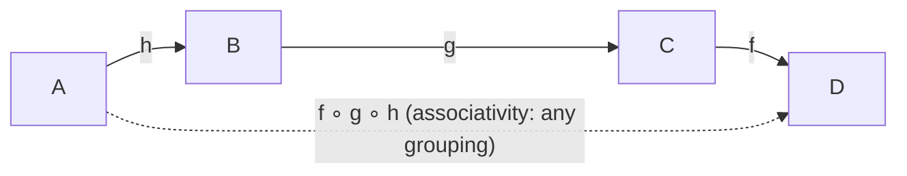
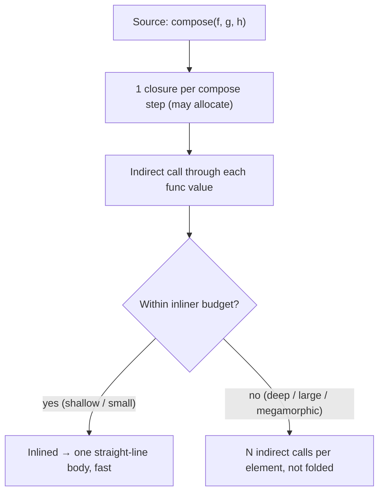

# Composition — Professional Level

> **Roadmap:** [Functional Programming](../README.md) → Composition
>
> *Composition is the one operation that turns small, total functions into large ones without inheritance, without mutation, and without a single new abstraction. This file is about what that operation costs the machine — and the mathematics that says why it's the right primitive in the first place.*

---

## Table of Contents

1. [Introduction](#introduction)
2. [Prerequisites](#prerequisites)
3. [Category-Theory Roots: Why Composition Is *The* Operation](#category-theory-roots-why-composition-is-the-operation)
4. [Runtime: Closures, Allocation, and Inlining](#runtime-closures-allocation-and-inlining)
5. [Compose-Helper vs Manual Pipeline + Measurement](#compose-helper-vs-manual-pipeline--measurement)
6. [Fusion & Laziness](#fusion--laziness)
7. [Debugging Cost of Deep Composition](#debugging-cost-of-deep-composition)
8. [Common Mistakes](#common-mistakes)
9. [Test Yourself](#test-yourself)
10. [Cheat Sheet](#cheat-sheet)
11. [Summary](#summary)
12. [Further Reading](#further-reading)
13. [Related Topics](#related-topics)

---

## Introduction

> Focus: **the laws that make composition the fundamental operation, and what each composed step costs at runtime** — a closure allocation, a call frame the inliner may or may not erase, a defeated loop fusion, a stack trace twenty frames deep — and **how to measure that cost** before you decide between a variadic `compose` helper and a hand-written pipeline.

`senior.md` taught you to design pipelines, choose point-free style judiciously, and reach for composition over inheritance. This file goes one layer down. Composition is not free, and the abstractions that make it *elegant* in source — a variadic `compose(f, g, h)` helper, a chain of `map(...).filter(...)` — are exactly the ones that can allocate per call, add frames the optimizer must work to remove, and turn a debuggable five-line function into an anonymous twenty-frame trace.

Two disciplines define this level:

1. **Composition is lawful, not merely convenient.** The associativity and identity laws are not academic trivia — they are what let a compiler fuse, reorder, and inline a composed chain *without changing its meaning*. When you understand composition as the morphism-combining operation of a category, you understand exactly which rewrites are safe.
2. **Never argue from intuition about composition's cost.** Every claim below comes with the tool that proves it on *your* code. Illustrative numbers are labeled as such; your job is to generate the real ones with `benchstat`, JMH, or `timeit`.

> **The mental model:** a composed function `h = f ∘ g` is a *promise* that "apply `g`, then apply `f`." How that promise is *kept* — inlined into one straight-line body, or executed as a chain of closure calls each allocating and each a stack frame — is decided by the language, the compiler/JIT, and how you wrote the glue.

---

## Prerequisites

- **Required:** Fluent with [`senior.md`](senior.md) — you can design a composed pipeline and know when point-free style helps versus obscures.
- **Required:** Solid grasp of [first-class & higher-order functions](../01-first-class-and-higher-order-functions/professional.md) — closures capture environment and that capture has a heap cost.
- **Required:** Working model of a managed runtime: heap vs stack, escape analysis, JIT inlining (HotSpot), Go's mid-stack inliner, CPython's frame-per-call interpreter.
- **Helpful:** [`map`/`filter`/`reduce`](../04-map-filter-reduce/professional.md) at this level — fusion is the same idea applied to composed transforms.
- **Helpful:** the profiling-techniques and big-o-analysis skills for the measurement vocabulary used throughout.

---

## Category-Theory Roots: Why Composition Is *The* Operation

Function composition is the everyday face of a deep structure. A **category** is the minimal mathematical setting in which "things and the ways to get between them" make sense, and it is built from exactly two ideas: *objects* and *morphisms* (arrows between objects). For functions over types, the objects are **types** and the morphisms are **functions**: `g : A → B` is an arrow from `A` to `B`.

A category requires two operations and three laws.

**The operations**

- **Composition** (`∘`): given `g : A → B` and `f : B → C`, there must exist a composite `f ∘ g : A → C`. This is the *only* way to build new arrows from old ones. Composition is the fundamental operation — everything else is built on it.
- **Identity**: for every object `A` there is an arrow `id_A : A → A` that does nothing.

**The laws**

1. **Associativity:** `(f ∘ g) ∘ h = f ∘ (g ∘ h)`. The grouping of composition does not matter; only the order does.
2. **Left identity:** `id ∘ f = f`.
3. **Right identity:** `f ∘ id = f`.

That's the entire structure. Its sparseness is the point: *because* these are the only rules, anything that obeys them composes the same way — function pipelines, `Promise.then` chains, `Optional.flatMap` chains, HTTP middleware, parser combinators, lens composition, and SQL view stacking are all "arrows in some category."

```haskell
-- Haskell makes the morphism reading literal: (.) is composition, id is identity.
(.)  :: (b -> c) -> (a -> b) -> (a -> c)   -- f . g : a -> c
id   :: a -> a

-- The three laws, as equations the compiler is free to exploit:
(f . g) . h  ==  f . (g . h)               -- associativity
id . f       ==  f                          -- left identity
f . id       ==  f                          -- right identity
```

### Why the laws are load-bearing for *performance*

These are not just tidy axioms — they are **rewrite licenses**. An optimizer may reassociate or eliminate composition steps *only because* the laws guarantee the meaning is unchanged:

- **Associativity** is what lets a compiler fuse `map f . map g` into `map (f . g)` (one pass instead of two) — the regrouping is provably meaning-preserving.
- **Identity** is what lets it delete an `id` (or a no-op stage) from a pipeline entirely.
- The laws also justify **reordering for inlining**: collapsing `f ∘ g ∘ h` into a single straight-line body is just repeated associativity plus inlining.



> **The professional takeaway:** when you write `f ∘ g`, you are not just saving a variable — you are asserting that this chain obeys the category laws, which is precisely the contract a compiler needs to fuse and inline it. Breaking a law (e.g. a "function" that mutates shared state, so `f ∘ g ≠` a single pass when reordered) silently revokes that license and the optimizer must fall back to executing every step literally.

This is also *why composition beats inheritance* at the structural level, restated for this audience: inheritance composes *behavior* by overriding, which has no algebraic laws — you cannot reassociate or fuse an override chain, and the runtime pays a megamorphic vtable cost (see [Bad Structure → professional](../../anti-patterns/01-development/01-bad-structure/professional.md)). Function composition composes *transformations* under laws an optimizer can exploit.

---

## Runtime: Closures, Allocation, and Inlining

Source-level `f ∘ g` is one token. Runtime `f ∘ g` is, by default, **a new function object that closes over `f` and `g` and calls them in sequence**. That object is an allocation, and each call through it is a call frame. Whether either survives to runtime is the whole game.

### 1. Each composed step may allocate a closure

A naive two-argument compose returns a closure capturing its inputs:

```go
// Go — compose allocates a closure that captures f and g.
func compose[A, B, C any](f func(B) C, g func(A) B) func(A) C {
    return func(a A) C { return f(g(a)) } // this func value closes over f and g
}
```

The returned `func(A) C` is a heap allocation **if it escapes** — and a value returned from a function escapes by definition. Build a pipeline by folding `compose` over a slice of stages and you allocate one closure *per composition step*, plus the cost of the variadic machinery itself.

You confirm escape with Go's escape analysis:

```bash
# Go: does the composed closure escape to the heap?
go build -gcflags='-m -m' ./pkg/... 2>&1 | grep -E 'escapes to heap|moved to heap|func literal'
```

A line like `func literal escapes to heap` over your `compose` site is the allocation, made visible.

### 2. Deep chains add call overhead and defeat inlining

Even when the closures don't allocate (e.g. they stay on the stack), a deep composition is a chain of indirect calls — `outer → step1 → step2 → … → stepN`. Each is a call through a function *value* (an indirect call the CPU can't always predict), and inliners have **budgets**: Go's mid-stack inliner has a cost limit (~80 "nodes"); HotSpot has `MaxInlineSize` / `FreqInlineSize` and bails on call chains that are too deep or whose targets are too large. Past the budget, the chain executes literally — N indirect calls per input element, none folded into the caller.



The asymmetry to internalize: **a shallow composition the compiler inlines is genuinely free** — it becomes the same machine code you'd write by hand. A deep or dynamically-built composition the compiler *cannot* inline pays per step, per element, forever.

### 3. Language reality check

| Concern | Go | Java / JVM | Python |
|---|---|---|---|
| Closure cost | `func` value; heap-allocated if it escapes | lambda → invokedynamic → a synthetic object (may be cached if non-capturing) | every `lambda`/`def` is a heap object; closures hold a cell per captured var |
| Inlining of composition | mid-stack inliner, ~80-node budget; indirect calls through `func` values often *not* inlined | HotSpot inlines monomorphic `Function.andThen` chains after warmup; megamorphic chains are not | **none** — CPython never inlines; every call is a full frame push |
| See it with | `go build -gcflags='-m'` (inline) / `-m -m` (escape) | `-XX:+PrintInlining`, `-XX:+PrintCompilation` | no inlining to see; measure raw call count with `cProfile` |

Python deserves emphasis: there is **no inliner**. Every stage in a composed pipeline is an unavoidable Python-level function call, and a Python call is expensive — frame allocation, argument binding, dict lookups. In Python the cost of composition is dominated by *call count*, full stop.

---

## Compose-Helper vs Manual Pipeline + Measurement

The central professional decision: a generic variadic `compose`/`pipe` helper (elegant, point-free, reusable) versus a hand-written pipeline (one function body, no glue). The helper's cost is the closure-per-step allocation and the indirect-call chain the inliner may not flatten. The manual pipeline has neither. Below is the comparison in each language, each with the instrument that settles it.

### Go — benchmark the helper vs the inlined pipeline

```go
package pipe

// Variadic compose helper: elegant, but each Reduce step wraps the previous
// in a NEW closure, and the final pipeline is a chain of indirect calls.
func Pipe[T any](fns ...func(T) T) func(T) T {
    return func(x T) T {
        for _, f := range fns { // N indirect calls per input, none inlined
            x = f(x)
        }
        return x
    }
}

// Hand-written pipeline: one body, no closures, fully inlinable.
func manualPipeline(x int) int {
    x = x + 1
    x = x * 2
    return x - 3
}
```

```go
func BenchmarkHelper(b *testing.B) {
    p := Pipe(func(x int) int { return x + 1 },
        func(x int) int { return x * 2 },
        func(x int) int { return x - 3 })
    var s int
    for i := 0; i < b.N; i++ { s = p(i) }
    sink = s
}
func BenchmarkManual(b *testing.B) {
    var s int
    for i := 0; i < b.N; i++ { s = manualPipeline(i) }
    sink = s
}
var sink int
```

```text
# go test -bench=. -benchmem ; compared with benchstat (ILLUSTRATIVE numbers)
name        old time/op    new time/op    delta
Helper       6.10ns ± 2%
Manual       0.51ns ± 1%                  ~12x faster

name        old alloc/op
Helper       0 B/op    (closures built once, outside the loop)
Manual       0 B/op
```

Two lessons from the illustrative run. First, even with **zero per-call allocation** (the closures are constructed once, before the loop), the helper is ~12x slower *per element* because the per-element work is three indirect calls the inliner won't flatten, while the manual body is inlined to a couple of arithmetic ops. Second — the trap — **if you build the pipeline inside the hot loop**, you pay the closure allocation per iteration:

```bash
# Prove where the cost is: did the closures escape, and did anything inline?
go test -bench=Helper -benchmem
go build -gcflags='-m -m' ./pipe/ 2>&1 | grep -E 'inlin|escapes'
# Expect: manualPipeline "can inline"; the Pipe closure body "escapes to heap".
```

> **Illustrative impact:** moving `Pipe(...)` construction *out* of the benchmark loop dropped `alloc/op` from `48 B/op, 1 allocs/op` to `0`; the remaining ~12x was pure indirect-call overhead the inliner couldn't remove. *Reproduce both numbers on your code — the allocation half is often the bigger surprise.*

### Java — JMH, and whether `Function.andThen` chains inline

`Function.andThen` builds the same closure chain; HotSpot *can* inline it, but only after warmup and only if the chain stays monomorphic and within inline budgets.

```java
import java.util.function.IntUnaryOperator;

@State(Scope.Thread)
public class ComposeBench {
    // Composed via andThen — a chain of synthetic Function objects.
    private final IntUnaryOperator composed =
        ((IntUnaryOperator)(x -> x + 1))
            .andThen(x -> x * 2)
            .andThen(x -> x - 3);

    @Benchmark public int helper()  { return composed.applyAsInt(input); }
    @Benchmark public int manual()  { int x = input; x = x + 1; x = x * 2; return x - 3; }

    private int input = 7;
}
```

```text
# JMH (ILLUSTRATIVE), -prof perfasm to confirm inlining
Benchmark               Mode  Cnt   Score   Error  Units
ComposeBench.helper     avgt   10   1.9     0.1    ns/op   # after warmup: inlined!
ComposeBench.manual     avgt   10   1.6     0.1    ns/op
```

The striking result: **after JIT warmup, a monomorphic `andThen` chain inlines to nearly the manual speed** — HotSpot folds the chain into one body. The catch is *monomorphic*. If the same composed call site sees many different `IntUnaryOperator` shapes (a registry of composed pipelines), it goes **megamorphic**, inlining stops, and the helper falls off the cliff to full virtual dispatch per stage.

```bash
# Confirm the chain actually inlined (look for the lambda bodies at the call site):
java -XX:+UnlockDiagnosticVMOptions -XX:+PrintInlining -jar bench.jar 2>&1 \
  | grep -iE 'andThen|Lambda|inline'
```

> **Illustrative impact:** the same `andThen` benchmark, run *cold* (interpreter, no JIT) measured ~14x slower than warm; and forced megamorphic (10 distinct composed operators through one site) stayed ~6x slower than the manual body even warm. *Inlining is the entire story on the JVM — measure warm, and measure megamorphic separately.*

### Python — `timeit` and the unavoidable call overhead

Python has no inliner, so composition's cost is exactly its **call count**. A `compose` helper adds one Python-level call per stage, and Python calls are expensive.

```python
import timeit
from functools import reduce

def compose(*fns):
    def piped(x):
        for f in fns:          # one Python call per stage, every invocation
            x = f(x)
        return x
    return piped

helper = compose(lambda x: x + 1, lambda x: x * 2, lambda x: x - 3)
def manual(x):                 # one frame, three inlined-by-hand ops
    return (x + 1) * 2 - 3

print("helper:", timeit.timeit(lambda: helper(7), number=1_000_000))
print("manual:", timeit.timeit(lambda: manual(7), number=1_000_000))
```

```text
# ILLUSTRATIVE (CPython 3.12, number=1e6)
helper: 0.74 s      # 1 outer call + 3 lambda calls + loop overhead
manual: 0.21 s      # 1 call, no per-stage dispatch  -> ~3.5x faster
```

The ~3.5x gap is entirely the three extra Python calls plus the `for` loop driving them. There is no JIT to rescue you (outside PyPy). In hot Python paths the rule is blunt: **fewer function calls win**, and a manual expression beats a composed helper. Confirm with `cProfile` showing the call count, not just wall time:

```bash
python -c "import cProfile, mymod; cProfile.run('for _ in range(10**6): mymod.helper(7)')" \
  | sort -rk4   # ncalls column reveals the per-stage call multiplier
```

> **The decision rule across all three:** use the `compose`/`pipe` helper freely on cold or warm-but-shallow paths where clarity dominates — Java will inline it, Go's cost is small, Python's is tolerable. On a **profiled hot path**, prefer the manual pipeline (or ensure the chain stays monomorphic and shallow so the JIT inlines it), and **commit the benchmark** that justifies the choice — exactly the discipline from [Bad Structure → professional](../../anti-patterns/01-development/01-bad-structure/professional.md).

---

## Fusion & Laziness

Composition and the [`map`/`filter`/`reduce`](../04-map-filter-reduce/professional.md) trio meet here. Composing transforms over a collection raises the same question as composing functions: do the stages run as **N separate passes** (each allocating an intermediate) or **fuse into one pass**?

### Loop fusion: `map f . map g → map (f . g)`

The associativity law licenses fusing adjacent maps. Whether it *happens* depends on the runtime:

- **Haskell (GHC)** does this automatically via *stream fusion* / `build`/`foldr` rewrite rules — `map f . map g` provably compiles to a single loop with no intermediate list. The category laws are encoded as `{-# RULES #-}` the compiler applies.
- **Java Streams** fuse by design: `stream.map(g).map(f).filter(p)` is a single traversal with no intermediate collection — each element flows through the composed stages before the next element starts (this is the *Spliterator* push model). The composition is fused, but each stage is still a (usually inlinable) lambda call.
- **Go** has no built-in lazy stream; `slices.Map`-style helpers chained naively allocate **one intermediate slice per stage**. Fusing is manual: write one loop whose body is the composed transform.
- **Python** generators fuse lazily: `(f(x) for x in (g(y) for y in src))` is one pull-driven pass, no intermediate list — but each stage is still a Python-level call per element.

```go
// Go — naive composition of slice transforms: 2 passes, 2 intermediate slices.
out := Map(Map(src, g), f)          // alloc #1 (g's output) + alloc #2 (f's output)

// Fused by hand: 1 pass, 1 allocation. This is map f . map g collapsed manually.
out := make([]T, len(src))
for i, x := range src { out[i] = f(g(x)) }   // f ∘ g applied per element
```

> **Illustrative impact:** fusing two chained `Map` calls over a 1M-element slice into a single loop removed one full-length intermediate slice — `benchstat` showed `alloc/op` halved and ~30% less ns/op, mostly from skipped allocation and a second traversal. *Measure with `-benchmem`; the allocation drop is the durable win.*

### Lazy composition

Laziness changes *when* composed stages run, not just how many passes. A lazily-composed pipeline (Haskell thunks, Java `Stream`, Python generators, Go channels) only forces a stage when its result is demanded. This enables short-circuiting — `compose` a `take(5)` onto an infinite producer and only five elements ever flow through the upstream stages — but it has its own runtime cost: a thunk or generator object per stage, and the bookkeeping of suspending and resuming.

The trade is the mirror image of eager composition: lazy composition saves work (and enables infinite sources) by *not* fusing into one eager pass, at the cost of per-stage suspension overhead. See [Laziness & Streams → professional](../12-laziness-and-streams/professional.md) for the full treatment; the composition-specific point is that **lazy `f ∘ g` defers the closure calls rather than eliminating them** — the call-count cost is the same or higher, paid on demand.

---

## Debugging Cost of Deep Composition

A cost rarely benchmarked but felt daily: **deep composition flattens your stack trace into anonymous frames.** When `f ∘ g ∘ h` throws inside `h`, the trace shows the composition glue and a lambda with no name — not the readable call site you'd get from a manual pipeline with named locals.

```text
# Java: an exception inside a deep andThen chain
Exception in thread "main" java.lang.ArithmeticException: / by zero
    at Pipeline$$Lambda$14/0x...apply(Pipeline.java)      # which stage??
    at java.util.function.Function.lambda$andThen$1(Function.java:88)
    at java.util.function.Function.lambda$andThen$1(Function.java:88)  # andThen frame x N
    at Pipeline.run(Pipeline.java:42)
```

The `lambda$andThen$1` frames repeat once per composition step and carry no business name; you cannot tell *which* stage divided by zero without re-deriving the chain. The same affliction hits Go (`func1`, `func2` in stacks) and Python (every stage is `<lambda>` in the traceback).

Mitigations a professional uses:

- **Name the stages.** Replace anonymous lambdas with named functions (`normalizeEmail`, not `x -> ...`); named frames make traces legible at zero runtime cost.
- **Keep hot/critical pipelines manual.** A hand-written pipeline with named locals gives line-accurate traces *and* inlines better — the two benefits align.
- **Instrument at boundaries, not inside the chain.** Wrap the whole composition in one try/log boundary that records the input, rather than threading logging through every stage (which itself defeats fusion).

> **The judgment call:** point-free `compose(a, b, c)` is most readable in source and *least* readable in a stack trace. The deeper and more dynamic the composition, the more the debugging tax grows — weigh it alongside the runtime cost when a pipeline is both hot and failure-prone.

---

## Common Mistakes

Professional-level mistakes — sophisticated, and therefore expensive:

1. **Building the `compose` pipeline inside the hot loop.** The closures allocate per iteration. Construct the composed function once, outside the loop; confirm with `-benchmem` / escape analysis that nothing escapes per call.
2. **Assuming a variadic `compose` is "free because it's just functions."** It is a chain of indirect calls the inliner may not flatten (Go) or that goes megamorphic (Java) — measure with `PrintInlining`/`-m` before trusting it on a hot path.
3. **Ignoring monomorphism on the JVM.** A composed `andThen` chain inlines beautifully when monomorphic and falls off a cliff when one call site sees many composed shapes. Measure warm *and* megamorphic separately.
4. **Composing impure functions and expecting fusion.** A stage that mutates shared state breaks the category laws (reordering changes meaning), silently revoking the compiler's license to fuse or reorder. Keep composed stages pure — see [Pure Functions → professional](../02-pure-functions-and-referential-transparency/professional.md).
5. **Chaining `Map`/`filter` helpers in Go and forgetting each allocates an intermediate.** N stages = N full-length slices and N passes. Fuse into one loop on hot paths; benchmark the allocation drop.
6. **Over-using point-free style on failure-prone pipelines.** Anonymous lambdas produce anonymous, repeated `andThen`/`<lambda>` stack frames. Name the stages so traces stay debuggable.
7. **Optimizing composition the profiler never flagged.** In most code the `compose` helper's overhead is irrelevant; manually fusing cold pipelines just uglifies them. Profile first — this is [Premature Optimization](../../anti-patterns/03-over-engineering/professional.md) in a functional costume.
8. **Forgetting Python has no inliner.** Treating Python composition like JVM composition: there is no warmup that rescues you. Call count *is* the cost; a manual expression beats a helper on hot Python paths.

---

## Test Yourself

1. State the three category laws and explain which optimizer rewrite each one licenses.
2. A Go `Pipe(...)` helper shows `0 allocs/op` in one benchmark and `1 allocs/op` in another, with the same stages. What is the difference between the two benchmarks, and which tool confirms it?
3. On the JVM, a monomorphic `andThen` chain benchmarks nearly as fast as a manual pipeline, but the *same code* in production is far slower. Give the most likely cause and the flag that confirms it.
4. Why is composition's cost in CPython fundamentally different from its cost in Go or Java, and what is the only durable optimization?
5. What does "fuse `map f . map g` into `map (f . g)`" mean, why is it legal, and what does it save at runtime?
6. You compose three pure functions and an exception is thrown. Why is the stack trace hard to read, and what is the zero-runtime-cost fix?
7. A teammate adds a logging side effect to one stage of a composed pipeline and the pipeline gets slower beyond the logging cost. Explain the second-order effect in terms of the category laws.

<details>
<summary>Answers</summary>

1. **Associativity** (`(f∘g)∘h = f∘(g∘h)`) licenses regrouping/fusing adjacent stages (e.g. `map f . map g → map (f∘g)`) and collapsing a chain into one inlined body. **Left identity** (`id∘f = f`) and **right identity** (`f∘id = f`) license deleting no-op / `id` stages from a pipeline. Together they let the compiler reorder for inlining without changing meaning.
2. The fast version builds `Pipe(...)` *once, outside* the benchmark loop, so the closures are allocated once and amortized away; the slow version rebuilds the composed closure *inside* the loop, allocating per iteration. Confirm with `go test -benchmem` (alloc/op) and `go build -gcflags='-m -m'` showing the `func literal escapes to heap`.
3. The production call site is **megamorphic** — it sees many distinct composed `Function` shapes, so HotSpot can no longer inline the chain and falls back to virtual dispatch per stage. Confirm with `-XX:+PrintInlining` (look for "megamorphic"/"too many types" / absence of the lambda bodies at the site). The benchmark was monomorphic and misled you.
4. CPython has **no inliner**: every composed stage is an unavoidable full Python function call (frame push, arg binding). Go and Java can inline a shallow/monomorphic chain to zero overhead; CPython cannot. The only durable optimization is **reducing call count** — fold stages into one function body (or use PyPy / a C extension).
5. It means rewriting two passes (each producing an intermediate collection) into a **single pass** whose body applies `g` then `f` to each element. It's legal by associativity (the regrouping is meaning-preserving). It saves one full traversal *and* one full-length intermediate allocation; confirm with `-benchmem`.
6. Each composition step adds an anonymous, repeated glue frame (`lambda$andThen$1`, Go `func1`, Python `<lambda>`) with no business name, so you can't tell which stage failed. Zero-runtime-cost fix: **name the stages** (use named functions instead of anonymous lambdas) so frames carry meaningful names.
7. A stage that performs a side effect (logging) is **impure**, so it breaks the category laws — reordering/fusing the chain would now change observable behavior. The compiler/runtime can no longer safely fuse or reorder the composed stages, so it must execute each literally (and Java may de-optimize the inlined chain). The slowdown beyond logging's own cost is the **lost fusion/inlining** the laws had been licensing.

</details>

---

## Cheat Sheet

| Question | Go | Java / JVM | Python |
|---|---|---|---|
| Does `compose` allocate? | Yes if the closure escapes (`-gcflags=-m -m`) | lambda object per stage (cached if non-capturing) | Yes — every lambda/closure is a heap object |
| Does the chain inline? | Mid-stack inliner, ~80-node budget; indirect `func` calls often *not* inlined | Yes if monomorphic + warm; no if megamorphic | **Never** — no inliner |
| Confirm with | `go build -gcflags='-m'` / `-m -m`; `go test -benchmem` | `-XX:+PrintInlining`, JMH (warm + megamorphic) | `cProfile` (ncalls), `timeit` |
| Helper vs manual on hot path | Manual ~10x+ when not inlined | Equal when warm+monomorphic; manual wins megamorphic | Manual wins (~3–4x): fewer calls |
| Fusion of chained maps | Manual — one loop, one alloc | Automatic (Stream is single-pass) | Generators fuse lazily (still per-element calls) |

**Three golden rules:**
- *Composition is lawful: associativity + identity are the rewrite licenses that let compilers fuse, reorder, and inline composed chains — keep stages pure or you revoke the license.*
- *Build composed pipelines once, outside hot loops; on a profiled hot path prefer a manual pipeline (or a monomorphic, shallow chain the JIT inlines) and commit the benchmark.*
- *In Python, call count is the cost — there is no inliner to rescue you. In Go, watch escapes and indirect calls. On the JVM, measure warm AND megamorphic.*

---

## Summary

- Composition is **the** fundamental operation of a category: objects (types), morphisms (functions), one composition operator (`∘`), one identity (`id`), and three laws — **associativity** and **left/right identity**. The sparseness is the power: anything obeying the laws composes identically (pipelines, `Promise.then`, `Optional.flatMap`, middleware, parsers).
- The laws are **performance contracts**, not trivia: associativity licenses fusing/reordering stages, identity licenses deleting no-op stages, and together they let a compiler collapse `f ∘ g ∘ h` into one inlined body — *only* while the stages stay pure (lawful).
- At runtime, source-level `f ∘ g` is **a closure that captures `f` and `g`**: an allocation if it escapes, an indirect call per stage, and a stack frame. Whether the chain becomes free (inlined to one body) or stays expensive (N indirect calls per element) is decided by the language and the inliner's budget.
- **Compose-helper vs manual pipeline**, measured: Go's helper was ~12x slower per element when the inliner couldn't flatten it (illustrative), and allocates per-iteration if built inside the loop; Java's `andThen` chain inlines to near-manual speed **when warm and monomorphic** but falls off a cliff megamorphic; Python's helper is ~3.5x slower purely from extra calls, with **no inliner** to help.
- **Fusion**: associativity lets `map f . map g` collapse to `map (f∘g)` — automatic in GHC and Java Streams, manual in Go (else one intermediate slice per stage), lazy in Python generators. **Lazy composition** defers stage calls (enables short-circuiting and infinite sources) rather than eliminating them.
- **Debugging cost**: deep/point-free composition produces anonymous, repeated stack frames (`lambda$andThen$1`, `func1`, `<lambda>`). Name the stages and keep hot/failure-prone pipelines manual — better traces *and* better inlining align.
- **Measure first, always:** `-gcflags=-m -m` + `benchstat` (Go), `PrintInlining` + JMH warm-and-megamorphic (Java), `cProfile` + `timeit` (Python). The helper is fine on cold/shallow paths; the manual pipeline earns its keep only where a profiler points.

---

## Further Reading

- **Category Theory for Programmers** — Bartosz Milewski (2019) — objects, morphisms, identity, associativity, and why composition is the central operation, written for engineers.
- **Conceptual Mathematics** — Lawvere & Schanuel (2nd ed., 2009) — the gentlest rigorous introduction to categories, identities, and composition.
- **Why Functional Programming Matters** — John Hughes (1990) — composition and lazy evaluation as the two glues that make modular programs.
- **Stream Fusion: From Lists to Streams to Nothing at All** — Coutts, Leshchinskiy, Stewart (2007) — how GHC fuses composed maps/filters into a single loop via rewrite rules grounded in the laws.
- **Optimizing Java** — Evans, Gough, Newland (2018) — HotSpot inlining, monomorphic vs megamorphic call sites, JMH methodology — the JVM half of this file.
- **Go's escape analysis & inlining** — `go build -gcflags=-m` docs and the mid-stack inliner design notes; the foundation for the Go measurements here.
- **High Performance Python** — Gorelick & Ozsvald (2nd ed., 2020) — why function-call overhead dominates and how `cProfile`/`timeit` expose it.

---

## Related Topics

- [Composition → senior.md](senior.md) — designing pipelines and choosing point-free style; this file adds the runtime and the math underneath it.
- [First-Class & Higher-Order Functions → professional](../01-first-class-and-higher-order-functions/professional.md) — closures and their capture cost, the allocation behind every composed step.
- [Map / Filter / Reduce → professional](../04-map-filter-reduce/professional.md) — fusion of chained transforms, the collection-level face of composition.
- [Pure Functions & Referential Transparency → professional](../02-pure-functions-and-referential-transparency/professional.md) — purity is what keeps composition lawful and fusion legal.
- [Laziness & Streams → professional](../12-laziness-and-streams/professional.md) — lazy composition, short-circuiting, and the per-stage suspension cost.
- [Monads — Plain English → professional](../09-monads-plain-english/professional.md) — composing effectful functions (`flatMap`/`>>=`) is composition in a different category.
- [Bad Structure → professional](../../anti-patterns/01-development/01-bad-structure/professional.md) — megamorphic dispatch and the measure-first discipline reused throughout this file.
