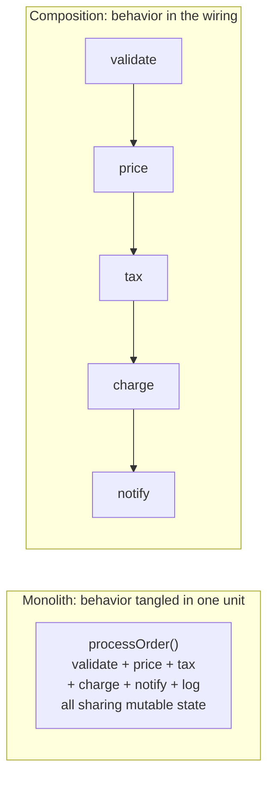
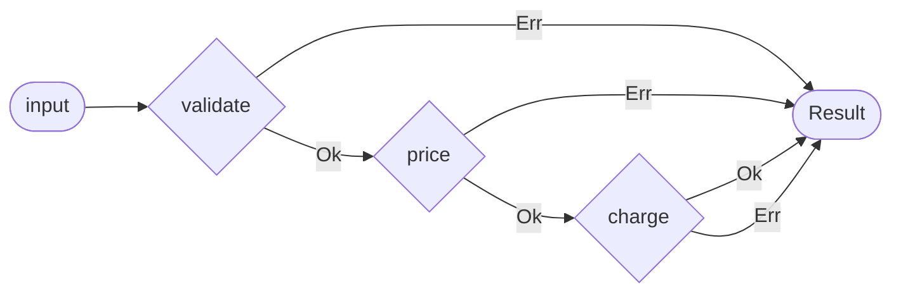
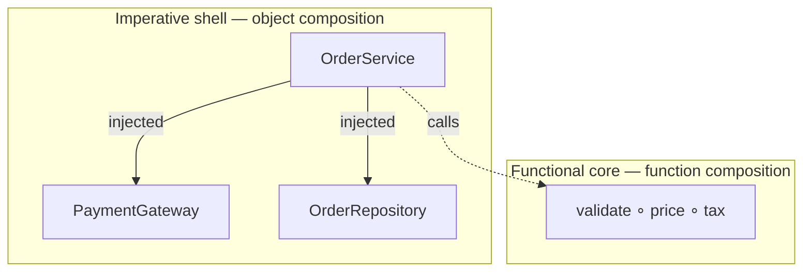

# Composition — Senior Level

> **Roadmap:** [Functional Programming](../README.md) → Composition
>
> *Composition is the load-bearing design principle of functional architecture: build the system out of small total functions and a handful of laws for gluing them together, so that the shape of the program is a wiring diagram, not a control-flow maze. At the senior level the question is not "how do I compose two functions?" — it is "what does it cost a system, a team, and a debugger to make composition the primary unit of design?"*

---

## Table of Contents

1. [Introduction](#introduction)
2. [Prerequisites](#prerequisites)
3. [Composition as a Design Principle](#composition-as-a-design-principle)
4. [Railway-Oriented Programming](#railway-oriented-programming)
5. [Combinators & DSLs](#combinators--dsls)
6. [Function vs Object Composition](#function-vs-object-composition)
7. [Middleware & Decorator Pipelines at Scale](#middleware--decorator-pipelines-at-scale)
8. [Language Reality & Limits](#language-reality--limits)
9. [Common Mistakes](#common-mistakes)
10. [Test Yourself](#test-yourself)
11. [Cheat Sheet](#cheat-sheet)
12. [Summary](#summary)
13. [Further Reading](#further-reading)
14. [Related Topics](#related-topics)

---

## Introduction

> Focus: **design & architecture implications** of treating composition as the primary structuring tool.

At the junior and middle levels (see [`middle.md`](middle.md)) you learned the mechanics: `f ∘ g`, pipelines, point-free style, and why `compose(validate, normalize, persist)` reads better than three nested calls. That is the *grammar* of composition. This file is about the *architecture* it produces and the bills it sends.

The senior claim is sharp and worth stating plainly: **composition is the functional answer to the same problem inheritance and the God Object answer badly.** All three are strategies for building large behavior out of smaller behavior. Inheritance builds it by *specialization down a hierarchy*; the God Object builds it by *accretion into one place*; composition builds it by *wiring independent, total units together at their edges*. The reason composition wins at scale is not aesthetic — it is that each unit stays independently nameable, testable, replaceable, and reasoned-about, while the system-level behavior emerges from the *connections*, which are themselves data you can inspect, reorder, and test.

But composition is not free. Make it your primary tool and you trade one set of problems for another: shallow, obvious control flow becomes a chain of indirections; a stack trace through a 12-stage pipeline tells you *where the train derailed* but not *which station built the bad car*; point-free elegance can curdle into write-only code. A senior chooses composition deliberately, knowing exactly which costs they are accepting and how to mitigate them.

> **The senior mindset shift:** the junior asks "can I compose these two functions?"; the senior asks "if every unit in this subsystem is a small composable function, what happens to my error handling, my stack traces, my onboarding time, and my ability to change one stage without touching the others — and is that trade better than an object graph or a service here?"

---

## Prerequisites

- **Required:** Fluency with [`junior.md`](junior.md) and [`middle.md`](middle.md) — you can write and read `compose`/`pipe`, explain `f ∘ g`, and recognize point-free style.
- **Required:** Comfort with [Algebraic Data Types](../06-algebraic-data-types/senior.md), especially `Result`/`Either` and `Option`, since railway-oriented programming is built on them.
- **Helpful:** [Currying & Partial Application](../07-currying-and-partial-application/senior.md) — combinator libraries lean heavily on partial application to produce composable units.
- **Helpful:** [Monads — Plain English](../09-monads-plain-english/senior.md) — railway-oriented programming *is* the `Either` monad wearing work clothes.
- **Helpful:** [Effect Tracking](../10-effect-tracking/senior.md) — composition is what lets you keep a pure core and push effects to the shell.
- **Helpful:** Familiarity with the [Decorator](../../design-patterns/02-structural/04-decorator/junior.md) and [middleware](../../clean-code/12-async-and-functional/README.md) patterns, which are object- and function-composition under different names.

---

## Composition as a Design Principle

The architectural thesis: **small composable units beat monoliths**, and "composable" is a precise property, not a vibe. A unit is composable when its *output type connects to another unit's input type* and it makes *no hidden assumptions* about what ran before it or runs after. Total functions over explicit data are maximally composable; methods that mutate shared state and depend on call order are minimally composable, because their "real" inputs and outputs are invisible.

### The substitution principle of composition

The payoff of building from composable units is **local reasoning**. If `pipeline = compose(a, b, c, d)` and every stage is a pure function of its input, then:

- You can understand `c` by reading `c` alone — its behavior does not depend on `a` and `b` having run "correctly," only on receiving a value of the right type.
- You can test `c` in isolation with a hand-built input, no setup, no mocks.
- You can replace `c` with `c'` and know the blast radius is exactly "anywhere that relied on `c`'s output," which the type system makes explicit.
- You can reorder, insert, or remove stages by editing the *wiring*, not the stages.

This is the same property [SOLID](../../../../Architecture/README.md)'s Open/Closed and Single-Responsibility principles chase in OO, reached by a shorter road. The God Object fails precisely because none of these hold: you cannot understand one of its methods without understanding the fields the others mutate.



### Composition pushes complexity into the type system

The deep reason composition scales is that it relocates complexity from *runtime control flow* to *compile-time type connections*. In a monolith, "step B requires step A to have run" is a fact stored in the programmer's head (and violated under deadline pressure — this is the temporal-coupling spaghetti of [Bad Structure → senior](../../anti-patterns/01-development/01-bad-structure/senior.md)). In a composition, that fact becomes "step B takes a `ValidatedOrder`, which only `validateA` produces." The sequencing constraint is now enforced by the compiler, not by tribal knowledge.

```python
# Each stage's output type is the next stage's required input type.
# "charge before validate" is not a bug to catch in review — it won't compile/run.
def checkout(raw: RawCart) -> Receipt:
    validated = validate(raw)        # RawCart       -> ValidatedCart
    priced    = price(validated)     # ValidatedCart -> PricedCart
    charged   = charge(priced)       # PricedCart    -> ChargedCart
    return receipt(charged)          # ChargedCart   -> Receipt
```

The senior insight is that **the data types are the architecture.** Designing the intermediate types (`ValidatedCart`, `PricedCart`) *is* the design work; the composition just connects them. This is "make illegal states unrepresentable" applied to *sequencing*.

---

## Railway-Oriented Programming

Plain `f ∘ g` composition assumes every stage succeeds. Real pipelines fail: validation rejects input, the gateway times out, the record is missing. The naïve fix — wrap every stage in `try`/`catch` or check a flag after each call — destroys the composition, because now each stage must know how to handle the *previous* stage's failure. You are back to spaghetti.

**Railway-oriented programming** (Scott Wlaschin's term) is the senior pattern for composing fallible steps. The metaphor: a two-track railway. Every stage is a *switch* that takes a value on the success track and either keeps it on the success track or diverts it to the failure track. Once on the failure track, the value bypasses all remaining stages and arrives at the end unchanged. This is exactly the bind (`>>=`) of the `Result`/`Either` monad — see [Monads — Plain English](../09-monads-plain-english/senior.md) — but you can apply it without ever saying the word "monad."



### The core move: each stage returns `Result`, and `bind` does the wiring

```python
# Python — railway-oriented composition without a library.
# Each step is "world -> Result"; bind chains them, short-circuiting on Err.
from dataclasses import dataclass
from typing import Callable, Generic, TypeVar, Union

T = TypeVar("T"); U = TypeVar("U"); E = TypeVar("E")

@dataclass(frozen=True)
class Ok(Generic[T]):  value: T
@dataclass(frozen=True)
class Err(Generic[E]): error: E
Result = Union[Ok[T], Err[E]]

def bind(r: Result[T, E], f: Callable[[T], Result[U, E]]) -> Result[U, E]:
    return f(r.value) if isinstance(r, Ok) else r   # Err passes straight through

def checkout(raw: RawCart) -> Result[Receipt, str]:
    return bind(bind(bind(
        validate(raw),     # RawCart       -> Result[ValidatedCart, str]
        price),            # ValidatedCart -> Result[PricedCart, str]
        charge),           # PricedCart    -> Result[ChargedCart, str]
        receipt)           # ChargedCart   -> Result[Receipt, str]
```

The architectural win: **error handling is no longer interleaved with business logic.** `price` does not contain a single line about what to do if `validate` failed — it cannot even be called with a failed value. The failure track is wired once, in `bind`, and every stage inherits it. Cross-cutting error propagation has become a property of the *composition operator*, not a responsibility duplicated across stages.

### Go: the language with no monad, doing this by hand

Go has no generics-friendly `Result` ergonomics and no `?` operator. The idiomatic equivalent of the railway is the `if err != nil` ladder — which is railway-oriented programming with the wiring written out longhand at every joint:

```go
// Go — the railway, made of explicit switches. Verbose, but the SHAPE is
// identical: each step short-circuits to the failure track on error.
func Checkout(raw RawCart) (Receipt, error) {
    validated, err := Validate(raw)
    if err != nil {
        return Receipt{}, fmt.Errorf("validate: %w", err) // wrap = name the station
    }
    priced, err := Price(validated)
    if err != nil {
        return Receipt{}, fmt.Errorf("price: %w", err)
    }
    charged, err := Charge(priced)
    if err != nil {
        return Receipt{}, fmt.Errorf("charge: %w", err)
    }
    return BuildReceipt(charged)
}
```

This is a genuine senior-level trade Go made on purpose. The verbosity buys you something the abstracted railway loses: **`%w`-wrapped errors carry the station name into the message**, so the stack-trace-and-debuggability problem (below) is partly solved at the source. The lesson is not "Go is primitive" — it is that Go chose *explicit, locally-readable failure wiring* over *abstracted, terse failure wiring*, and that choice has real debugging benefits to weigh against the boilerplate.

### Java: `Optional`/`flatMap` and the gap

Java can express the railway for *absence* with `Optional.flatMap`, and for *error-with-value* with `Either` from Vavr or a hand-rolled sealed type:

```java
// Java 21 — sealed Result + a fluent flatMap gives a real railway.
sealed interface Result<T> permits Ok, Err {}
record Ok<T>(T value) implements Result<T> {}
record Err<T>(String error) implements Result<T> {}

static <T, U> Result<U> flatMap(Result<T> r, Function<T, Result<U>> f) {
    return switch (r) {
        case Ok<T> ok -> f.apply(ok.value());
        case Err<T> e -> new Err<>(e.error());      // short-circuit
    };
}

// checkout = flatMap(flatMap(flatMap(validate(raw), Checkout::price),
//                            Checkout::charge), Checkout::receipt);
```

The friction: without `do`-notation or a `?` operator, deeply nested `flatMap` is hard to read, which is why Java pipelines often stay shallow or fall back to checked exceptions. **Knowing where the language's ergonomics run out is itself senior knowledge** — see [Language Reality & Limits](#language-reality--limits).

### Combining errors vs short-circuiting

A subtlety that separates middle from senior: the `Result` railway *short-circuits* — the first error stops everything. That is correct for *sequential* steps (you can't charge an invalid cart). But for *independent* validations ("collect ALL the form errors, don't stop at the first"), short-circuiting gives a terrible UX. The right tool there is an **applicative**-style accumulation (`Validation` in Vavr/Scala, or a manual error-list fold), which runs all checks and concatenates failures. Choosing short-circuit (`Result`/monadic) vs accumulate (`Validation`/applicative) per use case is a senior judgment, not a default.

---

## Combinators & DSLs

A **combinator** is a function that takes functions (or other composable values) and returns a new one. A **combinator library** is a set of small primitives plus combinators that glue them, such that users build complex behavior *by composition* rather than by configuration objects or inheritance. This is the most powerful architectural payoff of composition: you ship a *vocabulary*, and users compose programs in it. Parser combinators, property-based-testing generators, validation libraries, and routing DSLs are all this pattern.

### The shape of a combinator library

```python
# A tiny validation combinator library. Primitives + combinators.
# Users write rules by COMPOSING, never by editing the library.
from typing import Callable
Validator = Callable[[str], Result[str, str]]   # value -> Ok(value) | Err(msg)

# --- primitives ---
def non_empty(s: str) -> Result[str, str]:
    return Ok(s) if s else Err("must not be empty")

def max_len(n: int) -> Validator:               # parameterized primitive (currying)
    return lambda s: Ok(s) if len(s) <= n else Err(f"max {n} chars")

# --- combinators: take validators, return a validator ---
def both(a: Validator, b: Validator) -> Validator:
    return lambda s: bind(a(s), b)               # run a, then b on success

def either(a: Validator, b: Validator) -> Validator:
    return lambda s: a(s) if isinstance(a(s), Ok) else b(s)

# --- usage: a new rule is a COMPOSITION, requiring zero library changes ---
username = both(non_empty, max_len(20))
```

The architectural property here is **closure under composition**: combining two `Validator`s yields a `Validator`, so the result is itself composable, indefinitely. This is what lets a five-primitive library express thousands of rules. It is the [Open/Closed principle](../../../../Architecture/README.md) in its strongest form — the library is closed for modification (you never touch it) yet open for extension (users compose new behavior).

### DSLs are combinator libraries with good names

A composed-from-combinators API *reads* like a domain-specific language:

```python
rule = both(non_empty, both(max_len(20), matches(r"^[a-z]+$")))
# reads: "non-empty AND (at most 20 chars AND lowercase letters)"
```

Parser combinators are the canonical example. In Haskell, `many (digit <|> letter)` is a complete parser for alphanumeric strings, built entirely by composing `digit`, `letter`, the `<|>` ("or") combinator, and `many` ("zero or more"). No grammar file, no code generator — the parser *is* a composed value. The senior takeaway: when a domain has a small set of primitives and a few ways to combine them, a combinator library is often a better architecture than a configuration format or a class hierarchy, because the combinatorial space is reachable without library changes and the laws (associativity, identity) give you free guarantees.

> **The trade:** combinator libraries have a steep *initial* learning curve (users must learn the vocabulary and the composition laws) in exchange for a low *marginal* cost (once fluent, new behavior is a one-liner). They pay off when many people compose against the library over a long time. For a config read once at startup, they are over-engineering.

---

## Function vs Object Composition

Composition is not unique to FP. OO has "favor composition over inheritance" as core doctrine. The senior must hold three things distinct and know when each applies.

| | **Inheritance** | **Object composition** | **Function composition** |
|---|---|---|---|
| Unit of reuse | Class (subclass extends) | Object (has-a, delegates) | Function (output→input) |
| Coupling | Tight (whitebox: subclass sees internals) | Looser (blackbox: via interface) | Loosest (only types connect) |
| Binding time | Compile time, fixed | Runtime, swappable | Call time, per-call |
| Reasoning | Must understand whole hierarchy | Understand the interface | Understand one function |
| Failure mode | Fragile base class, deep hierarchies | Object-graph wiring sprawl | Deep pipeline, opaque traces |
| Best for | True is-a + stable taxonomy (rare) | Stateful collaborators, DI | Stateless data transforms |

### Why composition beats inheritance — precisely

Inheritance couples the subclass to the *implementation* of the superclass (the "fragile base class" problem: a change in the base silently breaks subclasses). It is also *single* (one parent in most languages) and *fixed at compile time*. Function composition couples units only at their *type interface*, is *n-ary* (compose as many as you like), and is *rearrangeable at call time*. So the FP slogan "composition over inheritance" is the same advice the [Gang of Four gave OO](../../design-patterns/README.md) — favor has-a over is-a — taken to its limit: the "has-a" relationship becomes "is-fed-by."

### They are not rivals — they layer

The senior view is that these are *complementary at different scales*, not competing answers to one question:

- **Function composition** for the stateless data-transformation core — parsing, validation, pricing, mapping DTOs. This is where a pipeline of pure functions shines and where [Effect Tracking](../10-effect-tracking/senior.md)'s "functional core" lives.
- **Object composition** for the stateful, effectful shell — a `PaymentGateway` *injected* into a service, a repository *injected* into a use case. Here you want a swappable collaborator behind an interface ([Dependency Injection](../../design-patterns/README.md)), which is object composition.
- **Inheritance** rarely, and only for genuine, stable is-a taxonomies (an AST node hierarchy, a sealed type that is really a sum type).

A well-built system uses all three: dependency-injected services (object composition) whose methods are pipelines of pure functions (function composition), with the occasional sealed hierarchy modeling a closed sum type. The [Functional vs OO in Practice](../11-functional-vs-oo-in-practice/senior.md) topic explores this hybrid in depth.



---

## Middleware & Decorator Pipelines at Scale

The most common place composition appears in production backends is the **middleware pipeline**: each middleware wraps the next, forming a chain that a request flows down and a response flows back up. This is function composition (each middleware is `handler -> handler`) and the [Decorator pattern](../../design-patterns/02-structural/04-decorator/junior.md) (each wraps and augments) at the same time — the FP and OO framings of one idea.

```go
// Go — middleware as composable handler decorators. Each is Handler -> Handler.
type Middleware func(http.Handler) http.Handler

func Logging(next http.Handler) http.Handler {
    return http.HandlerFunc(func(w http.ResponseWriter, r *http.Request) {
        start := time.Now()
        next.ServeHTTP(w, r)
        log.Printf("%s %s %v", r.Method, r.URL.Path, time.Since(start))
    })
}

// Compose a slice of middleware into one wrapper (right-fold = outermost first).
func Chain(h http.Handler, mws ...Middleware) http.Handler {
    for i := len(mws) - 1; i >= 0; i-- {
        h = mws[i](h)
    }
    return h
}

// api := Chain(handler, Logging, Auth, RateLimit, Recover)
// The PIPELINE is data: reorder the slice, get a different behavior.
```

The architectural strengths at scale:

- **Cross-cutting concerns compose cleanly.** Logging, auth, rate-limiting, panic-recovery, tracing — each is one middleware, added or removed by editing a list. None of them pollutes the business handler. This is exactly the cross-cutting win railway-oriented programming gives error handling, generalized.
- **Order is explicit and is the wiring.** `Recover` outermost so it catches everything; `Auth` before the handler so unauthenticated requests never reach it. The ordering bugs are real (auth after rate-limit lets unauthenticated traffic consume your rate budget), but they are *visible in one list* rather than scattered.
- **The pipeline is testable per-stage.** Each middleware is a `Handler -> Handler` you can test with a stub `next`.

```python
# Python — same idea, decorators composing a view.
def with_logging(handler):
    def wrapped(req):
        start = time.monotonic()
        resp = handler(req)
        log.info("%s %.1fms", req.path, (time.monotonic() - start) * 1000)
        return resp
    return wrapped

# app = with_logging(with_auth(with_rate_limit(view)))
```

> **The scale failure mode:** a 15-deep middleware chain where each layer mutates a shared request/context object reintroduces the temporal coupling composition was supposed to kill — middleware 9 depends on middleware 3 having set `ctx.user`, invisibly. The composition is honest only if each layer's contribution is *visible in its type* (it adds a known field, returns a known shape). When middleware communicates through an untyped mutable bag, you have a God Object flowing through a pipeline. Keep the context typed and the additions explicit.

---

## Language Reality & Limits

Composition is a spectrum of ergonomics, not a binary feature. The senior matches ambition to what the language makes cheap.

### Haskell — point-free culture and its discontents

Haskell makes composition the path of least resistance: `(.)` is the compose operator, functions are curried by default (so partial application is free), and the community prizes **point-free** ("tacit") style — defining functions purely by composing others without naming the argument:

```haskell
-- point-free: count the words longer than 3 chars
longWords :: String -> Int
longWords = length . filter ((> 3) . length) . words
```

This is genuinely elegant and, once fluent, readable. But it has a well-known dark side the community itself names **"point-less" style**: aggressive point-free code with `flip`, `(.).(.)` ("the owl"), and complex `Applicative` plumbing becomes *write-only* — unreadable even to experienced Haskellers. The senior lesson transfers to every language: **point-free is a tool for clarity, not a goal.** Use it when it removes noise (`map toUpper`); abandon it the moment naming the argument is clearer. The same discipline applies to over-eager `compose(...)` chains in JS/Python.

### Go — composition by explicit wiring, on purpose

Go has no `compose`, no operator overloading, no currying, no `Result` ergonomics. You compose by *writing the wiring out* — the `if err != nil` railway, the explicit middleware `Chain`, function values passed and called. This is a deliberate language-design stance: Go optimizes for *the reader who arrives at 3am during an incident*, and explicit wiring with `%w`-wrapped errors gives that reader a legible failure path at the cost of terseness. A senior writing Go does not fight this — they lean into small, named, explicitly-wired functions and let `errors.Is`/`%w` carry the station names that an abstracted railway would have erased.

### Java — Streams and `Function.andThen`, with a ceiling

Java composes via `Function.andThen`/`compose`, the Streams pipeline (`stream().filter().map().collect()`), and `Optional.map`/`flatMap`. It is real composition and idiomatic. The ceiling: no `?`/`do`-notation makes deep `flatMap` chains awkward; checked exceptions don't compose through `Function` (a lambda can't throw a checked exception cleanly), which is why Java error handling often stays imperative even inside otherwise-functional pipelines. Records and sealed types (Java 17+) materially improved the ADT side, narrowing the gap — but deep railway-oriented code is still more comfortable in Scala/Kotlin.

### Python — `functools` and the readability tradition

Python composes with `functools.reduce`, `functools.partial`, generator pipelines, and comprehensions. It has no compose operator (you write `compose` yourself or pull it from a library), and the language's culture *actively distrusts* heavy point-free style — "flat is better than nested," "readability counts" (Zen of Python) push toward explicit `for`-loops and named intermediates over dense functional chains. A senior Pythonista composes *moderately*: a `pipe` of three named functions, yes; a 30-character lambda inside a `reduce`, usually no.

### The universal limits: debuggability and stack traces

This is the cost every language pays and the most important senior caveat.

- **Stack traces through deep compositions are uninformative.** A failure inside `compose(a, b, c, d, e)` or a 12-stage `reduce` shows you the *composition machinery* (`bind`, `andThen`, `reduce`, the framework's pipeline runner) on the stack, often with the actual stages obscured by lambdas named `<lambda>` or `λ`. You learn *that* the pipeline failed, not *which stage built the bad value*. The deeper and more point-free the composition, the worse this gets.
- **Mitigations a senior applies:** (1) **name the stages** — use named functions, not anonymous lambdas, so they appear in traces; (2) in Go, **wrap with `%w` and a stage label** at every joint; (3) keep pipelines **shallow and flat** — prefer three pipelines of four stages over one of twelve; (4) **log/trace at stage boundaries** in long-lived pipelines (this is exactly what middleware-style observability gives you); (5) for railway code, **attach context to the `Err` value** as it short-circuits, so the failure track carries its own breadcrumb.
- **Reorderability is a double-edged sword.** Because the pipeline is data you can reorder, a subtle bug can be "stage C and stage D were swapped," which no type error catches if they share a type. Composition makes *some* errors impossible (type-mismatched wiring) and *other* errors easy (semantically-wrong-but-type-correct ordering). Tests on the *whole* pipeline, not just stages, guard the second class.

> **The limit, stated honestly:** composition trades the *intra-function* complexity of a monolith (long, branchy, hard-to-test bodies) for *inter-function* complexity (many small units, indirection, opaque traces). For stateless transforms over well-typed data this is a great trade. For a short, linear, rarely-changing procedure, an explicit ten-line function with named locals is more debuggable than a five-combinator pipeline — and the senior writes the ten-line function.

---

## Common Mistakes

Mistakes seniors make when composition becomes the primary design tool:

1. **Composing for its own sake.** Turning a clear five-line procedure into a five-combinator pipeline because composition is "the functional way." If there's no reuse, no fallible stages, and no variation, a plain named function is more readable and more debuggable. *Composition is justified by reuse, fallibility, or variation — not by ideology.*
2. **Point-free pushed past clarity.** `(.).(.)` and chains of `flip`/`curry` that no one on the team can read at 3am. *Point-free is for removing noise; name the argument the moment it's clearer.*
3. **`try`/`catch` inside every stage instead of a railway.** Interleaving error handling with each stage's logic recreates the spaghetti composition was meant to remove. *Use `Result`/`Either` + `bind` so failure is wired once in the operator, not duplicated per stage.*
4. **Short-circuiting where you needed accumulation.** Using a monadic `Result` railway for form validation, so the user fixes one error, resubmits, and discovers the next. *Independent validations want applicative accumulation (`Validation`), not first-failure short-circuit.*
5. **A typed pipeline carrying an untyped mutable context.** Middleware that communicates by mutating a shared bag (`ctx["user"] = ...`) reintroduces hidden temporal coupling — middleware 9 silently depends on middleware 3. *Keep the carried context typed and each stage's contribution explicit, or you've built a God Object on rails.*
6. **Anonymous stages, then surprise at the stack trace.** Composing lambdas named `<lambda>` and being unable to tell which stage failed in production. *Name your stages; in Go wrap errors with a stage label; keep pipelines shallow; trace at boundaries.*
7. **Reaching for inheritance (or a combinator DSL) where simple object composition fits.** Building a "pluggable strategy hierarchy" or a homegrown combinator library for a single, stable behavior. *Function composition for stateless transforms, object composition (DI) for swappable stateful collaborators, inheritance almost never; a combinator library only when many people compose against it over time.*
8. **Mistaking deep composition for good design.** A 12-stage pipeline is not automatically better than the monolith it replaced if the stages are anemic pass-throughs that only exist to be composed. *Each unit must earn its existence by being independently meaningful, named, and testable.*

---

## Test Yourself

1. State, precisely, why composition scales better than inheritance for building large behavior — name the specific coupling each creates.
2. What exact problem does railway-oriented programming solve that plain `f ∘ g` composition does not, and what is the one operator that does the work?
3. When should a fallible pipeline *short-circuit* on the first error, and when should it *accumulate* all errors? Name the abstraction behind each.
4. A `compose(...)` chain fails in production and the stack trace is uninformative. Give three concrete techniques to make the failure diagnosable.
5. You're designing a validation subsystem many teams will use to express thousands of rules from a few primitives. Inheritance hierarchy, configuration format, or combinator library — which, and why? What's the cost?
6. Where does function composition belong in a system, where does object composition belong, and where (rarely) does inheritance? Sketch the layering.
7. Go's `if err != nil` ladder is railway-oriented programming written longhand. What does this verbose form *buy* you that an abstracted `bind`-based railway loses?

<details>
<summary>Answers</summary>

1. Inheritance couples a subclass to the *implementation* of its superclass (the fragile-base-class problem — a base change silently breaks subclasses), is single-parent, and is fixed at compile time, so reasoning requires understanding the whole hierarchy. Function composition couples units *only at their type interface*, is n-ary, and is rearrangeable at call time, so each unit is understandable, testable, and replaceable in isolation — local reasoning holds. The behavior lives in the wiring (inspectable data) rather than baked into a taxonomy.
2. Plain `f ∘ g` assumes every stage succeeds; real stages fail, and handling failure inline forces each stage to know about the previous stage's failure, which destroys composability. Railway-oriented programming makes each stage return `Result`/`Either`, and **`bind` (`>>=`/`flatMap`)** wires the failure track once: an `Err` short-circuits past all remaining stages. Error propagation becomes a property of the composition operator, not a duplicated per-stage responsibility.
3. **Short-circuit** for *sequential, dependent* steps where a later step is meaningless after an earlier failure (you can't charge an invalid cart) — backed by the **monadic** `Result`/`Either` (`bind`). **Accumulate** for *independent* checks where the user wants all errors at once (form validation) — backed by the **applicative** `Validation`, which runs every check and concatenates failures.
4. Any three: (a) name the stages (use named functions, not anonymous lambdas, so they appear in traces); (b) keep pipelines shallow and flat (three small pipelines beat one 12-stage one); (c) attach context to the `Err` value as it short-circuits, or in Go wrap with `%w` + a stage label; (d) log/trace at stage boundaries for long-lived pipelines.
5. A **combinator library**: a few primitives plus combinators (`both`, `either`, `optional`) that are *closed under composition*, so users reach the entire combinatorial space without ever editing the library (Open/Closed in its strongest form). A config format can't express arbitrary new logic; an inheritance hierarchy explodes and couples. The cost is a steep *initial* learning curve (the vocabulary and composition laws) traded for a near-zero *marginal* cost per new rule — worth it only because many teams compose against it over a long time.
6. **Function composition** for the stateless data-transformation core (parse/validate/price/map) — the functional core. **Object composition** for the stateful, effectful shell — swappable collaborators (gateway, repository) injected behind interfaces (DI). **Inheritance** only for genuine, stable is-a taxonomies / closed sum types (AST nodes, sealed types). Layering: DI'd services (object composition) whose methods are pipelines of pure functions (function composition), with the occasional sealed hierarchy.
7. The longhand `if err != nil` with `fmt.Errorf("stage: %w", err)` carries the *station name* into the error message and chain at every joint, so the failure path stays legible — which is exactly the debuggability/stack-trace cost the abstracted railway pays. Go traded terseness for an explicitly-wired, locally-readable failure path optimized for the 3am incident reader; the boilerplate is the price of that legibility, on purpose.

</details>

---

## Cheat Sheet

| Concern | Composition answer | Senior caveat |
|---|---|---|
| Build large behavior | Wire small total units; behavior lives in the connections | Each unit must be independently meaningful, named, testable |
| Sequencing / temporal coupling | Distinct intermediate types; next stage requires previous output | The data types *are* the architecture — design them first |
| Fallible steps | Railway: each stage returns `Result`; `bind` wires the failure track once | Short-circuit (monadic) for dependent steps |
| Collect all errors | Applicative `Validation` accumulation | Don't use short-circuit `Result` for form validation |
| Extensible vocabulary | Combinator library, closed under composition (Open/Closed) | Steep initial cost; worth it only for many users over time |
| Cross-cutting concerns | Middleware/decorator chain (`handler -> handler`) | Order is the wiring; keep the carried context typed |
| Stateless transforms | Function composition | — |
| Swappable stateful collaborators | Object composition (DI), not inheritance | — |
| Closed sum type / taxonomy | Sealed type / rare inheritance | Almost never reach for class hierarchies |
| Debuggability | Name stages, keep pipelines shallow, trace at boundaries | Deep point-free → opaque traces; mitigate deliberately |

**Three golden rules:**
- *Composition is justified by reuse, fallibility, or variation — not by ideology; a clear named function beats a gratuitous pipeline.*
- *Wire failure once (the railway / `bind`), not in every stage; choose short-circuit vs accumulate per use case.*
- *Composition trades intra-function complexity for inter-function complexity and opaque traces — name your stages, keep them shallow, and the trade pays.*

---

## Summary

- **Composition is the functional design principle:** build large behavior from small, total, independently-reasoned units wired at their type edges. It solves the same "build big from small" problem inheritance and the God Object solve badly, by keeping every unit nameable, testable, and replaceable while system behavior emerges from the *connections* — which are inspectable data.
- **It relocates complexity into the type system:** distinct intermediate types make "step B requires step A" a compile-time fact, not tribal knowledge. The data types are the real design work; the composition just connects them.
- **Railway-oriented programming** composes *fallible* steps: each stage returns `Result`/`Either`, and `bind` wires the failure track once, so error handling stops polluting business logic. Short-circuit (monadic) for dependent steps; accumulate (applicative `Validation`) for independent ones. Go does this longhand with `if err != nil` + `%w`, trading terseness for a legible failure path.
- **Combinator libraries & DSLs** are composition's biggest payoff: a few primitives plus combinators, *closed under composition*, let users reach a vast space without editing the library — Open/Closed at its strongest. Steep initial learning cost, near-zero marginal cost; worth it for many users over time.
- **Function vs object vs inheritance composition** layer rather than compete: function composition for the stateless core, object composition (DI) for the swappable stateful shell, inheritance rarely for genuine closed taxonomies.
- **Middleware/decorator pipelines** are function composition and the Decorator pattern at once: cross-cutting concerns compose cleanly and order is explicit wiring — but a 15-deep chain mutating an untyped shared context is a God Object on rails.
- **Language reality:** Haskell makes composition free and prizes point-free style (which can curdle into write-only "point-less" code); Go composes by explicit wiring on purpose; Java has Streams/`Function.andThen` with a deep-`flatMap` ceiling; Python composes moderately, distrusting heavy point-free style.
- **The universal limit is debuggability:** deep compositions produce opaque stack traces. Mitigate by naming stages, keeping pipelines shallow and flat, attaching context to the failure track, and tracing at boundaries. For short, linear, stable procedures, a plain named function is the senior choice.
- Next: [`professional.md`](professional.md) — fusion, performance, and the runtime cost of composition at scale.

---

## Further Reading

- **Railway Oriented Programming** — Scott Wlaschin (fsharpforfunandprofit.com, 2013) — the canonical, diagram-driven introduction to composing `Result`-returning steps. The source of the metaphor used here.
- **Domain Modeling Made Functional** — Scott Wlaschin (2018) — railway-oriented programming, composition, and "make illegal states unrepresentable" applied to real domains.
- **Why Functional Programming Matters** — John Hughes (1990) — the original argument that *composition* and higher-order functions, not "no assignment," are what make FP modular.
- **Structure and Interpretation of Computer Programs** — Abelson & Sussman — combinators and building languages by composition (the metacircular evaluator, the picture language).
- **Monadic Parser Combinators** — Hutton & Meijer (1996) — the foundational parser-combinator paper; composition as a complete parsing architecture.
- **Functional Programming in Scala** — Chiusano & Bjarnason — combinator libraries, the applicative-vs-monadic distinction (short-circuit vs accumulate), and composition laws.
- **Design Patterns** — Gang of Four (1994) — "favor object composition over class inheritance," the OO statement of the same principle.

---

## Related Topics

- [Map / Filter / Reduce](../04-map-filter-reduce/senior.md) — the most common composable building blocks; fusion is composition optimized.
- [Algebraic Data Types](../06-algebraic-data-types/senior.md) — `Result`/`Either` and `Option`, the rails the railway runs on.
- [Currying & Partial Application](../07-currying-and-partial-application/senior.md) — how combinator primitives get parameterized into composable units.
- [Monads — Plain English](../09-monads-plain-english/senior.md) — railway-oriented programming is the `Either` monad; `bind` is the composition operator.
- [Effect Tracking](../10-effect-tracking/senior.md) — composition is what keeps the pure core composable and pushes effects to the shell.
- [Functional vs OO in Practice](../11-functional-vs-oo-in-practice/senior.md) — the hybrid layering of function, object, and inheritance composition.
- [Design Patterns → Decorator](../../design-patterns/02-structural/04-decorator/junior.md) — middleware pipelines as the OO framing of function composition.
- [Anti-Patterns → Bad Structure](../../anti-patterns/01-development/01-bad-structure/senior.md) — the temporal-coupling spaghetti that typed composition makes impossible.
- [Architecture → SOLID & System Design](../../../../Architecture/README.md) — Open/Closed and Dependency Inversion, the OO targets composition reaches by a shorter road.
