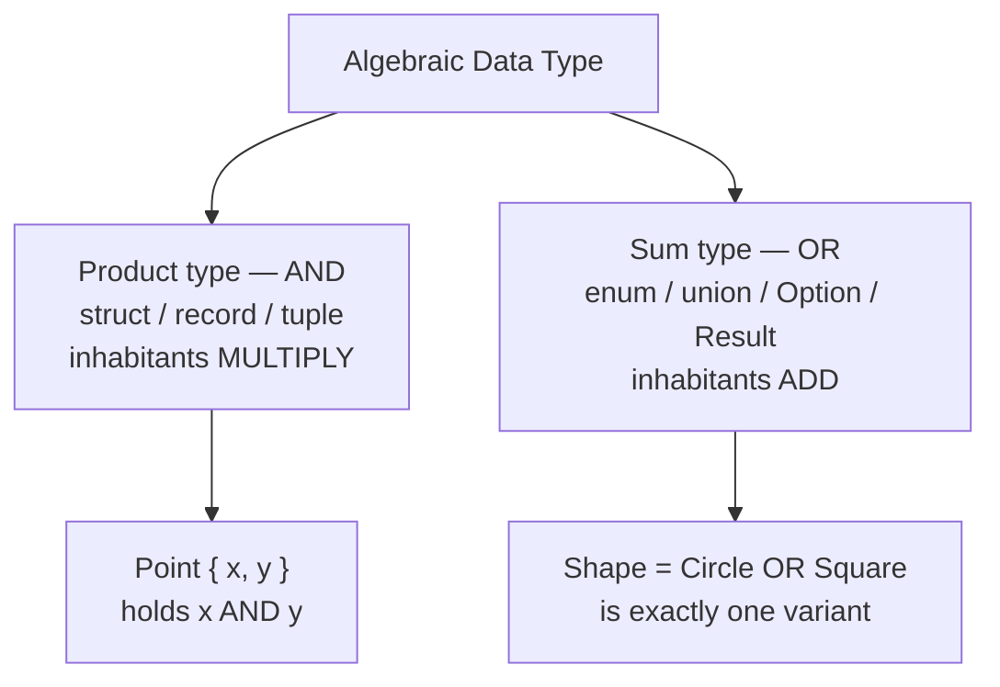

# Algebraic Data Types — Junior Level

> **Roadmap:** [Functional Programming](../README.md) → Algebraic Data Types
>
> *An algebraic data type is a value built by combining other types with two operations: **AND** (a record that holds several fields at once) and **OR** (a choice between several alternatives). That tiny vocabulary is enough to model almost any data — and to make whole categories of bugs impossible to write down.*

---

## Table of Contents

1. [Introduction](#introduction)
2. [Prerequisites](#prerequisites)
3. [Glossary](#glossary)
4. [Product Types — the "AND"](#product-types--the-and)
5. [Sum Types — the "OR"](#sum-types--the-or)
6. [Why "Algebraic"?](#why-algebraic)
7. [Pattern Matching](#pattern-matching)
8. [Make Illegal States Unrepresentable](#make-illegal-states-unrepresentable)
9. [The Two Workhorses: `Option` and `Result`](#the-two-workhorses-option-and-result)
10. [Common Mistakes](#common-mistakes)
11. [Test Yourself](#test-yourself)
12. [Cheat Sheet](#cheat-sheet)
13. [Summary](#summary)
14. [Further Reading](#further-reading)
15. [Related Topics](#related-topics)

---

## Introduction

> Focus: **What is it, and why does it matter?**

You already use one half of algebraic data types (ADTs) every day. A `struct`, a `record`, a class with three fields, a tuple `(x, y)` — these are all the **AND** half: a value that holds a name **and** an age **and** an email, all at once. This part feels obvious because every mainstream language has had it forever.

The other half is the one juniors are usually missing, and it is the one that changes how you write code: the **OR** half. A value that is *either* a logged-in user *or* an anonymous visitor. A network response that is *either* a success *or* a timeout *or* an error. A search that *either* found something *or* found nothing.

In many languages people fake the OR half with sentinels — `null` for "nothing," `-1` for "not found," a magic error code, a boolean flag that's only meaningful when another field is set. Each of these is a place where the *type system stops helping you* and you have to remember the rule in your head. Forget the rule once, and you get a `NullPointerException`, a silently ignored error, or an object in a state that should never have existed.

Algebraic data types give the OR half a real name and a real shape, so the compiler (or the runtime, in dynamic languages) can enforce it. The headline payoff is a single sentence you will hear throughout functional programming:

> **Make illegal states unrepresentable.** If a bad combination of values cannot even be written down, no code can ever produce it, and no code has to defend against it.

That is the whole reason ADTs matter. This file shows you the two building blocks, why they're called "algebraic," how to take them apart with **pattern matching**, and how the famous `Option` and `Result` types are just ADTs you'll use constantly.

---

## Prerequisites

- **Required:** You can declare and use a `struct` / `record` / `class` and read a `switch` or `if`/`else` chain in at least one language (examples use Java, Python, Rust, and Go).
- **Required:** You've hit a `null` / `None` / `nil` error at least once, or returned `-1` to mean "not found." That pain is what ADTs cure.
- **Helpful:** A feel for [pure functions](../02-pure-functions-and-referential-transparency/junior.md) — ADTs and pattern matching are how pure functions return "either this or that" without throwing.
- **Helpful:** Comfort with basic typing concepts ([Clean Code → Generics & Types](../../clean-code/13-generics-and-types/README.md)).
- **Not required:** Any math. The word "algebraic" sounds scarier than it is — we'll demystify it by *counting*, nothing more.

---

## Glossary

| Term | Definition |
|------|-----------|
| **Algebraic Data Type (ADT)** | A composite type built from other types using two combinators: product (**AND**) and sum (**OR**). |
| **Product type** | A type that holds several values *at the same time*: struct, record, tuple, class. "A `Point` is an `x` **and** a `y`." |
| **Sum type** | A type that is *exactly one of* several alternatives: enum, union, `Option`, `Result`. "A `Shape` is a `Circle` **or** a `Square`." Also called *tagged union*, *variant*, *discriminated union*. |
| **Variant / case** | One of the alternatives inside a sum type. `Circle` and `Square` are variants of `Shape`. |
| **Tag / discriminant** | The label that says *which* variant a sum value currently is. The thing pattern matching reads. |
| **Inhabitant** | A possible value of a type. `bool` has 2 inhabitants (`true`, `false`); `Option<bool>` has 3. |
| **Pattern matching** | Inspecting a value's variant *and* pulling out its data in one construct (`match` / `switch`). |
| **Exhaustiveness** | The compiler checking that a match handles *every* variant. Add a new variant and unhandled matches fail to compile. |
| **`Option` / `Optional` / `Maybe`** | A sum type meaning "a value, or nothing": `Some(x)` **or** `None`. The principled replacement for `null`. |
| **`Result` / `Either`** | A sum type meaning "success, or failure": `Ok(x)` **or** `Err(e)`. The principled replacement for error codes and many exceptions. |
| **Sentinel** | A magic value standing in for "absent" or "error" (`null`, `-1`, `""`, `0`). The thing ADTs let you stop using. |

---

## Product Types — the "AND"

A **product type** bundles several values that all exist together. You already know these by a dozen names:

```java
// Java — a record is a product type: a Point is an x AND a y
record Point(int x, int y) {}
```

```python
# Python — a dataclass is a product type
from dataclasses import dataclass

@dataclass
class Point:
    x: int
    y: int
```

```rust
// Rust — a struct is a product type
struct Point {
    x: i32,
    y: i32,
}
```

```go
// Go — a struct is a product type
type Point struct {
    X int
    Y int
}
```

A tuple is the same idea without field names: `(int, int)` in Rust, `tuple[int, int]` in Python, `(1, 2)` everywhere. The defining property of a product type is **"and": to have a `Point` you must supply both an `x` *and* a `y`.** There is no half-built `Point`.

This is the easy half, and every language does it well. The interesting half — the one that's missing or awkward in some of the languages above — is the **OR**.

---

## Sum Types — the "OR"

A **sum type** is a value that is *exactly one of* several named alternatives. Think of a payment that is *either* cash *or* a card *or* a gift code. At any moment it is precisely one of those, never two, never none.

Rust shows the idea in its clearest form, because its `enum` can carry different data in each variant:

```rust
// Rust — the clearest sum type. A Payment is EXACTLY ONE of these.
enum Payment {
    Cash,                          // carries no data
    Card { number: String, cvv: u16 },  // carries a record
    GiftCode(String),              // carries one value
}

let p1 = Payment::Cash;
let p2 = Payment::Card { number: "4111...".into(), cvv: 737 };
let p3 = Payment::GiftCode("WELCOME10".into());
```

One `Payment` value is *one* of those three shapes. You can't have a `Card` with no number, and you can't be `Cash` and `GiftCode` at once — the type forbids it.

Here's the same idea in the other three languages. Notice how much more each has to do to express "OR."

```java
// Java — sealed interface + records = a sum type the compiler understands
sealed interface Payment permits Cash, Card, GiftCode {}

record Cash() implements Payment {}
record Card(String number, int cvv) implements Payment {}
record GiftCode(String code) implements Payment {}

// "sealed" means: these THREE are the only Payments that can ever exist.
```

```python
# Python — a closed family of dataclasses, matched with `match`
from dataclasses import dataclass

@dataclass
class Cash: pass

@dataclass
class Card:
    number: str
    cvv: int

@dataclass
class GiftCode:
    code: str

Payment = Cash | Card | GiftCode   # a union type alias (Python 3.10+)
```

```go
// Go — NO native sum types. The idiom: a sealed interface + a tagged struct.
type Payment interface{ isPayment() }

type Cash struct{}
type Card struct {
    Number string
    CVV    int
}
type GiftCode struct{ Code string }

// The unexported marker method "seals" the set: only types in THIS package
// can implement Payment, so the family is closed.
func (Cash) isPayment()     {}
func (Card) isPayment()     {}
func (GiftCode) isPayment() {}
```

### Where languages land

| Language | How you write a sum type | Compiler enforces "exactly one"? | Exhaustiveness checked? |
|---|---|---|---|
| **Rust** | `enum` with data per variant | Yes — the type *is* the union | Yes (`match` must cover all) |
| **Java (17+)** | `sealed interface` + `record`s | Yes — `permits` closes the set | Yes (`switch` on sealed type) |
| **Python** | `Union` / `\|` of classes | No (runtime only) | Partly — tools like `mypy` warn |
| **Go** | `interface` + marker method (idiom) | Soft (package-private marker) | **No** — you must add a `default` |

> **Go's honest gap:** Go has *no* native sum type. The interface-plus-marker-method idiom above is the standard workaround, but the compiler will **not** tell you when you forget to handle `GiftCode` in a type-switch. You add a `default:` that panics, and you rely on discipline and tests. Knowing this is the difference between fighting Go and using it well — see [Make Illegal States Unrepresentable](#make-illegal-states-unrepresentable).

### A brief Haskell aside

In Haskell, sum and product types are *the same declaration*, which is why the paradigm grew up here. One keyword, `data`, does both:

```haskell
-- "|" is OR (sum); the fields after a constructor are AND (product).
data Payment = Cash
             | Card String Int   -- Card holds a String AND an Int
             | GiftCode String
```

Read it aloud: "A `Payment` is `Cash`, **or** a `Card` of a `String` and an `Int`, **or** a `GiftCode` of a `String`." That single line is the entire concept. Everything in this file is a mainstream language reaching for what Haskell says in one line.

---

## Why "Algebraic"?

The name comes from a genuinely simple idea: you can **count the inhabitants** (the possible values) of a type, and the counting follows the rules of multiplication and addition. That's all "algebraic" means here.

**Product types multiply.** A type with two fields has (values of field 1) × (values of field 2) possible values:

```rust
struct Light {
    on: bool,        // 2 possibilities
    bright: bool,    // 2 possibilities
}
// total inhabitants = 2 × 2 = 4:  (off,dim) (off,bright) (on,dim) (on,bright)
```

Two booleans → `2 × 2 = 4` states. That multiplication is *exactly* why it's called a **product** type.

**Sum types add.** A type that is one-of has (values of variant 1) + (values of variant 2) + … possible values:

```rust
enum Toggle {
    Off,             // 1 possibility
    On,              // 1 possibility
    Dimmed(u8),      // 256 possibilities (a u8)
}
// total inhabitants = 1 + 1 + 256 = 258
```

One-of three variants → you *add* their counts. That addition is why it's called a **sum** type.

This counting isn't a party trick — it's a design tool. **The number of inhabitants of a type is the number of states your code must handle.** Fewer reachable states means fewer cases to test and fewer bugs to hide in. The whole "make illegal states unrepresentable" idea is, literally, *driving that count down to exactly the states you mean.*



A couple of fun edge cases that make the algebra click:

- A type with exactly **1** inhabitant (e.g. `()` / `void` / an empty struct) is the "1" of multiplication: pairing it with anything changes nothing, just as `1 × n = n`.
- A type with **0** inhabitants (a sum with no variants — `enum Never {}` in Rust) is the "0": a function returning it can never return, just as `0 × n = 0`.

You don't need these for daily work. They're the proof that "algebraic" is a precise word, not marketing.

---

## Pattern Matching

A sum type is only useful if you can ask "*which* variant is this?" and pull out its data — safely. That's **pattern matching**: it inspects the tag and binds the inner values in one step, and good compilers force you to handle *every* case.

```rust
// Rust — match is exhaustive: forget a variant and it won't compile.
fn describe(p: &Payment) -> String {
    match p {
        Payment::Cash => "paid cash".to_string(),
        Payment::Card { number, .. } => format!("card ending {}", &number[number.len()-4..]),
        Payment::GiftCode(code)       => format!("gift code {code}"),
    }
}
```

```java
// Java 21 — switch over a sealed type, with pattern binding. Also exhaustive:
// the compiler knows the three permitted types and requires all (no default needed).
String describe(Payment p) {
    return switch (p) {
        case Cash c          -> "paid cash";
        case Card card       -> "card ending " + card.number().substring(card.number().length() - 4);
        case GiftCode g      -> "gift code " + g.code();
    };
}
```

```python
# Python — structural pattern matching (match/case), 3.10+
def describe(p):
    match p:
        case Cash():          return "paid cash"
        case Card(number=n):  return f"card ending {n[-4:]}"
        case GiftCode(code):  return f"gift code {code}"
        case _:               return "unknown"   # no compile-time exhaustiveness
```

```go
// Go — type switch. Note: NO exhaustiveness check; the default is YOUR safety net.
func describe(p Payment) string {
    switch v := p.(type) {
    case Cash:
        return "paid cash"
    case Card:
        return "card ending " + v.Number[len(v.Number)-4:]
    case GiftCode:
        return "gift code " + v.Code
    default:
        panic("unhandled Payment variant") // the compiler won't warn you; this will
    }
}
```

The killer feature is **exhaustiveness** (Rust and Java above). The day a teammate adds `Payment::Crypto`, every `match` that doesn't handle it *fails to compile* — the compiler hands you a to-do list of every place that needs updating. Compare that to an `if/else if` chain on a string tag, where a missing case silently falls through at 2 a.m. in production.

> **The mental upgrade:** instead of "set a flag, then check the flag everywhere," you carry the *data and its meaning together* in one value, and `match` unpacks both at once. The shape of the data drives the shape of the code.

---

## Make Illegal States Unrepresentable

This is the punchline — the reason this topic earns its place in a functional roadmap. The goal is to design types so that **a wrong combination of values cannot be expressed at all.** If it can't be written, it can't happen, and no code has to guard against it.

### Example: a remote fetch

Picture a UI that loads data from a server. A junior often models it as a product type — a bag of optional fields:

```python
# BAD — a product type with too many inhabitants. Illegal states ARE representable.
@dataclass
class FetchState:
    loading: bool
    data: str | None
    error: str | None
```

How many states does this allow? `2 (loading) × ... (data) × ... (error)` — far more than the three you actually mean. What does `loading=True` **and** `data="..."` **and** `error="boom"` mean? Nothing. But the type lets you build it, so every reader of `FetchState` must defensively wonder which fields are "really" set. That uncertainty *is* the bug surface.

Now model it as a **sum type** — the states you actually have, and *only* those:

```python
# GOOD — a sum type with exactly 3 inhabited shapes. Illegal states cannot be built.
@dataclass
class Loading: pass

@dataclass
class Loaded:
    data: str

@dataclass
class Failed:
    error: str

FetchState = Loading | Loaded | Failed
```

```rust
// Rust — the same, enforced by the compiler.
enum FetchState {
    Loading,
    Loaded { data: String },
    Failed { error: String },
}
```

Now "loading with data and an error" is *unrepresentable* — you literally cannot construct it. `data` exists only inside `Loaded`; `error` exists only inside `Failed`. The set of states dropped from "a couple dozen mostly-nonsense ones" to "exactly 3," and every one of the 3 is meaningful. Pattern matching then forces every reader to handle all 3 — no forgotten case, no `None`-check you skipped.

> **The design loop:** look at your data, count the states it allows, ask "are all of these *meaningful*?" Every state that is nonsense is a bug waiting to be constructed. Reshape product-of-optionals into a sum of real cases until only the meaningful states remain.

### And in Go, where the compiler won't help

Go can't enforce this with the type system, so the discipline matters more, not less. Use the sealed-interface idiom for the variants, keep each variant's fields *inside* its own struct (never a shared bag of optionals), and make a `default` in your type switch `panic` — turning a forgotten case into a loud crash in tests rather than a silent wrong answer in production.

---

## The Two Workhorses: `Option` and `Result`

You will meet two sum types far more often than any you define yourself. Both are ADTs, and both exist to retire a classic sentinel.

### `Option` — kill `null`

`Option<T>` (a.k.a. `Optional`, `Maybe`) is a sum type with two variants: a value, or nothing.

```rust
// Rust — Option is just an enum in the standard library.
enum Option<T> { Some(T), None }

fn find_user(id: u32) -> Option<String> {
    if id == 1 { Some("Ada".to_string()) } else { None }
}

// The compiler FORCES you to handle "nothing" before you can touch the value.
match find_user(7) {
    Some(name) => println!("found {name}"),
    None       => println!("no such user"),
}
```

```java
// Java — Optional<T> is the standard-library equivalent.
Optional<String> findUser(int id) {
    return id == 1 ? Optional.of("Ada") : Optional.empty();
}
// You can't accidentally call .length() on "nothing" — you must unwrap deliberately.
String name = findUser(7).orElse("anonymous");
```

The point isn't that `Option` is magic — it's that **"there might be nothing here" is now written in the type**, so it's impossible to forget. With `null`, the absence is invisible; with `Option`, the compiler makes you face it. This is why Tony Hoare called inventing `null` his "billion-dollar mistake," and why `Option` is the cure. (More on chaining these without nesting `match`es lives in [Monads — Plain English](../09-monads-plain-english/junior.md).)

### `Result` — kill error codes

`Result<T, E>` (a.k.a. `Either`) is a sum type with two variants: success carrying a value, or failure carrying an error.

```rust
// Rust — Result is the standard way to return "succeeded with T, or failed with E".
fn parse_age(s: &str) -> Result<u8, String> {
    match s.parse::<u8>() {
        Ok(n)  => Ok(n),
        Err(_) => Err(format!("'{s}' is not a valid age")),
    }
}

match parse_age("oops") {
    Ok(age) => println!("age is {age}"),
    Err(msg) => println!("error: {msg}"),  // can't ignore the error path
}
```

```go
// Go — Go has no Result type, so the idiomatic "(value, error)" pair plays the role.
func parseAge(s string) (int, error) {
    n, err := strconv.Atoi(s)
    if err != nil {
        return 0, fmt.Errorf("%q is not a valid age", s)
    }
    return n, nil
}
// The convention forces you to look at err — though, unlike Result, nothing
// STOPS you from ignoring it. (`_ = err` compiles. Linters catch it; the compiler doesn't.)
```

Compare both to the old way — returning `-1` for "not found" or `0` for "failed." With a sentinel, the failure looks exactly like a valid value, so callers forget to check, and the meaning lives only in a comment. With `Result`, the success and the failure are *different shapes* that pattern matching forces you to tell apart. The error stops being something you might overlook and becomes something the type makes you handle. (See [Clean Code → Error Handling](../../clean-code/06-error-handling/README.md) for how this plays out across a codebase.)

---

## Common Mistakes

1. **Modeling "or" as a product of optionals.** A `class` with `data: T?` and `error: E?` and an `isLoading` flag is the classic anti-ADT: it permits dozens of nonsense states. Reach for a sum type the moment you write "this field is only set when that other field is…".
2. **Reaching for `null` / `-1` / `""` as "no value."** Sentinels hide absence from the type system. Use `Option` / `Optional`; the absence then can't be forgotten.
3. **Swallowing the error half of `Result`.** Writing `value, _ := f()` in Go or `.unwrap()` everywhere in Rust throws away the very safety the sum type gave you. Handle the `Err` / `None` case — that's the point.
4. **Adding a `default:` that hides new variants (in Java/Rust).** A catch-all in an otherwise-exhaustive match silences the compiler's "you forgot the new case" error. Omit `default` on sealed/enum matches so adding a variant breaks the build loudly. (In Go you *need* the `default` — different language, different rule.)
5. **Thinking ADTs are a Haskell/Rust-only thing.** Java has sealed records, Python has `match` and unions, TypeScript has discriminated unions, Swift has rich `enum`s. The idea is everywhere; only Go lacks a native form (and even there, the interface idiom approximates it).
6. **Confusing a C-style `enum` with a real sum type.** A plain `enum Color { Red, Green, Blue }` is just named integers — it can't carry *different data per variant*. The power of sum types is variants that hold their own payload (`Card { number, cvv }`).

---

## Test Yourself

1. In one sentence each, what does a **product type** model and what does a **sum type** model? Give the everyday name for each in any language you know.
2. Why are these types called "algebraic"? What operation does a product type correspond to, and what operation does a sum type correspond to?
3. How many inhabitants does this Rust type have? `struct S { a: bool, b: Option<bool> }`
4. A teammate models a traffic light as `class Light { boolean red; boolean yellow; boolean green; }`. How many states does this allow, how many are *legal*, and how would you reshape it so illegal states are unrepresentable?
5. What does `Option<T>` replace, and what does `Result<T, E>` replace? Why is each safer than the thing it replaces?
6. Go has no native sum types. What is the standard idiom for them, and what safety does the Go compiler *fail* to give you that Rust and Java provide?

<details>
<summary>Answers</summary>

1. A **product type** models "several things at once" — a value that holds field A **and** field B (struct, record, tuple, class). A **sum type** models "exactly one of several alternatives" — a value that is variant A **or** variant B (enum, union, `Option`, `Result`).
2. Because you can **count their inhabitants** and the counts follow algebra. A product type's inhabitant count is the **product** (multiplication) of its fields' counts; a sum type's is the **sum** (addition) of its variants' counts.
3. `a: bool` = 2, `b: Option<bool>` = `Some(true) | Some(false) | None` = 3. It's a product, so `2 × 3 = `**`6`** inhabitants.
4. Three booleans → `2 × 2 × 2 = 8` states, but only **3** are legal (exactly one light on). The fix is a sum type: `enum Light { Red, Yellow, Green }` — 3 inhabitants, every one legal, "two lights on" becomes unrepresentable.
5. `Option<T>` replaces **`null`** (and friends like `-1` / `""` for "no value") — safer because absence is written into the type, so the compiler forces you to handle it instead of letting it crash later. `Result<T, E>` replaces **error codes / sentinel returns** (and many exceptions) — safer because success and failure are different shapes the caller must tell apart, so the error can't be silently ignored.
6. The idiom is a **sealed interface plus a marker method** (and an unexported method to "close" the set), matched with a type switch; for the `Result` role specifically, Go uses the **`(value, error)`** return pair. The compiler **does not check exhaustiveness** — it won't warn you when a new variant is unhandled, so you rely on a `default: panic(...)` and tests, where Rust and Java would refuse to compile.

</details>

---

## Cheat Sheet

| Concept | Means | Looks like | Counting |
|---|---|---|---|
| **Product type** | "A **and** B at once" | `struct` / `record` / `tuple` / `class` | multiply field counts |
| **Sum type** | "A **or** B, exactly one" | `enum` / sealed interface / union | add variant counts |
| **Pattern matching** | inspect variant + unpack data | `match` (Rust), `switch` (Java/Go), `match` (Python) | — |
| **Exhaustiveness** | compiler checks all cases handled | Rust `match`, Java `switch` on `sealed` | Go: **no** — use `default` + tests |
| **`Option<T>`** | "value, or nothing" | `Some(x)` / `None`; Java `Optional` | replaces `null` |
| **`Result<T, E>`** | "success, or failure" | `Ok(x)` / `Err(e)`; Go `(T, error)` | replaces error codes |

**By language, how to write a sum type:**

| Language | Sum type | Compiler-enforced? |
|---|---|---|
| Rust | `enum Foo { A, B(i32), C { x: u8 } }` | Yes + exhaustive `match` |
| Java 17+ | `sealed interface Foo permits A, B {}` + records | Yes + exhaustive `switch` |
| Python 3.10+ | `Foo = A \| B \| C`, dataclasses, `match` | Runtime / `mypy` only |
| Go | `interface{ isFoo() }` + marker methods (idiom) | No — `default` + tests |
| Haskell | `data Foo = A \| B Int \| C` | Yes + exhaustive |

> **One rule to remember:** *Make illegal states unrepresentable.* Shape your types so the only values that can be written down are the ones that make sense.

---

## Summary

- An **algebraic data type** is built from two combinators: **product** ("A **and** B" — struct/record/tuple) and **sum** ("A **or** B" — enum/union/`Option`/`Result`).
- The **product** half is familiar everywhere; the **sum** half is the part juniors usually lack, and it's what lets you stop faking "or" with `null`, `-1`, and flags.
- "**Algebraic**" just means you can **count inhabitants**: products *multiply* their fields' counts, sums *add* their variants'. Fewer reachable states means fewer bugs.
- **Pattern matching** takes a sum value apart by variant and unpacks its data at once; in Rust and Java the compiler checks **exhaustiveness**, so a new variant breaks every unhandled match at build time.
- The payoff is **"make illegal states unrepresentable"** — reshape a product-of-optionals into a sum of real cases until only meaningful states can be written.
- **`Option`** retires `null`; **`Result`** retires error codes. Both are ordinary ADTs you'll use daily.
- **Language reality:** Rust and Haskell express sum types natively; Java (sealed + records) and Python (`Union` + `match`) do it well; **Go has no native sum type** — use the sealed-interface idiom and lean on `default` + tests, since the compiler won't check exhaustiveness for you.
- Next: [`middle.md`](middle.md) — composing ADTs, generic `Option`/`Result` helpers, recursive types (lists and trees as ADTs), and when modeling everything as a sum type goes too far.

---

## Further Reading

- **Making Illegal States Unrepresentable** — Yaron Minsky / Jane Street (the essay that popularized the phrase, with OCaml examples).
- *Domain Modeling Made Functional* — Scott Wlaschin (2018) — the most accessible book-length treatment of designing with sum and product types.
- *The Rust Programming Language* ("the book"), ch. 6 *Enums and Pattern Matching* and ch. 18 *Patterns and Matching* — the clearest hands-on intro to ADTs.
- *JEP 395 (Records)* and *JEP 409 (Sealed Classes)* — the Java features that bring ADTs to the JVM, plus *JEP 441 (Pattern Matching for switch)*.
- *PEP 634–636* — Python's structural pattern matching (`match`/`case`), specification and tutorial.
- *Functional Programming in Scala* — Chiusano & Bjarnason — chapters on `Option` and `Either` as the canonical functional error-handling ADTs.

---

## Related Topics

- [Pure Functions & Referential Transparency](../02-pure-functions-and-referential-transparency/junior.md) — ADTs let pure functions return "either this or that" instead of throwing or returning `null`.
- [Composition](../05-composition/junior.md) — sum types and pattern matching are how you compose branching logic without tangled `if`s.
- [Monads — Plain English](../09-monads-plain-english/junior.md) — chaining `Option` and `Result` without nesting matches; the next step after this topic.
- [Effect Tracking](../10-effect-tracking/junior.md) — `Result` is how a pure core reports failure to an impure shell.
- [Clean Code → Generics & Types](../../clean-code/13-generics-and-types/README.md) — generic `Option<T>` / `Result<T, E>` and using the type system to encode meaning.
- [Clean Code → Error Handling](../../clean-code/06-error-handling/README.md) — `Result` vs exceptions vs error codes across a real codebase.
