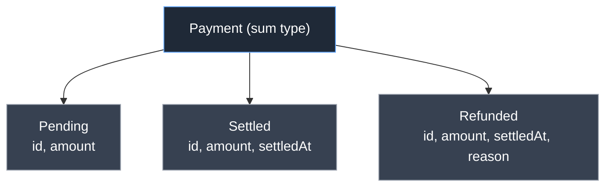
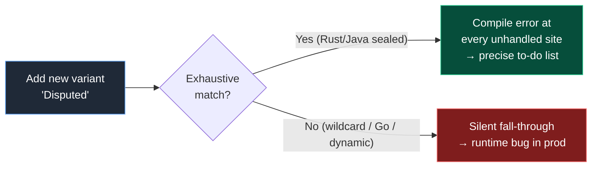

# Algebraic Data Types — Middle Level

> **Roadmap:** [Functional Programming](../README.md) → Algebraic Data Types
>
> *Essence: an ADT lets you say "a value is exactly **this OR that**" in a way the compiler can check. The payoff is not the syntax — it's that whole categories of bugs (null, forgotten cases, illegal combinations) stop being possible.*

---

## Table of Contents

1. [Introduction](#introduction)
2. [Prerequisites](#prerequisites)
3. [Modeling Domains with ADTs](#modeling-domains-with-adts)
4. [Option / Maybe over `null`](#option--maybe-over-null)
5. [Result / Either over Exceptions and Error Codes](#result--either-over-exceptions-and-error-codes)
6. [Exhaustive Matching — and Why It Matters](#exhaustive-matching--and-why-it-matters)
7. [Recursive ADTs: Trees, JSON, Expressions](#recursive-adts-trees-json-expressions)
8. [Per-Language Reality](#per-language-reality)
9. [Trade-offs](#trade-offs)
10. [Common Mistakes](#common-mistakes)
11. [Test Yourself](#test-yourself)
12. [Cheat Sheet](#cheat-sheet)
13. [Summary](#summary)
14. [Further Reading](#further-reading)
15. [Related Topics](#related-topics)

---

## Introduction

> Focus: **using ADTs well.** Not "what is a sum type" (that's [`junior.md`](junior.md)) but *how do I shape a real domain so the compiler enforces my rules?*

At the junior level you learned the two building blocks: **product types** ("a value has field A *and* field B" — a struct, a record, a tuple) and **sum types** ("a value is variant A *or* variant B" — an enum with data, a tagged union). Algebraic comes from the arithmetic: a product type has `|A| × |B|` possible values; a sum type has `|A| + |B|`.

The middle-level skill is *design*. The single most valuable habit ADTs give you is summed up in one phrase:

> **Make illegal states unrepresentable.**

If a payment can be `Pending`, `Settled`, or `Refunded`, and a `settledAt` timestamp only exists when settled, then a record with a nullable `settledAt` *lets you build a `Pending` payment that has a settle time* — an illegal state. An ADT where `Settled` carries the timestamp and `Pending` does not makes that bug **impossible to write**. The compiler becomes your domain expert.

This file shows how to wield that across four languages — **Java**, **Python**, **Rust**, and **Go** — that sit at very different points on the spectrum of ADT support, from "first-class with compiler-checked exhaustiveness" (Rust) to "no native sum type, only workarounds" (Go).

---

## Prerequisites

- **Required:** You can read [`junior.md`](junior.md) — you recognize product vs. sum types and basic pattern matching.
- **Required:** Comfort with at least two of Java, Python, Rust, Go.
- **Helpful:** [Pure Functions & Referential Transparency](../02-pure-functions-and-referential-transparency/middle.md) — ADTs pair naturally with pure, total functions.
- **Helpful:** [Immutability](../03-immutability/middle.md) — ADTs are almost always immutable values.
- **Helpful:** Awareness that `Option` and `Result` are the gateway to [Monads — Plain English](../09-monads-plain-english/middle.md); this file uses them as data, that one explains the chaining.

---

## Modeling Domains with ADTs

The design loop is: **enumerate the states a thing can be in, then give each state exactly the data it needs — no more, no less.**

Start from a common anti-shape: the "everything is nullable" record.

```java
// Java — the bag-of-nullables. Every illegal combination is representable.
record Payment(
    String id,
    Status status,           // PENDING | SETTLED | REFUNDED
    Instant settledAt,       // null unless SETTLED... supposedly
    String refundReason,     // null unless REFUNDED... supposedly
    BigDecimal amount
) {}
```

Nothing stops `status = PENDING` with a non-null `settledAt`, or `REFUNDED` with no `refundReason`. The invariants live in your head and in scattered `if` checks — exactly where bugs breed.

Re-modeled as a sum type, the data follows the state:

```java
// Java 21+ — sealed interface + records: each variant carries only its valid data.
sealed interface Payment permits Pending, Settled, Refunded {}

record Pending(String id, BigDecimal amount) implements Payment {}
record Settled(String id, BigDecimal amount, Instant settledAt) implements Payment {}
record Refunded(String id, BigDecimal amount, Instant settledAt, String reason) implements Payment {}
```

Now `settledAt` *cannot* exist on a `Pending`. A `Refunded` *must* have a reason — the type won't compile otherwise. You have moved invariants from runtime checks into the type, where they are enforced once, at construction.



**The design questions to ask, every time:**

1. *What are the distinct states?* → one variant each.
2. *What data is meaningful in each state?* → put it in that variant only.
3. *Can two of those fields ever be set at once illegally?* → if yes, you have product where you wanted sum; split the variants.
4. *Is there a "none of the above" / "not yet" state?* → that's a variant too (often `Option`-shaped), not a `null`.

> **Heuristic:** a record full of fields that are "only valid when some other field has a certain value" is a sum type wearing a product type's clothes. Split it.

---

## Option / Maybe over `null`

`null` is famously "the billion-dollar mistake" (Tony Hoare's own term) because it is **invisible in the type**. A `String` in Java might be a string, or it might be `null`, and nothing at the call site tells you which — so you find out at runtime, with an NPE, often far from the cause.

`Option<T>` (a.k.a. `Maybe`, `Optional`) is the sum type `Some(T) | None`. It makes absence **visible and explicit**: a function returning `Option<User>` is *announcing in its signature* that it might find nothing, and the compiler/IDE forces you to deal with that before you can touch the `User`.

```rust
// Rust — Option is in std; the type says "might be absent" out loud.
fn find_user(id: u64) -> Option<User> { /* ... */ }

let name = match find_user(7) {
    Some(u) => u.name,
    None    => "guest".to_string(),
};
// Or the idiomatic combinator form:
let name = find_user(7).map(|u| u.name).unwrap_or_else(|| "guest".into());
```

```python
# Python — no built-in Option; the pragmatic idiom is Optional[T] (= T | None)
# checked by a type checker (mypy/pyright), which refuses to let you skip the None case.
def find_user(uid: int) -> User | None: ...

u = find_user(7)
name = u.name if u is not None else "guest"   # type checker flags `u.name` without the guard
```

The key shift: **absence becomes a value you handle, not an exception you trip over.** And because `Option` is just data, you can `map`, `filter`, and chain it (see [Map / Filter / Reduce](../04-map-filter-reduce/middle.md)) instead of writing nested null checks.

| Language | "Maybe" tool | Compiler enforces handling? |
|---|---|---|
| Rust | `Option<T>` (std) | **Yes** — must match or unwrap explicitly |
| Java | `Optional<T>` (std) | No (it's a normal object; can still be misused) |
| Python | `T \| None` + type checker | Only if you run mypy/pyright in strict-ish mode |
| Go | usually `(T, bool)` or `(T, error)` | No — convention, not enforced |

> **Note on Java's `Optional`:** it was designed primarily as a **return type** for "maybe absent." Using it for fields or method parameters is widely considered misuse — it adds a wrapper without the compiler guarantees Rust's `Option` gives. Treat it as "a better return value," not a null replacement everywhere.

---

## Result / Either over Exceptions and Error Codes

The same idea applies to *failure*. Three common ways to signal "this might fail":

- **Error codes / sentinel returns** (`-1`, `nil`, `""`): easy to ignore, no payload explaining what went wrong.
- **Exceptions:** invisible in the signature (in most languages), they unwind the stack and can be caught far away — control flow you can't see.
- **`Result<T, E>` / `Either<E, T>`:** a sum type, `Ok(T) | Err(E)`. Failure is **a value with a type**, right there in the signature, that the caller must handle.

```rust
// Rust — Result makes the failure mode part of the contract.
enum ParseError { Empty, NotANumber(String) }

fn parse_qty(s: &str) -> Result<u32, ParseError> {
    if s.is_empty() { return Err(ParseError::Empty); }
    s.parse::<u32>().map_err(|_| ParseError::NotANumber(s.to_string()))
}

match parse_qty("12") {
    Ok(n)  => println!("got {n}"),
    Err(e) => eprintln!("bad input: {e:?}"),
}
```

The `?` operator then lets you propagate errors without the ceremony of nested `match`, which is why Rust code reads almost as cleanly as exception-based code while keeping the failure in the type. (The *chaining* mechanics — why `?`, `flatMap`, `and_then` all share a shape — are the subject of [Monads — Plain English](../09-monads-plain-english/middle.md).)

**`Either` vs `Result`.** `Either<L, R>` is the generic two-armed sum type (`Left | Right`); `Result` is `Either` with the convention "left/`Err` is failure, right/`Ok` is success." In FP-flavored Java/Scala libraries you'll see `Either<Error, Value>`; in Rust it's the built-in `Result<Value, Error>`.

```java
// Java — no built-in Result; a tiny sealed type gives you the same guarantees.
sealed interface Result<T, E> permits Ok, Err {}
record Ok<T, E>(T value) implements Result<T, E> {}
record Err<T, E>(E error) implements Result<T, E> {}

// Now the signature is honest: this can fail, and here's the error type.
Result<User, ValidationError> register(SignupForm form) { ... }
```

**When to still use exceptions.** ADT errors shine for *expected, recoverable* failures that are part of the domain (invalid input, not-found, business-rule violation). For *truly exceptional, unrecoverable* conditions (out of memory, programmer-bug invariant violations), an exception/`panic` is often the right call — you don't want every caller pattern-matching on "the disk caught fire." The line: **if the caller can sensibly do something about it, model it as a `Result`; if not, let it throw.**

---

## Exhaustive Matching — and Why It Matters

This is the feature that turns ADTs from "nicer structs" into a bug-prevention machine.

**Exhaustiveness** means: when you pattern-match on a sum type, the compiler verifies you've handled *every* variant. Miss one, and the code doesn't compile.

Why this matters more than it first appears: the real benefit is **future-proofing**. Today you handle `Pending`, `Settled`, `Refunded`. Six months later someone adds a `Disputed` variant. With exhaustive matching, **every `match` in the codebase that didn't account for `Disputed` now fails to compile** — the compiler hands you a precise to-do list of every place that needs updating. Without it, those sites silently fall through to a default and ship a bug.

```rust
// Rust — exhaustiveness is mandatory. Add a variant, and this stops compiling
// at every match that lacks the new arm. That is the feature, not an annoyance.
fn label(p: &Payment) -> &str {
    match p {
        Payment::Pending(_)  => "awaiting",
        Payment::Settled(_)  => "done",
        Payment::Refunded(_) => "reversed",
        // add Payment::Disputed and the compiler errors here until you handle it
    }
}
```

```java
// Java 21+ — switch over a sealed type is exhaustive: no `default` needed,
// and the compiler errors if a permitted subtype is unhandled.
String label(Payment p) {
    return switch (p) {
        case Pending pe  -> "awaiting";
        case Settled s   -> "done";
        case Refunded r  -> "reversed";
        // omit one -> compile error: "the switch ... does not cover all possible input values"
    };
}
```

```python
# Python 3.10+ — match is NOT exhaustive at compile time (the language has no
# such check). A type checker (mypy/pyright) CAN simulate it via an exhaustiveness
# guard using typing.assert_never:
from typing import assert_never

def label(p: Payment) -> str:
    match p:
        case Pending():  return "awaiting"
        case Settled():  return "done"
        case Refunded(): return "reversed"
        case _ as unreachable:
            assert_never(unreachable)   # type checker errors here if a case is missing
```

**The `default`/wildcard trap.** Writing a catch-all `default` (Java), `_ =>` (Rust), or `case _:` (Python) *defeats exhaustiveness* for new variants — the new case silently matches the wildcard. Use a wildcard only for variants you genuinely don't care about *and never will*. For a closed domain you expect to evolve, **list every case explicitly** so the compiler keeps protecting you.



---

## Recursive ADTs: Trees, JSON, Expressions

A sum type whose variants *contain the type itself* is **recursive** — and this is where ADTs model the structures that dominate real software: trees, parsed documents, and abstract syntax.

**A binary tree:**

```rust
// Rust — Box breaks the infinite-size recursion (heap indirection).
enum Tree {
    Leaf(i32),
    Node(Box<Tree>, Box<Tree>),
}

fn sum(t: &Tree) -> i32 {
    match t {
        Tree::Leaf(n)      => *n,
        Tree::Node(l, r)   => sum(l) + sum(r),   // recurse on sub-trees
    }
}
```

**JSON** — the canonical recursive ADT, because a JSON value is *defined in terms of itself* (an array of values, an object of string→value):

```rust
enum Json {
    Null,
    Bool(bool),
    Number(f64),
    Str(String),
    Array(Vec<Json>),            // recursive
    Object(HashMap<String, Json>), // recursive
}
```

**An expression tree** — the heart of every interpreter and calculator. Note how the *shape of the data* mirrors the *grammar*, and how the evaluator is a single exhaustive match that recurses:

```python
# Python — recursive ADT via dataclasses under a union alias.
from dataclasses import dataclass

@dataclass(frozen=True)
class Lit:  value: float
@dataclass(frozen=True)
class Add:  left: "Expr"; right: "Expr"
@dataclass(frozen=True)
class Mul:  left: "Expr"; right: "Expr"

Expr = Lit | Add | Mul          # the sum type

def eval(e: Expr) -> float:
    match e:
        case Lit(v):       return v
        case Add(l, r):    return eval(l) + eval(r)   # recurse
        case Mul(l, r):    return eval(l) * eval(r)
        case _:            assert_never(e)
```

The deep idea: **the recursion in the data structure drives the recursion in the function.** One match arm per variant, each arm recursing on the sub-parts, and the whole thing is total and exhaustive. This is the standard FP technique for processing any tree-shaped data — see [Recursion & Tail Calls](../08-recursion-and-tail-calls/middle.md) for the recursion mechanics.

---

## Per-Language Reality

The four languages differ enormously in how much the compiler helps you. Knowing where each sits prevents both false confidence and needless ceremony.

### Java (21+) — `sealed` + `record` + pattern `switch`

Modern Java has genuine ADTs. `sealed interface` (with `permits`) closes the variant set; `record` gives concise immutable products; `switch` over a sealed type is **exhaustiveness-checked** with record-deconstruction patterns.

```java
sealed interface Shape permits Circle, Rect {}
record Circle(double r) implements Shape {}
record Rect(double w, double h) implements Shape {}

double area(Shape s) {
    return switch (s) {
        case Circle(double r)      -> Math.PI * r * r;   // deconstructs the record
        case Rect(double w, double h) -> w * h;
        // exhaustive: no default, compiler verifies all permitted types covered
    };
}
```

*Reality check:* exhaustiveness only fires for `switch` over `sealed`/enum types, the data is nominally typed (more boilerplate than Rust), and `Optional` is weaker than Rust's `Option` (no enforced handling). Still, post-Java-21 this is real ADT modeling.

### Python (3.10+) — `match` + `Union`/`|`, checked *only* by a type checker

Python's `match` statement does **structural** pattern matching, and `X | Y` (or `Union[X, Y]`) expresses sum types. But Python is dynamic: **the language enforces nothing at compile time.** A missing case just falls through (returning `None` from a function). You get exhaustiveness *only* by running **mypy or pyright** and using the `assert_never` pattern shown above. `@dataclass(frozen=True)` provides immutable products; `enum.Enum` covers data-free sums.

*Reality check:* powerful and ergonomic, but the safety is opt-in tooling, not the runtime. Without a type checker in CI, "exhaustive matching" is a convention you hope everyone follows.

### Rust — `enum` + `match`, the gold standard

Rust's `enum` is a true sum type carrying per-variant data; `match` is exhaustive **by the language itself** (no extra tooling); `Option<T>` and `Result<T, E>` are in the standard library and woven through the ecosystem. `Box`/`Rc` handle recursive types. This is the reference implementation of ADTs in a mainstream systems language.

```rust
enum Shape { Circle { r: f64 }, Rect { w: f64, h: f64 } }

fn area(s: &Shape) -> f64 {
    match s {
        Shape::Circle { r }    => std::f64::consts::PI * r * r,
        Shape::Rect { w, h }   => w * h,
    }   // exhaustive, enforced by the compiler — no escape hatch needed
}
```

### Go — no native sum types; workarounds and their limits

Go has **no sum type and no exhaustiveness checking.** You simulate tagged unions, and every approach leaks:

1. **Interface + concrete types** (most idiomatic). A `type switch` dispatches — but **nothing forces you to handle every implementer**, and any type can satisfy an open interface.

```go
type Shape interface{ isShape() }      // "sealed-ish" via an unexported marker method

type Circle struct{ R float64 }
type Rect   struct{ W, H float64 }
func (Circle) isShape() {}
func (Rect)   isShape() {}

func area(s Shape) float64 {
    switch v := s.(type) {
    case Circle: return math.Pi * v.R * v.R
    case Rect:   return v.W * v.H
    default:     panic("unhandled shape")   // the gap: caught at RUNTIME, not compile time
    }
}
```

2. **Struct with a tag + nullable fields** (the bag-of-nullables again) — illegal states fully representable.
3. **`any` / empty interface** — maximally loose, no help at all.

The unexported-marker-method trick (`isShape()`) approximates "sealed" by preventing outside packages from adding variants, but **it gives you no exhaustiveness** — add a `Triangle`, and the existing `type switch` compiles fine and `panic`s at runtime. Linters like `go-check-sumtype` / `exhaustive` can flag missing cases, but that's external tooling bolted on, not a language guarantee.

*Reality check:* Go deliberately favors simplicity over this kind of type-level expressiveness. You can model domains with interfaces, but the "make illegal states unrepresentable + compiler-checked exhaustiveness" payoff is largely unavailable. Plan for runtime checks and lint enforcement.

| Capability | Java 21+ | Python 3.10+ | Rust | Go |
|---|---|---|---|---|
| Native sum type | `sealed` + records | `Union` / `\|` | `enum` | ✗ (interface workaround) |
| Immutable product | `record` | `@dataclass(frozen)` | `struct` | `struct` (no enforcement) |
| Pattern matching | `switch` patterns | `match` | `match` | `type switch` |
| **Exhaustiveness checked** | **by compiler** | by mypy/pyright only | **by compiler** | by linter only |
| Built-in Option | `Optional` (weak) | `T \| None` | **`Option<T>`** | `(T, bool)` |
| Built-in Result | ✗ (roll your own) | ✗ | **`Result<T,E>`** | `(T, error)` |

---

## Trade-offs

ADTs are not free, and they are not always the right tool.

- **Closed vs. open extension (the "expression problem").** A sum type makes it *easy to add operations* (write a new function with a match) but *hard to add variants* (every match must change). Class hierarchies / interfaces are the opposite: easy to add a new type, hard to add an operation across all types. Choose based on which axis changes more. If new *variants* arrive constantly from outside your control, an open interface (polymorphism) may fit better than a sealed sum. See [Functional vs OO in Practice](../11-functional-vs-oo-in-practice/middle.md).
- **Verbosity.** Splitting a nullable record into five variants is more upfront code than one bag-of-fields struct. The trade buys compiler-enforced correctness; for a throwaway script it may not be worth it.
- **Boilerplate by language.** In Rust this is ergonomic; in Java it's wordier (sealed + records + switch); in Go it's a genuine fight against the language. Weigh the ceremony against the safety you actually gain — a Go "sum type" without exhaustiveness gives you much of the cost and little of the benefit.
- **Performance.** Sum types often need an indirection (a tag + a pointer/box for the payload). Rust's enums are usually a flat tagged union (cheap); JVM/Python variants are heap objects. Rarely a bottleneck, but worth knowing in hot paths.
- **Serialization.** Recursive/tagged ADTs need a tagging convention on the wire (a `"type"` discriminator field). This is solvable but is real design work at API boundaries.

> **Rule of thumb:** reach for ADTs when correctness matters and the state space is *closed and well-understood* (payments, parse trees, protocol messages). Lean toward open polymorphism when *new kinds of things* arrive faster than *new operations on them*.

---

## Common Mistakes

1. **Bag-of-nullables instead of a sum type.** A record where half the fields are "only valid in some states" is a sum type in disguise. Split it so each variant carries only valid data.
2. **Wildcard arms that swallow new variants.** A `default` / `_ =>` / `case _:` that you treat as "handle the rest" silently absorbs future variants and reintroduces the very bug exhaustiveness prevents. Use wildcards sparingly and deliberately.
3. **Using `Optional` as a field or parameter (Java).** It's meant as a return type. As a field it's just a nullable with extra wrapping and worse ergonomics.
4. **Returning `null` *inside* an `Option`/`Optional`.** `Optional<User>` that can itself be `null`, or `Some(null)`, defeats the entire point. The wrapper *is* the absence; don't nest nulls inside it.
5. **Throwing for domain failures that callers can handle.** "User not found" or "invalid email" are expected outcomes — model them as `Result`/`Either`, not exceptions, so the signature is honest and callers can't ignore them.
6. **Assuming Python `match` is exhaustive.** It isn't — at runtime a missing case just falls through. Add an `assert_never` arm *and* run a type checker in CI, or you have no guarantee.
7. **Faking sum types in Go and expecting compiler safety.** The interface/marker-method pattern does not give exhaustiveness. Either add a `panic` default *and* a `go-check-sumtype` lint, or accept that the gap is real.
8. **Forgetting immutability.** ADTs are values; if your "variant" is a mutable object whose state can change after construction, you've reopened the door to illegal states. Make them immutable (`frozen`, `final`, `record`, Rust's move semantics).

---

## Test Yourself

1. You have `class Order { Status status; Instant shippedAt; String cancelReason; }` where `shippedAt` is only set when `SHIPPED` and `cancelReason` only when `CANCELLED`. What's wrong, and how do you re-model it?
2. A teammate says "exhaustiveness checking is annoying — it makes me touch ten files when I add a variant." Why is that touching *the point*, not the problem?
3. Why is `Optional<User>` strictly better than returning a possibly-`null` `User`, in terms of the *type signature*?
4. When should a failure be a `Result`/`Either` value, and when is an exception/`panic` the right call?
5. In Python, you wrote a `match` over a 4-variant union but handled only 3 cases. Does the program compile? Does it crash? How do you make the *tooling* catch the missing case?
6. Why does Go's unexported-marker-method "sealed interface" trick *not* give you exhaustiveness, and what do you do about the gap?
7. For a recursive `Expr = Lit | Add | Mul`, why does the evaluator naturally have one match arm per variant with recursion in the `Add`/`Mul` arms?

<details>
<summary>Answers</summary>

1. It's a **bag-of-nullables**: illegal states like `PENDING` with a non-null `shippedAt` are representable. Re-model as a sum type — `sealed interface Order permits Pending, Shipped, Cancelled`, where `Shipped` carries `shippedAt` and `Cancelled` carries `cancelReason`, and `Pending` carries neither. The invariant becomes unrepresentable.
2. Touching ten files is the compiler handing you a **precise, complete to-do list** of every place affected by the new variant. The alternative isn't "touch fewer files" — it's "miss some of those ten and ship a silent runtime bug." Exhaustiveness converts a hidden risk into a visible, mechanical task.
3. `Optional<User>` *announces in the signature* that the result may be absent, forcing the caller to acknowledge it before accessing the `User`. A bare `User` that might be `null` hides the absence — the type lies, and you discover the truth at runtime via an NPE.
4. `Result`/`Either` when the failure is **expected and the caller can sensibly recover** (invalid input, not-found, business rule) — it belongs in the domain and the signature. Exception/`panic` when the condition is **truly exceptional / unrecoverable** (OOM, broken invariant, programmer bug) where forcing every caller to handle it adds noise without value.
5. It **compiles** (Python has no compile-time exhaustiveness) and at runtime the unmatched case simply **falls through** — e.g. the function returns `None` silently, no crash, a lurking bug. Make tooling catch it by adding a `case _ as x: assert_never(x)` arm and running **mypy/pyright** in CI, which then errors on the unhandled variant.
6. The marker method only prevents *outside packages* from adding variants; it does **nothing** to force a `type switch` to handle every implementer. Adding a new variant leaves existing switches compiling and `panic`-ing (or silently hitting `default`) at runtime. Mitigate with a `default: panic(...)` *and* a lint like `go-check-sumtype`/`exhaustive` in CI — external tooling, since the language won't.
7. Because the recursion in the **data** drives the recursion in the **function**: `Lit` is a base case (return the value), while `Add`/`Mul` contain sub-`Expr`s, so each arm evaluates its children recursively and combines them. One arm per variant keeps the function total and exhaustive.

</details>

---

## Cheat Sheet

| Goal | Do this | Not this |
|---|---|---|
| Model distinct states | Sum type, data per variant | One struct with nullable fields |
| Express "might be absent" | `Option`/`Optional`/`T \| None` | Return `null` |
| Express "might fail" | `Result`/`Either` value | Sentinel codes; exceptions for expected errors |
| Process all variants safely | Explicit, exhaustive match | Wildcard `default`/`_` that hides new cases |
| Tree-shaped data | Recursive ADT, recurse per arm | Hand-rolled visitor with casts |
| Keep invariants | Immutable variants | Mutable objects you can mutate into illegal states |

**Exhaustiveness by language:** Rust ✅ compiler · Java ✅ compiler (sealed/enum `switch`) · Python ⚠️ mypy/pyright + `assert_never` only · Go ❌ runtime/lint only.

**One mantra:** *Make illegal states unrepresentable; let the compiler enumerate the cases for you.*

---

## Summary

- An ADT lets you say a value is **exactly this OR that** (sum) and **has these fields together** (product). The middle-level payoff is **making illegal states unrepresentable** — moving invariants from runtime checks into the type.
- Replace nullable-bag records with **sum types** where each variant carries only its valid data. Replace `null` with **`Option`/`Maybe`** and error codes/exceptions-for-expected-failures with **`Result`/`Either`** — absence and failure become *visible values* the caller must handle.
- **Exhaustive matching is the killer feature:** when a variant is added, every match that doesn't handle it fails to compile, giving you a precise to-do list instead of a silent bug. Wildcards defeat this — use them sparingly.
- **Recursive ADTs** model trees, JSON, and expression grammars; the recursion in the data drives one-arm-per-variant recursion in the function.
- **Language reality:** Rust is the gold standard (built-in, compiler-enforced). Java 21+ is genuine ADTs via `sealed`+`record`+`switch`. Python has the syntax but enforcement is opt-in tooling. Go has no sum types — only leaky workarounds without exhaustiveness.
- **Trade-offs:** ADTs make adding *operations* easy and adding *variants* invasive (the expression problem); they cost verbosity and serialization design. Reach for them when the state space is closed and correctness matters.
- Next: these `Option`/`Result` types chain together by a common shape — that's [Monads — Plain English](../09-monads-plain-english/middle.md).

---

## Further Reading

- **Programming with Types** — Vlad Riscutia (2019) — "make illegal states unrepresentable" worked through in practical type design.
- **Domain Modeling Made Functional** — Scott Wlaschin (2018) — the definitive treatment of modeling domains with sum/product types and `Result`.
- **The Rust Programming Language** ("the book") — chapters on `enum`, `match`, `Option`, `Result`, and recursive types with `Box`.
- **JEP 441 / 440** — Java's *Pattern Matching for switch* and *Record Patterns* — the spec behind exhaustive sealed `switch`.
- **PEP 634–636** — Python's *Structural Pattern Matching* — the `match` statement and its (non-)exhaustiveness.
- **Null References: The Billion Dollar Mistake** — Tony Hoare (2009 talk) — why `null` in the type system is the problem `Option` solves.

---

## Related Topics

- [Pure Functions & Referential Transparency](../02-pure-functions-and-referential-transparency/middle.md) — total, exhaustive functions over ADTs are the cleanest pure functions.
- [Immutability](../03-immutability/middle.md) — ADTs are values; immutability is what keeps illegal states out after construction.
- [Map / Filter / Reduce](../04-map-filter-reduce/middle.md) — `Option`/`Result` are mappable; chaining them avoids nested checks.
- [Recursion & Tail Calls](../08-recursion-and-tail-calls/middle.md) — the recursion that processes recursive ADTs.
- [Monads — Plain English](../09-monads-plain-english/middle.md) — why `Option`, `Result`, and friends all chain the same way.
- [Functional vs OO in Practice](../11-functional-vs-oo-in-practice/middle.md) — sum types vs. polymorphism and the expression problem.
