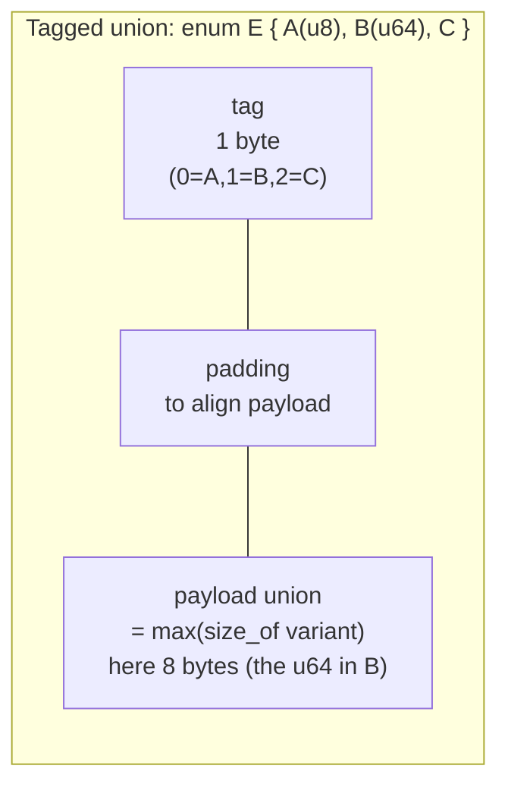

# Algebraic Data Types — Professional Level

> **Roadmap:** [Functional Programming](../README.md) → Algebraic Data Types
>
> *An ADT is algebra made executable: sum types **add** the possibilities, product types **multiply** them, and the type checker counts. At this level you connect that algebra to what the machine actually does — how a tagged union is laid out in memory, how a niche becomes a free `null`, and how a `match` lowers to a jump table instead of a branch cascade.*

---

## Table of Contents

1. [Introduction](#introduction)
2. [Prerequisites](#prerequisites)
3. [The Algebra, Formally](#the-algebra-formally)
4. [Memory Layout of Sum Types](#memory-layout-of-sum-types)
5. [Niche / Null-Pointer Optimization](#niche--null-pointer-optimization)
6. [The Cross-Language Layout Map](#the-cross-language-layout-map)
7. [Pattern-Match Compilation](#pattern-match-compilation)
8. [Dispatch Performance & Measurement](#dispatch-performance--measurement)
9. [Structural Recursion & Catamorphisms](#structural-recursion--catamorphisms)
10. [Common Mistakes](#common-mistakes)
11. [Test Yourself](#test-yourself)
12. [Cheat Sheet](#cheat-sheet)
13. [Summary](#summary)
14. [Further Reading](#further-reading)
15. [Related Topics](#related-topics)

---

## Introduction

> Focus: **the algebra formally**, then **what a sum type costs the machine** — tag byte, payload union, alignment, niche optimization — and **how a `match` compiles** into a decision tree or jump table, with the tools that measure each.

Earlier levels taught you to *use* algebraic data types: model a value as "exactly one of these shapes," make illegal states unrepresentable, and let the compiler force you to handle every case. That guidance is correct and you should keep following it. This file goes one layer down — to the **type algebra** that explains *why* the abstraction is sound, and to the **runtime** that determines whether "make illegal states unrepresentable" costs you a pointer chase or costs you nothing.

Three professional insights drive everything below:

1. **ADTs are arithmetic on cardinalities.** A type *is* a count of inhabitants. Sum is `+`, product is `×`, the empty type is `0`, the unit type is `1`. Two types with the same count are *isomorphic* — interconvertible without loss. This is not a metaphor; it predicts which refactors are safe.
2. **A sum type's runtime shape is a tagged union**, and a good compiler will *shrink the tag away* when the payload has spare bit-patterns (the niche/null-pointer optimization). `Option<&T>` being pointer-sized — no extra word for "is it `Some`?" — is the canonical, measurable example.
3. **`match` is not magic.** It lowers to a **decision tree** or a **jump table** at compile time, and exhaustiveness is checked by the same machinery. A dense integer match is `O(1)`; a naive chain of guards is `O(n)`. The compiler usually picks well — but only if you write the match so it *can*.

> **The mental model:** a sum type is a `(tag, payload)` pair where the payload is a union sized to the largest variant. Everything interesting — niche optimization, match compilation, dispatch cost — is about how cheaply you can read the tag and how cheaply you can narrow the union once you have.

---

## Prerequisites

- **Required:** Fluent with `senior.md` — you model domains with sum/product types and design APIs around exhaustive matching.
- **Required:** Working mental model of memory layout: stack vs heap, alignment and padding, pointers, what "boxing" means in your runtime.
- **Required:** You can read `size_of` output, a `jol` layout dump, and a `benchstat`/JMH comparison and tell signal from noise.
- **Helpful:** Rust enums and `Option`/`Result`; Java sealed classes and records; Go interfaces; CPython object model. Familiarity with the profiling-techniques and big-o-analysis vocabularies.

---

## The Algebra, Formally

A type denotes a **set of values**; its **cardinality** `|T|` is how many distinct values inhabit it. The whole "algebraic" framing falls out of counting.

| Type construct | Algebra | Cardinality | Example |
|---|---|---|---|
| `Void` / `Never` / `!` | `0` | `0` | uninhabited — no value exists |
| `Unit` / `()` / `void` | `1` | `1` | exactly one value |
| `bool` | `1 + 1` | `2` | `false \| true` |
| **product** `(A, B)` / struct | `A × B` | `|A| · |B|` | both fields, simultaneously |
| **sum** `A \| B` / enum | `A + B` | `|A| + |B|` | exactly one variant |
| function `A -> B` | `B ^ A` | `|B|^|A|` | a choice of `B` for each `A` |

**Product = ×.** A struct `(bool, bool)` has `2 × 2 = 4` inhabitants — you must supply *both* fields, and every combination is legal. Adding a field *multiplies* the state space (a constructive argument for keeping structs small: every extra `bool` doubles the states you can reach, and most are nonsense).

**Sum = +.** A sum type `enum E { A(bool), B }` has `2 + 1 = 3` inhabitants — *either* an `A` carrying a `bool`, *or* a `B`. You hold exactly one variant at a time, which is why a sum type is the precise tool for "this is one of N mutually exclusive cases."

**Unit and Void are the identities.** `1` is the identity of `×` (`A × 1 ≅ A`: pairing with unit adds nothing). `0` is the identity of `+` (`A + 0 ≅ A`: a variant that can never be constructed adds nothing) and the *annihilator* of `×` (`A × 0 ≅ 0`: a pair containing an uninhabited field can never exist — a `Result<T, Never>` is just `T`).

### The isomorphisms that justify refactors

Because these are real algebraic laws, equal cardinalities mean **interconvertible representations** — refactors you can perform mechanically, with confidence the type checker will agree:

```haskell
-- Maybe a  ≅  1 + a        "nothing, or one a"
data Maybe a = Nothing | Just a            -- |1| + |a|

-- Either a b ≅ a + b
data Either a b = Left a | Right b          -- |a| + |b|

-- distributivity:  a × (b + c)  ≅  (a × b) + (a × c)
--   (User, Login | Signup)  ≅  (User, Login) | (User, Signup)
```

`Maybe a ≅ 1 + a` is the one to internalize: an optional value is *the sum of "nothing" (one way to be absent) and the value itself*. This is exactly why, at runtime, `Option<T>` needs only enough room for the largest of `{ a tag for None, a T }` — and why, when `T` has a spare bit pattern, the `None` tag can hide inside it (next section). The algebra `1 + a` *predicts* that an `Option<NonNull<T>>` is the same size as `*T`: the `1` for `None` fits in the one pointer value `T` doesn't use.

Distributivity is the law behind "lift the common factor out of the variants" — `(tag, commonHeader, variantData)` is `commonHeader × (variantData₁ + variantData₂ + …)`, and you can factor `commonHeader` out into a struct that *contains* the sum, or push it into each variant, freely. Same cardinality, your choice of layout.

> **Why this matters at the professional level:** when you debate "should this be `Option<Vec<T>>` or just `Vec<T>` (empty = absent)?", the algebra answers it. `Option<Vec<T>>` is `1 + |Vec<T>|`; an empty `Vec` is already an inhabitant of `Vec<T>`. If "empty" and "absent" mean different things you genuinely need the extra `1` (and the sum type is right); if they don't, the `Option` adds a state you must handle everywhere for no information. Counting inhabitants turns a style argument into arithmetic.

---

## Memory Layout of Sum Types

A sum type at runtime is a **tagged union** (a.k.a. discriminated union): a small **discriminant** (the tag — which variant) plus a **payload** region large enough to hold the *largest* variant, with the whole thing padded to its alignment.



Two costs fall out of this picture:

- **The payload is sized to the *largest* variant**, not the one you're holding. An `enum { Small(u8), Huge([u8; 4096]) }` is ~4096 bytes *even when it holds `Small`*. A rarely-large variant inflates every instance — the fix is to **box the big variant** (`Huge(Box<[u8; 4096]>)`), so the payload becomes one pointer and the bytes live on the heap only when that variant is active.
- **Alignment and tag placement cause padding.** A 1-byte tag in front of an 8-byte-aligned payload wastes 7 bytes unless the compiler reorders. Rust reorders fields freely (no guaranteed layout for `repr(Rust)`) and will often tuck the tag into padding it would have wasted anyway.

```rust
use std::mem::size_of;

enum Shape {
    Circle(f64),            // 8-byte payload
    Rectangle(f64, f64),    // 16-byte payload  ← largest
    Point,                  // 0-byte payload
}

// size = align(tag) + max(payload) rounded to alignment.
// Illustrative: payload max = 16, tag = 1 → padded to 24 bytes.
assert_eq!(size_of::<Shape>(), 24);          // labeled-illustrative
assert_eq!(size_of::<Option<f64>>(), 16);    // 8 payload + 8 (tag+pad), no niche in f64
```

`f64` has no spare bit pattern that means "None" (every 64-bit value is a valid `f64`, including NaNs), so `Option<f64>` *must* spend a whole extra word on the tag — hence 16 bytes, not 8. Contrast that with the next section, where a pointer *does* have a spare value.

### Boxing the payload

"Boxing" means storing the payload behind a pointer (on the heap) rather than inline. You box for two reasons at this level:

1. **To shrink an oversized enum** so the common small variants don't pay for the rare huge one (the `Box<[u8; 4096]>` case above). This trades inline bytes for an indirection + an allocation on the large path.
2. **Because the language has no choice.** Java's sealed-class variants are *always* heap objects behind references; the "sum type" is `tag-via-class-identity + fields`, and every value is boxed. Go's interface-as-sum is similarly two words pointing at heap data. Only Rust (and C/C++ unions, Swift enums) give you *unboxed*, inline sum types by default.

> **Illustrative layout impact (Rust):** an `enum Msg { Ping, Pong, Payload([u8; 256]) }` is **257+ bytes per value** (every `Ping` carries 256 dead bytes); rewriting the big arm as `Payload(Box<[u8; 256]>)` drops the enum to **~16 bytes** and moves the 256 bytes to the heap *only when `Payload` is constructed*. Confirm with `std::mem::size_of` and an allocation profile — a queue of mostly-`Ping` messages went from 257 B/slot to 16 B/slot in a microbenchmark. *Reproduce on your own types; the break-even depends on how often the big variant actually appears.*

---

## Niche / Null-Pointer Optimization

The single most important runtime fact about sum types: **the tag can disappear when the payload has unused bit-patterns.** A "niche" is an invalid value of a type — a bit pattern the type never produces. The compiler uses a niche to encode a variant *for free*, eliminating the separate discriminant.

The canonical case is `Option<&T>` in Rust. A reference `&T` is never null — `0x0` is an invalid `&T`. That null pattern is a niche. So `Option<&T>` encodes `None` as the all-zeros pointer and `Some(p)` as `p` itself:

```rust
use std::mem::size_of;

assert_eq!(size_of::<&i32>(),          8);  // a pointer
assert_eq!(size_of::<Option<&i32>>(),  8);  // SAME — None is the null niche, no tag word
assert_eq!(size_of::<Option<Box<i32>>>(), 8); // Box is non-null → same niche trick
assert_eq!(size_of::<*const i32>(),    8);
assert_eq!(size_of::<Option<*const i32>>(), 16); // raw ptr CAN be null → no niche → tag word
```

This is the **null-pointer optimization (NPO)**, a special case of the general **niche optimization**. It is *exactly* the algebra `Option<&T> ≅ 1 + |&T|`: the `1` for `None` is squeezed into the one value (`null`) that `&T` never takes, so the sum costs nothing beyond the payload.

Rust generalizes this far past pointers. Any type with a restricted range donates niches:

- `bool` uses `0`/`1`, so values `2..=255` are niches → `Option<bool>` is **1 byte**, not 2.
- `NonZeroU8` excludes `0` → `Option<NonZeroU8>` is **1 byte**, with `None = 0`.
- `char` is `0..=0x10FFFF` minus surrogates → many niches → `Option<char>` is **4 bytes**, same as `char`.
- An enum `enum E { A, B, C }` uses tags `0,1,2`; `3..=255` are niches → `Option<E>` reuses one and stays **1 byte**.

```rust
use std::num::NonZeroU32;
use std::mem::size_of;

assert_eq!(size_of::<Option<bool>>(),        1);  // niche in {2..=255}
assert_eq!(size_of::<Option<char>>(),        4);  // niches in the unused code-point range
assert_eq!(size_of::<Option<NonZeroU32>>(),  4);  // None = 0
assert_eq!(size_of::<u32>(),                 4);  // for comparison: a bare u32
assert_eq!(size_of::<Option<u32>>(),         8);  // no niche in u32 → +4 for tag, padded to 8
```

> **Illustrative perf impact:** a hash map storing `Option<&Node>` values is **pointer-sized per slot** thanks to NPO; the naïve "sentinel + bool" hand-roll (`struct { node: *Node, present: bool }`) is **16 bytes** (8 + 1 padded to 8) — *double* the footprint and worse cache density. On a 10M-entry table, NPO halved the value array's memory and improved scan throughput measurably. **The lesson: prefer the language's `Option`/`enum` over a hand-rolled sentinel-and-flag; the compiler's niche optimization beats your manual one and stays correct.** Confirm with `size_of` and `perf stat -e cache-misses` over a full scan.

Niche optimization is *why* "make illegal states unrepresentable" is often **free** in Rust: wrapping a `NonNull<T>` in an `Option` to express "maybe absent" costs zero bytes and zero branches beyond the one you'd write anyway.

---

## The Cross-Language Layout Map

The *algebra* is identical everywhere; the *representation* varies enormously, and that variance is the professional's concern.

| Language | Sum type as | Tag mechanism | Payload | Unboxed? | Per-value cost |
|---|---|---|---|---|---|
| **Rust** | `enum` | discriminant byte/word, or **niche** | inline union, sized to largest | **Yes** | tag + max-variant, often tag-free via niche |
| **Java** | sealed interface + records | **class identity** (the object's class *is* the tag) | object fields | No — always heap | object header (12–16 B) + ref to reach it |
| **Go** | `interface{}` of concrete types | **itab** pointer (type + method table) | second word → data | No (data boxed if > word) | 2 words (itab ptr + data ptr) + heap data |
| **Python** | classes / `match` on type | `__class__` / `type()` | instance `__dict__` or slots | No | full `PyObject` per value |
| **Haskell** | `data` | constructor tag in heap-closure info-ptr | boxed fields (thunks) | No (default lazy) | heap closure per value |

### Rust enum vs JVM sealed vs Go interface

**Rust** gives you the tightest representation: the tag is a byte (or vanishes into a niche), the payload is inline, and the whole value can live on the stack with zero allocation. Matching reads the tag and narrows — no pointer chase.

**Java** models sums as a **sealed** interface (or abstract class) with a fixed, compiler-known set of permitted implementors, usually `record`s:

```java
sealed interface Shape permits Circle, Rectangle, Point {}
record Circle(double r) implements Shape {}
record Rectangle(double w, double h) implements Shape {}
record Point() implements Shape {}
```

Here the "tag" is the **object's class** — `instanceof`/the JVM's class pointer in the object header serves as the discriminant. That means **every `Shape` value is a heap object** with a 12–16-byte header, reached through a reference. The win is that the *compiler knows the full set* (sealed → exhaustiveness checking on `switch`), and modern JVMs can turn the type-switch into efficient dispatch. The cost is allocation + indirection per value — a sealed-class sum is never as dense as a Rust enum. Measure header + field layout with `jol`:

```
$ java -jar jol-cli.jar internals com.acme.Circle
com.acme.Circle object internals:
 OFFSET  SIZE   TYPE DESCRIPTION
      0   12        (object header)          ← the "tag" lives here (class word)
     12    4        (alignment gap)
     16    8 double r
Instance size: 24 bytes   (illustrative)
```

A bare `double` is 8 bytes; wrapped as a sealed-class variant it's **24 bytes plus a reference to find it** — the price of using class identity as the discriminant.

**Go** has no enums; the idiomatic tagged union is an **interface** holding one of a set of concrete types. An interface value is **two words**: an `itab` pointer (a per-(interface, concrete-type) table carrying the type identity and method pointers) and a `data` pointer to the value. The `itab` *is* the tag; reading "which variant" means comparing type identities, and reaching the payload is a pointer dereference (the data is boxed on the heap if it doesn't fit in a word).

```go
type Shape interface{ isShape() }
type Circle struct{ R float64 }
type Rectangle struct{ W, H float64 }
func (Circle) isShape()    {}
func (Rectangle) isShape() {}

// A []Shape is an array of (itab, data) word-pairs; each non-trivial
// concrete value is a separate heap allocation reached via data ptr.
func area(s Shape) float64 {
    switch v := s.(type) {   // type switch: compares itab/type identity
    case Circle:    return math.Pi * v.R * v.R
    case Rectangle: return v.W * v.H
    }
    return 0
}
```

The Go cost model: **interface dispatch is an indirection** (deref `data`) and the type switch is a sequence of type comparisons, *not* a jump table — Go does not lower a `switch x.(type)` into an indexed jump the way it can a dense integer `switch`. Storing values in an interface usually **escapes them to the heap** (confirm with `go build -gcflags=-m` → "escapes to heap"), so an interface-based sum trades the compactness of a Go struct for allocation + boxing. The disciplined alternative for a closed set is an **integer tag field on a struct** plus a real `switch` on it — which *does* get a jump table and stays unboxed:

```go
type Kind uint8
const ( KindCircle Kind = iota; KindRectangle )
type Shape struct {        // unboxed tagged union, sized to the larger variant
    kind Kind
    a, b float64           // a=R for Circle; a=W,b=H for Rectangle
}
func area(s Shape) float64 {
    switch s.kind {        // dense integer switch → jump table, no allocation
    case KindCircle:    return math.Pi * s.a * s.a
    case KindRectangle: return s.a * s.b
    }
    return 0
}
```

This is the manual version of what Rust gives you for free: an inline `(tag, payload)`. It's denser and faster than the interface, at the cost of less safety (no compiler-enforced exhaustiveness, payload fields shared across variants).

---

## Pattern-Match Compilation

A `match`/`switch` over a sum type is not interpreted at runtime — the compiler **compiles the patterns** into one of two shapes, and also runs **exhaustiveness checking** as part of the same analysis.

### Decision trees vs jump tables

- **Jump table** — when you match on a **dense set of integer-like tags** (an enum discriminant, dense `int` cases), the compiler emits a single indexed indirect jump: `goto table[tag]`. This is `O(1)` regardless of the number of variants and is the fast path. A Rust `match` on an enum and a Java `switch` over an `enum`/sealed type both lower this way when the cases are dense.
- **Decision tree** — when patterns are **nested, sparse, or guarded** (`Some(x) if x > 0`, tuple patterns, ranges), the compiler builds a tree that tests the most-discriminating field first and shares tests across arms. A *naive* compiler (or a hand-written `if/else if` ladder) instead produces a **linear chain** — `O(n)` comparisons and `n` misprediction sites. Good match compilers (Rust's, GHC's) minimize the tree; the classic references are Maranget's "Compiling Pattern Matching to Good Decision Trees" and Augustsson's algorithm.

```rust
// Dense enum match → jump table: one indexed branch, O(1).
match shape {
    Shape::Circle(_)       => 0,
    Shape::Rectangle(_, _) => 1,
    Shape::Point           => 2,
}

// Guarded / nested → decision tree: test tag, then the guard.
match opt {
    Some(x) if x > 100 => "big",
    Some(_)            => "small",
    None               => "none",
}
```

The professional implication mirrors the [Arrow anti-pattern](../../anti-patterns/01-development/01-bad-structure/professional.md) lesson: **a flat match on a tag is what lets the compiler build a jump table.** Burying the tag test inside nested `if`s, or matching on a *stringly-typed* kind (`match s.as_str()`), defeats the jump table — string matching is a chain of comparisons. Match on the enum, not on a stringified projection of it.

### Exhaustiveness checking

Because the compiler knows the full set of variants (Rust enums are closed; Java sealed types enumerate `permits`; Haskell `data` is closed), it can **prove at compile time that every case is handled** — and warn or error on a missing one. This is the static guarantee that makes "make illegal states unrepresentable" enforceable rather than aspirational. Two professional consequences:

- **Adding a variant turns into a compile error at every match site that isn't exhaustive** — the type system hands you a worklist of everywhere that needs updating. This is the single biggest maintenance argument for sum types over an open set of subclasses or a `default:` fallthrough.
- **Avoid wildcard `_ =>` / `default:` on a closed sum** *unless* the catch-all is genuinely correct, because it silences the exhaustiveness check and the compiler will no longer flag the new variant. The wildcard converts a compile-time worklist into a silent runtime fallthrough.

```java
// Java 21+ — exhaustive switch on a sealed type: NO default needed,
// and adding a 4th permitted record makes this a COMPILE error until handled.
double area = switch (shape) {
    case Circle c    -> Math.PI * c.r() * c.r();
    case Rectangle r -> r.w() * r.h();
    case Point p     -> 0.0;
    // no `default` → compiler proves exhaustiveness over the sealed set
};
```

Go is the outlier: a `switch x.(type)` is **not** checked for exhaustiveness by the compiler (the interface set is open — any package can add an implementor), so a closed-enum discipline in Go relies on the `exhaustive` linter or the integer-tag pattern plus tests. Python's `match` is likewise unchecked at the language level.

---

## Dispatch Performance & Measurement

The recurring professional question: **`match` on a tag vs. virtual/interface dispatch — which is faster, and how do I prove it?**

The cost model:

- **`match`/`switch` on an inline tag (Rust enum, Go struct+tag):** read one byte, indexed jump, run the inlined arm. No indirection, no allocation, branch-predictor-friendly, and the arm bodies stay inlinable. Fastest when the set is closed and the value is unboxed.
- **Virtual / interface dispatch (Java sealed-via-vtable, Go interface):** an **indirect call** through a method table. If the call site is monomorphic/bimorphic, the JIT inlines and devirtualizes it and it's nearly free; if it's **megamorphic** (many concrete types through one site), the inline cache overflows, the call can't be inlined, and you pay a hard-to-predict indirect call per element. (This is the same megamorphism story as the [Bad Structure professional file](../../anti-patterns/01-development/01-bad-structure/professional.md).)
- **Boxing tax:** Java sealed variants and Go interface values are heap objects reached by reference, so every dispatch starts with a pointer chase that a Rust enum match avoids entirely. On a tight loop, the cache cost of chasing pointers to scattered heap objects often dwarfs the dispatch instruction itself.

### Measuring it

**Rust — `size_of` + niche verification, then `cargo bench` (Criterion):**

```rust
// Verify the layout claim first; then benchmark match vs dynamic dispatch.
assert_eq!(std::mem::size_of::<Option<&Node>>(), std::mem::size_of::<*const Node>());

#[bench] // or Criterion
fn match_on_enum(b: &mut Bencher) {
    let xs: Vec<Shape> = build();           // inline, unboxed, cache-dense
    b.iter(|| xs.iter().map(area_match).sum::<f64>());
}
#[bench]
fn dyn_dispatch(b: &mut Bencher) {
    let xs: Vec<Box<dyn ShapeT>> = build_boxed();  // boxed, pointer-chase per element
    b.iter(|| xs.iter().map(|s| s.area()).sum::<f64>());
}
```

**Java — JMH for dispatch, `jol` for layout:**

```java
@Benchmark public double sealedSwitch(St s) {   // switch over sealed type
    double acc = 0; for (Shape sh : s.shapes) acc += area(sh); return acc;
}
@Benchmark public double virtualCall(St s) {    // sh.area() polymorphic
    double acc = 0; for (Shape sh : s.shapes) acc += sh.area(); return acc;
}
// Run with -prof gc to see allocation; -XX:+PrintInlining to see if area() inlined
// or went megamorphic. Use jol-cli `internals` to see each variant's real size.
```

**Go — `testing.B` + `benchstat`, plus escape analysis:**

```go
func BenchmarkIfaceDispatch(b *testing.B) {     // []Shape interface: itab + heap data
    for i := 0; i < b.N; i++ { sink = areaIface(shapes) }
}
func BenchmarkTagSwitch(b *testing.B) {         // []Shape struct+tag: inline, jump table
    for i := 0; i < b.N; i++ { sink = areaTagged(taggeds) }
}
// go test -bench . -benchmem  → ns/op AND allocs/op (interface version allocates; tag version 0 allocs)
// go build -gcflags=-m        → confirms the interface values escape to the heap
```

> **Illustrative dispatch impact:** summing `area()` over 1M shapes — a Rust `match` on an unboxed `Vec<Shape>` ran ~**1.0×** (baseline); a `Vec<Box<dyn ShapeT>>` with virtual dispatch ran ~**2–4× slower** and allocated 1M boxes, the gap dominated by cache misses chasing scattered heap pointers, not the dispatch instruction. In Go, `BenchmarkTagSwitch` showed **0 allocs/op** and a jump table, while `BenchmarkIfaceDispatch` allocated per element and ran measurably slower with the type-switch lowering to comparisons. **The unboxed tagged union wins on a hot, closed-set loop; dynamic dispatch wins when the set is open or the call site stays monomorphic and the JIT inlines it. Decide with the benchmark, not the principle.** *These multipliers are labeled-illustrative — reproduce on your types and distribution.*

The decision rule:

| Situation | Fastest *and* sound choice |
|---|---|
| Closed set, hot loop, value-typed | **Inline tag + `match`** (Rust enum; Go struct+tag) — no box, jump table |
| Closed set, JVM, monomorphic site | Sealed `switch` *or* virtual call — JIT inlines either |
| Open / extensible set | **Virtual / interface dispatch** — that's what it's for |
| Many types through one hot site | Avoid the megamorphic vtable; partition by type or use a tag table |
| Rarely-large variant in a sum | **Box the big arm** so the common path stays small |

---

## Structural Recursion & Catamorphisms

A recursive sum type (`List`, `Tree`, an AST) defines its own *shape of recursion*. A function that consumes it by matching each variant and recursing on the recursive sub-parts is doing **structural recursion** — recursion guided by the type's structure, guaranteed to terminate because each call is on a strictly smaller sub-value.

A **catamorphism** is the generalization: a *fold* that collapses the whole structure to a value by supplying one function per variant. `reduce`/`fold` on a list is the list catamorphism; `foldTree` is the tree's.

```rust
enum Expr { Lit(i64), Add(Box<Expr>, Box<Expr>), Mul(Box<Expr>, Box<Expr>) }

// Structural recursion = one arm per variant, recurse on sub-Exprs.
// This IS the catamorphism for Expr: collapse the tree to an i64.
fn eval(e: &Expr) -> i64 {
    match e {
        Expr::Lit(n)    => *n,
        Expr::Add(a, b) => eval(a) + eval(b),
        Expr::Mul(a, b) => eval(a) * eval(b),
    }
}
```

The professional payoff is twofold. **(1) Exhaustiveness + structural recursion = total functions:** every variant handled, recursion on smaller inputs, so the function provably covers the whole type and terminates. **(2) The fold is reusable:** factor `eval`, `pretty_print`, `depth`, `optimize` as different "algebras" handed to one generic fold, and you get the [Composition](../05-composition/professional.md) win — separate the *traversal* (once) from the *operation* (many). The boxes (`Box<Expr>`) are the inline-vs-heap trade from earlier: a recursive type *must* be boxed somewhere (infinite size otherwise), so each node is a heap allocation — which is why a hot interpreter often flattens the AST into an array/bytecode (struct-of-arrays) rather than walking boxed nodes.

---

## Common Mistakes

Professional-level mistakes — the ones that cost memory or throughput, not just style:

1. **Oversized enum from an un-boxed large variant.** One `Huge([u8; N])` arm inflates *every* value to `N` bytes. Box the big arm; confirm with `size_of`. The queue of mostly-small values is where this bites.
2. **Hand-rolling a sentinel + bool instead of `Option`/`enum`.** You forfeit niche optimization (your `struct { ptr, bool }` is 16 bytes; `Option<NonNull>` is 8) *and* you risk the sentinel leaking as a real value. Trust the compiler's niche packing.
3. **Matching on a stringly-typed tag.** `match kind.as_str()` / `switch on String` is a comparison chain, never a jump table, and defeats exhaustiveness. Make the tag an `enum`, then match on it.
4. **Wildcard `_ =>`/`default:` on a closed sum.** It silences exhaustiveness checking, so the next added variant compiles cleanly and fails at runtime. Reserve catch-alls for genuinely open inputs.
5. **Reaching for virtual dispatch on a closed, hot set.** A `Box<dyn>`/interface over a fixed set pays boxing + indirection where a tag match would be allocation-free and jump-table-fast. Benchmark before assuming polymorphism is "cleaner therefore fine."
6. **Assuming Go's type switch is `O(1)`.** `switch x.(type)` lowers to type-identity *comparisons*, not a jump table, and the interface boxes its payload. For a closed set in a hot path, use an integer tag + real `switch`.
7. **Forgetting product types multiply.** Adding a `bool` field doubles the representable states; most of the new combinations are illegal. Prefer a sum that names the *legal* combinations over a product that admits the illegal ones.
8. **Ignoring that recursive ADTs box every node.** A pointer-chasing tree walk thrashes cache. On a proven hot interpreter/parser, flatten to an array/bytecode — the same isolate-the-fast-ugly-shape discipline from the structure file.

---

## Test Yourself

1. Explain *why* `Maybe a ≅ 1 + a`, and how that isomorphism predicts the size of `Option<&T>` in Rust.
2. `size_of::<Option<f64>>()` is 16 but `size_of::<Option<&f64>>()` is 8. Account for the 8-byte difference in terms of niches.
3. You have `enum Msg { A, B, Big([u8; 1024]) }` and a `Vec<Msg>` that's 99% `A`/`B`. What's wrong with the memory footprint, what's the fix, and what does it trade away?
4. Why does a Java sealed-class sum type allocate per value while a Rust enum doesn't? What plays the role of the discriminant in each?
5. When does a `match` lower to a jump table vs a decision tree vs a linear comparison chain, and how do you write the match to *get* the jump table?
6. A teammate replaces a Rust `match` over an unboxed `enum` with `Box<dyn Trait>` "for extensibility" and the hot loop gets slower. Give two reasons and name the measurements that would confirm them.
7. Why is `switch x.(type)` in Go not equivalent in performance to a dense integer `switch`, and what's the unboxed alternative for a closed set?
8. Why does putting a wildcard `_ =>` arm on a closed enum undermine one of the main reasons to use a sum type?

<details>
<summary>Answers</summary>

1. `Maybe a` is "either nothing (one value) or a wrapped `a`" — a sum of the unit type (`1`) and `a`, so its cardinality is `1 + |a|`. For `Option<&T>`, the payload `&T` is never null, so `null` is a spare bit pattern (a niche); the `+1` for `None` is encoded *in* that unused value rather than a separate tag word, so `Option<&T>` is exactly pointer-sized. The algebra `1 + |&T|` predicts the niche fits with no extra bytes.
2. `f64` has no invalid bit pattern — all 2^64 patterns are valid `f64` values — so `Option<f64>` has no niche and must add a full word for the tag (8 payload + 1 tag padded to 8 = 16). `&f64` *does* have a niche (`null`), so `Option<&f64>` reuses it: `None = null`, `Some(p) = p`, total 8 bytes. The 8-byte gap is the tag word that the niche eliminates.
3. Every `Msg` is sized to the largest variant (~1024+ bytes), so the 99% `A`/`B` values each carry ~1024 dead bytes — the `Vec` is ~1000× larger than needed. Fix: `Big(Box<[u8; 1024]>)` so the payload becomes one pointer and the array lives on the heap only when `Big` is constructed; the enum drops to ~16 bytes. Trade-off: the `Big` path now costs an allocation + an indirection. Confirm with `size_of` and an allocation profile.
4. Java represents the sum as a sealed interface with `record` implementors; the discriminant is the **object's class** (the class word in the object header), so each value is necessarily a heap object reached by reference. Rust represents the sum as an `enum` with an inline discriminant byte (or a niche), payload stored inline, so the value lives on the stack with no allocation. Java: class identity = tag, boxed. Rust: discriminant/niche = tag, unboxed.
5. **Jump table** when matching a dense set of integer-like tags (enum discriminant, dense ints) — one indexed jump, `O(1)`. **Decision tree** when patterns are nested/guarded/sparse — the compiler tests the most-discriminating field first and shares tests. **Linear chain** when you write `if/else if` on a tag or match on a *stringified* projection — `O(n)` comparisons. To get the jump table: match directly on the `enum`/integer tag with flat arms, not on `String`/`as_str()` and not buried in nested `if`s.
6. (a) `Box<dyn Trait>` boxes each value on the heap, so the loop now chases scattered pointers — cache misses dominate. (b) The call becomes an indirect virtual dispatch that doesn't inline (especially if the site sees many types → megamorphic), versus the previous inlined match arm. Confirm: allocation count (`-benchmem`/alloc profile shows N boxes), `perf stat -e cache-misses`, and inlining reports (`PrintInlining`/`-m`) plus a Criterion/JMH A/B.
7. `switch x.(type)` compares type identities (itab/type pointers) sequentially and the interface value is two words with a boxed payload reached via a pointer — it doesn't lower to an indexed jump and it costs an indirection + likely a heap allocation. A dense integer `switch` lowers to a jump table with no indirection. The unboxed alternative: a struct with an integer `kind` tag plus the payload fields, matched with a real integer `switch` — inline, jump-table, zero-alloc.
8. The compiler can only flag a newly-added variant if the match is non-exhaustive without it. A wildcard `_ =>` makes every match exhaustive *by construction*, so adding a variant compiles silently and falls into the catch-all (often wrong) at runtime — you lose the "the type checker hands you a worklist of every site to update" guarantee, which is one of the main reasons to use a closed sum type in the first place.

</details>

---

## Cheat Sheet

| Concept | Algebra | Runtime fact | Measure with |
|---|---|---|---|
| **Sum type** | `A + B` | tagged union: discriminant + payload sized to *largest* variant | Rust `size_of`; Java `jol`; Go `unsafe.Sizeof` |
| **Product type** | `A × B` | struct: all fields inline; each field *multiplies* state count | layout dumps; count inhabitants |
| **Unit / Void** | `1` / `0` | `1` = zero-size field; `0` = uninhabited (`Result<T, !> ≅ T`) | — |
| **`Maybe a ≅ 1 + a`** | `1 + a` | `Option<&T>` = pointer-sized via null niche | `size_of::<Option<&T>>() == size_of::<*T>()` |
| **Niche / NPO** | the `+1` hides in a spare bit pattern | `Option<bool>`=1B, `Option<NonZero>`=same as inner | `size_of`; compare to hand-rolled sentinel |
| **Boxing the big arm** | distributivity of layout | rare-large variant → `Box` it, common path stays small | `size_of` before/after; alloc profile |
| **`match` compilation** | exhaustiveness over closed set | dense tags → jump table `O(1)`; nested/guarded → decision tree | disasm; JMH/Criterion/`benchstat` A/B |
| **Tag match vs vtable** | — | unboxed tag = no alloc, inlinable; dyn dispatch = box + indirect call | bench ns/op + allocs/op; `PrintInlining`/`-m` |

**Three golden rules:**
- *Count the inhabitants. Sum adds, product multiplies — `Option<X>` over `X` only earns its `+1` if "absent" carries information `X` can't.*
- *Trust the compiler's niche optimization over a hand-rolled sentinel+flag; `Option<&T>` is free, your `struct{ptr,bool}` is not.*
- *On a closed, hot set use an unboxed tag + flat `match` (jump table, zero alloc); reach for virtual dispatch only when the set is genuinely open — and benchmark, never assume.*

---

## Summary

- An ADT is **arithmetic on cardinalities**: product = `×` (struct, all fields), sum = `+` (enum, one variant), `1` = unit, `0` = void. Equal cardinalities are isomorphisms, which is why `Maybe a ≅ 1 + a` and the safe refactors fall out as algebra, not taste.
- A sum type's runtime shape is a **tagged union**: a discriminant plus a payload sized to the *largest* variant. A rarely-large variant inflates every value — **box the big arm** to keep the common path small.
- **Niche / null-pointer optimization** makes the tag *vanish* when the payload has spare bit patterns: `Option<&T>`/`Option<Box<T>>`/`Option<NonZero>` are the same size as their inner type. This is `1 + a` made physical, and it's why "illegal states unrepresentable" is often free in Rust.
- Representations diverge sharply: **Rust** unboxed inline tag; **Java** sealed classes where *class identity is the tag* and every value is heap-boxed; **Go** interface = `(itab, data)` two-word boxed substitute; **Python/Haskell** fully boxed objects/closures.
- **`match` compiles** to a jump table (dense tags, `O(1)`), a decision tree (nested/guarded), or a linear chain (stringly-typed/hand-rolled). Write the match flat on the tag to get the jump table — and lean on **compile-time exhaustiveness** (a wildcard `_ =>` silences it).
- **Dispatch:** an unboxed tag + `match` is allocation-free and inlinable; virtual/interface dispatch adds boxing + an indirect call that's free when monomorphic and slow when megamorphic. Closed hot set → tag match; open set → dynamic dispatch; **measure with `size_of`/`jol`/`unsafe.Sizeof`, Criterion/JMH/`benchstat`, and escape/inlining reports.**
- **Structural recursion / catamorphisms** consume recursive ADTs one-variant-per-arm; exhaustiveness plus recursion-on-smaller-input gives total, terminating functions, and the fold separates traversal from operation.

---

## Further Reading

- **The Algebra of Algebraic Data Types** — Joel Burget / Chris Taylor (blog series) — sum/product/`x^a`, derivatives of types, the canonical intuition pump for the algebra.
- **Thinking with Types** — Sandy Maguire (2018) — cardinality, isomorphisms, and type-level reasoning made practical.
- **The Rust Reference — "Type layout"** and **the Rustonomicon — "Repr(Rust)" & niche optimization** — the authoritative account of enum layout, discriminants, and niche packing.
- **Compiling Pattern Matching to Good Decision Trees** — Luc Maranget (2008) — how a real compiler turns patterns into minimal decision trees; pairs with Augustsson's earlier algorithm.
- **Java Language Specification — Sealed Classes (JEP 409)** and **Pattern Matching for `switch` (JEP 441)** — exhaustiveness over a closed hierarchy on the JVM.
- **Effective Go & "Go Data Structures: Interfaces"** — Russ Cox — the `(itab, data)` interface representation and its cost model.
- **Optimizing Java** — Evans, Gough, Newland (2018) — JIT inlining, devirtualization, megamorphic call sites, JMH and `jol` in practice.

---

## Related Topics

- [Composition](../05-composition/professional.md) — folds over ADTs separate traversal from operation; catamorphisms are the structured form of composition over data.
- [Monads — Plain English](../09-monads-plain-english/professional.md) — `Option`/`Result` are the sum types whose sequencing the monad abstraction captures.
- [Immutability](../03-immutability/professional.md) — persistent structures are recursive ADTs whose sharing depends on the boxing/layout trade-offs covered here.
- [Bad Structure — professional](../../anti-patterns/01-development/01-bad-structure/professional.md) — jump tables vs megamorphic dispatch, the same runtime story applied to control flow.
- [Clean Code → Generics and Types](../../clean-code/13-generics-and-types/README.md) — using the type system to make illegal states unrepresentable at the source level.
- profiling-techniques · big-o-analysis — the measurement and complexity vocabularies used throughout this file.
