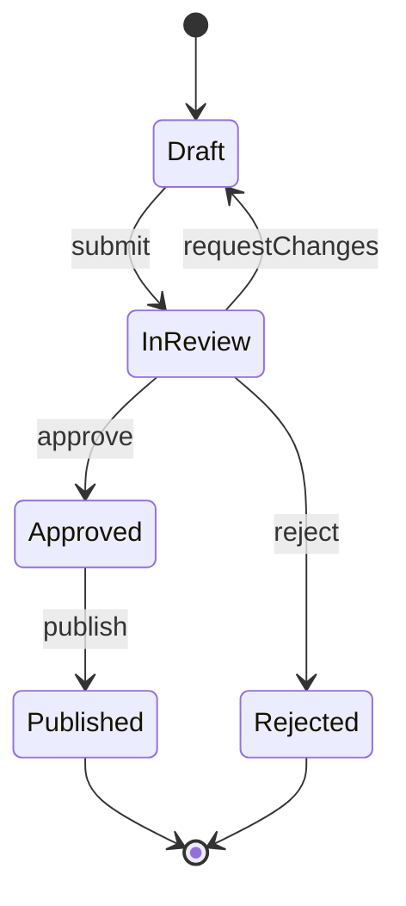
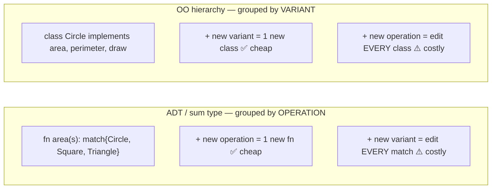

# Algebraic Data Types — Senior Level

> **Roadmap:** [Functional Programming](../README.md) → Algebraic Data Types
>
> *Essence: at junior/middle you learned what sum and product types are and how to pattern-match them. At senior level the ADT stops being a syntax feature and becomes a **design tool** — the lever you pull to make whole classes of bug structurally impossible, to encode a domain's rules in types a compiler enforces, and to make the **cost of change** in a contract visible at compile time instead of in production.*

---

## Table of Contents

1. [Introduction](#introduction)
2. [Make Illegal States Unrepresentable](#make-illegal-states-unrepresentable)
3. [Parse, Don't Validate — and Total Functions](#parse-dont-validate--and-total-functions)
4. [State Machines as ADTs](#state-machines-as-adts)
5. [Evolution & Versioning: Adding a Variant Is a Breaking Change](#evolution--versioning-adding-a-variant-is-a-breaking-change)
6. [The Expression Problem](#the-expression-problem)
7. [Language Reality at Scale](#language-reality-at-scale)
8. [Common Mistakes](#common-mistakes)
9. [Test Yourself](#test-yourself)
10. [Cheat Sheet](#cheat-sheet)
11. [Summary](#summary)
12. [Further Reading](#further-reading)
13. [Related Topics](#related-topics)

---

## Introduction

> Focus: **design and architecture implications.** Not "how do I write an `enum`," but "what does choosing this shape of type *buy* me, what does it *cost* me when the system grows, and how do I evolve it across an API boundary without breaking everyone downstream?"

A junior sees an ADT as a tagged union — a value that is *one of* several variants (a **sum**, e.g. `Result = Ok | Err`), where each variant carries a fixed bundle of fields (a **product**, e.g. `Ok { value, etag }`). That description is correct and almost useless for design.

The senior frame is this: **a type is a set of possible values, and your job as a domain modeler is to make that set exactly equal to the set of *valid* values — no larger.** Every value your types permit that your domain forbids is a latent bug waiting for someone to construct it. A `User` struct with a nullable `email` *and* a nullable `phone` and a comment that says "exactly one must be present" permits four states; the domain has three; the fourth state — both `null` — is a NullPointerException with a delay fuse. ADTs are the primary tool for collapsing that gap to zero.

This reframing has three large consequences that this file develops:

- **Modeling** — you push invariants out of runtime checks (validation, asserts, defensive `if`s scattered across the codebase) and into the *type*, so the compiler enforces them once, everywhere, for free.
- **Evolution** — because exhaustive `match`/`switch` is the payoff of a closed sum type, *adding a variant* breaks every exhaustive match on it. This is simultaneously the feature (the compiler hands you a to-do list of every site to update) and the hazard (across a published API or wire contract, you've just broken every consumer). Knowing which it is — and engineering for it — is senior work.
- **The Expression Problem** — ADTs make adding *operations* trivial and adding *variants* invasive; OO class hierarchies make exactly the opposite trade. Choosing the wrong one for your axis of change is a structural mistake you pay for indefinitely.

If you have not internalized [`junior.md`](junior.md) (constructing and destructuring sums and products) and [`middle.md`](middle.md) (exhaustive matching, `Option`/`Result`, recursive ADTs), read those first — this file assumes the mechanics and spends its budget on the judgment.

---

## Make Illegal States Unrepresentable

The slogan is Yaron Minsky's; the discipline behind it is the single highest-leverage idea in ADT-driven design. The method is mechanical:

1. Enumerate the states your domain *actually* permits.
2. Count the states your current type *permits*.
3. If (2) > (1), every extra state is a bug you must defend against at runtime forever. Redesign the type until (2) = (1).

### The canonical example: the "both nullable, exactly one set" trap

```python
# BEFORE — a product type with an impossible-to-enforce invariant.
# The type permits 4 combinations; the domain allows 3.
@dataclass
class Contact:
    email: str | None        # "exactly one of email/phone
    phone: str | None        # must be set" — says a COMMENT, not the type
# Permitted but illegal: email=None, phone=None  -> the fourth state, a bug.
# Every consumer must now write `if c.email is None and c.phone is None: raise`.
```

The product `(str | None) × (str | None)` has `2 × 2 = 4` inhabitants. The domain has three. A **sum** captures the domain exactly:

```python
# AFTER — a sum type. The fourth state cannot be constructed.
@dataclass(frozen=True)
class EmailOnly:  email: str
@dataclass(frozen=True)
class PhoneOnly:  phone: str
@dataclass(frozen=True)
class Both:       email: str; phone: str

Contact = EmailOnly | PhoneOnly | Both    # 3 variants, exactly the 3 valid states
```

Now no consumer ever checks "are both null?" — it is no longer expressible. The invariant moved from *N runtime checks scattered across the codebase* to *zero checks and one type definition.* That is the trade you are always making: **a type that permits only valid values deletes the defensive code that would otherwise guard every use site.**

The arithmetic generalizes. Cardinality of a product is the *product* of its fields' cardinalities (`Bool × Bool` = 4); of a sum it is the *sum* of its variants' cardinalities (`Bool + Unit` = 3). "Algebraic" is literal: you are doing algebra on the count of reachable states, and good domain modeling is *minimizing that count to the true domain size.*

### Rust makes the win sharp

```rust
// A connection that is EITHER disconnected OR connected-with-a-session.
// You CANNOT have a session_id while disconnected, or a missing one while
// connected — the compiler forbids constructing either nonsensical state.
enum Connection {
    Disconnected,
    Connected { session_id: SessionId, since: Instant },
}

fn heartbeat(c: &Connection) {
    match c {
        Connection::Disconnected => { /* no session_id in scope — can't misuse it */ }
        Connection::Connected { session_id, .. } => ping(session_id),
    }
}
```

Contrast the field-bag version (`struct { connected: bool, session_id: Option<SessionId> }`), which permits `connected: true, session_id: None` *and* `connected: false, session_id: Some(..)` — two illegal states the sum simply deletes. The boolean-plus-optional pattern is the smell; the sum type is the cure.

### Where to apply it

The technique pays off most on:

- **Configuration unions** — "TLS settings are present *iff* the scheme is `https`." Model `Endpoint = Http { host } | Https { host, tls }`, not a struct with an optional `tls` field and a runtime cross-check.
- **Mutually exclusive flags** — three booleans claiming to be mutually exclusive (`isLoading`, `isError`, `isLoaded`) permit `2³ = 8` states for a 3-state machine; collapse to a sum.
- **Result of a fallible operation** — never `(value, error)` where one is null; use `Result`/`Either`.

> **The senior heuristic:** whenever you write a comment that says "*X must be true when Y*," or you add a runtime `assert`/guard that *can never legitimately fire*, you have found a type that permits an illegal state. Reshape the type so the comment becomes unnecessary — the compiler should be enforcing it, not prose.

---

## Parse, Don't Validate — and Total Functions

"Make illegal states unrepresentable" tells you what shape the type should be. **Parse, don't validate** (Alexis King) tells you *when* to enforce it: **at the boundary, once, by producing a value whose type proves the check already passed.**

### Validation throws information away; parsing preserves it

A *validator* takes input, checks it, and returns a `bool` or throws — then hands the *same untyped input* downstream, where the next function, having no evidence the check happened, must check again (or trust, and crash).

```python
# VALIDATE — the proof of validity is discarded. Downstream still sees `str`,
# so downstream must re-check or blindly trust. The "is it non-empty?" question
# is answered, then the answer is THROWN AWAY.
def is_valid_email(s: str) -> bool: ...
def send(s: str):                 # receives a bare str — no guarantee it's valid
    if not is_valid_email(s): raise ValueError   # ...so it checks AGAIN
```

A *parser* takes input and returns a **new type** that, *by existing*, proves the input was valid. Downstream takes that type and cannot re-check because there is nothing left to check.

```python
# PARSE — the return TYPE carries the proof. A `Email` cannot exist unless it
# passed parsing. Downstream takes `Email`, not `str`, and never re-validates.
@dataclass(frozen=True)
class Email:
    value: str
    @staticmethod
    def parse(s: str) -> "Email | None":
        return Email(s) if _EMAIL_RE.fullmatch(s) else None   # the ONLY constructor

def send(addr: Email): ...   # impossible to call with an unparsed string
```

The structural win: validity becomes a property of the **type**, checked once at the edge. Past the boundary you operate on `Email`, `NonEmptyList`, `PositiveInt`, `ValidatedOrder` — and the question "but is it valid here?" is meaningless because the type is the proof. This is the same insight as the typed-pipeline fix for temporal coupling (`Cart → ValidatedCart → ChargedCart`): give each *stage of validity* its own type, and skipping a stage stops compiling.

### Total functions over partial functions

A **partial** function is undefined for some inputs in its declared type: `head : List a -> a` is partial (it has no answer for `[]`); integer `divide` is partial (no answer for divisor 0). Partial functions are landmines — they typecheck but blow up at runtime.

ADTs let you make them **total** — defined for every input of their type — by widening the *return* type to honestly include the "no answer" case:

```rust
// PARTIAL (lies): claims to return T for any list, panics on empty.
fn head_partial<T: Copy>(xs: &[T]) -> T { xs[0] }          // 💥 on []

// TOTAL (honest): the return type ADMITS the empty case. Callers must handle it,
// and the compiler enforces that they do.
fn head<T: Copy>(xs: &[T]) -> Option<T> { xs.first().copied() }
```

The principle: **a total function's signature tells the whole truth.** Anywhere a function might fail to produce a value of `T`, return `Option<T>` (or `Result<T, E>`), and the failure becomes a *value the caller must pattern-match*, not an exception that detonates three call frames away. The combination — parse at the edge into precise types, then write only total functions over those types — is how functional domains push virtually all "what if it's invalid here?" reasoning to a single, testable boundary. Errors as values is the broader theme; see [Monads — Plain English](../09-monads-plain-english/senior.md) for how `Option`/`Result` chaining (`?`, `map`, `and_then`) keeps total-function code from drowning in match arms.

---

## State Machines as ADTs

A finite state machine is *the* place where "make illegal states unrepresentable" and ADTs fuse most powerfully. A state machine is, definitionally, a sum type (the states) with a transition function over it — and modeling it as an ADT makes illegal *states* and, with a little care, illegal *transitions* unrepresentable.

Consider a document review workflow:



The naive encoding is a `status: String` (or even an `enum` of states) bolted onto one fat struct that also holds `reviewer`, `rejectionReason`, `publishedAt`, `approvedBy` — all nullable, "depending on status." That struct permits a `Draft` with a `rejectionReason` and a `Published` with no `publishedAt`: dozens of illegal state/field combinations, each defended by scattered `if status == ... && field != null` checks. That *is* the spaghetti.

The ADT encoding makes each state carry **exactly and only the data that state can have**:

```rust
// Each variant carries precisely the fields valid in that state — no more.
// A Draft has no reviewer; an Approved has no rejection reason; the type system
// guarantees it. Every "this field is only set when status==X" comment vanishes.
enum Document {
    Draft       { body: String },
    InReview    { body: String, reviewer: UserId },
    Approved    { body: String, approved_by: UserId, at: Instant },
    Rejected    { body: String, reason: String },
    Published   { body: String, url: Url, at: Instant },
}
```

Now encode the *transitions* as functions that consume one state and produce another. In Rust you can make this airtight by **consuming the state by value** (`self`), so an old state can't be reused after a transition:

```rust
impl Document {
    // `submit` exists ONLY on Draft. You cannot submit an Approved document —
    // there is no such method to call. Illegal transitions are unrepresentable,
    // not merely rejected at runtime.
    fn submit(self, reviewer: UserId) -> Document {       // by value: Draft is consumed
        match self {
            Document::Draft { body } => Document::InReview { body, reviewer },
            other => other,                               // or model as Result for an error
        }
    }
}
```

The discipline scales across languages: in Java, model each state as a distinct `record` implementing a `sealed interface Document`; in Python, as frozen dataclasses in a union; in Go, as concrete types behind an interface (with the painful caveats below). The payoff is uniform: **"what data is valid in this state?" and "what transitions are legal from here?" are answered by the type definition, not by reading every method that touches the entity.** This is the structural antidote to workflow spaghetti — the same move the [State pattern](../../design-patterns/03-behavioral/07-state/junior.md) makes in OO, but enforced by the type system rather than by convention. (For the OO-vs-FP framing of *when* to reach for which, see [Functional vs OO in Practice](../11-functional-vs-oo-in-practice/senior.md).)

---

## Evolution & Versioning: Adding a Variant Is a Breaking Change

Here is the senior insight that distinguishes ADT *users* from ADT *architects*: **the exhaustiveness checking that makes closed sum types so safe to use is exactly what makes them dangerous to evolve.**

### The double-edged sword of exhaustiveness

When a `match`/`switch` over a sum is exhaustive (the compiler verifies you handled every variant), adding a new variant **breaks every exhaustive match** until you update it. Inside one codebase, this is the single best feature ADTs offer:

```rust
enum PaymentMethod { Card(Card), BankTransfer(Account) }   // add: ApplePay(Token)

fn fee(p: &PaymentMethod) -> Money {
    match p {                          // after adding ApplePay, THIS STOPS COMPILING
        PaymentMethod::Card(_) => Money::cents(30),
        PaymentMethod::BankTransfer(_) => Money::ZERO,
        // error: non-exhaustive — the compiler just handed you a to-do list
        // of EVERY place that must consider the new payment method.
    }
}
```

The compiler becomes a refactoring assistant: it finds *every* site that needs to consider the new case, with zero chance of missing one. No grep, no hoping. This is why ADTs are a joy to extend with *new variants within a single owned codebase*.

### The same property is a hazard across a boundary

Now suppose `PaymentMethod` is part of a **published API**, a **wire/serialization contract**, or a **library** consumed by code you don't own and can't recompile in lockstep. Adding `ApplePay`:

- breaks every consumer's exhaustive `match` (a *source-breaking* change), and
- worse, sends consumers a variant they've never heard of — old code receiving `{"type": "apple_pay"}` either crashes, silently drops it, or hits a `default` arm that does the wrong thing.

**Adding a variant to a closed sum is a breaking change for everyone downstream.** This is the dual of the Expression Problem playing out as a versioning problem. Senior engineering means choosing a stance *deliberately*:

| Strategy | Mechanism | Cost / when |
|---|---|---|
| **Treat the sum as closed; bump the major version** | Add the variant, accept it's breaking, ship `v2`, migrate consumers. | Honest and clean for *internal* services you control end-to-end. Heavy for public/wide APIs. |
| **Reserve an extension point** | A catch-all variant — `Unknown(raw)` / `#[non_exhaustive]` in Rust, a `default`-required switch, a sealed-but-documented `Other` case — so old code can *receive and pass through* unknown variants without crashing. | The pragmatic default for wire formats and public APIs. Consumers degrade gracefully instead of breaking. The price: you give up total exhaustiveness — old code can't *handle* the new case, only survive it. |
| **Version the schema, not the type** | Negotiate a version on the wire (protobuf field numbers, content-type version, an explicit `schema_version`); new variants live behind a version the client opted into. | The robust choice for long-lived, widely-consumed contracts. More machinery, but breakage becomes opt-in. |

Rust encodes this exact tension in the language: `#[non_exhaustive]` on a public enum *forces* downstream `match`es to include a wildcard arm, so that you (the library author) can add variants in a minor version without breaking semver. You trade the consumer's exhaustiveness for your own evolvability — a deliberate, documented contract.

```rust
#[non_exhaustive]                  // downstream MUST add a `_ =>` arm...
pub enum ApiError { NotFound, RateLimited, Internal }
// ...so adding `ServiceUnavailable` later is a NON-breaking minor release.
// The cost: every external match now has a `_` arm and loses exhaustiveness.
```

> **The rule of thumb:** *closed sums for data you own and recompile together* (lean on exhaustiveness — it's a superpower); *open/extensible sums or versioned schemas for data that crosses a boundary you don't control* (lean on graceful degradation). The mistake is using a naked closed sum in a wire contract and discovering at the next feature that you cannot add a payment method without a coordinated multi-team migration.

This is the [API versioning](../../../../Architecture/system-design/README.md) problem viewed through the type system: the variant set of your ADT *is* part of your contract's surface, and growing it is exactly as breaking as removing a field.

---

## The Expression Problem

The Expression Problem (named by Philip Wadler) is the deep structural reason ADTs and OO hierarchies feel like mirror images. It states the difficulty of writing code that is extensible **in both directions** — adding new *data variants* and new *operations* — without modifying existing code and without losing type safety.

Lay the design out as a grid: rows are **variants** (Circle, Square, Triangle), columns are **operations** (area, perimeter, draw):

|          | area | perimeter | draw |
|----------|------|-----------|------|
| Circle   |  ✓   |     ✓     |  ✓   |
| Square   |  ✓   |     ✓     |  ✓   |
| Triangle |  ✓   |     ✓     |  ✓   |

Every cell must be filled. The question is: **which direction of growth touches existing code?**

- **ADTs / functional style** organize code *by operation.* `area` is one function with a `match` over all variants. **Adding an operation** (a new column, e.g. `bounding_box`) is trivial and local: write one new function; *nothing existing changes.* **Adding a variant** (a new row, e.g. `Hexagon`) is invasive: every function's `match` must gain an arm — you edit every operation. → *ADTs are easy to extend with operations, hard to extend with variants.*

- **OO class hierarchies** organize code *by variant.* `Circle` is one class implementing `area`, `perimeter`, `draw`. **Adding a variant** (a new row, `Hexagon`) is trivial and local: write one new class; *nothing existing changes.* **Adding an operation** (a new column, `boundingBox`) is invasive: every existing class must implement the new method — you edit every class (or break the interface). → *OO is easy to extend with variants, hard to extend with operations.*



The practical senior judgment is to **align the cheap axis with your actual axis of change**:

- A **closed, stable set of variants** with a **growing set of operations** — a fixed AST (literals, binary ops, function calls) with ever more passes (typecheck, optimize, codegen, lint, pretty-print) — is the textbook case *for* ADTs. New passes are cheap; the variant set rarely moves. This is why compilers and interpreters are written with sum types.
- A **stable set of operations** with a **growing set of variants** — a plugin system, a payment-method registry, a UI widget kit where third parties add new kinds — is the textbook case *for* OO/polymorphism (or an open extension mechanism). New kinds are cheap; the operation set is fixed by an interface.

When you need *both* axes to grow without touching existing code, you reach past plain ADTs: the **Visitor pattern** simulates sum-type dispatch in an OO language (and re-creates the ADT's pain — adding a variant breaks every visitor); **typeclasses** (Haskell) / **traits** (Rust) / **protocols** dissolve the problem more cleanly by letting you add both operations (new typeclass) and instances (new `impl`) without editing existing code. See [Visitor](../../design-patterns/03-behavioral/10-visitor/junior.md) for the OO simulation of sum-type dispatch and the trade-off it inherits.

> **The takeaway:** "ADT vs class hierarchy" is not a style preference — it's a bet on which axis of your design will grow. Bet wrong and *every* future change fights the structure. Identify the stable axis and the growing axis first; let that choose the tool.

---

## Language Reality at Scale

The theory above assumes you have real sum types with exhaustiveness checking. In practice the languages span a spectrum from "ideal" to "fight the language."

### Haskell / Rust — the ideal

Sum types are first-class, ergonomic, and exhaustively checked, with destructuring pattern matching built into the language:

```haskell
-- Haskell: the definition reads like the domain. Non-exhaustive patterns are a warning.
data Shape = Circle Double | Rect Double Double
area :: Shape -> Double
area (Circle r)   = pi * r * r
area (Rect w h)   = w * h
```

```rust
// Rust: enums with data, exhaustive `match`, `Option`/`Result` in the std library,
// `#[non_exhaustive]` for evolution control. The ADT is the idiomatic default.
enum Shape { Circle(f64), Rect(f64, f64) }
fn area(s: &Shape) -> f64 {
    match s { Shape::Circle(r) => PI * r * r, Shape::Rect(w, h) => w * h }
}
```

In these languages, "make illegal states unrepresentable" is the path of least resistance. Reach for them as the mental model even when writing the others.

### Java — sealed interfaces close the hierarchy (modern), enums are the legacy floor

Before Java 17, a "sum type" was an interface with subclasses — *open* (anyone can add a subclass) and *unchecked* (no exhaustiveness; `switch` needs a `default`). **Sealed interfaces** (Java 17) + **records** (Java 16) + **pattern matching for `switch`** (Java 21) finally give Java real, exhaustively-checked closed sums:

```java
// A genuine closed sum: the compiler knows the complete set of subtypes.
sealed interface Shape permits Circle, Rect {}
record Circle(double r)            implements Shape {}
record Rect(double w, double h)    implements Shape {}

static double area(Shape s) {
    return switch (s) {                       // EXHAUSTIVE — no default needed.
        case Circle c -> Math.PI * c.r() * c.r();
        case Rect r   -> r.w() * r.h();
        // add a `Triangle` to `permits` and THIS switch stops compiling — the
        // same compiler-as-to-do-list benefit as Rust/Haskell.
    };
}
```

This is a genuinely large language improvement: `sealed` gives you the *closed* set the compiler can check, and you get the "adding a variant breaks every switch" feature for free. Java enums (`enum Suit { ... }`) remain the right tool for *dataless* closed sets, but for *variants that carry different data*, `sealed` + `record` is now the idiom — not a hand-rolled visitor.

### Python — unions plus structural tooling

Python has no compiler-enforced exhaustiveness at runtime, but the *design* still applies, backed by tooling:

```python
# Variants as frozen dataclasses; the sum as a type-alias union. `match` (3.10+)
# destructures; a type checker (mypy/pyright) flags non-exhaustive matches via
# the `assert_never` idiom — exhaustiveness as a CI check, not a language guarantee.
Shape = Circle | Rect

def area(s: Shape) -> float:
    match s:
        case Circle(r):    return math.pi * r * r
        case Rect(w, h):   return w * h
        case _ as unreachable:  assert_never(unreachable)   # mypy errors if a case is missed
```

You get most of the design benefit *if* you run the type checker in CI; without it, "exhaustive" is a hope. The senior move is to treat mypy/pyright + `assert_never` as the enforcement mechanism and gate merges on it.

### Go — the painful gap, and the idioms that cope

Go has **no sum types**. This is the single most-felt absence in Go domain modeling, and there is no clean workaround — only trade-offs:

```go
// IDIOM 1 — interface with a sealed marker method. Closest to a sum type, but:
//   • NO exhaustiveness: a type switch needs `default`, and adding a variant
//     silently falls through it instead of failing the build.
//   • the set is only "sealed" by an unexported method, enforced by convention.
type Shape interface{ isShape() }

type Circle struct{ R float64 }
type Rect   struct{ W, H float64 }
func (Circle) isShape() {}
func (Rect)   isShape() {}

func area(s Shape) float64 {
    switch v := s.(type) {        // no compiler guarantee this covers every Shape
    case Circle: return math.Pi * v.R * v.R
    case Rect:   return v.W * v.H
    default:     panic("unhandled Shape")   // runtime, not compile time
    }
}
```

```go
// IDIOM 2 — a struct with a tag + nullable fields ("the bag"). This is exactly the
// "illegal states representable" anti-pattern, but Go often pushes you here for
// serialization. You pay with runtime invariant checks the type can't enforce.
type Shape struct {
    Kind   string    // "circle" | "rect"
    R      float64   // valid only when Kind=="circle"
    W, H   float64   // valid only when Kind=="rect"
}
```

The honest summary for Go: you choose between (1) interface + type switch (no exhaustiveness, no payload-illegal-state protection, "sealed" by convention) and (2) the tagged-struct bag (illegal states fully representable). Neither makes illegal states unrepresentable. The senior mitigations are: **centralize** every type switch behind one constructor/dispatch function so the "add a variant" edit has *one* place to find (and add a `default: panic` so omissions fail loudly in tests); add **a unit test that enumerates all variants** to substitute for the missing exhaustiveness check; and isolate the tagged-bag representation to the serialization boundary, converting to interface-based variants internally. Go's generics (1.18+) help with container ADTs (`Option[T]`, `Result[T]`) but do *nothing* for sum types — there is still no way to express "one of these N variants" with compiler enforcement. Knowing this lets you set realistic expectations and not pretend Go has modeling power it lacks.

> **The spectrum, ranked by ADT support:** Haskell ≈ Rust (first-class, exhaustive) > Java 17+ (`sealed` + `record` + pattern `switch`, genuinely closed and checked) > Python (unions + `match`, exhaustiveness only via external type checker) > Go (no sum types; interface-or-bag, both lossy). Design *in the ideal model*; *implement* with full awareness of where your language sits and what runtime checks you must add to backfill the gap.

---

## Common Mistakes

1. **Modeling a sum as a product of booleans/optionals.** `struct { isLoading, isError, isLoaded bool }` (or `connected: bool` + `session: Option`) permits 2ⁿ states for an *n*-state machine. The "exactly one is true" comment is the tell. *Collapse to a single sum; delete the cross-checks.*
2. **Re-validating past the boundary.** Threading a bare `string` everywhere and checking `is_valid_email` at three different layers. *Parse once at the edge into an `Email`/`ValidatedX` type; downstream takes the type and cannot re-check.*
3. **Partial functions hiding as total ones.** `head`, `divide`, `parseInt` that return `T` and throw/panic. *Widen the return to `Option<T>`/`Result<T,E>` so the absence is a value the caller must handle.*
4. **A naked closed sum in a wire/public contract.** Then discovering that adding one variant is a breaking change for every consumer and demands a coordinated migration. *Use `#[non_exhaustive]`/an `Unknown` catch-all/a versioned schema for data that crosses a boundary you don't control.*
5. **Betting the wrong axis of the Expression Problem.** Using a class hierarchy for a fixed AST with many growing passes (every new pass forces edits to every node class), or a closed sum for an open plugin registry (every plugin breaks every match). *Match the cheap axis to the growing axis.*
6. **Pretending Go (or pre-17 Java) has sum types.** Assuming the type switch is exhaustive when nothing enforces it; a forgotten variant silently hits `default`. *Add a centralized dispatch, a `default: panic`, and an all-variants test; treat exhaustiveness as something you must build.*
7. **Catch-all arms that defeat the point.** A `_ => {}` / `default:` added "to make it compile" *re-hides* the very omissions exhaustiveness would have caught. *Use wildcards only deliberately (genuinely don't-care cases, or `#[non_exhaustive]` consumers), never to silence the compiler.*
8. **God-variant payloads.** One enum variant whose payload is itself a 15-field struct of optionals re-imports the illegal-state problem inside the variant. *Push the sub-structure into its own properly-modeled type.*

---

## Test Yourself

1. A `Subscription` has fields `status: String`, `trialEndsAt: Date?`, `cancelledAt: Date?`, `renewsAt: Date?`. How many states does this product permit, roughly, and how would you reshape it so it permits only the legal ones?
2. Explain the difference between *validating* and *parsing* in terms of what each does to the *type* of the data flowing downstream. Why does parsing eliminate re-checks?
3. You add a variant `Crypto` to a `PaymentMethod` enum. Describe precisely what happens (a) when `PaymentMethod` is internal and recompiled with all its consumers, versus (b) when it is a serialized wire contract consumed by clients you don't control. Why is the *same language feature* a benefit in one case and a hazard in the other?
4. State the Expression Problem. For a compiler with a fixed grammar but a steadily growing set of analysis/optimization passes, which representation — ADT or OO hierarchy — fits, and why?
5. Your team uses Go and needs a `Shape = Circle | Rect | Triangle` with an `area` and a `perimeter` operation. What do you lose relative to Rust, and what three concrete mitigations do you put in place?
6. When is `#[non_exhaustive]` (Rust) or a deliberate `Unknown`/`default` catch-all the *right* design, and what exactly do you give up by using it?

<details>
<summary>Answers</summary>

1. The product permits roughly `|status values| × 2 × 2 × 2` states (each nullable date doubles it), the vast majority illegal (e.g. a `cancelled` subscription with a future `renewsAt`, or an `active` one with a `cancelledAt`). Reshape into a **sum** where each status is a variant carrying *only* its valid fields: `Trialing { trialEndsAt }`, `Active { renewsAt }`, `Cancelled { cancelledAt }`. The illegal field/status combinations become unconstructable, and every "this date is only set when status==X" check disappears.
2. **Validating** checks the input and returns a `bool`/throws, then passes the *same untyped value* (e.g. `str`) downstream — the proof of validity is discarded, so each downstream consumer must re-check or blindly trust. **Parsing** returns a *new type* (`Email`, `ValidatedOrder`) that, by existing, proves the check passed; downstream takes that type and *cannot* re-check because the only constructor is the parser at the boundary. The type carries the evidence, so re-validation is both unnecessary and impossible.
3. **(a) Internal + recompiled:** every exhaustive `match`/`switch` on `PaymentMethod` stops compiling until updated — the compiler hands you a complete, zero-omission to-do list of sites to handle `Crypto`. This is the killer feature. **(b) Wire contract / external consumers:** you've made a *breaking* change — old consumers' exhaustive matches break (source) and, worse, old deployed code receives a `crypto` value it has never heard of and crashes / silently mishandles it. Same feature (a *closed* set the compiler can verify), opposite effect: within one recompiled codebase the closed-set assumption is *true and helpful*; across a boundary where consumers can't be recompiled in lockstep, the closed-set assumption is *false*, so the safe move is an open/extensible variant set or a versioned schema.
4. **Expression Problem:** writing code extensible in *both* directions — new data variants *and* new operations — without modifying existing code and without losing type safety; ADTs make new operations cheap and new variants invasive, OO makes the reverse. A compiler with a **fixed grammar** (stable variant set) but **growing passes** (growing operation set) fits the **ADT**: each new pass is one new function over the AST sum, and the variant set rarely moves — so the cheap axis (operations) aligns with the growing axis. (An OO hierarchy would force every node class to be edited for each new pass.)
5. Relative to Rust you lose: compiler-checked **exhaustiveness** (a forgotten variant hits `default` at runtime, not a build error) and the guarantee that **payloads can't hold illegal-state combinations**. Mitigations: (1) model variants as concrete types behind a `Shape` interface with an unexported marker method (`isShape()`) so the set is sealed by convention; (2) **centralize** every type switch behind one dispatch function with a `default: panic(...)` so omissions fail loudly; (3) add a **unit test enumerating all variants** through each operation to stand in for the missing exhaustiveness check — and keep any tagged-struct representation confined to the serialization boundary.
6. They're right when the type **crosses a boundary you don't control and will gain variants over time** — a public library enum, a wire/serialization format, a plugin protocol — where you need to add variants in a *non-breaking* (minor) release and let old consumers *receive and pass through* unknown variants without crashing. What you give up: **exhaustiveness** for the consumer. The `_`/`default` arm means the compiler can no longer prove a downstream match handles every real case, so adding a variant no longer hands consumers a to-do list — they degrade gracefully but cannot *handle* the new case until they choose to.

</details>

---

## Cheat Sheet

| Concept | What it buys you | Senior move |
|---|---|---|
| **Make illegal states unrepresentable** | Deletes scattered runtime guards; bugs become unconstructable | Count permitted vs valid states; if permitted > valid, reshape product → sum |
| **Parse, don't validate** | Validity becomes a *type*, checked once at the edge | Return a `ValidatedX` type from the boundary; downstream takes the type, never re-checks |
| **Total functions** | Failure is a value the caller must match, not a hidden panic | Widen partial returns to `Option`/`Result`; let the signature tell the whole truth |
| **State machine as ADT** | Each state carries only its valid data; illegal transitions can't be called | One variant per state; transitions as functions consuming the state (by value in Rust) |
| **Closed sum** | Compiler-checked exhaustiveness = "add a variant breaks every match" to-do list | Use for data you own and recompile together — lean on exhaustiveness |
| **Open / `#[non_exhaustive]` / versioned schema** | Consumers survive unknown variants; variants added non-breakingly | Use for wire contracts & public APIs — trade exhaustiveness for evolvability |
| **Expression Problem** | Names the ADT↔OO trade: ops-easy/variants-hard vs the reverse | Align the language's cheap axis with your design's growing axis |

**Language reality, ranked:** Haskell ≈ Rust (first-class, exhaustive) > Java 17+ (`sealed`+`record`+pattern `switch`) > Python (unions + `match` + external type-checker exhaustiveness) > Go (no sum types: interface-or-bag, both lossy — backfill with centralized dispatch + `default: panic` + all-variants test).

**Three golden rules:**
- *Shrink the set of representable values to exactly the set of valid values — every extra state is a latent bug.*
- *Closed sums for data you recompile together; open/versioned sums for data that crosses a boundary you don't control.*
- *Pick ADT vs class hierarchy by which axis (operations or variants) is going to grow — bet wrong and every change fights the structure.*

---

## Summary

- **An ADT is a design tool, not a syntax feature:** a type is a *set of values*, and the senior's job is to make that set exactly the set of *valid* values. The cardinality algebra (products multiply, sums add) is literal guidance for minimizing representable illegal states.
- **Make illegal states unrepresentable:** replace "boolean + optional + comment-enforced invariant" products with sums whose variants carry only their valid fields. The payoff is the *deletion* of defensive runtime checks across every use site.
- **Parse, don't validate, and prefer total functions:** check validity *once* at the boundary by producing a type that proves it; downstream takes the type and cannot re-check. Widen partial functions' returns to `Option`/`Result` so failure is a value, not a panic.
- **State machines are sum types:** one variant per state (carrying only that state's data), transitions as functions over them; illegal states and (with by-value consumption) illegal transitions become unconstructable — the type-system antidote to workflow spaghetti.
- **Evolution is the double-edged sword:** exhaustiveness makes *adding a variant* a compiler-generated to-do list inside an owned codebase, and a *breaking change* across any boundary you don't recompile. Choose deliberately: closed sums internally, `#[non_exhaustive]` / catch-all / versioned schema for wire and public contracts.
- **The Expression Problem** explains why ADTs and OO hierarchies are mirror images: ADTs make new *operations* cheap and new *variants* invasive; OO makes the reverse. Align the cheap axis with the axis that will grow.
- **Language reality spans a wide spectrum:** Haskell/Rust are the ideal; Java 17+ now has genuine closed sums (`sealed`+`record`+pattern `switch`); Python needs an external type checker for exhaustiveness; Go has no sum types at all and forces you to backfill the guarantees with discipline and tests.

---

## Further Reading

- **"Effective ML" / "Make illegal states unrepresentable"** — Yaron Minsky (Jane Street) — the origin of the slogan and its discipline.
- **"Parse, don't validate"** — Alexis King (2019) — the canonical essay on pushing validity into types at the boundary.
- **"Designing with Types"** series — Scott Wlaschin (*F# for Fun and Profit*) — the most accessible practical treatment of ADT-driven domain modeling; the basis of *Domain Modeling Made Functional*.
- **Domain Modeling Made Functional** — Scott Wlaschin (2018) — book-length application of sums, products, and "make illegal states unrepresentable" to real domains.
- **"The Expression Problem"** — Philip Wadler (1998, mailing-list note) — the original framing; pairs well with Wadler's typeclass papers.
- **The Rust Book**, ch. 6 (Enums & Pattern Matching) and the **`#[non_exhaustive]`** reference — sum types and the evolution-control attribute in practice.
- **JEP 409 (Sealed Classes)** and **JEP 441 (Pattern Matching for `switch`)** — the JDK proposals that brought real closed sums and exhaustive matching to Java.

---

## Related Topics

- [Pattern matching & sums — `middle.md`](middle.md) — the mechanics this file builds on: exhaustive matching, `Option`/`Result`, recursive ADTs.
- [Monads — Plain English](../09-monads-plain-english/senior.md) — how `Option`/`Result` chaining (`map`, `and_then`, `?`) keeps total-function code readable instead of nesting matches.
- [Effect Tracking](../10-effect-tracking/senior.md) — parse-at-the-edge is the functional-core/imperative-shell boundary; ADTs are how the core represents validated data.
- [Composition](../05-composition/senior.md) — typed pipelines (`Cart → ValidatedCart → ChargedCart`) compose total functions over precise ADTs.
- [Functional vs OO in Practice](../11-functional-vs-oo-in-practice/senior.md) — the Expression Problem decision (sum type vs class hierarchy) framed as a paradigm choice.
- [Design Patterns → State](../../design-patterns/03-behavioral/07-state/junior.md) — the OO counterpart to modeling a state machine as a sum type.
- [Design Patterns → Visitor](../../design-patterns/03-behavioral/10-visitor/junior.md) — simulating sum-type dispatch in an OO language, and the Expression-Problem trade it inherits.
- [Bad Structure → Senior](../../anti-patterns/01-development/01-bad-structure/senior.md) — typed pipelines and finite state machines as the structural cure for spaghetti; the same "make illegal states unrepresentable" lever.
