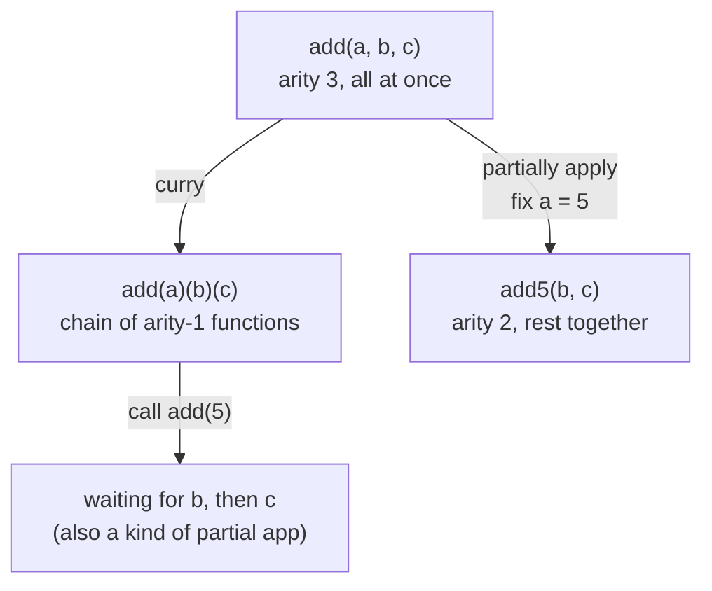

# Currying & Partial Application — Junior Level

> **Roadmap:** [Functional Programming](../README.md) → Currying & Partial Application
>
> *Two ways to feed a function its arguments one batch at a time — and why "pre-loading" some arguments early is one of the quietest, most useful tricks in functional programming.*

---

## Table of Contents

1. [Introduction](#introduction)
2. [Prerequisites](#prerequisites)
3. [Glossary](#glossary)
4. [Currying vs Partial Application](#currying-vs-partial-application)
5. [Examples per Language](#examples-per-language)
   - [Python — `functools.partial`](#python--functoolspartial)
   - [Go — closures](#go--closures)
   - [Java — curried via `Function`](#java--curried-via-function)
   - [Haskell aside — everything is curried](#haskell-aside--everything-is-curried)
6. [Why It's Useful](#why-its-useful)
7. [Mental Models](#mental-models)
8. [Common Mistakes](#common-mistakes)
9. [Test Yourself](#test-yourself)
10. [Cheat Sheet](#cheat-sheet)
11. [Summary](#summary)
12. [Further Reading](#further-reading)
13. [Related Topics](#related-topics)

---

## Introduction

> Focus: **What is it, and why does it matter?**

Most functions you write take all their arguments at once: `add(2, 3)`, `send(message, recipient, retries)`. You call, you pass everything, you get a result. That's the only model most people ever learn.

**Currying** and **partial application** are two related ideas that break that "all at once" assumption. They let you supply arguments *gradually* — give a function some of what it needs now, and get back a smaller function that remembers what you gave it and waits for the rest.

Why would you ever want that? Because real programs are full of functions where **some arguments rarely change**. You connect to *one* database, log at *one* level, multiply by *one* tax rate, greet in *one* language. Re-typing those stable arguments at every call site is noise — and noise hides bugs. Pre-binding them once gives you a tailored, simpler function: `logError(msg)` instead of `log(ERROR, "app", timestamp, msg)` every single time.

At the junior level your goal is modest but important:

- Understand what **currying** means (`f(a)(b)(c)` instead of `f(a, b, c)`).
- Understand what **partial application** means (fix some arguments, get a smaller function back).
- Know the **difference** between the two — they're often confused, even by experienced developers.
- Recognize *why* pre-binding arguments makes code cleaner and safer.

You do **not** need to write your own currying library or memorize academic notation. You need to recognize the shape and reach for it when it helps.

> **The one-sentence version:** *Currying* turns a multi-argument function into a chain of one-argument functions; *partial application* fills in some arguments now and leaves the rest for later. Both let you build specialized functions out of general ones.

---

## Prerequisites

- **Required:** You can write and call functions in at least one language (examples here use Python, Go, and Java).
- **Required:** You understand that **a function can be stored in a variable and returned from another function** — i.e. functions are values. If that's new, read [First-Class & Higher-Order Functions](../01-first-class-and-higher-order-functions/junior.md) first; everything here builds on it.
- **Helpful:** A loose sense of what a **closure** is — a function that "remembers" variables from where it was created. We'll use closures heavily and explain them as we go.
- **Helpful:** You've felt the annoyance of passing the *same* argument over and over at many call sites. That annoyance is exactly what this topic cures.

---

## Glossary

| Term | Definition |
|------|-----------|
| **Arity** | The number of arguments a function takes. `add(a, b)` has arity 2; `negate(x)` has arity 1. |
| **Currying** | Transforming an *n*-argument function into a chain of *n* functions, each taking exactly **one** argument: `f(a, b, c)` becomes `f(a)(b)(c)`. |
| **Partial application** | Fixing *some* of a function's arguments to produce a new function of **smaller arity**. Supplying 1 of 3 args gives you a 2-arg function. |
| **Closure** | A function bundled with the variables it captured from its surrounding scope. It "closes over" those values and remembers them after that scope is gone. |
| **Pre-binding (fixing)** | Locking in a specific argument value ahead of time so callers never have to supply it. |
| **Higher-order function** | A function that takes a function as an argument and/or returns a function. Currying and partial application both *return* functions, so they're higher-order. |
| **Point-free style** | Defining functions by combining other functions without explicitly naming their arguments — often a downstream benefit of currying. (You don't need it yet.) |

---

## Currying vs Partial Application

These two get confused constantly, so let's pin them down before any code. They sound similar — both involve "supplying arguments in stages" — but they are **not** the same operation.

### The shapes side by side

Start with an ordinary three-argument function:

```text
add(a, b, c)            # normal call: all three at once
```

**Currying** rewrites it as a chain of single-argument functions. Each call takes exactly one argument and returns another function, until the last call returns the final result:

```text
curriedAdd(a)(b)(c)     # three separate one-argument calls
```

**Partial application** doesn't change the call shape into a chain. It just lets you *fix some arguments now* and get back a function expecting the rest:

```text
add5 = partial(add, 5)  # fix a = 5, get a function of (b, c)
add5(b, c)              # supply the remaining two together
```

### The key difference

| | **Currying** | **Partial Application** |
|---|---|---|
| **What it does** | Restructures one function into a *chain* of one-arg functions | Pre-fills *some* arguments, returns a smaller function |
| **Arity of each step** | Always exactly **1** argument per call | Whatever's left after fixing some (can be 2, 3, …) |
| **How many args at once** | One at a time, forced | As many as you want; the rest fixed |
| **Result of "partly" applying** | A function awaiting the next single arg | A function awaiting *all* remaining args together |
| **Is it a transformation or a call?** | A *transformation* of the function's structure | An *action* you perform using a function + some args |

A clean way to hold the distinction:

> **Currying** is about the *shape of the function* — it's curried or it isn't, regardless of how you call it.
> **Partial application** is about *what you do when you call it* — you apply it to fewer arguments than it ultimately needs.

They're related because **a curried function makes partial application trivial**: if `add` is `add(a)(b)(c)`, then `add(5)` is *already* a partially-applied function waiting for `b` and `c`. Currying is the structure; partial application is one of the things that structure makes easy.



> **Memorize this:** *Currying* always produces one-argument-at-a-time chains. *Partial application* produces a function of whatever arity is left. Currying is a special, total form of the more general idea of pre-binding arguments.

---

## Examples per Language

The same idea looks different in each language. The *concept* is universal; the *ergonomics* are not. Read all four — seeing the contrast is the fastest way to internalize the idea.

### Python — `functools.partial`

Python's standard library ships partial application directly: `functools.partial` fixes some arguments and hands back a new callable.

```python
from functools import partial

def power(base, exponent):
    return base ** exponent

# Partial application: fix the exponent, get a one-argument function.
square = partial(power, exponent=2)
cube   = partial(power, exponent=3)

print(square(5))   # 25  — same as power(5, 2)
print(cube(2))     # 8   — same as power(2, 3)
```

`square` is `power` with `exponent` pre-bound to `2`. The caller never thinks about exponents again — they just call `square(n)`. That's the entire payoff: a general function (`power`) became a focused, single-purpose one (`square`) with no new logic written.

A common real-world use is pre-binding a configuration value:

```python
import logging
from functools import partial

def log(level, message):
    logging.log(level, message)

# Pre-bind the level once; callers only pass the message.
log_error = partial(log, logging.ERROR)
log_info  = partial(log, logging.INFO)

log_error("disk full")     # no need to repeat logging.ERROR everywhere
log_info("server started")
```

Python can also *curry* manually by returning functions, but it's rarely idiomatic — `partial` is the tool you'll actually use:

```python
# Manual currying — possible, but not Pythonic. Shown for understanding only.
def add(a):
    def then_b(b):
        def then_c(c):
            return a + b + c
        return then_c
    return then_b

print(add(1)(2)(3))   # 6  — the f(a)(b)(c) chain shape
```

> **Takeaway:** in Python, reach for `functools.partial` to fix arguments. Hand-rolled currying chains are a curiosity, not a habit.

### Go — closures

Go has no `partial` and no currying syntax, but it has **closures** — and closures are all you need. A function that returns a function, capturing the fixed argument, *is* partial application.

```go
package main

import "fmt"

// multiplier returns a function that multiplies by a fixed factor.
// The returned function "closes over" factor — it remembers it.
func multiplier(factor int) func(int) int {
    return func(n int) int {
        return factor * n
    }
}

func main() {
    double := multiplier(2)   // factor pre-bound to 2
    triple := multiplier(3)   // factor pre-bound to 3

    fmt.Println(double(10))   // 20
    fmt.Println(triple(10))   // 30
}
```

`multiplier(2)` returns a brand-new function whose `factor` is permanently `2`. That returned function is a partially-applied `multiply(factor, n)` — the first argument is baked in, the second is supplied later. No library required; the closure carries the captured value.

This pattern is everywhere in idiomatic Go — configuring middleware, building handlers, and pre-binding dependencies:

```go
// A greeter pre-bound to a language, then reused for many names.
func greeterFor(greeting string) func(string) string {
    return func(name string) string {
        return greeting + ", " + name + "!"
    }
}

func main() {
    hello := greeterFor("Hello")
    salom := greeterFor("Salom")

    fmt.Println(hello("Ada"))   // Hello, Ada!
    fmt.Println(salom("Ada"))   // Salom, Ada!
}
```

> **Takeaway:** in Go, "currying" and "partial application" both come from the same mechanism — **a function that returns a closure capturing a fixed value**. You won't see the words; you'll see the shape.

### Java — curried via `Function`

Java has no built-in currying, but the `java.util.function.Function` interface lets you express the curried chain explicitly: a `Function` that returns a `Function`.

```java
import java.util.function.Function;

public class Currying {
    // Curried add: takes a, returns a function taking b, which returns a + b.
    // Type reads as: a -> (b -> (a + b))
    static Function<Integer, Function<Integer, Integer>> add =
        a -> b -> a + b;

    public static void main(String[] args) {
        // Full application — the f(a)(b) chain:
        int sum = add.apply(2).apply(3);   // 5

        // Partial application falls out for free:
        Function<Integer, Integer> add10 = add.apply(10);  // fix a = 10
        System.out.println(add10.apply(5));   // 15
        System.out.println(add10.apply(7));   // 17
    }
}
```

`add.apply(2)` returns a `Function<Integer, Integer>` — a function still waiting for `b`. That's the curried chain (`f(a)(b)`) and partial application at the same time: because `add` is curried, applying it to one argument *automatically* gives you a partially-applied function. This is the link between the two concepts made concrete.

The lambda `a -> b -> a + b` is the heart of it. Read right-to-left: `b -> a + b` is "a function of `b`"; the outer `a -> (...)` is "a function of `a` that returns that". Currying is exactly this nesting.

> **Takeaway:** in Java, currying is spelled `Function<A, Function<B, R>>` and called with `.apply(a).apply(b)`. It's verbose, so reserve it for places where the gradual-argument shape genuinely helps.

### Haskell aside — everything is curried

In Haskell, **every function is curried by default** — there's no choice to make. A function "of two arguments" is secretly a function of one argument that returns a function of one argument.

```haskell
add :: Int -> Int -> Int        -- read as: Int -> (Int -> Int)
add a b = a + b

-- These are identical; the second is just the first with a partially applied:
add 2 3        -- 5
add5 = add 5   -- partial application is automatic — no special syntax
add5 3         -- 8
```

The type `Int -> Int -> Int` literally *means* `Int -> (Int -> Int)`: give me one `Int`, I'll give you back a function from `Int` to `Int`. So `add 5` isn't a special operation — it's just calling `add` with one argument, and partial application is the natural result. This is why functional programmers reach for these ideas so casually: in their home language, currying isn't a technique, it's the air.

> **Why show Haskell at all?** Because it reveals the "pure" form: currying and partial application aren't exotic add-ons — they're what function application *is* once you stop assuming "all arguments at once." Python, Go, and Java are bolting this idea onto languages that assume the opposite default.

---

## Why It's Useful

Pre-binding arguments isn't a parlor trick. It earns its place by making code **shorter, safer, and more reusable**. Here's where it actually pays off:

### 1. Eliminate repeated arguments at call sites

If twenty call sites all pass `logging.ERROR` as the first argument, that's twenty chances to pass the wrong level, and twenty things to change if the convention shifts. Bind it once into `log_error` and the repetition — and its bugs — disappear.

```python
# Before: the level is repeated, error-prone noise at every call.
log(logging.ERROR, "step 1 failed")
log(logging.ERROR, "step 2 failed")
log(logging.ERROR, "step 3 failed")

# After: bound once, intent obvious, impossible to pass the wrong level.
log_error = partial(log, logging.ERROR)
log_error("step 1 failed")
log_error("step 2 failed")
log_error("step 3 failed")
```

### 2. Turn general functions into specialized ones — without rewriting logic

`square = partial(power, exponent=2)` creates a new, focused function out of a general one with **zero new code**. You're not copy-pasting `power`'s body; you're configuring it. Specialization by binding, not by duplication.

### 3. Adapt a function to fit an interface that expects fewer arguments

Many higher-order functions — `map`, `filter`, sort comparators, event handlers — expect a function of a *specific* arity. Partial application reshapes your multi-argument function to fit:

```python
# map wants a one-argument function; multiply takes two.
# Partial application bridges the gap.
def multiply(factor, n):
    return factor * n

doubled = list(map(partial(multiply, 2), [1, 2, 3, 4]))
print(doubled)   # [2, 4, 6, 8]
```

### 4. Pre-bind dependencies (config, connections, clients) once

This is the big one in real backends. A handler needs a database connection on every call, but the connection never changes per request. Bind it once at startup; every later call is clean:

```go
// Bind the dependency (db) once; handlers don't repeat it.
func makeUserHandler(db *DB) func(id int) (*User, error) {
    return func(id int) (*User, error) {
        return db.FindUser(id)   // db captured, not passed each time
    }
}

// At startup:
getUser := makeUserHandler(db)
// Later, everywhere — clean, no db threading:
user, err := getUser(42)
```

> **The throughline:** every benefit is the same move — *some arguments are stable, so freeze them early and stop carrying them around.* Stable things should be set once, not repeated forever.

---

## Mental Models

Pick whichever clicks; they all describe the same mechanism.

- **The coffee machine with presets.** A general machine takes `(beans, water, milk, sugar)`. Partial application is setting it to "always 2 sugars" so you only choose the rest. Currying is a machine that asks one question per button-press until it has everything.

- **The vending machine, one coin at a time.** A curried function is a vending machine that won't dispense until you've inserted every required coin one at a time (`f(a)(b)(c)`). After the first coin it's "primed and waiting" — that primed state is a partially-applied function.

- **Filling out a form in stages.** Currying = a wizard with one field per page, *Next* after each. Partial application = a form where the office already filled in your branch and account type, leaving you only the fields that vary.

- **Recipe with the oven preheated.** `bake(temp, minutes, dish)` is general. `bakeAt350 = partial(bake, 350)` is the same recipe with the oven preheated — you still choose time and dish, but the temperature is locked.

- **Currying is the gearbox; partial application is selecting a gear.** Currying restructures the engine so gears *exist* one at a time; partial application is the act of putting it in a particular gear and driving.

> **The unifying picture:** a function is a request for information. Currying lets you answer one question at a time; partial application lets you answer the questions you *already know the answer to* and defer the rest.

---

## Common Mistakes

1. **Confusing the two terms.** Saying "I curried it" when you fixed one argument of a three-arg function — that's *partial application*. Currying specifically means restructuring into one-argument-at-a-time chains. (Even pros blur this; you'll sound sharp if you don't.)

2. **Thinking you need a special language feature.** You don't. A closure that captures a value (Go), a `Function` returning a `Function` (Java), or a function returning a function (anywhere) *is* currying/partial application. The concept predates any library.

3. **Over-currying everything.** Just because you *can* turn every function into `f(a)(b)(c)(d)` doesn't mean you should. In Python, Go, and Java the chained-call style is often *less* readable than a normal call. Use it where pre-binding genuinely removes repetition — not as a default.

4. **Binding the wrong argument position.** With positional arguments, `partial(f, x)` fixes the **first** argument. If the stable one is the *second* argument, you may need keyword binding (`partial(power, exponent=2)`) or to reorder parameters so the stable one comes first. Argument order matters more once you start pre-binding.

5. **Expecting mutation.** Partial application and currying **return new functions**; they never change the original. `square = partial(power, exponent=2)` leaves `power` untouched and fully usable. They're additive, not destructive.

6. **Forgetting captured values are frozen at bind time.** A closure captures a value (or variable) at the moment it's created. If you pre-bind a value expecting it to update later, it won't — what you fixed is what you get. (The subtleties of capturing *variables* vs *values* are a `middle.md` topic.)

---

## Test Yourself

1. In one sentence each, define **currying** and **partial application**, and state the single clearest difference between them.
2. You have `connect(host, port, timeout)`. You always connect to `localhost` on port `5432`, but `timeout` varies. Describe how you'd use partial application here, and what the resulting function looks like.
3. Is `add(2)(3)` an example of currying or of calling a curried function? What about `partial(add, 2)`?
4. Why does a **curried** function make **partial application** trivial? (Hint: think about what calling it with *one* argument returns.)
5. In Go, which language feature provides both currying *and* partial application, given that Go has neither built in?
6. Rewrite this Go function so the `prefix` is pre-bound, letting callers supply only the `name`:
   ```go
   func label(prefix string, name string) string {
       return prefix + ": " + name
   }
   ```

<details>
<summary>Answers</summary>

1. **Currying** = transforming an *n*-argument function into a chain of *n* one-argument functions (`f(a)(b)(c)`). **Partial application** = fixing some arguments now to get a smaller-arity function awaiting the rest. **Clearest difference:** currying forces *exactly one argument per call*; partial application can fix any number and leaves the rest to be supplied *together*.

2. Fix the stable arguments: `connectLocal = partial(connect, "localhost", 5432)`. The result is a one-argument function — `connectLocal(timeout)` — that always uses `localhost:5432` and only asks for the timeout. (Exact syntax depends on language; in Python you might use keyword binding if the order doesn't cooperate.)

3. `add(2)(3)` is **calling** an already-curried function (you're invoking the chain). `partial(add, 2)` is **partial application** — you're fixing the first argument and getting back a smaller function, without restructuring `add` into a chain.

4. Because a curried function, by definition, takes one argument and **returns a function**. So calling it with one argument *automatically* yields a function awaiting the rest — which is exactly what partial application produces. Currying makes partial application a free side effect of normal calling.

5. **Closures** — a function that returns another function capturing the fixed value. The captured value is the "pre-bound" argument; the returned function is the partially-applied result.

6. ```go
   func labelWith(prefix string) func(string) string {
       return func(name string) string {
           return prefix + ": " + name
       }
   }

   // usage:
   errLabel := labelWith("ERROR")
   fmt.Println(errLabel("disk full"))   // ERROR: disk full
   ```

</details>

---

## Cheat Sheet

| Concept | What it is | Shape | When to reach for it |
|---|---|---|---|
| **Currying** | Restructure into one-arg-at-a-time chain | `f(a)(b)(c)` | When the language/style favors single-arg functions (Haskell, FP-heavy code) |
| **Partial application** | Fix some args, get a smaller function | `g = partial(f, a)` | When some arguments are stable across many calls |
| **Python** | `functools.partial(f, fixed_arg)` | `square = partial(power, exponent=2)` | Pre-bind config/levels; adapt to `map`/`filter` |
| **Go** | Closure returning a function | `double := multiplier(2)` | Pre-bind dependencies, build handlers/middleware |
| **Java** | `Function<A, Function<B, R>>` | `add.apply(2).apply(3)` | When the curried chain genuinely clarifies intent |
| **Haskell** | Automatic — every function is curried | `add 5` *is* partial application | It's the default; no technique needed |

> **One rule to remember:** *If an argument is stable, bind it early.* Currying and partial application are just the two ways to do that — one argument at a time, or several at once.

---

## Summary

- **Currying** turns a multi-argument function into a chain of one-argument functions: `f(a, b, c)` becomes `f(a)(b)(c)`. It's a transformation of the function's *shape*.
- **Partial application** fixes *some* of a function's arguments and returns a new, smaller function awaiting the rest. It's an *action* you take using a function plus some known arguments.
- **The difference:** currying forces exactly one argument per call; partial application fixes any number and leaves the remaining arguments to be supplied together. A curried function makes partial application free — calling it with one argument already gives you a partially-applied function.
- **Across languages:** Python uses `functools.partial`; Go uses closures that capture a fixed value; Java spells currying as `Function<A, Function<B, R>>`; Haskell curries *everything* automatically, revealing the "pure" form.
- **Why it matters:** stable arguments — config, log levels, connections, tax rates — shouldn't be retyped at every call site. Pre-binding them once removes repetition, prevents a class of bugs, and turns general functions into focused, reusable ones with no new logic.
- At the junior level, **recognize the shape and reach for it when an argument is stable** — and resist over-currying where a plain call reads better.
- Next: [`middle.md`](middle.md) — variable-vs-value capture, where currying pays off in real pipelines, and the connection to composition.

---

## Further Reading

- *Structure and Interpretation of Computer Programs* — Abelson & Sussman — functions returning functions, the foundation of this idea.
- *Functional Programming in Scala* — Chiusano & Bjarnason — currying and partial application in a curried-by-default flavor of a JVM language.
- *Why Functional Programming Matters* — John Hughes (1990) — why building programs by combining smaller functions wins.
- Python docs — `functools.partial` — the standard-library tool you'll actually use day to day.
- Haskell wiki — *Currying* — the canonical description of the idea in its native habitat.

---

## Related Topics

- [First-Class & Higher-Order Functions](../01-first-class-and-higher-order-functions/junior.md) — the prerequisite: functions as values, closures, returning functions. Currying *is* a higher-order technique.
- [Composition](../05-composition/junior.md) — currying's natural partner; one-argument functions chain together cleanly into pipelines.
- [Clean Code → Functions](../../clean-code/02-functions/README.md) — fewer arguments, clearer intent — exactly what pre-binding achieves.
- [Clean Code → Pure Functions](../../clean-code/15-pure-functions/README.md) — partial application returns new functions and mutates nothing; it fits the pure-function discipline.
