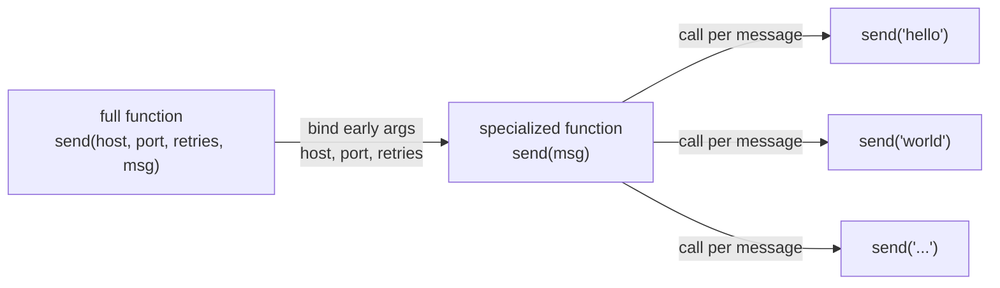

# Currying & Partial Application — Middle Level

> **Roadmap:** [Functional Programming](../README.md) → Currying & Partial Application
>
> *You already know what currying* is*. This level is about knowing* when *to reach for it — pre-binding configuration, specializing generic functions, building pipeline stages — and, just as important, when reaching for it makes code worse.*

---

## Table of Contents

1. [Introduction](#introduction)
2. [Prerequisites](#prerequisites)
3. [The One Idea That Makes It Useful](#the-one-idea-that-makes-it-useful)
4. [Practical Use 1 — Pre-Binding Configuration & Dependencies](#practical-use-1--pre-binding-configuration--dependencies)
5. [Practical Use 2 — Specializing a Generic Function](#practical-use-2--specializing-a-generic-function)
6. [Practical Use 3 — Building Pipeline Stages](#practical-use-3--building-pipeline-stages)
7. [Practical Use 4 — Adapting Arity for `map` and Composition](#practical-use-4--adapting-arity-for-map-and-composition)
8. [Per-Language Idioms](#per-language-idioms)
9. [Currying for Composition and `map`](#currying-for-composition-and-map)
10. [When It Helps vs When It Hurts](#when-it-helps-vs-when-it-hurts)
11. [Common Mistakes](#common-mistakes)
12. [Test Yourself](#test-yourself)
13. [Cheat Sheet](#cheat-sheet)
14. [Summary](#summary)
15. [Further Reading](#further-reading)
16. [Related Topics](#related-topics)

---

## Introduction

> Focus: **using it well.** Mechanics at the [junior level](junior.md); judgment here.

At the junior level you learned the definitions. **Currying** rewrites an *n*-argument function as a chain of one-argument functions: `add(a, b)` becomes `add(a)(b)`. **Partial application** fixes *some* arguments of a function now and supplies the rest later: given `add(a, b)`, partial application produces `add5 = add(5, _)`, a new one-argument function waiting for `b`.

That distinction matters less in practice than you'd think. Outside the few languages where every function is curried by default (Haskell, OCaml), what you almost always *want* is the **partial-application outcome**: *a smaller, more specialized function, configured once and called many times.* Currying is one mechanism that gives you that; a manually returned closure is another; a library helper is a third. The middle-level skill is recognizing the **shape of problem** these techniques solve and picking the lightest tool your language offers.

This file walks through four recurring situations where pre-binding arguments earns its keep, the idiomatic way to do it in **Python**, **Go**, and **Java**, and — critically — the readability cliff you fall off when you curry things that didn't need it.

---

## Prerequisites

- **Required:** You can read [`junior.md`](junior.md) — you understand closures, what currying *is*, and the `f(a)(b)` vs `f(a, b)` distinction.
- **Required:** Comfort with [first-class & higher-order functions](../01-first-class-and-higher-order-functions/middle.md) — passing and returning functions is the substrate for everything here.
- **Helpful:** Familiarity with [composition](../05-composition/middle.md) and [`map` / `filter` / `reduce`](../04-map-filter-reduce/middle.md); partial application exists largely to *feed* those tools.
- **Helpful:** You've felt the pain of threading the same config object through ten function calls. That pain is what this technique removes.

---

## The One Idea That Makes It Useful

Every practical use below is a variation on a single move:

> **Split a function's arguments into two groups — the ones that are known early and rarely change (configuration, dependencies, policy) and the ones that arrive late and vary per call (the data). Bind the first group once; call with the second group many times.**



The early/late split is the whole game. When the split is **natural and stable** — a database handle, a logging level, an API base URL — pre-binding produces clean, reusable, testable functions. When you force a split that doesn't exist in the domain, you get obscure code. Keep that test in mind through every example: *is there a real early/late boundary here, or am I inventing one?*

---

## Practical Use 1 — Pre-Binding Configuration & Dependencies

The most valuable use. A function needs both *infrastructure* (a connection, a client, a config) and *per-call data*. Threading the infrastructure through every call site is noise; binding it once removes that noise.

**Python** — `functools.partial` is the canonical tool:

```python
import logging
from functools import partial

def log(level: int, logger: logging.Logger, message: str) -> None:
    logger.log(level, message)

# Bind the early args (level + logger) once, at wiring time:
app_logger = logging.getLogger("app")
info  = partial(log, logging.INFO,  app_logger)
warn  = partial(log, logging.WARNING, app_logger)

# Call sites stay focused on the late arg — the message:
info("user signed in")
warn("rate limit approaching")
```

`info` and `warn` are ordinary callables. Nothing downstream knows or cares that a logger was baked in — that's the point. The dependency is *captured*, not *passed*.

**Go** has no `partial`, but a function returning a closure is the idiomatic equivalent and reads cleanly:

```go
// makeLogger binds the early dependencies; the returned func takes only the message.
func makeLogger(level string, out io.Writer) func(string) {
    return func(msg string) {
        fmt.Fprintf(out, "[%s] %s\n", level, msg)
    }
}

info := makeLogger("INFO", os.Stdout)
warn := makeLogger("WARN", os.Stderr)

info("user signed in")
warn("rate limit approaching")
```

This is everywhere in idiomatic Go: middleware constructors, HTTP handler factories, option builders. Go programmers rarely *say* "partial application," but `makeX(deps) func(args)` is exactly that.

**Java** uses method references or a captured-field approach; `Function` chaining works but a small factory method is usually clearer:

```java
// A factory that pre-binds level + logger and returns a Consumer over the message.
static Consumer<String> logger(Level level, Logger log) {
    return msg -> log.log(level, msg);
}

Consumer<String> info = logger(Level.INFO,    appLog);
Consumer<String> warn = logger(Level.WARNING, appLog);

info.accept("user signed in");
warn.accept("rate limit approaching");
```

> **Why this beats a global.** Each specialized function carries its own bound config, so two parts of the system can hold differently-configured versions (a verbose logger here, a quiet one there) without a shared global. It's dependency injection done with a closure instead of a constructor.

---

## Practical Use 2 — Specializing a Generic Function

You have one general function and you keep calling it with the same leading argument. Pre-bind that argument to mint a named, intention-revealing specialization.

The textbook example is `add`:

```python
from functools import partial

def add(a, b):
    return a + b

increment = partial(add, 1)   # add(1, _)
add_tax   = partial(add, 0.0)  # placeholder; see below for the real-world version

increment(10)   # 11
```

That toy is *too* small to justify itself (`lambda x: x + 1` is just as clear), so look at a realistic one — a generic validator specialized into named rules:

```python
def in_range(low, high, value):
    return low <= value <= high

is_valid_percentage = partial(in_range, 0, 100)
is_valid_hour       = partial(in_range, 0, 23)

is_valid_hour(25)   # False
```

`is_valid_hour` reads at the call site like a domain concept, not a generic range check. **That naming win is the real payoff** — you've turned a parameterized utility into vocabulary.

**Go** — specialize a comparator or predicate by binding the bound:

```go
func atLeast(min int) func(int) bool {
    return func(n int) bool { return n >= min }
}

isAdult := atLeast(18)
isAdult(21)   // true
```

**Java** — `Function` chaining lets you specialize *and* extend in one expression. Here `andThen`/`compose` build a specialized transform from generic pieces:

```java
Function<Integer, Integer> times    = n -> n * 10;          // generic
Function<Integer, Integer> plusOne   = n -> n + 1;
Function<Integer, Integer> scaleThenBump = times.andThen(plusOne);

scaleThenBump.apply(4);   // (4*10)+1 = 41
```

`andThen` and `compose` are Java's first-class support for gluing single-arg functions — the natural partners of partial application (you partially-apply to *reach* single-arg form, then chain).

---

## Practical Use 3 — Building Pipeline Stages

A data pipeline is a sequence of single-argument transforms: `data → stage1 → stage2 → stage3`. But real stages need configuration (a threshold, a key, a format). Partial application turns a *configurable* multi-arg transform into a *single-arg pipeline stage*.

```python
from functools import partial, reduce

def threshold(limit, xs):      return [x for x in xs if x >= limit]
def take(n, xs):               return xs[:n]
def scale(factor, xs):         return [x * factor for x in xs]

# Configure each stage once → each becomes a one-arg function of the data:
stages = [
    partial(threshold, 10),
    partial(scale, 2),
    partial(take, 3),
]

def run(data, stages):
    return reduce(lambda acc, stage: stage(acc), stages, data)

run([3, 12, 8, 40, 25, 11], stages)   # threshold≥10 → scale×2 → take 3 → [24, 80, 50]
```

Each `partial(...)` "locks in" the policy (limit 10, factor 2, count 3) and exposes a uniform `xs -> xs` interface. The pipeline runner doesn't need to know any stage's config — it just feeds data through. **This uniformity is what lets stages live in a list and be reordered, added, or removed freely.**

**Go** — pre-configured stages as a slice of `func([]int) []int`:

```go
func threshold(min int) func([]int) []int {
    return func(xs []int) []int {
        out := xs[:0:0]
        for _, x := range xs {
            if x >= min { out = append(out, x) }
        }
        return out
    }
}

stages := []func([]int) []int{ threshold(10), /* scale(2), take(3) ... */ }
data := []int{3, 12, 8, 40}
for _, stage := range stages {
    data = stage(data)
}
```

The factory `threshold(min)` is partial application; the resulting `func([]int) []int` is a uniform stage. Same structure as Python, just spelled with explicit closures.

---

## Practical Use 4 — Adapting Arity for `map` and Composition

`map`, `filter`, and `compose` all demand **single-argument** functions. Your real function takes two or three. Partial application is the adapter that bridges the gap — it's the most common *mechanical* reason to reach for it.

```python
from functools import partial

def clamp(low, high, x):
    return max(low, min(high, x))

readings = [-5, 50, 130, 70]

# map needs a one-arg fn; clamp takes three. Bind low+high, expose x:
normalized = list(map(partial(clamp, 0, 100), readings))
# [0, 50, 100, 70]
```

Without partial application you'd write `map(lambda x: clamp(0, 100, x), readings)` — fine for one use, but `partial(clamp, 0, 100)` is reusable and names better when assigned (`normalize = partial(clamp, 0, 100)`).

> **Argument order is the catch.** `functools.partial` binds from the **left**. So the argument you want to *vary* (the `x` that `map` supplies) must come **last** in the signature — hence `clamp(low, high, x)`, not `clamp(x, low, high)`. Design your function signatures with "config first, data last" and partial application stays painless. Fight that order and you'll reach for `partial`'s keyword binding or a `lambda` wrapper. (Curried languages like Haskell make this ordering a deliberate API-design discipline.)

```python
# When the varying arg isn't last, bind by keyword instead:
def clamp(x, low, high): ...
normalize = partial(clamp, low=0, high=100)   # x still free
```

---

## Per-Language Idioms

The *idea* is universal; the *idiom* is not. Use what your language makes natural rather than importing another language's spelling.

| Language | Primary tool | Notes |
|---|---|---|
| **Python** | `functools.partial` | Binds left-to-right; supports keyword binding; produces a real callable with introspectable `.func`/`.args`. A `lambda` is fine for one-offs. |
| **Go** | Closure-returning function (`func makeX(cfg) func(arg)`) | No language `partial`; this *is* the idiom. Ubiquitous in middleware and option constructors. |
| **Java** | `Function`/`BiFunction` + `andThen`/`compose`; or a factory method returning a functional interface | True currying (`Function<A, Function<B, R>>`) is legal but verbose and rarely idiomatic; prefer a small factory method. |

### Python: `partial` vs `lambda`

```python
from functools import partial

# Equivalent for one call site:
f1 = partial(send, "smtp.example.com", 587)
f2 = lambda msg: send("smtp.example.com", 587, msg)
```

Prefer `partial` when: the result is reused or stored, you want a recognizable/introspectable object, or you're binding by name. Prefer `lambda` when: it's a throwaway used once, or the varying argument isn't in a position `partial` can reach cleanly. Neither is "more functional" — pick for clarity.

### Go: the closure factory

Go has no generics-free `partial` and the community doesn't want one. The honest, greppable form is a named factory:

```go
func withTimeout(d time.Duration) func(*http.Client) {
    return func(c *http.Client) { c.Timeout = d }
}
```

If you find yourself wanting *deep* currying in Go (`f(a)(b)(c)(d)`), that's a smell — it reads as un-Go-like. One level (`config → data`) is idiomatic; more is not.

### Java: chaining vs currying

```java
// Idiomatic: factory returns a single-arg functional interface.
static Predicate<Integer> atLeast(int min) { return n -> n >= min; }

// Legal but usually NOT idiomatic — full manual currying:
static Function<Integer, Function<Integer, Integer>> add =
    a -> b -> a + b;
int six = add.apply(2).apply(4);   // verbose; avoid unless an API demands it
```

Java's sweet spot is `Function` composition (`andThen`, `compose`) on already-single-arg functions, with factory methods producing those single-arg functions. Reserve manual currying for the rare case an API actually expects a curried shape.

---

## Currying for Composition and `map`

Composition (`f ∘ g`) only type-checks when each function takes one argument and returns one value. The whole reason currying shows up alongside [composition](../05-composition/middle.md) is that **it converts multi-argument functions into the single-argument form composition requires.**

```python
from functools import partial, reduce

def compose(*funcs):
    return reduce(lambda f, g: lambda x: f(g(x)), funcs)

def multiply(factor, x): return factor * x
def add(amount, x):      return x + amount

# Each is 2-arg; partial-apply the config to reach 1-arg form, THEN compose:
price_with_markup = compose(
    partial(add, 5),        # +5
    partial(multiply, 2),   # ×2
)

price_with_markup(10)   # (10 × 2) + 5 = 25
```

Note the order: `compose` applies right-to-left, so `multiply` runs first. Each `partial` produces a `x -> x` function; `compose` glues them. Without the partial step, neither `multiply` nor `add` would fit into the pipeline at all. This is the most important conceptual link in the whole topic: **partial application is the on-ramp to composition.**

The same is true for `map` (shown in [Use 4](#practical-use-4--adapting-arity-for-map-and-composition)) — `map` *is* composition's cousin, and both want functions of one argument.

---

## When It Helps vs When It Hurts

This is the heart of the middle level. Pre-binding arguments is a sharp tool; over-using it is one of the most common ways functional-leaning code becomes unreadable.

### It helps when…

- **There's a genuine early/late split.** Config/dependencies known at wiring time; data arriving per call. (Uses 1–3.)
- **You're adapting arity** for `map`/`filter`/`compose`. (Use 4.)
- **The specialization deserves a name.** `is_valid_hour` reads better than an inline range check.
- **The bound arguments are stable.** A base URL, a logging level, a connection pool — things that don't change per call.

### It hurts when…

- **You curry everything by reflex.** Turning every two-arg function into `f(a)(b)` adds indirection with no payoff. *Currying everything is a smell* — readers now trace a chain of returned closures to understand a simple call.
- **The argument split is arbitrary.** If `a` and `b` arrive together and vary together, splitting them into `f(a)(b)` invents a boundary the domain doesn't have.
- **Deep chains obscure the call.** `validate(rules)(ctx)(input)(opts)` forces the reader to mentally re-assemble what a single `validate(rules, ctx, input, opts)` would have said plainly.
- **It fights the language.** Manual three-level currying in Go or Java reads as foreign. One level of "config → data" is idiomatic; three is showing off.
- **It hides where errors come from.** A bug in a deeply partial-applied chain produces a stack trace pointing at an anonymous closure several bindings removed from the real call site.

> **The litmus test:** *Does pre-binding remove repetition or add indirection?* If the same arguments are threaded through many calls, binding them once **removes repetition** — do it. If you're splitting a single cohesive call just because you *can*, you're **adding indirection** — don't. When in doubt, a plain multi-argument call with all arguments visible is the most readable default; reach for partial application when repetition or arity-adapting justifies it.

---

## Common Mistakes

1. **Currying for its own sake.** Rewriting `add(a, b)` as `add(a)(b)` everywhere because it looks "functional." It adds a layer of calls and closures for zero benefit. Curry/partial when there's a real early/late split, not as a default style.
2. **Wrong argument order for left-binding.** In Python, `functools.partial` binds from the left, so the varying argument must be last. Designing `clamp(x, low, high)` then trying `partial(clamp, 0, 100)` binds `x` and `low`, not `low` and `high`. Put config first, data last — or bind by keyword.
3. **Capturing a mutable variable in a loop.** A closure that pre-binds a loop variable captures the *variable*, not its value-at-creation, in several languages. Bind the value explicitly (Python: default-arg trick or `partial`; Go pre-1.22: copy the loop var) or every specialized function ends up sharing the last value.
4. **Deep currying that buries the call site.** `f(a)(b)(c)(d)` makes a four-argument call unreadable and makes stack traces point at anonymous closures. Keep it to one binding level in mainstream languages.
5. **Forgetting `partial` produces a *new* object, not a method.** `partial(obj.method, x)` captures `obj` at bind time; if `obj`'s state changes later, the bound version may behave unexpectedly. Bind values you intend to freeze.
6. **Reaching for `partial` when a `lambda` is clearer (or vice versa).** For a single throwaway, `lambda x: f(cfg, x)` is often more readable than `partial(f, cfg)`; for a reused, named, introspectable specialization, `partial` wins. Choose by clarity, not by which is "more FP."

---

## Test Yourself

1. What's the practical difference between *currying* and *partial application*, and why does the distinction usually not matter in Python/Go/Java?
2. You call `clamp(0, 100, x)` inside a `map`. Rewrite the call using `functools.partial`, and explain why `clamp`'s parameter order matters.
3. Give a Go example of "partial application" without using the word — and name two real Go situations where this pattern appears.
4. Why does partial application show up so often *next to* function composition? What problem does it solve for `compose`?
5. Name three signs that currying/partial application is *hurting* readability rather than helping.
6. A teammate has rewritten every two-argument utility in the module as `f(a)(b)`. What's your review feedback, and what's the rule of thumb you'd offer?

<details>
<summary>Answers</summary>

1. **Currying** transforms `f(a, b, c)` into a chain of one-arg functions `f(a)(b)(c)`; **partial application** fixes some arguments now and returns a function awaiting the rest. The distinction rarely matters in these languages because what you actually want is the *outcome* — a smaller specialized function — and a returned closure (`makeX(cfg) func(arg)` in Go, a factory method in Java) or `functools.partial` (Python) gives you that without anyone caring which formal mechanism produced it.
2. `from functools import partial; normalize = partial(clamp, 0, 100); list(map(normalize, xs))`. It works only because `clamp(low, high, x)` puts `x` **last** and `partial` binds from the **left** — so `partial(clamp, 0, 100)` fixes `low`/`high` and leaves `x` free. If `x` came first you'd have to bind by keyword or wrap in a `lambda`.
3. `func makeLogger(level string, out io.Writer) func(string) { return func(msg string){...} }` — bind the early deps, return a one-arg function. It appears in **HTTP middleware constructors** (`func Logging(next http.Handler) http.Handler`) and **functional-options / handler factories** (`func WithTimeout(d) func(*Client)`).
4. Composition requires single-argument functions (`f ∘ g` only works when each takes one value and returns one). Real functions take config plus data. Partial application pre-binds the config, producing the single-argument shape `compose` needs — it's the on-ramp that lets multi-arg functions enter a pipeline.
5. (a) Deep chains like `f(a)(b)(c)(d)` that you must mentally re-assemble to understand; (b) an argument split that doesn't match the domain (args that arrive and vary together being forced apart); (c) stack traces / errors that point at anonymous closures several bindings away from the real call site. (Also: currying applied uniformly with no early/late justification.)
6. Feedback: currying *everything* is a smell — it adds closure indirection and obscures call sites without removing any repetition. The rule of thumb: **pre-bind arguments only when there's a genuine early/late split (config bound once, data varying per call) or when adapting arity for `map`/`compose`.** Otherwise a plain multi-argument call with all arguments visible is more readable. Ask of each case: *does this remove repetition or add indirection?*

</details>

---

## Cheat Sheet

| Situation | Reach for partial application? | Idiom |
|---|---|---|
| Same config/deps threaded through many calls | **Yes** — bind once | Py `partial(f, cfg)`; Go `makeX(cfg) func(arg)`; Java factory → `Consumer`/`Function` |
| Need a named domain specialization | **Yes** | `is_valid_hour = partial(in_range, 0, 23)` |
| Building reorderable pipeline stages | **Yes** — uniform `data -> data` | `partial(stage, cfg)` per stage |
| Adapting a 2/3-arg fn for `map`/`compose` | **Yes** — config first, data last | `map(partial(clamp, 0, 100), xs)` |
| Two cohesive args that arrive together | **No** — invents a fake split | plain `f(a, b)` |
| "Make it functional" with no early/late split | **No** — currying everything is a smell | plain call with visible args |
| Deep `f(a)(b)(c)(d)` chain | **No** — buries the call site | one binding level max in Go/Java/Python |

**Three rules:**
- *Config first, data last* — so left-binding (`partial`, closures) stays painless.
- *Bind once when args are stable and repeated; otherwise pass them plainly.*
- *Does it remove repetition or add indirection?* — the question that decides every case.

---

## Summary

- Practically, currying and partial application both aim at one thing: **turning a general function into a specialized one by binding the arguments known early, leaving the varying data for later.** The formal distinction matters less than the early/late split.
- **Four high-value uses:** pre-binding **config/dependencies** (a closure-captured logger or client), **specializing** a generic function into named domain vocabulary, building reorderable **pipeline stages**, and **adapting arity** so multi-arg functions fit `map`/`filter`/`compose`.
- **Per-language idioms differ:** Python's `functools.partial` (or a `lambda`), Go's closure-returning factory (`makeX(cfg) func(arg)`), Java's factory methods plus `Function` chaining (`andThen`/`compose`). Use the native idiom; don't transplant another language's spelling.
- Partial application is the **on-ramp to composition** — it produces the single-argument functions `compose` and `map` demand.
- **Judgment is the skill:** pre-bind to *remove repetition* and *adapt arity*; don't curry by reflex. Deep chains, arbitrary splits, and language-fighting currying all hurt readability. *Currying everything is a smell.*
- Next: [`senior.md`](senior.md) — currying in API design, point-free style and its limits, performance/allocation costs of closures, and how curried interfaces shape library ergonomics.

---

## Further Reading

- *Structure and Interpretation of Computer Programs* — Abelson & Sussman — higher-order procedures and procedural abstraction, the foundation under this technique.
- *Functional Programming in Scala* — Chiusano & Bjarnason — currying, partial application, and how they enable combinator libraries.
- **Python docs** — `functools.partial` and `functools.partialmethod` — semantics of left-binding and keyword binding.
- *Why Functional Programming Matters* — John Hughes (1990) — why gluing small functions together (which partial application enables) is the core of FP's power.

---

## Related Topics

- [First-Class & Higher-Order Functions](../01-first-class-and-higher-order-functions/middle.md) — closures and returned functions, the mechanism underneath every example here.
- [Composition](../05-composition/middle.md) — partial application's main customer; it produces the single-arg functions composition needs.
- [Map / Filter / Reduce](../04-map-filter-reduce/middle.md) — the trio that demands single-argument functions and pulls in arity-adapting.
- [Pure Functions & Referential Transparency](../02-pure-functions-and-referential-transparency/middle.md) — specialized functions are easiest to reason about when the bound arguments are immutable.
- [Bad Structure](../../anti-patterns/01-development/01-bad-structure/middle.md) — flag arguments and over-abstraction; "currying everything" belongs in the same family of indirection smells.
