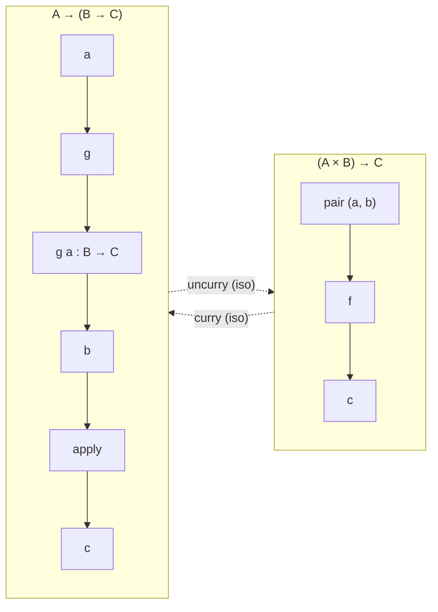
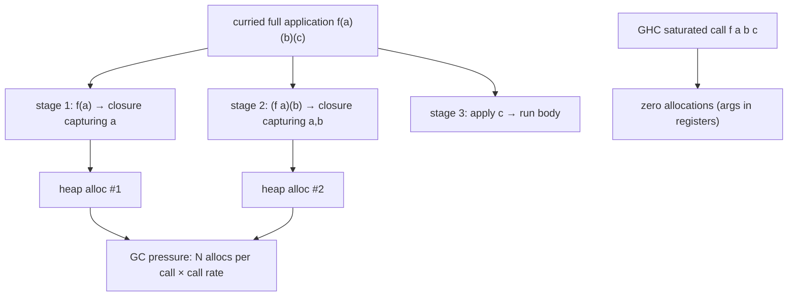

# Currying & Partial Application — Professional Level

> **Roadmap:** [Functional Programming](../README.md) → Currying & Partial Application
>
> *Essence: currying is a type-level isomorphism `(A×B)→C ≅ A→(B→C)`; at runtime, on every platform except a curry-native compiler like GHC, each intermediate stage is **a closure allocation**. This file is about where that allocation is free, where it is measurable, and how to prove which case you have.*

---

## Table of Contents

1. [Introduction](#introduction)
2. [Prerequisites](#prerequisites)
3. [The Curry/Uncurry Isomorphism & Lambda-Calculus Roots](#the-curryuncurry-isomorphism--lambda-calculus-roots)
4. [How GHC Compiles Currying — Eval/Apply, Arity, and PAPs](#how-ghc-compiles-currying--evalapply-arity-and-paps)
5. [Closure Allocation Cost Everywhere Else](#closure-allocation-cost-everywhere-else)
6. [Measurement: timeit, Go bench, JMH](#measurement-timeit-go-bench-jmh)
7. [When Currying Costs Nothing — and When It Doesn't](#when-currying-costs-nothing--and-when-it-doesnt)
8. [Common Mistakes](#common-mistakes)
9. [Test Yourself](#test-yourself)
10. [Cheat Sheet](#cheat-sheet)
11. [Summary](#summary)
12. [Further Reading](#further-reading)
13. [Related Topics](#related-topics)

---

## Introduction

> Focus: **theory + runtime cost.** What currying *means* in type theory and lambda calculus, how a curry-native compiler (GHC) makes it free, and what the *exact* per-stage cost is on the runtimes you actually ship — CPython, the JVM, the Go runtime — measured, not asserted.

Earlier levels established the shape: `f(a)(b)(c)` instead of `f(a, b, c)`, and *why* it helps — specialization, pipeline-building, point-free composition. This file goes one layer down, to the place where currying stops being a notation and becomes a sequence of heap allocations.

The professional insight is in two halves:

1. **Currying is free where the compiler is built for it.** In Haskell every function is curried by definition, and GHC's eval/apply machinery makes a fully-applied curried call cost the same as a flat call. The intermediate `A→(B→C)` is a compile-time artifact, not a runtime object — *unless* you genuinely partially apply, in which case GHC allocates a single well-understood object called a PAP.
2. **Currying is a closure allocation where the compiler is not built for it.** In Python, Java, and Go, `curry(f)(a)` produces a real heap object capturing `a`. Each further stage produces another. In a hot loop that allocates per iteration, this is GC pressure the flat call never had. Whether it *matters* is a measurement question — often it's noise; sometimes it's 2–4× ns/op and a tripled allocation rate.

> **The discipline is the same as everywhere in performance work:** never argue from intuition. Every cost below comes with the tool that proves it on *your* code — `timeit`/`pyperf` for Python, `testing.B` + `benchstat` + `-gcflags=-m` for Go, JMH + `-prof gc` for the JVM. Illustrative numbers are labeled as such; your job is to reproduce them.

---

## Prerequisites

- **Required:** Fluent with [`senior.md`](senior.md) — you can decide *when* currying improves a design and refactor toward or away from it under real constraints.
- **Required:** Solid model of closures as heap objects: a closure is a function pointer plus a captured environment, and capturing a value usually means allocating. See [First-Class & Higher-Order Functions → professional](../01-first-class-and-higher-order-functions/professional.md).
- **Required:** You can read a `benchstat` / JMH comparison and a Go escape-analysis dump (`-gcflags=-m`) and tell a real regression from noise.
- **Helpful:** Working mental model of a managed runtime — heap vs stack, a generational/tracing GC, JIT inlining and escape analysis. The big-o-analysis, profiling-techniques, and memory-leak-detection skills supply the measurement vocabulary.
- **Helpful:** Passing familiarity with lambda calculus (terms are unary functions) and with GHC's runtime, though both are explained below.

---

## The Curry/Uncurry Isomorphism & Lambda-Calculus Roots

Currying is named after Haskell Curry, but the idea is Schönfinkel's: **a function of two arguments is interchangeable with a function of one argument that returns a function of one argument.** As a type-level statement this is a genuine isomorphism — a pair of total, mutually inverse conversions:

```
curry   : ((A × B) → C) → (A → (B → C))
uncurry : (A → (B → C)) → ((A × B) → C)

curry (uncurry g) ≡ g          uncurry (curry f) ≡ f
```

The two function spaces `(A×B)→C` and `A→(B→C)` are isomorphic: any program written against one can be mechanically translated to the other with no loss of information. This is the **exponential law** of types, `C^(A×B) ≅ (C^B)^A` — currying is that algebraic identity made executable.



The reason this matters beyond elegance is the **lambda calculus**, the formal core every functional language descends from. In the pure lambda calculus there is no such thing as a multi-argument function: every abstraction `λx. e` binds exactly one variable. A "two-argument" function is *defined* as `λx. λy. e` — a function returning a function. Application is left-associative: `f a b` means `(f a) b`. So currying is not a feature bolted onto lambda calculus; **it is the only way the calculus expresses multiple arguments at all.** Multi-argument application is the special case (sugar), and the curried form is primitive.

This is why Haskell's syntax has *no* multi-argument functions. `f :: Int -> Int -> Int` is `Int -> (Int -> Int)`; `f 2 3` is `(f 2) 3`. The arrow `->` associates right; application associates left; the two conventions are designed to make `f 2 3` read naturally while *meaning* the curried form. Partial application is then not a library function — it is just "stop applying arguments early," which falls out of the calculus for free.

Contrast the practical languages. Python, Go, and Java have **native multi-argument functions** as the primitive and *no* native currying. There, `curry` and partial application are library constructs (`functools.partial`, a hand-written closure, a `Function<A,Function<B,C>>`) layered on top of an uncurried calling convention. That mismatch — curried *idea* on an uncurried *runtime* — is precisely the source of the allocation cost in the next two sections.

---

## How GHC Compiles Currying — Eval/Apply, Arity, and PAPs

If currying were inherently expensive, Haskell — where *everything* is curried — would be unusably slow. It isn't, because GHC's runtime is engineered around currying. Understanding how is the cleanest way to see what the *other* runtimes are paying for.

### Arity and the fully-applied fast path

Every GHC function has a known **arity** — the number of arguments it expects before its body can run. GHC's calling convention uses the **eval/apply** model: the *caller* inspects the function's arity and decides how to call it. (The historical alternative, push/enter, made the callee decide; eval/apply won because it optimizes the common case — see Marlow & Peyton Jones, *"Making a Fast Curry."*)

The common case is a **saturated** (fully-applied) call: you supply exactly as many arguments as the arity. For `f :: Int -> Int -> Int`, the call `f 2 3` supplies both arguments at once. GHC compiles this to a *single* call passing both arguments in registers — **no intermediate `Int -> Int` closure is ever built.** The curried type is a compile-time fiction here; at runtime `f 2 3` is as cheap as a flat two-argument call in C. The `A→(B→C)` isomorphism is real in the type system and *erased* in the generated code.

### PAPs — the cost of genuine partial application

The intermediate object appears only when you *actually* partially apply — supply fewer arguments than the arity:

```haskell
add :: Int -> Int -> Int
add x y = x + y

inc :: Int -> Int
inc = add 1        -- genuine partial application: arity 2 function, 1 argument
```

Here `add 1` cannot run `add`'s body (it needs two arguments), so GHC allocates a **PAP** — a *Partial APplication* object on the heap. A PAP stores a pointer to the function (`add`) and the arguments supplied so far (`1`). When the remaining argument arrives, the runtime's generic-apply code combines them and enters `add`. A PAP is a small, uniform heap object: it is the *one* allocation GHC makes for currying, and it makes it only when you truly stop early.

```
Saturated call   f 2 3      → no allocation, args in registers, enter f directly
Partial appl.    add 1      → one PAP allocated {fun: add, args: [1], need: 1 more}
Over-application g 2 3       → enter g (arity 1), get back a function, apply it to 3
```

So GHC's answer to "what does currying cost?" is precise:

- **Fully applied:** nothing. The curried type is erased; arguments pass in registers.
- **Partially applied:** exactly one PAP per partial application, a small uniform heap object the GC understands well. This is the irreducible cost of building a specialized function — and it's the *same* cost you'd pay to build a closure by hand in any language.

The lesson that transfers to Python/Go/Java: the expensive operation is not "currying" in the abstract — it is **materializing an intermediate function that captures arguments.** GHC makes that materialization free when it's unnecessary (saturated calls) and minimal when it's necessary (one PAP). The other runtimes have no saturated-call fast path for curried functions, so they materialize an object at *every* stage. That difference is the whole story.

---

## Closure Allocation Cost Everywhere Else

On CPython, the JVM, and the Go runtime, there is no eval/apply machinery and no PAP. A curried function is built out of ordinary closures, and **each partial application allocates a closure capturing the bound arguments.** Here is the cost, language by language, with the mechanism made explicit.

### Python — `functools.partial` vs a hand-written closure vs direct

```python
from functools import partial

def add3(a, b, c):
    return a + b + c

# 1. Direct call — no extra object.
add3(1, 2, 3)

# 2. functools.partial — allocates a `partial` object holding func + frozen args.
#    On call, it rebuilds the argument list (merges stored args/kwargs with new
#    ones) and invokes the underlying function. Implemented in C (fast), but it
#    is still an allocation plus an argument-merge on every construction/call.
inc_pair = partial(add3, 1)          # heap object: {func: add3, args: (1,)}
inc_pair(2, 3)

# 3. Hand-written closure — a function object capturing `a` in its cell.
def curry_add3(a):
    def with_a(b):
        def with_ab(c):
            return a + b + c          # captures a, b via cells
        return with_ab
    return with_a
curry_add3(1)(2)(3)                   # THREE function objects allocated per full call
```

The three forms have three different runtime profiles:

- **Direct** — one C-level call, zero extra Python objects.
- **`partial`** — one `partial` object (allocated when you build it). On each call it merges stored and new positional args into a fresh tuple and stored/new kwargs into a dict, then calls. Cheaper than nested Python closures because the merge loop is in C, but it is *not* free, and the per-call arg-merge is real work.
- **Nested closures** — `curry_add3(1)(2)(3)` allocates a *new function object per stage* every time you run the full chain (the inner `def`s are created on each call to their enclosing function). This is the most expensive form: three allocations and three Python-level calls instead of one.

> **Illustrative numbers (CPython 3.12, `timeit`, relative to direct = 1.0×):** direct `add3(1,2,3)` ≈ **1.0×**; `partial` built once then called ≈ **1.6×**; rebuilding `partial(add3,1)(2,3)` each iteration ≈ **2.3×**; nested `curry_add3(1)(2)(3)` each iteration ≈ **3.1×**. *Reproduce on your interpreter — the ratios shift across CPython versions and with argument count.*

### JVM — `Function<A, Function<B, C>>`

```java
// Curried: each stage is a Function whose apply() returns the next Function.
Function<Integer, Function<Integer, Function<Integer, Integer>>> add =
    a -> b -> c -> a + b + c;

int r = add.apply(1).apply(2).apply(3);   // THREE objects: each lambda capturing
                                          // its bound arg, allocated per stage
```

Each `apply` here returns a **new lambda object** capturing the argument from the enclosing stage. `a -> b -> c -> ...` is three nested lambdas; calling `add.apply(1)` allocates a lambda capturing `a`, `.apply(2)` allocates one capturing `b`, and only `.apply(3)` runs the arithmetic. That is **two heap allocations on the path to a single addition** (the innermost lambda body, plus the two intermediate captures).

Two JVM-specific nuances:

- **Capturing vs non-capturing lambdas.** A lambda that captures *no* variables is allocated once and reused (the JVM caches it). A *capturing* lambda — exactly what each curry stage is — allocates a fresh instance per capture. Currying is capture by construction, so the caching optimization never applies.
- **Escape analysis + JIT.** If the whole `add.apply(1).apply(2).apply(3)` chain is inlined and the intermediate functions provably don't escape, C2 can **scalar-replace** the captures and eliminate the allocations entirely — making a hot, monomorphic curried chain as cheap as the flat call. This is the JVM's closest analogue to GHC's saturated fast path, but it is *not* guaranteed: it requires inlining to succeed, the call site to stay monomorphic, and the objects not to escape. Confirm with `-XX:+PrintInlining` and JMH `-prof gc` (zero `gc.alloc.rate.norm` means escape analysis killed the allocations).

### Go — closures per curry level

```go
// Curried add: each call returns a closure capturing the prior argument.
func add(a int) func(int) func(int) int {
    return func(b int) func(int) int {     // closure captures a
        return func(c int) int {           // closure captures a, b
            return a + b + c
        }
    }
}
r := add(1)(2)(3)   // each stage returns a *func value*; captured vars may escape
```

Go has no JIT, so the only optimizer is the compiler's **escape analysis**, run at build time. A closure that captures variables which outlive the stack frame **escapes to the heap**:

```bash
go build -gcflags='-m -m' ./... 2>&1 | grep -E 'escapes|moved to heap'
# Typical output for the curried form:
#   ./add.go: func literal escapes to heap
#   ./add.go: moved to heap: a
```

The returned closures escape (they're returned up the stack), so `a` and `b` are heap-allocated and the closures themselves are heap objects. In a tight loop, `add(1)(2)(3)` allocates per iteration; the flat `addFlat(1, 2, 3)` allocates nothing and is trivially inlined. *However*, if the curried chain is fully applied *and* the compiler can prove it doesn't escape (e.g. the result is consumed locally and the whole thing inlines), escape analysis may keep everything on the stack — again, a case you must verify with `-m`, never assume.

### The shared shape



The structural fact: **on non-curry-native runtimes, an N-argument curried full application costs up to N−1 closure allocations** that the flat call avoids. Whether that cost is visible depends entirely on call rate and on whether the optimizer (JVM escape analysis, Go escape analysis) can erase it — which is a measurement, not a guarantee.

---

## Measurement: timeit, Go bench, JMH

The rule from [Premature Optimization](../../anti-patterns/01-development/03-over-engineering/professional.md) applies in full: **if you can't name the tool that would falsify your claim, you're guessing.** Here is how to measure currying overhead on each runtime.

### Python — `timeit` / `pyperf`

```python
import timeit
from functools import partial

def add3(a, b, c): return a + b + c
def curry_add3(a):
    return lambda b: lambda c: a + b + c

setup = "from __main__ import add3, curry_add3, partial; p = partial(add3, 1)"

direct  = timeit.timeit("add3(1, 2, 3)",        setup=setup, number=5_000_000)
prebuilt= timeit.timeit("p(2, 3)",              setup=setup, number=5_000_000)
rebuilt = timeit.timeit("partial(add3,1)(2,3)", setup=setup, number=5_000_000)
nested  = timeit.timeit("curry_add3(1)(2)(3)",  setup=setup, number=5_000_000)
print(direct, prebuilt, rebuilt, nested)
```

> **Illustrative result (CPython 3.12, ns/call, direct = baseline):** `direct` ≈ 55 ns; `p(2,3)` (partial built once) ≈ 88 ns; `partial(add3,1)(2,3)` (rebuilt each call) ≈ 127 ns; `curry_add3(1)(2)(3)` (nested closures) ≈ 170 ns. **Takeaway:** building the partial *once* and reusing it (the realistic usage) is the cheapest curried form; rebuilding it per call or using nested Python closures is where the cost climbs. Prefer `pyperf` over raw `timeit` for stable numbers (it controls for warmup and run-to-run variance).

### Go — `testing.B` + `benchstat`, with escape analysis

```go
func addFlat(a, b, c int) int { return a + b + c }
func addCurried(a int) func(int) func(int) int {
    return func(b int) func(int) int { return func(c int) int { return a + b + c } }
}

func BenchmarkFlat(b *testing.B) {
    s := 0
    for i := 0; i < b.N; i++ { s += addFlat(1, 2, 3) }
    sink = s
}
func BenchmarkCurried(b *testing.B) {
    s := 0
    for i := 0; i < b.N; i++ { s += addCurried(1)(2)(3) }
    sink = s
}
var sink int
```

```bash
go test -bench=. -benchmem -count=10 | tee new.txt
benchstat new.txt
go build -gcflags='-m' .   # confirm whether the curried closures escape
```

> **Illustrative `benchstat` (Go 1.22, amd64):**
> ```
> name        old time/op    new time/op    delta
> Flat        1.9ns ± 1%
> Curried    14.2ns ± 2%    +647%
>
> name        old alloc/op   new alloc/op
> Flat        0 B
> Curried    48 B   (3 closures)
> ```
> The flat call inlines to a couple of instructions and allocates nothing; the curried call escapes its closures to the heap (`-m` shows "escapes to heap"), allocating per iteration. **In a hot loop this is a real, ~7× regression; called a few hundred times in request setup, it is invisible.** Measure *at your call rate*.

### JVM — JMH with the GC profiler

```java
@State(Scope.Thread)
public class CurryBench {
    static int addFlat(int a, int b, int c) { return a + b + c; }
    static final Function<Integer,Function<Integer,Function<Integer,Integer>>> add =
        a -> b -> c -> a + b + c;

    @Benchmark public int flat()    { return addFlat(1, 2, 3); }
    @Benchmark public int curried() { return add.apply(1).apply(2).apply(3); }
}
```

```bash
java -jar benchmarks.jar CurryBench -prof gc   # gc.alloc.rate.norm = bytes/op
```

> **Illustrative JMH (JDK 21, C2):** `flat` ≈ 1.5 ns/op, `gc.alloc.rate.norm ≈ 0 B/op`; `curried` ≈ 2.0 ns/op *if escape analysis fires* (the chain inlines, captures are scalar-replaced, `gc.alloc.rate.norm ≈ 0 B/op`) — but if the call site is **megamorphic** or escape analysis fails, `curried` jumps to ≈ 9 ns/op with `~32 B/op` from the two intermediate lambdas. **The JVM result is bimodal:** near-free when the JIT erases the allocations, several-× slower when it can't. Boxing of `Integer` arguments compounds this — a primitive-specialized functional interface (e.g. `IntFunction`-based) avoids the autoboxing the generic `Function<Integer,…>` forces.

The cross-cutting measurement discipline: **benchmark the curried form against the flat form at the real call rate and argument types, read the allocation column (not just time), and check the optimizer's verdict** (`-gcflags=-m`, `PrintInlining`, JMH `-prof gc`) before concluding currying is "slow" or "free." It is one or the other depending on facts you can only get by measuring.

---

## When Currying Costs Nothing — and When It Doesn't

The decision rule, sharpened by the cost model above:

| Situation | Verdict | Why |
|---|---|---|
| **Haskell, saturated call** | Free | Curried type erased; args in registers (eval/apply) |
| **Haskell, genuine partial application** | One PAP | Irreducible cost of a specialized function; GC-friendly |
| **Setup / wiring code** (build a handler once, reuse) | Negligible | One allocation amortized over many calls — *this is the common, correct use* |
| **JVM hot loop, monomorphic, inlinable** | Often free | Escape analysis scalar-replaces captures — *verify with `-prof gc`* |
| **JVM, megamorphic site or boxing** | Measurable | Captures escape; `Integer` autoboxing adds allocations |
| **Go hot loop, closures escape** | Measurable (~Nx) | No JIT; escape analysis sends closures to heap per iteration |
| **Python hot inner loop, `partial`/nested rebuilt per call** | Measurable | Object construction + arg-merge per call dominates trivial bodies |

The single most important distinction is **build-once-call-many vs build-per-call.** Currying's canonical use is *configuration*: you partially apply once during setup (`logAt = log(LEVEL_INFO)`, `parseWith = parser(config)`), bind the result to a name, and call it many times. The allocation happens **once**; it is amortized to nothing. This is why currying is pervasive in well-written functional code without anyone noticing a cost — the cost is paid at the rate of *construction*, not the rate of *invocation*.

Currying only becomes a hot-loop problem when you **reconstruct the curried chain inside the loop** — rebuilding the partial every iteration instead of hoisting it out. That converts a one-time setup cost into a per-iteration allocation. The fix is almost never "stop currying"; it is "hoist the partial application out of the loop":

```python
# Costly: rebuilds the partial every iteration (allocation per row).
for row in rows:
    transform = partial(normalize, config)   # ← built N times
    out.append(transform(row))

# Free: build once, call many — the canonical currying pattern.
transform = partial(normalize, config)        # ← built once
for row in rows:
    out.append(transform(row))
```

> **The professional nuance, mirroring the structure work:** sometimes the flat uncurried call *is* the right shape — a proven hot inner loop over a trivial body, where even one closure allocation per iteration is measurable and the specialization currying buys you isn't needed. In that case, write the flat call and *comment why*. But this is the exception. For the 95% of code that runs at human or request rates, currying's allocation is amortized or optimizer-erased, and you choose between curried and flat on **clarity**, not speed. Optimize the curry away only *after* a profiler points at it — anything else is [premature optimization](../../anti-patterns/01-development/03-over-engineering/professional.md) wearing a functional costume.

---

## Common Mistakes

Professional-level mistakes — the kind that survive review because they sound sophisticated:

1. **Claiming "currying is slow" with no benchmark.** It is free in Haskell, often free on the JVM (escape analysis), and amortized to nothing in build-once-call-many code. Capture a `benchstat`/JMH/`timeit` baseline before asserting cost — and read the *allocation* column, not just time.
2. **Rebuilding the partial inside the hot loop.** The single most common real cost: `partial(f, cfg)` (or the nested-closure equivalent) reconstructed every iteration. Hoist it out — the allocation should happen at construction rate, not invocation rate.
3. **Assuming the JVM always erases the allocation.** Escape analysis fires only when the chain inlines, the site stays monomorphic, and nothing escapes. A megamorphic call site or a `Function` stored in a field defeats it. Verify with `-prof gc`; don't assume.
4. **Ignoring autoboxing on the JVM.** `Function<Integer, Function<Integer, Integer>>` boxes every `int`. The closure-allocation cost is often dwarfed by the boxing cost. Use primitive-specialized functional interfaces on hot paths.
5. **Trusting Go to keep closures on the stack.** Returned closures escape; `-gcflags=-m` will say so. Don't reason about Go allocation from intuition — read the escape-analysis output.
6. **Confusing `functools.partial` with currying.** `partial` does *partial application* (fix some args, keep an uncurried call for the rest); it does not transform `f(a,b,c)` into `f(a)(b)(c)`. They overlap but aren't the same; `partial` is also the *faster* of the two in Python because its merge loop is in C.
7. **Over-currying for its own sake.** Turning every 3-arg function into `f(a)(b)(c)` because "functional." Currying earns its place when you genuinely build specialized functions or compose point-free pipelines; gratuitous currying adds allocations and indirection for no design benefit.
8. **Forgetting the isomorphism is total.** `curry`/`uncurry` are mutual inverses — you can always go back. Choose the form that reads best at each boundary (curried for composition, uncurried for a public API callers invoke with all args) and convert at the seam; you lose nothing.

---

## Test Yourself

1. State the curry/uncurry isomorphism at the type level and explain why it is a *total* isomorphism rather than a one-way convenience.
2. Why does the pure lambda calculus have no multi-argument functions, and how does that make currying *primitive* rather than a feature?
3. In GHC, what is the difference in runtime cost between a *saturated* call `f a b c` and a *partial* application `f a`? Name the heap object the partial application allocates.
4. On the JVM, `add.apply(1).apply(2).apply(3)` sometimes allocates nothing and sometimes allocates two objects. What determines which, and which flag confirms the allocation count?
5. A colleague benchmarks a curried function in Go and finds it 7× slower than the flat version. Before accepting "currying is slow," what two things do you check, and with which tools?
6. Why is `functools.partial(f, x)` typically faster than the equivalent nested-`lambda` closure in Python, despite both being "partial application"?
7. A profiler shows a hot loop spending time in GC, and the loop body rebuilds a `partial` each iteration. What is the fix, and why does it eliminate the cost without removing the currying?

<details>
<summary>Answers</summary>

1. `curry : ((A×B)→C) → (A→(B→C))` and `uncurry : (A→(B→C)) → ((A×B)→C)`, with `curry (uncurry g) ≡ g` and `uncurry (curry f) ≡ f`. It is total because the two function spaces are isomorphic (the exponential law `C^(A×B) ≅ (C^B)^A`): every value of one type maps to a unique value of the other and back with no information loss, so any program against one form translates mechanically to the other.
2. In the pure lambda calculus an abstraction `λx. e` binds exactly one variable; there is no syntax for binding several. A "two-argument" function is *defined* as `λx. λy. e`, a function returning a function, and application is left-associative (`f a b ≡ (f a) b`). So the curried form is the only way the calculus expresses multiple arguments — multi-argument application is the derived/sugared case, making currying primitive.
3. A **saturated** call `f a b c` supplies all the arguments the arity needs, so GHC (eval/apply) passes them in registers and enters `f` directly — **zero allocation**, no intermediate `B→C` object. A **partial** application `f a` can't run the body, so GHC allocates **one PAP** (Partial APplication object) holding the function pointer and the supplied args; it's a small, uniform, GC-friendly heap object.
4. It depends on whether the JIT's **escape analysis** fires: if the whole chain inlines, the call site stays monomorphic, and the intermediate lambdas provably don't escape, C2 scalar-replaces the captures and allocates nothing; otherwise it allocates the two intermediate capturing lambdas. Confirm the count with JMH `-prof gc` (read `gc.alloc.rate.norm` in bytes/op); `-XX:+PrintInlining` shows whether the chain inlined. (Autoboxing of `Integer` can add further allocations.)
5. (a) Whether the closures **escape to the heap** — run `go build -gcflags=-m` to see "escapes to heap"/"moved to heap"; in a returned-closure curry they will. (b) The **call rate** — 7× on a trivial body in a tight loop is real, but if the function runs a few hundred times during setup the absolute cost is invisible. Confirm with `testing.B` + `benchstat -benchmem` and decide against the real workload, not the microbenchmark in isolation.
6. `partial` is implemented in C: it stores the frozen args once and, on call, merges them with the new args in a tight C loop before a single call to the underlying function. The nested-`lambda` form allocates a *new* Python function object per stage on each full invocation and makes a Python-level call per stage — more allocations and more interpreter overhead than `partial`'s single C-level merge-and-call.
7. Hoist the `partial(...)` construction **out** of the loop — build the specialized function once before the loop and call it inside. This eliminates the per-iteration allocation (the GC pressure the profiler saw) while keeping the curried/partial design intact: the cost was never "currying," it was *reconstructing* the curried function at invocation rate instead of construction rate.

</details>

---

## Cheat Sheet

| Concept | Cost / mechanism | Measure with | Rule of thumb |
|---|---|---|---|
| **Curry/uncurry** | Type-level isomorphism `(A×B)→C ≅ A→(B→C)`; total, invertible | (type system) | Choose the form that reads best at each seam; convert freely |
| **Lambda-calculus roots** | All functions unary; multi-arg is sugar | — | Currying is *primitive*, not bolted on |
| **GHC saturated call** | Zero allocation; args in registers (eval/apply) | Core dump (`-ddump-simpl`), heap profile | Full application of curried fn is free |
| **GHC partial application** | One PAP (small, uniform heap object) | `-hT` heap profile | Pay one alloc only when you genuinely specialize |
| **Python `partial`** | One C object + per-call arg-merge | `timeit` / `pyperf` | Build once, reuse; faster than nested lambdas |
| **Python nested closures** | New function object per stage, per call | `timeit` / `pyperf` | Most expensive curried form — avoid in hot loops |
| **JVM `Function<A,Function<B,C>>`** | Capturing lambda per stage; *maybe* erased by escape analysis | JMH `-prof gc`, `PrintInlining` | Monomorphic + inlined ⇒ ~free; megamorphic/boxed ⇒ measurable |
| **Go curried closures** | Closures escape to heap; alloc per call | `benchstat -benchmem`, `-gcflags=-m` | Returned closures escape; verify, never assume |
| **Build-once-call-many** | Allocation amortized to ~0 | profiler at real call rate | The canonical, free use of currying |
| **Build-per-call (in loop)** | Allocation per iteration | profiler shows GC time | Hoist the partial out of the loop |

**Three golden rules:**
- *The cost is materializing an arg-capturing intermediate function — free when saturated (GHC) or optimizer-erased (JVM), one allocation per stage otherwise.*
- *Amortization is everything: build the partial once and call it many times; the cost lives at construction rate, not invocation rate.*
- *Never call currying "slow" without a benchmark that reads the allocation column and the optimizer's verdict (`-m` / `PrintInlining` / `-prof gc`).*

---

## Summary

- **Currying is a type-level isomorphism** `(A×B)→C ≅ A→(B→C)` — total and invertible (the exponential law of types). Its lambda-calculus root is that *all* functions are unary; multi-argument functions are the derived, sugared case, so currying is primitive, not a feature.
- **GHC makes currying free where it can.** Its eval/apply calling convention passes all arguments of a **saturated** call in registers with **zero allocation**; the curried type is erased at runtime. Genuine **partial application** allocates exactly one **PAP** — a small, uniform, GC-friendly heap object — which is the irreducible cost of building a specialized function.
- **Every other runtime pays per stage.** On CPython, the JVM, and Go, a curried full application materializes an arg-capturing closure at each stage — up to N−1 heap allocations the flat call avoids. Python's `functools.partial` is the cheapest curried form (C-level merge), nested closures the most expensive; the JVM *may* erase the cost via escape analysis (only when inlined + monomorphic + non-escaping, and boxing can dominate); Go's returned closures escape to the heap unless escape analysis proves otherwise.
- **Whether it matters is a measurement, never an assumption.** Use `timeit`/`pyperf` (Python), `testing.B` + `benchstat -benchmem` + `-gcflags=-m` (Go), JMH `-prof gc` + `PrintInlining` (JVM). Read the **allocation** column and the **optimizer's verdict**, not just time/op.
- **The decisive distinction is build-once-call-many vs build-per-call.** Currying's canonical use is configuration: partially apply once during setup, call many times — the allocation amortizes to nothing. The only real hot-loop cost comes from *reconstructing* the curried chain per iteration; the fix is to hoist it out, not to abandon currying.
- **The professional nuance:** for the vast majority of code (human/request rates), curried vs flat is a *clarity* choice, not a speed one. Optimize a curry away only after a profiler points at it — and when the flat hot-loop call genuinely wins, isolate and comment it. Choosing the uncurried form "for speed" without a benchmark is premature optimization in a functional costume.

---

## Further Reading

- **"Making a Fast Curry: Push/Enter vs Eval/Apply for Higher-Order Languages"** — Marlow & Peyton Jones (2004) — the paper behind GHC's eval/apply convention and PAPs; the definitive account of how currying is compiled.
- **The Implementation of Functional Programming Languages** — Simon Peyton Jones (1987) — supercombinators, partial application, and the runtime representation of curried functions.
- **Types and Programming Languages** — Benjamin Pierce (2002) — the simply-typed lambda calculus, currying, and the exponential/isomorphism view of function types.
- **CPython `functools` source (`Modules/_functoolsmodule.c`)** — read `partial_call` to see the C-level arg-merge that makes `partial` faster than nested Python closures.
- **Optimizing Java** — Evans, Gough, Newland (2018) — escape analysis, scalar replacement, lambda allocation, and JMH/`-prof gc` methodology behind the JVM numbers here.
- **Go escape analysis** — `go build -gcflags=-m` docs and the Go compiler's `cmd/compile/internal/escape` package; the mechanism behind closures-to-heap.
- **High Performance Python** — Gorelick & Ozsvald (2nd ed., 2020) — `timeit`/`pyperf` methodology and the cost of function-call and object-allocation overhead.

---

## Related Topics

- [Currying & Partial Application → senior](senior.md) — *when* to curry as a design decision; this file is the runtime layer beneath it.
- [First-Class & Higher-Order Functions → professional](../01-first-class-and-higher-order-functions/professional.md) — closures as heap objects; the allocation model this topic builds on.
- [Composition → professional](../05-composition/professional.md) — point-free pipelines that consume curried functions; the same closure-allocation cost model applies to composed stages.
- [Recursion & Tail Calls → professional](../08-recursion-and-tail-calls/professional.md) — the other place FP's runtime cost (stack vs heap) is decided by the compiler, not the source.
- [Anti-Patterns → Premature Optimization](../../anti-patterns/01-development/03-over-engineering/professional.md) — the discipline of profiling before optimizing; the counterweight that governs every cost claim here.
- profiling-techniques · memory-leak-detection · big-o-analysis — the measurement vocabulary used throughout this file.
