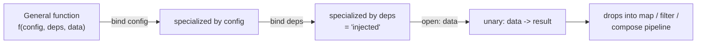
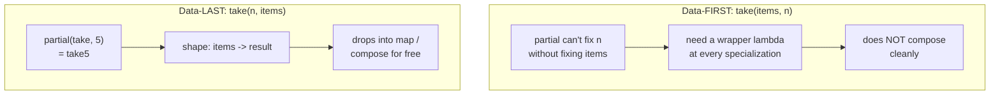
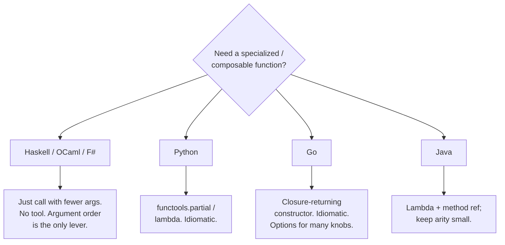

# Currying & Partial Application — Senior Level

> **Roadmap:** [Functional Programming](../README.md) → Currying & Partial Application
>
> *The mechanics are trivial — `f(a)(b)` instead of `f(a, b)`. The senior question is architectural: when does pre-binding an argument become a design tool — lightweight dependency injection, a pipeline-friendly API, a configuration mechanism — and when is it just an obscure way to confuse the next reader?*

---

## Table of Contents

1. [Introduction](#introduction)
2. [Prerequisites](#prerequisites)
3. [Partial Application as Lightweight Dependency Injection](#partial-application-as-lightweight-dependency-injection)
4. [Designing Curry-Friendly APIs: The Data-Last Convention](#designing-curry-friendly-apis-the-data-last-convention)
5. [Synergy with Composition](#synergy-with-composition)
6. [Configuration: Partial Application vs Builder vs Functional Options](#configuration-partial-application-vs-builder-vs-functional-options)
7. [Language Reality: Auto-Curried vs Manual](#language-reality-auto-curried-vs-manual)
8. [The Limits: Where Currying Hurts](#the-limits-where-currying-hurts)
9. [Common Mistakes](#common-mistakes)
10. [Test Yourself](#test-yourself)
11. [Cheat Sheet](#cheat-sheet)
12. [Summary](#summary)
13. [Further Reading](#further-reading)
14. [Related Topics](#related-topics)

---

## Introduction

> Focus: **design and architecture implications.** Not "what is currying" — you know that — but "what does the codebase look like when currying is a deliberate design choice, and when should it not be?"

At the middle level you learned the distinction precisely: **currying** transforms an *n*-ary function into a chain of *n* unary functions (`add(a, b, c)` → `add(a)(b)(c)`), while **partial application** fixes *some* arguments now and leaves the rest for later (`add(1, _, _)` → a function expecting two more). Currying is the *enabler*; partial application is the *payoff*. In an auto-curried language every function is already a partial-application machine; in Python, Go, and Java you reach for `functools.partial`, a closure, or a method reference to get the same effect.

The senior shift is to stop seeing these as cute tricks and start seeing them as **a way to pre-bind the slow-changing parts of a computation and leave the fast-changing parts open.** That single framing unifies three architectural roles:

- **Pre-bind dependencies** (a logger, a DB handle, a config object) → partial application becomes dependency injection without a framework.
- **Pre-bind configuration** (a tax rate, a base URL, a retry count) → a specialized function manufactured from a general one.
- **Leave the *data* open** → the resulting unary function drops cleanly into `map`, `filter`, and composition pipelines.

The unifying design principle behind all three is **argument order**: what you bind early and what you leave late determines whether your API composes or fights you. Get the order right and currying is invisible infrastructure; get it wrong and every call site needs a lambda wrapper to undo your decision.



This file is intentionally **theory and design** — there are no practice files for it. Read it as you would a chapter on API design, because that is what currying is at this level.

---

## Prerequisites

- **Required:** Fluency with [`middle.md`](middle.md) — you can implement currying and partial application by hand in your language, and you know why a closure is the underlying mechanism (see [First-Class & Higher-Order Functions](../01-first-class-and-higher-order-functions/senior.md)).
- **Required:** Comfort with [Composition](../05-composition/senior.md) — `compose`/`pipe`, point-free style, and why composition is the backbone of FP architecture. Currying exists largely to *feed* composition.
- **Helpful:** Familiarity with [Pure Functions](../02-pure-functions-and-referential-transparency/senior.md) — partial application is only safe as DI when the bound dependency doesn't smuggle in hidden mutable state.
- **Helpful:** Some exposure to a DI container or framework (Spring, Guice, `wire`) so you can weigh the lightweight functional alternative against the heavyweight one.

---

## Partial Application as Lightweight Dependency Injection

This is the single most important architectural insight of the topic. **Dependency injection and partial application are the same idea expressed in two paradigms.** OO injects collaborators through a constructor; FP injects them by binding leading arguments. Both separate *what a function needs* from *what a caller provides at the call site*.

Consider a function that needs a logger and a database, then operates on a user ID:

```python
# The "fat" signature — everything is a parameter, nothing is bound.
def deactivate_user(logger: Logger, db: DB, user_id: int) -> None:
    logger.info("deactivating", user_id)
    db.update("users", user_id, {"active": False})
```

The call site is noisy: every caller must thread `logger` and `db` through, even though those almost never change within a request. Partial application **closes over the slow-moving dependencies once** and hands the rest of the program a clean, single-argument function:

```python
from functools import partial

# At composition root (startup / request boundary): inject once.
deactivate = partial(deactivate_user, app_logger, app_db)

# Everywhere downstream: a unary function. The dependencies are invisible
# and unforgeable — callers literally cannot pass the wrong logger.
deactivate(42)
for uid in inactive_ids:
    deactivate(uid)            # drops straight into iteration
```

The `partial` call *is* the composition root — the one place in your program where the abstract (a function that "needs a logger and a db") meets the concrete (this specific logger and db). Everything downstream depends only on the narrow `int -> None` shape. This is exactly the dependency-inversion benefit a DI container gives you, with **zero framework, zero reflection, zero annotations.**

### Why this is genuinely DI, not just a shortcut

- **Inversion of control.** The downstream code does not construct or look up `logger`/`db`; they are *given* to it, baked in.
- **Testability.** Inject a fake at the composition root: `partial(deactivate_user, FakeLogger(), in_memory_db)`. No mocking framework, no monkey-patching.
- **Single wiring point.** Swap the implementation in exactly one place (the `partial`), the way you'd swap a binding in a DI module.

### The Go idiom: closures as constructors

Go has no `partial`, but the closure-returning constructor is *the* idiomatic Go form of this pattern, and it is everywhere in well-structured Go services:

```go
// A "constructor" that closes over dependencies and returns the
// dependency-free handler the rest of the program uses.
func NewDeactivator(logger *slog.Logger, db *DB) func(userID int) error {
    return func(userID int) error {
        logger.Info("deactivating", "user", userID)
        return db.Update("users", userID, map[string]any{"active": false})
    }
}

// Composition root:
deactivate := NewDeactivator(appLogger, appDB)
// Handlers depend on `func(int) error`, never on *slog.Logger or *DB.
```

This is partial application by another name: `NewDeactivator(logger, db)` pre-binds two arguments and returns a function awaiting the third. The "functional" and "Go service" idioms converge.

### The Java angle

Java's lambdas and method references give the same leverage, though the binding is more ceremonious:

```java
// Bind the dependencies into a Function once.
Function<Integer, Void> deactivate =
    userId -> { deactivateUser(appLogger, appDb, userId); return null; };

// Or, when the shape already matches a method, a partially-bound reference.
inactiveIds.forEach(deactivate::apply);
```

Java's standard library tops out at `BiFunction` (arity 2), which is itself a quiet argument that the language expects you to *bind down to small arities* rather than thread many parameters — exactly the partial-application discipline.

> **The senior frame:** before you reach for a DI container, ask whether the dependency graph is shallow enough that *partial application at a composition root* would do. For a CLI, a worker, or a small service, "inject by binding leading arguments" is often less machinery, more explicit, and easier to trace than a container — because the wiring is just ordinary code you can read top to bottom.

---

## Designing Curry-Friendly APIs: The Data-Last Convention

Partial application only pays off if the argument you want to leave *open* is the last one. This makes **argument order the central API-design decision** for any function you intend to specialize or compose.

The rule, drawn from Haskell and crystallized by Ramda, is **data-last**: put the **configuration / dependencies first** and the **data the function operates on last.**

```text
   f(config, deps, ..., DATA)
     \_______________/   \__/
       bind these early   leave this open
```

### Why data-last, concretely

Compare two signatures for "take the first *n* of a collection":

```python
# DATA-FIRST (the naive order): the thing you'd want to vary is bound first.
def take(items, n): ...
take5 = partial(take, ???)        # you can't bind n without also binding items!
# You're forced to write a lambda to reorder:
take5 = lambda items: take(items, 5)
```

```python
# DATA-LAST: config first, data last. Specialization is trivial.
def take(n, items): ...
take5 = partial(take, 5)          # a reusable "take 5 of anything"
take5([10, 20, 30, 40, 50, 60])   # -> [10, 20, 30, 40]
```

With data-last, `take5` is born directly from `partial`, and — crucially — it has the shape `items -> result`, which is exactly what `map` and `compose` want. With data-first you must wrap every specialization in a reordering lambda, which defeats the point. **Argument order is the difference between an API that curries naturally and one that needs adapters at every call site.**

This is why **Ramda reverses the argument order of the entire JavaScript standard library** (`R.map(fn, list)` is auto-curried so `R.map(fn)` is a ready-to-compose unary function), and why **Haskell's `Data.List` is data-last throughout** (`map :: (a -> b) -> [a] -> [b]` — the list is last, so `map f` is a partially applied function awaiting a list). The convention is not an accident; it is what makes point-free composition possible.



### The unavoidable language tension

Here is a friction every senior must hold in their head: **idiomatic object-oriented method order is the opposite of curry-friendly.** A method `list.take(5)` puts the *data* first (it's the receiver `this`/`self`) and the *config* (`5`) in the argument. That reads beautifully for fluent chaining — `list.take(5).filter(...)` — but it is data-*first*, so it does not partially-apply or compose in the point-free sense.

The resolution is to know which game you are playing:

- **Method-chaining / fluent style** (OO, builder pipelines): data-first is correct; you chain on the receiver.
- **Free-function composition / pipeline style** (FP): data-last is correct; you compose unary functions.

A library that wants both (Lodash via `lodash/fp`, Ramda) provides a **data-last, auto-curried** variant precisely so its functions can live in composition pipelines. When you design a utility module intended to be *composed*, default to **data-last**. When you design a *fluent* builder, data-first on the receiver is right. Mixing them in one API is the source of endless "why do I need a lambda here" papercuts.

---

## Synergy with Composition

Currying and [composition](../05-composition/senior.md) are co-dependent; neither delivers its full value without the other. The reason is mechanical: **`compose` and `pipe` only accept unary functions**, and currying is the factory that turns your multi-argument functions into unary ones.

```python
from functools import reduce

def pipe(*fns):
    return lambda x: reduce(lambda acc, f: f(acc), fns, x)

# Data-last, ready to specialize.
def mul(factor, x):  return x * factor
def add(amount, x):  return x + amount
def clamp(lo, hi, x): return max(lo, min(hi, x))

# Partial application manufactures the unary stages the pipeline needs.
normalize = pipe(
    partial(mul, 100),       # x -> x * 100
    partial(add, 5),         # x -> x + 5
    partial(clamp, 0, 999),  # x -> clamp(0, 999, x)
)
normalize(7)   # -> clamp(0, 999, (7*100)+5) = 705
```

Each stage is a *configured* function: `partial(mul, 100)` is "multiply by 100," a reusable, named, testable unit. The pipeline reads as a sentence because each step is unary, and each step is unary *because* currying let us bind its configuration ahead of time. This is the loop:

> **Currying produces the unary, data-last functions that composition consumes; composition is the reason currying is worth the trouble.** Study them together or neither makes sense.

In Haskell this synergy is invisible because it's the default — `pipe`/`.` operate on functions that are *already* curried, so `map (*100) . filter even` "just works" with no `partial` ceremony. In Python/Go/Java you pay a small, explicit `partial`/closure tax to reach the same place. The architectural payoff — small, named, configured, composable units — is identical.

---

## Configuration: Partial Application vs Builder vs Functional Options

A recurring senior decision: you have a general operation with many knobs, and you want to produce *specialized* versions of it. Three idioms compete, and currying sits at one end of the spectrum.

### 1. Partial application — for a few positional knobs

When a function has a small number of configuration parameters and you want a specialized variant, partial application is the lightest tool:

```python
# General retry, then specialized variants manufactured by binding config.
def retry(max_attempts, backoff, fn): ...

retry_fast   = partial(retry, 3, 0.1)    # awaits fn
retry_patient = partial(retry, 10, 2.0)
```

Cheap and clear — but it relies on **positional binding**, which degrades fast as the knob count grows. `partial(retry, 3, 0.1, True, None, 30)` is unreadable: nobody knows what `True` and `30` mean. Partial application is the right tool only while the bound parameters are **few and obviously ordered.**

### 2. The functional-options pattern — many optional knobs (Go's answer)

Go's community converged on **functional options** precisely because positional partial application doesn't scale to many optional, named settings. The insight is to make each option *itself a function* that mutates a config struct — so the variadic call site reads like named arguments, and currying reappears one level up:

```go
type Config struct {
    MaxAttempts int
    Backoff     time.Duration
    Jitter      bool
}

type Option func(*Config)

// Each option is a curried setter: WithBackoff(2*time.Second) RETURNS an Option.
// This is partial application — the value is bound now, applied later.
func WithBackoff(d time.Duration) Option { return func(c *Config) { c.Backoff = d } }
func WithJitter() Option                 { return func(c *Config) { c.Jitter = true } }

func NewRetrier(opts ...Option) *Retrier {
    cfg := Config{MaxAttempts: 3, Backoff: time.Second} // sane defaults
    for _, opt := range opts {
        opt(&cfg)
    }
    return &Retrier{cfg}
}

// Call site: named, order-independent, defaults handled, forward-compatible.
r := NewRetrier(WithBackoff(2*time.Second), WithJitter())
```

Note the connection the topic exists to make explicit: **`WithBackoff(d)` is a partially applied function.** It binds `d` now and returns an `Option` to be applied later against the config. The functional-options pattern is currying scaled up to handle *named, optional, defaultable* configuration — it solves exactly the failure mode (positional opacity) that plain partial application hits past three or four arguments.

### 3. The builder pattern — the OO equivalent

The builder (`new RetrierBuilder().maxAttempts(3).backoff(...).build()`) solves the same "many optional knobs" problem in the OO idiom, with method chaining and a terminal `build()`. It is data-first/fluent (see the [composition](#synergy-with-composition) discussion) and carries more boilerplate (a mutable builder class, a `build` step), but it gives strong IDE discoverability and can enforce required fields at compile time in some designs.

### How to choose

| Situation | Reach for |
|---|---|
| 1–3 obviously-ordered config params, want a specialized function | **Partial application** |
| Many optional, named, defaultable settings; want forward-compat | **Functional options** (Go) or a config object/record |
| OO codebase, want fluent + IDE discoverability + required-field enforcement | **Builder** |
| Config is a value you pass around and inspect | **A config struct/record** passed as one argument |

> **The throughline:** all four are answers to "how do I specialize a general operation?" Partial application is the most primitive and lightest; functional options and builders are what you graduate to when the configuration surface grows names, defaults, and optionality. A senior recognizes that **the functional-options pattern *is* partial application in a trench coat** — and picks the lightest tool the configuration complexity actually demands.

---

## Language Reality: Auto-Curried vs Manual

The ergonomics of currying vary enormously by language, and this dictates how much you should lean on it.

### Auto-curried by default: Haskell, OCaml, Elm, F#

In the ML family, **every function of multiple arguments is curried automatically.** `add :: Int -> Int -> Int` is *literally* a function returning a function; `add 3` is a valid, complete expression of type `Int -> Int`. There is no `partial` helper because partial application is just *calling a function with fewer arguments than its full chain.*

```haskell
add :: Int -> Int -> Int
add x y = x + y

addThree :: Int -> Int      -- partial application is free; no ceremony
addThree = add 3

-- data-last by convention, so this composes with zero glue:
doubleThenInc :: [Int] -> [Int]
doubleThenInc = map (+1) . map (*2)
```

```ocaml
(* OCaml: identical story. *)
let add x y = x + y
let add_three = add 3        (* partial application, no library needed *)
```

Here currying isn't a technique you apply — it's the *substrate*. Argument order is the only design lever, and the entire standard library is data-last to exploit it. The lesson to carry back to other languages: **the value of currying is real, the syntactic cost is what varies.**

### Manual everywhere else: Python, Go, Java

These languages call functions *all arguments at once*. Currying is something you *opt into* with a tool:

- **Python:** `functools.partial` (positional/keyword binding), `lambda`, or `functools.reduce`-based `curry` helpers. There is no auto-currying; `functools.partial` is the workhorse and is genuinely idiomatic.
- **Go:** no `partial`, no generics-based currying in common use. The idiom is the **closure-returning constructor** (`func New...(deps) func(data) result`). This *is* partial application, and it is pervasive and idiomatic; explicit "currying" libraries are not.
- **Java:** lambdas + method references; `Function::andThen`/`compose` for composition. Manual binding via a lambda. The stdlib caps at `BiFunction`, nudging you to keep arities tiny.

The senior judgment: **don't import Haskell's reflexive currying into a manual language.** A hand-rolled `curry()` that turns every function into a `f(a)(b)(c)` chain in Python or Java is almost always a readability liability — it surprises readers, breaks IDE parameter hints, and obscures stack traces. Use the *idiom your language blesses*: `functools.partial` in Python, closure constructors in Go, lambdas/options in Java. Reach for the *effect* (a specialized, composable function), not the Haskell *syntax*.



---

## The Limits: Where Currying Hurts

A senior is defined as much by knowing when *not* to use a technique. Currying and partial application have real costs that grow with how aggressively you apply them.

### Readability and the "what arity am I at?" problem

A long curried chain forces the reader to track *how many arguments are still expected* — invisible state the syntax doesn't surface. `f(a)(b)(c)(d)` gives no hint whether `f(a)(b)` is a usable value or a half-built call waiting for more. In a language without static types showing `Int -> Int -> Int`, this is a guessing game. **Each `()` is a place the reader must pause and reconstruct the arity.** Plain `f(a, b, c, d)` has none of this ambiguity: it either type-checks/runs or it doesn't.

### Arity confusion and silent partial application

The sharpest hazard, especially in dynamically-typed languages: **calling a curried function with too few arguments doesn't error — it silently returns a function.** A typo that drops an argument produces not a crash but a *function-valued result* that fails much later, far from the cause:

```python
# Suppose process is curried: process(a)(b)(c)
result = process(a)(b)        # oops, forgot (c)
save(result)                  # saves a FUNCTION, not a value — bug surfaces elsewhere
```

In Haskell the type checker catches this instantly (`save` expects a value, got a function). In Python/JS it slips through to runtime, often into a database or a log, and the eventual error points nowhere near the missing argument. This is a strong argument against pervasive hand-rolled currying in untyped languages.

### Debugging curried chains

- **Opaque stack traces.** A `partial` or a wrapped curry shows up in traces as a generic `functools.partial` frame or an anonymous lambda, not as the named function you wrote. Several layers of partial application turn a stack trace into a stack of `<lambda>`s.
- **Poor IDE support.** Once you've `partial`-ed a function, the IDE often stops showing you the remaining parameter names and types — you've traded a documented signature for a positional mystery.
- **Hard to inspect the bound state.** A curried function carries its bound arguments invisibly; debugging "why did this `partial` behave wrong?" means digging into closure internals.

### When to stop

| Symptom | What it signals | Fix |
|---|---|---|
| Chains deeper than ~2 applications | Readers can't track arity | Pass remaining args at once; or use a config object |
| `partial(f, True, None, 30, ...)` | Positional opacity | Switch to functional options / a config struct |
| Hand-rolled `curry()` decorator everywhere | Importing Haskell into a manual language | Use the language's blessed idiom; curry only at the call site that needs it |
| Stack traces full of `<lambda>`/`partial` | Debuggability sacrificed | Name the intermediate functions, or inline |
| Untyped language + silent partial bugs | No arity safety net | Prefer explicit calls; add type hints / asserts |

> **The senior rule of thumb:** partial-apply at the **composition root** (where dependencies/config are bound, once, with intent) and at the **point of building a pipeline** (where you're explicitly manufacturing unary stages). Resist currying *throughout* business logic in a manual language — the readability and arity-confusion tax usually exceeds the elegance dividend. In an auto-curried language the calculus flips: currying is free and idiomatic, so the only remaining design lever is getting argument order (data-last) right.

---

## Common Mistakes

1. **Data-first argument order on a function meant to be composed.** You put the data first out of OO habit, then every specialization needs a reordering lambda. *Default to data-last for free functions intended for `map`/`compose`; reserve data-first for fluent receivers.*
2. **Hand-rolling a universal `curry()` decorator in Python/Java/Go.** It surprises readers, kills IDE hints, and litters traces with anonymous frames. *Use `functools.partial`, closure constructors, and lambdas — the idiom the language blesses — not Haskell syntax transplanted.*
3. **Positional partial application past 3–4 arguments.** `partial(f, 3, 0.1, True, None)` is write-only. *Graduate to functional options or a config struct once knobs grow names and optionality.*
4. **Binding a mutable dependency and treating the result as pure.** Partial application as DI is only safe when the bound value is effectively immutable for the function's lifetime; binding a shared mutable object reintroduces hidden state and breaks the [referential transparency](../02-pure-functions-and-referential-transparency/senior.md) you thought you had.
5. **Currying deep in business logic in an untyped language.** Silent partial application turns a dropped argument into a function-valued bug that surfaces far away. *Confine currying to composition roots and pipeline construction.*
6. **Confusing currying with partial application in design discussions.** Currying is the *mechanism* (n unary functions); partial application is the *use* (fix some args now). Auto-curried languages give you both for free; manual languages usually want only partial application via a tool.
7. **Reinventing a DI container with towers of `partial`.** Three or four nested partials to wire a deep dependency graph becomes its own unreadable framework. *At that depth, a real DI mechanism or explicit struct wiring is clearer; partial-application DI shines for shallow graphs.*
8. **Ignoring that functional options *are* partial application.** Teams adopt the pattern by rote without seeing the connection, then can't reason about when a simpler `partial` or a config struct would do. *Recognize the family; pick the lightest member that fits.*

---

## Test Yourself

1. Explain, in dependency-injection terms, what `partial(handler, logger, db)` accomplishes and where in the program this call belongs.
2. A teammate writes `def take(items, n)` and complains that `partial` is useless for making a reusable `take5`. What is the design error, and what's the one-character-level fix?
3. Why do `compose`/`pipe` *require* their stages to be unary, and how does currying satisfy that requirement?
4. The Go functional-options pattern is sometimes described as "currying in disguise." Justify that claim by pointing at the specific function that performs the partial application.
5. Give two reasons pervasive hand-rolled currying is a worse idea in Python than in Haskell.
6. You have a `retry` operation with 7 optional, named, defaultable settings. Rank partial application, functional options, and a builder for this case, and say why.
7. What is the specific danger of partially applying a function over a *mutable* dependency, and how does it relate to purity?

<details>
<summary>Answers</summary>

1. It **injects** `logger` and `db` by binding them as the leading arguments, producing a function whose remaining signature is dependency-free — downstream code depends only on the narrow shape and cannot supply the wrong collaborators. The call belongs at the **composition root** (startup or the request boundary), the single place where the abstract meets the concrete, exactly like a DI container's wiring module.
2. The signature is **data-first**: with `take(items, n)`, `partial` can't fix `n` without also fixing `items`, so you're forced to write `lambda items: take(items, 5)`. The fix is to reorder to **data-last** — `def take(n, items)` — after which `partial(take, 5)` yields a reusable `take5` with the `items -> result` shape that composition wants.
3. `compose`/`pipe` thread a *single* value through each stage (`f(g(x))`), so each stage must accept exactly one argument and return one. Currying/partial application turns a multi-argument function into a unary one by **pre-binding all but the last (data) argument** — `partial(mul, 100)` is `x -> x*100` — which is precisely the unary, data-last shape the pipeline consumes.
4. `WithBackoff(2*time.Second)` performs the partial application: it **binds the value now** (`d`) and **returns an `Option` (a function) to be applied later** against the config struct inside `NewRetrier`. Each `With...` constructor is a partially applied setter; the variadic `opts ...Option` is just the list of deferred applications.
5. Any two of: (a) Python has **no static type checker by default**, so a dropped argument silently returns a *function* that fails far from the cause, whereas Haskell's checker catches the arity error immediately; (b) hand-rolled currying **breaks IDE parameter hints and litters stack traces** with anonymous `partial`/`lambda` frames; (c) it's **non-idiomatic** — Python expects `functools.partial` at a call site, not a universal `curry()` transform, so it surprises every reader; (d) Haskell is **auto-curried and data-last by design**, so currying carries zero syntactic surprise there.
6. **Functional options (best)** or a config object — they handle named, optional, defaultable settings with order-independence and forward-compat. **Builder (good in OO)** — same scaling benefit, fluent, IDE-discoverable, but more boilerplate. **Partial application (worst here)** — positional binding of 7 args is write-only and opaque; it's the wrong tool once knobs have names and optionality.
7. If the bound dependency is **mutable and shared**, the partially-applied function's behavior depends on hidden, changeable state — it is no longer [referentially transparent](../02-pure-functions-and-referential-transparency/senior.md), so equal inputs can produce unequal outputs depending on *when* it's called. Partial-application-as-DI is only sound when the bound value is effectively immutable for the function's lifetime (a logger, a connection pool you don't reconfigure) — otherwise you've reintroduced exactly the hidden state FP was avoiding.

</details>

---

## Cheat Sheet

| Concept | One-line takeaway |
|---|---|
| **Currying** | Transform `f(a,b,c)` into `f(a)(b)(c)` — the *enabler* of partial application. |
| **Partial application** | Fix some arguments now, leave the rest — the *payoff*; this is the architectural tool. |
| **Partial application = DI** | Bind slow-moving deps (logger, db, config) at a composition root; downstream depends only on the open shape. |
| **Data-last** | Config/deps first, data last → specializations are born from `partial` and compose for free. |
| **Data-first** | Receiver/data first → right for *fluent* OO chaining, wrong for free-function composition. |
| **Curry ↔ compose** | Currying manufactures the unary stages that `pipe`/`compose` require; learn them together. |
| **Functional options** | Partial application scaled up for *many named/optional* knobs (Go idiom). `With...(v)` is a deferred setter. |
| **Builder** | OO equivalent of functional options: fluent, discoverable, more boilerplate. |
| **Auto-curried langs** | Haskell/OCaml/F# — currying is free; argument order (data-last) is the only lever. |
| **Manual langs** | Python `functools.partial`, Go closure constructors, Java lambdas — use the blessed idiom, not transplanted Haskell. |
| **Where to curry** | At the composition root and at pipeline construction — *not* throughout business logic in a manual language. |
| **Top hazard** | Silent partial application: too few args returns a *function*, not an error (deadly in untyped languages). |

**Three golden rules:**
- *Partial application is dependency injection without a framework — bind deps/config at the composition root, leave data open.*
- *Argument order is the design decision: data-last for things you compose, data-first for fluent receivers.*
- *Reach for the effect (a specialized, composable function), not Haskell's syntax — use your language's blessed idiom, and stop currying before arity becomes a guessing game.*

---

## Summary

- **Partial application is lightweight dependency injection.** Binding leading arguments (logger, db, config) at a **composition root** inverts control, aids testability, and centralizes wiring — the DI benefit with no framework. Go's closure-returning constructor and Python's `functools.partial` are the idiomatic forms.
- **Argument order is the load-bearing API decision.** The **data-last** convention (config/deps first, data last) is what lets `partial` manufacture reusable, composable unary functions. Data-first is correct for *fluent* receivers, wrong for *free-function composition* — and mixing them causes endless lambda-wrapper papercuts. Ramda and Haskell are data-last *on purpose*.
- **Currying and composition are co-dependent.** `compose`/`pipe` only accept unary functions; currying is the factory that produces them. Neither delivers its value without the other.
- **Configuration scales through a family of related tools.** Partial application (few positional knobs) → functional options / config structs (many named/optional knobs) → builders (OO, fluent). The **functional-options pattern *is* partial application scaled up** — each `With...(v)` is a deferred, partially-applied setter.
- **Language reality dominates ergonomics.** Auto-curried languages (Haskell, OCaml, F#) make currying free, so argument order is the only lever; manual languages (Python, Go, Java) want the *effect* via their own idioms, not transplanted `f(a)(b)(c)` syntax.
- **The limits are real:** arity confusion, silent partial application (a dropped argument returns a *function*, not an error — dangerous without a type checker), opaque stack traces, and lost IDE hints. **Curry at composition roots and pipeline construction; not throughout business logic in a manual language.**

---

## Further Reading

- **Thinking Functionally with Haskell** — Richard Bird — currying as the substrate of an auto-curried language; why data-last is the convention.
- **Ramda documentation** ("Why Ramda?" / "Thinking in Ramda" by Randy Coulman) — the canonical argument for data-last, auto-curried APIs designed for composition.
- **"Functional Options for Friendly APIs"** — Dave Cheney (2014) — the foundational write-up of Go's functional-options pattern; read it seeing the partial application underneath.
- **Structure and Interpretation of Computer Programs** — Abelson & Sussman — higher-order functions, procedures that return procedures, and the closure-as-object insight that underlies partial-application DI.
- **Real World OCaml** — Minsky, Madhavapeddy, Hickey — currying and partial application in a pragmatic ML, with the design trade-offs discussed candidly.
- **Mostly Adequate Guide to Functional Programming** — Brian Lonsdorf — currying, partial application, and point-free composition in JavaScript, with the readability caveats made explicit.

---

## Related Topics

- [Currying & Partial Application — middle.md](middle.md) — the mechanics: how to curry/partial-apply by hand in each language, the closure underneath.
- [First-Class & Higher-Order Functions](../01-first-class-and-higher-order-functions/senior.md) — closures are the mechanism that makes partial application possible.
- [Composition](../05-composition/senior.md) — `compose`/`pipe`, point-free style; the consumer of the unary functions currying produces.
- [Pure Functions & Referential Transparency](../02-pure-functions-and-referential-transparency/senior.md) — why partial-application-as-DI is only safe over effectively-immutable dependencies.
- [Map / Filter / Reduce](../04-map-filter-reduce/senior.md) — the prototypical consumers of data-last, partially-applied unary functions.
- [Functional vs OO in Practice](../11-functional-vs-oo-in-practice/senior.md) — the broader frame for partial-application-DI vs constructor-DI, and functional options vs builders.
- [Clean Code → Pure Functions](../../clean-code/15-pure-functions/README.md) — the everyday-code view of small, configured, composable functions.
