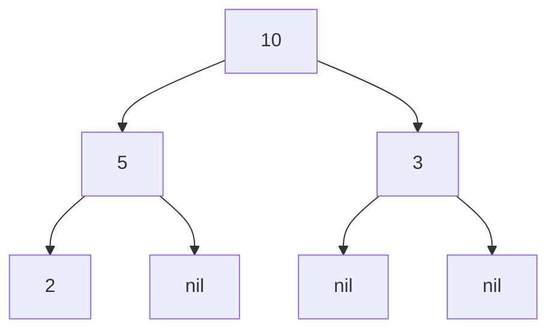
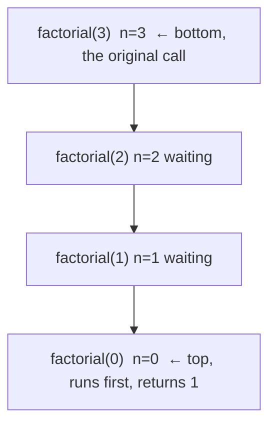

# Recursion & Tail Calls — Junior Level

> **Roadmap:** [Functional Programming](../README.md) → Recursion & Tail Calls
>
> *Recursion is a function defined in terms of itself: solve the smallest case directly, then express every bigger case as "one step plus the same problem, slightly smaller." It's how functional code expresses repetition without a mutable loop counter.*

---

## Table of Contents

1. [Introduction](#introduction)
2. [Prerequisites](#prerequisites)
3. [Glossary](#glossary)
4. [Anatomy of Recursion](#anatomy-of-recursion)
5. [Recursion vs Loops](#recursion-vs-loops)
6. [Worked Example: Factorial](#worked-example-factorial)
7. [Worked Example: Sum & List Length](#worked-example-sum--list-length)
8. [Worked Example: Tree Traversal](#worked-example-tree-traversal)
9. [The Call Stack: Where Recursion Lives](#the-call-stack-where-recursion-lives)
10. [Stack Depth & Stack Overflow](#stack-depth--stack-overflow)
11. [A First Look at Tail Calls](#a-first-look-at-tail-calls)
12. [Common Mistakes](#common-mistakes)
13. [Test Yourself](#test-yourself)
14. [Cheat Sheet](#cheat-sheet)
15. [Summary](#summary)
16. [Further Reading](#further-reading)
17. [Related Topics](#related-topics)

---

## Introduction

> Focus: **What is recursion, and why does the functional world reach for it instead of a loop?**

A **recursive** function is one that calls itself. That sounds circular — and it would be, if not for one rule: each call must work on a *smaller* version of the problem, and there must be a smallest version that the function answers directly without calling itself again. When those two pieces are in place, the function spirals inward to the simplest case, then unwinds back out with the answer.

Here is the whole idea in one sentence: **to solve a problem, solve a slightly smaller version of it and combine that with one small step of work.** "Sum of a list" becomes "first element plus the sum of the rest." "Factorial of `n`" becomes "`n` times the factorial of `n-1`." The problem shrinks each time until it can't shrink anymore.

Why does functional programming lean on this so heavily? Because the alternative — a `for` loop — relies on **mutating a counter and an accumulator** (`i++`, `total += x`). FP prefers values that don't change once created (see [Immutability](../03-immutability/junior.md)). Recursion lets you express "do this, then do it again on what's left" *without ever reassigning a variable.* In pure functional languages like Haskell, recursion isn't a stylistic choice — it's the only way to loop, because there is no mutable counter to increment.

At the junior level your goal is to **read a recursive function and trace it by hand**, recognize the two parts every recursion needs, and understand the one thing that can go catastrophically wrong: running out of stack.

---

## Prerequisites

- **Required:** You can write and call functions in at least one language (examples here use Python, Go, and Java, with a short Haskell aside).
- **Required:** You understand `if`/`else` and how a function returns a value.
- **Helpful:** You've written a `for` or `while` loop — recursion is easiest to grasp by contrast with the loop you already know.
- **Helpful:** A rough sense that calling a function "costs" something — a tiny bit of memory each time. That cost is the whole story behind stack overflow.

---

## Glossary

| Term | Definition |
|------|-----------|
| **Recursion** | A function that solves a problem by calling itself on a smaller input. |
| **Base case** | The smallest input the function answers *directly*, without recursing. The stopping condition. Every recursion needs at least one. |
| **Recursive case** | The branch where the function calls itself on a smaller problem and combines the result with one step of work. |
| **Call stack** | The runtime's stack of in-progress function calls. Each call that hasn't returned yet sits on it, waiting. |
| **Stack frame** | The slice of memory for *one* call: its arguments, local variables, and where to return to. One frame per active call. |
| **Stack overflow** | The error you get when recursion goes so deep the call stack runs out of room. The program crashes. |
| **Recursion depth** | How many calls are stacked up at the deepest point — i.e. how tall the tower of frames gets. |

---

## Anatomy of Recursion

Every correct recursive function has exactly two ingredients. Miss either one and it breaks.

1. **A base case** — the input so small the answer is obvious, returned directly. This is the *brake*. Without it, the function calls itself forever.
2. **A recursive case** — does a tiny bit of work, then calls itself on a **strictly smaller** input. This is the *engine*. The "strictly smaller" part guarantees you eventually hit the base case.

```python
def countdown(n):
    if n == 0:           # BASE CASE — stop here, return directly
        return
    print(n)             # one small step of work
    countdown(n - 1)     # RECURSIVE CASE — same function, smaller input
```

Read it as a promise: *"If `n` is 0, I'm done. Otherwise I'll print `n` and trust a smaller `countdown` to handle the rest."* The trust is the mental trick — you don't have to imagine all the calls at once. You assume the recursive call already works for `n-1`, and you only check that **(a)** the base case is right and **(b)** each step gets closer to it.

> **The two questions for any recursion:** *What's the smallest case I can answer outright?* (base case) and *Does every recursive call move toward that case?* (progress). If both answers are solid, the function terminates.

---

## Recursion vs Loops

A loop and a recursion can compute the exact same thing. They differ in *how* they remember their progress.

| | Loop (imperative) | Recursion (functional) |
|---|---|---|
| **Progress tracked by** | A mutable variable you reassign (`i`, `total`) | The argument passed to the next call |
| **Repetition driven by** | `for` / `while` re-running the body | The function calling itself |
| **Stopping condition** | Loop condition becomes false | Base case is reached |
| **State** | Changes in place (mutation) | New value per call (no mutation) |
| **Memory** | Constant — one set of variables | Grows with depth — one frame per call |

Sum of a list, both ways:

```python
# Loop: a mutable `total` that we keep reassigning.
def sum_loop(xs):
    total = 0
    for x in xs:
        total = total + x      # mutation: total changes on each pass
    return total

# Recursion: no mutable state — each call gets the rest of the list.
def sum_rec(xs):
    if not xs:                 # base case: empty list sums to 0
        return 0
    return xs[0] + sum_rec(xs[1:])   # head + sum of the tail
```

The loop *changes* `total` five times. The recursion never changes anything — it builds the answer out of return values. That alignment with immutability is why recursion is the natural loop of functional programming.

> **Not a competition.** Loops aren't "wrong." In Python, Go, and Java a loop is usually the *better* engineering choice for simple iteration (clearer, and no stack-depth risk — see below). Recursion shines when the *problem itself is recursive* — trees, nested structures, divide-and-conquer. The point of this topic is to make recursion a tool you reach for confidently, not to retire the loop.

---

## Worked Example: Factorial

`n!` (n-factorial) means `n × (n-1) × (n-2) × … × 1`, and `0! = 1` by definition. That definition is *already* recursive: `n! = n × (n-1)!`.

```python
def factorial(n):
    if n == 0:                  # base case
        return 1
    return n * factorial(n - 1) # recursive case
```

Let's trace `factorial(3)` by hand. The calls go **down** (winding up), each one waiting on the next:

```
factorial(3) = 3 * factorial(2)        ← waiting on factorial(2)
                   factorial(2) = 2 * factorial(1)   ← waiting on factorial(1)
                                       factorial(1) = 1 * factorial(0)  ← waiting
                                                           factorial(0) = 1   ← BASE CASE, returns directly
```

Now the answers come **back up** (unwinding), each waiting call finishing its multiplication:

```
factorial(0) → 1
factorial(1) → 1 * 1 = 1
factorial(2) → 2 * 1 = 2
factorial(3) → 3 * 2 = 6
```

The key insight: `factorial(3)` could not finish until `factorial(2)` returned, which could not finish until `factorial(1)` returned, and so on. **Four calls were alive at the same time**, stacked up, each pausing to wait for the one below it. Hold that picture — it's exactly what the call stack does.

The same in Go and Java:

```go
// Go
func factorial(n int) int {
    if n == 0 {
        return 1
    }
    return n * factorial(n-1)
}
```

```java
// Java
static long factorial(int n) {
    if (n == 0) return 1;
    return n * factorial(n - 1);
}
```

---

## Worked Example: Sum & List Length

The same shape — *head + recurse on the tail* — solves a whole family of list problems. Once you see it, you see it everywhere.

**Sum of a list** (Go, using slicing):

```go
func sum(xs []int) int {
    if len(xs) == 0 {       // base case: empty slice
        return 0
    }
    return xs[0] + sum(xs[1:])   // first + sum of the rest
}
```

**Length of a list** — count without `len`, to show the structure clearly (Python):

```python
def length(xs):
    if not xs:              # base case: empty list has length 0
        return 0
    return 1 + length(xs[1:])   # 1 (for the head) + length of the tail
```

Notice both functions share the identical skeleton:

```
if the list is empty:  return the "nothing" answer (0)
otherwise:             combine the head with <recurse on the tail>
```

Only the *combine* step differs — `+ value` for sum, `+ 1` for length. This is the recursive list pattern, and recognizing it lets you write `product`, `max`, `count_matches`, and dozens more by changing one line. (When you meet [map / filter / reduce](../04-map-filter-reduce/junior.md), you'll see they're this same pattern packaged as reusable functions.)

---

## Worked Example: Tree Traversal

Lists are *linearly* recursive — one tail to recurse into. Trees are where recursion stops being a stylistic choice and becomes the natural fit, because a tree node points to **two (or more) smaller trees**. A loop has to manage an explicit stack to walk a tree; recursion gets it for free.

```python
class Node:
    def __init__(self, value, left=None, right=None):
        self.value = value
        self.left = left
        self.right = right

def tree_sum(node):
    if node is None:                 # base case: empty subtree contributes 0
        return 0
    return (node.value               # this node
            + tree_sum(node.left)    # everything in the left subtree
            + tree_sum(node.right))  # everything in the right subtree
```

For this tree, `tree_sum(root)` visits every node:



The trace branches instead of running in a straight line: `tree_sum(10)` needs the left subtree `tree_sum(5)` *and* the right subtree `tree_sum(3)`; `tree_sum(5)` in turn needs `tree_sum(2)`. Each `None` child is the base case returning `0`. Total: `10 + 5 + 2 + 3 = 20`.

> **Why this is the headline use of recursion:** the *data* is defined recursively — "a tree is a value plus two smaller trees" — so the *code* that matches its shape is recursive too. The function reads almost exactly like the definition of a tree. That structural match is the deepest reason FP loves recursion. You'll go far deeper in Tree Traversals.

---

## The Call Stack: Where Recursion Lives

Every time *any* function is called — recursive or not — the runtime pushes a **stack frame**: a small block of memory holding that call's arguments, local variables, and the address to return to when it finishes. When the function returns, its frame is popped off and discarded.

For a recursive function, the frames pile up because each call makes another call *before* it finishes. At the deepest point of `factorial(3)`, four frames are stacked:



Read it bottom-up as *time*: `factorial(3)` was called first (bottom frame), then it called `factorial(2)`, which called `factorial(1)`, which called `factorial(0)` (top frame). The top frame is the base case — it returns without adding a frame, and the stack unwinds: pop `factorial(0)`, finish `factorial(1)`, pop it, finish `factorial(2)`, and so on down to the original call.

The crucial fact: **the maximum height of this tower equals the recursion depth.** `factorial(3)` peaks at 4 frames. `factorial(1000)` would peak at 1001 frames. The stack is a finite region of memory, and that's the seed of the next section.

---

## Stack Depth & Stack Overflow

The call stack is **not infinite**. Each language reserves a fixed (configurable) amount of memory for it. Every active call consumes a frame; pile up too many and you exhaust that memory — a **stack overflow**, which crashes the program (or panics, or throws).

Roughly how deep can you go before it breaks? It varies by language, frame size, and configuration, but as a junior-level mental model:

| Language | Approx. default recursion depth before failure | What happens |
|---|---|---|
| **Python** | ~1000 (a deliberate limit, not raw memory) | `RecursionError: maximum recursion depth exceeded` |
| **Java** | ~10,000–20,000 (depends on frame size & `-Xss`) | `StackOverflowError` |
| **Go** | very deep (stacks grow dynamically), but bounded | `fatal error: stack overflow` |

Watch Python refuse a deep call:

```python
def depth(n):
    if n == 0:
        return 0
    return 1 + depth(n - 1)

depth(100)      # fine → 100
depth(100_000)  # RecursionError: maximum recursion depth exceeded
```

Python's limit is intentional — a guardrail you can inspect with `import sys; sys.getrecursionlimit()` (default 1000). It exists *because* unbounded recursion would otherwise crash the interpreter messily.

**What this means in practice:** recursion is safe and elegant when the depth is bounded and modest — walking a tree that's 30 levels deep, processing a list of 500 items. It becomes dangerous when depth scales with input size and that size can be large: summing a million-element list by recursing one element at a time will overflow long before it finishes.

There are two cures, and you'll meet both at the next level:

1. **Use a loop** for simple linear iteration where depth would grow large. (Often the right call in Python/Go/Java.)
2. **Tail-call optimization** — restructure the recursion so the runtime can reuse a single frame. Previewed next.

---

## A First Look at Tail Calls

A **tail call** is a recursive call that is the *very last thing* a function does — there's no leftover work waiting for its result.

Look closely at our `factorial`:

```python
return n * factorial(n - 1)   # NOT a tail call
```

After `factorial(n - 1)` returns, the caller still has to **multiply by `n`**. That pending multiplication is exactly why the frame can't be discarded — it has to stick around to finish the job. Hence the growing stack.

Now an **accumulator** version, where the running total is carried *into* the call:

```python
def factorial(n, acc=1):
    if n == 0:
        return acc                 # base case returns the accumulated answer
    return factorial(n - 1, acc * n)   # TAIL call — nothing left to do after it
```

Here the recursive call is the last action — its result *is* the answer, with no pending multiplication. A language with **tail-call optimization (TCO)** notices this and reuses the current frame instead of pushing a new one, turning the recursion into something that runs in constant stack space — effectively a loop in disguise.

The catch for *your* languages: **Python, Go, and Java do not perform TCO.** Writing a tail-recursive `factorial` in Python still overflows at depth 1000, because Python pushes a frame anyway. TCO is a property of the *language/runtime*, not just the code shape.

> **Haskell aside.** In Haskell — and Scala, Scheme, Erlang, and other languages built around recursion — tail calls *are* optimized. A tail-recursive loop there runs forever in constant stack space, which is why these languages can use recursion as their *only* looping construct without ever worrying about overflow:
> ```haskell
> -- Haskell: tail-recursive sum with an accumulator. Runs in constant stack space.
> sumList :: [Int] -> Int
> sumList = go 0
>   where go acc []     = acc
>         go acc (x:xs) = go (acc + x) xs   -- tail call, optimized into a loop
> ```

Why introduce this now, before you can use it? So you understand the *shape* and the *constraint*: the accumulator pattern is the bridge from "elegant but stack-hungry" recursion to "elegant and safe" recursion — but only where the runtime cooperates. The full treatment, including how to write iterative-style recursion in TCO-less languages, is in [`middle.md`](middle.md).

---

## Common Mistakes

1. **Missing or unreachable base case.** The number-one recursion bug. With no base case — or a base case the input can never reach — the function calls itself forever and overflows the stack immediately.
   ```python
   def bad(n):
       return n + bad(n - 1)   # no base case → infinite recursion → crash
   ```
   Always ask first: *what is the smallest input, and does it return directly?*

2. **A recursive case that doesn't shrink the problem.** Even with a base case, you must move *toward* it. `factorial(n)` calling `factorial(n)` (or `factorial(n + 1)`) never reaches `0`.
   ```python
   def stuck(n):
       if n == 0: return 1
       return n * stuck(n)     # n never changes → never reaches base case
   ```

3. **Recursing on input that can grow without bound.** A tail-less recursion over a million-element list *is correct* but will overflow. Match the tool to the depth: deep linear recursion → use a loop; recursive *data* (trees) → recursion is fine because depth is the tree height, not the element count.

4. **Forgetting to `return` the recursive call.** In a non-tail recursion you usually need to *use* the returned value. Calling `factorial(n - 1)` without `return n *` (or assigning it) silently throws the answer away.

5. **Assuming the accumulator trick fixes overflow in any language.** It only helps where the runtime does TCO. In Python, Go, and Java it does **not** — a tail-recursive function still grows the stack. The fix there is a loop, not a clever recursion shape.

6. **Wrong base value.** Sum of an empty list is `0`; *product* of an empty list is `1`; length is `0`. A base case that returns the wrong "nothing" value poisons every result that builds on it.

---

## Test Yourself

1. What two ingredients does every correct recursive function need, and what does each one prevent?
2. Trace `factorial(4)` by hand. List the calls on the way down and the returned values on the way back up.
3. Why does the call stack grow with recursion depth? What is stored in a single stack frame?
4. Convert this loop to a recursive function:
   ```python
   def count_positive(xs):
       n = 0
       for x in xs:
           if x > 0:
               n += 1
       return n
   ```
5. Is `return helper(n - 1, acc + n)` a tail call? Is `return n + helper(n - 1)` a tail call? Explain the difference.
6. You write a perfectly correct tail-recursive function in Python to sum a list of 100,000 numbers, and it crashes with `RecursionError`. Why — and what should you use instead?

<details>
<summary>Answers</summary>

1. A **base case** (the smallest input answered directly — prevents infinite recursion / stack overflow) and a **recursive case that shrinks the input** (guarantees progress toward the base case so the function terminates). Missing the first → it never stops; failing the second → it never reaches the stop.

2. Down (winding up): `factorial(4) = 4 * factorial(3)`, `factorial(3) = 3 * factorial(2)`, `factorial(2) = 2 * factorial(1)`, `factorial(1) = 1 * factorial(0)`, `factorial(0) = 1` (base case). Up (unwinding): `0→1`, `1→1`, `2→2`, `3→6`, `4→24`. Answer: **24**.

3. Because each recursive call is made *before* the current one finishes, so every in-progress call must stay on the stack waiting. A single **stack frame** holds that call's arguments, its local variables, and the return address (where to resume when it returns).

4. ```python
   def count_positive(xs):
       if not xs:                       # base case
           return 0
       head = 1 if xs[0] > 0 else 0     # one step of work
       return head + count_positive(xs[1:])   # recurse on the tail
   ```

5. `return helper(n - 1, acc + n)` **is** a tail call — the recursive call is the last action and its result is returned directly, with nothing pending. `return n + helper(n - 1)` is **not** — after `helper` returns, there's still an `n +` addition to perform, so the frame can't be discarded. The pending work after the call is exactly what makes a call non-tail.

6. Python **does not do tail-call optimization**, so it pushes a new stack frame for every call regardless of the function's shape; 100,000 deep blows past the ~1000 default limit. Use an **iterative loop** (or `sum(xs)`) instead — recursion depth must scale with input size here, which Python's stack can't absorb.

</details>

---

## Cheat Sheet

| Concept | Key point |
|---|---|
| **Recursion** | A function that calls itself on a smaller input. |
| **Base case** | Smallest input, answered directly. The stopping condition — *required.* |
| **Recursive case** | One step of work + a call on a *strictly smaller* input. Must make progress. |
| **Mental model** | "Solve the small version, combine with one step." Trust the recursive call works. |
| **Call stack** | One frame per active call; depth = number of stacked frames at the deepest point. |
| **Stack overflow** | Recursion too deep → runs out of stack memory → crash. |
| **List pattern** | `if empty: return base; else: combine(head, recurse(tail))`. |
| **Tree pattern** | `if nil: return base; else: combine(node, recurse(left), recurse(right))`. |
| **Tail call** | Recursive call is the *last* action, nothing pending after it. Enables TCO. |
| **TCO reality** | Haskell/Scheme/Scala: yes. **Python, Go, Java: no** — use a loop for deep linear iteration. |

> **One rule to remember:** *Every recursion needs a base case and a step that shrinks toward it. Recursion is the right tool when the data is recursive (trees); a loop is often the right tool when it isn't.*

---

## Summary

- **Recursion** solves a problem by reducing it to a smaller version of itself: a **base case** answered directly, plus a **recursive case** that does one step and calls itself on a strictly smaller input.
- It's the **functional alternative to loops** — it expresses repetition through return values instead of mutating a counter, which is why immutable, pure code reaches for it. In Haskell it's the *only* way to loop.
- The classic shapes — `factorial`, list `sum`/`length`, and tree traversal — all reduce to "combine one element with the result of recursing on what's left." Trees are the standout case, because the *data itself* is recursive.
- Recursion runs on the **call stack**: every active call holds a **stack frame**, so recursion depth equals stack height. Go too deep and you get a **stack overflow** — a crash, not a wrong answer.
- A **tail call** (recursive call with nothing pending after it) can run in constant stack space *if the language does TCO* — Haskell/Scheme/Scala do, but **Python, Go, and Java do not**, so deep linear recursion in those languages should be a loop.
- Next: [`middle.md`](middle.md) — the accumulator pattern, converting recursion to iteration, when each form is the right engineering choice, and how runtimes do (or fake) tail-call optimization.

---

## Further Reading

- **Structure and Interpretation of Computer Programs** — Abelson & Sussman, Ch. 1.2 ("Procedures and the Processes They Generate") — the definitive treatment of recursive vs iterative processes and why tail recursion matters.
- **The Little Schemer** — Friedman & Felleisen — learns recursion by doing, one tiny step at a time; the best book for *feeling* how recursion works.
- **Grokking Algorithms** — Aditya Bhargava, Ch. 3 ("Recursion") and Ch. 4 ("Divide & Conquer") — illustrated, beginner-friendly, with the call-stack picture front and center.
- **Haskell Programming from First Principles** — Allen & Moronuki, the recursion chapter — recursion as the native loop in a pure language, with tail recursion made concrete.

---

## Related Topics

- [Functional Programming → Immutability](../03-immutability/junior.md) — *why* FP avoids the mutable loop counter that recursion replaces.
- [Functional Programming → Map / Filter / Reduce](../04-map-filter-reduce/junior.md) — the recursive list pattern, packaged as reusable higher-order functions.
- [Functional Programming → First-Class & Higher-Order Functions](../01-first-class-and-higher-order-functions/junior.md) — functions as values, the foundation under both recursion and the FP toolkit.
- [Functional Programming → Algebraic Data Types](../06-algebraic-data-types/junior.md) — recursive *data* (lists, trees) is what makes recursive *code* read so naturally.
- [Recursion & Tail Calls → `middle.md`](middle.md) — accumulators, recursion-to-iteration, and tail-call optimization in depth.
